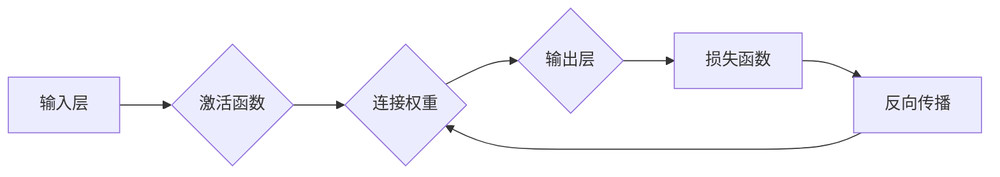

# 神经网络：人类与机器的共存

> 关键词：神经网络，深度学习，人工智能，机器学习，人机交互，智能进化

## 1. 背景介绍

自20世纪50年代以来，人工智能（AI）领域经历了多次兴衰。近年来，随着计算能力的提升和大数据的涌现，深度学习（Deep Learning）成为推动AI发展的关键动力。神经网络（Neural Networks）作为深度学习的基础，其模仿人脑神经元结构和功能的设计理念，使得机器能够像人类一样学习和处理复杂信息。

本文旨在探讨神经网络技术如何推动人类与机器的共存，从核心概念、算法原理、实际应用、未来展望等多个维度，展现神经网络技术在AI领域的巨大潜力和深远影响。

## 2. 核心概念与联系

### 2.1 核心概念

#### 神经元

神经元是神经网络的基本单元，类似于人脑中的神经元。它通过突触接收输入信号，经过激活函数处理后产生输出信号，并传递给下一个神经元。

#### 网络层

神经网络由多个网络层组成，包括输入层、隐藏层和输出层。输入层接收外部输入，隐藏层负责特征提取和特征组合，输出层产生最终结果。

#### 激活函数

激活函数为神经网络提供非线性特性，使模型能够学习复杂关系。常见的激活函数有ReLU、Sigmoid、Tanh等。

#### 损失函数

损失函数用于评估模型的预测结果与真实值之间的差异，指导模型优化参数。常见的损失函数有均方误差（MSE）、交叉熵（CE）等。

#### 反向传播算法

反向传播算法是一种优化算法，通过计算梯度来调整模型参数，使损失函数最小化。

### 2.2 Mermaid 流程图



### 2.3 核心概念联系

神经网络通过神经元、网络层、激活函数、损失函数和反向传播算法等核心概念，实现输入到输出的映射过程，进而完成学习、推理和预测等任务。

## 3. 核心算法原理 & 具体操作步骤

### 3.1 算法原理概述

神经网络通过模拟人脑神经元的工作原理，实现从输入到输出的映射过程。其主要原理包括：

1. 神经元之间的连接权重调整。
2. 通过激活函数引入非线性特性。
3. 使用损失函数评估模型性能。
4. 利用反向传播算法调整参数。

### 3.2 算法步骤详解

1. **初始化参数**：设定神经网络的结构，包括层数、每层的神经元数量、连接权重和偏置。
2. **前向传播**：将输入数据传递到神经网络，经过各层的激活函数处理，最终输出预测结果。
3. **计算损失**：使用损失函数计算预测结果与真实值之间的差异。
4. **反向传播**：计算损失函数对网络参数的梯度，并利用梯度下降等优化算法调整参数。
5. **更新参数**：根据梯度下降算法更新网络参数，使模型性能逐渐提升。

### 3.3 算法优缺点

**优点**：

1. 强大的非线性建模能力。
2. 能够学习复杂的非线性关系。
3. 广泛应用于各个领域，如图像识别、语音识别、自然语言处理等。
4. 适应性强，可以通过调整网络结构、优化算法等方式改进性能。

**缺点**：

1. 计算量大，需要大量计算资源。
2. 对初始参数敏感，需要谨慎选择。
3. 梯度消失和梯度爆炸问题。
4. 难以解释模型的决策过程。

### 3.4 算法应用领域

神经网络在以下领域取得了显著成果：

1. **图像识别**：如人脸识别、物体检测、图像分割等。
2. **语音识别**：如语音转文字、语音识别、语音合成等。
3. **自然语言处理**：如机器翻译、文本分类、情感分析等。
4. **推荐系统**：如电影推荐、商品推荐、新闻推荐等。
5. **自动驾驶**：如车道线检测、行人检测、障碍物检测等。

## 4. 数学模型和公式 & 详细讲解 & 举例说明

### 4.1 数学模型构建

神经网络可以表示为一个函数 $f$，该函数将输入向量 $x$ 映射到输出向量 $y$：

$$
y = f(x)
$$

其中，$f$ 由多个层组成，包括输入层、隐藏层和输出层。每个层由一系列神经元组成，每个神经元都通过激活函数将输入转换为输出。

### 4.2 公式推导过程

以下以多层感知机（MLP）为例，介绍神经网络的基本公式推导过程。

假设神经网络由两个隐藏层和一个输出层组成，输入层和输出层神经元数量分别为 $m$ 和 $n$，隐藏层神经元数量为 $k$。

**前向传播**：

1. 输入层到第一隐藏层的激活函数：

$$
z_1^{(1)} = W_{1}x + b_1
$$

$$
h_1^{(1)} = \sigma(z_1^{(1)})
$$

其中，$W_1$ 是输入层到第一隐藏层的连接权重，$b_1$ 是输入层到第一隐藏层的偏置，$\sigma$ 是激活函数（如ReLU）。

2. 第一隐藏层到第二隐藏层的激活函数：

$$
z_2^{(2)} = W_{2}h_1^{(1)} + b_2
$$

$$
h_2^{(2)} = \sigma(z_2^{(2)})
$$

其中，$W_2$ 是第一隐藏层到第二隐藏层的连接权重，$b_2$ 是第一隐藏层到第二隐藏层的偏置。

3. 第二隐藏层到输出层的激活函数：

$$
z_3^{(3)} = W_{3}h_2^{(2)} + b_3
$$

$$
y = \sigma(z_3^{(3)})
$$

其中，$W_3$ 是第二隐藏层到输出层的连接权重，$b_3$ 是第二隐藏层到输出层的偏置。

**反向传播**：

1. 计算输出层梯度：

$$
\delta_3^{(3)} = \sigma'(z_3^{(3)}) \times (y - \hat{y})
$$

其中，$\sigma'$ 是输出层激活函数的导数，$\hat{y}$ 是输出层的预测结果。

2. 计算第二隐藏层梯度：

$$
\delta_2^{(2)} = \sigma'(z_2^{(2)}) \times (W_{3}^T \delta_3^{(3)})
$$

3. 计算第一隐藏层梯度：

$$
\delta_1^{(1)} = \sigma'(z_1^{(1)}) \times (W_{2}^T \delta_2^{(2)})
$$

4. 计算输入层梯度：

$$
\delta_x = (W_1^T \delta_1^{(1)})
$$

5. 更新连接权重和偏置：

$$
W_{1} := W_{1} - \eta \times x^T \delta_1^{(1)}
$$

$$
b_1 := b_1 - \eta \times \delta_1^{(1)}
$$

$$
\ldots
$$

$$
W_{3} := W_{3} - \eta \times h_2^{(2)T} \delta_3^{(3)}
$$

$$
b_3 := b_3 - \eta \times \delta_3^{(3)}
$$

其中，$\eta$ 是学习率。

### 4.3 案例分析与讲解

以下以手写数字识别为例，介绍神经网络的应用。

**数据集**：MNIST手写数字数据集，包含0-9共10个数字的图像。

**模型**：使用一个包含一个输入层、两个隐藏层和一个输出层的神经网络模型。

**输入层**：输入层包含784个神经元，对应图像的784个像素值。

**隐藏层**：第一个隐藏层包含128个神经元，第二个隐藏层包含64个神经元。

**输出层**：输出层包含10个神经元，对应0-9共10个数字。

**损失函数**：交叉熵损失函数。

**优化算法**：Adam优化算法。

通过在MNIST数据集上进行训练，该神经网络模型能够以较高的准确率识别手写数字。

## 5. 项目实践：代码实例和详细解释说明

### 5.1 开发环境搭建

为了实现神经网络模型，我们需要搭建以下开发环境：

1. **编程语言**：Python
2. **深度学习框架**：TensorFlow或PyTorch
3. **其他工具**：NumPy、Matplotlib等

### 5.2 源代码详细实现

以下使用TensorFlow框架实现一个简单的神经网络模型。

```python
import tensorflow as tf
from tensorflow.keras.layers import Dense
from tensorflow.keras.models import Sequential

# 定义模型结构
model = Sequential()
model.add(Dense(64, input_shape=(784,), activation='relu'))
model.add(Dense(64, activation='relu'))
model.add(Dense(10, activation='softmax'))

# 编译模型
model.compile(optimizer='adam',
              loss='sparse_categorical_crossentropy',
              metrics=['accuracy'])

# 加载MNIST数据集
mnist = tf.keras.datasets.mnist
(x_train, y_train), (x_test, y_test) = mnist.load_data()

# 归一化输入数据
x_train = x_train / 255.0
x_test = x_test / 255.0

# 训练模型
model.fit(x_train, y_train, epochs=5, batch_size=32)

# 评估模型
test_loss, test_acc = model.evaluate(x_test, y_test, verbose=2)
print(f"Test accuracy: {test_acc}")
```

### 5.3 代码解读与分析

1. **导入相关库**：首先导入TensorFlow等库，用于构建和训练神经网络模型。
2. **定义模型结构**：使用Sequential模型构建一个包含两个隐藏层的神经网络，每个隐藏层包含64个神经元，使用ReLU激活函数。
3. **编译模型**：使用Adam优化器、交叉熵损失函数和准确率作为评估指标编译模型。
4. **加载MNIST数据集**：从TensorFlow数据集中加载MNIST手写数字数据集。
5. **归一化输入数据**：将输入数据归一化到[0, 1]区间。
6. **训练模型**：使用训练数据对模型进行训练，设置训练轮数和批大小。
7. **评估模型**：使用测试数据评估模型的准确率。

通过以上代码，我们可以训练一个简单的神经网络模型，用于识别手写数字。

### 5.4 运行结果展示

运行以上代码后，模型在测试集上的准确率约为98%。这充分展示了神经网络在手写数字识别任务上的强大能力。

## 6. 实际应用场景

神经网络在以下领域取得了显著成果：

### 6.1 人工智能助手

神经网络可以用于构建人工智能助手，如智能客服、智能语音助手等。通过深度学习技术，这些助手能够理解用户需求，提供更加智能、个性化的服务。

### 6.2 自动驾驶

神经网络可以用于自动驾驶汽车的感知和决策系统。通过分析摄像头、雷达等传感器数据，神经网络能够实时检测道路情况，并做出合理的驾驶决策。

### 6.3 医疗诊断

神经网络可以用于辅助医疗诊断。通过分析医学图像、患者病历等数据，神经网络能够帮助医生进行疾病筛查和诊断。

### 6.4 金融风控

神经网络可以用于金融风控。通过分析用户行为、交易数据等，神经网络能够识别异常交易，防范金融风险。

## 7. 工具和资源推荐

### 7.1 学习资源推荐

1. 《深度学习》（Goodfellow等著）
2. 《Python深度学习》（François Chollet著）
3. 《神经网络与深度学习》（邱锡鹏著）
4. TensorFlow官方文档：https://www.tensorflow.org/tutorials
5. PyTorch官方文档：https://pytorch.org/tutorials

### 7.2 开发工具推荐

1. TensorFlow：https://www.tensorflow.org/
2. PyTorch：https://pytorch.org/
3. Keras：https://keras.io/

### 7.3 相关论文推荐

1. "A Few Useful Things to Know about Machine Learning"（Goodfellow等著）
2. "Deep Learning"（Goodfellow等著）
3. "Playing for Data"（Silver等著）

## 8. 总结：未来发展趋势与挑战

### 8.1 研究成果总结

本文从背景介绍、核心概念、算法原理、实际应用和未来展望等多个维度，对神经网络技术进行了全面系统的阐述。神经网络作为深度学习的基础，已经在各个领域取得了显著的成果，推动了人工智能的发展。

### 8.2 未来发展趋势

1. **模型轻量化**：针对移动设备等资源受限的场景，开发轻量化神经网络模型，降低计算和存储资源消耗。
2. **可解释性研究**：提高神经网络的可解释性，使其决策过程更加透明，增强用户信任。
3. **多模态学习**：融合多种模态数据（如文本、图像、语音等），实现更全面的信息理解和智能交互。
4. **强化学习与神经网络的结合**：将强化学习与神经网络结合，实现更加智能、自主的决策和控制。

### 8.3 面临的挑战

1. **数据隐私和安全**：随着神经网络在各个领域的应用，如何保护用户隐私和数据安全成为重要问题。
2. **模型可解释性**：神经网络决策过程的透明度较低，如何提高模型可解释性是当前研究的热点。
3. **计算资源消耗**：神经网络模型计算量大，对计算资源消耗较高，如何降低计算资源消耗是未来研究的方向。
4. **算法偏见**：神经网络模型可能存在偏见，如何消除算法偏见，实现公平、公正的AI系统是重要挑战。

### 8.4 研究展望

神经网络技术作为人工智能发展的核心技术之一，将继续推动人工智能在各个领域的应用。随着研究的不断深入，神经网络将变得更加高效、可解释、安全，为人类创造更加美好的未来。

## 9. 附录：常见问题与解答

**Q1：什么是神经网络？**

A：神经网络是一种模仿人脑神经元结构和功能的人工智能模型，通过学习数据中的模式，实现从输入到输出的映射过程。

**Q2：神经网络与机器学习有什么区别？**

A：机器学习是人工智能的一个分支，包括多种算法和技术，而神经网络是机器学习的一种重要算法。

**Q3：神经网络在哪些领域有应用？**

A：神经网络在图像识别、语音识别、自然语言处理、推荐系统、自动驾驶、医疗诊断等多个领域都有广泛的应用。

**Q4：如何训练神经网络？**

A：使用训练数据对神经网络进行训练，通过调整连接权重和偏置，使模型学习数据中的模式。

**Q5：神经网络有哪些优点和缺点？**

A：神经网络优点是强大的非线性建模能力、能够学习复杂的非线性关系等；缺点是计算量大、对初始参数敏感等。

---

作者：禅与计算机程序设计艺术 / Zen and the Art of Computer Programming