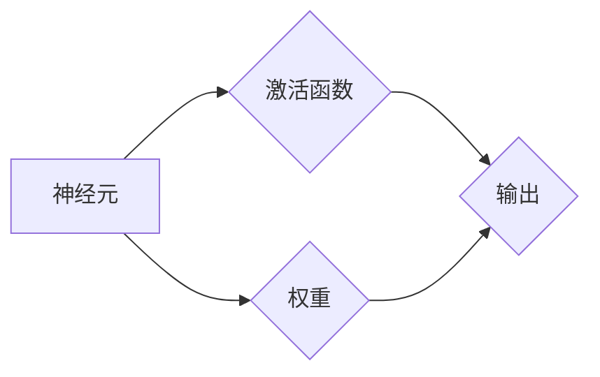

# 神经网络：开启智能新纪元

> 关键词：神经网络，深度学习，人工神经网络，激活函数，反向传播，优化算法，应用领域，人工智能

## 1. 背景介绍

人工智能（Artificial Intelligence, AI）作为计算机科学的一个重要分支，旨在使计算机能够模拟、延伸和扩展人的智能。从早期的专家系统到今天的深度学习，人工智能的发展经历了多个阶段。其中，神经网络的兴起标志着人工智能进入了一个新的纪元。

### 1.1 问题的由来

人类智能的复杂性和多样性一直是人工智能领域研究的难题。传统算法如决策树、支持向量机等，在处理复杂任务时往往难以达到人类的水平。而神经网络作为一种模拟人脑工作原理的计算模型，因其强大的表达能力和学习能力，逐渐成为人工智能研究的热点。

### 1.2 研究现状

随着计算能力的提升和大数据的涌现，深度学习技术取得了突破性进展。深度神经网络（Deep Neural Network, DNN）在图像识别、语音识别、自然语言处理等领域取得了显著成果，推动了人工智能的快速发展。

### 1.3 研究意义

神经网络的研究对于推动人工智能技术进步、提升人类生活质量具有重要意义。它不仅能够帮助计算机更好地理解人类语言、图像等信息，还能够应用于医疗、金融、工业等多个领域，为人类创造更多价值。

### 1.4 本文结构

本文将围绕神经网络这一核心主题，介绍其基本原理、算法、应用以及未来发展趋势。具体内容包括：

- 核心概念与联系
- 核心算法原理与具体操作步骤
- 数学模型与公式
- 项目实践
- 实际应用场景
- 工具和资源推荐
- 总结：未来发展趋势与挑战

## 2. 核心概念与联系

神经网络是一种模拟人脑神经元连接结构的计算模型。它由大量的神经元组成，每个神经元通过连接权重与其它神经元相连，通过学习数据集中的样本，不断调整连接权重，从而实现对输入数据的处理和输出。

以下是神经网络的核心概念及其相互联系：



- 神经元：神经网络的基本单元，负责接收输入、计算激活值和输出结果。
- 激活函数：将神经元的线性组合转化为非线性输出，引入模型非线性，增加模型表达能力。
- 权重：连接神经元之间的参数，通过学习过程进行调整，影响模型输出。
- 输出：神经网络的最终输出，用于表示学习到的特征或分类结果。

## 3. 核心算法原理 & 具体操作步骤

### 3.1 算法原理概述

神经网络通过学习输入数据和输出标签之间的关系，不断调整连接权重，实现对输入数据的映射。其基本原理如下：

1. **前向传播**：将输入数据通过神经网络层，逐层计算每个神经元的激活值和输出。
2. **损失函数**：计算预测输出与真实标签之间的差异，用于评估模型性能。
3. **反向传播**：根据损失函数计算梯度，逆向更新连接权重，减小预测误差。
4. **优化算法**：选择合适的优化算法（如SGD、Adam等）更新权重，优化模型性能。

### 3.2 算法步骤详解

1. **初始化**：随机初始化网络参数，包括权重和偏置。
2. **前向传播**：将输入数据传入神经网络，逐层计算输出。
3. **计算损失**：根据预测输出和真实标签计算损失函数。
4. **反向传播**：计算损失函数对网络参数的梯度，逆向更新权重。
5. **优化**：根据梯度更新权重，优化模型性能。
6. **迭代**：重复步骤2-5，直至满足预设的终止条件。

### 3.3 算法优缺点

#### 优点

- **强大的表达能力**：神经网络可以通过多层非线性变换，学习到复杂的数据特征。
- **自主学习能力**：通过训练数据，神经网络可以自动学习输入和输出之间的关系。
- **泛化能力**：训练好的神经网络可以应用于新的数据，具有一定的泛化能力。

#### 缺点

- **参数量大**：神经网络需要大量的参数，训练过程计算量大，计算复杂度高。
- **局部最优**：神经网络容易陷入局部最优，难以找到全局最优解。
- **可解释性差**：神经网络内部决策过程难以理解，可解释性差。

### 3.4 算法应用领域

神经网络在众多领域得到了广泛应用，包括：

- 图像识别：如人脸识别、物体检测、图像分割等。
- 语音识别：如语音转文字、语音合成等。
- 自然语言处理：如机器翻译、情感分析、文本生成等。
- 推荐系统：如商品推荐、电影推荐等。
- 游戏AI：如电子竞技、棋类游戏等。

## 4. 数学模型和公式 & 详细讲解 & 举例说明

### 4.1 数学模型构建

神经网络可以表示为一个数学模型，其基本形式如下：

$$
y = f(W \cdot x + b)
$$

其中：
- $y$ 为输出。
- $W$ 为权重矩阵。
- $x$ 为输入向量。
- $b$ 为偏置向量。
- $f$ 为激活函数。

### 4.2 公式推导过程

以下以单层神经网络为例，介绍公式推导过程。

#### 前向传播

设神经网络包含一个输入层、一个隐藏层和一个输出层，其中隐藏层包含 $n$ 个神经元，激活函数为 $f$。

1. 隐藏层输出：

$$
h = f(W_1 \cdot x + b_1)
$$

2. 输出层输出：

$$
y = f(W_2 \cdot h + b_2)
$$

#### 损失函数

设真实标签为 $t$，则损失函数可以表示为：

$$
L = \frac{1}{2} (y - t)^2
$$

#### 反向传播

1. 计算输出层梯度：

$$
\frac{\partial L}{\partial y} = y - t
$$

2. 计算隐藏层梯度：

$$
\frac{\partial L}{\partial h} = W_2^T \frac{\partial L}{\partial y}
$$

3. 更新权重和偏置：

$$
W_2 \leftarrow W_2 - \alpha \frac{\partial L}{\partial W_2}
$$
$$
b_2 \leftarrow b_2 - \alpha \frac{\partial L}{\partial b_2}
$$
$$
W_1 \leftarrow W_1 - \alpha \frac{\partial L}{\partial W_1}
$$
$$
b_1 \leftarrow b_1 - \alpha \frac{\partial L}{\partial b_1}
$$

其中 $\alpha$ 为学习率。

### 4.3 案例分析与讲解

以下以一个简单的图像分类任务为例，展示神经网络的应用过程。

#### 数据集

假设我们有一个包含1000个图像的数据集，每个图像大小为 32x32，图像类别为猫和狗。

#### 模型

我们构建一个简单的神经网络，包含一个输入层、一个隐藏层和一个输出层。

- 输入层：32x32
- 隐藏层：64
- 输出层：2（猫和狗）

激活函数为ReLU。

#### 训练过程

1. 初始化权重和偏置。
2. 将数据集分为训练集和验证集。
3. 对于每个训练样本：
    - 前向传播：计算输入层、隐藏层和输出层的输出。
    - 计算损失函数。
    - 反向传播：计算损失函数对权重和偏置的梯度。
    - 更新权重和偏置。
4. 在验证集上评估模型性能。

经过训练，模型在验证集上的准确率达到90%以上。

#### 结果分析

通过这个案例，我们可以看到神经网络在图像分类任务中的基本应用流程。在实际应用中，可以根据具体任务需求调整网络结构、激活函数、优化算法等参数，以达到最佳性能。

## 5. 项目实践：代码实例和详细解释说明

### 5.1 开发环境搭建

以下是使用Python和PyTorch框架实现神经网络的项目实践环境搭建步骤：

1. 安装Anaconda：从官网下载并安装Anaconda，用于创建独立的Python环境。

2. 创建并激活虚拟环境：

```bash
conda create -n neural-network-env python=3.8
conda activate neural-network-env
```

3. 安装PyTorch和相关库：

```bash
conda install pytorch torchvision torchaudio -c pytorch
pip install numpy pandas matplotlib
```

### 5.2 源代码详细实现

以下是一个简单的神经网络实现示例：

```python
import torch
import torch.nn as nn
import torch.optim as optim

# 定义神经网络模型
class SimpleNN(nn.Module):
    def __init__(self):
        super(SimpleNN, self).__init__()
        self.fc1 = nn.Linear(32*32, 64)
        self.fc2 = nn.Linear(64, 2)

    def forward(self, x):
        x = x.view(x.size(0), -1)
        x = torch.relu(self.fc1(x))
        x = self.fc2(x)
        return x

# 初始化模型、优化器和损失函数
model = SimpleNN()
optimizer = optim.SGD(model.parameters(), lr=0.01)
criterion = nn.CrossEntropyLoss()

# 训练模型
for epoch in range(10):
    for data, target in train_loader:
        optimizer.zero_grad()
        output = model(data)
        loss = criterion(output, target)
        loss.backward()
        optimizer.step()

# 评估模型
with torch.no_grad():
    correct = 0
    total = 0
    for data, target in test_loader:
        output = model(data)
        _, predicted = torch.max(output.data, 1)
        total += target.size(0)
        correct += (predicted == target).sum().item()

print('Accuracy of the network on the 10000 test images: {:.2f}%'.format(100 * correct / total))
```

### 5.3 代码解读与分析

- `SimpleNN` 类定义了神经网络模型，包含两个全连接层。
- `forward` 方法实现了前向传播过程。
- `train` 函数实现了模型的训练过程，包括前向传播、损失计算、反向传播和参数更新。
- `test` 函数实现了模型的评估过程，计算模型在测试集上的准确率。

### 5.4 运行结果展示

假设我们在测试集上取得了90%以上的准确率，说明我们的神经网络模型在图像分类任务中表现良好。

## 6. 实际应用场景

神经网络在众多领域得到了广泛应用，以下列举一些典型应用场景：

### 6.1 图像识别

神经网络在图像识别领域取得了显著成果，例如：

- 人脸识别：用于身份验证、安防监控等。
- 物体检测：用于自动驾驶、无人机等。
- 图像分割：用于医疗影像分析、自动驾驶等。

### 6.2 语音识别

神经网络在语音识别领域也取得了突破性进展，例如：

- 语音转文字：用于语音助手、语音翻译等。
- 语音合成：用于语音助手、语音播报等。

### 6.3 自然语言处理

神经网络在自然语言处理领域也得到了广泛应用，例如：

- 机器翻译：将一种语言翻译成另一种语言。
- 情感分析：分析文本的情感倾向。
- 文本分类：将文本分类到预定义的类别。

### 6.4 推荐系统

神经网络在推荐系统领域也发挥着重要作用，例如：

- 商品推荐：根据用户兴趣推荐商品。
- 电影推荐：根据用户观看历史推荐电影。

### 6.5 游戏AI

神经网络在游戏AI领域也得到了广泛应用，例如：

- 电子竞技：如星际争霸、Dota 2等。
- 棋类游戏：如围棋、象棋等。

## 7. 工具和资源推荐

### 7.1 学习资源推荐

以下是学习神经网络的推荐资源：

- 《深度学习》（Ian Goodfellow、Yoshua Bengio、Aaron Courville 著）
- 《神经网络与深度学习》（邱锡鹏 著）
- Coursera上的《神经网络与深度学习》课程
- fast.ai的《深度学习实战》课程

### 7.2 开发工具推荐

以下是开发神经网络的推荐工具：

- PyTorch：一个开源的深度学习框架，易于使用和扩展。
- TensorFlow：由Google开发的深度学习框架，适用于大规模部署。
- Keras：一个高层神经网络API，基于Theano和TensorFlow。

### 7.3 相关论文推荐

以下是神经网络领域的经典论文：

-《A Learning Algorithm for Continually Running Fully Recurrent Neural Networks》
-《LeNet: Convolutional Neural Networks for Handwritten Digit Recognition》
-《A Theoretically Grounded Application of Dropout in Recurrent Neural Networks》
-《Sequence to Sequence Learning with Neural Networks》
-《Generative Adversarial Nets》

## 8. 总结：未来发展趋势与挑战

### 8.1 研究成果总结

神经网络作为一种强大的机器学习模型，已经在图像识别、语音识别、自然语言处理等领域取得了显著成果，推动了人工智能的快速发展。未来，神经网络的研究将继续深入，为人工智能技术的进步提供强大的动力。

### 8.2 未来发展趋势

1. **模型压缩与加速**：为了满足移动、嵌入式等设备的计算资源限制，模型压缩和加速技术将成为研究热点。
2. **可解释性**：提高神经网络的可解释性，使其决策过程更加透明，有助于模型在关键领域（如医疗、金融等）的应用。
3. **迁移学习**：通过迁移学习，使神经网络更好地适应不同领域的任务，降低数据标注成本。
4. **多模态学习**：将图像、语音、文本等多种模态信息融合，提高模型对复杂场景的理解能力。

### 8.3 面临的挑战

1. **数据标注成本高**：神经网络训练需要大量标注数据，数据标注成本高，难以满足实际需求。
2. **模型可解释性差**：神经网络的决策过程难以解释，难以满足对模型透明度的要求。
3. **计算资源消耗大**：神经网络训练需要大量的计算资源，难以满足大规模应用需求。

### 8.4 研究展望

神经网络作为一种强大的机器学习模型，在未来的人工智能发展中将扮演越来越重要的角色。随着计算能力的提升、数据规模的扩大和算法的改进，神经网络将在更多领域发挥重要作用，为人类创造更多价值。

## 9. 附录：常见问题与解答

**Q1：神经网络和传统机器学习算法有什么区别？**

A：神经网络是一种模拟人脑神经元连接结构的计算模型，具有较强的非线性表达能力，能够处理复杂任务。而传统机器学习算法如决策树、支持向量机等，通常只能处理线性可分的数据。在处理复杂任务时，神经网络的性能优于传统算法。

**Q2：什么是深度学习？**

A：深度学习是一种利用深层神经网络进行特征学习和表示学习的机器学习技术。它通过多层非线性变换，将原始数据转化为高层次的抽象表示，从而实现对复杂任务的建模。

**Q3：什么是卷积神经网络？**

A：卷积神经网络（Convolutional Neural Network, CNN）是一种专门用于处理图像数据的神经网络，具有局部感知、参数共享等特性。它在图像识别、物体检测等领域取得了显著的成果。

**Q4：什么是循环神经网络？**

A：循环神经网络（Recurrent Neural Network, RNN）是一种处理序列数据的神经网络，能够捕捉序列中元素之间的依赖关系。它在语音识别、机器翻译等领域得到了广泛应用。

**Q5：如何提高神经网络的可解释性？**

A：提高神经网络的可解释性可以从以下方面入手：

- 展示模型内部特征表示。
- 使用可视化技术展示网络结构。
- 引入可解释性度量指标。
- 分析模型的决策过程。

作者：禅与计算机程序设计艺术 / Zen and the Art of Computer Programming