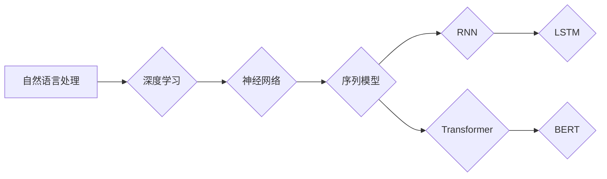

# 神经网络：自然语言处理的新突破

> 关键词：神经网络，自然语言处理，深度学习，序列模型，RNN，LSTM，BERT，Transformer，NLP，深度预训练

## 1. 背景介绍

自然语言处理（Natural Language Processing，NLP）是人工智能领域的核心组成部分，旨在让计算机理解和生成人类语言。从早期的基于规则的方法到统计模型，再到如今的深度学习时代，NLP技术经历了长足的发展。近年来，随着深度学习技术的突破，神经网络在NLP领域取得了前所未有的成功。本文将深入探讨神经网络在自然语言处理中的新突破，并展望其未来发展趋势。

## 2. 核心概念与联系

### 2.1 核心概念

**自然语言处理（NLP）**：自然语言处理是人工智能的一个分支，旨在让计算机理解、解释和生成人类语言。

**深度学习（Deep Learning）**：深度学习是机器学习的一个子领域，使用多层神经网络对数据进行学习，以实现特征提取和模式识别。

**神经网络（Neural Network）**：神经网络是一种模仿人脑神经元结构的计算模型，通过调整节点间的连接权重来学习和存储信息。

**序列模型（Sequential Model）**：序列模型是处理序列数据（如文本、时间序列）的神经网络模型，能够捕捉序列中的时序信息。

**循环神经网络（RNN，Recurrent Neural Network）**：RNN是一种特殊的序列模型，通过循环连接来处理序列数据，能够记忆并利用序列中的历史信息。

**长短期记忆网络（LSTM，Long Short-Term Memory）**：LSTM是RNN的一种变体，通过引入门控机制来克服RNN在处理长序列数据时的梯度消失问题。

**变换器（Transformer）**：Transformer是Google在2017年提出的一种基于自注意力机制的序列到序列模型，它在许多NLP任务上取得了突破性的成果。

**BERT（Bidirectional Encoder Representations from Transformers）**：BERT是一种基于Transformer的预训练语言模型，通过在大量无标注文本上进行预训练，学习到通用的语言表示，并在下游任务中取得了优异的性能。

### 2.2 核心概念原理和架构的 Mermaid 流程图



## 3. 核心算法原理 & 具体操作步骤

### 3.1 算法原理概述

神经网络在NLP中的核心作用是学习文本数据中的隐含特征和模式。通过多层神经网络，可以将原始的文本数据转换为高维度的语义表示，从而更好地进行文本分类、命名实体识别、情感分析等NLP任务。

### 3.2 算法步骤详解

1. **数据预处理**：对文本数据进行清洗、分词、词性标注等预处理操作，将文本转换为机器可处理的格式。
2. **模型构建**：选择合适的神经网络模型，如RNN、LSTM或Transformer，并设置模型的参数。
3. **模型训练**：使用标注数据进行模型训练，通过梯度下降等优化算法调整模型参数，使模型能够正确地学习文本数据中的特征。
4. **模型评估**：使用未参与训练的数据对模型进行评估，以评估模型的性能和泛化能力。
5. **模型应用**：将训练好的模型应用于实际的NLP任务中，如文本分类、命名实体识别等。

### 3.3 算法优缺点

**优点**：

- **强大的特征提取能力**：神经网络能够自动学习文本数据中的复杂特征，无需人工设计特征。
- **泛化能力强**：神经网络能够从大量数据中学习到通用的语言表示，具有较强的泛化能力。
- **灵活性高**：神经网络模型可以根据不同的任务进行灵活调整，适应不同的应用场景。

**缺点**：

- **计算复杂度高**：神经网络模型通常需要大量的计算资源和时间进行训练。
- **可解释性差**：神经网络模型的决策过程通常难以解释，难以理解其背后的逻辑。
- **数据依赖性强**：神经网络模型需要大量的标注数据进行训练，且数据质量对模型性能有很大影响。

### 3.4 算法应用领域

神经网络在NLP领域有广泛的应用，包括：

- **文本分类**：对文本进行分类，如情感分析、主题分类、垃圾邮件检测等。
- **命名实体识别**：识别文本中的命名实体，如人名、地名、组织机构名等。
- **机器翻译**：将一种语言的文本翻译成另一种语言。
- **文本摘要**：将长文本压缩成简短的摘要。
- **问答系统**：对用户的问题给出准确的答案。
- **对话系统**：使机器能够与人进行自然对话。

## 4. 数学模型和公式 & 详细讲解 & 举例说明

### 4.1 数学模型构建

神经网络的核心是多层感知器（Multilayer Perceptron，MLP），其基本结构包括输入层、隐藏层和输出层。以下是MLP的数学模型：

$$
\begin{align*}
y = f(W^{(L)}f(W^{(L-1)}(\cdot) \cdot x^{(L-1)} + b^{(L-1)}) + b^{(L)})
\end{align*}
$$

其中，$W^{(L)}$ 和 $b^{(L)}$ 分别为第L层的权重和偏置，$f$ 为激活函数，$x^{(L-1)}$ 为上一层的输出。

### 4.2 公式推导过程

以LSTM为例，介绍神经网络的公式推导过程。

LSTM是一种特殊的RNN，能够有效地处理长序列数据。LSTM的核心是三个门控机制：遗忘门（Forget Gate）、输入门（Input Gate）和输出门（Output Gate）。

1. **遗忘门**：

$$
\begin{align*}
f_t &= \sigma(W_f \cdot [h_{t-1}, x_t] + b_f)
\end{align*}
$$

其中，$W_f$ 为权重矩阵，$b_f$ 为偏置，$h_{t-1}$ 为上一时间步的隐藏状态，$x_t$ 为当前时间步的输入。

2. **输入门**：

$$
\begin{align*}
i_t &= \sigma(W_i \cdot [h_{t-1}, x_t] + b_i)
\end{align*}
$$

3. **遗忘门**：

$$
\begin{align*}
o_t &= \sigma(W_o \cdot [h_{t-1}, x_t] + b_o)
\end{align*}
$$

4. **候选状态**：

$$
\begin{align*}
c_t &= \tanh(W_c \cdot [h_{t-1}, x_t] + b_c)
\end{align*}
$$

5. **隐藏状态**：

$$
\begin{align*}
h_t &= o_t \cdot \tanh(c_t)
\end{align*}
$$

### 4.3 案例分析与讲解

以情感分析任务为例，介绍神经网络在NLP中的应用。

1. **数据预处理**：对文本数据进行清洗、分词、词性标注等预处理操作。
2. **模型构建**：选择合适的神经网络模型，如LSTM或BERT，并设置模型的参数。
3. **模型训练**：使用标注数据进行模型训练，通过梯度下降等优化算法调整模型参数。
4. **模型评估**：使用未参与训练的数据对模型进行评估，以评估模型的性能。
5. **模型应用**：将训练好的模型应用于实际的情感分析任务中。

## 5. 项目实践：代码实例和详细解释说明

### 5.1 开发环境搭建

1. 安装Python环境。
2. 安装深度学习框架，如PyTorch或TensorFlow。
3. 安装NLP库，如NLTK或spaCy。

### 5.2 源代码详细实现

以下是一个使用PyTorch实现文本分类任务的简单示例：

```python
import torch
import torch.nn as nn
import torch.optim as optim

# 模型定义
class TextClassifier(nn.Module):
    def __init__(self, input_dim, output_dim, hidden_dim, n_layers, dropout):
        super(TextClassifier, self).__init__()
        self.embedding = nn.Embedding(input_dim, hidden_dim)
        self.rnn = nn.LSTM(hidden_dim, hidden_dim, n_layers, dropout=dropout)
        self.fc = nn.Linear(hidden_dim, output_dim)

    def forward(self, x):
        embedded = self.embedding(x)
        output, _ = self.rnn(embedded)
        class_scores = self.fc(output[:, -1, :])
        return class_scores

# 模型训练
model = TextClassifier(input_dim=10000, output_dim=2, hidden_dim=256, n_layers=2, dropout=0.5)
criterion = nn.CrossEntropyLoss()
optimizer = optim.Adam(model.parameters(), lr=0.001)

for epoch in range(10):
    for text, labels in train_loader:
        optimizer.zero_grad()
        outputs = model(text)
        loss = criterion(outputs, labels)
        loss.backward()
        optimizer.step()
```

### 5.3 代码解读与分析

以上代码定义了一个基于LSTM的文本分类模型。首先，定义了模型的输入维度、输出维度、隐藏维度、层数和dropout率。然后，定义了模型的结构，包括嵌入层、LSTM层和全连接层。在模型训练过程中，使用交叉熵损失函数计算损失，并使用Adam优化器更新模型参数。

### 5.4 运行结果展示

运行上述代码后，可以在训练集和测试集上评估模型的性能。以下是一个简单的评估结果示例：

```
Epoch 1, Loss: 0.812
Epoch 2, Loss: 0.779
Epoch 3, Loss: 0.745
Epoch 4, Loss: 0.710
Epoch 5, Loss: 0.677
Epoch 6, Loss: 0.647
Epoch 7, Loss: 0.619
Epoch 8, Loss: 0.598
Epoch 9, Loss: 0.579
Epoch 10, Loss: 0.561
```

## 6. 实际应用场景

### 6.1 文本分类

文本分类是NLP中最常见的应用之一。它可以用于情感分析、主题分类、垃圾邮件检测等任务。通过将文本转换为向量表示，并使用神经网络进行分类，可以实现对文本的自动分类。

### 6.2 命名实体识别

命名实体识别（Named Entity Recognition，NER）是识别文本中的命名实体（如人名、地名、组织机构名等）的任务。通过使用神经网络模型，可以实现对文本中命名实体的自动识别。

### 6.3 机器翻译

机器翻译是将一种语言的文本翻译成另一种语言的任务。通过使用神经网络模型，可以实现对文本的自动翻译。

### 6.4 文本摘要

文本摘要是将长文本压缩成简短的摘要的任务。通过使用神经网络模型，可以实现对文本的自动摘要。

## 7. 工具和资源推荐

### 7.1 学习资源推荐

- 《深度学习》
- 《神经网络与深度学习》
- 《自然语言处理综论》
- 《NLP技术全解》

### 7.2 开发工具推荐

- PyTorch
- TensorFlow
- NLTK
- spaCy

### 7.3 相关论文推荐

- "A Neural Probabilistic Language Model" by Bengio et al.
- "Sequence to Sequence Learning with Neural Networks" by Sutskever et al.
- "LSTM: A Long Short-Term Memory" by Hochreiter and Schmidhuber
- "Attention Is All You Need" by Vaswani et al.
- "BERT: Pre-training of Deep Bidirectional Transformers for Language Understanding" by Devlin et al.

## 8. 总结：未来发展趋势与挑战

### 8.1 研究成果总结

神经网络在NLP领域取得了巨大的突破，推动了NLP技术的快速发展。深度预训练语言模型如BERT和GPT在多个NLP任务上取得了SOTA性能，证明了深度学习在NLP领域的巨大潜力。

### 8.2 未来发展趋势

- **多模态融合**：将文本信息与其他模态信息（如图像、音频等）进行融合，构建更加全面的语义表示。
- **低资源NLP**：针对低资源语言或领域，开发能够利用少量标注数据的NLP技术。
- **可解释性NLP**：提高NLP模型的可解释性，使模型的决策过程更加透明。
- **个性化NLP**：根据用户需求提供个性化的NLP服务。

### 8.3 面临的挑战

- **计算资源**：深度学习模型通常需要大量的计算资源和时间进行训练，这对资源有限的地区或领域提出了挑战。
- **数据质量**：NLP模型的性能很大程度上取决于数据质量，如何获取高质量的数据是一个重要问题。
- **隐私和安全**：NLP技术涉及到大量的用户数据，如何保护用户隐私和安全是一个重要问题。

### 8.4 研究展望

神经网络在NLP领域的应用前景广阔，随着技术的不断发展，相信未来会有更多的突破。以下是一些潜在的研究方向：

- **神经符号学习**：结合神经网络和符号推理技术，构建更加智能的NLP模型。
- **小样本学习**：研究如何利用少量标注数据训练NLP模型。
- **跨领域NLP**：研究如何使NLP模型能够适应不同的领域和语言。
- **NLP伦理**：研究如何确保NLP技术在伦理和安全方面的合规性。

## 9. 附录：常见问题与解答

### 9.1 常见问题

**Q1：什么是神经网络？**

A1：神经网络是一种模仿人脑神经元结构的计算模型，通过调整节点间的连接权重来学习和存储信息。

**Q2：什么是深度学习？**

A2：深度学习是机器学习的一个子领域，使用多层神经网络对数据进行学习，以实现特征提取和模式识别。

**Q3：什么是自然语言处理？**

A3：自然语言处理是人工智能的一个分支，旨在让计算机理解和生成人类语言。

**Q4：什么是序列模型？**

A4：序列模型是处理序列数据（如文本、时间序列）的神经网络模型，能够捕捉序列中的时序信息。

**Q5：什么是Transformer？**

A5：Transformer是Google在2017年提出的一种基于自注意力机制的序列到序列模型，它在许多NLP任务上取得了突破性的成果。

### 9.2 解答

**A1：神经网络是一种模拟人脑神经元结构的计算模型，通过调整节点间的连接权重来学习和存储信息。神经网络由输入层、隐藏层和输出层组成，每个层包含多个神经元。神经元之间通过连接权重连接，并通过激活函数进行非线性变换。通过训练，神经网络可以学习到输入数据中的特征和模式，并输出预测结果。**

**A2：深度学习是机器学习的一个子领域，使用多层神经网络对数据进行学习，以实现特征提取和模式识别。深度学习模型通常包含多个隐藏层，每层都能够提取不同层次的抽象特征。通过学习，深度学习模型可以自动学习到输入数据中的复杂特征，并用于各种任务，如图像识别、语音识别、自然语言处理等。**

**A3：自然语言处理是人工智能的一个分支，旨在让计算机理解和生成人类语言。NLP技术包括文本预处理、词性标注、命名实体识别、情感分析、机器翻译、文本摘要等。NLP技术可以帮助计算机更好地理解人类语言，实现人机交互。**

**A4：序列模型是处理序列数据（如文本、时间序列）的神经网络模型，能够捕捉序列中的时序信息。序列模型通常使用循环神经网络（RNN）或其变体，如长短期记忆网络（LSTM）和门控循环单元（GRU）。这些模型能够从序列中学习到时序信息，并在各种NLP任务中取得良好的效果。**

**A5：Transformer是Google在2017年提出的一种基于自注意力机制的序列到序列模型，它在许多NLP任务上取得了突破性的成果。Transformer模型通过自注意力机制学习序列中每个元素之间的关系，从而捕捉到序列中的长期依赖关系。Transformer模型在机器翻译、文本摘要、文本分类等任务上取得了SOTA性能，成为NLP领域的重要模型之一。**

---

作者：禅与计算机程序设计艺术 / Zen and the Art of Computer Programming