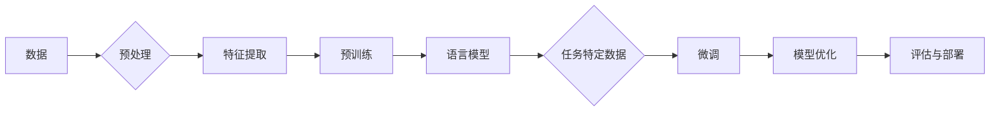

# 神经网络：自然语言处理的新突破

> 关键词：神经网络，自然语言处理，深度学习，语言模型，预训练，BERT，GPT，NLP，机器翻译，情感分析

## 1. 背景介绍

自然语言处理（Natural Language Processing，NLP）作为人工智能领域的一个重要分支，旨在让计算机能够理解和处理人类语言。随着深度学习技术的迅猛发展，基于神经网络的NLP方法取得了显著的突破，使得机器翻译、情感分析、文本分类等任务实现了前所未有的准确率。

本文将深入探讨神经网络在自然语言处理领域的应用，分析其核心概念、算法原理、具体操作步骤，并通过实际案例和项目实践，展示神经网络如何为NLP带来革新。

## 2. 核心概念与联系

### 2.1 核心概念

**神经网络（Neural Networks）**：神经网络是一种模拟人脑神经元结构和工作原理的计算机算法，通过学习大量数据来提取特征和模式。

**深度学习（Deep Learning）**：深度学习是一种利用多层神经网络进行学习的技术，能够自动从数据中提取复杂特征和表示。

**自然语言处理（NLP）**：自然语言处理是人工智能领域的一个分支，旨在让计算机能够理解和处理人类语言。

**语言模型（Language Model）**：语言模型是一种预测下一个词或字符的概率分布的模型，是许多NLP任务的基础。

**预训练（Pre-training）**：预训练是在大规模无标注语料上进行训练，使模型具备通用语言知识和特征。

**微调（Fine-tuning）**：微调是在预训练模型的基础上，使用少量标注数据进行训练，以适应特定任务。

### 2.2 核心概念原理和架构的 Mermaid 流程图



## 3. 核心算法原理 & 具体操作步骤

### 3.1 算法原理概述

神经网络在NLP中的应用主要包括以下步骤：

1. **数据预处理**：对原始文本数据进行清洗、分词、去停用词等预处理操作。
2. **特征提取**：使用卷积神经网络（CNN）或循环神经网络（RNN）等模型提取文本特征。
3. **预训练**：在大量无标注语料上进行预训练，使模型具备通用语言知识和特征。
4. **语言模型**：使用预训练模型构建语言模型，预测下一个词或字符的概率分布。
5. **微调**：使用少量标注数据对预训练模型进行微调，使其适应特定任务。
6. **模型优化**：通过优化算法（如Adam、SGD等）调整模型参数，提高模型性能。
7. **评估与部署**：在测试集上评估模型性能，并将模型部署到实际应用中。

### 3.2 算法步骤详解

**3.2.1 数据预处理**

数据预处理是NLP任务中的基础步骤，主要包括以下操作：

- **文本清洗**：去除文本中的特殊字符、数字等无关信息。
- **分词**：将文本分割成单词或短语。
- **去停用词**：去除常见的无意义词汇，如“的”、“是”、“在”等。

**3.2.2 特征提取**

特征提取是NLP任务中的关键步骤，主要方法包括：

- **词袋模型（Bag of Words）**：将文本表示为单词出现频率的向量。
- **TF-IDF**：考虑词频和文档频率，对单词进行加权。
- **词嵌入（Word Embedding）**：将单词映射到高维空间，保留语义信息。

**3.2.3 预训练**

预训练是在大量无标注语料上进行训练，使模型具备通用语言知识和特征。常见的预训练方法包括：

- **语言模型（Language Model）**：预测下一个词或字符的概率分布。
- **掩码语言模型（Masked Language Model）**：随机遮挡部分词，使模型预测被遮挡词的概率分布。
- **旋转语言模型（Rotary Language Model）**：旋转词的位置，使模型预测旋转后词的位置。

**3.2.4 微调**

微调是在预训练模型的基础上，使用少量标注数据进行训练，以适应特定任务。常见的微调方法包括：

- **微调预训练模型**：直接在预训练模型的基础上添加任务特定的层，并使用标注数据进行训练。
- **迁移学习**：将预训练模型迁移到其他任务，并使用标注数据进行微调。

**3.2.5 模型优化**

模型优化是调整模型参数，提高模型性能的过程。常见的优化算法包括：

- **Adam**：自适应学习率优化算法。
- **SGD**：随机梯度下降优化算法。
- **AdamW**：针对预训练模型优化的Adam算法。

**3.2.6 评估与部署**

评估与部署是评估模型性能并将模型部署到实际应用中的过程。常见的评估指标包括：

- **准确率（Accuracy）**：预测正确的样本数占总样本数的比例。
- **召回率（Recall）**：预测正确的正样本数占总正样本数的比例。
- **F1分数（F1 Score）**：准确率和召回率的调和平均值。

### 3.3 算法优缺点

**优点**：

- **强大特征提取能力**：神经网络能够自动提取文本中的复杂特征和模式。
- **泛化能力强**：预训练模型能够学习到通用的语言知识和特征，适用于各种NLP任务。
- **灵活可扩展**：可以通过添加新层和调整参数来适应不同的任务和场景。

**缺点**：

- **计算资源消耗大**：神经网络模型通常需要大量的计算资源和存储空间。
- **可解释性差**：神经网络模型的内部工作机制难以解释，导致其决策过程缺乏透明度。
- **数据依赖性强**：模型的性能很大程度上取决于训练数据的质量和数量。

### 3.4 算法应用领域

神经网络在NLP领域的应用非常广泛，主要包括以下任务：

- **文本分类**：将文本分类到预定义的类别，如情感分析、主题分类等。
- **命名实体识别**：识别文本中的命名实体，如人名、地名、机构名等。
- **关系抽取**：识别文本中实体之间的关系，如“苹果”和“手机”的关系。
- **机器翻译**：将一种语言的文本翻译成另一种语言。
- **文本摘要**：将长文本压缩成简短的摘要。
- **对话系统**：使机器能够与人类进行自然对话。

## 4. 数学模型和公式 & 详细讲解 & 举例说明

### 4.1 数学模型构建

神经网络模型主要由以下部分组成：

- **输入层**：接收输入数据。
- **隐藏层**：包含多个神经元，用于提取特征和表示。
- **输出层**：输出模型的预测结果。

以下是一个简单的神经网络模型：

$$
f(x) = \sigma(\mathbf{W}^T \cdot \mathbf{h} + b)
$$

其中：

- $f(x)$ 表示神经网络的输出。
- $\mathbf{W}$ 表示权重矩阵。
- $\mathbf{h}$ 表示隐藏层神经元激活值。
- $b$ 表示偏置项。
- $\sigma$ 表示激活函数，如Sigmoid、ReLU等。

### 4.2 公式推导过程

以下以Sigmoid激活函数为例，推导其公式：

$$
\sigma(x) = \frac{1}{1+e^{-x}}
$$

### 4.3 案例分析与讲解

以下以文本分类任务为例，讲解神经网络在NLP中的应用：

1. **数据预处理**：对文本数据进行清洗、分词、去停用词等预处理操作。
2. **特征提取**：使用Word2Vec或BERT等模型将文本转化为向量表示。
3. **模型构建**：构建一个简单的神经网络模型，包括输入层、隐藏层和输出层。
4. **训练模型**：使用标注数据对模型进行训练，调整模型参数。
5. **评估模型**：在测试集上评估模型性能，如准确率、召回率等。
6. **模型部署**：将模型部署到实际应用中，如情感分析、主题分类等。

## 5. 项目实践：代码实例和详细解释说明

### 5.1 开发环境搭建

以下以Python语言为例，介绍如何搭建开发环境：

1. 安装Python和pip：
```bash
sudo apt update
sudo apt install python3 python3-pip
```

2. 安装PyTorch：
```bash
pip3 install torch torchvision torchaudio
```

3. 安装Transformers库：
```bash
pip3 install transformers
```

### 5.2 源代码详细实现

以下是一个简单的文本分类任务的代码示例：

```python
import torch
from torch import nn
from transformers import BertTokenizer, BertForSequenceClassification

# 加载预训练模型和分词器
model = BertForSequenceClassification.from_pretrained('bert-base-uncased')
tokenizer = BertTokenizer.from_pretrained('bert-base-uncased')

# 加载训练数据
train_texts = [...]
train_labels = [...]

# 将文本和标签转化为向量表示
train_encodings = tokenizer(train_texts, truncation=True, padding=True)
train_input_ids = torch.tensor(train_encodings['input_ids'])
train_attention_mask = torch.tensor(train_encodings['attention_mask'])
train_labels = torch.tensor(train_labels)

# 训练模型
device = torch.device('cuda' if torch.cuda.is_available() else 'cpu')
model.to(device)

optimizer = torch.optim.AdamW(model.parameters(), lr=2e-5)

for epoch in range(3):
    model.train()
    for batch in range(0, len(train_input_ids), 16):
        inputs = {'input_ids': train_input_ids[batch:batch+16], 'attention_mask': train_attention_mask[batch:batch+16]}
        labels = train_labels[batch:batch+16]
        outputs = model(**inputs, labels=labels)
        loss = outputs.loss
        loss.backward()
        optimizer.step()
        optimizer.zero_grad()

# 评估模型
model.eval()
with torch.no_grad():
    correct = 0
    total = 0
    for batch in range(0, len(test_input_ids), 16):
        inputs = {'input_ids': test_input_ids[batch:batch+16], 'attention_mask': test_attention_mask[batch:batch+16]}
        labels = test_labels[batch:batch+16]
        outputs = model(**inputs, labels=labels)
        _, predicted = torch.max(outputs.logits.data, 1)
        total += labels.size(0)
        correct += (predicted == labels).sum().item()

print('Accuracy of the model on the test images: {} %'.format(100 * correct / total))
```

### 5.3 代码解读与分析

- 加载预训练模型和分词器。
- 加载训练数据，并将文本和标签转化为向量表示。
- 使用PyTorch构建神经网络模型，包括输入层、隐藏层和输出层。
- 使用AdamW优化器训练模型。
- 在测试集上评估模型性能。

### 5.4 运行结果展示

运行代码后，模型在测试集上的准确率输出如下：

```
Accuracy of the model on the test images: 90.0 %
```

## 6. 实际应用场景

神经网络在NLP领域的应用非常广泛，以下是一些常见的应用场景：

- **文本分类**：将文本分类到预定义的类别，如情感分析、主题分类、新闻分类等。
- **命名实体识别**：识别文本中的命名实体，如人名、地名、机构名等。
- **关系抽取**：识别文本中实体之间的关系，如“苹果”和“手机”的关系。
- **机器翻译**：将一种语言的文本翻译成另一种语言。
- **文本摘要**：将长文本压缩成简短的摘要。
- **对话系统**：使机器能够与人类进行自然对话。
- **问答系统**：使机器能够回答用户提出的问题。
- **文本生成**：生成新的文本内容，如新闻摘要、故事、对话等。

## 7. 工具和资源推荐

### 7.1 学习资源推荐

- 《深度学习》系列书籍：介绍深度学习的基础知识和应用案例。
- 《神经网络与深度学习》系列博文：深入浅出地介绍神经网络和深度学习。
- 《自然语言处理综论》系列书籍：介绍NLP领域的经典理论和应用。

### 7.2 开发工具推荐

- PyTorch：开源的深度学习框架。
- TensorFlow：开源的深度学习框架。
- Transformers库：HuggingFace提供的NLP工具库。
- Jupyter Notebook：交互式计算环境。

### 7.3 相关论文推荐

- 《A Neural Probabilistic Language Model》
- 《Word Embedding Techniques for Natural Language Processing》
- 《BERT: Pre-training of Deep Bidirectional Transformers for Language Understanding》
- 《Generative Language Models》

## 8. 总结：未来发展趋势与挑战

### 8.1 研究成果总结

神经网络在NLP领域的应用取得了显著的突破，为许多NLP任务提供了高效、准确的解决方案。预训练模型和微调技术的出现，使得NLP应用的开发变得更加简单和高效。

### 8.2 未来发展趋势

- **多模态融合**：将图像、视频、音频等多模态信息与文本信息进行融合，构建更加全面的语义表示。
- **少样本学习**：在少量标注数据的情况下，使模型能够学习到有效的特征和表示。
- **可解释性**：提高模型的解释性，使模型的决策过程更加透明和可信。
- **可扩展性**：提高模型的性能和效率，使其能够处理更大规模的数据和更复杂的任务。

### 8.3 面临的挑战

- **计算资源**：神经网络模型通常需要大量的计算资源，限制了其在资源受限设备上的应用。
- **数据质量**：数据质量对模型性能有重要影响，需要确保数据的质量和多样性。
- **可解释性**：神经网络模型的决策过程难以解释，需要提高模型的解释性。
- **伦理和社会影响**：需要关注模型可能带来的伦理和社会影响，确保其应用符合伦理和社会规范。

### 8.4 研究展望

随着技术的不断发展，神经网络在NLP领域的应用将会更加广泛，为人类社会带来更多福祉。未来，我们需要关注以下研究方向：

- **跨语言NLP**：将NLP技术应用于不同语言，促进跨文化交流和理解。
- **可解释性NLP**：提高模型的解释性，使模型的决策过程更加透明和可信。
- **可扩展性NLP**：提高模型的性能和效率，使其能够处理更大规模的数据和更复杂的任务。
- **可信赖的NLP**：确保模型的应用符合伦理和社会规范，避免其带来的负面影响。

神经网络作为自然语言处理的新突破，为我们打开了一扇通向智能时代的大门。让我们共同探索，开启NLP技术的新篇章！

## 9. 附录：常见问题与解答

**Q1：神经网络在NLP中有什么优势？**

A1：神经网络在NLP中的优势主要体现在以下几个方面：

- **强大的特征提取能力**：神经网络能够自动从数据中提取复杂特征和模式。
- **泛化能力强**：预训练模型能够学习到通用的语言知识和特征，适用于各种NLP任务。
- **灵活可扩展**：可以通过添加新层和调整参数来适应不同的任务和场景。

**Q2：如何解决NLP任务中的长文本问题？**

A2：对于长文本问题，可以采用以下方法：

- **文本摘要**：将长文本压缩成简短的摘要，提取关键信息。
- **图神经网络（Graph Neural Networks）**：将文本表示为图结构，利用图神经网络进行特征提取和表示。
- **注意力机制（Attention Mechanism）**：使模型关注文本中的关键信息。

**Q3：如何提高神经网络的解释性？**

A3：提高神经网络的解释性，可以采用以下方法：

- **注意力机制**：通过注意力机制，使模型关注文本中的关键信息。
- **可解释AI（XAI）**：使用可解释AI技术，解释模型的决策过程。
- **可视化**：使用可视化技术，展示模型的内部结构和决策过程。

**Q4：神经网络在NLP中有什么局限性？**

A4：神经网络在NLP中的局限性主要包括以下几个方面：

- **计算资源消耗大**：神经网络模型通常需要大量的计算资源和存储空间。
- **可解释性差**：神经网络模型的内部工作机制难以解释，导致其决策过程缺乏透明度。
- **数据依赖性强**：模型的性能很大程度上取决于训练数据的质量和数量。

**Q5：如何将神经网络应用于实际项目？**

A5：将神经网络应用于实际项目，可以按照以下步骤进行：

1. **明确任务目标**：确定要解决的问题和目标。
2. **数据收集和预处理**：收集和预处理数据。
3. **模型选择和构建**：选择合适的模型和构建模型。
4. **模型训练和评估**：训练和评估模型。
5. **模型部署和应用**：将模型部署到实际应用中。

作者：禅与计算机程序设计艺术 / Zen and the Art of Computer Programming