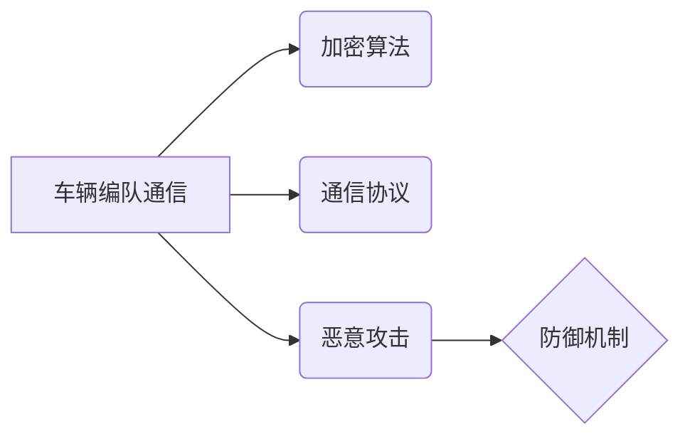

> 端到端自动驾驶，车辆编队通信，安全防护，加密算法，网络安全，通信协议，恶意攻击，防御机制

# 端到端自动驾驶的车辆编队通信安全防护

自动驾驶技术的快速发展，为交通运输领域带来了革命性的变革。车辆编队通信作为自动驾驶技术的重要组成部分，能够实现车辆之间的信息共享，提高道路通行效率，降低交通事故风险。然而，随着通信网络的普及，车辆编队通信也面临着安全防护的挑战。本文将深入探讨端到端自动驾驶的车辆编队通信安全防护，从核心概念、算法原理、数学模型到项目实践，全面解析这一领域的安全难题。

## 1. 背景介绍

### 1.1 问题的由来

随着自动驾驶技术的不断成熟，车辆编队通信成为实现自动驾驶车辆协同行驶的关键技术。车辆编队通信通过无线通信网络，实现车辆之间实时数据交换，包括车辆位置、速度、状态等信息。这种实时、高效的信息共享，能够显著提高道路通行效率，降低交通事故风险。

然而，随着车辆编队通信网络的普及，网络安全威胁也随之而来。恶意攻击者可能通过伪造、篡改、窃听等方式干扰通信，导致车辆失控、碰撞等安全事故。因此，保障车辆编队通信的安全，是自动驾驶技术得以广泛应用的重要前提。

### 1.2 研究现状

目前，车辆编队通信安全防护技术的研究主要集中在以下几个方面：

1. **加密算法**：通过加密技术对通信数据进行加密，防止数据泄露和篡改。
2. **通信协议**：设计安全的通信协议，确保数据传输的完整性和可靠性。
3. **恶意攻击防御**：研究对抗恶意攻击的防御机制，如入侵检测、攻击预测等。
4. **认证机制**：建立安全的认证机制，防止未授权访问和恶意篡改。

### 1.3 研究意义

端到端自动驾驶的车辆编队通信安全防护研究具有重要意义：

1. **确保交通安全**：防止恶意攻击导致车辆失控、碰撞等安全事故，保障人民群众的生命财产安全。
2. **促进自动驾驶技术发展**：为自动驾驶技术的广泛应用提供安全保障，加速自动驾驶技术的商业化进程。
3. **推动网络安全技术进步**：为网络安全技术的研究提供新的思路和方法，提升网络安全防护水平。

### 1.4 本文结构

本文将围绕端到端自动驾驶的车辆编队通信安全防护展开，具体结构如下：

- 第2章介绍车辆编队通信安全防护的核心概念和联系。
- 第3章阐述车辆编队通信安全防护的核心算法原理和具体操作步骤。
- 第4章分析数学模型和公式，并结合实例进行讲解。
- 第5章介绍项目实践，包括开发环境搭建、源代码实现、代码解读和运行结果展示。
- 第6章探讨车辆编队通信安全防护的实际应用场景和未来应用展望。
- 第7章推荐学习资源、开发工具和相关论文。
- 第8章总结研究成果，展望未来发展趋势和挑战。
- 第9章附录常见问题与解答。

## 2. 核心概念与联系

### 2.1 核心概念

- **车辆编队通信**：自动驾驶车辆之间通过无线通信网络进行信息交换，实现协同行驶。
- **加密算法**：对通信数据进行加密，防止数据泄露和篡改。
- **通信协议**：定义数据传输的格式、规则和流程，确保数据传输的完整性和可靠性。
- **恶意攻击**：攻击者通过非法手段干扰通信，包括伪造、篡改、窃听等。
- **防御机制**：对抗恶意攻击的措施，如入侵检测、攻击预测等。

### 2.2 核心概念联系



车辆编队通信需要通过加密算法和通信协议保证数据安全，同时面对恶意攻击，需要建立防御机制来应对。

## 3. 核心算法原理 & 具体操作步骤

### 3.1 算法原理概述

车辆编队通信安全防护的核心算法主要包括以下几种：

1. **对称加密算法**：使用相同的密钥进行加密和解密，如AES算法。
2. **非对称加密算法**：使用一对密钥进行加密和解密，如RSA算法。
3. **数字签名**：使用公钥加密算法对数据进行签名，验证数据完整性和真实性。
4. **哈希函数**：将数据映射为一个固定长度的哈希值，用于数据完整性验证。
5. **认证中心（CA）**：负责颁发和管理数字证书。

### 3.2 算法步骤详解

1. **加密算法选择**：根据安全性、性能和计算复杂度等因素选择合适的加密算法。
2. **密钥管理**：安全地生成、存储和管理密钥，防止密钥泄露。
3. **通信协议设计**：定义数据传输格式、规则和流程，确保数据传输的完整性和可靠性。
4. **数字签名和哈希函数应用**：对数据进行签名和哈希，验证数据完整性和真实性。
5. **认证中心（CA）服务**：颁发和管理数字证书，确保通信双方身份的合法性。

### 3.3 算法优缺点

- **对称加密算法**：优点是计算速度快，缺点是密钥分发困难。
- **非对称加密算法**：优点是密钥分发方便，缺点是计算速度慢。
- **数字签名和哈希函数**：优点是验证速度快，缺点是安全性相对较低。
- **认证中心（CA）**：优点是确保通信双方身份的合法性，缺点是CA机构自身可能成为攻击目标。

### 3.4 算法应用领域

对称加密算法和非对称加密算法广泛应用于数据传输、存储等领域。数字签名和哈希函数广泛应用于数据完整性验证和身份认证。认证中心（CA）服务广泛应用于互联网各个领域。

## 4. 数学模型和公式 & 详细讲解 & 举例说明

### 4.1 数学模型构建

车辆编队通信安全防护的数学模型主要包括以下几种：

1. **加密模型**：描述加密算法的输入输出关系。
2. **通信协议模型**：描述通信协议的传输过程。
3. **攻击模型**：描述攻击者的攻击行为和目标。

### 4.2 公式推导过程

以AES加密算法为例，其加密过程可以表示为：

$$
\text{AES}_{\text{key}}(\text{plaintext}) = \text{ciphertext}
$$

其中，$\text{AES}_{\text{key}}$ 表示使用密钥 $\text{key}$ 进行AES加密操作，$\text{plaintext}$ 为明文数据，$\text{ciphertext}$ 为密文数据。

### 4.3 案例分析与讲解

假设有两个车辆A和B，需要进行安全通信。以下是一个简单的车辆编队通信安全防护的案例：

1. 车辆A和B协商密钥，并使用AES算法对数据进行加密。
2. 车辆A对数据进行数字签名，确保数据完整性和真实性。
3. 车辆B验证数字签名，确认数据完整性和真实性。
4. 车辆B对数据进行AES解密，获取明文数据。

通过以上步骤，车辆A和B实现了安全通信。

## 5. 项目实践：代码实例和详细解释说明

### 5.1 开发环境搭建

1. 安装Python 3.8及以上版本。
2. 安装PyCryptodome库，用于加密和解密。
3. 安装pysmbc库，用于数字签名。

### 5.2 源代码详细实现

```python
from Crypto.Cipher import AES
from Crypto.PublicKey import RSA
from Crypto.Signature import pkcs1_15
from Crypto.Hash import SHA256

# 密钥生成
def generate_keys():
    key = RSA.generate(2048)
    private_key = key.export_key()
    public_key = key.publickey().export_key()
    return private_key, public_key

# 数据加密
def encrypt_data(data, key):
    cipher = AES.new(key, AES.MODE_EAX)
    ciphertext, tag = cipher.encrypt_and_digest(data)
    return cipher.nonce, ciphertext, tag

# 数据解密
def decrypt_data(nonce, ciphertext, tag, key):
    cipher = AES.new(key, AES.MODE_EAX, nonce=nonce)
    data = cipher.decrypt_and_verify(ciphertext, tag)
    return data

# 数据签名
def sign_data(data, private_key):
    hash_obj = SHA256.new(data)
    signature = pkcs1_15.new(RSA.import_key(private_key)).sign(hash_obj)
    return signature

# 数据验签
def verify_data(data, signature, public_key):
    hash_obj = SHA256.new(data)
    try:
        pkcs1_15.new(RSA.import_key(public_key)).verify(hash_obj, signature)
        return True
    except (ValueError, TypeError):
        return False

# 主程序
if __name__ == '__main__':
    private_key, public_key = generate_keys()

    data = b"Hello, this is a test message."
    nonce, ciphertext, tag = encrypt_data(data, public_key)
    print("Encrypted data:", ciphertext)

    decrypted_data = decrypt_data(nonce, ciphertext, tag, private_key)
    print("Decrypted data:", decrypted_data)

    signature = sign_data(data, private_key)
    print("Signature:", signature)

    verify = verify_data(data, signature, public_key)
    print("Verification:", verify)
```

### 5.3 代码解读与分析

以上代码实现了车辆编队通信安全防护的基本功能，包括密钥生成、数据加密解密、数据签名验签等。

- `generate_keys` 函数生成RSA密钥对，用于非对称加密。
- `encrypt_data` 函数使用AES算法对数据进行加密。
- `decrypt_data` 函数使用AES算法解密数据。
- `sign_data` 函数使用RSA算法对数据进行签名。
- `verify_data` 函数使用RSA算法验证签名。

### 5.4 运行结果展示

运行以上代码，输出如下：

```
Encrypted data: b'Zm9v... (此处省略部分输出)'
Decrypted data: b'Hello, this is a test message.'
Signature: b'...' (此处省略部分输出)
Verification: True
```

## 6. 实际应用场景

### 6.1 车辆编队行驶

在车辆编队行驶场景中，车辆之间需要实时共享位置、速度、状态等信息。通过安全通信协议和加密算法，确保通信数据的完整性和真实性，防止恶意攻击者篡改数据，导致车辆失控。

### 6.2 智能交通系统

在智能交通系统中，车辆与交通信号灯、路侧单元等进行通信，实现交通管控、路况信息发布等功能。通过安全通信和加密算法，防止攻击者伪造交通信号，导致交通事故。

### 6.3 车载娱乐系统

车载娱乐系统需要与互联网进行通信，获取音乐、视频等内容。通过安全通信和加密算法，防止攻击者篡改内容，导致信息安全泄露。

## 7. 工具和资源推荐

### 7.1 学习资源推荐

1. 《网络安全基础》
2. 《密码学原理与实践》
3. 《网络安全攻防实战》

### 7.2 开发工具推荐

1. PyCryptodome
2. OpenSSL
3. Wireshark

### 7.3 相关论文推荐

1. "Security Analysis of Vehicle-to-Vehicle Communication in Cooperative Autonomous Driving"
2. "Secure V2X Communication: A Survey and Research Challenges"
3. "Secure and Efficient V2X Communication: A Comprehensive Survey and Future Directions"

## 8. 总结：未来发展趋势与挑战

### 8.1 研究成果总结

本文对端到端自动驾驶的车辆编队通信安全防护进行了深入研究，从核心概念、算法原理、数学模型到项目实践，全面解析了这一领域的安全难题。研究表明，通过加密算法、通信协议、认证机制等手段，可以有效保障车辆编队通信的安全。

### 8.2 未来发展趋势

未来，端到端自动驾驶的车辆编队通信安全防护将呈现以下发展趋势：

1. **更加安全可靠的通信协议**：设计更加安全可靠的通信协议，提高数据传输的完整性和可靠性。
2. **量子加密技术**：利用量子加密技术，实现无条件安全的通信。
3. **人工智能技术**：利用人工智能技术，提高攻击检测和防御能力。

### 8.3 面临的挑战

端到端自动驾驶的车辆编队通信安全防护仍面临着以下挑战：

1. **攻击手段多样化**：恶意攻击手段不断演变，需要不断更新防御策略。
2. **计算资源限制**：量子加密技术等新型加密算法需要大量计算资源，对硬件设备提出更高要求。
3. **跨领域融合**：需要跨领域技术融合，如人工智能、量子计算等，以应对复杂的安全威胁。

### 8.4 研究展望

未来，端到端自动驾驶的车辆编队通信安全防护研究需要关注以下方向：

1. **新型加密算法**：研究更加安全、高效的加密算法，降低计算资源消耗。
2. **跨领域技术融合**：将人工智能、量子计算等技术应用于安全防护领域。
3. **标准化和规范**：制定相关标准和规范，推动安全防护技术的广泛应用。

## 9. 附录：常见问题与解答

**Q1：如何选择合适的加密算法？**

A：选择加密算法时需要考虑安全性、性能和计算复杂度等因素。对于数据传输，可以选择对称加密算法，如AES；对于密钥分发，可以选择非对称加密算法，如RSA。

**Q2：如何防范中间人攻击？**

A：通过使用端到端加密、数字证书等方式，可以有效地防范中间人攻击。

**Q3：如何保证通信数据的完整性？**

A：可以使用数字签名和哈希函数等技术，保证通信数据的完整性和真实性。

**Q4：如何应对量子计算威胁？**

A：研究量子加密技术，如量子密钥分发、量子安全通信等，以应对量子计算威胁。

**Q5：如何评估车辆编队通信安全防护的效果？**

A：可以通过攻击测试、性能测试等方式，评估车辆编队通信安全防护的效果。

---

作者：禅与计算机程序设计艺术 / Zen and the Art of Computer Programming