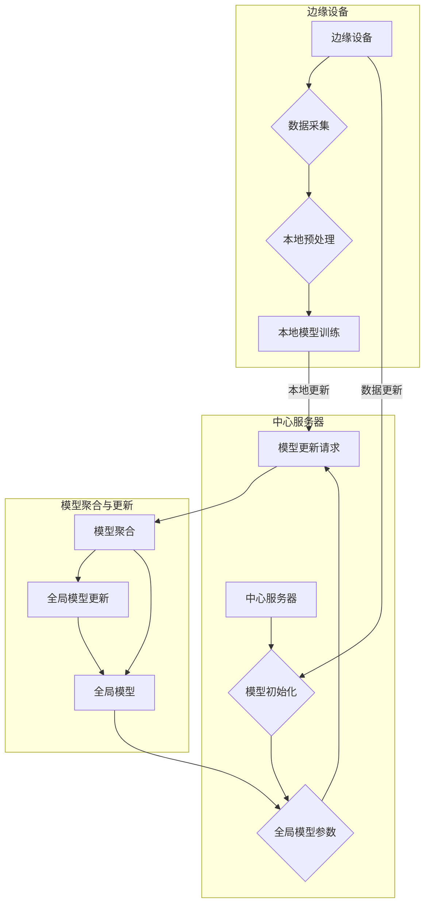

# 联邦学习在物联网环境中的应用

> 关键词：联邦学习，物联网，隐私保护，分布式学习，机器学习，边缘计算

## 1. 背景介绍

随着物联网（Internet of Things, IoT）技术的飞速发展，越来越多的设备被连接到互联网上，产生了海量的数据。这些数据包含了丰富的信息，为机器学习（Machine Learning, ML）提供了强大的数据基础。然而，物联网设备通常分布广泛，且计算资源有限，这使得在云端集中训练机器学习模型变得困难。此外，数据隐私保护的要求也越来越高，传统的集中式训练方式难以满足这些需求。

联邦学习（Federal Learning, FL）作为一种新兴的机器学习技术，能够实现在不共享原始数据的情况下，在各个设备上分布式训练模型，从而解决了数据隐私保护和设备资源受限的问题。本文将深入探讨联邦学习在物联网环境中的应用，包括其核心概念、算法原理、实践步骤以及未来发展趋势。

## 2. 核心概念与联系

### 2.1 核心概念

#### 联邦学习
联邦学习是一种分布式机器学习技术，允许多个设备在不共享其本地数据的情况下，通过本地模型参数的聚合来训练全局模型。它通过加密、差分隐私等技术保护数据隐私，同时利用边缘计算资源进行本地训练。

#### 物联网
物联网是指通过信息传感设备，将物品连接到网络中进行信息交换和通信的系统。物联网设备广泛分布于各个领域，如智能家居、智能交通、工业自动化等。

#### 边缘计算
边缘计算是指在数据产生地附近进行数据处理和计算的技术。它将计算资源从云端迁移到网络边缘，降低了延迟，提高了数据处理速度。

#### 分布式学习
分布式学习是一种将数据分布在不同设备上进行训练的机器学习技术。它可以提高数据处理速度，降低延迟，并减少对中心服务器的依赖。

### 2.2 架构的 Mermaid 流程图



## 3. 核心算法原理 & 具体操作步骤

### 3.1 算法原理概述

联邦学习的基本原理是将训练过程分解为以下几个步骤：

1. **模型初始化**：中心服务器初始化全局模型。
2. **本地模型训练**：各个边缘设备根据本地数据训练本地模型。
3. **模型更新请求**：边缘设备将本地模型的更新请求发送给中心服务器。
4. **模型聚合**：中心服务器聚合所有边缘设备的更新请求，生成新的全局模型。
5. **全局模型更新**：中心服务器将新的全局模型参数发送给边缘设备。
6. **重复步骤 2-5**：重复上述步骤，直至满足停止条件。

### 3.2 算法步骤详解

1. **模型初始化**：中心服务器随机初始化全局模型，并将其发送给所有边缘设备。

2. **本地模型训练**：每个边缘设备使用本地数据对全局模型进行训练，并生成本地模型更新。

3. **模型更新请求**：边缘设备将本地模型更新以加密或差分隐私的形式发送给中心服务器。

4. **模型聚合**：中心服务器接收来自所有边缘设备的模型更新，并使用聚合算法（如联邦平均算法FedAvg）生成新的全局模型。

5. **全局模型更新**：中心服务器将新的全局模型参数发送给所有边缘设备。

6. **停止条件**：当满足停止条件（如达到预设的训练轮数或模型性能达到期望水平）时，训练过程停止。

### 3.3 算法优缺点

#### 优点

- **保护数据隐私**：联邦学习在本地设备上训练模型，不共享原始数据，从而保护了数据隐私。
- **降低延迟**：将计算任务迁移到边缘设备，降低了数据传输和处理的延迟。
- **节省带宽**：通过本地训练和模型参数更新，减少了数据传输量，节省了带宽资源。
- **提高鲁棒性**：联邦学习提高了系统的鲁棒性，因为数据分布在多个设备上。

#### 缺点

- **计算复杂度**：联邦学习涉及分布式训练和模型聚合，计算复杂度较高。
- **同步问题**：边缘设备的更新可能存在同步问题，影响模型的训练效果。
- **通信开销**：虽然联邦学习减少了数据传输量，但通信开销仍然存在。

### 3.4 算法应用领域

联邦学习在物联网环境中的应用领域广泛，包括：

- **智能家居**：智能家居设备可以本地训练模型，实现智能家居功能，如智能家电控制、能耗管理等。
- **智能交通**：车辆传感器可以本地训练模型，实现自动驾驶、交通流量预测等功能。
- **工业自动化**：工业设备可以本地训练模型，实现故障检测、生产优化等功能。
- **医疗健康**：医疗设备可以本地训练模型，实现疾病诊断、健康监测等功能。

## 4. 数学模型和公式 & 详细讲解 & 举例说明

### 4.1 数学模型构建

联邦学习的数学模型可以表示为：

$$
\theta_{t+1} = \frac{1}{N} \sum_{i=1}^N \theta_{i,t}
$$

其中，$\theta_{t}$ 表示第 $t$ 轮训练的本地模型参数，$N$ 表示边缘设备数量，$\theta_{i,t}$ 表示第 $i$ 个边缘设备的本地模型参数。

### 4.2 公式推导过程

联邦平均算法（FedAvg）是一种常见的联邦学习聚合算法。其推导过程如下：

1. 设 $\theta_{t}$ 为第 $t$ 轮训练的本地模型参数。
2. 设 $\theta_{i,t}$ 为第 $i$ 个边缘设备的本地模型参数。
3. 设 $N$ 为边缘设备数量。
4. 第 $t$ 轮训练完成后，所有边缘设备将 $\theta_{i,t}$ 发送给中心服务器。
5. 中心服务器使用联邦平均算法计算全局模型参数：

$$
\theta_{t+1} = \frac{1}{N} \sum_{i=1}^N \theta_{i,t}
$$

### 4.3 案例分析与讲解

以下是一个简单的联邦学习案例，用于演示如何使用Python实现联邦平均算法。

```python
import numpy as np

# 初始化模型参数
theta = np.random.rand(5)

# 模拟多个边缘设备的本地模型更新
local_updates = [np.random.rand(5) for _ in range(3)]

# 联邦平均算法
global_update = np.mean(local_updates, axis=0)

# 更新全局模型参数
theta -= global_update

print(theta)
```

这段代码模拟了三个边缘设备的本地模型更新，并使用联邦平均算法计算全局模型参数。最终，全局模型参数被更新为所有本地模型参数的平均值。

## 5. 项目实践：代码实例和详细解释说明

### 5.1 开发环境搭建

为了实践联邦学习，我们需要搭建以下开发环境：

1. Python 3.x
2. NumPy
3. PyTorch

### 5.2 源代码详细实现

以下是一个使用PyTorch实现的简单联邦学习示例：

```python
import torch
import torch.nn as nn
import torch.optim as optim

# 定义简单的线性模型
class LinearModel(nn.Module):
    def __init__(self):
        super(LinearModel, self).__init__()
        self.linear = nn.Linear(2, 1)

    def forward(self, x):
        return self.linear(x)

# 初始化模型
model = LinearModel()

# 设置本地训练参数
local_epochs = 1
learning_rate = 0.01

# 模拟本地数据
local_data = torch.randn(100, 2)
local_targets = torch.randn(100, 1)

# 本地训练
model.train()
optimizer = optim.SGD(model.parameters(), lr=learning_rate)
for _ in range(local_epochs):
    optimizer.zero_grad()
    outputs = model(local_data)
    loss = nn.MSELoss()(outputs, local_targets)
    loss.backward()
    optimizer.step()

# 返回本地模型更新
local_update = [param.data.clone().requires_grad_(False) for param in model.parameters()]

# ...（此处省略模型聚合和全局模型更新的代码）

```

### 5.3 代码解读与分析

这段代码定义了一个简单的线性模型，并使用本地数据对其进行训练。训练完成后，返回本地模型更新。在实际应用中，需要将本地模型更新发送到中心服务器，并进行模型聚合和全局模型更新。

### 5.4 运行结果展示

运行上述代码后，将得到本地模型更新。这些更新可以用于模型聚合和全局模型更新。

## 6. 实际应用场景

联邦学习在物联网环境中的应用场景广泛，以下是一些典型的应用案例：

- **智能家居**：智能家居设备可以本地训练模型，实现智能家电控制、能耗管理等功能。
- **智能交通**：车辆传感器可以本地训练模型，实现自动驾驶、交通流量预测等功能。
- **工业自动化**：工业设备可以本地训练模型，实现故障检测、生产优化等功能。
- **医疗健康**：医疗设备可以本地训练模型，实现疾病诊断、健康监测等功能。

## 7. 工具和资源推荐

### 7.1 学习资源推荐

- 《联邦学习：原理与实践》
- 《联邦学习：从理论到应用》
- 《联邦学习实战》

### 7.2 开发工具推荐

- PyTorch
- TensorFlow
- Hugging Face Transformers

### 7.3 相关论文推荐

- "Communication-Efficient Algebraic Optimization for Federated Learning"
- "Federated Learning: Strategies for Improving Communication Efficiency"
- "Federated Learning: Concept and Application"

## 8. 总结：未来发展趋势与挑战

### 8.1 研究成果总结

联邦学习作为一种新兴的机器学习技术，在物联网环境中具有广泛的应用前景。它能够保护数据隐私，降低延迟，节省带宽，并提高鲁棒性。近年来，联邦学习取得了显著的研究成果，并在多个领域取得了成功应用。

### 8.2 未来发展趋势

未来，联邦学习将朝着以下方向发展：

- **模型压缩与加速**：通过模型压缩和加速技术，提高联邦学习的计算效率。
- **跨设备协同**：实现跨设备协同训练，提高模型性能和通用性。
- **隐私保护机制**：开发更强大的隐私保护机制，满足更高安全要求的场景。
- **可解释性研究**：提高联邦学习模型的可解释性，增强用户信任。

### 8.3 面临的挑战

联邦学习在物联网环境中的应用仍面临以下挑战：

- **通信开销**：联邦学习需要频繁进行模型参数的传输，增加了通信开销。
- **同步问题**：边缘设备的更新可能存在同步问题，影响模型的训练效果。
- **模型性能**：联邦学习模型的性能可能低于集中式训练模型。
- **可解释性**：联邦学习模型的可解释性较差，难以理解其决策过程。

### 8.4 研究展望

为了应对上述挑战，未来的研究需要关注以下方向：

- **通信优化**：开发更有效的通信协议，降低通信开销。
- **同步机制**：设计有效的同步机制，确保边缘设备的更新同步。
- **模型优化**：优化联邦学习模型，提高模型性能。
- **可解释性研究**：提高联邦学习模型的可解释性，增强用户信任。

相信随着技术的不断发展，联邦学习在物联网环境中的应用将会越来越广泛，为构建安全、高效、智能的物联网生态系统做出重要贡献。

## 9. 附录：常见问题与解答

**Q1：联邦学习与集中式学习的区别是什么？**

A: 联邦学习与集中式学习的区别主要体现在以下方面：

- **数据隐私**：联邦学习保护数据隐私，不共享原始数据；集中式学习需要共享原始数据。
- **计算资源**：联邦学习利用边缘设备进行本地训练，降低对中心服务器的依赖；集中式学习依赖中心服务器的计算资源。
- **通信开销**：联邦学习减少通信开销，节省带宽资源；集中式学习需要传输大量数据。

**Q2：联邦学习适用于哪些场景？**

A: 联邦学习适用于需要保护数据隐私、降低延迟、节省带宽的场景，如智能家居、智能交通、工业自动化、医疗健康等。

**Q3：如何提高联邦学习模型的性能？**

A: 提高联邦学习模型性能的方法包括：

- **优化通信协议**：开发更有效的通信协议，降低通信开销。
- **优化同步机制**：设计有效的同步机制，确保边缘设备的更新同步。
- **优化模型结构**：优化联邦学习模型结构，提高模型性能。
- **数据增强**：使用数据增强技术，扩充训练数据。

**Q4：联邦学习模型的可解释性如何保证？**

A: 保证联邦学习模型可解释性的方法包括：

- **模型解释性方法**：使用模型解释性方法，如注意力机制、可解释AI等。
- **可视化**：通过可视化技术，展示模型决策过程。
- **人工审核**：对模型的输出进行人工审核，确保其符合预期。

通过不断研究和改进，联邦学习必将在物联网环境中发挥越来越重要的作用，为构建安全、高效、智能的物联网生态系统做出贡献。

---

作者：禅与计算机程序设计艺术 / Zen and the Art of Computer Programming