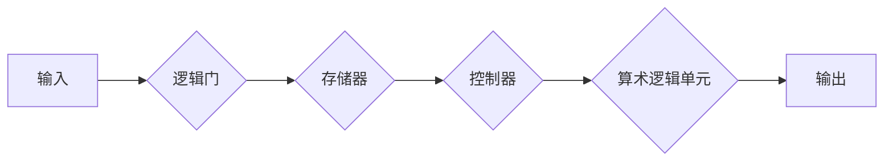
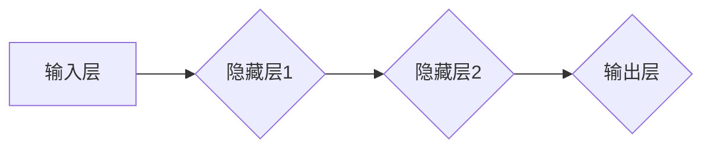

# 自动计算机与神经网络的研究

> 关键词：自动计算机，神经网络，深度学习，机器学习，人工智能，计算模型，人工智能架构

## 1. 背景介绍

自动计算机的发展是计算机科学与人工智能领域的一次革命。从最初的逻辑门到现代的神经网络，计算机的计算能力和智能化水平得到了极大的提升。本文将探讨自动计算机的发展历程，并深入分析神经网络在人工智能中的应用原理和架构。

### 1.1 问题的由来

计算机的发展始于20世纪40年代，当时的计算机主要用于科学计算。随着信息技术的飞速发展，计算机开始被应用于各种领域，如商业、工业、医疗等。然而，早期的计算机依赖于硬件逻辑和程序指令进行计算，这种计算方式难以处理复杂的问题。

### 1.2 研究现状

随着机器学习和深度学习技术的发展，神经网络作为一种模拟人脑神经元连接方式的计算模型，在图像识别、语音识别、自然语言处理等领域取得了显著的成果。本文将重点介绍神经网络的基本原理、算法和架构。

### 1.3 研究意义

研究自动计算机与神经网络，对于推动人工智能技术的发展具有重要意义。通过理解神经网络的计算原理，可以设计出更加高效、智能的计算机系统，从而为解决现实世界中的复杂问题提供新的思路。

### 1.4 本文结构

本文将分为以下几个部分：
- 第2章介绍自动计算机和神经网络的核心概念与联系。
- 第3章详细阐述神经网络的基本原理和具体操作步骤。
- 第4章讲解神经网络的数学模型和公式，并结合实例进行分析。
- 第5章展示神经网络的项目实践，包括代码实例和详细解释。
- 第6章探讨神经网络的实际应用场景和未来应用展望。
- 第7章推荐神经网络相关的学习资源、开发工具和参考文献。
- 第8章总结研究成果，展望未来发展趋势和挑战。
- 第9章提供常见问题与解答。

## 2. 核心概念与联系

### 2.1 自动计算机

自动计算机是指能够自动执行程序指令进行计算的设备。它由逻辑门、存储器、控制器和算术逻辑单元（ALU）等组成。



### 2.2 神经网络

神经网络是一种模拟人脑神经元连接方式的计算模型。它由多个神经元组成，每个神经元通过加权连接形成网络结构。



### 2.3 核心概念联系

自动计算机和神经网络之间存在紧密的联系。神经网络可以作为自动计算机的一种实现方式，通过模拟神经元之间的连接和信号传递，实现复杂的计算任务。

## 3. 核心算法原理 & 具体操作步骤

### 3.1 算法原理概述

神经网络的核心算法是反向传播（Backpropagation），它通过不断调整神经元之间的权重，使网络输出接近真实值。

### 3.2 算法步骤详解

1. 前向传播：将输入数据传递到网络，计算每个神经元的输出。
2. 计算损失：计算网络输出与真实值之间的差异，即损失函数。
3. 反向传播：根据损失函数计算每个神经元权重的梯度，并更新权重。
4. 重复步骤1-3，直到达到预设的收敛条件。

### 3.3 算法优缺点

**优点**：
- 可以处理非线性问题。
- 能够从大量数据中学习特征。
- 可用于分类、回归、聚类等多种任务。

**缺点**：
- 计算复杂度高。
- 需要大量标注数据。
- 难以解释模型的决策过程。

### 3.4 算法应用领域

神经网络在图像识别、语音识别、自然语言处理、推荐系统等领域取得了显著的应用成果。

## 4. 数学模型和公式 & 详细讲解 & 举例说明

### 4.1 数学模型构建

神经网络可以表示为以下数学模型：

$$
y = f(W \cdot x + b)
$$

其中，$y$ 是输出，$x$ 是输入，$W$ 是权重，$b$ 是偏置，$f$ 是激活函数。

### 4.2 公式推导过程

以多层感知机（MLP）为例，其输出可以表示为：

$$
y_i = \sigma(\sum_{j=1}^{n} w_{ij}x_j + b_i)
$$

其中，$\sigma$ 是Sigmoid激活函数。

### 4.3 案例分析与讲解

以手写数字识别任务为例，使用卷积神经网络（CNN）进行图像识别。

```python
import torch
import torch.nn as nn

class CNN(nn.Module):
    def __init__(self):
        super(CNN, self).__init__()
        self.conv1 = nn.Conv2d(1, 32, kernel_size=5, stride=1, padding=2)
        self.conv2 = nn.Conv2d(32, 64, kernel_size=5, stride=1, padding=2)
        self.fc1 = nn.Linear(7*7*64, 1024)
        self.fc2 = nn.Linear(1024, 10)
        self.relu = nn.ReLU()
        self.max_pool2d = nn.MaxPool2d(kernel_size=2, stride=2)
        
    def forward(self, x):
        x = self.max_pool2d(self.relu(self.conv1(x)))
        x = self.max_pool2d(self.relu(self.conv2(x)))
        x = x.view(-1, 7*7*64)
        x = self.relu(self.fc1(x))
        x = self.fc2(x)
        return x

model = CNN()
```

## 5. 项目实践：代码实例和详细解释说明

### 5.1 开发环境搭建

使用PyTorch深度学习框架进行神经网络开发。

```bash
pip install torch torchvision
```

### 5.2 源代码详细实现

以下是一个简单的神经网络模型实现：

```python
import torch
import torch.nn as nn

class SimpleNet(nn.Module):
    def __init__(self):
        super(SimpleNet, self).__init__()
        self.fc = nn.Linear(784, 10)  # 784输入，10输出

    def forward(self, x):
        x = x.view(-1, 784)
        x = self.fc(x)
        return x

net = SimpleNet()
```

### 5.3 代码解读与分析

- `SimpleNet` 类继承自 `nn.Module`，定义了一个简单的全连接神经网络。
- `__init__` 方法初始化网络结构，包括一个全连接层。
- `forward` 方法定义了前向传播过程，将输入数据传递到全连接层进行计算。

### 5.4 运行结果展示

```python
# 生成随机数据
x = torch.randn(1, 784)

# 计算输出
output = net(x)

print(output)
```

## 6. 实际应用场景

神经网络在多个领域都有广泛的应用，以下是一些典型的应用场景：

- **图像识别**：如人脸识别、物体检测、图像分类等。
- **语音识别**：如语音转文字、语音合成等。
- **自然语言处理**：如机器翻译、情感分析、文本生成等。
- **推荐系统**：如电影推荐、商品推荐等。

## 7. 工具和资源推荐

### 7.1 学习资源推荐

- 《深度学习》
- 《神经网络与深度学习》
- 《Python深度学习》

### 7.2 开发工具推荐

- PyTorch
- TensorFlow
- Keras

### 7.3 相关论文推荐

- "A Few Useful Things to Know about Machine Learning" by Pedro Domingos
- "Playing Atari with Deep Reinforcement Learning" by Volodymyr Mnih et al.
- "Generative Adversarial Nets" by Ian Goodfellow et al.

## 8. 总结：未来发展趋势与挑战

### 8.1 研究成果总结

自动计算机和神经网络的研究为人工智能的发展奠定了坚实的基础。神经网络在多个领域取得了显著的成果，推动了人工智能技术的进步。

### 8.2 未来发展趋势

- **模型轻量化**：降低模型复杂度和计算量，提高模型在移动设备和嵌入式系统上的部署能力。
- **可解释性**：提高模型的可解释性，使模型决策过程更加透明和可靠。
- **多模态学习**：融合图像、语音、文本等多模态信息，提高模型的感知能力和智能水平。

### 8.3 面临的挑战

- **数据隐私**：如何保护用户隐私，防止数据泄露。
- **算法偏见**：如何避免算法偏见，提高模型的公平性和公正性。
- **伦理问题**：如何处理人工智能在道德、法律等方面的挑战。

### 8.4 研究展望

随着人工智能技术的不断发展，自动计算机和神经网络将在更多领域发挥重要作用。未来，我们需要关注以下研究方向：

- **新型神经网络架构**：设计更加高效、可解释的神经网络架构。
- **跨学科研究**：结合心理学、认知科学等领域的知识，深入研究人工智能的机理。
- **人工智能伦理**：制定人工智能伦理规范，确保人工智能技术的健康发展。

## 9. 附录：常见问题与解答

**Q1：神经网络与传统的机器学习算法有什么区别？**

A：神经网络是一种模拟人脑神经元连接方式的计算模型，可以处理非线性问题，而传统的机器学习算法主要基于统计方法，适用于线性可分的问题。

**Q2：如何解决神经网络过拟合问题？**

A：可以通过以下方法解决神经网络过拟合问题：
- 增加训练数据。
- 使用正则化技术，如L1、L2正则化。
- 减少模型复杂度。
- 使用数据增强技术。

**Q3：神经网络在哪些领域有应用？**

A：神经网络在图像识别、语音识别、自然语言处理、推荐系统等领域有广泛的应用。

**Q4：如何训练神经网络？**

A：可以使用反向传播算法训练神经网络。首先，将输入数据传递到网络，计算输出。然后，根据输出与真实值之间的差异，计算损失函数。最后，根据损失函数的梯度更新网络参数。

**Q5：神经网络是否具有通用性？**

A：神经网络具有一定的通用性，可以用于处理各种类型的任务。但是，针对不同的任务，需要设计不同的网络结构和训练方法。

作者：禅与计算机程序设计艺术 / Zen and the Art of Computer Programming