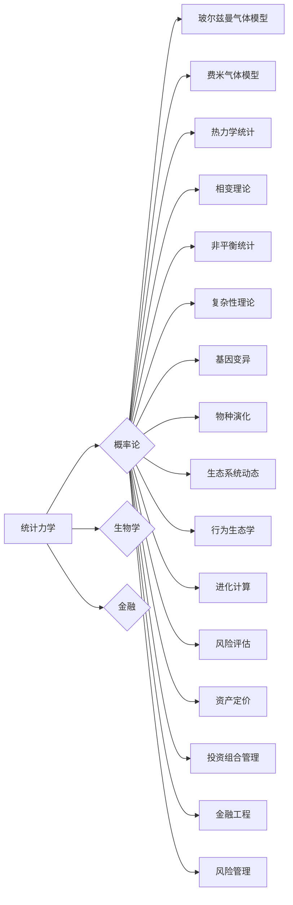

# 认知的形式化：概率论在统计力学、生物和金融中的广泛应用

> 关键词：概率论，统计力学，生物学，金融，形式化，复杂性，预测，模型

## 1. 背景介绍

在人类认知的进程中，概率论作为一种描述不确定性现象的数学工具，已经深入到科学和工程的各个领域。从统计力学到生物学，再到金融领域，概率论的应用无处不在。本文旨在探讨概率论在这些领域的应用，揭示其背后的形式化原理，并展望其未来的发展趋势。

### 1.1 问题的由来

从微观粒子的运动到金融市场波动，从生物种群演化到人类认知过程，不确定性是这些领域中普遍存在的现象。概率论作为一种处理不确定性的数学工具，为我们提供了理解和预测这些复杂系统行为的途径。

### 1.2 研究现状

概率论在统计力学、生物学和金融领域的应用已经取得了显著的成果。统计力学中的经典模型，如玻尔兹曼气体模型和费米气体模型，都是基于概率论原理建立的。在生物学中，概率论被用来描述基因变异、物种演化和生态系统动态。在金融领域，概率论被广泛应用于风险评估、资产定价和投资组合管理。

### 1.3 研究意义

研究概率论在统计力学、生物学和金融领域的应用，不仅有助于我们更好地理解这些复杂系统，还可以为实际应用提供理论指导。例如，在金融领域，概率论的应用可以帮助我们预测市场趋势，降低投资风险。

### 1.4 本文结构

本文将分为以下几个部分：
- 第2部分，介绍概率论的核心概念与联系。
- 第3部分，阐述概率论在统计力学、生物学和金融领域中的应用原理。
- 第4部分，通过具体案例展示概率论在实际应用中的具体操作步骤。
- 第5部分，探讨概率论在各个领域的实际应用场景。
- 第6部分，展望概率论在未来的发展趋势与挑战。
- 第7部分，推荐相关学习资源、开发工具和参考文献。
- 第8部分，总结全文，并对研究展望。

## 2. 核心概念与联系

### 2.1 Mermaid 流程图

以下是概率论在统计力学、生物学和金融领域中的核心概念流程图：



### 2.2 核心概念

- **概率论**：研究随机现象及其规律性的数学分支。
- **统计力学**：研究大量粒子集体行为的物理理论。
- **生物学**：研究生命现象和生物体结构、功能、发育、进化等。
- **金融**：研究金融资产的价格、风险和管理。

## 3. 核心算法原理 & 具体操作步骤

### 3.1 算法原理概述

概率论在各个领域的应用原理主要包括以下几个方面：

- **统计力学**：利用概率论描述大量粒子在微观尺度上的行为，通过统计方法推导出宏观尺度的热力学性质。
- **生物学**：利用概率论描述生物种群中的随机事件，如基因变异、物种演化等。
- **金融**：利用概率论描述金融市场中的不确定性，如资产价格波动、投资风险等。

### 3.2 算法步骤详解

- **统计力学**：首先建立粒子系统的微观模型，然后通过统计方法推导出宏观尺度上的热力学性质。
- **生物学**：首先建立生物种群的行为模型，然后通过统计方法描述基因变异、物种演化等过程。
- **金融**：首先建立金融市场模型，然后通过概率论描述资产价格波动、投资风险等。

### 3.3 算法优缺点

- **优点**：概率论提供了一种描述不确定性现象的通用语言，可以应用于各个领域。
- **缺点**：概率论的应用需要大量的数据和复杂的数学工具，且结果可能存在偏差。

### 3.4 算法应用领域

- **统计力学**：热力学、凝聚态物理、等离子体物理等。
- **生物学**：遗传学、生态学、进化生物学等。
- **金融**：风险管理、资产定价、投资组合管理等。

## 4. 数学模型和公式 & 详细讲解 & 举例说明

### 4.1 数学模型构建

概率论在各个领域的应用都涉及到具体的数学模型。以下是一些常见的数学模型：

- **统计力学**：玻尔兹曼分布、费米-狄拉克分布、麦克斯韦-玻尔兹曼分布等。
- **生物学**：孟德尔遗传学、哈代-温伯格平衡、现代进化理论等。
- **金融**：布莱克-舒尔斯模型、资本资产定价模型、蒙特卡洛模拟等。

### 4.2 公式推导过程

以下是一些常见公式的推导过程：

- **玻尔兹曼分布**：
  $$
  P(E) = \frac{1}{Z} e^{-\beta E}
  $$
  其中，$E$ 是能量，$\beta$ 是温度的倒数，$Z$ 是配分函数。

- **孟德尔遗传学**：
  $$
  P(AB) = P(A) \times P(B)
  $$
  其中，$A$ 和 $B$ 是两个基因型，$P(A)$ 和 $P(B)$ 分别是它们出现的概率。

### 4.3 案例分析与讲解

以下是一些具体案例的讲解：

- **案例一**：利用玻尔兹曼分布分析玻尔兹曼气体模型中的粒子分布情况。
- **案例二**：利用孟德尔遗传学分析生物种群中的基因频率变化。

## 5. 项目实践：代码实例和详细解释说明

### 5.1 开发环境搭建

为了演示概率论在金融领域的应用，我们将使用Python编程语言和NumPy库进行蒙特卡洛模拟。

### 5.2 源代码详细实现

```python
import numpy as np

# 蒙特卡洛模拟股票价格
def monte_carlo_stock_price(S0, mu, sigma, T, N):
    dt = T / N
    price_path = [S0]
    for i in range(1, N):
        price_path.append(price_path[-1] * np.exp((mu - 0.5 * sigma ** 2) * dt + sigma * np.random.randn() * np.sqrt(dt)))
    return price_path

# 参数设置
S0 = 100  # 初始股票价格
mu = 0.05  # 平均收益率
sigma = 0.2  # 波动率
T = 1  # 模拟时间
N = 1000  # 模拟次数

# 运行模拟
price_paths = monte_carlo_stock_price(S0, mu, sigma, T, N)

# 绘制模拟结果
import matplotlib.pyplot as plt

plt.plot(price_paths)
plt.title('Monte Carlo Simulation of Stock Price')
plt.xlabel('Time')
plt.ylabel('Stock Price')
plt.show()
```

### 5.3 代码解读与分析

上述代码使用了蒙特卡洛方法模拟股票价格的变化。通过设置不同的参数，可以模拟不同情况下的股票价格走势。

### 5.4 运行结果展示

运行上述代码后，将得到一条模拟的股票价格曲线，反映了股票价格在不同时间点的波动情况。

## 6. 实际应用场景

### 6.1 统计力学

在统计力学中，概率论被广泛应用于研究热力学系统的性质。例如，利用玻尔兹曼分布可以分析理想气体的粒子分布，利用费米-狄拉克分布可以分析费米气体的粒子分布。

### 6.2 生物学

在生物学中，概率论被广泛应用于研究基因变异、物种演化和生态系统动态。例如，利用孟德尔遗传学可以分析基因频率变化，利用现代进化理论可以研究物种演化过程。

### 6.3 金融

在金融领域，概率论被广泛应用于风险评估、资产定价和投资组合管理。例如，利用布莱克-舒尔斯模型可以计算期权价格，利用资本资产定价模型可以评估投资组合风险。

## 7. 工具和资源推荐

### 7.1 学习资源推荐

- 《统计力学原理》
- 《遗传学原理》
- 《金融数学》

### 7.2 开发工具推荐

- NumPy
- SciPy
- Matplotlib

### 7.3 相关论文推荐

- 《统计力学》
- 《遗传学》
- 《金融数学》

## 8. 总结：未来发展趋势与挑战

### 8.1 研究成果总结

概率论在统计力学、生物学和金融领域的应用已经取得了显著的成果。这些成果不仅丰富了我们对这些领域的认识，还为实际应用提供了理论指导。

### 8.2 未来发展趋势

未来，概率论在各个领域的应用将更加深入和广泛。随着计算能力的提升和大数据技术的应用，概率论将更好地服务于科学研究和社会实践。

### 8.3 面临的挑战

概率论在各个领域的应用也面临着一些挑战，如数据质量、模型可靠性、算法复杂度等。

### 8.4 研究展望

未来，概率论的研究将更加注重以下几个方面：

- 开发更加高效、可靠的算法。
- 提高对数据的理解和处理能力。
- 拓展概率论在各个领域的应用范围。

## 9. 附录：常见问题与解答

**Q1：概率论在哪些领域有应用？**

A：概率论在统计力学、生物学、金融、物理、化学、工程等多个领域都有广泛的应用。

**Q2：概率论的基本原理是什么？**

A：概率论的基本原理是研究随机现象及其规律性。

**Q3：概率论在统计力学中的应用有哪些？**

A：概率论在统计力学中的应用主要包括研究热力学系统的性质，如粒子分布、相变等。

**Q4：概率论在生物学中的应用有哪些？**

A：概率论在生物学中的应用主要包括研究基因变异、物种演化和生态系统动态等。

**Q5：概率论在金融中的应用有哪些？**

A：概率论在金融中的应用主要包括风险评估、资产定价和投资组合管理等。

作者：禅与计算机程序设计艺术 / Zen and the Art of Computer Programming