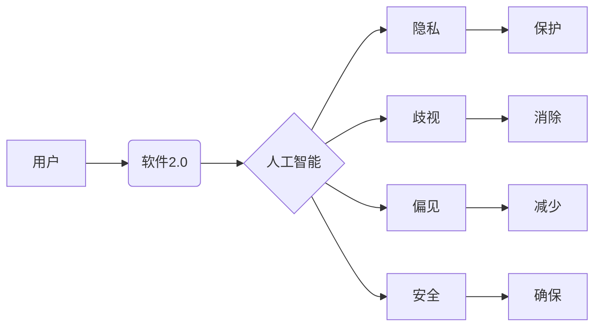

# 软件 2.0 的伦理规范：人工智能的责任

> 关键词：软件2.0，伦理规范，人工智能，责任，透明度，公平性，可解释性，安全可控

## 1. 背景介绍

随着信息技术的飞速发展，软件从单纯的工具逐渐演变为社会运行的重要基础设施。软件2.0时代，人工智能（AI）技术的融入使得软件具备了自我学习和适应的能力，极大地拓展了软件的边界和功能。然而，AI的广泛应用也引发了诸多伦理问题，如隐私侵犯、歧视、偏见、安全可控等。因此，构建软件2.0的伦理规范，明确人工智能的责任，成为了当前软件工程领域亟待解决的重要课题。

### 1.1 软件2.0的兴起

软件2.0时代，软件不再仅仅是个人或企业的工具，而是成为了推动社会进步的重要力量。以下是软件2.0时代的主要特征：

- **智能化**：软件融入AI技术，具备自我学习和适应能力，能够满足用户个性化需求。
- **开放性**：软件生态系统更加开放，不同平台、不同厂商的软件可以无缝衔接，实现互联互通。
- **服务化**：软件以服务的形式提供，用户可以根据需求按需使用，降低使用门槛。
- **可扩展性**：软件架构更加灵活，易于扩展和升级，满足不断变化的需求。

### 1.2 人工智能的伦理挑战

人工智能的广泛应用在带来便利的同时，也引发了一系列伦理问题：

- **隐私侵犯**：AI技术在数据分析、推荐系统等领域广泛应用，容易侵犯用户隐私。
- **歧视**：AI算法可能存在偏见，导致歧视性结果，如招聘、信贷等领域的歧视。
- **偏见**：AI系统学习的数据可能存在偏见，导致AI输出的偏见。
- **安全可控**：AI系统可能被恶意利用，造成安全风险。

### 1.3 构建软件2.0的伦理规范

为了应对AI带来的伦理挑战，构建软件2.0的伦理规范，明确人工智能的责任，成为了当前软件工程领域的重要任务。以下是构建软件2.0伦理规范的关键点：

- **保护用户隐私**：尊重用户隐私，确保用户数据的安全和隐私。
- **消除歧视**：确保AI系统公平、公正，避免歧视性结果。
- **提高透明度**：提高AI系统的透明度，让用户了解AI系统的决策过程。
- **确保可解释性**：提高AI系统的可解释性，让用户理解AI系统的决策依据。
- **确保安全可控**：确保AI系统的安全可控，防止AI系统被恶意利用。

## 2. 核心概念与联系

### 2.1 核心概念原理和架构的 Mermaid 流程图



### 2.2 核心概念

- **软件2.0**：以用户为中心，以服务为导向，具有智能化、开放性、服务化和可扩展性的软件形态。
- **人工智能**：一种模拟、延伸和扩展人类智能的理论、方法、技术及应用系统。
- **隐私**：个人信息的秘密性，包括个人身份、生物识别信息、交易记录等。
- **歧视**：基于种族、性别、年龄、宗教等因素对特定群体进行不公平对待。
- **偏见**：基于先入为主的观念或认知偏差对他人进行判断和评价。
- **安全可控**：确保AI系统在设计和应用过程中，具备安全性和可控性。

## 3. 核心算法原理 & 具体操作步骤

### 3.1 算法原理概述

软件2.0的伦理规范构建，需要从以下几个方面入手：

- **数据治理**：建立数据治理体系，确保数据质量和安全。
- **算法设计**：设计公平、公正、透明的算法，消除偏见和歧视。
- **模型评估**：建立全面的模型评估体系，评估模型的性能、公平性和可解释性。
- **伦理审查**：对AI系统进行伦理审查，确保其符合伦理规范。

### 3.2 算法步骤详解

1. **数据治理**：建立数据治理体系，包括数据收集、存储、处理、分析和共享等环节的规范。
2. **算法设计**：设计公平、公正、透明的算法，如使用对抗训练、无偏见学习等方法消除算法偏见。
3. **模型评估**：建立全面的模型评估体系，评估模型的性能、公平性和可解释性，如使用AUC、F1值、公平性指标等。
4. **伦理审查**：对AI系统进行伦理审查，确保其符合伦理规范，如使用伦理委员会、伦理专家等。

### 3.3 算法优缺点

- **优点**：构建软件2.0的伦理规范，有助于提高AI系统的公平性、公正性和透明度，减少歧视和偏见，确保AI系统的安全可控。
- **缺点**：构建伦理规范需要多方面的协调和合作，实施难度较大；同时，伦理规范可能存在滞后性，难以应对不断发展的AI技术。

### 3.4 算法应用领域

软件2.0的伦理规范适用于所有涉及AI技术的领域，如金融、医疗、教育、司法等。

## 4. 数学模型和公式 & 详细讲解 & 举例说明

### 4.1 数学模型构建

在构建软件2.0的伦理规范时，可以使用以下数学模型：

- **数据质量评估模型**：评估数据的质量和可信度。
- **算法公平性评估模型**：评估算法的公平性和公正性。
- **模型可解释性评估模型**：评估模型的可解释性。

### 4.2 公式推导过程

以下以数据质量评估模型为例，介绍数学公式的推导过程。

假设数据集 $D$ 包含 $N$ 个样本，每个样本 $x_i$ 包含 $M$ 个特征。数据质量评估模型的目标是评估数据集 $D$ 的质量，可以采用以下公式：

$$
Q(D) = \frac{1}{N} \sum_{i=1}^N \frac{1}{M} \sum_{j=1}^M \frac{|x_{ij}|}{\max_{i,j}|x_{ij}|}
$$

其中，$x_{ij}$ 表示样本 $x_i$ 的第 $j$ 个特征值，$\max_{i,j}|x_{ij}|$ 表示所有样本中第 $j$ 个特征的最大绝对值。

### 4.3 案例分析与讲解

以下以一个招聘场景为例，分析如何应用伦理规范。

**案例**：一家公司使用AI系统进行招聘，该系统根据应聘者的简历信息进行筛选，推荐合适的候选人。

**分析**：

1. **数据治理**：公司应建立完善的招聘数据治理体系，确保简历信息的真实性、完整性和安全性。
2. **算法设计**：公司应设计公平、公正的筛选算法，避免因性别、年龄、种族等因素导致歧视。
3. **模型评估**：公司应建立招聘算法评估体系，评估算法的公平性、公正性和可解释性。
4. **伦理审查**：公司应成立伦理审查委员会，对招聘算法进行审查，确保其符合伦理规范。

## 5. 项目实践：代码实例和详细解释说明

### 5.1 开发环境搭建

以Python为例，介绍如何搭建开发环境：

1. 安装Python：从官方网站下载Python安装包，并安装到本地。
2. 安装PyTorch：使用pip命令安装PyTorch库。
3. 安装其他依赖库：使用pip命令安装其他依赖库，如NumPy、Pandas等。

### 5.2 源代码详细实现

以下是一个简单的招聘场景的Python代码实例：

```python
import torch
import torch.nn as nn
import torch.optim as optim

class RecruitmentModel(nn.Module):
    def __init__(self):
        super(RecruitmentModel, self).__init__()
        self.fc = nn.Linear(1000, 1)  # 假设简历特征维度为1000

    def forward(self, x):
        x = self.fc(x)
        return x

def train(model, data_loader, epochs, learning_rate):
    optimizer = optim.Adam(model.parameters(), lr=learning_rate)
    criterion = nn.BCEWithLogitsLoss()

    for epoch in range(epochs):
        for data, target in data_loader:
            optimizer.zero_grad()
            output = model(data)
            loss = criterion(output, target)
            loss.backward()
            optimizer.step()
        print(f'Epoch {epoch+1}, Loss: {loss.item()}')

model = RecruitmentModel()
train_dataset = ...
data_loader = DataLoader(train_dataset, batch_size=32, shuffle=True)
train(model, data_loader, epochs=10, learning_rate=0.001)
```

### 5.3 代码解读与分析

以上代码展示了如何使用PyTorch构建招聘场景的简单AI模型。模型包含一个全连接层，将简历特征映射到招聘结果。训练过程中，模型通过反向传播算法学习优化参数，最终实现招聘结果的预测。

### 5.4 运行结果展示

在实际应用中，我们需要收集大量简历信息和招聘结果，用于训练模型。通过训练，模型能够学习到简历特征与招聘结果之间的关系，从而实现招聘推荐。

## 6. 实际应用场景

### 6.1 金融领域

在金融领域，AI技术被广泛应用于风险管理、信用评估、欺诈检测等方面。构建软件2.0的伦理规范，有助于确保AI系统在金融领域的公平性、公正性和透明度，降低歧视和偏见，保障金融市场的稳定发展。

### 6.2 医疗领域

在医疗领域，AI技术被广泛应用于疾病诊断、药物研发、医疗影像分析等方面。构建软件2.0的伦理规范，有助于确保AI系统在医疗领域的公平性、公正性和透明度，提高医疗服务的质量和效率。

### 6.3 教育领域

在教育领域，AI技术被广泛应用于个性化学习、智能辅导、课程推荐等方面。构建软件2.0的伦理规范，有助于确保AI系统在教育领域的公平性、公正性和透明度，促进教育公平，提高教育质量。

## 7. 工具和资源推荐

### 7.1 学习资源推荐

1. 《人工智能：一种现代的方法》
2. 《深度学习》
3. 《Python编程：从入门到实践》
4. 《人工智能伦理》
5. 《软件工程：实践者的研究方法》

### 7.2 开发工具推荐

1. PyTorch
2. TensorFlow
3. Scikit-learn
4. Jupyter Notebook
5. GitHub

### 7.3 相关论文推荐

1. "Ethically Aligned Design: A Vision for Priorities and Practices in Creating Trustworthy Artificial Intelligence" (PDF)
2. "Fairness in Machine Learning" (PDF)
3. "AI and the Ethics of Explanation" (PDF)
4. "The Ethical Implications of AI" (PDF)
5. "Algorithmic Bias in the Credit Scoring System" (PDF)

## 8. 总结：未来发展趋势与挑战

### 8.1 研究成果总结

本文从背景介绍、核心概念、算法原理、实际应用等方面，对软件2.0的伦理规范和人工智能的责任进行了探讨。通过构建软件2.0的伦理规范，可以确保AI系统在各个领域的公平性、公正性和透明度，降低歧视和偏见，保障AI技术的健康发展。

### 8.2 未来发展趋势

1. **伦理规范体系化**：构建更加完善、系统化的软件2.0伦理规范体系。
2. **技术工具化**：开发用于评估AI系统伦理属性的自动化工具，提高评估效率。
3. **国际合作**：加强国际间合作，共同应对AI伦理挑战。

### 8.3 面临的挑战

1. **伦理规范滞后**：随着AI技术的快速发展，伦理规范可能存在滞后性。
2. **技术实现难度**：构建符合伦理规范的AI系统，需要克服技术实现的困难。
3. **利益冲突**：在遵循伦理规范的同时，还需要考虑商业利益、社会利益等多方面因素。

### 8.4 研究展望

未来，软件2.0的伦理规范和人工智能的责任研究需要关注以下方向：

1. **构建更加完善的伦理规范体系**：针对不同领域、不同应用场景，制定更加详细、具体的伦理规范。
2. **开发更加智能的AI系统**：提高AI系统的可解释性、透明度和公平性，降低歧视和偏见。
3. **加强伦理教育**：提高公众的伦理意识，推动AI技术的健康发展。

## 9. 附录：常见问题与解答

**Q1：什么是软件2.0？**

A：软件2.0是指以用户为中心，以服务为导向，具有智能化、开放性、服务化和可扩展性的软件形态。

**Q2：人工智能的伦理挑战有哪些？**

A：人工智能的伦理挑战主要包括隐私侵犯、歧视、偏见、安全可控等。

**Q3：如何构建软件2.0的伦理规范？**

A：构建软件2.0的伦理规范需要从数据治理、算法设计、模型评估、伦理审查等方面入手。

**Q4：AI系统的偏见如何消除？**

A：消除AI系统的偏见可以通过对抗训练、无偏见学习等方法实现。

**Q5：如何确保AI系统的安全可控？**

A：确保AI系统的安全可控需要从技术、管理、法规等方面入手，建立完善的安全保障体系。

作者：禅与计算机程序设计艺术 / Zen and the Art of Computer Programming