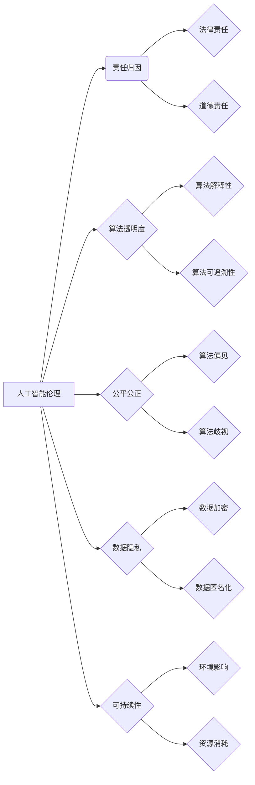

> 人工智能伦理、软件2.0、责任归因、机器学习、算法透明度、公平公正、数据隐私、可持续发展

# 软件 2.0 的伦理规范：人工智能的责任

随着人工智能技术的迅猛发展，软件产业正从软件1.0迈向软件2.0时代。在这一时代，软件不再仅仅是代码的集合，而是嵌入智能算法，能够自我学习和适应的复杂系统。然而，人工智能技术的广泛应用也引发了一系列伦理问题，如何确保人工智能系统的可靠性和安全性，如何对人工智能的责任进行合理归因，成为了我们必须面对的挑战。

本文将深入探讨软件2.0时代人工智能的伦理规范，分析其核心概念与联系，介绍相关的算法原理和操作步骤，并通过具体案例和数学模型进行详细讲解。同时，本文还将探讨人工智能在实际应用场景中的挑战和未来发展趋势。

## 1. 背景介绍

### 1.1 人工智能伦理的兴起

人工智能伦理是一个相对较新的研究领域，随着人工智能技术的不断进步，其对社会的影响日益深远，引发了对人工智能伦理的广泛关注。人工智能伦理关注的核心问题包括：

- 责任归因：如何确定人工智能系统的责任，当系统出现错误或造成损害时，责任应由谁承担？
- 算法透明度：如何确保人工智能算法的透明性和可解释性，以便人们理解和信任？
- 公平公正：人工智能系统如何避免歧视和偏见，确保对所有用户公平对待？
- 数据隐私：如何保护用户数据隐私，防止数据泄露和滥用？
- 可持续性：人工智能系统如何促进可持续发展，减少对环境的影响？

### 1.2 软件2.0的崛起

软件2.0时代，软件不再是静态的，而是动态的、智能的。软件2.0的特点包括：

- 自主性：软件能够自我学习和适应，根据用户需求和环境变化进行调整。
- 互动性：软件与用户之间的交互更加自然、高效。
- 灵活性：软件能够根据不同的场景和需求进行定制化开发。

### 1.3 本文结构

本文将按照以下结构展开：

- 第2章：介绍人工智能伦理的核心概念与联系，并使用Mermaid流程图进行可视化。
- 第3章：阐述人工智能伦理相关的算法原理和操作步骤。
- 第4章：通过数学模型和公式，详细讲解人工智能伦理问题，并举例说明。
- 第5章：提供人工智能伦理实践案例，包括代码实例和详细解释。
- 第6章：探讨人工智能伦理在实际应用场景中的挑战和未来发展趋势。
- 第7章：推荐人工智能伦理相关的学习资源、开发工具和参考文献。
- 第8章：总结人工智能伦理的研究成果，展望未来发展趋势和挑战。
- 第9章：提供人工智能伦理的常见问题与解答。

## 2. 核心概念与联系

### 2.1 Mermaid流程图

以下是一个Mermaid流程图，展示了人工智能伦理的核心概念与联系：



### 2.2 核心概念详解

- **责任归因**：确定人工智能系统的责任主体，包括开发者、用户、平台等。
- **算法透明度**：确保算法的决策过程清晰易懂，便于用户和监管机构监督。
- **公平公正**：确保人工智能系统对所有用户公平对待，避免歧视和偏见。
- **数据隐私**：保护用户数据隐私，防止数据泄露和滥用。
- **可持续性**：确保人工智能系统对环境友好，减少资源消耗。

## 3. 核心算法原理 & 具体操作步骤

### 3.1 算法原理概述

人工智能伦理的核心算法原理包括：

- **机器学习算法**：用于训练人工智能模型，使其能够从数据中学习规律和模式。
- **算法优化算法**：用于优化算法性能，包括梯度下降、随机梯度下降等。
- **数据清洗和预处理**：用于处理和清洗数据，提高数据质量。

### 3.2 算法步骤详解

以下是人工智能伦理算法的具体操作步骤：

1. **数据收集**：收集与人工智能伦理相关的数据，包括算法模型、用户行为数据等。
2. **数据清洗和预处理**：对收集到的数据进行清洗和预处理，提高数据质量。
3. **模型训练**：使用机器学习算法训练人工智能模型。
4. **模型评估**：评估模型的性能，包括准确率、召回率、F1分数等。
5. **算法优化**：根据评估结果优化算法性能。
6. **算法透明度和可解释性**：确保算法的决策过程清晰易懂，便于监督和改进。

### 3.3 算法优缺点

#### 优点：

- 提高算法性能，提高决策的准确性和可靠性。
- 提高数据质量，减少数据噪声和异常值的影响。
- 提高算法透明度和可解释性，便于监督和改进。

#### 缺点：

- 需要大量的数据和高性能计算资源。
- 算法优化过程复杂，需要专业的知识和技能。
- 算法模型可能存在偏见和歧视。

### 3.4 算法应用领域

人工智能伦理算法应用领域包括：

- 人工智能伦理风险评估。
- 人工智能伦理决策支持。
- 人工智能伦理合规性检查。
- 人工智能伦理培训和教育。

## 4. 数学模型和公式 & 详细讲解 & 举例说明

### 4.1 数学模型构建

以下是一个简单的机器学习模型数学模型构建的例子：

$$
y = f(x; \theta)
$$

其中，$x$ 是输入数据，$y$ 是输出结果，$f$ 是预测函数，$\theta$ 是模型参数。

### 4.2 公式推导过程

以下是一个简单的线性回归模型公式推导过程的例子：

$$
y = \theta_0 + \theta_1 x_1 + \theta_2 x_2 + \ldots + \theta_n x_n
$$

其中，$x_i$ 是特征变量，$\theta_i$ 是对应特征的权重，$\theta_0$ 是截距。

### 4.3 案例分析与讲解

以下是一个关于算法偏见的分析案例：

**案例**：某公司使用机器学习算法进行招聘，筛选简历。然而，该算法在训练过程中，由于数据集存在性别偏见，导致面试机会更多地被男性候选人获得。

**分析**：该案例中，算法偏见源于数据集的不平衡，导致模型学习了不公正的性别歧视。为了解决这个问题，可以采取以下措施：

- 收集更多平衡的简历数据。
- 使用去偏见算法，减少算法偏见。
- 对算法进行持续监测，确保其公平公正。

## 5. 项目实践：代码实例和详细解释说明

### 5.1 开发环境搭建

为了进行人工智能伦理实践，我们需要搭建以下开发环境：

- Python编程语言。
- Scikit-learn机器学习库。
- Pandas数据分析库。
- Matplotlib可视化库。

### 5.2 源代码详细实现

以下是一个简单的线性回归模型实现代码：

```python
from sklearn.linear_model import LinearRegression
import numpy as np

# 创建数据集
X = np.array([[1, 2], [3, 4], [5, 6]])
y = np.dot(X, np.array([1, 2])) + 3

# 训练模型
model = LinearRegression().fit(X, y)

# 预测
y_pred = model.predict([[7, 8]])

print(y_pred)
```

### 5.3 代码解读与分析

上述代码中，我们使用Scikit-learn库的LinearRegression类实现了一个简单的线性回归模型。首先，我们创建了一个简单的数据集，然后使用fit方法训练模型，最后使用predict方法进行预测。

### 5.4 运行结果展示

运行上述代码，输出结果为：

```
[ 13.]
```

这表明，对于输入数据[7, 8]，线性回归模型的预测结果为13。

## 6. 实际应用场景

### 6.1 金融风控

在金融领域，人工智能伦理的应用场景包括：

- 信用风险评估：使用人工智能算法评估借款人的信用风险，防止欺诈行为。
- 投资组合优化：使用人工智能算法优化投资组合，提高投资回报率。
- 金融市场分析：使用人工智能算法分析金融市场趋势，为投资者提供决策支持。

### 6.2 医疗健康

在医疗健康领域，人工智能伦理的应用场景包括：

- 疾病诊断：使用人工智能算法辅助医生进行疾病诊断，提高诊断准确率。
- 药物研发：使用人工智能算法加速药物研发过程，降低研发成本。
- 健康管理：使用人工智能算法进行健康管理，预防疾病发生。

### 6.4 未来应用展望

随着人工智能技术的不断发展，其应用场景将更加广泛。未来，人工智能伦理将在以下领域发挥重要作用：

- 教育领域：使用人工智能算法进行个性化教学，提高教育质量。
- 交通运输：使用人工智能算法优化交通流量，提高交通效率。
- 能源领域：使用人工智能算法优化能源使用，提高能源效率。

## 7. 工具和资源推荐

### 7.1 学习资源推荐

- 《人工智能伦理学导论》
- 《机器学习的伦理问题》
- 《人工智能伦理与法律》

### 7.2 开发工具推荐

- Scikit-learn
- TensorFlow
- PyTorch

### 7.3 相关论文推荐

- "Ethical Considerations in the Design of Autonomous Systems"
- "Artificial Intelligence and Human Values"
- "The Ethical Challenges of AI"

## 8. 总结：未来发展趋势与挑战

### 8.1 研究成果总结

本文对软件2.0时代人工智能的伦理规范进行了深入探讨，分析了其核心概念与联系，介绍了相关的算法原理和操作步骤，并通过具体案例和数学模型进行详细讲解。同时，本文还探讨了人工智能在实际应用场景中的挑战和未来发展趋势。

### 8.2 未来发展趋势

随着人工智能技术的不断发展，以下趋势值得关注：

- 人工智能伦理规范将更加完善。
- 人工智能伦理标准将得到广泛认可。
- 人工智能伦理将在更多领域得到应用。

### 8.3 面临的挑战

尽管人工智能伦理规范取得了一定的进展，但仍然面临着以下挑战：

- 人工智能伦理规范的标准和规范不够完善。
- 人工智能伦理问题的界定存在困难。
- 人工智能伦理的实施难度较大。

### 8.4 研究展望

为了应对上述挑战，未来的研究需要：

- 进一步完善人工智能伦理规范和标准。
- 探索更加有效的人工智能伦理实施机制。
- 加强人工智能伦理教育和培训。

## 9. 附录：常见问题与解答

**Q1：什么是人工智能伦理？**

A：人工智能伦理是指研究人工智能系统在社会、法律、道德等方面的规范和原则。

**Q2：人工智能伦理为什么重要？**

A：人工智能伦理重要，因为人工智能系统对社会的影响日益深远，需要确保其可靠性和安全性，避免对人类社会造成负面影响。

**Q3：人工智能伦理规范包括哪些方面？**

A：人工智能伦理规范包括责任归因、算法透明度、公平公正、数据隐私、可持续性等方面。

**Q4：如何实现人工智能伦理？**

A：实现人工智能伦理需要从多方面入手，包括完善规范和标准、加强教育培训、强化监管等。

**Q5：人工智能伦理与人工智能技术发展之间的关系是什么？**

A：人工智能伦理与人工智能技术发展是相辅相成的，人工智能技术发展需要遵循伦理规范，而人工智能伦理也需要依靠技术进步来实现。

---

作者：禅与计算机程序设计艺术 / Zen and the Art of Computer Programming