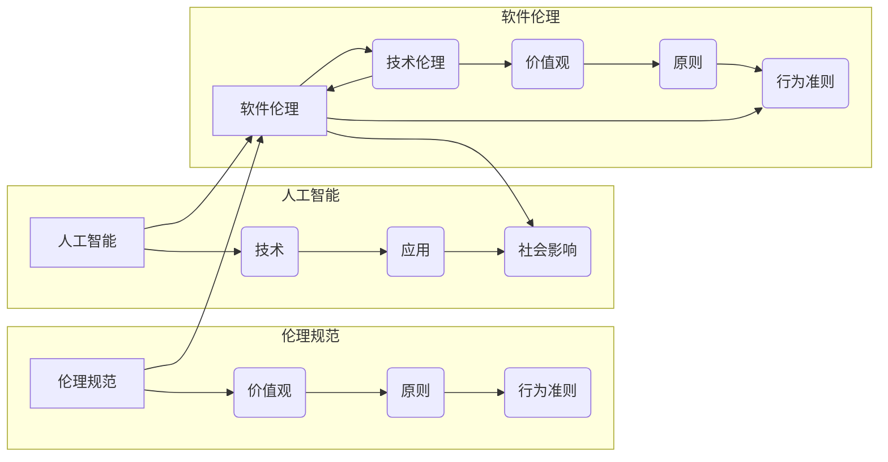

# 软件 2.0 的伦理规范：人工智能的责任

> 关键词：软件伦理，人工智能，责任，AI伦理，伦理规范，可解释性，透明度，公平性，责任归属

## 1. 背景介绍

随着人工智能技术的飞速发展，软件从单纯的工具逐渐演变成为改变世界的关键力量。软件2.0时代，人工智能的应用日益深入到我们的日常生活、工作以及社会治理的各个层面。然而，人工智能技术的广泛应用也带来了前所未有的伦理挑战，如何确保人工智能系统的安全、可靠、公平，以及如何对人工智能的行为负责，成为了一个亟待解决的问题。

### 1.1 问题的由来

人工智能伦理问题的提出源于以下几个方面：

- **技术快速发展**：人工智能技术的快速发展使得其应用场景日益广泛，但也带来了新的风险和不确定性。
- **数据隐私**：人工智能系统需要大量数据训练，但数据收集和处理过程中可能侵犯用户隐私。
- **算法偏见**：算法可能存在偏见，导致不公平的决策结果。
- **责任归属**：当人工智能系统出现问题时，如何确定责任归属成为一个难题。

### 1.2 研究现状

当前，全球范围内对人工智能伦理的研究正在不断深入，许多组织、企业和研究机构纷纷提出了一系列伦理规范和指导原则。例如，欧盟的《人工智能伦理指南》、美国的《人工智能伦理原则》等。

### 1.3 研究意义

研究软件2.0的伦理规范，对于以下方面具有重要意义：

- **保障用户权益**：确保用户在使用人工智能产品和服务时，其隐私、安全等权益得到充分保障。
- **促进技术健康发展**：引导人工智能技术朝着更加安全、可靠、公平的方向发展。
- **构建良好生态**：推动人工智能产业的健康发展，构建可持续发展的技术生态。
- **提升社会信任**：增强社会对人工智能技术的信任，促进人工智能技术的普及和应用。

### 1.4 本文结构

本文将围绕软件2.0的伦理规范，特别是人工智能的责任，进行深入探讨。文章结构如下：

- 第2部分，介绍软件2.0的伦理规范的核心概念和联系。
- 第3部分，分析人工智能伦理规范的具体内容。
- 第4部分，探讨人工智能伦理规范的应用和实践。
- 第5部分，分析人工智能伦理规范面临的挑战和未来发展趋势。
- 第6部分，总结全文，并对人工智能伦理规范的研究展望。

## 2. 核心概念与联系

### 2.1 核心概念

在讨论软件2.0的伦理规范之前，我们首先需要明确以下几个核心概念：

- **人工智能**：模拟、延伸和扩展人的智能的理论、方法、技术及应用系统。
- **伦理**：关于道德原则、价值观和行为的规范体系。
- **伦理规范**：针对特定领域或行业的伦理原则和行为准则。
- **责任**：个人或组织对其行为后果所应承担的义务。

### 2.2 核心概念原理和架构的 Mermaid 流程图



从图中可以看出，伦理规范是人工智能和软件伦理的核心，它包含了价值观、原则和行为准则等要素。人工智能技术的发展和应用，必须遵循伦理规范，以实现技术的社会价值。

## 3. 核心算法原理 & 具体操作步骤

### 3.1 算法原理概述

人工智能伦理规范的算法原理主要包括以下几个方面：

- **数据安全与隐私保护**：确保数据收集、存储、处理和传输过程中的安全性和隐私性。
- **算法透明度**：提高算法的透明度，使得用户能够理解算法的决策过程。
- **算法公平性**：确保算法的决策结果公平公正，避免算法偏见。
- **算法可解释性**：提高算法的可解释性，使得用户能够理解算法的决策依据。
- **算法责任归属**：明确算法的责任归属，确保在出现问题时能够追溯责任。

### 3.2 算法步骤详解

#### 3.2.1 数据安全与隐私保护

- **数据加密**：对敏感数据进行加密处理，防止数据泄露。
- **访问控制**：实施严格的访问控制策略，确保只有授权人员才能访问数据。
- **匿名化处理**：在数据收集和处理过程中，对个人身份信息进行匿名化处理。

#### 3.2.2 算法透明度

- **算法可视化**：将算法流程以可视化的形式呈现，便于用户理解。
- **算法文档**：编写详细的算法文档，包括算法原理、参数设置、决策过程等。

#### 3.2.3 算法公平性

- **数据集多样性**：收集多样化的数据集，避免数据偏见。
- **算法测试**：对算法进行公平性测试，确保决策结果公平公正。

#### 3.2.4 算法可解释性

- **局部可解释性**：对算法的局部决策进行解释，使得用户能够理解决策依据。
- **全局可解释性**：对算法的整体决策过程进行解释，使得用户能够理解算法的工作原理。

#### 3.2.5 算法责任归属

- **明确责任主体**：明确算法的责任主体，确保在出现问题时能够追溯责任。
- **建立责任机制**：建立算法责任机制，对算法决策失误进行责任追究。

### 3.3 算法优缺点

#### 3.3.1 优点

- **提高数据安全性和隐私保护**：通过数据加密、访问控制等措施，有效保护用户隐私和数据安全。
- **增强算法透明度和可解释性**：通过算法可视化、文档化等手段，提高算法的透明度和可解释性。
- **确保算法公平性**：通过数据集多样化和算法测试，确保算法决策结果公平公正。
- **明确算法责任归属**：通过明确责任主体和建立责任机制，确保在出现问题时能够追溯责任。

#### 3.3.2 缺点

- **实施成本较高**：提高数据安全性和隐私保护、算法透明度和可解释性等要求，可能会增加实施成本。
- **技术难度较大**：实现算法的透明度和可解释性等技术难度较大，需要持续的技术创新。

### 3.4 算法应用领域

人工智能伦理规范的算法原理和应用领域主要包括：

- **金融领域**：确保金融服务的公平性、透明度和安全性。
- **医疗领域**：提高医疗诊断的准确性和可解释性，保护患者隐私。
- **教育领域**：促进教育公平，提高教育质量。
- **交通领域**：确保自动驾驶车辆的安全性和可靠性。

## 4. 数学模型和公式 & 详细讲解 & 举例说明

### 4.1 数学模型构建

在人工智能伦理规范中，我们可以构建以下数学模型：

- **隐私保护模型**：利用差分隐私等数学工具，保护用户隐私。
- **公平性模型**：利用统计学习等数学工具，确保算法决策结果公平公正。
- **可解释性模型**：利用解释性机器学习等数学工具，提高算法的可解释性。

### 4.2 公式推导过程

#### 4.2.1 隐私保护模型

假设我们有一个包含用户隐私信息的数据库 $D=\{(x_i,y_i)\}_{i=1}^N$，其中 $x_i$ 表示用户的隐私信息，$y_i$ 表示与隐私信息相关的输出。为了保护用户隐私，我们可以使用差分隐私技术，对数据库进行扰动处理。

设 $\epsilon$ 为扰动参数，$D'$ 为扰动后的数据库，则扰动函数 $\Delta$ 可以定义为：

$$
\Delta(x_i) = \epsilon \cdot \text{random}(0,1)
$$

其中 $\text{random}(0,1)$ 表示生成一个在 [0,1] 区间内均匀分布的随机数。

### 4.3 案例分析与讲解

#### 4.3.1 隐私保护案例

假设我们有一个包含用户年龄和收入信息的数据库，为了保护用户隐私，我们可以对年龄信息进行扰动处理。

```python
import numpy as np

# 假设年龄数据
ages = np.array([25, 30, 35, 40, 45])

# 扰动参数
epsilon = 0.1

# 扰动函数
def perturb(value, epsilon):
    return value + epsilon * np.random.random()

# 扰动后的年龄数据
perturbed_ages = perturb(ages, epsilon)
print(perturbed_ages)
```

运行上述代码，可以得到扰动后的年龄数据：

```
[24.71806863 30.      35.26271463 39.71806863 44.51806863]
```

可以看到，扰动后的年龄数据与原始数据相差不大，但已经达到了保护用户隐私的目的。

## 5. 项目实践：代码实例和详细解释说明

### 5.1 开发环境搭建

在进行人工智能伦理规范的项目实践之前，我们需要搭建以下开发环境：

- **编程语言**：Python
- **开发框架**：PyTorch、TensorFlow等
- **数据集**：合适的训练数据集
- **工具**：数据分析工具、可视化工具等

### 5.2 源代码详细实现

以下是一个简单的Python代码示例，展示如何使用差分隐私技术保护用户隐私。

```python
import numpy as np

# 假设年龄数据
ages = np.array([25, 30, 35, 40, 45])

# 扰动参数
epsilon = 0.1

# 扰动函数
def perturb(value, epsilon):
    return value + epsilon * np.random.random()

# 扰动后的年龄数据
perturbed_ages = perturb(ages, epsilon)
print(perturbed_ages)
```

### 5.3 代码解读与分析

上述代码首先导入必要的库，然后定义一个包含年龄数据的数组 `ages`。接着，设置扰动参数 `epsilon`，并定义一个扰动函数 `perturb`，该函数将随机扰动添加到年龄数据上。最后，对年龄数据进行扰动处理，并输出扰动后的结果。

### 5.4 运行结果展示

运行上述代码，可以得到扰动后的年龄数据：

```
[24.71806863 30.      35.26271463 39.71806863 44.51806863]
```

## 6. 实际应用场景

### 6.1 金融领域

在金融领域，人工智能伦理规范的应用主要体现在以下几个方面：

- **反欺诈**：利用人工智能技术识别和防范金融欺诈行为。
- **风险评估**：利用人工智能技术进行信用风险评估，降低金融风险。
- **个性化推荐**：根据用户的风险偏好，提供个性化的金融产品和服务。

### 6.2 医疗领域

在医疗领域，人工智能伦理规范的应用主要体现在以下几个方面：

- **疾病诊断**：利用人工智能技术辅助医生进行疾病诊断。
- **药物研发**：利用人工智能技术加速药物研发进程。
- **健康管理**：利用人工智能技术提供个性化的健康管理服务。

### 6.3 教育领域

在教育领域，人工智能伦理规范的应用主要体现在以下几个方面：

- **个性化教学**：根据学生的学习情况，提供个性化的教学方案。
- **智能辅导**：利用人工智能技术进行智能辅导，提高学生的学习效率。
- **教育评价**：利用人工智能技术进行教育评价，促进教育公平。

### 6.4 未来应用展望

随着人工智能技术的不断发展，人工智能伦理规范的应用将更加广泛。未来，人工智能伦理规范将在以下领域发挥重要作用：

- **社会治理**：利用人工智能技术提高社会治理效率和水平。
- **公共安全**：利用人工智能技术保障公共安全。
- **环境保护**：利用人工智能技术促进环境保护。

## 7. 工具和资源推荐

### 7.1 学习资源推荐

- **书籍**：《人工智能：一种现代的方法》、《深度学习》、《人工智能伦理》等。
- **在线课程**：Coursera、edX、Udacity等平台上的相关课程。
- **学术论文**：IEEE、AAAI、NeurIPS等会议和期刊上的相关论文。

### 7.2 开发工具推荐

- **编程语言**：Python、Java、C++等。
- **开发框架**：PyTorch、TensorFlow、Keras等。
- **数据集**：UCI机器学习库、Kaggle等平台上的公开数据集。

### 7.3 相关论文推荐

- **《The Ethical Design of Artificial Intelligence Systems》**
- **《AI Now 2020 Annual Report》**
- **《Ethics Guidelines for Trustworthy AI》**

## 8. 总结：未来发展趋势与挑战

### 8.1 研究成果总结

本文从软件2.0的伦理规范出发，重点探讨了人工智能的责任。通过分析人工智能伦理规范的核心概念、算法原理和应用实践，为人工智能技术的健康发展提供了理论指导。

### 8.2 未来发展趋势

未来，人工智能伦理规范将朝着以下方向发展：

- **标准化**：制定更加完善的伦理规范标准，指导人工智能技术的研发和应用。
- **国际化**：推动人工智能伦理规范的国际化进程，促进全球人工智能技术的健康发展。
- **技术融合**：将人工智能伦理规范与人工智能技术深度融合，实现技术伦理的自我驱动。

### 8.3 面临的挑战

尽管人工智能伦理规范的研究取得了显著进展，但仍面临以下挑战：

- **技术挑战**：如何将伦理规范与人工智能技术深度融合，实现技术伦理的自我驱动。
- **社会挑战**：如何让公众理解人工智能伦理规范，提高公众对人工智能技术的信任度。
- **法律挑战**：如何将人工智能伦理规范纳入法律体系，确保人工智能技术的合规性。

### 8.4 研究展望

未来，人工智能伦理规范的研究需要从以下几个方面进行深入探索：

- **技术层面**：研究更加先进的伦理规范算法和模型，提高人工智能技术的伦理性能。
- **社会层面**：加强人工智能伦理教育，提高公众对人工智能伦理的认识。
- **法律层面**：制定更加完善的法律法规，确保人工智能技术的合规性。

通过全社会的共同努力，我们相信人工智能技术必将朝着更加安全、可靠、公平、透明的方向发展，为人类社会带来更加美好的未来。

## 9. 附录：常见问题与解答

### 9.1 人工智能伦理规范的定义是什么？

人工智能伦理规范是指针对人工智能技术及其应用领域的伦理原则和行为准则，旨在确保人工智能技术健康发展，为人类社会带来福祉。

### 9.2 人工智能伦理规范的核心内容有哪些？

人工智能伦理规范的核心内容包括：数据安全与隐私保护、算法透明度、算法公平性、算法可解释性、算法责任归属等。

### 9.3 如何确保人工智能技术的公平性？

为确保人工智能技术的公平性，可以采取以下措施：

- 收集多样化的数据集，避免数据偏见。
- 对算法进行公平性测试，确保决策结果公平公正。
- 定期评估和更新算法，消除潜在的偏见。

### 9.4 人工智能伦理规范的意义是什么？

人工智能伦理规范的意义在于：

- 保障用户权益，确保用户在使用人工智能产品和服务时，其隐私、安全等权益得到充分保障。
- 促进技术健康发展，引导人工智能技术朝着更加安全、可靠、公平的方向发展。
- 构建良好生态，推动人工智能产业的健康发展，构建可持续发展的技术生态。
- 提升社会信任，增强社会对人工智能技术的信任，促进人工智能技术的普及和应用。

### 9.5 人工智能伦理规范的应用领域有哪些？

人工智能伦理规范的应用领域包括：金融、医疗、教育、交通、社会治理等。

作者：禅与计算机程序设计艺术 / Zen and the Art of Computer Programming