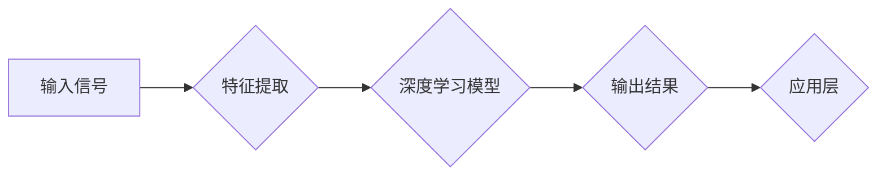

# 软件 2.0 的应用领域：图像识别、语音识别

> 关键词：软件 2.0，图像识别，语音识别，人工智能，深度学习，计算机视觉，自然语言处理，机器学习

## 1. 背景介绍

随着互联网技术的飞速发展，软件行业已经经历了从桌面软件到Web 2.0的转变。如今，我们正处在软件 2.0的时代，其核心特征是人工智能技术的广泛应用。在这一时代，图像识别和语音识别作为人工智能领域的两个重要分支，正逐渐改变着我们的生活方式和产业格局。

### 1.1 问题的由来

图像识别和语音识别技术的需求源于人类对信息获取和处理效率的追求。随着智能手机、智能家居、自动驾驶等领域的快速发展，人们对于图像和语音信息的处理需求日益增长。如何让计算机像人类一样理解和处理图像、语音信息，成为了软件 2.0 时代亟待解决的问题。

### 1.2 研究现状

近年来，深度学习技术的发展为图像识别和语音识别带来了突破性的进展。基于深度学习模型的图像识别和语音识别技术已经能够达到或超越人类水平，并在各个应用领域取得了显著的成果。

### 1.3 研究意义

图像识别和语音识别技术的发展，不仅能够提高信息处理效率，还能够推动相关产业的创新和发展，为社会带来巨大的经济效益。

### 1.4 本文结构

本文将从核心概念、算法原理、数学模型、项目实践、实际应用场景、未来发展趋势与挑战等方面，全面介绍软件 2.0 的应用领域——图像识别和语音识别。

## 2. 核心概念与联系

### 2.1 核心概念原理和架构的 Mermaid 流程图



### 2.2 核心概念

- **图像识别**：利用计算机技术对图像进行分析和处理，实现对图像内容的理解、分类、检测等操作。
- **语音识别**：将语音信号转换为文本信息，实现对语音内容的识别和理解。
- **深度学习**：一种基于人工神经网络的机器学习技术，通过学习大量的数据，自动提取特征并完成复杂的模式识别任务。
- **计算机视觉**：研究如何使计算机具备人类的视觉能力，实现对图像和视频的感知、理解、处理和生成。
- **自然语言处理**：研究如何使计算机理解和处理人类自然语言，实现对文本信息的提取、理解、生成等操作。

## 3. 核心算法原理 & 具体操作步骤

### 3.1 算法原理概述

图像识别和语音识别的核心算法原理都是基于深度学习技术。深度学习模型通过学习大量的数据，自动提取特征并完成复杂的模式识别任务。

### 3.2 算法步骤详解

1. **数据预处理**：对图像和语音数据进行预处理，包括去噪、归一化、裁剪等操作。
2. **特征提取**：使用卷积神经网络(CNN)或循环神经网络(RNN)等深度学习模型提取图像和语音数据中的特征。
3. **模型训练**：使用标注数据进行模型训练，优化模型参数。
4. **模型评估**：使用测试数据评估模型性能，调整模型参数。
5. **模型部署**：将训练好的模型部署到实际应用中。

### 3.3 算法优缺点

- **优点**：深度学习模型能够自动提取特征，避免了传统特征工程的方法，提高了识别精度。
- **缺点**：深度学习模型需要大量的训练数据和计算资源，且模型的可解释性较差。

### 3.4 算法应用领域

- **图像识别**：人脸识别、物体检测、图像分割、图像分类等。
- **语音识别**：语音助手、语音翻译、语音搜索、语音识别等。

## 4. 数学模型和公式 & 详细讲解 & 举例说明

### 4.1 数学模型构建

图像识别和语音识别的数学模型主要基于深度学习技术，以下以CNN为例进行说明。

### 4.2 公式推导过程

$$
y = f(WL(x) + b)
$$

其中，$x$ 为输入数据，$W$ 为权重矩阵，$L$ 为线性变换，$b$ 为偏置项，$f$ 为激活函数，$y$ 为输出结果。

### 4.3 案例分析与讲解

以人脸识别为例，说明图像识别的数学模型和公式。

1. **数据预处理**：对图像进行灰度化、归一化等操作。
2. **特征提取**：使用CNN提取图像特征，如卷积层、池化层等。
3. **全连接层**：将提取的特征进行全连接，得到特征向量。
4. **激活函数**：使用ReLU等激活函数，将特征向量映射到输出结果。

## 5. 项目实践：代码实例和详细解释说明

### 5.1 开发环境搭建

1. 安装 Python 3.8 及以上版本。
2. 安装 TensorFlow 或 PyTorch 深度学习框架。
3. 安装相关依赖库，如 NumPy、PIL 等。

### 5.2 源代码详细实现

以下使用 TensorFlow 框架实现一个简单的人脸识别模型。

```python
import tensorflow as tf
from tensorflow.keras.models import Sequential
from tensorflow.keras.layers import Conv2D, MaxPooling2D, Flatten, Dense

# 构建模型
model = Sequential([
    Conv2D(32, (3, 3), activation='relu', input_shape=(64, 64, 3)),
    MaxPooling2D((2, 2)),
    Conv2D(64, (3, 3), activation='relu'),
    MaxPooling2D((2, 2)),
    Flatten(),
    Dense(128, activation='relu'),
    Dense(2, activation='softmax')
])

# 编译模型
model.compile(optimizer='adam', loss='categorical_crossentropy', metrics=['accuracy'])

# 训练模型
model.fit(x_train, y_train, batch_size=32, epochs=10, validation_data=(x_test, y_test))
```

### 5.3 代码解读与分析

- `Sequential`：创建一个顺序模型，用于堆叠层。
- `Conv2D`：卷积层，用于提取图像特征。
- `MaxPooling2D`：最大池化层，用于降低特征维度。
- `Flatten`：将特征矩阵展平成一维向量。
- `Dense`：全连接层，用于分类。
- `compile`：编译模型，设置优化器、损失函数和评估指标。
- `fit`：训练模型，设置批量大小、迭代轮数和验证数据。

### 5.4 运行结果展示

运行代码后，模型将在训练集上训练，并在验证集上进行评估。最后，模型在测试集上的准确率可以作为模型性能的参考。

## 6. 实际应用场景

### 6.1 图像识别

- **人脸识别**：用于身份验证、门禁控制、视频监控等场景。
- **物体检测**：用于自动驾驶、安防监控、机器人导航等场景。
- **图像分割**：用于医学影像分析、卫星图像处理等场景。
- **图像分类**：用于图像搜索、商品推荐等场景。

### 6.2 语音识别

- **语音助手**：如 Siri、Alexa 等，用于智能家居、智能客服等场景。
- **语音翻译**：用于跨语言交流、旅游翻译等场景。
- **语音搜索**：用于语音搜索引擎、语音导航等场景。
- **语音识别**：用于语音电话、语音邮件等场景。

## 7. 工具和资源推荐

### 7.1 学习资源推荐

- 《深度学习》
- 《Python深度学习》
- 《计算机视觉：算法与应用》
- 《自然语言处理综合教程》

### 7.2 开发工具推荐

- TensorFlow
- PyTorch
- Keras
- OpenCV

### 7.3 相关论文推荐

- "Visual Geometry Group"
- "Google AI"
- "Microsoft Research"
- "ACL"
- "NIPS"

## 8. 总结：未来发展趋势与挑战

### 8.1 研究成果总结

图像识别和语音识别技术作为人工智能领域的两个重要分支，在软件 2.0 时代取得了显著的成果。深度学习技术的应用使得图像识别和语音识别的精度和效率得到了大幅提升。

### 8.2 未来发展趋势

- **算法创新**：开发更先进的深度学习模型，提高图像识别和语音识别的精度和鲁棒性。
- **跨模态融合**：将图像识别和语音识别技术与其他模态信息进行融合，实现更加智能的人机交互。
- **可解释性**：提高模型的可解释性，增强用户对模型信任度。

### 8.3 面临的挑战

- **数据标注**：高质量的数据标注是模型训练的基础，但数据标注成本高昂。
- **模型复杂度**：深度学习模型通常具有较高的复杂度，难以进行高效的推理和部署。
- **模型可解释性**：深度学习模型的可解释性较差，难以理解模型的决策过程。

### 8.4 研究展望

随着人工智能技术的不断发展，图像识别和语音识别技术将在更多领域得到应用，为人类生活带来更多便利。未来，我们需要继续努力，克服现有挑战，推动图像识别和语音识别技术向更高水平发展。

## 9. 附录：常见问题与解答

**Q1：图像识别和语音识别技术有什么区别？**

A：图像识别主要针对图像信息进行处理，如人脸识别、物体检测等；语音识别主要针对语音信息进行处理，如语音助手、语音翻译等。

**Q2：如何提高图像识别和语音识别的精度？**

A：提高图像识别和语音识别的精度需要从多个方面进行努力，包括数据标注、模型选择、超参数优化等。

**Q3：深度学习模型的可解释性如何提高？**

A：提高深度学习模型的可解释性需要从模型设计、模型训练、模型评估等多个方面进行改进。

**Q4：如何将图像识别和语音识别技术应用到实际项目中？**

A：将图像识别和语音识别技术应用到实际项目中，需要结合具体应用场景进行模型设计和优化。

作者：禅与计算机程序设计艺术 / Zen and the Art of Computer Programming