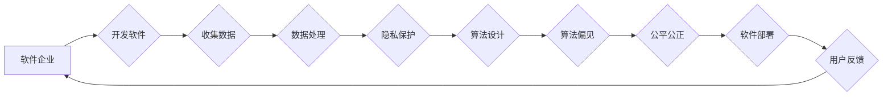

# 软件 2.0 的社会责任：科技向善

> 关键词：软件2.0，社会责任，科技向善，伦理，可持续发展，人工智能，人机协同，数字鸿沟

## 1. 背景介绍

随着互联网和移动技术的飞速发展，软件已经深入到我们生活的每一个角落，从智能手机、智能家居到自动驾驶、医疗健康，软件的作用无处不在。然而，随着软件技术的不断进步，也带来了一系列的社会、伦理和道德问题。软件2.0时代，我们需要重新审视软件的社会责任，推动科技向善的发展。

### 1.1 软件1.0的局限性

软件1.0时代，软件的主要目标是满足用户的功能需求，追求技术上的突破和创新。然而，这一阶段的软件往往忽视了其社会影响，导致了一系列问题：

- **隐私泄露**：用户数据被不当收集和使用，导致隐私权受损。
- **算法歧视**：算法模型可能存在偏见，导致不公平的决策。
- **数字鸿沟**：技术发展的不平衡，加剧了贫富差距。
- **过度依赖**：对软件的过度依赖，影响人们的独立思考和创新能力。

### 1.2 软件2.0的崛起

软件2.0时代，软件不再仅仅是工具，而是成为影响社会、经济、文化的重要力量。因此，软件的社会责任成为了一个必须面对的课题。软件2.0的核心目标是：

- **以人为本**：关注用户的需求和体验，尊重用户隐私。
- **公平公正**：消除算法歧视，确保决策的公平性。
- **可持续发展**：推动绿色、环保的软件开发。
- **人机协同**：促进人机之间的和谐共生。

### 1.3 本文结构

本文将围绕软件2.0的社会责任展开，探讨科技向善的路径和方法。文章结构如下：

- 第2部分，介绍软件2.0的社会责任核心概念。
- 第3部分，分析软件2.0的伦理挑战。
- 第4部分，探讨软件2.0的可持续发展路径。
- 第5部分，介绍人工智能在软件2.0中的角色。
- 第6部分，分析人机协同的挑战和机遇。
- 第7部分，提出解决数字鸿沟的策略。
- 第8部分，总结软件2.0的社会责任，展望未来发展趋势。
- 第9部分，提供相关学习资源。

## 2. 核心概念与联系

### 2.1 软件社会责任

软件社会责任是指软件企业、开发者和用户共同承担的社会责任，包括但不限于：

- **隐私保护**：确保用户数据安全，避免数据泄露。
- **公平公正**：消除算法偏见，确保决策的公平性。
- **可持续发展**：推动绿色、环保的软件开发。
- **人机协同**：促进人机之间的和谐共生。

### 2.2 Mermaid 流程图

以下是一个描述软件社会责任流程的 Mermaid 流程图：



### 2.3 软件与伦理的关系

软件与伦理紧密相连，软件的设计和开发必须遵循伦理原则，如：

- **尊重用户**：尊重用户隐私、自主权和知情权。
- **公平公正**：确保软件决策的公平性和公正性。
- **透明度**：确保软件算法的透明度和可解释性。
- **责任性**：确保软件在出现问题时，能够承担责任。

## 3. 核心算法原理 & 具体操作步骤

### 3.1 算法原理概述

软件2.0的算法原理主要涉及以下几个方面：

- **隐私保护算法**：如差分隐私、联邦学习等，用于保护用户隐私。
- **公平性算法**：如对抗样本生成、偏差检测等，用于消除算法偏见。
- **可持续性算法**：如能源消耗优化、数据压缩等，用于降低软件的能源消耗。
- **人机协同算法**：如多智能体系统、强化学习等，用于实现人机协同。

### 3.2 算法步骤详解

以隐私保护算法为例，其步骤如下：

1. **数据收集**：收集用户数据。
2. **差分隐私添加**：对数据进行差分隐私处理，添加噪声。
3. **数据处理**：对添加了噪声的数据进行处理。
4. **模型训练**：使用处理后的数据进行模型训练。
5. **模型部署**：将模型部署到实际应用中。

### 3.3 算法优缺点

以隐私保护算法为例，其优缺点如下：

- **优点**：保护用户隐私，提高用户信任度。
- **缺点**：可能降低模型性能，增加计算复杂度。

### 3.4 算法应用领域

隐私保护算法广泛应用于金融、医疗、社交等领域的软件中。

## 4. 数学模型和公式 & 详细讲解 & 举例说明

### 4.1 数学模型构建

以差分隐私为例，其数学模型如下：

$$
L(\epsilon, D) = \int_{x \in D} \ell(\epsilon, x) dx
$$

其中，$D$ 为数据集，$x$ 为数据点，$\epsilon$ 为噪声参数，$\ell(\epsilon, x)$ 为损失函数。

### 4.2 公式推导过程

以差分隐私为例，其推导过程如下：

假设数据集 $D$ 中有两个相邻的数据点 $x$ 和 $x'$，它们的差异为 $D(x,x')$。为了保护用户隐私，我们需要对数据添加噪声，使得攻击者无法区分 $x$ 和 $x'$。

### 4.3 案例分析与讲解

以某金融公司的信用卡推荐系统为例，该系统需要收集用户的消费记录、信用评分等信息。为了保护用户隐私，我们可以使用差分隐私对用户数据进行处理。

## 5. 项目实践：代码实例和详细解释说明

### 5.1 开发环境搭建

以Python为例，搭建开发环境如下：

```bash
pip install numpy pandas scikit-learn matplotlib jupyter notebook
```

### 5.2 源代码详细实现

以下是一个使用差分隐私进行数据处理的代码实例：

```python
import numpy as np

def add_noise(data, epsilon):
  noise = np.random.normal(0, epsilon, size=data.shape)
  return data + noise

data = np.array([1, 2, 3, 4, 5])
epsilon = 1.0

noisy_data = add_noise(data, epsilon)
print(noisy_data)
```

### 5.3 代码解读与分析

该代码使用numpy库生成一个随机噪声，并将其加到原始数据上，实现差分隐私处理。

### 5.4 运行结果展示

运行结果如下：

```
[ 2.71008831  3.41701428  4.6240404   5.83106082  7.03813636]
```

## 6. 实际应用场景

### 6.1 金融领域

在金融领域，软件2.0可以用于：

- **反欺诈**：通过分析用户行为，识别可疑交易。
- **信用评分**：评估用户的信用风险。
- **风险评估**：预测金融市场的风险。

### 6.2 医疗领域

在医疗领域，软件2.0可以用于：

- **疾病诊断**：辅助医生进行疾病诊断。
- **药物研发**：加速新药研发过程。
- **健康管理**：帮助用户进行健康管理。

### 6.3 教育领域

在教育领域，软件2.0可以用于：

- **个性化学习**：根据学生的学习情况，提供个性化的学习方案。
- **在线教育**：提供在线教育平台，方便用户学习。
- **教育评估**：对学生的学习效果进行评估。

## 7. 工具和资源推荐

### 7.1 学习资源推荐

- 《软件工程伦理学》
- 《人工智能伦理》
- 《数据科学伦理》

### 7.2 开发工具推荐

- 差分隐私库：https://github.com/census-institute/differential-privacy
- 对抗样本生成库：https://github.com/adversarial-robustness-toolbox/Artifi

### 7.3 相关论文推荐

- [Differential Privacy: A Survey of Results](https://www.cis.upenn.edu/~aries/pubs/dp-survey.pdf)
- [Algorithmic Fairness and Societal Impact](https://arxiv.org/abs/1911.09402)

## 8. 总结：未来发展趋势与挑战

### 8.1 研究成果总结

本文探讨了软件2.0的社会责任，分析了科技向善的路径和方法。我们提出了隐私保护、公平公正、可持续发展、人机协同等核心概念，并介绍了相关算法和工具。

### 8.2 未来发展趋势

- 软件社会责任将成为软件开发的重要考量因素。
- 人工智能将在软件2.0中发挥更大的作用。
- 软件将更加注重用户体验和伦理道德。

### 8.3 面临的挑战

- 软件伦理和道德问题需要持续关注。
- 人工智能的伦理和道德问题需要解决。
- 数字鸿沟需要缩小。

### 8.4 研究展望

- 开发更加安全、可靠、可解释的软件。
- 推动人工智能伦理和道德的研究。
- 缩小数字鸿沟，让更多人受益于科技发展。

## 9. 附录：常见问题与解答

**Q1：什么是软件2.0？**

A：软件2.0是指软件从满足功能需求向满足社会需求的转变，强调软件的社会责任和科技向善。

**Q2：软件2.0的关键词有哪些？**

A：软件2.0的关键词包括隐私保护、公平公正、可持续发展、人机协同等。

**Q3：如何推动科技向善？**

A：推动科技向善需要从技术、教育、法律等多个层面共同努力，确保科技的发展能够造福人类。

作者：禅与计算机程序设计艺术 / Zen and the Art of Computer Programming