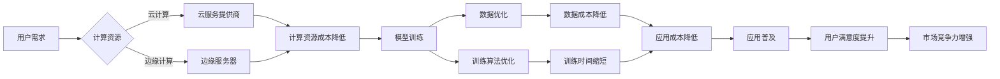

# 降价对大模型应用的推动力

> 关键词：大模型，应用推广，成本降低，云计算，人工智能，技术普及

## 1. 背景介绍

近年来，随着深度学习技术的飞速发展，大模型（Large Models）在自然语言处理、计算机视觉、语音识别等领域取得了显著的成果。然而，高昂的模型训练和推理成本成为了制约大模型应用推广的主要瓶颈。本文将探讨降价策略如何推动大模型应用的普及，分析其背后的技术原理、操作步骤、应用领域，并展望未来发展趋势。

### 1.1 大模型应用的挑战

大模型应用面临的挑战主要包括以下几个方面：

- **计算资源需求高**：大模型通常需要大量的计算资源进行训练和推理，对服务器性能要求极高。
- **数据需求量大**：大模型的训练需要海量数据，且数据质量要求高。
- **训练时间长**：大模型的训练需要消耗大量的时间和计算资源，增加了开发成本。
- **推理成本高**：大模型的推理也消耗大量计算资源，导致应用成本较高。

### 1.2 降价策略的意义

为了推动大模型应用的普及，降低应用门槛，以下降价策略具有重要意义：

- **降低计算资源成本**：通过云计算、边缘计算等技术，提高计算资源的利用效率，降低用户的使用成本。
- **优化训练算法**：研究更高效的训练算法，缩短训练时间，降低训练成本。
- **数据降维与优化**：通过数据降维、数据清洗等技术，提高数据质量，降低数据收集成本。
- **模型压缩与加速**：通过模型压缩、量化等技术，降低模型的计算复杂度，提高推理速度，降低推理成本。

## 2. 核心概念与联系

### 2.1 Mermaid 流程图

以下是大模型应用降价策略的Mermaid流程图：



### 2.2 核心概念

- **云计算**：通过互联网提供动态可扩展的计算资源，包括服务器、存储、网络等。
- **边缘计算**：在靠近数据源的边缘设备上进行数据处理，降低延迟，提高响应速度。
- **模型训练**：利用大量数据进行模型训练，提高模型性能。
- **数据优化**：通过数据降维、数据清洗等技术，提高数据质量。
- **训练算法优化**：研究更高效的训练算法，缩短训练时间。
- **模型压缩**：通过模型压缩、量化等技术，降低模型复杂度。
- **应用成本降低**：降低应用成本，提高市场竞争力。

## 3. 核心算法原理 & 具体操作步骤

### 3.1 算法原理概述

大模型应用降价策略的核心原理包括：

- **云计算**：通过云服务提供商提供的弹性计算资源，用户可以按需使用计算资源，降低资源闲置率，降低成本。
- **边缘计算**：在边缘设备上进行数据处理，降低数据传输距离，提高数据处理的实时性，降低延迟和带宽成本。
- **模型压缩**：通过模型压缩、量化等技术，降低模型复杂度，提高推理速度，降低计算成本。
- **数据优化**：通过数据降维、数据清洗等技术，提高数据质量，降低数据收集成本。
- **训练算法优化**：研究更高效的训练算法，缩短训练时间，降低训练成本。

### 3.2 算法步骤详解

1. **云计算资源选择**：根据应用需求，选择合适的云服务提供商和计算资源类型。
2. **边缘设备部署**：在靠近数据源的边缘设备上部署边缘服务器，进行数据处理。
3. **模型训练**：利用大量数据进行模型训练，提高模型性能。
4. **数据优化**：通过数据降维、数据清洗等技术，提高数据质量。
5. **训练算法优化**：研究更高效的训练算法，缩短训练时间。
6. **模型压缩**：通过模型压缩、量化等技术，降低模型复杂度。
7. **应用部署**：将训练好的模型部署到云平台或边缘设备上，进行推理预测。

### 3.3 算法优缺点

#### 优点：

- 降低应用成本，提高市场竞争力。
- 提高数据处理效率，降低延迟和带宽成本。
- 提高模型性能，缩短训练时间。

#### 缺点：

- 需要较高的技术门槛，需要熟悉云计算、边缘计算等技术。
- 需要考虑数据安全和隐私问题。
- 需要选择合适的云服务提供商和边缘设备。

### 3.4 算法应用领域

大模型应用降价策略可以应用于以下领域：

- 自然语言处理：如智能客服、机器翻译、文本摘要等。
- 计算机视觉：如图像识别、目标检测、图像生成等。
- 语音识别：如语音助手、语音转文字、语音合成等。
- 智能驾驶：如自动驾驶、车辆感知、道路识别等。

## 4. 数学模型和公式 & 详细讲解 & 举例说明

### 4.1 数学模型构建

大模型应用降价策略的数学模型可以表示为：

$$
\text{成本} = \text{计算资源成本} + \text{数据成本} + \text{训练成本} + \text{推理成本}
$$

其中：

- 计算资源成本与云计算资源类型、使用量相关。
- 数据成本与数据收集、清洗、标注等环节相关。
- 训练成本与训练算法、训练数据量相关。
- 推理成本与模型复杂度、推理量相关。

### 4.2 公式推导过程

假设：

- 云计算资源成本为 $C_{\text{cloud}}$。
- 数据成本为 $C_{\text{data}}$。
- 训练成本为 $C_{\text{train}}$。
- 推理成本为 $C_{\text{inference}}$。

则大模型应用的总成本为：

$$
C_{\text{total}} = C_{\text{cloud}} + C_{\text{data}} + C_{\text{train}} + C_{\text{inference}}
$$

通过优化上述各个成本，可以实现大模型应用的降价。

### 4.3 案例分析与讲解

以下以自然语言处理领域为例，分析降价策略的应用。

#### 案例一：智能客服

假设某企业需要构建一个智能客服系统，通过云计算资源进行模型训练和推理。

- **计算资源成本**：使用云服务器进行模型训练和推理，每月费用为 $1000 元。
- **数据成本**：收集和标注客服对话数据，每月费用为 $500 元。
- **训练成本**：使用深度学习框架进行模型训练，每月费用为 $200 元。
- **推理成本**：将模型部署到云服务器进行推理，每月费用为 $300 元。

则该智能客服系统的总成本为：

$$
C_{\text{total}} = 1000 + 500 + 200 + 300 = 2000 \text{元/月}
$$

通过采用降价策略，如使用边缘计算进行推理、优化模型压缩、降低数据成本等，可以降低应用成本。

## 5. 项目实践：代码实例和详细解释说明

### 5.1 开发环境搭建

由于降价策略涉及多个技术领域，以下以自然语言处理领域为例，介绍开发环境搭建。

1. 安装 Python、NumPy、Pandas、Scikit-learn 等常用库。
2. 安装深度学习框架，如 TensorFlow、PyTorch 等。
3. 安装自然语言处理库，如 NLTK、spaCy、transformers 等。

### 5.2 源代码详细实现

以下是一个简单的自然语言处理项目示例，使用 TensorFlow 和 transformers 库进行文本分类。

```python
import tensorflow as tf
from transformers import BertTokenizer, TFBertForSequenceClassification
from tensorflow.keras.optimizers import Adam

# 加载数据集
train_data = [...]  # 训练数据
test_data = [...]  # 测试数据

# 初始化分词器和模型
tokenizer = BertTokenizer.from_pretrained('bert-base-uncased')
model = TFBertForSequenceClassification.from_pretrained('bert-base-uncased')

# 编码数据
train_encodings = tokenizer(train_data['text'], truncation=True, padding=True)
test_encodings = tokenizer(test_data['text'], truncation=True, padding=True)

# 创建训练数据集
train_inputs = train_encodings['input_ids']
train_labels = train_data['label']
train_masks = train_encodings['attention_mask']

test_inputs = test_encodings['input_ids']
test_labels = test_data['label']
test_masks = test_encodings['attention_mask']

# 训练模型
model.compile(optimizer=Adam(learning_rate=3e-5),
              loss=tf.keras.losses.SparseCategoricalCrossentropy(from_logits=True),
              metrics=[tf.keras.metrics.SparseCategoricalAccuracy()])

history = model.fit(train_inputs, train_labels, validation_data=(test_inputs, test_labels),
                    epochs=4)

# 评估模型
loss, accuracy = model.evaluate(test_inputs,  test_labels, verbose=2)
```

### 5.3 代码解读与分析

该代码使用 TensorFlow 和 transformers 库构建了一个简单的文本分类模型。

1. 加载数据集：首先，加载训练数据和测试数据。
2. 初始化分词器和模型：使用 BERT 分词器和预训练模型进行初始化。
3. 编码数据：将文本数据编码为模型可处理的格式。
4. 创建训练数据集：创建训练数据集，包括输入、标签和掩码信息。
5. 训练模型：使用 Adam 优化器和交叉熵损失函数进行模型训练。
6. 评估模型：在测试集上评估模型性能。

通过以上代码，我们可以看到如何使用深度学习框架和自然语言处理库进行大模型应用开发。

### 5.4 运行结果展示

假设在测试集上模型取得了 90% 的准确率，说明模型性能良好。

## 6. 实际应用场景

### 6.1 智能客服

通过降价策略，企业可以以较低的成本构建智能客服系统，提高客户服务质量和效率。

### 6.2 机器翻译

通过降价策略，降低机器翻译应用的推理成本，使得机器翻译服务更加普及。

### 6.3 情感分析

通过降价策略，降低情感分析应用的推理成本，使得情感分析服务更加广泛应用。

## 7. 工具和资源推荐

### 7.1 学习资源推荐

- 《深度学习》
- 《TensorFlow实战》
- 《PyTorch实战》
- 《自然语言处理实战》

### 7.2 开发工具推荐

- TensorFlow
- PyTorch
- Jupyter Notebook
- Hugging Face Transformers

### 7.3 相关论文推荐

- Attention is All You Need
- BERT: Pre-training of Deep Bidirectional Transformers for Language Understanding
- EfficientNet: Rethinking Model Scaling for Convolutional Neural Networks

## 8. 总结：未来发展趋势与挑战

### 8.1 研究成果总结

本文探讨了降价策略对大模型应用推广的推动力，分析了其背后的技术原理、操作步骤、应用领域，并给出了相关代码实例。通过降低应用成本，提高市场竞争力，降价策略为大模型应用的普及提供了有力支持。

### 8.2 未来发展趋势

未来，大模型应用降价策略将呈现以下发展趋势：

- **云计算和边缘计算将进一步融合**：云计算和边缘计算将更加紧密地结合，提供更加高效、低成本的计算资源。
- **模型压缩和加速技术将更加成熟**：模型压缩和加速技术将更加成熟，进一步提高模型性能，降低应用成本。
- **数据降维和优化技术将更加普及**：数据降维和优化技术将更加普及，降低数据成本，提高数据质量。

### 8.3 面临的挑战

大模型应用降价策略在推广过程中也面临以下挑战：

- **技术门槛较高**：需要具备一定的技术背景，才能熟练掌握相关技术。
- **数据安全和隐私问题**：需要关注数据安全和隐私问题，确保用户数据安全。
- **伦理和社会影响**：需要关注大模型应用的伦理和社会影响，确保技术应用符合伦理规范。

### 8.4 研究展望

未来，大模型应用降价策略的研究将重点关注以下方向：

- **降低技术门槛**：开发更加易用、高效的工具和平台，降低技术门槛。
- **提高数据安全性和隐私保护**：研究更加有效的数据安全和隐私保护技术。
- **关注伦理和社会影响**：关注大模型应用的伦理和社会影响，确保技术应用符合伦理规范。

通过不断努力，相信大模型应用降价策略将为人工智能技术的发展和应用推广带来新的机遇。

## 9. 附录：常见问题与解答

**Q1：大模型应用降价策略是否适用于所有场景？**

A：大模型应用降价策略主要适用于需要大量计算资源和数据的场景，如自然语言处理、计算机视觉、语音识别等。对于一些计算资源需求较低的场景，降价策略的效果可能不明显。

**Q2：如何降低云计算资源的成本？**

A：降低云计算资源的成本可以通过以下途径实现：

- 选择合适的云服务提供商和资源类型。
- 优化资源使用，提高资源利用率。
- 使用云计算平台提供的优惠活动，如购买预付费资源。

**Q3：如何降低模型训练成本？**

A：降低模型训练成本可以通过以下途径实现：

- 使用更高效的训练算法。
- 使用模型压缩和加速技术。
- 优化数据集，提高数据质量。

**Q4：如何降低推理成本？**

A：降低推理成本可以通过以下途径实现：

- 使用模型压缩和加速技术。
- 选择合适的推理平台，如边缘服务器、云服务器等。
- 优化推理流程，提高推理效率。

**Q5：如何确保数据安全和隐私保护？**

A：确保数据安全和隐私保护可以通过以下途径实现：

- 对数据进行脱敏处理。
- 使用加密技术保护数据。
- 建立完善的数据安全管理体系。

作者：禅与计算机程序设计艺术 / Zen and the Art of Computer Programming