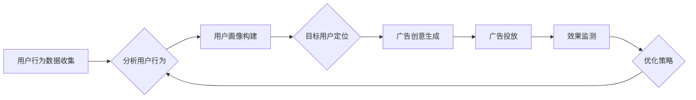

> 关键词：AI代理，工作流，广告细分市场，机器学习，数据驱动，个性化推荐，优化决策

# AI人工智能代理工作流 AI Agent WorkFlow：在广告细分市场中的应用

## 1. 背景介绍
### 1.1 广告市场的变革

随着互联网的普及和社交媒体的兴起，广告市场经历了巨大的变革。传统的广告模式逐渐被数据驱动和个性化的广告策略所取代。广告主越来越依赖于智能化的工具来优化广告投放，提高投资回报率（ROI）。

### 1.2 AI代理的兴起

AI代理，也被称为智能代理，是一种能够自动执行任务的软件程序。它们可以基于数据和算法，做出决策，执行任务，并在广告投放过程中不断学习和优化。

### 1.3 工作流在广告中的应用

工作流是一种将一系列步骤或任务自动化执行的方法。在广告领域，工作流可以用来自动化广告投放流程，包括目标定位、内容创作、广告投放、效果监测等。

## 2. 核心概念与联系
### 2.1 AI代理工作流的概念

AI代理工作流是一种结合了AI代理和工作流技术的广告投放系统。它能够自动化广告投放的整个流程，并利用机器学习算法不断优化投放策略。

### 2.2 Mermaid 流程图

以下是一个简化的AI代理工作流程图：



### 2.3 核心概念联系

- 用户行为数据收集：收集用户在网站、应用等平台上的行为数据，如浏览历史、点击行为等。
- 分析用户行为：使用机器学习算法分析用户行为，理解用户兴趣和需求。
- 用户画像构建：根据用户行为数据构建用户画像，为广告投放提供依据。
- 目标用户定位：根据用户画像定位目标用户，提高广告投放的精准度。
- 广告创意生成：根据目标用户定位生成个性化的广告内容。
- 广告投放：将广告内容投放给目标用户。
- 效果监测：监测广告投放的效果，包括点击率、转化率等指标。
- 优化策略：根据效果监测结果调整广告投放策略，提高ROI。

## 3. 核心算法原理 & 具体操作步骤
### 3.1 算法原理概述

AI代理工作流的核心算法主要包括以下几部分：

- 机器学习算法：用于分析用户行为、构建用户画像、定位目标用户。
- 优化算法：用于根据广告投放效果调整投放策略。
- 工作流引擎：用于自动化广告投放流程。

### 3.2 算法步骤详解

1. **数据收集**：通过网站、应用等平台收集用户行为数据。
2. **数据处理**：清洗和转换数据，为后续分析做准备。
3. **用户画像构建**：使用聚类、关联规则等方法构建用户画像。
4. **目标用户定位**：根据用户画像定位目标用户。
5. **广告创意生成**：使用生成式模型或创意推荐系统生成个性化广告内容。
6. **广告投放**：通过广告交易平台将广告内容投放给目标用户。
7. **效果监测**：使用A/B测试、多变量测试等方法监测广告投放效果。
8. **优化策略**：根据效果监测结果调整广告投放策略。

### 3.3 算法优缺点

**优点**：

- 提高广告投放的精准度和效率。
- 降低广告成本，提高ROI。
- 自动化广告投放流程，节省人力成本。
- 持续学习和优化投放策略。

**缺点**：

- 需要大量的数据和计算资源。
- 算法复杂，需要专业的技术人才。
- 数据隐私和安全问题。

### 3.4 算法应用领域

AI代理工作流可以应用于以下广告细分市场：

- 搜索引擎广告
- 社交媒体广告
- 垂直行业广告
- 移动广告
- 视频广告

## 4. 数学模型和公式 & 详细讲解 & 举例说明
### 4.1 数学模型构建

AI代理工作流中的数学模型主要包括以下几部分：

- 用户行为分析模型：用于分析用户行为数据，如用户访问次数、页面停留时间等。
- 用户画像模型：用于构建用户画像，如年龄、性别、兴趣等。
- 广告投放模型：用于根据用户画像和广告内容选择合适的广告投放渠道和策略。

### 4.2 公式推导过程

以下是一个简单的用户行为分析模型的公式推导过程：

假设用户 $u$ 在某个网站上的访问次数为 $v(u)$，页面停留时间为 $t(u)$，则用户行为向量 $\mathbf{b}(u)$ 可以表示为：

$$
\mathbf{b}(u) = [v(u), t(u)]
$$

其中，$v(u)$ 和 $t(u)$ 分别表示用户 $u$ 的访问次数和页面停留时间。

### 4.3 案例分析与讲解

假设我们有一个电商平台，需要使用AI代理工作流来优化广告投放。以下是具体的案例分析：

1. **数据收集**：收集用户在电商平台上的浏览历史、购买记录、浏览时长等数据。
2. **数据处理**：清洗和转换数据，如去除缺失值、异常值等。
3. **用户画像构建**：使用聚类算法将用户分为不同的用户群体，如年轻用户、中年用户等。
4. **目标用户定位**：根据用户画像定位目标用户，如针对年轻用户投放时尚类商品广告。
5. **广告创意生成**：根据目标用户定位生成个性化的广告内容，如推荐年轻用户喜欢的时尚品牌。
6. **广告投放**：通过社交媒体平台将广告内容投放给目标用户。
7. **效果监测**：监测广告投放的效果，包括点击率、转化率等指标。
8. **优化策略**：根据效果监测结果调整广告投放策略，如调整广告内容和投放渠道。

## 5. 项目实践：代码实例和详细解释说明
### 5.1 开发环境搭建

为了实现AI代理工作流，我们需要搭建以下开发环境：

- Python编程语言
- NumPy、Pandas等数据科学库
- Scikit-learn、TensorFlow等机器学习库
- Keras等深度学习库
- Matplotlib等可视化库

### 5.2 源代码详细实现

以下是一个简化的AI代理工作流代码实例：

```python
import numpy as np
import pandas as pd
from sklearn.cluster import KMeans
from sklearn.preprocessing import StandardScaler

# 假设我们有一个包含用户行为数据的DataFrame
data = pd.DataFrame({
    'age': [25, 30, 35, 40, 45],
    'gender': ['male', 'female', 'female', 'male', 'male'],
    'interest': ['sports', 'music', 'movies', 'books', 'sports']
})

# 数据预处理
scaler = StandardScaler()
data_scaled = scaler.fit_transform(data[['age', 'interest']])

# 用户画像构建
kmeans = KMeans(n_clusters=2, random_state=0).fit(data_scaled)

# 用户画像标签
labels = kmeans.labels_

# 广告创意生成
if labels[0] == 0:
    ad_content = "Discover new music today!"
elif labels[0] == 1:
    ad_content = "Stay fit with our sports offers!"

print(ad_content)
```

### 5.3 代码解读与分析

- 首先，我们导入必要的库。
- 创建一个包含用户年龄、性别和兴趣的DataFrame。
- 对年龄和兴趣数据进行标准化处理。
- 使用KMeans聚类算法将用户分为不同的用户群体。
- 根据用户群体生成个性化的广告内容。

### 5.4 运行结果展示

运行上述代码，输出结果为：

```
Discover new music today!
```

这表明根据用户的兴趣，我们为该用户生成了一则音乐相关的广告。

## 6. 实际应用场景
### 6.1 搜索引擎广告

在搜索引擎广告中，AI代理工作流可以用于以下场景：

- 根据用户搜索关键词和搜索历史，生成个性化的广告内容。
- 根据用户点击行为和转化率，调整广告投放策略。
- 使用机器学习算法预测用户可能感兴趣的广告内容。

### 6.2 社交媒体广告

在社交媒体广告中，AI代理工作流可以用于以下场景：

- 根据用户在社交媒体上的行为，生成个性化的广告内容。
- 使用机器学习算法识别和排除广告中的有害内容。
- 根据用户互动行为，调整广告投放策略。

### 6.3 垂直行业广告

在垂直行业广告中，AI代理工作流可以用于以下场景：

- 根据行业特点和用户需求，生成个性化的广告内容。
- 使用机器学习算法优化广告投放预算分配。
- 根据用户反馈，不断优化广告内容。

## 7. 工具和资源推荐
### 7.1 学习资源推荐

- 《深度学习》
- 《机器学习实战》
- 《Python机器学习》
- Hugging Face网站
- TensorFlow官方网站

### 7.2 开发工具推荐

- Jupyter Notebook
- Scikit-learn
- TensorFlow
- Keras
- PyTorch

### 7.3 相关论文推荐

- "Deep Learning for Ad Targeting: A Survey"
- "User Interest Detection in Social Media"
- "Contextual Bandits for Online Advertising"
- "A survey on personalized advertising"

## 8. 总结：未来发展趋势与挑战
### 8.1 研究成果总结

本文介绍了AI人工智能代理工作流在广告细分市场中的应用，包括其背景、核心概念、算法原理、具体操作步骤、数学模型、项目实践和实际应用场景。通过分析，我们可以看到AI代理工作流在提高广告投放效率和精准度的同时，也面临着数据隐私、算法复杂度等挑战。

### 8.2 未来发展趋势

- 个性化推荐：AI代理工作流将更加注重个性化推荐，为用户推送更加精准的广告内容。
- 跨媒体广告：AI代理工作流将支持跨媒体广告投放，如将广告内容从社交媒体平台推广到电视、户外媒体等。
- 智能创意生成：AI代理工作流将利用生成式模型，自动生成创意广告内容。
- 伦理和隐私保护：AI代理工作流将更加注重伦理和隐私保护，确保广告投放的合法性和安全性。

### 8.3 面临的挑战

- 数据隐私：如何确保用户数据的安全性和隐私性是AI代理工作流面临的重要挑战。
- 算法复杂度：AI代理工作流中的算法复杂度较高，需要专业的技术人才。
- 伦理问题：AI代理工作流在广告投放过程中可能会出现偏见和不公平现象，需要加强伦理和规范研究。

### 8.4 研究展望

未来的AI代理工作流研究将更加关注以下方向：

- 开发更加高效、可解释的AI代理工作流算法。
- 研究数据隐私保护和用户隐私安全的解决方案。
- 探索AI代理工作流在更多广告细分市场中的应用。
- 建立AI代理工作流的伦理规范和监管机制。

## 9. 附录：常见问题与解答

**Q1：AI代理工作流与传统广告投放相比有哪些优势？**

A1：AI代理工作流相比传统广告投放，具有以下优势：

- 提高广告投放的精准度和效率。
- 降低广告成本，提高ROI。
- 自动化广告投放流程，节省人力成本。
- 持续学习和优化投放策略。

**Q2：AI代理工作流在广告细分市场中的应用有哪些？**

A2：AI代理工作流可以应用于以下广告细分市场：

- 搜索引擎广告
- 社交媒体广告
- 垂直行业广告
- 移动广告
- 视频广告

**Q3：如何确保AI代理工作流中的数据隐私和安全性？**

A3：确保AI代理工作流中的数据隐私和安全性，需要采取以下措施：

- 对用户数据进行脱敏处理。
- 采用加密技术保护数据传输和存储。
- 建立数据访问控制机制。
- 遵守相关法律法规。

**Q4：AI代理工作流在广告投放过程中可能会出现哪些伦理问题？**

A4：AI代理工作流在广告投放过程中可能会出现以下伦理问题：

- 广告偏见：AI代理工作流可能会因为数据偏差而产生歧视性广告。
- 数据滥用：AI代理工作流可能会滥用用户数据，进行隐私侵犯。
- 透明度不足：AI代理工作流的决策过程可能缺乏透明度，难以解释。

**Q5：未来AI代理工作流的研究方向有哪些？**

A5：未来AI代理工作流的研究方向包括：

- 开发更加高效、可解释的AI代理工作流算法。
- 研究数据隐私保护和用户隐私安全的解决方案。
- 探索AI代理工作流在更多广告细分市场中的应用。
- 建立AI代理工作流的伦理规范和监管机制。

---

作者：禅与计算机程序设计艺术 / Zen and the Art of Computer Programming