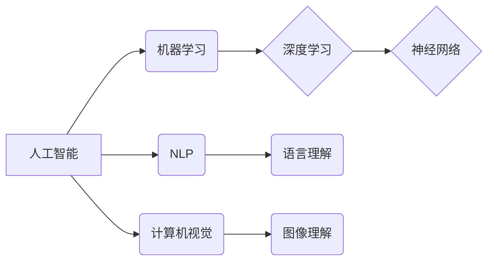

> - 人工智能，深度学习，机器学习，自然语言处理，计算机视觉，未来趋势

# Andrej Karpathy：人工智能的未来发展前景

## 1. 背景介绍

人工智能（AI）作为计算机科学的一个分支，已经取得了令人瞩目的进展。Andrej Karpathy，作为深度学习领域的杰出人物，他的工作对AI的发展产生了深远的影响。本文将探讨Andrej Karpathy对人工智能未来发展的看法，分析其核心概念与联系，并探讨人工智能在各个领域的应用前景。

## 2. 核心概念与联系

### 2.1 人工智能的定义

人工智能是一种由人制造出来的系统能够表现出类似人类智能的行为，包括学习、推理、问题解决、语言理解等。

### 2.2 深度学习与机器学习

深度学习是机器学习的一个子领域，它使用多层神经网络来学习数据中的复杂模式。机器学习则是一个更广泛的概念，包括所有从数据中学习的方法。

### 2.3 自然语言处理与计算机视觉

自然语言处理（NLP）和计算机视觉（CV）是AI的两大关键应用领域。NLP使机器能够理解和生成人类语言，而CV则使机器能够理解和解释视觉信息。

### 2.4 Mermaid 流程图



## 3. 核心算法原理 & 具体操作步骤

### 3.1 算法原理概述

人工智能的核心算法包括神经网络、深度学习框架、优化算法等。

### 3.2 算法步骤详解

- **数据收集与预处理**：收集大量数据，并进行清洗、格式化等预处理操作。
- **模型设计**：选择合适的神经网络架构，如卷积神经网络（CNN）或循环神经网络（RNN）。
- **模型训练**：使用训练数据对模型进行训练，调整模型参数以最小化损失函数。
- **模型评估**：使用验证数据评估模型性能，并根据需要调整模型或参数。
- **模型部署**：将训练好的模型部署到生产环境中，用于实际应用。

### 3.3 算法优缺点

- **优点**：能够处理大量数据，发现复杂模式，提高效率和准确性。
- **缺点**：需要大量数据和高计算资源，模型的可解释性较差。

### 3.4 算法应用领域

人工智能算法在各个领域都有广泛应用，包括：

- 医疗保健
- 金融
- 教育
- 娱乐
- 交通
- 制造业

## 4. 数学模型和公式 & 详细讲解 & 举例说明

### 4.1 数学模型构建

人工智能的数学模型主要包括：

- **线性代数**：用于表示数据、权重和偏置。
- **微积分**：用于优化模型参数。
- **概率论**：用于处理不确定性。

### 4.2 公式推导过程

以下是一个简单的神经网络损失函数的推导过程：

$$
L(\theta) = \frac{1}{2} \sum_{i=1}^{N} (y_i - \hat{y}_i)^2
$$

其中，$L(\theta)$ 是损失函数，$\theta$ 是模型参数，$y_i$ 是真实标签，$\hat{y}_i$ 是模型预测。

### 4.3 案例分析与讲解

以图像识别为例，我们可以使用卷积神经网络（CNN）来识别图像中的物体。CNN通过卷积层、池化层和全连接层来提取图像特征，并通过反向传播算法优化模型参数。

## 5. 项目实践：代码实例和详细解释说明

### 5.1 开发环境搭建

为了进行人工智能项目实践，我们需要以下开发环境：

- 操作系统：Linux或macOS
- 编程语言：Python
- 深度学习框架：TensorFlow或PyTorch
- 代码编辑器：Visual Studio Code或Jupyter Notebook

### 5.2 源代码详细实现

以下是一个简单的CNN图像识别项目的代码示例：

```python
import tensorflow as tf
from tensorflow.keras import datasets, layers, models

# 加载数据集
(train_images, train_labels), (test_images, test_labels) = datasets.cifar10.load_data()

# 数据预处理
train_images = train_images.reshape((60000, 32, 32, 3))
test_images = test_images.reshape((10000, 32, 32, 3))

# 构建模型
model = models.Sequential()
model.add(layers.Conv2D(32, (3, 3), activation='relu', input_shape=(32, 32, 3)))
model.add(layers.MaxPooling2D((2, 2)))
model.add(layers.Conv2D(64, (3, 3), activation='relu'))
model.add(layers.MaxPooling2D((2, 2)))
model.add(layers.Conv2D(64, (3, 3), activation='relu'))

# 添加全连接层
model.add(layers.Flatten())
model.add(layers.Dense(64, activation='relu'))
model.add(layers.Dense(10))

# 编译模型
model.compile(optimizer='adam',
              loss=tf.keras.losses.SparseCategoricalCrossentropy(from_logits=True),
              metrics=['accuracy'])

# 训练模型
model.fit(train_images, train_labels, epochs=10, validation_data=(test_images, test_labels))

# 评估模型
test_loss, test_acc = model.evaluate(test_images,  test_labels, verbose=2)
```

### 5.3 代码解读与分析

上述代码构建了一个简单的CNN模型，用于识别CIFAR-10图像数据集中的物体。模型首先通过卷积层和池化层提取图像特征，然后通过全连接层进行分类。使用Adam优化器和交叉熵损失函数进行模型训练，并在测试集上评估模型性能。

### 5.4 运行结果展示

运行上述代码后，我们可以在终端看到模型的训练和测试过程，以及最终的准确率。

## 6. 实际应用场景

人工智能在各个领域都有广泛应用，以下是一些典型的应用场景：

### 6.1 医疗保健

- **疾病诊断**：利用AI辅助医生进行疾病诊断，提高诊断效率和准确性。
- **药物研发**：通过AI加速药物研发过程，降低研发成本。

### 6.2 金融

- **风险管理**：利用AI进行风险评估，降低金融风险。
- **欺诈检测**：利用AI检测金融欺诈行为，保护用户资产。

### 6.3 教育

- **个性化学习**：利用AI提供个性化学习方案，提高学习效果。

### 6.4 交通

- **自动驾驶**：利用AI实现自动驾驶，提高交通安全。

### 6.5 制造业

- **质量控制**：利用AI进行产品质量检测，提高生产效率。

## 7. 工具和资源推荐

### 7.1 学习资源推荐

- 《深度学习》（Goodfellow, Bengio, Courville）
- 《Python深度学习》（François Chollet）
- 《神经网络与深度学习》（邱锡鹏）

### 7.2 开发工具推荐

- TensorFlow
- PyTorch
- Keras

### 7.3 相关论文推荐

- “ImageNet Classification with Deep Convolutional Neural Networks”（Krizhevsky, Sutskever, Hinton）
- “Reading Lists for Deep Learning Researchers”（Ian J. Goodfellow）

## 8. 总结：未来发展趋势与挑战

### 8.1 研究成果总结

人工智能已经取得了显著的进展，并在各个领域得到了广泛应用。然而，AI的发展仍然面临着诸多挑战，包括数据隐私、算法可解释性、伦理问题等。

### 8.2 未来发展趋势

- **更强大的模型**：随着计算能力的提升，未来将出现更强大的AI模型，能够处理更复杂的问题。
- **更高效的算法**：开发更高效的算法，降低计算成本，提高效率。
- **更安全的AI**：研究更安全的AI系统，确保AI的安全性和可靠性。

### 8.3 面临的挑战

- **数据隐私**：如何保护用户数据隐私是一个重要的挑战。
- **算法可解释性**：如何提高算法的可解释性，使人们能够理解AI的决策过程。
- **伦理问题**：如何确保AI系统的公平性、透明度和可解释性。

### 8.4 研究展望

人工智能的未来充满希望，但也充满挑战。我们需要不断探索新的技术，解决现有问题，使AI更好地服务于人类社会。

## 9. 附录：常见问题与解答

**Q1：什么是深度学习？**

A：深度学习是一种机器学习技术，它使用多层神经网络来学习数据中的复杂模式。

**Q2：什么是自然语言处理？**

A：自然语言处理是一种人工智能技术，它使机器能够理解和生成人类语言。

**Q3：人工智能在哪些领域有应用？**

A：人工智能在医疗保健、金融、教育、交通、制造业等各个领域都有广泛应用。

**Q4：人工智能的未来发展趋势是什么？**

A：人工智能的未来发展趋势包括更强大的模型、更高效的算法、更安全的AI等。

作者：禅与计算机程序设计艺术 / Zen and the Art of Computer Programming