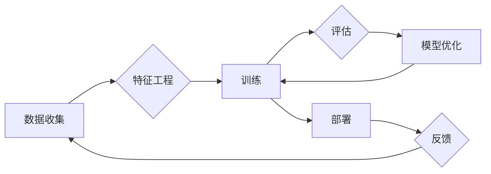

# Andrej Karpathy：人工智能的未来发展方向

> 关键词：安德烈·卡尔帕西，人工智能，机器学习，深度学习，神经网络，自然语言处理，自动驾驶，未来展望

## 1. 背景介绍

安德烈·卡尔帕西，作为一位世界知名的人工智能研究员和工程师，以其在深度学习、自然语言处理和自动驾驶领域的开创性工作而闻名。他在OpenAI担任研究科学家，并在GitHub上分享了大量的开源代码和研究成果，为人工智能社区做出了巨大贡献。本文将深入探讨安德烈·卡尔帕西的研究方向，并展望人工智能的未来发展趋势。

### 1.1 人工智能的发展历程

人工智能（AI）自20世纪50年代以来经历了多个发展阶段。早期的符号主义AI依赖于逻辑和规则，但受限于处理能力和数据量。随着20世纪80年代专家系统的兴起，知识工程成为AI研究的热点。90年代，机器学习开始崭露头角，特别是基于统计的方法在语音识别和图像识别等领域取得了成功。21世纪初，随着计算能力的提升和大数据的出现，深度学习成为AI发展的关键技术，安德烈·卡尔帕西的工作在这一领域尤为突出。

### 1.2 安德烈·卡尔帕西的贡献

安德烈·卡尔帕西在自然语言处理和自动驾驶领域取得了显著成就。他在图像描述生成、文本摘要和机器翻译等方面的工作推动了自然语言处理技术的进步。同时，他也在自动驾驶领域进行了深入研究，为自动驾驶汽车的实现做出了贡献。

## 2. 核心概念与联系

### 2.1 核心概念原理和架构的 Mermaid 流程图



### 2.2 核心概念解析

- **数据收集**：收集用于训练和评估AI模型的数据。
- **特征工程**：从原始数据中提取有用的特征，提高模型的性能。
- **训练**：使用训练数据训练AI模型。
- **评估**：评估模型的性能，例如准确率、召回率等。
- **模型优化**：根据评估结果调整模型参数，提高性能。
- **部署**：将训练好的模型部署到实际应用中。
- **反馈**：收集实际应用中的反馈，用于进一步优化模型。

## 3. 核心算法原理 & 具体操作步骤

### 3.1 算法原理概述

安德烈·卡尔帕西在自然语言处理和自动驾驶领域使用的主要算法包括：

- **深度学习**：通过神经网络学习数据的复杂模式。
- **卷积神经网络（CNN）**：在图像识别和视频分析中用于提取特征。
- **循环神经网络（RNN）**：在序列数据处理中用于捕捉时间序列信息。
- **Transformer**：一种基于自注意力机制的神经网络架构，在自然语言处理领域取得了巨大成功。

### 3.2 算法步骤详解

1. **数据收集**：收集相关领域的数据，如自然语言文本、图像、视频等。
2. **特征工程**：根据数据类型和应用场景，提取或生成特征。
3. **模型选择**：选择合适的深度学习模型，如CNN、RNN或Transformer。
4. **训练**：使用训练数据训练模型，调整模型参数。
5. **评估**：使用验证集评估模型性能，调整模型结构或超参数。
6. **部署**：将训练好的模型部署到实际应用中。
7. **监控**：监控模型在应用中的表现，收集反馈信息。

### 3.3 算法优缺点

- **优点**：深度学习模型在多个领域取得了显著成果，具有强大的特征提取和模式识别能力。
- **缺点**：需要大量标注数据，训练过程计算量大，模型可解释性差。

### 3.4 算法应用领域

深度学习算法在以下领域有广泛的应用：

- **自然语言处理**：机器翻译、文本摘要、情感分析等。
- **计算机视觉**：图像识别、目标检测、图像分割等。
- **语音识别**：语音合成、语音转文字等。
- **自动驾驶**：车辆检测、车道线识别、障碍物检测等。

## 4. 数学模型和公式 & 详细讲解 & 举例说明

### 4.1 数学模型构建

深度学习模型的数学模型主要基于以下概念：

- **神经元**：神经网络的基本单元，负责计算和传递信号。
- **激活函数**：用于确定神经元是否激活。
- **损失函数**：用于衡量模型预测与真实值之间的差异。
- **优化算法**：用于调整模型参数，最小化损失函数。

### 4.2 公式推导过程

以下以神经网络中的反向传播算法为例，说明公式推导过程：

- **前向传播**：计算网络输出。
$$
 y = f(W \cdot x + b) 
$$

- **反向传播**：计算梯度并更新参数。
$$
 \nabla_\theta L = \frac{\partial L}{\partial y} \cdot \frac{\partial y}{\partial z} \cdot \frac{\partial z}{\partial \theta} 
$$

### 4.3 案例分析与讲解

以BERT模型为例，说明自然语言处理中的预训练和微调过程：

1. **预训练**：在大量无标注文本上训练BERT模型，使其学习通用语言表示。
2. **微调**：在特定任务的数据集上，调整BERT模型的参数，使其适应特定任务。

## 5. 项目实践：代码实例和详细解释说明

### 5.1 开发环境搭建

使用Python和TensorFlow或PyTorch等深度学习框架进行开发。

### 5.2 源代码详细实现

以下是一个简单的神经网络模型实现：

```python
import tensorflow as tf

model = tf.keras.Sequential([
    tf.keras.layers.Dense(10, activation='relu', input_shape=(10,)),
    tf.keras.layers.Dense(1)
])

model.compile(optimizer='adam', loss='mean_squared_error')
```

### 5.3 代码解读与分析

上述代码定义了一个简单的神经网络模型，包含两个全连接层，使用ReLU激活函数和均方误差损失函数。

### 5.4 运行结果展示

运行训练过程，观察模型性能变化。

## 6. 实际应用场景

### 6.1 自然语言处理

自然语言处理是AI领域的重要应用之一，BERT模型在多个任务上取得了显著成果。

### 6.2 计算机视觉

深度学习在计算机视觉领域也取得了突破性进展，例如自动驾驶、人脸识别等。

### 6.3 语音识别

深度学习在语音识别领域也取得了显著成果，例如语音转文字、语音合成等。

## 7. 工具和资源推荐

### 7.1 学习资源推荐

- 《深度学习》
- 《Python深度学习》
- 《自然语言处理实战》

### 7.2 开发工具推荐

- TensorFlow
- PyTorch
- Keras

### 7.3 相关论文推荐

- "Attention is All You Need" (2017)
- "BERT: Pre-training of Deep Bidirectional Transformers for Language Understanding" (2018)
- "Generative Adversarial Text to Image Synthesis" (2014)

## 8. 总结：未来发展趋势与挑战

### 8.1 研究成果总结

安德烈·卡尔帕西在深度学习、自然语言处理和自动驾驶领域取得了显著成果，推动了人工智能的发展。

### 8.2 未来发展趋势

- **更强大的模型**：开发更强大的模型，例如多模态模型、多任务模型等。
- **更高效的训练方法**：开发更高效的训练方法，例如分布式训练、迁移学习等。
- **更可解释的模型**：开发更可解释的模型，提高模型的可靠性和可信度。

### 8.3 面临的挑战

- **数据隐私**：如何保护用户数据隐私是一个重要挑战。
- **偏见和公平性**：如何消除模型中的偏见，确保公平性是一个重要挑战。
- **伦理和责任**：如何确保AI系统的伦理和责任是一个重要挑战。

### 8.4 研究展望

人工智能将在未来十年内取得更大的突破，为人类社会带来更多福祉。

## 9. 附录：常见问题与解答

**Q1：人工智能的未来发展趋势是什么？**

A：人工智能的未来发展趋势包括更强大的模型、更高效的训练方法、更可解释的模型等。

**Q2：人工智能有哪些应用场景？**

A：人工智能的应用场景包括自然语言处理、计算机视觉、语音识别、自动驾驶等。

**Q3：人工智能面临哪些挑战？**

A：人工智能面临的挑战包括数据隐私、偏见和公平性、伦理和责任等。

**Q4：如何学习人工智能？**

A：学习人工智能可以阅读相关书籍、参加在线课程、实践项目等。

作者：禅与计算机程序设计艺术 / Zen and the Art of Computer Programming