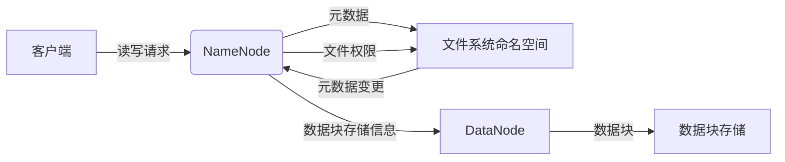
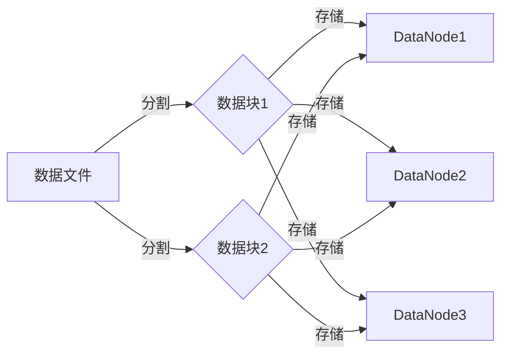

# HDFS原理与代码实例讲解

> 关键词：Hadoop分布式文件系统，HDFS架构，数据存储，分布式系统，文件复制，容错机制，MapReduce，HDFS API

## 1. 背景介绍

随着数据量的爆炸性增长，传统的单机文件系统已无法满足大规模数据存储和处理的需求。Hadoop分布式文件系统（HDFS）应运而生，它是一个高度容错性的分布式文件系统，能够提供高吞吐量的数据访问，适合大规模数据集的应用。本文将深入探讨HDFS的原理，并通过代码实例展示如何使用HDFS进行数据存储和处理。

### 1.1 问题的由来

随着互联网和物联网的发展，数据量呈现指数级增长。传统的文件系统，如NFS和Linux文件系统，在处理大规模数据集时面临着以下问题：

- 数据容量限制：单机文件系统难以支持PB级别的数据存储。
- 可扩展性差：单机文件系统难以横向扩展。
- 数据可用性和可靠性低：单机文件系统在节点故障时容易导致数据丢失。
- 数据访问效率低：单机文件系统在处理大规模数据时效率低下。

为了解决这些问题，Apache Hadoop项目提出了HDFS，它是一个分布式文件系统，能够存储大量数据，并提供高吞吐量的数据访问。

### 1.2 研究现状

HDFS自2006年开源以来，已经成为了大数据生态系统中的核心技术之一。它被广泛应用于各种大数据应用场景，如大数据分析、数据挖掘、机器学习等。随着Hadoop生态系统的不断发展，HDFS也在不断演进，引入了新的功能和改进。

### 1.3 研究意义

研究HDFS对于理解和应用大数据技术具有重要意义：

- 理解HDFS的原理，有助于更好地设计和实现分布式存储系统。
- 学习HDFS的使用，可以掌握大数据存储和处理的基本技能。
- 了解HDFS在实际应用中的优化策略，可以提高大数据应用的效率。

### 1.4 本文结构

本文将按照以下结构进行讲解：

- 介绍HDFS的核心概念和架构。
- 解释HDFS的工作原理和算法。
- 通过代码实例展示如何使用HDFS。
- 探讨HDFS的实际应用场景。
- 展望HDFS的未来发展趋势和挑战。

## 2. 核心概念与联系

### 2.1 HDFS核心概念

- **NameNode**：HDFS的命名节点，负责管理文件的元数据，如文件系统命名空间、文件权限等。
- **DataNode**：HDFS的数据节点，负责存储实际的数据块，并处理读写请求。
- **数据块（Block）**：HDFS中数据的基本存储单位，默认大小为128MB或256MB。
- **Replication**：HDFS中数据块的副本数量，默认为3，以提高数据的可靠性和访问效率。

### 2.2 HDFS架构

HDFS的架构由NameNode和DataNode组成，NameNode负责文件系统命名空间和元数据的维护，而DataNode负责存储实际数据块。



### 2.3 HDFS与MapReduce

HDFS是Hadoop生态系统中的核心组件，与MapReduce紧密集成。MapReduce是一个分布式计算框架，用于大规模数据的并行处理。

- HDFS为MapReduce提供数据存储服务。
- MapReduce中的Map任务和Reduce任务在HDFS上读取和写入数据。

## 3. 核心算法原理 & 具体操作步骤

### 3.1 算法原理概述

HDFS的核心算法包括：

- 数据块管理：HDFS将数据分割成固定大小的块，并在DataNode上存储多个副本。
- 数据复制：HDFS确保每个数据块至少存储三个副本，以提高数据的可靠性和访问效率。
- 容错机制：HDFS在NameNode中维护文件系统的元数据，并在DataNode发生故障时自动恢复数据。
- 数据访问：HDFS提供高吞吐量的数据访问，适合大规模数据集。

### 3.2 算法步骤详解

#### 3.2.1 数据块管理

1. 客户端向NameNode发送请求，请求创建文件或读取文件。
2. NameNode将请求转发给相应的DataNode。
3. DataNode将数据分割成块，并将块信息发送给NameNode。
4. NameNode将块信息存储在文件系统中。

#### 3.2.2 数据复制

1. NameNode维护每个数据块的副本列表。
2. NameNode周期性地检查每个数据块的副本数量。
3. 如果某个数据块的副本数量不足，NameNode将触发数据复制的操作。
4. NameNode选择一个DataNode作为目标节点，并将数据块复制到目标节点。

#### 3.2.3 容错机制

1. NameNode监控DataNode的健康状态。
2. 如果某个DataNode发生故障，NameNode将自动删除该节点上的数据块副本。
3. NameNode将触发数据复制的操作，在剩余的节点上创建新的数据块副本。
4. 当某个DataNode恢复时，NameNode将通知该节点重新加入集群。

#### 3.2.4 数据访问

1. 客户端向NameNode发送读取请求。
2. NameNode返回数据块列表，并指示客户端直接从DataNode读取数据。

### 3.3 算法优缺点

#### 3.3.1 优点

- 高可靠性：数据块的多副本机制确保了数据的可靠性。
- 高吞吐量：数据块的并行访问提高了数据访问效率。
- 高可扩展性：HDFS可以很容易地扩展到数千个节点。

#### 3.3.2 缺点

- 单点故障：NameNode的单点故障可能导致整个文件系统不可用。
- 写入性能：HDFS的写入性能比读取性能差，因为需要向多个节点写入数据。

### 3.4 算法应用领域

HDFS适用于以下应用领域：

- 大数据存储：HDFS可以存储PB级别的数据。
- 分布式计算：HDFS与MapReduce集成，可以用于大规模数据集的并行处理。
- 数据分析：HDFS可以用于各种数据分析工具，如Hive、Pig、Spark等。

## 4. 数学模型和公式 & 详细讲解 & 举例说明

### 4.1 数学模型构建

HDFS的数学模型可以表示为：

$$
HDFS = \{N, D, B, R, F\}
$$

其中：

- $N$：NameNode集合
- $D$：DataNode集合
- $B$：数据块集合
- $R$：数据块副本集合
- $F$：文件系统操作集合

### 4.2 公式推导过程

HDFS的公式推导过程如下：

- 数据块大小 $B$：$B = \text{固定大小}$
- 数据块副本数量 $R$：$R = 3$
- 数据块副本分布 $D_R$：$D_R = \{d_1, d_2, \ldots, d_R\}$

### 4.3 案例分析与讲解

假设我们有一个数据文件，大小为256MB，需要存储在HDFS中。

- 数据块大小 $B = 256MB$
- 数据块副本数量 $R = 3$
- 数据块副本分布 $D_R = \{d_1, d_2, d_3\}$

NameNode将数据文件分割成两个数据块，并存储在三个不同的DataNode上。



## 5. 项目实践：代码实例和详细解释说明

### 5.1 开发环境搭建

为了使用HDFS，我们需要搭建Hadoop环境。以下是使用Apache Hadoop搭建HDFS环境的步骤：

1. 下载Apache Hadoop源码。
2. 解压源码包。
3. 编译Hadoop源码。
4. 配置Hadoop环境变量。
5. 启动Hadoop集群。

### 5.2 源代码详细实现

以下是一个简单的HDFS Java API示例，用于在HDFS上创建和读取文件。

```java
import org.apache.hadoop.conf.Configuration;
import org.apache.hadoop.fs.FileSystem;
import org.apache.hadoop.fs.Path;

public class HdfsExample {
    public static void main(String[] args) throws Exception {
        Configuration conf = new Configuration();
        conf.set("fs.defaultFS", "hdfs://localhost:9000");
        FileSystem fs = FileSystem.get(conf);

        // 创建文件
        Path path = new Path("/example.txt");
        FSDataOutputStream os = fs.create(path);

        // 写入数据
        os.writeBytes("Hello, HDFS!");

        // 关闭流
        os.close();

        // 读取文件
        FSDataInputStream is = fs.open(path);
        byte[] b = new byte[100];
        while (is.read(b) > 0) {
            System.out.write(b);
        }

        // 关闭流
        is.close();
        fs.close();
    }
}
```

### 5.3 代码解读与分析

上述代码首先配置Hadoop环境，然后创建一个名为`example.txt`的文件，并向其中写入"Hello, HDFS!"字符串。最后，读取文件内容并打印到控制台。

### 5.4 运行结果展示

当运行上述代码时，HDFS上的`example.txt`文件将包含以下内容：

```
Hello, HDFS!
```

## 6. 实际应用场景

### 6.1 大数据存储

HDFS是大数据存储的理想选择，因为它可以存储PB级别的数据，并提供高吞吐量的数据访问。

### 6.2 分布式计算

HDFS与MapReduce集成，可以用于大规模数据集的并行处理，如数据分析、数据挖掘、机器学习等。

### 6.3 数据分析

HDFS可以用于各种数据分析工具，如Hive、Pig、Spark等，以进行数据分析和处理。

## 7. 工具和资源推荐

### 7.1 学习资源推荐

- Apache Hadoop官方文档：[https://hadoop.apache.org/docs/stable/](https://hadoop.apache.org/docs/stable/)
- 《Hadoop权威指南》：这是一本关于Hadoop和HDFS的权威书籍，适合初学者和高级用户。
- 《Hadoop in Action》：这是一本关于Hadoop和HDFS实战的书籍，包含了大量实际案例。

### 7.2 开发工具推荐

- Apache Hadoop：[https://hadoop.apache.org/](https://hadoop.apache.org/)
- IntelliJ IDEA：[https://www.jetbrains.com/idea/](https://www.jetbrains.com/idea/)
- Eclipse：[https://www.eclipse.org/](https://www.eclipse.org/)

### 7.3 相关论文推荐

- GFS：The Google File System：介绍了Google文件系统（GFS）的设计和实现，是HDFS的灵感来源。
- HDFS: The Hadoop Distributed File System：介绍了HDFS的设计和实现，是HDFS的官方文档。

## 8. 总结：未来发展趋势与挑战

### 8.1 研究成果总结

HDFS自2006年开源以来，已经成为了大数据生态系统中的核心技术之一。它为大规模数据存储和处理提供了可靠、高效的解决方案。

### 8.2 未来发展趋势

- **增强数据可靠性**：随着数据量的增长，数据可靠性成为HDFS的重要发展方向。未来可能会引入更复杂的复制机制，如纠错码、冗余技术等。
- **提高数据访问效率**：HDFS的数据访问效率是另一个重要的研究方向。未来可能会引入新的数据访问协议，如RDMA、NVMe等，以提高数据访问速度。
- **支持新型存储设备**：随着新型存储设备的出现，HDFS需要支持这些新型存储设备，如固态硬盘、闪存等。

### 8.3 面临的挑战

- **NameNode的单点故障**：NameNode的单点故障是HDFS面临的主要挑战之一。未来可能需要引入多实例NameNode，以提高系统的可靠性。
- **数据复制开销**：HDFS的数据复制机制会消耗大量的网络带宽和存储空间。未来可能需要引入更高效的数据复制算法，以减少数据复制开销。
- **数据访问性能**：HDFS的数据访问性能在读取大文件时可能不够高效。未来可能需要引入新的数据访问机制，如数据预取、缓存等。

### 8.4 研究展望

HDFS将继续发展和演进，以适应不断变化的大数据存储和处理需求。未来，HDFS可能会与其他分布式文件系统，如Ceph、Alluxio等进行融合，以提供更全面、更强大的分布式存储解决方案。

## 9. 附录：常见问题与解答

**Q1：HDFS的数据块大小是多少？**

A：HDFS的数据块大小默认为128MB或256MB，可以通过配置文件进行修改。

**Q2：HDFS的副本数量是多少？**

A：HDFS的副本数量默认为3，可以通过配置文件进行修改。

**Q3：HDFS如何处理数据块的副本？**

A：HDFS在创建数据块时，会自动在多个DataNode上创建副本。如果某个副本丢失，HDFS会自动从其他副本中恢复数据。

**Q4：HDFS如何处理NameNode的单点故障？**

A：HDFS可以通过配置多个NameNode，以提高系统的可靠性。在NameNode发生故障时，其他NameNode可以接管其工作。

**Q5：HDFS适用于哪些应用场景？**

A：HDFS适用于大数据存储、分布式计算、数据分析等应用场景。

作者：禅与计算机程序设计艺术 / Zen and the Art of Computer Programming