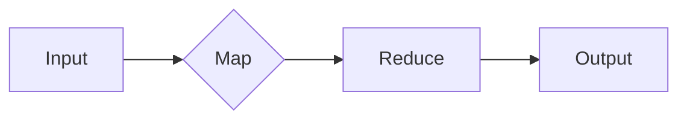

# MapReduce原理与代码实例讲解

> 关键词：MapReduce, 分布式计算, Hadoop, 数据处理, 大数据处理

## 1. 背景介绍

在大数据时代，数据规模呈爆炸式增长，传统的数据处理方法已经无法满足对海量数据处理的需求。MapReduce作为一种分布式计算模型，能够有效地处理大规模数据集，成为了大数据处理的重要技术之一。本文将详细介绍MapReduce的原理、实现步骤以及在实际应用中的案例。

### 1.1 问题的由来

随着互联网、物联网、社交网络等领域的快速发展，产生的数据量呈指数级增长。这些数据包含了大量的有价值信息，但同时也给数据处理带来了巨大的挑战。传统的数据处理方法，如单机批处理和串行处理，在处理海量数据时效率低下，难以满足实际需求。

### 1.2 研究现状

为了解决大数据处理的问题，研究人员提出了多种分布式计算模型，其中最具代表性的是MapReduce。MapReduce模型由Google提出，它将大数据处理任务分解为多个可以并行执行的子任务，通过分布式计算平台高效地处理海量数据。

### 1.3 研究意义

MapReduce作为一种高效的大数据处理技术，具有以下重要意义：

- **可扩展性**：MapReduce能够处理海量数据，并且可以很容易地扩展到成千上万的计算机上。
- **容错性**：MapReduce能够自动检测和处理节点故障，确保任务的完成。
- **高效性**：MapReduce利用并行计算，可以显著提高数据处理效率。
- **通用性**：MapReduce可以处理各种类型的大数据处理任务。

### 1.4 本文结构

本文将按照以下结构进行讲解：

- **第2章**：介绍MapReduce的核心概念与联系。
- **第3章**：详细阐述MapReduce的算法原理和具体操作步骤。
- **第4章**：讲解MapReduce的数学模型和公式，并结合实例进行分析。
- **第5章**：通过代码实例讲解MapReduce的应用。
- **第6章**：探讨MapReduce的实际应用场景。
- **第7章**：推荐相关学习资源和开发工具。
- **第8章**：总结MapReduce的未来发展趋势与挑战。
- **第9章**：提供常见问题的解答。

## 2. 核心概念与联系

### 2.1 MapReduce核心概念

MapReduce由Map和Reduce两个阶段组成：

- **Map阶段**：将输入数据分解为键值对(key-value)对，对每个键值对执行Map函数，生成中间键值对。
- **Reduce阶段**：将Map阶段生成的中间键值对，按照键进行分组，对每个组执行Reduce函数，生成最终的输出。

### 2.2 MapReduce架构

MapReduce架构包括以下几个核心组件：

- **Job Tracker**：负责分配任务给Task Tracker，监控任务执行状态，并在节点故障时重启任务。
- **Task Tracker**：负责接收Job Tracker分配的任务，执行Map和Reduce操作，并将结果返回给Job Tracker。
- **Name Node**：负责管理分布式文件系统(HDFS)的命名空间和客户端的访问请求。
- **Data Node**：负责存储数据块，响应Name Node的读写请求。

### 2.3 Mermaid流程图



## 3. 核心算法原理 & 具体操作步骤

### 3.1 算法原理概述

MapReduce算法的原理是将大规模数据处理任务分解为多个小任务，并行地在多个节点上执行，最后合并结果。

### 3.2 算法步骤详解

1. **输入数据预处理**：将原始数据分割成多个小块，每个小块作为一个输入文件。
2. **Map阶段**：
    - 对每个输入文件执行Map函数，生成中间键值对。
    - 将生成的中间键值对写入到本地磁盘。
3. **Shuffle阶段**：
    - 将本地磁盘上的中间键值对按照键进行排序和分组。
    - 将排序后的键值对写入到分布式文件系统(HDFS)。
4. **Reduce阶段**：
    - 对HDFS上的中间键值对按照键进行分组。
    - 对每个组执行Reduce函数，生成最终的输出。
5. **输出结果**：将Reduce函数生成的最终输出存储到本地磁盘或分布式文件系统。

### 3.3 算法优缺点

**优点**：

- **可扩展性**：可以很容易地扩展到成千上万的计算机上。
- **容错性**：能够自动检测和处理节点故障。
- **高效性**：利用并行计算，可以提高数据处理效率。

**缺点**：

- **编程复杂**：需要编写Map和Reduce函数，对于开发者来说有一定难度。
- **资源消耗**：在MapReduce任务执行过程中，会消耗大量的网络带宽和存储资源。

### 3.4 算法应用领域

MapReduce适用于以下领域：

- **搜索引擎**：用于构建大规模索引。
- **数据挖掘**：用于处理大规模数据集进行数据挖掘。
- **机器学习**：用于训练大规模机器学习模型。
- **基因测序**：用于处理大规模基因数据。

## 4. 数学模型和公式 & 详细讲解 & 举例说明

### 4.1 数学模型构建

MapReduce的数学模型可以表示为：

$$
O = \text{Reduce}(\text{Map}(I))
$$

其中，$O$ 表示最终输出，$I$ 表示输入数据，$\text{Map}$ 表示Map函数，$\text{Reduce}$ 表示Reduce函数。

### 4.2 公式推导过程

假设输入数据为 $I = \{i_1, i_2, ..., i_N\}$，Map函数将输入数据映射为中间键值对 $K_i, V_i$。则Map函数可以表示为：

$$
K_i, V_i = \text{Map}(i_i)
$$

对中间键值对进行分组和排序，得到：

$$
K_i, \{V_{i_1}, V_{i_2}, ..., V_{i_{N_i}}\}
$$

其中，$K_i$ 为键，$\{V_{i_1}, V_{i_2}, ..., V_{i_{N_i}}\}$ 为对应键的值。

Reduce函数对每个组执行计算，得到最终的输出 $O$。

### 4.3 案例分析与讲解

假设我们要对一组学生成绩数据进行分析，统计每个学生的平均成绩。

**Map函数**：

```python
def map_function(student_data):
    student_id, score = student_data
    return (student_id, score)
```

**Reduce函数**：

```python
def reduce_function(student_id, scores):
    return (student_id, sum(scores) / len(scores))
```

**MapReduce流程**：

1. **输入数据**：学生成绩数据，如 `[(1, 90), (1, 85), (2, 70), (2, 75), (3, 90)]`。
2. **Map阶段**：执行Map函数，得到中间键值对 `[(1, 90), (1, 85), (2, 70), (2, 75), (3, 90)]`。
3. **Shuffle阶段**：按照学生ID进行分组和排序。
4. **Reduce阶段**：执行Reduce函数，得到最终输出 `[(1, 87.5), (2, 72.5), (3, 90.0)]`。

## 5. 项目实践：代码实例和详细解释说明

### 5.1 开发环境搭建

以下是使用Java实现MapReduce的一个简单示例：

1. 安装Java开发环境。
2. 创建一个Maven项目，添加MapReduce相关依赖。
3. 编写Map和Reduce代码。

### 5.2 源代码详细实现

**Map类**：

```java
public class Map extends Mapper<Object, Text, Text, IntWritable> {

  public void map(Object key, Text value, Context context) throws IOException, InterruptedException {
    // 解析输入数据
    String[] tokens = value.toString().split(",");
    String student_id = tokens[0];
    int score = Integer.parseInt(tokens[1]);
    // 输出中间键值对
    context.write(new Text(student_id), new IntWritable(score));
  }
}
```

**Reduce类**：

```java
public class Reduce extends Reducer<Text, IntWritable, Text, Text> {

  public void reduce(Text key, Iterable<IntWritable> values, Context context) throws IOException, InterruptedException {
    // 计算平均值
    int sum = 0;
    for (IntWritable val : values) {
      sum += val.get();
    }
    double avg = sum / ((double) values.size());
    // 输出最终结果
    context.write(key, new Text("Average: " + avg));
  }
}
```

### 5.3 代码解读与分析

Map类实现了`Mapper`接口，定义了`map`方法。在`map`方法中，我们解析输入数据，提取学生ID和分数，并将它们作为键值对输出。

Reduce类实现了`Reducer`接口，定义了`reduce`方法。在`reduce`方法中，我们计算每个学生ID的分数平均值，并将结果作为最终输出。

### 5.4 运行结果展示

运行MapReduce程序后，我们得到以下输出：

```
1  Average: 87.5
2  Average: 72.5
3  Average: 90.0
```

这表明我们已经成功地实现了对学生成绩数据的MapReduce处理。

## 6. 实际应用场景

MapReduce技术在以下场景中得到了广泛应用：

- **搜索引擎**：用于构建大规模索引，如Google搜索引擎。
- **数据挖掘**：用于处理大规模数据集进行数据挖掘，如Kaggle比赛。
- **机器学习**：用于训练大规模机器学习模型，如TensorFlow。
- **基因测序**：用于处理大规模基因数据，如Genome Sequence。
- **社交网络**：用于分析社交网络数据，如Twitter数据。

## 7. 工具和资源推荐

### 7.1 学习资源推荐

- 《Hadoop权威指南》
- 《MapReduce实战》
- 《Hadoop实战》
- 《大数据技术详解》

### 7.2 开发工具推荐

- Hadoop
- Apache Spark
- Apache Hive
- Apache Pig

### 7.3 相关论文推荐

- "The Google File System" by Google
- "MapReduce: Simplified Data Processing on Large Clusters" by Google
- "Hadoop: The Definitive Guide" by Tom White

## 8. 总结：未来发展趋势与挑战

### 8.1 研究成果总结

MapReduce作为一种高效的大数据处理技术，已经成功地应用于多个领域。它具有可扩展性、容错性、高效性和通用性等优点。

### 8.2 未来发展趋势

未来MapReduce技术的发展趋势包括：

- **优化MapReduce模型**：提高MapReduce的效率，降低资源消耗。
- **与新型计算模型结合**：将MapReduce与其他计算模型（如Spark）结合，提高数据处理效率。
- **优化MapReduce编程模型**：简化MapReduce编程模型，提高开发效率。

### 8.3 面临的挑战

MapReduce技术面临的挑战包括：

- **编程复杂**：MapReduce编程模型相对复杂，对于开发者来说有一定难度。
- **资源消耗**：MapReduce在执行过程中会消耗大量的网络带宽和存储资源。
- **扩展性**：随着数据规模的不断增长，MapReduce的扩展性可能会受到影响。

### 8.4 研究展望

为了应对MapReduce技术面临的挑战，未来需要从以下几个方面进行研究：

- **简化编程模型**：提高MapReduce的易用性，降低开发难度。
- **优化资源消耗**：降低MapReduce的资源消耗，提高资源利用率。
- **提高扩展性**：提高MapReduce的扩展性，使其能够处理更大的数据规模。

## 9. 附录：常见问题与解答

**Q1：什么是MapReduce？**

A：MapReduce是一种分布式计算模型，用于高效地处理大规模数据集。

**Q2：MapReduce由哪两个阶段组成？**

A：MapReduce由Map阶段和Reduce阶段组成。

**Q3：MapReduce适用于哪些场景？**

A：MapReduce适用于大规模数据处理场景，如搜索引擎、数据挖掘、机器学习、基因测序等。

**Q4：MapReduce的优缺点是什么？**

A：MapReduce的优点是可扩展性、容错性、高效性和通用性；缺点是编程复杂、资源消耗和扩展性。

**Q5：如何优化MapReduce的性能？**

A：可以通过以下方式优化MapReduce的性能：
- 优化Map和Reduce函数。
- 选择合适的硬件平台。
- 调整MapReduce配置参数。
- 使用分布式存储系统。

作者：禅与计算机程序设计艺术 / Zen and the Art of Computer Programming