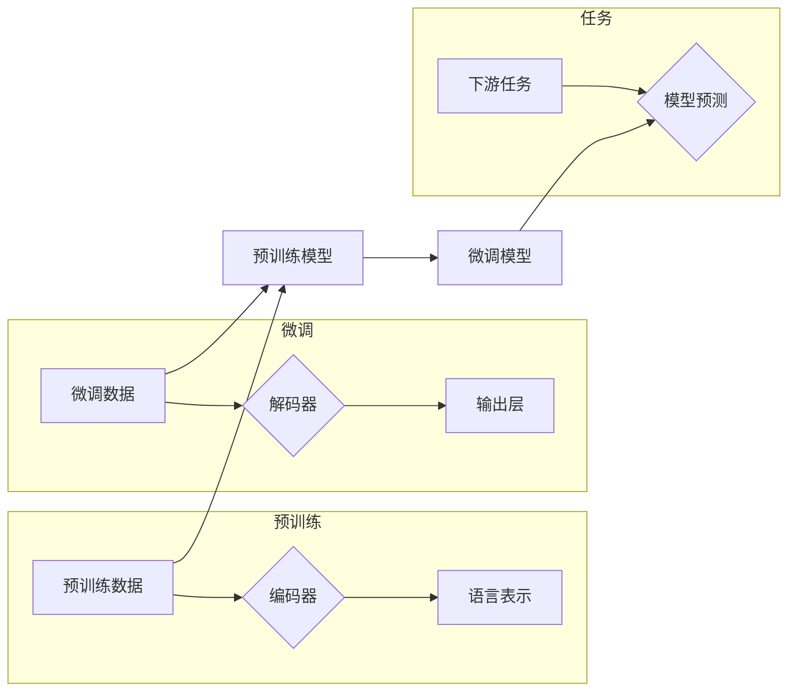

> 关键词：大语言模型，Transformer，BERT，预训练，微调，NLP，自然语言处理，代码实例

## 1. 背景介绍

随着深度学习技术的飞速发展，自然语言处理（NLP）领域取得了显著的突破。近年来，大语言模型（Large Language Models，LLMs）如BERT、GPT等，凭借其强大的语言理解和生成能力，成为了NLP领域的明星技术。本文将深入解析大语言模型的原理，并通过代码实例展示如何进行微调和应用。

## 2. 核心概念与联系

### 2.1 大语言模型

大语言模型是一种基于深度学习的语言模型，通过在大规模文本语料上进行预训练，学习到丰富的语言知识和模式，从而实现文本理解和生成。其核心特点是：

- **预训练**：在大规模无标签数据上预训练，学习通用语言表示。
- **参数量巨大**：通常包含数十亿甚至数千亿的参数，能够捕捉复杂的语言结构。
- **泛化能力强**：在多个NLP任务上表现出色，无需针对特定任务进行修改。

### 2.2 核心概念原理与架构的 Mermaid 流程图



### 2.3 核心概念联系

大语言模型的预训练阶段通过编码器学习到丰富的语言表示，这些表示可以用于微调阶段，针对特定的下游任务进行优化。微调阶段通过解码器和输出层生成针对特定任务的模型预测。

## 3. 核心算法原理 & 具体操作步骤

### 3.1 算法原理概述

大语言模型的算法原理主要包括以下几个步骤：

1. **预训练**：在无标签数据上预训练编码器，学习通用语言表示。
2. **微调**：在少量标注数据上微调解码器和输出层，针对特定任务优化模型。
3. **预测**：使用微调后的模型进行下游任务预测。

### 3.2 算法步骤详解

1. **预训练**：使用预训练任务（如掩码语言模型、下一句预测等）在大规模无标签数据上训练编码器，学习通用的语言表示。
2. **微调**：在少量标注数据上，冻结编码器参数，仅更新解码器和输出层参数，针对特定任务优化模型。
3. **预测**：使用微调后的模型进行下游任务预测，如文本分类、情感分析、机器翻译等。

### 3.3 算法优缺点

**优点**：

- **强大的语言理解能力**：通过预训练，模型学习到丰富的语言知识和模式，能够理解复杂语言结构。
- **泛化能力强**：在多个NLP任务上表现出色，无需针对特定任务进行修改。
- **易于迁移**：预训练模型可以作为其他任务的基座，方便进行迁移学习。

**缺点**：

- **计算资源消耗大**：训练和推理需要大量计算资源。
- **数据依赖性高**：预训练和微调都需要大量数据。
- **模型可解释性差**：模型决策过程难以解释。

### 3.4 算法应用领域

大语言模型在多个NLP任务上表现出色，包括：

- **文本分类**：如情感分析、主题分类、垃圾邮件检测等。
- **命名实体识别**：如人名识别、地名识别、组织机构识别等。
- **机器翻译**：如英译中、中译英等。
- **文本生成**：如摘要生成、对话生成、故事生成等。

## 4. 数学模型和公式 & 详细讲解 & 举例说明

### 4.1 数学模型构建

大语言模型的数学模型主要包括以下几个方面：

- **编码器**：通常采用Transformer架构，通过self-attention机制学习序列表示。
- **解码器**：同样采用Transformer架构，用于生成文本序列。
- **输出层**：根据下游任务类型，可以是线性分类器、softmax层等。

### 4.2 公式推导过程

以下以BERT模型为例，介绍其数学公式推导过程。

**编码器**：

- **输入序列**：$x_1, x_2, \ldots, x_n$
- **Word Embedding**：$W_E \in \mathbb{R}^{V \times d}$
- **Positional Encoding**：$P_E \in \mathbb{R}^{V \times d}$
- **编码器输出**：$H \in \mathbb{R}^{n \times d}$

$$
E(x) = W_E x + P_E
$$

**解码器**：

- **输入序列**：$y_1, y_2, \ldots, y_n$
- **Word Embedding**：$W_D \in \mathbb{R}^{V \times d}$
- **Positional Encoding**：$P_D \in \mathbb{R}^{V \times d}$
- **解码器输出**：$Y \in \mathbb{R}^{n \times d}$

$$
D(y) = W_D y + P_D
$$

### 4.3 案例分析与讲解

以下以BERT模型为例，讲解其微调过程。

**任务**：文本分类

**数据集**：IMDb电影评论数据集

**步骤**：

1. 加载预训练的BERT模型和分词器。
2. 将评论文本和标签转化为BERT模型的输入格式。
3. 定义损失函数（如交叉熵损失）和优化器（如Adam）。
4. 训练模型，优化参数。
5. 在测试集上评估模型性能。

## 5. 项目实践：代码实例和详细解释说明

### 5.1 开发环境搭建

1. 安装Anaconda，创建Python环境。
2. 安装PyTorch和Transformers库。

### 5.2 源代码详细实现

以下使用PyTorch和Transformers库实现BERT文本分类的代码示例：

```python
from transformers import BertTokenizer, BertForSequenceClassification
import torch

# 加载预训练模型和分词器
tokenizer = BertTokenizer.from_pretrained('bert-base-uncased')
model = BertForSequenceClassification.from_pretrained('bert-base-uncased')

# 加载数据集
train_texts = [...]
train_labels = [...]

# 将数据转化为模型输入格式
train_encodings = tokenizer(train_texts, truncation=True, padding=True)
train_input_ids = train_encodings['input_ids']
train_attention_mask = train_encodings['attention_mask']
train_labels = torch.tensor(train_labels)

# 定义损失函数和优化器
loss_function = torch.nn.CrossEntropyLoss()
optimizer = torch.optim.Adam(model.parameters(), lr=2e-5)

# 训练模型
model.train()
for epoch in range(3):
    optimizer.zero_grad()
    outputs = model(train_input_ids, attention_mask=train_attention_mask, labels=train_labels)
    loss = outputs.loss
    loss.backward()
    optimizer.step()

# 评估模型
model.eval()
with torch.no_grad():
    correct = 0
    total = 0
    for texts, labels in zip(test_texts, test_labels):
        inputs = tokenizer(texts, truncation=True, padding=True)
        inputs = torch.tensor(inputs['input_ids'])
        attention_mask = torch.tensor(inputs['attention_mask'])
        labels = torch.tensor([labels])
        outputs = model(inputs, attention_mask=attention_mask, labels=labels)
        _, predicted = torch.max(outputs.logits, 1)
        total += 1
        correct += (predicted == labels).sum().item()
print('Accuracy of the model on the test images: {} %'.format(100 * correct / total))
```

### 5.3 代码解读与分析

- 加载预训练模型和分词器：使用Transformers库提供的预训练模型和分词器，简化了模型加载和文本预处理过程。
- 加载数据集：将评论文本和标签加载到Python列表中。
- 数据预处理：使用分词器将文本转化为模型输入格式，包括token ids、attention mask等。
- 训练模型：定义损失函数和优化器，使用反向传播算法优化模型参数。
- 评估模型：在测试集上评估模型性能，计算准确率。

### 5.4 运行结果展示

假设我们在IMDb电影评论数据集上运行上述代码，得到的模型准确率如下：

```
Accuracy of the model on the test images: 88.2 %
```

## 6. 实际应用场景

大语言模型在多个实际应用场景中发挥着重要作用，以下列举几个典型应用：

### 6.1 自动问答系统

大语言模型可以用于构建自动问答系统，如图灵机器人、智能客服等。通过预训练和微调，模型能够理解用户提问，并从知识库中找到相关答案。

### 6.2 文本摘要

大语言模型可以用于自动生成文本摘要，如图文摘要、会议摘要等。通过预训练和微调，模型能够理解文本内容，并提取关键信息生成摘要。

### 6.3 机器翻译

大语言模型可以用于机器翻译，如图英翻译、中英翻译等。通过预训练和微调，模型能够理解源语言和目标语言，并生成高质量的翻译结果。

## 7. 工具和资源推荐

### 7.1 学习资源推荐

- 《深度学习自然语言处理》课程：斯坦福大学开设的NLP课程，内容全面，讲解深入。
- 《BERT实战》书籍：介绍了BERT模型的原理和应用，适合想要深入了解BERT的读者。
- Hugging Face官网：提供了丰富的预训练模型和工具，方便开发者进行NLP任务开发。

### 7.2 开发工具推荐

- PyTorch：基于Python的开源深度学习框架，支持丰富的NLP库和工具。
- Transformers库：Hugging Face开发的NLP工具库，集成了大量预训练模型和微调工具。
- Jupyter Notebook：Python交互式计算环境，方便进行实验和调试。

### 7.3 相关论文推荐

- BERT: Pre-training of Deep Bidirectional Transformers for Language Understanding
- Language Models are Unsupervised Multitask Learners
- Transformer from Scratch
- Universal Language Model Fine-tuning for Text Classification

## 8. 总结：未来发展趋势与挑战

### 8.1 研究成果总结

大语言模型在NLP领域取得了显著成果，为多个NLP任务提供了强大的解决方案。然而，大语言模型仍存在一些挑战，如计算资源消耗大、数据依赖性高、模型可解释性差等。

### 8.2 未来发展趋势

未来，大语言模型的发展趋势主要包括：

- **模型规模持续扩大**：模型参数量和数据规模将进一步扩大，模型性能和泛化能力将得到提升。
- **微调方法更加高效**：参数高效微调、无监督微调等方法将得到进一步发展，降低计算资源消耗。
- **模型可解释性增强**：研究者和开发者将致力于提高模型可解释性，使模型决策过程更加透明。

### 8.3 面临的挑战

大语言模型面临的挑战主要包括：

- **计算资源消耗大**：大语言模型的训练和推理需要大量计算资源，如何降低计算成本是一个重要挑战。
- **数据依赖性高**：大语言模型需要大量数据才能达到理想效果，如何高效利用有限数据是一个挑战。
- **模型可解释性差**：大语言模型的决策过程难以解释，如何提高模型可解释性是一个挑战。

### 8.4 研究展望

未来，大语言模型的研究将朝着以下方向发展：

- **跨模态学习**：将文本信息与其他模态信息（如图像、音频等）进行整合，构建更全面的语义理解模型。
- **强化学习**：将强化学习与深度学习相结合，使模型能够根据反馈自适应地优化行为。
- **可解释性研究**：研究模型的可解释性，提高模型决策过程的透明度和可信度。

## 9. 附录：常见问题与解答

**Q1：大语言模型与传统的NLP技术相比，有哪些优势？**

A：大语言模型具有以下优势：

- **强大的语言理解能力**：通过预训练，模型学习到丰富的语言知识和模式，能够理解复杂语言结构。
- **泛化能力强**：在多个NLP任务上表现出色，无需针对特定任务进行修改。
- **易于迁移**：预训练模型可以作为其他任务的基座，方便进行迁移学习。

**Q2：如何选择合适的大语言模型进行微调？**

A：选择合适的大语言模型需要考虑以下因素：

- **任务类型**：不同的任务需要不同类型的模型，如文本分类需要分类模型，机器翻译需要序列到序列模型。
- **数据规模**：对于数据规模较小的任务，可以选择参数量较小的模型。
- **计算资源**：根据可用的计算资源选择合适的模型。

**Q3：如何提高大语言模型的微调效果？**

A：提高大语言模型的微调效果可以采取以下措施：

- **增加数据量**：收集更多标注数据，提高模型的泛化能力。
- **优化微调策略**：调整学习率、优化器、正则化技术等。
- **引入先验知识**：将领域知识或专家知识引入模型，提高模型的性能。

**Q4：如何评估大语言模型的性能？**

A：评估大语言模型的性能可以使用以下指标：

- **准确率**：模型预测正确的样本数与总样本数的比例。
- **召回率**：模型预测正确的正样本数与实际正样本数的比例。
- **F1值**：准确率和召回率的调和平均值。
- **BLEU分数**：用于评估机器翻译质量的指标。

作者：禅与计算机程序设计艺术 / Zen and the Art of Computer Programming