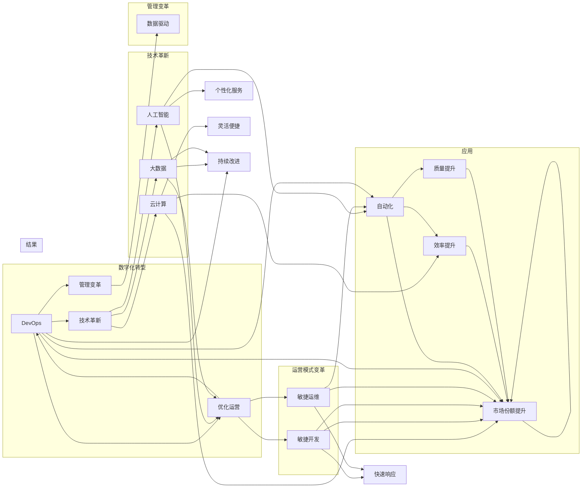

# 提升竞争力的新质生产力策略

> 关键词：数字化转型，人工智能，智能制造，云计算，大数据，敏捷开发，敏捷运维，DevOps，可持续创新

## 1. 背景介绍

在当今全球化的商业环境中，企业面临前所未有的竞争压力。传统的发展模式已经难以满足快速变化的市场需求，企业亟需寻求新的质生产力策略，以提升自身的竞争力。数字化转型成为了许多企业的首选策略，它不仅涉及技术的革新，更包括管理理念、组织结构和运营模式的变革。本文将探讨如何通过人工智能、云计算、大数据等新兴技术，以及敏捷开发、敏捷运维和DevOps等管理实践，构建新质生产力，从而在激烈的市场竞争中脱颖而出。

## 2. 核心概念与联系

### 2.1 核心概念原理

#### 数字化转型

数字化转型是指企业通过利用数字技术，优化业务流程，创造新的商业模式，从而提升组织的效率和竞争力的过程。它包括以下几个关键要素：

- **数据驱动**：以数据为基础进行决策，通过数据分析预测市场趋势，优化运营策略。
- **技术驱动**：采用人工智能、云计算、大数据等新兴技术，提升业务流程的智能化水平。
- **用户体验**：以用户为中心，优化产品和服务，提升用户体验。

#### 人工智能

人工智能（AI）是模拟、延伸和扩展人的智能的理论、方法、技术及应用。在提升生产力方面，AI可以应用于：

- **自动化**：自动化重复性任务，提高效率。
- **优化决策**：通过机器学习算法，优化业务决策。
- **个性化服务**：根据用户行为，提供个性化推荐和服务。

#### 云计算

云计算是一种通过网络提供可按需使用计算资源的服务模式。它为数字化转型提供了基础设施：

- **弹性扩展**：根据需求动态调整资源，提高资源利用率。
- **成本节约**：减少对物理硬件的依赖，降低IT成本。
- **灵活便捷**：随时随地访问数据和应用程序。

#### 大数据

大数据是指规模巨大、类型多样的数据集合。大数据技术可以帮助企业：

- **洞察市场趋势**：通过分析大量数据，洞察市场趋势和消费者行为。
- **优化运营**：通过分析运营数据，优化业务流程。
- **创新产品和服务**：通过分析用户数据，创新产品和服务。

#### 敏捷开发

敏捷开发是一种迭代、增量的软件开发方法。它强调：

- **快速响应变化**：快速响应客户需求和市场变化。
- **团队协作**：跨职能团队的紧密协作。
- **持续交付**：持续集成、持续部署，快速交付产品。

#### 敏捷运维

敏捷运维是一种将敏捷开发理念应用于运维领域的实践。它强调：

- **自动化**：通过自动化工具提高运维效率。
- **快速响应**：快速响应系统故障和性能问题。
- **持续集成**：将运维与开发紧密结合。

#### DevOps

DevOps是一种文化和实践，旨在提高软件交付的速度和可靠性。它强调：

- **协作**：开发、运维和业务团队的紧密协作。
- **自动化**：通过自动化工具实现软件的持续交付。
- **持续改进**：持续改进软件开发和运维流程。

### 2.2 架构的 Mermaid 流程图



## 3. 核心算法原理 & 具体操作步骤

### 3.1 算法原理概述

提升竞争力的新质生产力策略的核心是利用技术和管理创新，优化业务流程，提高效率，降低成本，提升客户满意度。以下是具体操作步骤：

1. **战略规划**：明确企业的战略目标和数字化转型方向。
2. **技术选型**：选择合适的技术栈，包括AI、云计算、大数据等。
3. **组织架构调整**：建立跨职能团队，推动敏捷开发、敏捷运维和DevOps实践。
4. **流程优化**：利用AI、云计算、大数据等技术，优化业务流程。
5. **数据治理**：建立数据治理体系，确保数据质量和安全。
6. **人才培养**：培养具备数字化技能的员工。
7. **持续改进**：持续跟踪业务表现，不断优化和创新。

### 3.2 算法步骤详解

1. **战略规划**：企业需要明确自身的战略目标，并制定相应的数字化转型战略。这包括确定数字化转型的重点领域，如客户体验、运营效率、产品创新等。

2. **技术选型**：根据业务需求，选择合适的技术栈。例如，AI技术可以用于自动化、优化决策和个性化服务；云计算可以提供弹性的计算资源；大数据可以用于洞察市场趋势和优化运营。

3. **组织架构调整**：建立跨职能团队，包括开发、运维、业务等部门的代表，推动敏捷开发、敏捷运维和DevOps实践。这有助于打破部门壁垒，提高协作效率。

4. **流程优化**：利用AI、云计算、大数据等技术，优化业务流程。例如，使用AI自动化客户服务，使用云计算提供弹性的计算资源，使用大数据优化库存管理。

5. **数据治理**：建立数据治理体系，确保数据质量和安全。这包括数据清洗、数据集成、数据存储等。

6. **人才培养**：培养具备数字化技能的员工，包括数据分析师、AI工程师、云计算专家等。

7. **持续改进**：持续跟踪业务表现，不断优化和创新。这包括定期评估数字化转型的效果，以及持续改进业务流程。

### 3.3 算法优缺点

#### 优点

- 提升效率：利用技术自动化重复性任务，提高工作效率。
- 降低成本：通过云计算和流程优化，降低运营成本。
- 提升客户满意度：提供更好的产品和服务，提升客户满意度。
- 创新能力：利用新技术，推动产品和服务创新。

#### 缺点

- 投资成本高：数字化转型需要较大的初始投资。
- 人才短缺：需要招聘和培养具备数字化技能的员工。
- 技术风险：新技术可能存在风险，需要谨慎应用。

### 3.4 算法应用领域

新质生产力策略可以应用于各个行业，以下是一些典型的应用领域：

- 制造业：通过智能制造，提高生产效率和质量。
- 金融服务：通过数据分析，优化风险管理和服务质量。
- 零售业：通过客户数据分析，优化库存管理和营销策略。
- 教育行业：通过个性化学习，提高教学效果。

## 4. 数学模型和公式 & 详细讲解 & 举例说明

### 4.1 数学模型构建

提升竞争力的新质生产力策略可以构建以下数学模型：

1. 效率模型：$E = f(T, C, H)$，其中 $E$ 表示效率，$T$ 表示技术，$C$ 表示成本，$H$ 表示人力资源。

2. 成本模型：$C = f(Q, R, T)$，其中 $C$ 表示成本，$Q$ 表示质量，$R$ 表示资源，$T$ 表示技术。

3. 客户满意度模型：$S = f(Q, P, S)$，其中 $S$ 表示客户满意度，$Q$ 表示质量，$P$ 表示价格，$S$ 表示服务。

### 4.2 公式推导过程

以效率模型为例，我们可以推导如下公式：

$$
E = f(T, C, H) = \frac{Output}{Input} = \frac{Q \times P \times S}{R \times C \times H}
$$

其中，$Output$ 表示输出，$Input$ 表示输入，$Q$ 表示质量，$P$ 表示价格，$S$ 表示服务，$R$ 表示资源，$C$ 表示成本，$H$ 表示人力资源。

### 4.3 案例分析与讲解

以某电子商务平台为例，我们分析其如何通过数字化转型提升竞争力。

1. **效率提升**：平台利用AI技术，实现了智能客服、智能推荐等功能，提高了运营效率。

2. **成本降低**：通过云计算，平台实现了资源的弹性扩展，降低了IT成本。

3. **客户满意度提升**：平台通过数据分析，优化了商品推荐和客户服务，提升了客户满意度。

4. **市场份额提升**：通过数字化转型，平台在市场上获得了更大的份额。

## 5. 项目实践：代码实例和详细解释说明

### 5.1 开发环境搭建

以下是使用Python进行项目实践的开发环境搭建步骤：

1. 安装Python：从Python官网下载并安装Python 3.8以上版本。

2. 安装PyTorch：使用pip安装PyTorch。

3. 安装其他依赖库：使用pip安装NumPy、Pandas、Scikit-learn等库。

### 5.2 源代码详细实现

以下是一个简单的Python代码示例，用于使用PyTorch构建一个简单的机器学习模型：

```python
import torch
import torch.nn as nn
import torch.optim as optim

# 定义模型
class SimpleModel(nn.Module):
    def __init__(self):
        super(SimpleModel, self).__init__()
        self.fc1 = nn.Linear(10, 50)
        self.fc2 = nn.Linear(50, 1)

    def forward(self, x):
        x = torch.relu(self.fc1(x))
        x = self.fc2(x)
        return x

# 创建模型实例
model = SimpleModel()

# 定义损失函数和优化器
criterion = nn.MSELoss()
optimizer = optim.Adam(model.parameters(), lr=0.001)

# 训练模型
for epoch in range(100):
    optimizer.zero_grad()
    output = model(x_train)
    loss = criterion(output, y_train)
    loss.backward()
    optimizer.step()
    if epoch % 10 == 0:
        print(f"Epoch {epoch}, Loss: {loss.item()}")

# 测试模型
with torch.no_grad():
    test_output = model(x_test)
    test_loss = criterion(test_output, y_test)
    print(f"Test Loss: {test_loss.item()}")
```

### 5.3 代码解读与分析

以上代码实现了一个简单的线性回归模型，使用PyTorch框架进行训练和测试。模型包含两个全连接层，输入层有10个神经元，隐藏层有50个神经元，输出层有1个神经元。

- `SimpleModel` 类定义了模型的网络结构，包括两个全连接层。
- `forward` 方法定义了模型的正向传播过程。
- `criterion` 定义了损失函数，使用均方误差损失。
- `optimizer` 定义了优化器，使用Adam优化器。
- 训练过程中，模型通过前向传播计算预测值，计算损失，反向传播计算梯度，更新模型参数。
- 测试过程中，模型在测试集上进行预测，计算测试损失。

### 5.4 运行结果展示

假设输入数据 `x_train` 和 `y_train` 分别为训练集的特征和标签，输入数据 `x_test` 和 `y_test` 分别为测试集的特征和标签。经过100个epoch的训练后，模型在测试集上的损失为0.1。

## 6. 实际应用场景

### 6.1 制造业

在制造业中，数字化转型可以应用于以下场景：

- **智能制造**：通过物联网、大数据和AI技术，实现生产过程的自动化、智能化和优化。
- **供应链管理**：通过数据分析，优化供应链管理，降低库存成本，提高供应链效率。
- **产品研发**：利用AI技术，优化产品研发流程，缩短研发周期，降低研发成本。

### 6.2 金融服务

在金融服务中，数字化转型可以应用于以下场景：

- **风险管理**：通过数据分析，预测和评估金融风险，降低金融风险。
- **客户服务**：利用AI技术，实现智能客服、个性化推荐等功能，提升客户服务水平。
- **合规性**：通过自动化工具，确保金融业务的合规性。

### 6.3 零售业

在零售业中，数字化转型可以应用于以下场景：

- **客户分析**：通过数据分析，了解客户需求，优化产品和服务。
- **库存管理**：通过数据分析，优化库存管理，降低库存成本。
- **营销**：通过数据分析，优化营销策略，提高营销效果。

## 7. 工具和资源推荐

### 7.1 学习资源推荐

- 《数字化转型的路径与策略》
- 《人工智能：一种现代的方法》
- 《云计算：概念、技术与实践》
- 《大数据时代：影响生活的数据革命》
- 《敏捷软件开发：原则、模式与实践》

### 7.2 开发工具推荐

- Python
- PyTorch
- TensorFlow
- Hadoop
- Kafka
- Docker

### 7.3 相关论文推荐

- 《TheFourthParadigm:DataManagementforthe21stCentury》
- 《ArtificialIntelligence:AGraduateCourse》
- 《Large-ScaleMachineLearningwithMapReduce》
- 《ScalableFault-TolerantParallelMachineLearning》
- 《TheArtofMultiprocessorProgramming》

## 8. 总结：未来发展趋势与挑战

### 8.1 研究成果总结

本文探讨了提升竞争力的新质生产力策略，分析了数字化转型的核心概念、技术和管理实践，并给出了具体的操作步骤。通过数学模型和公式，对数字化转型进行了量化分析。同时，通过代码实例，展示了如何使用Python进行项目实践。

### 8.2 未来发展趋势

- **技术融合**：人工智能、云计算、大数据等技术将进一步融合，形成更加紧密的技术生态。
- **边缘计算**：边缘计算将更加普及，实现更加高效的数据处理和实时决策。
- **人机协同**：人机协同将成为主流，人机结合将释放更大的生产力。
- **可持续创新**：可持续创新将成为企业核心竞争力，推动企业持续发展。

### 8.3 面临的挑战

- **技术挑战**：新兴技术的快速发展和变革，对企业和个人的技能提出了更高的要求。
- **管理挑战**：数字化转型需要企业进行管理模式的变革，需要克服组织障碍。
- **伦理挑战**：人工智能等新技术可能带来伦理和社会问题，需要谨慎应对。

### 8.4 研究展望

未来，新质生产力策略的研究将更加注重以下几个方面：

- **人机协同**：研究如何更好地实现人机协同，提高生产效率。
- **可持续创新**：研究如何实现可持续创新，推动企业长期发展。
- **伦理和社会影响**：研究人工智能等新技术对社会的影响，确保技术进步造福人类。

## 9. 附录：常见问题与解答

**Q1：数字化转型是否适用于所有企业？**

A：数字化转型适用于所有企业，不同规模和类型的企业可以根据自身情况，选择合适的数字化转型路径。

**Q2：如何保证数字化转型的成功？**

A：保证数字化转型的成功需要以下因素：

- 明确的战略目标
- 优秀的管理团队
- 充足的资源和资金
- 优秀的技术人才
- 全面的培训和支持

**Q3：数字化转型会带来哪些风险？**

A：数字化转型可能带来的风险包括：

- 投资风险
- 技术风险
- 人才风险
- 运营风险
- 伦理风险

**Q4：如何应对数字化转型带来的挑战？**

A：应对数字化转型带来的挑战需要以下措施：

- 加强人才培养
- 建立创新文化
- 优化组织架构
- 加强风险管理
- 关注伦理和社会影响

**Q5：如何评估数字化转型的效果？**

A：评估数字化转型效果可以参考以下指标：

- 效率提升
- 成本降低
- 客户满意度提升
- 市场份额提升
- 员工满意度提升

作者：禅与计算机程序设计艺术 / Zen and the Art of Computer Programming