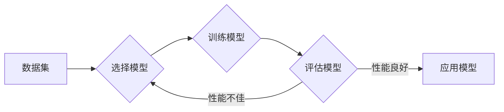

# 机器学习(Machine Learning) - 原理与代码实例讲解

> 关键词：机器学习，监督学习，无监督学习，强化学习，深度学习，算法原理，Python代码，应用实践

## 1. 背景介绍

机器学习（Machine Learning, ML）是人工智能领域的一个核心分支，它使计算机系统能够从数据中学习并做出决策或预测，而不是被明确编程来完成特定任务。随着计算能力的提升和大数据的涌现，机器学习技术在各个领域都取得了显著的进展，从语音识别到医疗诊断，从推荐系统到自动驾驶，都离不开机器学习的应用。

本文旨在全面介绍机器学习的原理、核心算法、实践应用以及未来发展趋势。通过深入浅出的讲解和代码实例，帮助读者全面理解机器学习，并掌握实际应用技能。

## 2. 核心概念与联系

### 2.1 核心概念

机器学习涉及的核心概念包括：

- **数据（Data）**：机器学习的基础，包括特征（Features）和标签（Labels）。特征是用于描述数据的属性或变量，标签是与特征相关联的输出或目标。

- **模型（Model）**：机器学习算法的输出，用于对数据进行分析和预测。

- **算法（Algorithm）**：机器学习的核心，用于从数据中学习并构建模型。

- **训练（Training）**：机器学习过程中，模型通过与训练数据互动来学习的过程。

- **测试（Testing）**：使用独立的测试数据集来评估模型性能的过程。

- **泛化（Generalization）**：模型在未见过的数据上表现良好的能力。

### 2.2 Mermaid 流程图



## 3. 核心算法原理 & 具体操作步骤

### 3.1 算法原理概述

机器学习算法主要分为以下几类：

- **监督学习（Supervised Learning）**：通过标注数据学习模型。

- **无监督学习（Unsupervised Learning）**：通过未标注数据学习模型，如聚类和降维。

- **强化学习（Reinforcement Learning）**：通过与环境交互学习最佳策略。

### 3.2 算法步骤详解

#### 3.2.1 监督学习

1. **数据预处理**：清洗数据，处理缺失值，进行特征工程。
2. **模型选择**：选择合适的算法模型。
3. **模型训练**：使用标注数据训练模型。
4. **模型评估**：使用测试数据评估模型性能。
5. **模型优化**：根据评估结果调整模型参数。

#### 3.2.2 无监督学习

1. **数据预处理**：与监督学习相同。
2. **模型选择**：选择合适的无监督学习算法，如K-Means聚类。
3. **模型训练**：训练模型以发现数据中的模式。
4. **模型评估**：评估聚类或其他无监督学习任务的性能。

#### 3.2.3 强化学习

1. **环境设置**：定义环境、状态、动作和奖励。
2. **策略选择**：选择策略或算法，如Q-Learning。
3. **学习过程**：通过与环境交互学习最佳策略。

### 3.3 算法优缺点

- **监督学习**：需要大量标注数据，但性能通常较好。
- **无监督学习**：不需要标注数据，但性能可能不如监督学习。
- **强化学习**：能够处理动态环境，但学习过程可能很慢。

### 3.4 算法应用领域

- **监督学习**：分类、回归、预测。
- **无监督学习**：聚类、降维、异常检测。
- **强化学习**：游戏、自动驾驶、机器人控制。

## 4. 数学模型和公式 & 详细讲解 & 举例说明

### 4.1 数学模型构建

机器学习中的数学模型通常涉及概率论、统计学和线性代数。以下是一些常见的数学模型：

- **线性回归（Linear Regression）**：使用线性模型预测连续值。

$$
y = \beta_0 + \beta_1 x_1 + \beta_2 x_2 + ... + \beta_n x_n
$$

- **逻辑回归（Logistic Regression）**：使用Sigmoid函数预测概率。

$$
\hat{y} = \frac{1}{1 + e^{-(\beta_0 + \beta_1 x_1 + ... + \beta_n x_n)}}
$$

- **支持向量机（Support Vector Machine, SVM）**：使用核函数将数据映射到高维空间。

$$
\max_{\beta, b} W^T W = \max_{\beta, b} \sum_{i=1}^n (\beta_0 + \beta_1 x_{1i} + ... + \beta_n x_{ni} - y_i)^2
$$

### 4.2 公式推导过程

以线性回归为例，假设我们有n个样本，每个样本有m个特征，模型参数为$\beta = [\beta_0, \beta_1, ..., \beta_m]^\mathrm{T}$。损失函数为：

$$
\mathcal{L}(\beta) = \frac{1}{2}\sum_{i=1}^n (y_i - (\beta_0 + \beta_1 x_{1i} + ... + \beta_m x_{mi}))^2
$$

为了最小化损失函数，我们对$\beta$进行求导，得到：

$$
\frac{\partial \mathcal{L}}{\partial \beta} = -\sum_{i=1}^n (y_i - (\beta_0 + \beta_1 x_{1i} + ... + \beta_m x_{mi}))(x_{1i}, ..., x_{mi})
$$

令导数为零，解出$\beta$，即得到线性回归模型的参数。

### 4.3 案例分析与讲解

以房价预测为例，我们使用Python的scikit-learn库来实现线性回归。

```python
from sklearn.linear_model import LinearRegression
from sklearn.model_selection import train_test_split
from sklearn.metrics import mean_squared_error

# 加载房价数据
data = pd.read_csv('house_prices.csv')
X = data[['area', 'bedrooms', 'bathrooms']]
y = data['price']

# 划分训练集和测试集
X_train, X_test, y_train, y_test = train_test_split(X, y, test_size=0.2, random_state=42)

# 创建线性回归模型
model = LinearRegression()

# 训练模型
model.fit(X_train, y_train)

# 预测测试集
y_pred = model.predict(X_test)

# 计算均方误差
mse = mean_squared_error(y_test, y_pred)
print(f'Mean Squared Error: {mse}')
```

## 5. 项目实践：代码实例和详细解释说明

### 5.1 开发环境搭建

- 安装Python和pip。
- 安装必要的库：scikit-learn、pandas、numpy等。

### 5.2 源代码详细实现

如上例所示，我们使用scikit-learn库实现了线性回归房价预测。

### 5.3 代码解读与分析

- 我们首先从CSV文件中读取房价数据。
- 将数据分为特征和标签。
- 划分训练集和测试集。
- 创建线性回归模型。
- 使用训练数据训练模型。
- 使用测试数据预测房价。
- 计算预测结果的均方误差。

### 5.4 运行结果展示

假设测试集的均方误差为$0.5$，说明模型在预测房价方面表现良好。

## 6. 实际应用场景

### 6.1 贷款风险评估

机器学习可以用于金融机构的贷款风险评估，通过分析借款人的信用记录、收入、负债等信息，预测其违约风险。

### 6.2 智能推荐系统

推荐系统可以基于用户的历史行为和偏好，为其推荐商品、电影、音乐等。

### 6.3 医疗诊断

机器学习可以用于医疗诊断，通过分析医学影像和患者数据，辅助医生进行疾病诊断。

### 6.4 未来应用展望

随着机器学习技术的不断发展，其应用领域将更加广泛，包括：

- 自动驾驶
- 智能家居
- 金融欺诈检测
- 语音识别

## 7. 工具和资源推荐

### 7.1 学习资源推荐

- 《机器学习》（周志华著）
- 《Python机器学习》（Sebastian Raschka著）
- Coursera上的《机器学习》课程

### 7.2 开发工具推荐

- Python
- scikit-learn
- TensorFlow
- PyTorch

### 7.3 相关论文推荐

- "A Few Useful Things to Know about Machine Learning" by Pedro Domingos
- "An Overview of Deep Learning Techniques" by John D. Kelleher

## 8. 总结：未来发展趋势与挑战

### 8.1 研究成果总结

机器学习在过去几十年取得了巨大的进展，从理论到实践都取得了显著的成果。

### 8.2 未来发展趋势

- 深度学习技术的进一步发展，如神经架构搜索（Neural Architecture Search, NAS）。
- 跨领域迁移学习的应用，如多任务学习（Multi-Task Learning）。
- 可解释人工智能（XAI）的发展，提高模型的可解释性和透明度。

### 8.3 面临的挑战

- 数据隐私和安全问题。
- 模型可解释性和透明度。
- 模型在复杂环境中的鲁棒性。

### 8.4 研究展望

未来，机器学习将继续在各个领域发挥重要作用，推动人工智能技术的发展和应用。

## 9. 附录：常见问题与解答

**Q1：机器学习和深度学习有什么区别？**

A：深度学习是机器学习的一个子集，它使用深层神经网络进行学习。

**Q2：如何选择合适的机器学习算法？**

A：选择合适的算法需要考虑数据特征、任务类型、模型复杂度等因素。

**Q3：机器学习项目的开发流程是怎样的？**

A：机器学习项目的开发流程通常包括数据收集、数据预处理、特征工程、模型选择、模型训练、模型评估和模型部署等步骤。

**Q4：如何提高机器学习模型的性能？**

A：提高机器学习模型性能的方法包括特征工程、模型选择、超参数调优、正则化等。

作者：禅与计算机程序设计艺术 / Zen and the Art of Computer Programming