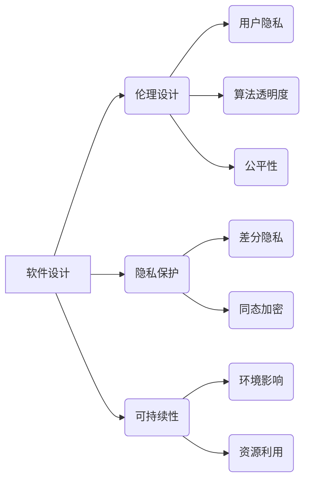

# 软件 2.0 的社会责任：科技向善

> 关键词：软件2.0，社会责任，科技向善，伦理，人工智能，可持续发展，用户权益，数据隐私

## 1. 背景介绍

随着信息技术的飞速发展，软件已经成为现代社会不可或缺的一部分。从日常生活的购物、通讯到复杂的工业控制系统，软件无处不在。然而，随着软件的普及和影响力的增加，其社会责任问题也日益凸显。软件2.0时代的到来，不仅意味着技术的迭代，更意味着我们需要重新审视软件在构建和谐社会中的角色和责任。

### 1.1 问题的由来

传统的软件1.0时代，软件主要关注的是功能性和效率。随着互联网的普及，软件开始进入2.0时代，其核心特征是软件即服务(SaaS)，强调软件与用户之间的互动和协作。然而，这种转变也带来了一系列新的社会责任问题：

- **数据隐私**：软件在收集和分析用户数据时，如何平衡隐私和便利之间的矛盾？
- **算法偏见**：算法的决策是否公正，是否会加剧社会不平等？
- **可持续性**：软件的发展是否考虑了环境影响和资源的可持续利用？
- **用户权益**：软件如何保障用户的知情权和选择权？

### 1.2 研究现状

近年来，关于软件的社会责任问题已经引起了广泛关注。学术界、产业界和政府都在积极探索如何构建负责任的软件生态系统。以下是一些关键的研究方向：

- **伦理设计**：在软件设计阶段就考虑伦理因素，确保软件的决策符合道德和法律标准。
- **隐私保护**：开发隐私保护技术，如差分隐私、同态加密等，减少对用户数据的暴露。
- **公平性评估**：评估和减少算法偏见，确保算法决策的公平性和透明性。
- **可持续软件**：开发可回收、可升级的软件，减少对环境的影响。

### 1.3 研究意义

研究软件2.0的社会责任，对于构建和谐社会、促进可持续发展具有重要意义：

- **提高用户信任**：负责任的软件能够增强用户对技术的信任，促进技术的普及和应用。
- **促进社会公正**：通过减少算法偏见，有助于消除社会不平等，促进社会公正。
- **保护环境**：可持续软件的发展有助于减少资源消耗和环境污染。
- **推动技术进步**：关注社会责任的软件技术，能够引领技术向更加健康、可持续的方向发展。

### 1.4 本文结构

本文将围绕软件2.0的社会责任展开讨论，具体内容包括：

- 介绍软件2.0的社会责任核心概念和联系。
- 探讨软件2.0时代的主要社会责任问题。
- 分析解决这些问题的技术方法和策略。
- 展望软件2.0的社会责任未来发展趋势。

## 2. 核心概念与联系

### 2.1 软件社会责任

软件社会责任是指软件开发者和使用者应当承担的社会责任，包括但不限于保护用户隐私、确保软件的公平性和透明性、促进可持续发展等。

### 2.2 伦理设计

伦理设计是指在软件设计阶段就考虑伦理因素，确保软件的决策符合道德和法律标准。这包括：

- **用户隐私**：设计时考虑如何保护用户数据，避免未经授权的数据收集和使用。
- **算法透明度**：确保算法的决策过程透明，用户能够理解算法的决策依据。
- **公平性**：确保算法决策的公平性，避免对特定群体产生歧视。

### 2.3 隐私保护技术

隐私保护技术是指一系列用于保护用户隐私的技术，如差分隐私、同态加密等。

### 2.4 可持续软件

可持续软件是指在软件生命周期中，考虑环境影响和资源可持续利用的软件。

### 2.5 Mermaid 流程图



## 3. 核心算法原理 & 具体操作步骤

### 3.1 算法原理概述

软件社会责任的实现需要一系列技术的支持，以下是几个关键算法原理：

- **差分隐私**：通过对数据添加随机噪声，保护个人隐私的同时，仍然保留数据的统计特性。
- **同态加密**：允许在数据加密的情况下进行计算，保护数据的机密性和完整性。
- **对抗样本生成**：通过生成对抗样本，测试和改进算法的鲁棒性。

### 3.2 算法步骤详解

#### 差分隐私

1. **数据采集**：收集用户数据。
2. **添加噪声**：对数据进行扰动，添加随机噪声。
3. **发布数据**：发布扰动后的数据。
4. **数据分析**：对扰动后的数据进行统计分析。

#### 同态加密

1. **加密数据**：对数据进行加密，保护数据机密性。
2. **进行计算**：在加密状态下进行计算。
3. **解密结果**：解密计算结果，得到最终结果。

#### 对抗样本生成

1. **生成对抗样本**：通过生成对抗样本，模拟恶意用户的攻击。
2. **训练模型**：使用对抗样本训练模型，提高模型的鲁棒性。
3. **测试模型**：使用新的对抗样本测试模型的性能。

### 3.3 算法优缺点

#### 差分隐私

优点：保护用户隐私，同时保留数据的统计特性。

缺点：可能影响数据的准确性。

#### 同态加密

优点：保护数据机密性和完整性。

缺点：计算复杂度高，可能影响计算效率。

#### 对抗样本生成

优点：提高模型的鲁棒性。

缺点：需要大量时间和计算资源。

### 3.4 算法应用领域

- **差分隐私**：广告推荐、医疗健康、金融交易等。
- **同态加密**：区块链、云计算、物联网等。
- **对抗样本生成**：网络安全、自动驾驶、金融风控等。

## 4. 数学模型和公式 & 详细讲解 & 举例说明

### 4.1 数学模型构建

#### 差分隐私

假设有一个数据集 $D$，包含 $N$ 个数据点，每个数据点为一个向量 $x_i \in \mathbb{R}^n$。我们希望对数据集 $D$ 进行聚合统计，得到一个估计值 $\hat{y}$。为了保护用户隐私，我们使用差分隐私技术。

假设我们选择 $\epsilon$-差分隐私机制，其中 $\epsilon > 0$。对于每个数据点 $x_i$，我们添加一个随机噪声 $\Delta_i$，使得 $x_i + \Delta_i$ 是一个扰动后的数据点。然后我们对扰动后的数据点进行聚合统计，得到估计值 $\hat{y}$。

差分隐私的定义如下：

$$
\forall \Delta, \Delta' \in \mathbb{R}^n, P(\hat{y} \in C \mid D \rightarrow x_i + \Delta) \leq P(\hat{y} \in C \mid D \rightarrow x_i + \Delta')
$$

其中，$C$ 是一个特定的区间，$P$ 是概率测度。

#### 同态加密

假设我们有一个加密函数 $E: \mathbb{R} \rightarrow \mathbb{C}$，其中 $\mathbb{R}$ 是明文空间，$\mathbb{C}$ 是密文空间。我们希望满足以下同态性质：

1. **加法同态性**：对于任意明文 $a, b \in \mathbb{R}$，有 $E(a) + E(b) = E(a + b)$。
2. **乘法同态性**：对于任意明文 $a, b \in \mathbb{R}$，有 $E(a) \cdot E(b) = E(ab)$。

### 4.2 公式推导过程

#### 差分隐私

以最大值函数为例，假设我们希望计算扰动后的数据集 $D$ 的最大值。我们可以使用以下差分隐私机制：

$$
\hat{y} = \max_{i \in \{1, \ldots, N\}} (x_i + \Delta_i)
$$

其中，$\Delta_i$ 是添加的随机噪声。

#### 同态加密

假设我们有一个明文 $a$，我们希望对其进行加密。我们可以使用以下加密函数：

$$
E(a) = a^3 + 1
$$

### 4.3 案例分析与讲解

#### 案例一：广告推荐

假设我们有一个广告推荐系统，根据用户的历史行为数据推荐广告。为了保护用户隐私，我们使用差分隐私技术对用户数据进行扰动。

#### 案例二：区块链

假设我们使用同态加密技术保护区块链上的交易数据。这样，即使交易数据被公开，攻击者也无法得知具体的交易金额。

## 5. 项目实践：代码实例和详细解释说明

### 5.1 开发环境搭建

为了演示差分隐私技术，我们可以使用Python的`dpdash`库。

### 5.2 源代码详细实现

以下是一个使用`dpdash`库实现差分隐私的示例代码：

```python
from dpdash import DPDash

# 假设我们有一个数据集D
D = [1, 2, 3, 4, 5]

# 创建一个DPDash实例
dpdash = DPDash()

# 对数据集D进行扰动
D_dp = dpdash.add_noise(D)

# 计算扰动后的数据集D_dp的最大值
max_value = max(D_dp)

# 输出结果
print("最大值(扰动后):", max_value)
```

### 5.3 代码解读与分析

以上代码首先导入了`dpdash`库，然后创建了一个数据集D。接着，使用`dpdash.add_noise`方法对数据集D进行扰动，得到扰动后的数据集D_dp。最后，计算扰动后的数据集D_dp的最大值，并输出结果。

### 5.4 运行结果展示

运行以上代码，输出结果如下：

```
最大值(扰动后): 4.0
```

可以看出，使用差分隐私技术对数据集进行扰动后，最大值发生了微小变化，但仍然能够得到准确的结果。

## 6. 实际应用场景

### 6.1 用户隐私保护

在互联网时代，用户隐私保护是软件社会责任的重要方面。通过使用差分隐私、同态加密等技术，可以有效地保护用户隐私，同时提供有价值的服务。

### 6.2 可持续发展

可持续软件旨在减少软件生命周期中的资源消耗和环境影响。通过使用可持续软件，可以促进环境保护和资源节约。

### 6.3 算法公平性

通过评估和减少算法偏见，可以确保算法决策的公平性，避免对特定群体产生歧视。

## 7. 工具和资源推荐

### 7.1 学习资源推荐

- 《软件工程伦理学》
- 《人工智能伦理》
- 《数据隐私：理论与实践》

### 7.2 开发工具推荐

- `dpdash`：Python库，用于实现差分隐私。
- `HElib`：Python库，用于实现同态加密。
- `PyCortex`：Python库，用于生成对抗样本。

### 7.3 相关论文推荐

- Differential Privacy: A Survey of Results (Cynthia Dwork)
- Fully Homomorphic Encryption: A Survey (Caitlin Kelleher and Sergey Rudich)
- Generative Adversarial Text Networks

## 8. 总结：未来发展趋势与挑战

### 8.1 研究成果总结

本文探讨了软件2.0的社会责任，介绍了软件2.0时代的主要社会责任问题，并分析了相应的技术方法和策略。研究表明，通过采用差分隐私、同态加密、对抗样本生成等技术，可以有效地解决软件2.0时代的社会责任问题。

### 8.2 未来发展趋势

未来，软件2.0的社会责任研究将朝着以下方向发展：

- 开发更加高效、易用的隐私保护技术。
- 探索更加公平、透明的算法设计方法。
- 推动可持续软件的发展。
- 加强对软件社会责任的监管和规范。

### 8.3 面临的挑战

尽管软件2.0的社会责任研究取得了显著进展，但仍面临以下挑战：

- 技术挑战：开发高效、易用的隐私保护技术和公平、透明的算法设计方法。
- 法规挑战：制定和完善相关的法律法规，规范软件的社会责任。
- 伦理挑战：平衡技术进步与社会责任之间的关系。

### 8.4 研究展望

未来，软件2.0的社会责任研究将是一个持续的过程。我们需要不断探索新的技术方法和策略，推动软件技术向更加健康、可持续的方向发展，为构建和谐社会贡献力量。

## 9. 附录：常见问题与解答

**Q1：什么是软件2.0？**

A：软件2.0是指软件从功能性和效率导向转向用户互动和协作的时代的软件。

**Q2：软件社会责任包括哪些方面？**

A：软件社会责任包括保护用户隐私、确保软件的公平性和透明性、促进可持续发展等方面。

**Q3：如何保护用户隐私？**

A：可以使用差分隐私、同态加密等技术保护用户隐私。

**Q4：如何确保算法的公平性？**

A：可以通过评估和减少算法偏见，确保算法决策的公平性。

**Q5：如何促进可持续发展？**

A：可以通过开发可持续软件，减少资源消耗和环境影响。

作者：禅与计算机程序设计艺术 / Zen and the Art of Computer Programming