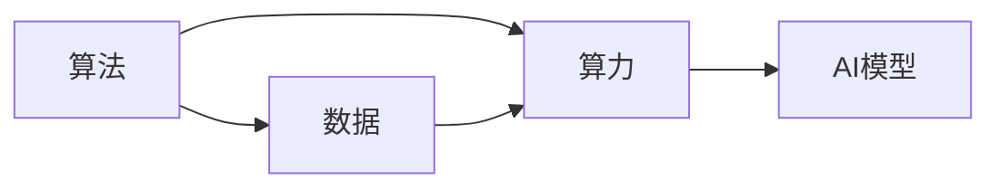
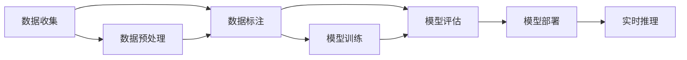

                 

# AI发展的三大支柱：算法、算力与数据

在人工智能（AI）的蓬勃发展中，算法、算力和数据被视为推动其进步的三个重要支柱。本文将深入探讨这三者的本质、它们之间的相互关系以及它们在AI领域中的具体应用和影响。通过理论分析和实际案例，我们旨在阐明这三者在构建智能系统和解决复杂问题的关键作用。

## 1. 背景介绍

人工智能的快速发展离不开技术基础设施的持续升级。算法、算力与数据作为AI的三大支柱，各自扮演着不同的角色。算法提供了AI系统如何处理和分析数据的规则和方法，算力则确保了这些算法能够高效运行，而数据则提供了学习与决策的基础。

### 1.1 算法

算法是AI的核心，它决定了AI系统如何进行逻辑推理、决策制定和问题解决。从简单的线性回归、逻辑回归到复杂的深度学习模型，算法的多样性为AI技术提供了强大的工具库。

### 1.2 算力

算力是AI系统能够快速处理大量数据并执行复杂计算的基础。随着硬件技术的进步，从传统的CPU到GPU、FPGA、TPU等专用硬件，算力已经成为AI发展的重要支撑。

### 1.3 数据

数据是AI系统的学习材料，其质量和数量直接决定了AI系统的性能。大量、高质量的数据是训练深度学习模型、进行复杂推理和决策的关键。

## 2. 核心概念与联系

### 2.1 核心概念概述

- **算法**：指用于解决问题、执行任务、优化决策的一系列规则和方法。
- **算力**：指执行计算任务的能力，包括硬件和软件两部分。
- **数据**：指用于训练、测试和评估AI模型的输入，通常为结构化或非结构化形式。

### 2.2 核心概念的相互关系

通过以下Mermaid流程图展示算法、算力和数据之间的相互关系：



在这个关系图中，算法是起点，它依赖于算力来执行，并最终利用数据进行训练和优化。AI模型是算力和算法的结合体，能够根据数据进行学习和推理。

### 2.3 核心概念的整体架构

在大规模应用中，算法、算力和数据需要综合考虑。以下综合Mermaid流程图展示了AI系统从数据收集、预处理、模型训练到应用部署的整体架构：



在这个流程中，数据收集和预处理是基础，模型训练和评估是核心，模型部署和实时推理是应用。

## 3. 核心算法原理 & 具体操作步骤

### 3.1 算法原理概述

算法是AI系统的灵魂，它决定了系统如何处理数据、进行决策和执行任务。在AI领域，常见的算法包括监督学习、非监督学习和强化学习等。

### 3.2 算法步骤详解

以监督学习为例，其基本步骤包括数据准备、模型选择、模型训练、模型评估和模型应用。

1. **数据准备**：收集和标注训练数据。
2. **模型选择**：选择适合任务的模型，如线性回归、决策树、神经网络等。
3. **模型训练**：使用训练数据训练模型，优化模型参数。
4. **模型评估**：使用验证数据评估模型性能，如准确率、召回率等。
5. **模型应用**：使用测试数据测试模型，并应用于实际场景。

### 3.3 算法优缺点

- **优点**：监督学习能够利用标注数据进行有效训练，适用于很多实际应用，如图像识别、自然语言处理等。
- **缺点**：需要大量标注数据，数据标注成本高，模型可能存在过拟合问题。

### 3.4 算法应用领域

算法在AI领域有广泛应用，包括但不限于：

- **计算机视觉**：图像分类、目标检测、人脸识别等。
- **自然语言处理**：文本分类、机器翻译、问答系统等。
- **语音识别**：语音转文本、语音合成等。
- **推荐系统**：商品推荐、个性化推荐等。

## 4. 数学模型和公式 & 详细讲解 & 举例说明

### 4.1 数学模型构建

以线性回归模型为例，其数学模型为：

$$
y = \theta_0 + \theta_1 x_1 + \theta_2 x_2 + \cdots + \theta_n x_n + \epsilon
$$

其中，$y$ 是目标变量，$x_i$ 是输入变量，$\theta_i$ 是模型参数，$\epsilon$ 是误差项。

### 4.2 公式推导过程

线性回归的目标是最小化误差项 $\epsilon$，常用的损失函数是均方误差（MSE）：

$$
L = \frac{1}{2m} \sum_{i=1}^m (y_i - \hat{y_i})^2
$$

其中，$m$ 是样本数。通过梯度下降算法求解 $\theta$：

$$
\theta_j = \theta_j - \eta \frac{\partial L}{\partial \theta_j}
$$

### 4.3 案例分析与讲解

以房价预测为例，使用线性回归模型进行训练和预测。收集历史房价数据，进行特征工程，构建模型，训练和测试模型，最终实现房价预测。

## 5. 项目实践：代码实例和详细解释说明

### 5.1 开发环境搭建

搭建Python开发环境，安装必要的库，如NumPy、Pandas、scikit-learn等。

### 5.2 源代码详细实现

以下是一个简单的线性回归代码实现：

```python
import numpy as np
from sklearn.linear_model import LinearRegression
from sklearn.metrics import mean_squared_error

# 数据准备
X = np.array([[1, 2, 3], [4, 5, 6], [7, 8, 9]])
y = np.array([1, 2, 3])

# 模型训练
model = LinearRegression()
model.fit(X, y)

# 模型评估
y_pred = model.predict(X)
mse = mean_squared_error(y, y_pred)
print(f"Mean Squared Error: {mse}")

# 模型应用
new_X = np.array([[10, 11, 12]])
new_y_pred = model.predict(new_X)
print(f"Predicted Value: {new_y_pred}")
```

### 5.3 代码解读与分析

1. **数据准备**：收集输入变量 $X$ 和目标变量 $y$。
2. **模型训练**：使用线性回归模型进行训练。
3. **模型评估**：计算预测值与真实值之间的均方误差。
4. **模型应用**：使用新输入变量进行预测。

### 5.4 运行结果展示

输出均方误差（MSE）和预测值，展示模型的预测能力。

## 6. 实际应用场景

### 6.1 智能推荐系统

智能推荐系统是算法、算力和数据综合应用的重要领域。通过收集用户行为数据，使用协同过滤、内容推荐等算法，结合高效的计算资源，可以为用户提供个性化的推荐服务。

### 6.2 语音识别

语音识别技术在AI领域有着广泛应用，如智能助手、语音控制等。使用深度学习算法，结合高性能GPU和TPU等算力，可以显著提升语音识别的准确性和实时性。

### 6.3 图像识别

图像识别技术在安防、医疗、农业等领域有重要应用。通过卷积神经网络（CNN）等算法，结合强大的GPU和FPGA等算力，可以高效处理图像数据，实现精准识别。

### 6.4 未来应用展望

随着算力、算法和数据技术的不断进步，AI将在更多领域得到应用。例如：

- **自动驾驶**：结合计算机视觉、深度学习等算法，实现环境感知、决策制定等功能。
- **智慧城市**：利用大数据和AI算法，实现交通管理、公共安全、能源优化等。
- **医疗诊断**：通过图像处理、自然语言处理等算法，提升医疗诊断的准确性和效率。

## 7. 工具和资源推荐

### 7.1 学习资源推荐

- **《深度学习》（Ian Goodfellow 著）**：深度学习领域的经典教材，详细介绍了深度学习的基础理论和算法。
- **Coursera和edX**：在线学习平台，提供大量AI相关的课程和资源。
- **Kaggle**：数据科学竞赛平台，提供丰富的数据集和竞赛项目，有助于实践和应用。

### 7.2 开发工具推荐

- **Python**：AI开发的主流编程语言，拥有丰富的库和框架。
- **Jupyter Notebook**：支持代码、数学公式和文本混合编辑的开发环境，便于学习和分享。
- **PyTorch和TensorFlow**：流行的深度学习框架，支持高效模型训练和推理。

### 7.3 相关论文推荐

- **《Deep Learning》（Ian Goodfellow 著）**：深度学习领域的经典教材，详细介绍了深度学习的基础理论和算法。
- **《Reinforcement Learning: An Introduction》（Richard S. Sutton 和 Andrew G. Barto 著）**：强化学习领域的经典教材，介绍了强化学习的基本理论和算法。
- **《Natural Language Processing with PyTorch》（Erich Elhage 和 Thomas Viehmann 著）**：介绍如何使用PyTorch进行自然语言处理的教材。

## 8. 总结：未来发展趋势与挑战

### 8.1 研究成果总结

算力、算法和数据是推动AI发展的三大支柱。算法提供了解决问题的规则，算力确保了规则的高效执行，数据提供了学习的基础。这三者的协同作用，使得AI技术在多个领域实现了突破。

### 8.2 未来发展趋势

未来AI的发展将更加依赖于算力、算法和数据技术的持续进步。具体趋势包括：

- **算力持续升级**：随着硬件技术的不断进步，算力将更加高效和可靠。
- **算法更加复杂**：深度学习、强化学习等复杂算法将进一步发展，提供更强大的解决能力。
- **数据更加丰富**：随着互联网和物联网的普及，数据将更加丰富和多样化。

### 8.3 面临的挑战

尽管AI技术取得了显著进展，但在实际应用中仍面临诸多挑战，包括：

- **数据隐私和安全**：如何保护数据隐私，避免数据泄露和滥用。
- **算法透明性和可解释性**：如何提高算法的透明性和可解释性，增强用户信任。
- **模型鲁棒性**：如何在不同数据分布和环境条件下，确保模型的鲁棒性和泛化能力。

### 8.4 研究展望

未来AI技术的研究将更加注重算力、算法和数据的协同优化，提升系统的整体性能和应用效果。同时，将更加关注算法透明性和可解释性，确保技术的可信赖性和安全性。

## 9. 附录：常见问题与解答

### 9.1 常见问题

**Q1: 什么是深度学习？**

A: 深度学习是一种基于神经网络的机器学习方法，通过多层次的非线性变换，可以处理复杂的非结构化数据，如图像、文本和声音。

**Q2: 深度学习和传统机器学习的区别是什么？**

A: 深度学习通过多层神经网络自动学习特征表示，而传统机器学习需要手动设计特征提取器。深度学习通常需要大量标注数据和计算资源，但可以处理更复杂的问题。

**Q3: 如何选择合适的算法？**

A: 根据问题的类型和数据的特点选择合适的算法。例如，分类问题可以使用逻辑回归、支持向量机等，而回归问题可以使用线性回归、决策树等。

**Q4: 如何提高算法的性能？**

A: 通过优化模型参数、使用正则化、引入先验知识等方法，可以提升算法的性能。同时，选择合适的算力设备，如GPU、TPU等，可以加速算法训练和推理。

**Q5: 如何保护数据隐私？**

A: 使用数据加密、差分隐私、联邦学习等技术，保护数据隐私和安全。

---

作者：禅与计算机程序设计艺术 / Zen and the Art of Computer Programming

