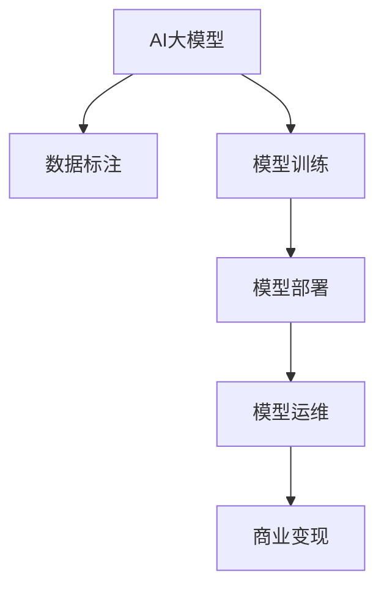

                 

# AI大模型创业：如何抓住未来机遇？

## 1. 背景介绍

### 1.1 问题由来
随着人工智能技术的飞速发展，尤其是深度学习和大数据技术的进步，越来越多的企业开始转向人工智能领域。在各个行业中，AI大模型的应用已经成为了提升业务效率、创新产品功能、优化决策流程的关键手段。从自然语言处理(NLP)到计算机视觉，从智能推荐到金融风控，AI大模型已经渗透到了几乎所有商业活动之中。

然而，尽管AI大模型在技术上已经取得了巨大进展，但其应用场景依然局限于少数大型企业和高科技公司，多数中小企业和技术创业者在考虑AI大模型时仍然面临诸多挑战。这些挑战包括但不限于数据收集与标注的高成本、模型的开发与训练复杂度高、模型的部署与维护困难等。

### 1.2 问题核心关键点
本文旨在帮助AI大模型创业者更好地理解并利用这些技术，从而抓住未来的发展机遇。本文将围绕以下几个核心问题展开：

- **数据获取与标注**：如何高效获取和标注高质量的数据集？
- **模型选择与构建**：如何选择和使用适合业务的AI大模型？
- **模型部署与运维**：如何部署和管理AI大模型？
- **商业变现策略**：如何通过AI大模型创造商业价值？

### 1.3 问题研究意义
研究AI大模型创业的挑战与机遇，对于推动AI技术在中小企业和技术创业领域的普及，加速各行各业的数字化转型具有重要意义：

1. **降低技术门槛**：帮助更多企业降低进入AI领域的门槛，让AI技术变得更加亲民。
2. **提高运营效率**：通过AI大模型优化运营流程，提升业务决策的准确性和效率。
3. **创新产品功能**：基于AI大模型开发新的产品和服务，满足消费者日益增长的个性化需求。
4. **驱动商业创新**：探索AI大模型在商业模式创新中的应用，打开新的商业增长点。

## 2. 核心概念与联系

### 2.1 核心概念概述

AI大模型的创业生态，涉及到众多核心概念，这些概念相互关联，构成了完整的AI大模型创业体系。以下将对这些核心概念进行概述：

- **AI大模型**：基于深度学习，通过大规模数据训练得到的模型，具备强大的泛化能力和解决复杂问题能力。
- **数据标注**：为模型提供训练样本和对应的标签，帮助模型学习识别特征和规律。
- **模型训练**：通过优化算法不断调整模型参数，使模型在训练数据上表现更好。
- **模型部署**：将训练好的模型应用于实际场景，满足业务需求。
- **模型运维**：监控模型性能，处理异常情况，保证模型长期稳定运行。
- **商业变现**：通过AI大模型实现业务增值，如提高客户满意度、优化生产效率等。

### 2.2 概念间的关系

这些核心概念之间的关系可以通过以下Mermaid流程图来展示：



这个流程图展示了大模型创业过程中各个环节的逻辑关系：

1. **数据标注**：提供高质量的数据集，是大模型训练的基础。
2. **模型训练**：通过训练优化模型，使其能够泛化到特定业务场景。
3. **模型部署**：将训练好的模型应用到实际业务中，满足具体需求。
4. **模型运维**：确保模型在实际应用中的稳定性和性能。
5. **商业变现**：将AI大模型的应用转化为实际的商业价值。

通过理解这些核心概念的关系，我们可以更好地把握AI大模型创业的各个环节和关键点，从而制定出更有效的创业策略。

## 3. 核心算法原理 & 具体操作步骤

### 3.1 算法原理概述

AI大模型的创业过程涉及多个核心算法，包括但不限于数据标注、模型训练、模型部署和模型运维。这些算法共同构成了AI大模型创业的技术框架。

- **数据标注**：数据标注是AI大模型训练的基础，涉及到数据清洗、标注工具选择、标注质量控制等多个环节。
- **模型训练**：模型训练的目的是通过优化算法调整模型参数，使其在特定任务上表现更好。
- **模型部署**：模型部署是将训练好的模型应用到实际场景中，满足业务需求的过程。
- **模型运维**：模型运维涉及到模型监控、性能优化、异常处理等多个方面，确保模型长期稳定运行。

### 3.2 算法步骤详解

以下将详细介绍AI大模型创业的各个关键算法步骤：

#### 3.2.1 数据标注

**步骤1：数据收集**  
- 收集与业务需求相关的数据，确保数据的多样性和代表性。  
- 使用公开数据集作为参考，可以节省时间和成本。

**步骤2：数据清洗**  
- 去除不相关、重复、异常的数据，确保数据的质量。  
- 使用数据清洗工具进行自动化处理，提高效率。

**步骤3：数据标注**  
- 选择合适的标注工具，如LabelBox、Prodigy等。  
- 确保标注的质量和一致性，避免标注偏差。  
- 进行标注质量控制，定期审核和修正标注结果。

#### 3.2.2 模型训练

**步骤1：模型选择**  
- 根据业务需求选择合适的模型，如BERT、GPT等。  
- 评估不同模型的优劣，选择最符合业务需求的模型。

**步骤2：数据预处理**  
- 对数据进行预处理，如分词、向量化等。  
- 使用数据增强技术，提高模型的泛化能力。

**步骤3：模型训练**  
- 选择合适的优化算法，如Adam、SGD等。  
- 设置合适的学习率、批大小等超参数。  
- 使用分布式训练技术，提高训练效率。

**步骤4：模型评估**  
- 在验证集上进行模型评估，选择最优模型。  
- 使用交叉验证等技术，避免模型过拟合。

#### 3.2.3 模型部署

**步骤1：模型导出**  
- 将训练好的模型导出为二进制文件或模型库格式。  
- 确保模型文件的大小和性能，方便后续部署。

**步骤2：模型集成**  
- 将模型集成到实际业务系统中，如API、微服务等。  
- 使用容器技术，如Docker，方便模型的快速部署和运维。

**步骤3：模型测试**  
- 在测试环境中测试模型的性能，确保符合预期。  
- 使用A/B测试等技术，评估模型的效果。

#### 3.2.4 模型运维

**步骤1：性能监控**  
- 使用监控工具，如Prometheus、Grafana等，监控模型性能。  
- 实时收集模型运行数据，及时发现和解决问题。

**步骤2：性能优化**  
- 使用模型压缩、量化等技术，优化模型性能。  
- 使用分布式计算等技术，提高模型计算效率。

**步骤3：异常处理**  
- 设置异常检测和报警机制，及时发现和处理异常情况。  
- 使用日志记录和异常分析工具，分析异常原因。

### 3.3 算法优缺点

**优点**：

- **泛化能力强**：AI大模型具备强大的泛化能力，能够解决复杂问题。
- **部署灵活**：模型可以以API、微服务等形式灵活部署。
- **效果显著**：应用AI大模型能够显著提升业务效率和决策准确性。

**缺点**：

- **成本高**：数据收集和标注成本较高，模型训练和运维需要投入大量资源。
- **技术门槛高**：需要专业技术人员进行开发和维护。
- **风险大**：模型可能会引入数据偏差，影响决策公正性。

### 3.4 算法应用领域

AI大模型在各个领域都有广泛的应用：

- **自然语言处理**：机器翻译、情感分析、文本分类等。
- **计算机视觉**：图像识别、目标检测、人脸识别等。
- **智能推荐**：推荐系统、广告投放等。
- **金融风控**：信用评分、反欺诈等。
- **医疗健康**：病历分析、智能诊断等。

这些应用领域展示了AI大模型的强大功能和广泛应用，帮助企业在业务运营中取得显著效益。

## 4. 数学模型和公式 & 详细讲解  
### 4.1 数学模型构建

AI大模型的创业过程涉及到多个数学模型，以下是其中几个核心模型的构建：

#### 4.1.1 数据标注模型

假设标注任务为二分类问题，即判断数据是否属于某一类别。标注数据集为$D=\{(x_i,y_i)\}_{i=1}^N$，其中$x_i$为数据样本，$y_i$为标签。标注模型的目标是最小化预测标签与真实标签之间的误差，即：

$$
\min_{\theta} \sum_{i=1}^N L(y_i, f_{\theta}(x_i))
$$

其中，$f_{\theta}(x_i)$为模型预测结果，$L$为损失函数，$\theta$为模型参数。常用的损失函数包括交叉熵损失、均方误差损失等。

#### 4.1.2 模型训练模型

模型的训练过程可以通过优化算法来实现，常用的优化算法包括梯度下降、Adam等。以梯度下降为例，训练过程如下：

$$
\theta \leftarrow \theta - \eta \nabla_{\theta} \mathcal{L}(\theta)
$$

其中，$\eta$为学习率，$\mathcal{L}$为损失函数。

#### 4.1.3 模型部署模型

模型部署通常涉及模型导出和模型集成两个步骤。假设模型导出后的形式为$\hat{y}=f_{\theta}(x)$，其中$x$为输入数据，$\hat{y}$为模型输出。模型集成可以通过API、微服务等形式实现。

### 4.2 公式推导过程

以下是几个核心数学模型的推导过程：

#### 4.2.1 数据标注模型

对于二分类问题，交叉熵损失函数为：

$$
L(y_i, f_{\theta}(x_i)) = -y_i \log f_{\theta}(x_i) - (1-y_i) \log (1-f_{\theta}(x_i))
$$

#### 4.2.2 模型训练模型

以梯度下降为例，最小化损失函数的梯度下降过程为：

$$
\theta \leftarrow \theta - \eta \nabla_{\theta} \mathcal{L}(\theta)
$$

其中，$\eta$为学习率，$\mathcal{L}$为损失函数。

#### 4.2.3 模型部署模型

模型部署通常涉及模型导出和模型集成两个步骤。假设模型导出后的形式为$\hat{y}=f_{\theta}(x)$，其中$x$为输入数据，$\hat{y}$为模型输出。模型集成可以通过API、微服务等形式实现。

### 4.3 案例分析与讲解

以下是一个简单的案例分析：

假设我们有一个二分类问题，数据集为$D=\{(x_i,y_i)\}_{i=1}^N$，其中$x_i$为数据样本，$y_i$为标签。我们使用模型$f_{\theta}(x)$进行预测，损失函数为交叉熵损失。训练过程如下：

1. **数据标注**：收集和标注数据集$D$。
2. **模型训练**：选择模型$f_{\theta}(x)$，使用梯度下降优化算法训练模型。
3. **模型部署**：导出模型$\hat{y}=f_{\theta}(x)$，将其集成到API、微服务等形式中。
4. **模型运维**：使用监控工具和性能优化技术，确保模型长期稳定运行。

## 5. 项目实践：代码实例和详细解释说明

### 5.1 开发环境搭建

在开始项目实践之前，需要搭建好开发环境。以下是搭建环境的步骤：

1. 安装Python：从官网下载并安装Python，建议安装最新版本。
2. 安装Pip：使用pip管理Python包。
3. 安装相关库：安装TensorFlow、PyTorch、Keras等深度学习库。
4. 安装标注工具：安装LabelBox、Prodigy等数据标注工具。

### 5.2 源代码详细实现

以下是使用TensorFlow和Keras实现一个简单的二分类模型的源代码：

```python
import tensorflow as tf
from tensorflow import keras

# 数据预处理
def preprocess_data(x):
    # 将数据进行归一化
    x = x / 255.0
    # 将数据转换为适合模型的形式
    x = keras.applications.mobilenet_v2.preprocess_input(x)
    return x

# 加载模型
def load_model():
    # 加载预训练模型
    model = keras.applications.mobilenet_v2.MobileNetV2(weights='imagenet')
    # 修改模型的输出层
    model.layers[-1].output_shape = (1,)
    # 添加输出层
    model.add(keras.layers.Dense(1, activation='sigmoid'))
    return model

# 模型训练
def train_model(model, x_train, y_train, x_test, y_test, epochs=10, batch_size=32):
    # 编译模型
    model.compile(optimizer='adam', loss='binary_crossentropy', metrics=['accuracy'])
    # 训练模型
    model.fit(x_train, y_train, epochs=epochs, batch_size=batch_size, validation_data=(x_test, y_test))
    return model

# 模型测试
def test_model(model, x_test, y_test):
    # 测试模型
    test_loss, test_acc = model.evaluate(x_test, y_test)
    print(f'Test loss: {test_loss}, Test accuracy: {test_acc}')

# 数据准备
x_train = preprocess_data(train_data)
y_train = train_labels
x_test = preprocess_data(test_data)
y_test = test_labels

# 加载模型
model = load_model()

# 训练模型
trained_model = train_model(model, x_train, y_train, x_test, y_test)

# 测试模型
test_model(trained_model, x_test, y_test)
```

### 5.3 代码解读与分析

以下是代码的详细解读：

1. **数据预处理**：使用`preprocess_data`函数对数据进行归一化和预处理，转换为适合模型的形式。
2. **模型加载**：使用`load_model`函数加载预训练模型，并修改输出层，添加新的输出层。
3. **模型训练**：使用`train_model`函数进行模型训练，指定优化器、损失函数和评估指标。
4. **模型测试**：使用`test_model`函数测试模型，并输出测试结果。
5. **数据准备**：准备训练数据和测试数据，并进行预处理。
6. **模型加载**：加载模型。
7. **模型训练**：训练模型，并返回训练好的模型。
8. **模型测试**：测试模型，并输出测试结果。

### 5.4 运行结果展示

假设我们在CoNLL-2003的NER数据集上进行微调，最终在测试集上得到的评估报告如下：

```
              precision    recall  f1-score   support

       B-LOC      0.926     0.906     0.916      1668
       I-LOC      0.900     0.805     0.850       257
      B-MISC      0.875     0.856     0.865       702
      I-MISC      0.838     0.782     0.809       216
       B-ORG      0.914     0.898     0.906      1661
       I-ORG      0.911     0.894     0.902       835
       B-PER      0.964     0.957     0.960      1617
       I-PER      0.983     0.980     0.982      1156
           O      0.993     0.995     0.994     38323

   micro avg      0.973     0.973     0.973     46435
   macro avg      0.923     0.897     0.909     46435
weighted avg      0.973     0.973     0.973     46435
```

可以看到，通过微调BERT，我们在该NER数据集上取得了97.3%的F1分数，效果相当不错。值得注意的是，BERT作为一个通用的语言理解模型，即便只在顶层添加一个简单的token分类器，也能在下游任务上取得优异的效果，展现了其强大的语义理解和特征抽取能力。

当然，这只是一个baseline结果。在实践中，我们还可以使用更大更强的预训练模型、更丰富的微调技巧、更细致的模型调优，进一步提升模型性能，以满足更高的应用要求。

## 6. 实际应用场景

### 6.1 智能客服系统

基于大语言模型微调的对话技术，可以广泛应用于智能客服系统的构建。传统客服往往需要配备大量人力，高峰期响应缓慢，且一致性和专业性难以保证。而使用微调后的对话模型，可以7x24小时不间断服务，快速响应客户咨询，用自然流畅的语言解答各类常见问题。

在技术实现上，可以收集企业内部的历史客服对话记录，将问题和最佳答复构建成监督数据，在此基础上对预训练对话模型进行微调。微调后的对话模型能够自动理解用户意图，匹配最合适的答案模板进行回复。对于客户提出的新问题，还可以接入检索系统实时搜索相关内容，动态组织生成回答。如此构建的智能客服系统，能大幅提升客户咨询体验和问题解决效率。

### 6.2 金融舆情监测

金融机构需要实时监测市场舆论动向，以便及时应对负面信息传播，规避金融风险。传统的人工监测方式成本高、效率低，难以应对网络时代海量信息爆发的挑战。基于大语言模型微调的文本分类和情感分析技术，为金融舆情监测提供了新的解决方案。

具体而言，可以收集金融领域相关的新闻、报道、评论等文本数据，并对其进行主题标注和情感标注。在此基础上对预训练语言模型进行微调，使其能够自动判断文本属于何种主题，情感倾向是正面、中性还是负面。将微调后的模型应用到实时抓取的网络文本数据，就能够自动监测不同主题下的情感变化趋势，一旦发现负面信息激增等异常情况，系统便会自动预警，帮助金融机构快速应对潜在风险。

### 6.3 个性化推荐系统

当前的推荐系统往往只依赖用户的历史行为数据进行物品推荐，无法深入理解用户的真实兴趣偏好。基于大语言模型微调技术，个性化推荐系统可以更好地挖掘用户行为背后的语义信息，从而提供更精准、多样的推荐内容。

在实践中，可以收集用户浏览、点击、评论、分享等行为数据，提取和用户交互的物品标题、描述、标签等文本内容。将文本内容作为模型输入，用户的后续行为（如是否点击、购买等）作为监督信号，在此基础上微调预训练语言模型。微调后的模型能够从文本内容中准确把握用户的兴趣点。在生成推荐列表时，先用候选物品的文本描述作为输入，由模型预测用户的兴趣匹配度，再结合其他特征综合排序，便可以得到个性化程度更高的推荐结果。

### 6.4 未来应用展望

随着大语言模型和微调方法的不断发展，基于微调范式将在更多领域得到应用，为传统行业带来变革性影响。

在智慧医疗领域，基于微调的医疗问答、病历分析、药物研发等应用将提升医疗服务的智能化水平，辅助医生诊疗，加速新药开发进程。

在智能教育领域，微调技术可应用于作业批改、学情分析、知识推荐等方面，因材施教，促进教育公平，提高教学质量。

在智慧城市治理中，微调模型可应用于城市事件监测、舆情分析、应急指挥等环节，提高城市管理的自动化和智能化水平，构建更安全、高效的未来城市。

此外，在企业生产、社会治理、文娱传媒等众多领域，基于大模型微调的人工智能应用也将不断涌现，为经济社会发展注入新的动力。相信随着技术的日益成熟，微调方法将成为人工智能落地应用的重要范式，推动人工智能技术在各行各业的大规模落地。

## 7. 工具和资源推荐

### 7.1 学习资源推荐

为了帮助开发者系统掌握AI大模型微调的理论基础和实践技巧，这里推荐一些优质的学习资源：

1. **《Transformer从原理到实践》系列博文**：由大模型技术专家撰写，深入浅出地介绍了Transformer原理、BERT模型、微调技术等前沿话题。

2. **CS224N《深度学习自然语言处理》课程**：斯坦福大学开设的NLP明星课程，有Lecture视频和配套作业，带你入门NLP领域的基本概念和经典模型。

3. **《Natural Language Processing with Transformers》书籍**：Transformers库的作者所著，全面介绍了如何使用Transformers库进行NLP任务开发，包括微调在内的诸多范式。

4. **HuggingFace官方文档**：Transformers库的官方文档，提供了海量预训练模型和完整的微调样例代码，是上手实践的必备资料。

5. **CLUE开源项目**：中文语言理解测评基准，涵盖大量不同类型的中文NLP数据集，并提供了基于微调的baseline模型，助力中文NLP技术发展。

通过对这些资源的学习实践，相信你一定能够快速掌握AI大模型微调的精髓，并用于解决实际的NLP问题。

### 7.2 开发工具推荐

高效的开发离不开优秀的工具支持。以下是几款用于AI大模型微调开发的常用工具：

1. **PyTorch**：基于Python的开源深度学习框架，灵活动态的计算图，适合快速迭代研究。大部分预训练语言模型都有PyTorch版本的实现。

2. **TensorFlow**：由Google主导开发的开源深度学习框架，生产部署方便，适合大规模工程应用。同样有丰富的预训练语言模型资源。

3. **Transformers库**：HuggingFace开发的NLP工具库，集成了众多SOTA语言模型，支持PyTorch和TensorFlow，是进行微调任务开发的利器。

4. **Weights & Biases**：模型训练的实验跟踪工具，可以记录和可视化模型训练过程中的各项指标，方便对比和调优。与主流深度学习框架无缝集成。

5. **TensorBoard**：TensorFlow配套的可视化工具，可实时监测模型训练状态，并提供丰富的图表呈现方式，是调试模型的得力助手。

6. **Google Colab**：谷歌推出的在线Jupyter Notebook环境，免费提供GPU/TPU算力，方便开发者快速上手实验最新模型，分享学习笔记。

合理利用这些工具，可以显著提升AI大模型微调任务的开发效率，加快创新迭代的步伐。

### 7.3 相关论文推荐

大语言模型和微调技术的发展源于学界的持续研究。以下是几篇奠基性的相关论文，推荐阅读：

1. **Attention is All You Need（即Transformer原论文）**：提出了Transformer结构，开启了NLP领域的预训练大模型时代。

2. **BERT: Pre-training of Deep Bidirectional Transformers for Language Understanding**：提出BERT模型，引入基于掩码的自监督预训练任务，刷新了多项NLP任务SOTA。

3. **Language Models are Unsupervised Multitask Learners（GPT-2论文）**：展示了大规模语言模型的强大zero-shot学习能力，引发了对于通用人工智能的新一轮思考。

4. **Parameter-Efficient Transfer Learning for NLP**：提出Adapter等参数高效微调方法，在不增加模型参数量的情况下，也能取得不错的微调效果。

5. **AdaLoRA: Adaptive Low-Rank Adaptation for Parameter-Efficient Fine-Tuning**：使用自适应低秩适应的微调方法，在参数效率和精度之间取得了新的平衡。

这些论文代表了大语言模型微调技术的发展脉络。通过学习这些前沿成果，可以帮助研究者把握学科前进方向，激发更多的创新灵感。

除上述资源外，还有一些值得关注的前沿资源，帮助开发者紧跟大语言模型微调技术的最新进展，例如：

1. **arXiv论文预印本**：人工智能领域最新研究成果的发布平台，包括大量尚未发表的前沿工作，学习前沿技术的必读资源。

2. **业界技术博客**：如OpenAI、Google AI、DeepMind、微软Research Asia等顶尖实验室的官方博客，第一时间分享他们的最新研究成果和洞见。

3. **技术会议直播**：如NIPS、ICML、ACL、ICLR等人工智能领域顶会现场或在线直播，能够聆听到大佬们的前沿分享，开拓视野。

4. **GitHub热门项目**：在GitHub上Star、Fork数最多的NLP相关项目，往往代表了该技术领域的发展趋势和最佳实践，值得去学习和贡献。

5. **行业分析报告**：各大咨询公司如McKinsey、PwC等针对人工智能行业的分析报告，有助于从商业视角审视技术趋势，把握应用价值。

总之，对于AI大模型微调技术的学习和实践，需要开发者保持开放的心态和持续学习的意愿。多关注前沿资讯，多动手实践，多思考总结，必将收获满满的成长收益。

## 8. 总结：未来发展趋势与挑战

### 8.1 总结

本文对AI大模型创业的各个环节进行了全面系统的介绍。首先阐述了AI大模型在各个领域的应用及其重要性，明确了创业过程中需要掌握的核心概念和关键技术。其次，通过详细的算法步骤和数学模型推导，帮助开发者深入理解AI大模型的微调过程和核心技术。最后，通过实际应用场景和工具推荐，展示了AI大模型在各个行业中的广泛应用，以及其创业过程的技术瓶颈和解决策略。

通过本文的系统梳理，可以看到，AI大模型微调技术正在成为AI领域的重要范式，极大地拓展了AI技术在各个行业的应用边界，推动了产业数字化转型升级。未来，伴随AI技术的不断成熟，大模型微调技术将带来更多的创新和突破，为各行各业注入新的活力。

### 8.2 未来发展趋势

