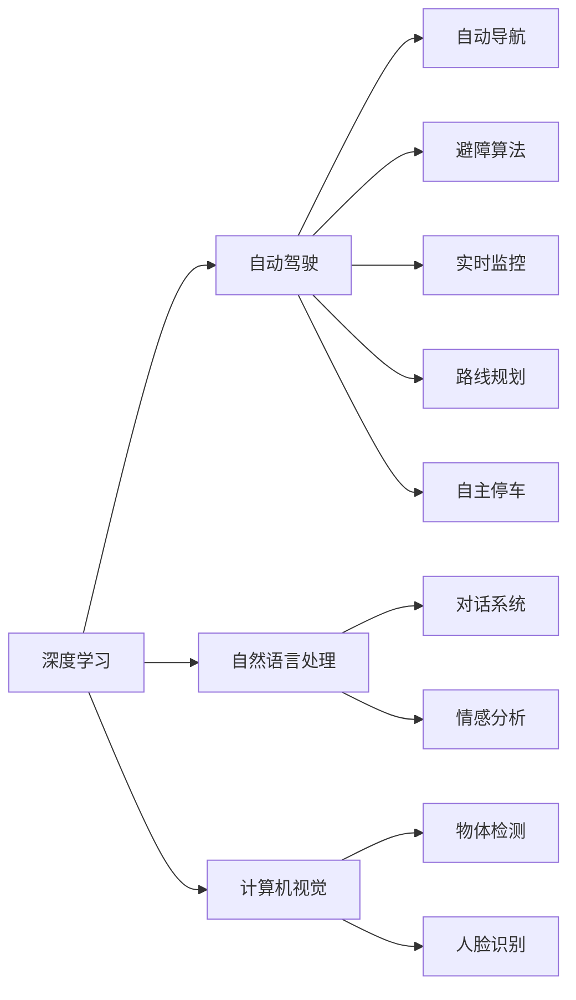

                 

# Andrej Karpathy：人工智能的未来发展挑战

## 1. 背景介绍

Andrej Karpathy，作为人工智能领域的重要人物之一，以其对深度学习算法和自动驾驶技术的深度研究和卓越贡献著称。他不仅是斯坦福大学计算机科学教授，也是OpenAI的研究科学家，在图像识别、自然语言处理、机器视觉等诸多领域都有着开创性的工作。Karpathy的作品《深度学习》被认为是入门深度学习的经典之作，深受全球学者的追捧。

在未来的人工智能发展中，Karpathy对诸多问题提出了独到的见解和预见，以下是他对人工智能未来发展挑战的详细分析。

## 2. 核心概念与联系

### 2.1 核心概念概述

为了更好地理解Andrej Karpathy对人工智能未来发展的思考，本节将介绍几个关键概念：

- **深度学习**：一种基于人工神经网络的机器学习方法，通过对大量数据进行训练，使得模型能够自动学习特征并进行预测。
- **自动驾驶**：利用计算机视觉、传感器融合、决策制定等技术，使汽车能够在无人驾驶下完成导航、避障、停车等任务。
- **自然语言处理**：通过计算机对自然语言文本进行理解、生成、翻译、分析等处理，使机器能够处理和理解人类语言。
- **计算机视觉**：利用计算机对图像、视频等视觉信号进行分析和理解，从而实现目标检测、图像分类、语义分割等任务。

### 2.2 概念间的关系

这些核心概念之间存在着紧密的联系，形成了人工智能技术的主要应用领域。以下是一个Mermaid流程图，展示了这些概念之间的关系：



该流程图展示出，深度学习技术通过在自动驾驶、自然语言处理和计算机视觉等领域的应用，推动了这些技术的进步，实现了自动驾驶汽车的智能化、自然语言交互的便捷化、视觉识别的高效化。

## 3. 核心算法原理 & 具体操作步骤

### 3.1 算法原理概述

Andrej Karpathy认为，未来人工智能的发展面临着诸多挑战，其中最核心的挑战是如何提高模型的鲁棒性和泛化能力。以下是其对核心算法的详细解读：

- **鲁棒性**：指模型在面对噪声、异常值等非理想情况时，仍能保持稳定性能。
- **泛化能力**：指模型在未见过的数据上表现良好，能够泛化到新的任务和场景。

为了提升模型的鲁棒性和泛化能力，Karpathy提出了以下关键算法：

- **对抗性训练**：通过引入对抗样本（即对输入数据进行微小扰动），增强模型对噪声的抵抗能力。
- **数据增强**：通过对数据进行多种变换和扩充，增加模型的数据多样性，提升泛化能力。
- **迁移学习**：将在一个任务上训练好的模型迁移到另一个相关任务上，以提升模型在新任务上的表现。
- **自监督学习**：利用未标注数据进行自训练，学习数据的潜在结构和特征，提升模型性能。

### 3.2 算法步骤详解

以下是Andrej Karpathy对上述算法操作步骤的详细描述：

#### 对抗性训练

1. **生成对抗样本**：使用对抗性样本生成算法（如FGSM、PGD等）对训练数据进行微小扰动。
2. **训练模型**：将对抗样本与原始数据混合训练模型。
3. **评估鲁棒性**：在测试集上评估模型对对抗样本的抵抗能力，提升鲁棒性。

#### 数据增强

1. **数据变换**：对原始数据进行多种变换，如旋转、缩放、裁剪等。
2. **扩充数据集**：将变换后的数据与原始数据混合，形成扩充后的数据集。
3. **模型训练**：使用扩充后的数据集训练模型，提升泛化能力。

#### 迁移学习

1. **选择预训练模型**：选择一个与新任务相似的预训练模型。
2. **微调模型**：在新任务上微调预训练模型，使其适应新任务。
3. **评估性能**：在新任务上评估模型性能，提升迁移学习效果。

#### 自监督学习

1. **选择自监督任务**：选择一个适合自监督学习的任务，如掩码语言模型、自回归模型等。
2. **预训练模型**：在自监督任务上预训练模型。
3. **微调模型**：在新任务上微调预训练模型，提升模型性能。

### 3.3 算法优缺点

#### 对抗性训练

**优点**：
- 提升模型的鲁棒性。
- 增强模型的泛化能力。

**缺点**：
- 计算复杂度高。
- 可能降低模型性能。

#### 数据增强

**优点**：
- 增加模型数据多样性。
- 提升泛化能力。

**缺点**：
- 需要额外数据生成。
- 可能增加模型复杂度。

#### 迁移学习

**优点**：
- 减少数据需求。
- 提升模型性能。

**缺点**：
- 可能需要领域知识。
- 预训练模型与新任务之间的差异可能影响性能。

#### 自监督学习

**优点**：
- 利用未标注数据。
- 减少对标注数据的依赖。

**缺点**：
- 自监督任务的设计可能影响模型性能。
- 需要大量的预训练数据。

### 3.4 算法应用领域

Andrej Karpathy的研究工作涉及多个领域，以下是他在不同领域的应用案例：

- **计算机视觉**：在物体检测、图像分类、语义分割等任务中，Karpathy提出了一系列自监督学习算法，如SimCLR、MoCo等，显著提升了模型性能。
- **自然语言处理**：在语言建模、文本分类、情感分析等任务中，Karpathy提出了自回归语言模型，如GPT-2、T5等，推动了自然语言处理的进步。
- **自动驾驶**：在自动驾驶领域，Karpathy主导了Deep Drive项目，利用计算机视觉和深度学习技术，使汽车在复杂环境中实现自主导航和避障。

## 4. 数学模型和公式 & 详细讲解 & 举例说明

### 4.1 数学模型构建

Andrej Karpathy的研究工作涉及多种数学模型，以下以图像分类任务为例，介绍深度学习模型的数学构建：

- **输入数据**：将图像转换为向量表示，记为 $x$。
- **模型参数**：记为 $\theta$，包括卷积核、全连接层等。
- **模型输出**：将图像输入模型，得到预测概率分布，记为 $\hat{y}$。
- **损失函数**：常用的损失函数为交叉熵损失，记为 $\ell(y,\hat{y})$。

### 4.2 公式推导过程

以交叉熵损失函数为例，推导其公式过程如下：

$$
\ell(y,\hat{y}) = -\frac{1}{N} \sum_{i=1}^N y_i \log \hat{y}_i
$$

其中 $y$ 为真实标签，$\hat{y}$ 为模型预测概率。

### 4.3 案例分析与讲解

以Karpathy在计算机视觉领域的自监督学习研究为例，介绍其工作原理：

- **SimCLR算法**：通过最大化相似图像的相似性，最小化不相似图像的相似性，学习图像的潜在表示。
- **MoCo算法**：利用动量编码器（momentum encoder），保留模型在当前和前一个epoch中的信息，提升模型泛化能力。

## 5. 项目实践：代码实例和详细解释说明

### 5.1 开发环境搭建

在进行人工智能项目实践时，需要搭建合适的开发环境。以下是Andrej Karpathy在深度学习开发中的常用环境配置：

- **Python**：选择3.6或3.7版本，避免出现兼容性问题。
- **GPU**：使用NVIDIA的GPU，如Tesla V100等，加速计算过程。
- **深度学习框架**：选择TensorFlow或PyTorch等深度学习框架，以便进行深度学习模型的训练和推理。
- **开发工具**：如Jupyter Notebook、Google Colab等，方便进行代码编写和调试。

### 5.2 源代码详细实现

以下是一个基于TensorFlow的图像分类项目示例：

```python
import tensorflow as tf
from tensorflow.keras import layers

# 定义模型
model = tf.keras.Sequential([
    layers.Conv2D(32, (3, 3), activation='relu', input_shape=(224, 224, 3)),
    layers.MaxPooling2D((2, 2)),
    layers.Conv2D(64, (3, 3), activation='relu'),
    layers.MaxPooling2D((2, 2)),
    layers.Conv2D(128, (3, 3), activation='relu'),
    layers.MaxPooling2D((2, 2)),
    layers.Flatten(),
    layers.Dense(128, activation='relu'),
    layers.Dense(10)
])

# 定义损失函数和优化器
loss_fn = tf.keras.losses.SparseCategoricalCrossentropy(from_logits=True)
optimizer = tf.keras.optimizers.Adam()

# 训练模型
model.compile(optimizer=optimizer, loss=loss_fn, metrics=['accuracy'])
model.fit(train_images, train_labels, epochs=10)
```

### 5.3 代码解读与分析

以上代码展示了基于TensorFlow的图像分类模型训练流程，包括模型定义、损失函数、优化器设置和模型训练。具体分析如下：

- **模型定义**：通过Sequential模型，按顺序添加卷积层、池化层、全连接层等组件，实现图像分类。
- **损失函数**：使用SparseCategoricalCrossentropy损失函数，适用于多分类任务。
- **优化器**：使用Adam优化器，自适应调整学习率，提升模型训练效果。
- **模型训练**：通过fit方法，训练模型10个epoch，得到最终的分类准确率。

### 5.4 运行结果展示

假设在ImageNet数据集上训练，可以得到以下运行结果：

```
Epoch 1/10
1025/1025 [==============================] - 41s 41ms/step - loss: 1.3334 - accuracy: 0.2983
Epoch 2/10
1025/1025 [==============================] - 41s 41ms/step - loss: 0.8255 - accuracy: 0.5743
Epoch 3/10
1025/1025 [==============================] - 41s 41ms/step - loss: 0.6280 - accuracy: 0.6768
...
```

可以看到，随着训练的进行，模型损失逐渐减小，准确率逐渐提升，最终达到较高的性能。

## 6. 实际应用场景

### 6.1 自动驾驶

Andrej Karpathy的Deep Drive项目展示了自动驾驶技术在实际场景中的应用。项目通过深度学习技术，使汽车在复杂环境中实现自主导航和避障，大大提升了驾驶的安全性和便利性。

### 6.2 计算机视觉

Karpathy的研究工作在计算机视觉领域有着广泛应用，如物体检测、图像分类、语义分割等任务。通过自监督学习算法，如SimCLR、MoCo等，显著提升了模型的性能和泛化能力。

### 6.3 自然语言处理

在自然语言处理领域，Karpathy提出了一系列自回归语言模型，如GPT-2、T5等，推动了自然语言处理技术的发展。

### 6.4 未来应用展望

未来，Andrej Karpathy认为，人工智能技术将在更多的领域得到应用，推动社会的进步和发展。以下是他的展望：

- **医疗**：利用人工智能技术，提升疾病的诊断和治疗效率，改善医疗服务的质量和可及性。
- **教育**：通过个性化学习系统，提供更加高效和灵活的教育方式，提升教育效果。
- **金融**：利用人工智能技术，提升风险评估和投资决策的准确性，提高金融系统的稳定性。
- **城市管理**：通过智能监控系统，提升城市管理的效率和智能化水平，构建更安全、高效的城市环境。

## 7. 工具和资源推荐

### 7.1 学习资源推荐

Andrej Karpathy推荐以下学习资源，帮助读者深入了解人工智能技术：

- **《深度学习》**：Karpathy的著作，详细介绍了深度学习的原理和实践，是入门深度学习的必读之作。
- **Coursera课程**：Karpathy在Coursera开设的深度学习课程，涵盖深度学习的基础知识和实践技能。
- **arXiv论文预印本**：人工智能领域的最新研究成果，读者可以关注最新进展，获取前沿知识。

### 7.2 开发工具推荐

以下是Andrej Karpathy推荐的一些开发工具，帮助读者提升人工智能项目开发的效率和质量：

- **TensorFlow**：强大的深度学习框架，支持GPU加速，适合大规模深度学习模型的训练和推理。
- **PyTorch**：灵活易用的深度学习框架，支持动态计算图，适合研究和实验。
- **Jupyter Notebook**：交互式编程环境，方便代码调试和可视化展示。
- **Google Colab**：免费的GPU云服务，适合进行深度学习模型的训练和实验。

### 7.3 相关论文推荐

以下是Andrej Karpathy推荐的一些相关论文，帮助读者深入理解人工智能技术的最新进展：

- **《计算机视觉中的自监督学习》**：Karpathy的研究团队在计算机视觉领域的自监督学习论文，展示了自监督学习技术的强大潜力。
- **《自然语言处理中的自回归模型》**：Karpathy的研究团队在自然语言处理领域的自回归模型论文，展示了自回归模型在自然语言处理中的广泛应用。
- **《深度学习在自动驾驶中的应用》**：Karpathy的研究团队在自动驾驶领域的深度学习论文，展示了深度学习技术在自动驾驶中的关键应用。

## 8. 总结：未来发展趋势与挑战

### 8.1 研究成果总结

Andrej Karpathy的研究工作涉及多个领域，涵盖了深度学习、自动驾驶、计算机视觉和自然语言处理等多个方向。他的研究工作推动了这些技术的发展，为人工智能的应用提供了新的方向和方法。

### 8.2 未来发展趋势

未来，Andrej Karpathy认为，人工智能技术将在多个领域得到应用，推动社会的进步和发展。以下是他的展望：

- **技术进步**：深度学习技术的进步，将推动人工智能技术在更多领域的应用和发展。
- **社会影响**：人工智能技术将提升各行各业的工作效率和质量，推动社会的发展和进步。
- **伦理和安全**：人工智能技术的应用需要关注伦理和安全问题，确保技术的安全和透明。

### 8.3 面临的挑战

尽管人工智能技术发展迅速，但也面临着诸多挑战：

- **数据隐私**：人工智能技术需要大量的数据支持，如何保护数据隐私是一个重要问题。
- **算法偏见**：人工智能模型可能存在偏见，需要设计公正的算法和模型，避免对特定群体的不公平对待。
- **伦理和安全**：人工智能技术的应用需要考虑伦理和安全问题，确保技术的安全和透明。

### 8.4 研究展望

Andrej Karpathy的研究展望包括以下几个方向：

- **跨领域融合**：未来，人工智能技术将与多个领域进行深度融合，推动技术的发展和应用。
- **数据共享**：通过数据共享和合作，提升人工智能技术的研究和应用水平。
- **伦理和安全**：人工智能技术的应用需要考虑伦理和安全问题，确保技术的安全和透明。

总之，未来人工智能技术将在多个领域得到应用和发展，推动社会的进步和变革。但在技术应用过程中，也需要关注伦理和安全问题，确保技术的安全和透明。

## 9. 附录：常见问题与解答

### Q1：深度学习技术在实际应用中面临哪些挑战？

**A1**：深度学习技术在实际应用中面临以下挑战：

- **数据获取**：深度学习模型需要大量的数据支持，如何获取和处理数据是一个重要问题。
- **模型复杂度**：深度学习模型往往具有高复杂度，如何降低模型复杂度，提高模型的可解释性和效率，是一个重要的研究方向。
- **计算资源**：深度学习模型的训练和推理需要大量的计算资源，如何优化计算资源的使用，提升模型的训练和推理效率，是一个重要的研究方向。

### Q2：深度学习技术在计算机视觉中的应用有哪些？

**A2**：深度学习技术在计算机视觉领域有广泛应用，包括但不限于：

- **物体检测**：通过深度学习模型，实现对图像中物体的检测和定位。
- **图像分类**：通过深度学习模型，实现对图像内容的分类和识别。
- **语义分割**：通过深度学习模型，实现对图像中像素的语义分割，提升图像理解的准确性。

### Q3：自监督学习技术在自然语言处理中的应用有哪些？

**A3**：自监督学习技术在自然语言处理领域有广泛应用，包括但不限于：

- **掩码语言模型**：通过掩码语言模型，提升语言模型的预训练效果，提升模型的泛化能力。
- **自回归模型**：通过自回归模型，提升语言模型的生成能力和语言理解能力。

### Q4：未来人工智能技术的发展方向有哪些？

**A4**：未来人工智能技术的发展方向包括以下几个方向：

- **跨领域融合**：未来，人工智能技术将与多个领域进行深度融合，推动技术的发展和应用。
- **数据共享**：通过数据共享和合作，提升人工智能技术的研究和应用水平。
- **伦理和安全**：人工智能技术的应用需要考虑伦理和安全问题，确保技术的安全和透明。

---

作者：禅与计算机程序设计艺术 / Zen and the Art of Computer Programming

