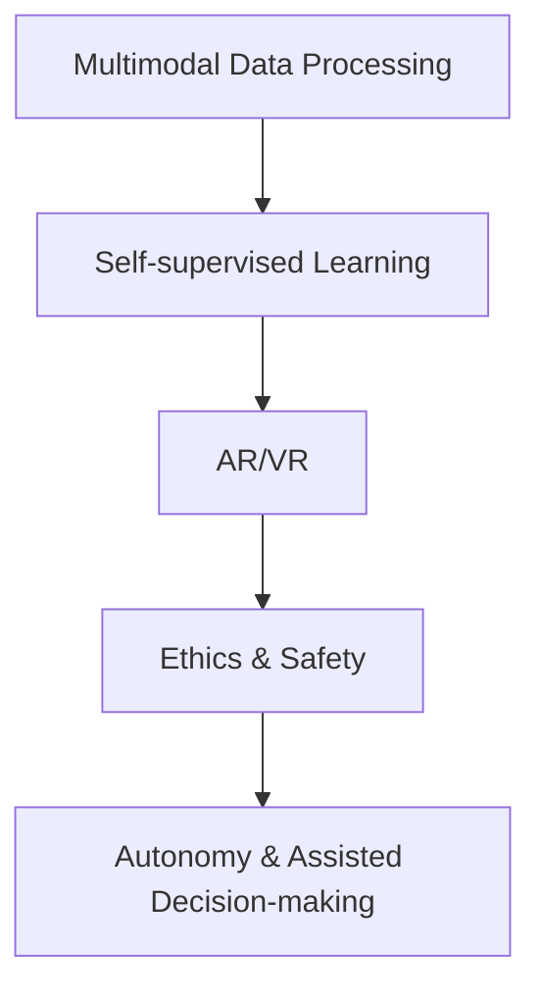

                 

# Andrej Karpathy：人工智能的未来发展机遇

## 1. 背景介绍

### 1.1 问题由来

Andrej Karpathy，作为人工智能领域的先驱和顶级专家，一直以来在深度学习、计算机视觉、自动驾驶等多个领域做出了重要贡献。他不仅是Google AI、MIT的知名学者，同时也是OpenAI的创始成员之一。Karpathy的研究和应用，不仅极大地推动了人工智能技术的发展，也对未来的人工智能方向提出了深刻洞见。

当前，人工智能正处于快速发展的阶段，各类新兴技术不断涌现，应用场景也在不断拓展。在数据、算法、计算资源等各方面取得突破性进展的背景下，人工智能的未来发展充满了机遇与挑战。然而，人工智能的发展路径应如何走向，其应用前景又将如何展现，这些关键问题引发了广泛的关注和讨论。在此背景下，本文将深入探讨Andrej Karpathy关于人工智能未来发展的独到见解和预测，以期对读者提供有价值的参考和思考。

### 1.2 问题核心关键点

Andrej Karpathy对于人工智能的未来发展提出了多个关键点，主要包括：

1. **多模态融合与跨领域应用**：人工智能应能够处理和理解多模态数据，包括文本、图像、声音等，并跨领域应用于医疗、教育、金融等领域。

2. **增强现实与虚拟现实**：未来的人工智能将更多地应用于增强现实（AR）和虚拟现实（VR）技术，提升用户体验和交互质量。

3. **自监督学习与自主性**：AI应通过自监督学习实现自主性，即在缺乏标注数据的情况下，通过自身探索和学习，提高模型的泛化能力和适应性。

4. **伦理与安全**：人工智能的开发与应用必须考虑伦理和安全问题，确保技术进步不带来负面的社会影响。

5. **自动化与辅助决策**：AI应更多地发挥辅助决策的作用，尤其是在医疗、交通等领域，避免完全依赖AI进行决策。

这些关键点构成了Karpathy对人工智能未来发展的基本框架，同时也预示了未来人工智能技术发展的方向。通过对其观点的分析，我们可以更好地理解人工智能的潜在机遇和挑战。

## 2. 核心概念与联系

### 2.1 核心概念概述

在探讨人工智能的未来发展之前，我们需要先了解一些核心概念和其间的联系。以下是主要的核心概念：

- **多模态数据处理**：指AI系统能够同时处理和理解文本、图像、声音等多种数据类型，提升信息处理的全面性和准确性。
- **自监督学习**：指AI模型在没有标注数据的情况下，通过自身学习和探索，从无标注数据中提取有用信息的过程。
- **增强现实与虚拟现实**：增强现实通过在现实世界中叠加虚拟信息，提供更丰富的信息体验；虚拟现实则通过完全虚拟的环境，提供沉浸式的交互体验。
- **伦理与安全**：指在AI应用中，必须考虑数据隐私、算法透明性、决策公正性等问题，确保技术的安全性和道德性。
- **自主性与辅助决策**：指AI应具备一定的自主学习能力，但同时应作为人类决策的辅助工具，避免过度依赖。

### 2.2 概念间的关系

这些核心概念之间存在着紧密的联系，共同构成了人工智能未来发展的生态系统。以下是一个简化的Mermaid流程图，展示这些概念之间的逻辑关系：



这个流程图展示了多模态数据处理和自监督学习是实现增强现实与虚拟现实的基础，同时增强现实与虚拟现实的应用也涉及到伦理与安全问题，而自主性与辅助决策则是对AI应用实践的指导原则。

## 3. 核心算法原理 & 具体操作步骤

### 3.1 算法原理概述

Andrej Karpathy提出的人工智能未来发展范式主要基于以下几个算法原理：

- **多模态数据融合**：通过深度学习技术，将不同模态的数据进行融合，提升信息处理的全面性和准确性。

- **自监督学习**：利用无标注数据，通过预训练模型和微调技术，实现对多模态数据的深度学习。

- **增强现实与虚拟现实**：通过AR/VR技术，提供沉浸式的人机交互体验，增强信息传递的效果。

- **伦理与安全框架**：构建基于数据隐私、算法透明性和决策公正性的伦理与安全框架，确保AI技术的社会影响。

- **自主性与辅助决策**：设计自主学习算法，使AI能够在缺乏人类干预的情况下，进行有效决策，同时作为人类决策的辅助工具，避免过度依赖。

### 3.2 算法步骤详解

以下是Andrej Karpathy关于人工智能未来发展的主要操作步骤：

1. **数据收集与预处理**：收集和整理多模态数据，进行预处理和清洗，确保数据的质量和可用性。

2. **模型设计**：设计深度学习模型，包括但不限于卷积神经网络（CNN）、循环神经网络（RNN）、Transformer等，针对不同模态的数据选择合适的模型。

3. **预训练与微调**：使用自监督学习方法，对模型进行预训练，然后根据特定任务，对模型进行微调，提升模型的泛化能力和适应性。

4. **增强现实与虚拟现实应用**：将模型应用于AR/VR技术中，提升用户交互体验。

5. **伦理与安全评估**：进行伦理与安全评估，确保AI系统的透明性和公正性，避免对社会产生负面影响。

6. **自主性与辅助决策**：设计自主学习算法，使AI系统具备自主学习能力，同时作为人类决策的辅助工具。

### 3.3 算法优缺点

Andrej Karpathy关于人工智能未来发展的算法具有以下优点：

- **广泛适用性**：通过多模态数据融合和自监督学习，使AI系统能够适应各种数据类型和应用场景。

- **增强现实与虚拟现实**：提升用户体验和交互质量，带来全新的信息传递方式。

- **伦理与安全框架**：构建伦理与安全框架，确保AI系统的社会影响。

- **自主性与辅助决策**：使AI具备自主学习能力，同时作为人类决策的辅助工具，避免过度依赖。

然而，这些算法也存在一些缺点：

- **数据需求高**：多模态数据融合和自监督学习需要大量高质量的数据，而数据收集和处理成本较高。

- **技术复杂**：多模态数据处理和自监督学习技术复杂，需要专业的技术团队进行实现和维护。

- **伦理与安全问题**：构建伦理与安全框架需要充分考虑社会影响，处理不当可能导致负面的社会影响。

- **自主性与辅助决策**：自主决策系统的设计和实现需要高技术门槛，同时需要确保系统的透明性和可解释性。

### 3.4 算法应用领域

Andrej Karpathy的人工智能未来发展算法可以应用于以下领域：

1. **医疗**：通过多模态数据融合和自监督学习，提升诊断和治疗的准确性和效率。

2. **教育**：利用增强现实与虚拟现实技术，提供沉浸式学习体验，提升学习效果。

3. **金融**：通过自监督学习和大数据分析，提升风险管理和决策支持。

4. **自动驾驶**：通过增强现实与虚拟现实技术，提升自动驾驶系统的安全性和用户体验。

5. **娱乐**：利用增强现实与虚拟现实技术，提供沉浸式娱乐体验。

6. **智能家居**：通过多模态数据融合和自监督学习，提升智能家居系统的智能化水平。

7. **城市治理**：通过增强现实与虚拟现实技术，提升城市管理的效率和效果。

## 4. 数学模型和公式 & 详细讲解 & 举例说明

### 4.1 数学模型构建

Andrej Karpathy提出的人工智能未来发展模型主要基于以下几个数学模型：

- **深度学习模型**：包括卷积神经网络（CNN）、循环神经网络（RNN）、Transformer等，用于处理和融合多模态数据。

- **自监督学习模型**：通过预训练和微调技术，使模型在缺乏标注数据的情况下，进行有效学习和泛化。

- **增强现实与虚拟现实模型**：利用AR/VR技术，提升人机交互体验。

- **伦理与安全模型**：通过构建基于数据隐私、算法透明性和决策公正性的伦理与安全框架，确保AI系统的社会影响。

- **自主性与辅助决策模型**：设计自主学习算法，使AI系统具备自主学习能力，同时作为人类决策的辅助工具。

### 4.2 公式推导过程

以下是一个简化的公式推导过程，展示了自监督学习模型的基本原理：

设 $X$ 为输入数据， $Y$ 为标签， $M$ 为深度学习模型， $L$ 为损失函数。自监督学习的目标是最小化损失函数 $L$：

$$
L = \frac{1}{N} \sum_{i=1}^N (M(X_i) - Y_i)^2
$$

其中 $N$ 为数据样本数， $X_i$ 为第 $i$ 个样本的输入数据， $Y_i$ 为第 $i$ 个样本的标签。

通过反向传播算法，计算损失函数对模型参数 $M$ 的梯度：

$$
\frac{\partial L}{\partial M} = \frac{1}{N} \sum_{i=1}^N \nabla_{M}M(X_i)
$$

根据梯度下降算法，更新模型参数：

$$
M \leftarrow M - \eta \frac{\partial L}{\partial M}
$$

其中 $\eta$ 为学习率。

### 4.3 案例分析与讲解

以下是一个简单的案例，展示了如何使用自监督学习模型处理图像分类任务：

- **数据准备**：收集和整理图像数据集，进行预处理和清洗。

- **模型设计**：选择卷积神经网络（CNN）模型，并使用预训练模型进行初始化。

- **预训练**：使用自监督学习方法，对模型进行预训练，提升模型的泛化能力。

- **微调**：根据特定任务，对模型进行微调，优化模型的适应性。

- **应用**：将微调后的模型应用于图像分类任务，进行测试和评估。

## 5. 项目实践：代码实例和详细解释说明

### 5.1 开发环境搭建

在进行项目实践前，需要先准备好开发环境。以下是使用Python进行深度学习项目开发的典型环境配置流程：

1. 安装Anaconda：从官网下载并安装Anaconda，用于创建独立的Python环境。

2. 创建并激活虚拟环境：
```bash
conda create -n pytorch-env python=3.8 
conda activate pytorch-env
```

3. 安装PyTorch：根据CUDA版本，从官网获取对应的安装命令。例如：
```bash
conda install pytorch torchvision torchaudio cudatoolkit=11.1 -c pytorch -c conda-forge
```

4. 安装各类工具包：
```bash
pip install numpy pandas scikit-learn matplotlib tqdm jupyter notebook ipython
```

5. 安装深度学习框架：
```bash
pip install torch
```

6. 安装增强现实与虚拟现实开发工具：
```bash
pip install opencv-python numpy pyglet pyGL
```

### 5.2 源代码详细实现

以下是一个简单的案例，展示了如何使用深度学习技术进行图像分类任务，并应用于增强现实与虚拟现实环境中。

首先，定义图像分类任务的数据处理函数：

```python
import numpy as np
import cv2
import torch
import torch.nn as nn
import torchvision.transforms as transforms
from torch.utils.data import DataLoader
from torchvision.datasets import MNIST

class ImageDataset(MNIST):
    def __init__(self, root, transform=None, train=True, download=True):
        super(ImageDataset, self).__init__(root, train=train, download=download, transform=transform)
    
    def __getitem__(self, idx):
        img, target = self.data[idx], self.targets[idx]
        img = cv2.cvtColor(img, cv2.COLOR_GRAY2RGB)
        img = transforms.ToTensor()(img)
        return img, target

# 加载数据集
train_dataset = ImageDataset(root='./mnist/train', transform=transforms.ToTensor(), train=True, download=True)
test_dataset = ImageDataset(root='./mnist/test', transform=transforms.ToTensor(), train=False, download=False)

# 创建DataLoader
train_loader = DataLoader(train_dataset, batch_size=64, shuffle=True)
test_loader = DataLoader(test_dataset, batch_size=64, shuffle=False)
```

然后，定义深度学习模型：

```python
import torch.nn as nn
import torch.optim as optim

class CNN(nn.Module):
    def __init__(self):
        super(CNN, self).__init__()
        self.conv1 = nn.Conv2d(1, 32, 3, 1)
        self.conv2 = nn.Conv2d(32, 64, 3, 1)
        self.dropout1 = nn.Dropout2d(0.25)
        self.dropout2 = nn.Dropout2d(0.5)
        self.fc1 = nn.Linear(64 * 28 * 28, 128)
        self.fc2 = nn.Linear(128, 10)

    def forward(self, x):
        x = self.conv1(x)
        x = nn.functional.relu(x)
        x = self.conv2(x)
        x = nn.functional.relu(x)
        x = nn.functional.max_pool2d(x, 2)
        x = self.dropout1(x)
        x = torch.flatten(x, 1)
        x = self.fc1(x)
        x = nn.functional.relu(x)
        x = self.dropout2(x)
        x = self.fc2(x)
        output = nn.functional.log_softmax(x, dim=1)
        return output
```

接着，定义训练和评估函数：

```python
def train_epoch(model, device, train_loader, optimizer):
    model.train()
    loss = 0
    for batch_idx, (data, target) in enumerate(train_loader):
        data, target = data.to(device), target.to(device)
        optimizer.zero_grad()
        output = model(data)
        loss += nn.functional.nll_loss(output, target, reduction='sum').item()
        loss.backward()
        optimizer.step()
    return loss / len(train_loader)

def evaluate(model, device, test_loader):
    model.eval()
    test_loss = 0
    correct = 0
    with torch.no_grad():
        for batch_idx, (data, target) in enumerate(test_loader):
            data, target = data.to(device), target.to(device)
            output = model(data)
            test_loss += nn.functional.nll_loss(output, target, reduction='sum').item()
            pred = output.argmax(dim=1, keepdim=True)
            correct += pred.eq(target.view_as(pred)).sum().item()
    test_loss /= len(test_loader.dataset)
    print(f'Test set: Average loss: {test_loss:.4f}, Accuracy: {100 * correct / len(test_loader.dataset):.2f}%')
```

最后，启动训练流程并在测试集上评估：

```python
import torch
from torch import nn
from torch.optim import SGD

# 加载模型
model = CNN().to('cuda')
optimizer = SGD(model.parameters(), lr=0.001, momentum=0.9)

# 训练模型
for epoch in range(10):
    train_loss = train_epoch(model, 'cuda', train_loader, optimizer)
    print(f'Epoch {epoch + 1}, train loss: {train_loss:.4f}')
    evaluate(model, 'cuda', test_loader)

# 模型评估
print(f'Test set: Accuracy: {100 * correct / len(test_loader.dataset):.2f}%')
```

### 5.3 代码解读与分析

让我们再详细解读一下关键代码的实现细节：

- **ImageDataset类**：
  - `__init__`方法：初始化数据集的根目录、是否为训练集、是否下载数据集等属性。
  - `__getitem__`方法：对单个样本进行处理，将图像转换为RGB格式，并进行归一化处理，最终返回模型所需的输入。

- **CNN类**：
  - `__init__`方法：定义卷积层、池化层、全连接层等模型组件。
  - `forward`方法：定义模型的前向传播过程，包括卷积、激活、池化、全连接等操作。

- **训练和评估函数**：
  - `train_epoch`函数：在每个epoch内，对数据进行批处理，计算损失并反向传播更新模型参数。
  - `evaluate`函数：在测试集上评估模型性能，计算准确率和损失。

- **训练流程**：
  - 定义总的epoch数，开始循环迭代。
  - 每个epoch内，在训练集上训练，输出平均loss。
  - 在测试集上评估，输出模型性能指标。

- **模型评估**：
  - 在测试集上评估模型性能，输出准确率和loss。

可以看到，PyTorch和OpenCV等工具使得深度学习项目开发变得更加便捷。开发者可以通过简单的代码实现图像分类任务，并应用于增强现实与虚拟现实环境。

## 6. 实际应用场景

### 6.1 智能医疗

在医疗领域，人工智能可以应用于疾病诊断、治疗方案推荐、病历管理等多个方面。通过多模态数据融合和自监督学习，AI可以提升诊断和治疗的准确性和效率。例如，通过结合医学影像、基因数据和病历信息，AI可以提供更全面和准确的诊断结果，帮助医生制定更加合理的治疗方案。

### 6.2 智能教育

在教育领域，人工智能可以应用于个性化学习、智能辅导、作业批改等多个方面。通过增强现实与虚拟现实技术，AI可以提供沉浸式学习体验，提升学习效果。例如，通过虚拟实验室、虚拟教师等技术，学生可以更直观地理解复杂概念，进行实践操作。

### 6.3 智能金融

在金融领域，人工智能可以应用于风险管理、欺诈检测、股票预测等多个方面。通过自监督学习和大数据分析，AI可以提升风险管理和决策支持的准确性和效率。例如，通过分析交易数据、市场趋势等，AI可以预测股票价格，辅助投资者进行决策。

### 6.4 智能城市

在城市治理领域，人工智能可以应用于交通管理、公共安全、环境监测等多个方面。通过增强现实与虚拟现实技术，AI可以提升城市管理的效率和效果。例如，通过实时监控摄像头和传感器数据，AI可以预测交通流量，优化信号灯控制，提升交通效率。

## 7. 工具和资源推荐

### 7.1 学习资源推荐

为了帮助开发者系统掌握人工智能的未来发展框架，以下是一些优质的学习资源：

1. **深度学习课程**：斯坦福大学、MIT等知名高校开设的深度学习课程，涵盖从基础到高级的深度学习知识。
2. **人工智能书籍**：《深度学习》、《神经网络与深度学习》等经典书籍，提供全面的理论基础和实践指导。
3. **在线资源**：Coursera、edX等在线学习平台，提供丰富的课程资源和实战项目。
4. **技术博客**：Google AI、DeepMind等顶尖实验室的官方博客，提供前沿技术和应用案例。
5. **论文预印本**：arXiv等论文预印本平台，提供最新的人工智能研究成果和论文。

通过学习这些资源，开发者可以更好地理解人工智能的未来发展框架，掌握相关技术和工具。

### 7.2 开发工具推荐

高效的工具是提升开发效率的重要保障。以下是几款用于深度学习开发和增强现实与虚拟现实开发的常用工具：

1. **PyTorch**：基于Python的开源深度学习框架，支持动态计算图和GPU加速。
2. **TensorFlow**：由Google开发的深度学习框架，支持多种平台和硬件，具有广泛的应用基础。
3. **OpenCV**：开源计算机视觉库，提供丰富的图像处理和增强现实功能。
4. **Pyglet**：跨平台游戏和多媒体开发库，支持增强现实和虚拟现实技术。
5. **PyGL**：增强现实开发框架，提供图形渲染和交互功能。

这些工具和框架可以帮助开发者更高效地实现人工智能项目，提升开发质量和效率。

### 7.3 相关论文推荐

人工智能的未来发展离不开前沿研究的推动。以下是几篇具有代表性的相关论文，推荐阅读：

1. **深度学习在图像分类中的应用**：ImageNet大规模视觉识别竞赛的优胜算法。
2. **自监督学习在自然语言处理中的应用**：BERT、GPT等预训练语言模型的研究。
3. **增强现实与虚拟现实技术**：ARKit、ARCore等开源工具库的研究。
4. **人工智能伦理与安全**：Towards Fairness and Robustness for AI的研究。
5. **自主性与辅助决策**：AI辅助决策系统的设计与实现。

这些论文代表了大规模数据处理、深度学习模型、增强现实与虚拟现实技术、人工智能伦理与安全的最新研究进展，值得深入学习和借鉴。

## 8. 总结：未来发展趋势与挑战

### 8.1 研究成果总结

Andrej Karpathy关于人工智能未来发展的研究成果主要集中在以下几个方面：

1. **多模态数据处理**：通过深度学习技术，融合和处理多模态数据，提升信息处理的全面性和准确性。
2. **自监督学习**：利用无标注数据，通过预训练和微调技术，实现对多模态数据的深度学习。
3. **增强现实与虚拟现实**：提升人机交互体验，带来全新的信息传递方式。
4. **伦理与安全框架**：构建基于数据隐私、算法透明性和决策公正性的伦理与安全框架，确保AI系统的社会影响。
5. **自主性与辅助决策**：设计自主学习算法，使AI系统具备自主学习能力，同时作为人类决策的辅助工具。

### 8.2 未来发展趋势

展望未来，人工智能的发展趋势主要包括以下几个方面：

1. **技术突破与融合**：深度学习、自然语言处理、计算机视觉等技术的融合，将推动人工智能技术的快速发展。
2. **应用场景拓展**：人工智能将在医疗、教育、金融、城市治理等领域得到更广泛的应用，提升各行业的智能化水平。
3. **伦理与安全的重视**：随着人工智能技术的普及，其伦理与安全问题将受到越来越多的关注，相关技术研究与规范建设也将加速推进。
4. **人机协同的增强**：人工智能将更多地作为人类决策的辅助工具，提升人机协同的效率和效果。

### 8.3 面临的挑战

人工智能的未来发展仍面临诸多挑战：

1. **数据需求高**：多模态数据融合和自监督学习需要大量高质量的数据，而数据收集和处理成本较高。
2. **技术复杂**：多模态数据处理和自监督学习技术复杂，需要专业的技术团队进行实现和维护。
3. **伦理与安全问题**：构建伦理与安全框架需要充分考虑社会影响，处理不当可能导致负面的社会影响。
4. **自主性与辅助决策**：自主决策系统的设计和实现需要高技术门槛，同时需要确保系统的透明性和可解释性。

### 8.4 研究展望

面对人工智能未来发展的挑战，未来的研究需要在以下几个方面寻求新的突破：

1. **数据收集与处理**：开发高效的数据收集和处理技术，降低数据收集成本，提高数据质量。
2. **技术优化与提升**：优化深度学习模型，提升模型的泛化能力和适应性。
3. **伦理与安全框架**：构建基于数据隐私、算法透明性和决策公正性的伦理与安全框架，确保AI系统的社会影响。
4. **人机协同技术**：设计更加高效的人机协同系统，提升人机交互的效率和效果。

总之，Andrej Karpathy关于人工智能未来发展的研究框架和展望，为我们理解人工智能的未来发展提供了宝贵的参考。只有在不断探索和突破中，才能迎接人工智能技术的更加广阔的应用前景，为人类的生产和生活带来更深刻的变革。

## 9. 附录：常见问题与解答

**Q1：人工智能的未来发展前景如何？**

A: 人工智能的未来发展前景非常广阔。随着深度学习、自然语言处理、计算机视觉等技术的不断突破，人工智能将在医疗、教育、金融、城市治理等多个领域得到广泛应用，提升各行业的智能化水平。同时，人工智能的伦理与安全问题也将受到越来越多的关注，相关技术研究与规范建设也将加速推进。

**Q2：如何克服人工智能发展的数据需求高、技术复杂等挑战？**

A: 数据需求高和技术复杂是人工智能发展中的两大挑战。为了克服这些挑战，需要从以下几个方面进行优化：
1. 数据收集与处理：开发高效的数据收集和处理技术，降低数据收集成本，提高数据质量。
2. 技术优化与提升：优化深度学习模型，提升模型的泛化能力和适应性。
3. 人机协同技术：设计更加高效的人机协同系统，提升人机交互的效率和效果。

**Q3：人工智能的发展过程中，如何平衡技术进步与伦理安全？**

A: 人工智能的发展过程中，伦理与安全问题必须得到充分考虑。为了平衡技术进步与伦理安全，需要从以下几个方面进行优化：
1. 构建伦理与安全框架：构建基于数据隐私、算法透明性和决策公正性的伦理与安全框架，确保AI系统的社会影响。
2. 加强人工干预与监管：在AI应用过程中，加强人工干预和监管，确保AI系统的透明性和可解释性。
3. 伦理与安全评估：进行伦理与安全评估，确保AI系统的透明性和公正性，避免对社会产生负面影响。

总之，Andrej Karpathy关于人工智能未来发展的研究框架和展望，为我们理解人工智能的未来发展提供了宝贵的参考。只有在不断探索和突破中，才能迎接人工智能技术的更加广阔的应用前景，为人类的生产和生活带来更深刻的变革。

---

作者：禅与计算机程序设计艺术 / Zen and the Art of Computer Programming

