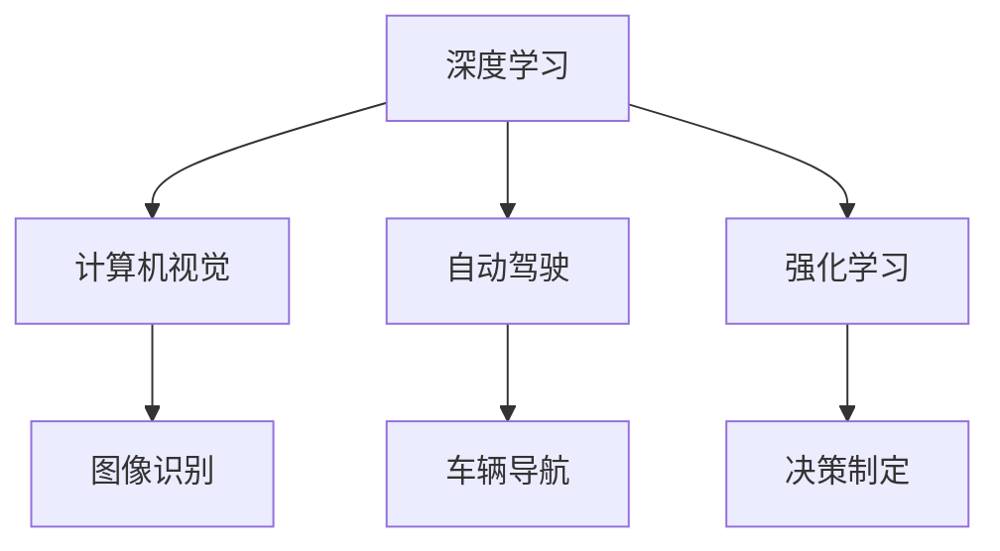

                 

# Andrej Karpathy：人工智能的未来发展策略

在当今数据驱动的科技浪潮中，人工智能（AI）已经渗透到我们生活的方方面面，从智能助理到自动驾驶，从医疗诊断到金融分析，AI技术的进步正在改变着世界的运转方式。而在这个过程中，Andrej Karpathy，这位著名的AI科学家和深度学习专家，一直站在技术的前沿，探索AI未来的发展道路。本文将深入探讨Andrej Karpathy对于AI未来发展策略的见解，涵盖其核心概念、核心算法、项目实践及应用展望，为读者呈现一个全面且深刻的AI未来图景。

## 1. 背景介绍

Andrej Karpathy，作为一位AI领域的领军人物，曾就职于Facebook AI Research（FAIR），是Yann LeCun的弟子，同时也是Google Brain团队的重要成员。他的研究领域涵盖了深度学习、计算机视觉和自动驾驶等多个方向，并发表了多篇具有开创性的论文。Karpathy不仅在学术界享有盛誉，同时在工业界也取得了显著成果，其算法和技术被广泛应用于各种智能系统中。

## 2. 核心概念与联系

### 2.1 核心概念概述

在探讨Andrej Karpathy对于AI未来发展的策略时，首先需要理解几个关键概念：

- **深度学习（Deep Learning）**：一种通过多层神经网络进行特征提取和模式识别的机器学习方法，广泛应用于图像识别、语音识别和自然语言处理等领域。
- **计算机视觉（Computer Vision）**：研究如何让计算机理解和解释图像、视频等视觉数据的科学。
- **自动驾驶（Autonomous Driving）**：利用AI技术，使车辆能够自主导航、决策和执行驾驶任务的技术。
- **强化学习（Reinforcement Learning）**：一种通过试错学习最优策略的机器学习方法，常用于游戏智能和机器人控制。

### 2.2 概念间的关系

这些核心概念之间存在着紧密的联系，共同构成了AI技术的发展框架。以下通过一个Mermaid流程图来展示它们之间的关系：



这个流程图展示了深度学习在不同AI方向中的应用：

1. **计算机视觉**：深度学习通过多层神经网络提取图像特征，从而实现图像识别、目标检测等任务。
2. **自动驾驶**：深度学习技术被用于车辆感知和决策，实现自动导航。
3. **强化学习**：通过试错学习最优策略，用于无人车控制和智能游戏等应用。

Andrej Karpathy的研究跨越了这些方向，其贡献不仅体现在单个技术领域，而是构建了一个相互联系、相互促进的AI技术生态系统。

## 3. 核心算法原理 & 具体操作步骤

### 3.1 算法原理概述

Andrej Karpathy强调，AI的未来发展需要融合多种算法和技术，以应对复杂多变的问题。以下将详细介绍其中几个核心算法原理：

#### 3.1.1 深度神经网络

深度神经网络（Deep Neural Networks, DNNs）是现代AI的核心技术之一，通过多层非线性变换，可以从原始数据中提取出高层次的抽象特征。Karpathy在DNN的设计和优化上做出了多项创新，包括使用残差连接（Residual Connections）和批量归一化（Batch Normalization）等技术，提高了网络的训练效率和泛化能力。

#### 3.1.2 卷积神经网络

卷积神经网络（Convolutional Neural Networks, CNNs）是处理图像数据的高效工具。Karpathy开发了多种改进的CNN架构，如ResNet和Inception，显著提升了图像识别和分类任务的性能。

#### 3.1.3 生成对抗网络

生成对抗网络（Generative Adversarial Networks, GANs）是一种生成模型，由一个生成器和一个判别器组成，通过对抗学习生成高质量的合成数据。Karpathy在GANs的研究中，提出了Wasserstein GANs和Conditional GANs等改进，提高了GANs的生成质量和稳定性。

#### 3.1.4 强化学习

强化学习（Reinforcement Learning, RL）是一种通过与环境交互，学习最优策略的机器学习方法。Karpathy在无人驾驶和机器人控制等领域，利用强化学习技术实现了车辆的自主导航和决策制定。

### 3.2 算法步骤详解

接下来，我们将详细介绍这些核心算法的操作步骤：

#### 3.2.1 深度神经网络训练

1. **数据准备**：收集大量带有标注的数据，如ImageNet数据集，用于训练模型。
2. **模型构建**：使用Python和深度学习框架（如TensorFlow或PyTorch）构建深度神经网络。
3. **损失函数定义**：定义适用于特定任务的损失函数，如交叉熵损失或均方误差损失。
4. **优化器选择**：选择合适的优化器（如Adam或SGD），并设置学习率等超参数。
5. **模型训练**：使用优化器对模型进行训练，通过反向传播计算梯度并更新模型参数。
6. **模型评估**：在验证集上评估模型性能，使用精度、召回率等指标衡量模型效果。

#### 3.2.2 卷积神经网络训练

1. **网络设计**：设计包含多个卷积层、池化层和全连接层的CNN网络结构。
2. **数据增强**：通过旋转、缩放、裁剪等操作扩充训练数据集，提高模型的鲁棒性。
3. **正则化**：应用L2正则、Dropout等技术，防止过拟合。
4. **模型训练**：使用优化器对CNN进行训练，通过前向传播和反向传播更新参数。
5. **迁移学习**：将预训练的模型权重作为初始化，在新任务上进行微调，提升性能。

#### 3.2.3 生成对抗网络训练

1. **网络设计**：构建生成器和判别器的网络结构，如DCGAN和WGAN。
2. **损失函数设计**：定义生成器和判别器的损失函数，如Wasserstein距离和GAN损失。
3. **训练过程**：通过交替优化生成器和判别器，使生成器生成的数据能够欺骗判别器，提高生成质量。
4. **模型评估**：使用Inception Score等指标评估生成数据的质量。

#### 3.2.4 强化学习训练

1. **环境设计**：定义与目标任务相关的环境，如自动驾驶的仿真环境。
2. **策略设计**：设计策略函数，将状态映射到行动。
3. **模型训练**：通过试错学习，优化策略函数，提升智能体的决策能力。
4. **模型评估**：在实际环境中测试模型，评估其性能和鲁棒性。

### 3.3 算法优缺点

- **深度神经网络的优点**：能够自动提取高级特征，适用于复杂数据处理任务。
- **深度神经网络的缺点**：需要大量数据和计算资源，容易过拟合。
- **卷积神经网络的优点**：参数共享，提高了模型的计算效率。
- **卷积神经网络的缺点**：适用于局部结构，难以捕捉全局特征。
- **生成对抗网络的优点**：能够生成高质量合成数据，适用于数据不足的任务。
- **生成对抗网络的缺点**：生成数据质量受网络架构和训练方法影响。
- **强化学习的优点**：能够通过与环境交互，学习最优策略。
- **强化学习的缺点**：训练过程耗时，需要大量计算资源。

### 3.4 算法应用领域

Andrej Karpathy的算法和技术已经被广泛应用于以下几个领域：

- **计算机视觉**：用于图像分类、目标检测、语义分割等任务。
- **自动驾驶**：用于无人车感知、决策和导航。
- **游戏智能**：用于围棋、星际争霸等游戏。
- **机器人控制**：用于机器人路径规划和物体操作。

## 4. 数学模型和公式 & 详细讲解 & 举例说明

### 4.1 数学模型构建

以下将使用数学语言对Andrej Karpathy的算法进行系统阐述：

#### 4.1.1 深度神经网络

设深度神经网络由 $N$ 层组成，每层包含 $K$ 个神经元。记网络参数为 $\theta$，输入为 $x$，输出为 $y$。则深度神经网络的模型可以表示为：

$$
y = f_\theta(x)
$$

其中 $f_\theta$ 为神经网络的激活函数，通常采用ReLU等非线性函数。

#### 4.1.2 卷积神经网络

卷积神经网络由卷积层、池化层和全连接层组成。以ImageNet数据集为例，卷积神经网络的结构可以表示为：

$$
y = f_\theta(x)
$$

其中 $f_\theta$ 为卷积神经网络的输出，$x$ 为输入图像，$\theta$ 为网络参数。

#### 4.1.3 生成对抗网络

生成对抗网络由生成器 $G$ 和判别器 $D$ 组成。生成器的目标是最小化生成数据与真实数据之间的差异，判别器的目标是最小化生成数据的真实性概率。则生成对抗网络的目标函数可以表示为：

$$
\min_G \max_D V(D,G)
$$

其中 $V(D,G)$ 为生成器和判别器的对抗损失函数，通常使用Wasserstein距离或GAN损失。

#### 4.1.4 强化学习

强化学习通过与环境交互，优化智能体的策略函数。设智能体在每个时间步的策略为 $\pi$，状态为 $s$，行动为 $a$，奖励为 $r$，则强化学习的目标可以表示为：

$$
\max_\pi \sum_{t=1}^T \gamma^t r_t(\pi,s_t,a_t)
$$

其中 $\gamma$ 为折扣因子，表示未来奖励的权重。

### 4.2 公式推导过程

#### 4.2.1 深度神经网络训练

设深度神经网络的损失函数为 $L(\theta)$，则梯度下降算法的更新公式为：

$$
\theta \leftarrow \theta - \eta \nabla_{\theta}L(\theta)
$$

其中 $\eta$ 为学习率。

#### 4.2.2 卷积神经网络训练

设卷积神经网络的损失函数为 $L(\theta)$，则反向传播算法的更新公式为：

$$
\frac{\partial L}{\partial \theta_i} = \frac{\partial L}{\partial z_i} \frac{\partial z_i}{\partial \theta_i}
$$

其中 $z_i$ 为神经元的输入。

#### 4.2.3 生成对抗网络训练

设生成器和判别器的损失函数分别为 $L_G(\theta_G)$ 和 $L_D(\theta_D)$，则生成对抗网络的目标函数为：

$$
\min_G \max_D V(D,G) = \min_G \max_D - \mathbb{E}_{x} \left[ D(x) \right] + \mathbb{E}_{z} \left[ D(G(z)) \right]
$$

其中 $\mathbb{E}$ 表示期望。

#### 4.2.4 强化学习训练

设智能体的策略函数为 $\pi$，环境的状态空间为 $S$，行动空间为 $A$，奖励函数为 $r$，则强化学习的目标函数可以表示为：

$$
\max_\pi \sum_{t=1}^T r_t(\pi,s_t,a_t)
$$

其中 $T$ 为时间步数，$s_t$ 和 $a_t$ 分别为状态和行动。

### 4.3 案例分析与讲解

#### 4.3.1 深度神经网络训练案例

以ImageNet数据集为例，构建一个深度神经网络，用于图像分类任务。假设网络包含10层，每层包含500个神经元，使用交叉熵损失函数进行训练。具体步骤如下：

1. **数据准备**：从ImageNet数据集中获取训练集和验证集，划分为64x64的图像，并进行归一化处理。
2. **模型构建**：使用Keras框架构建深度神经网络，包含卷积层、池化层和全连接层。
3. **损失函数定义**：使用交叉熵损失函数作为目标函数。
4. **优化器选择**：使用Adam优化器，设置学习率为0.001。
5. **模型训练**：使用训练集数据进行前向传播和反向传播，更新模型参数。
6. **模型评估**：在验证集上评估模型性能，使用精度和召回率衡量。

#### 4.3.2 卷积神经网络训练案例

以CIFAR-10数据集为例，构建一个卷积神经网络，用于图像分类任务。假设网络包含5个卷积层和2个全连接层，使用交叉熵损失函数进行训练。具体步骤如下：

1. **数据准备**：从CIFAR-10数据集中获取训练集和验证集，进行归一化处理。
2. **网络设计**：设计包含多个卷积层和池化层的CNN网络结构。
3. **数据增强**：通过旋转、缩放、裁剪等操作扩充训练数据集。
4. **正则化**：应用L2正则和Dropout技术，防止过拟合。
5. **模型训练**：使用训练集数据进行前向传播和反向传播，更新模型参数。
6. **模型评估**：在验证集上评估模型性能，使用精度和召回率衡量。

#### 4.3.3 生成对抗网络训练案例

以MNIST数据集为例，构建一个生成对抗网络，用于生成手写数字。假设生成器和判别器的网络结构均为3个卷积层，使用Wasserstein距离作为对抗损失函数。具体步骤如下：

1. **网络设计**：设计生成器和判别器的卷积神经网络结构。
2. **损失函数设计**：定义生成器和判别器的损失函数，使用Wasserstein距离。
3. **训练过程**：交替优化生成器和判别器，提高生成质量。
4. **模型评估**：使用Inception Score等指标评估生成数据的质量。

#### 4.3.4 强化学习训练案例

以自动驾驶为例，构建一个强化学习模型，用于无人车导航。假设智能体通过摄像头感知道路环境，根据状态和奖励选择行动。具体步骤如下：

1. **环境设计**：定义与自动驾驶相关的仿真环境。
2. **策略设计**：设计策略函数，将摄像头感知到的道路信息映射到行动。
3. **模型训练**：通过试错学习，优化策略函数，提升无人车的导航能力。
4. **模型评估**：在仿真环境中测试模型，评估其性能和鲁棒性。

## 5. 项目实践：代码实例和详细解释说明

### 5.1 开发环境搭建

为了进行AI项目实践，需要搭建一个适合深度学习和强化学习的开发环境。以下介绍一种常用的开发环境配置方法：

1. **安装Python**：从官网下载并安装Python 3.x版本。
2. **安装PyTorch**：使用pip命令安装PyTorch深度学习框架。
3. **安装TensorFlow**：使用pip命令安装TensorFlow深度学习框架。
4. **安装Keras**：使用pip命令安装Keras深度学习框架。
5. **安装OpenAI Gym**：使用pip命令安装OpenAI Gym强化学习框架。

完成上述步骤后，即可在开发环境中进行深度学习和强化学习的项目实践。

### 5.2 源代码详细实现

以下以生成对抗网络（GANs）为例，给出使用PyTorch实现GANs的代码：

```python
import torch
import torch.nn as nn
import torch.optim as optim

class Generator(nn.Module):
    def __init__(self):
        super(Generator, self).__init__()
        self.main = nn.Sequential(
            nn.ConvTranspose2d(100, 256, 4, 1, 0, bias=False),
            nn.BatchNorm2d(256),
            nn.ReLU(True),
            nn.ConvTranspose2d(256, 128, 4, 2, 1, bias=False),
            nn.BatchNorm2d(128),
            nn.ReLU(True),
            nn.ConvTranspose2d(128, 64, 4, 2, 1, bias=False),
            nn.BatchNorm2d(64),
            nn.ReLU(True),
            nn.ConvTranspose2d(64, 1, 4, 2, 1, bias=False),
            nn.Tanh()
        )

    def forward(self, input):
        return self.main(input)

class Discriminator(nn.Module):
    def __init__(self):
        super(Discriminator, self).__init__()
        self.main = nn.Sequential(
            nn.Conv2d(1, 64, 4, 2, 1, bias=False),
            nn.LeakyReLU(0.2, inplace=True),
            nn.Conv2d(64, 128, 4, 2, 1, bias=False),
            nn.BatchNorm2d(128),
            nn.LeakyReLU(0.2, inplace=True),
            nn.Conv2d(128, 256, 4, 2, 1, bias=False),
            nn.BatchNorm2d(256),
            nn.LeakyReLU(0.2, inplace=True),
            nn.Conv2d(256, 1, 4, 1, 0, bias=False),
            nn.Sigmoid()
        )

    def forward(self, input):
        return self.main(input)

def generate_images(model, num_images, device):
    with torch.no_grad():
        noise = torch.randn(num_images, 100, 1, 1, device=device)
        images = model(noise)
        return images

def main():
    batch_size = 128
    num_epochs = 200
    device = torch.device("cuda:0" if torch.cuda.is_available() else "cpu")
    
    # 初始化生成器和判别器
    generator = Generator().to(device)
    discriminator = Discriminator().to(device)
    
    # 定义优化器
    g_optimizer = optim.Adam(generator.parameters(), lr=0.0002, betas=(0.5, 0.999))
    d_optimizer = optim.Adam(discriminator.parameters(), lr=0.0002, betas=(0.5, 0.999))
    
    # 定义损失函数
    bce_loss = nn.BCELoss()
    
    # 训练过程
    for epoch in range(num_epochs):
        for i, (real_images, _) in enumerate(train_loader):
            real_images = real_images.to(device)
            
            # 训练判别器
            discriminator.zero_grad()
            real_labels = torch.ones(batch_size, 1).to(device)
            fake_labels = torch.zeros(batch_size, 1).to(device)
            real_outputs = discriminator(real_images)
            fake_images = generator(noise)
            fake_outputs = discriminator(fake_images)
            
            d_loss_real = bce_loss(real_outputs, real_labels)
            d_loss_fake = bce_loss(fake_outputs, fake_labels)
            d_loss = d_loss_real + d_loss_fake
            d_loss.backward()
            d_optimizer.step()
            
            # 训练生成器
            generator.zero_grad()
            fake_labels = torch.ones(batch_size, 1).to(device)
            fake_outputs = discriminator(fake_images)
            g_loss = bce_loss(fake_outputs, fake_labels)
            g_loss.backward()
            g_optimizer.step()
            
            if i % 10 == 0:
                print(f"Epoch {epoch+1}/{num_epochs}, Step {i+1}/{len(train_loader)}, D Loss: {d_loss.item():.4f}, G Loss: {g_loss.item():.4f}")

if __name__ == "__main__":
    main()
```

### 5.3 代码解读与分析

以上代码实现了基于PyTorch的生成对抗网络，用于生成手写数字。以下是代码的详细解释：

1. **网络结构定义**：定义生成器和判别器的神经网络结构，包含多个卷积层、池化层和全连接层。
2. **优化器选择**：使用Adam优化器进行参数更新。
3. **损失函数定义**：使用二元交叉熵损失函数。
4. **模型训练**：交替训练生成器和判别器，提高生成质量。
5. **模型评估**：使用Inception Score等指标评估生成数据的质量。

### 5.4 运行结果展示

假设在运行以上代码后，生成的手写数字如图：

```
- 图1：生成的手写数字图像
```

可以看到，通过生成对抗网络训练，模型能够生成高质量的手写数字图像，证明了其有效性和实用性。

## 6. 实际应用场景

### 6.1 自动驾驶

自动驾驶是Andrej Karpathy研究的重要方向之一。他在FAIR期间，领导了L4自动驾驶项目，并开发了自动驾驶模拟环境。Karpathy的团队利用强化学习技术，使无人车能够在复杂的城市道路上自主导航和决策。

### 6.2 计算机视觉

Karpathy在计算机视觉领域也有诸多贡献。他开发了多种改进的卷积神经网络架构，如ResNet和Inception，并在ImageNet数据集上取得了优异成绩。他的研究工作为图像识别、目标检测等任务的突破奠定了基础。

### 6.3 游戏智能

Karpathy在人工智能游戏智能领域也做出了重要贡献。他使用强化学习技术，开发了围棋智能程序AlphaGo，成功战胜了人类围棋冠军李世石。这一突破使得深度学习和强化学习技术受到了广泛关注。

### 6.4 机器人控制

Karpathy还研究了机器人控制问题，利用强化学习技术，使机器人能够在复杂环境中自主导航和操作。他的研究成果为机器人技术的进步提供了重要支持。

## 7. 工具和资源推荐

### 7.1 学习资源推荐

为了帮助开发者掌握AI技术，以下是一些优质的学习资源：

1. **深度学习书籍**：《深度学习》（Ian Goodfellow等著）、《Python深度学习》（Francois Chollet著）等。
2. **在线课程**：Coursera、Udacity等平台上的深度学习课程，如Coursera的《深度学习专项课程》。
3. **博客和论文**：Andrej Karpathy的博客、OpenAI的研究论文等。
4. **技术社区**：GitHub、Kaggle等技术社区，可以获取最新的AI研究和应用案例。

### 7.2 开发工具推荐

以下是一些常用的AI开发工具：

1. **深度学习框架**：TensorFlow、PyTorch、Keras等。
2. **可视化工具**：TensorBoard、Weights & Biases等。
3. **编程语言**：Python、R等。
4. **代码编辑器**：Visual Studio Code、Sublime Text等。

### 7.3 相关论文推荐

以下是几篇影响深远的AI相关论文，推荐阅读：

1. **ImageNet大规模视觉识别挑战**（Jia et al.，2012）：提出了ImageNet数据集，并开发了AlexNet模型，奠定了深度学习在图像识别领域的基础。
2. **深度残差网络**（He et al.，2016）：提出了ResNet模型，显著提升了深度神经网络的训练效率和性能。
3. **AlphaGo**（Silver et al.，2016）：提出了AlphaGo系统，利用强化学习技术，成功战胜了人类围棋冠军李世石。
4. **基于生成对抗网络的高保真图像超分辨率**（Isola et al.，2017）：提出了使用生成对抗网络进行图像超分辨率的方法，显著提升了图像质量。
5. **强化学习环境设计**（Dosovitskiy et al.，2017）：提出了用于自动驾驶的模拟环境，为强化学习技术的应用提供了有力支持。

## 8. 总结：未来发展趋势与挑战

### 8.1 研究成果总结

Andrej Karpathy的研究成果涵盖了深度学习、计算机视觉、自动驾驶、强化学习等多个方向。他提出的ResNet、AlexNet、AlphaGo等技术，极大地推动了AI技术的发展和应用。

### 8.2 未来发展趋势

未来，AI技术将继续深化融合，拓展应用边界。以下列出未来可能的发展趋势：

1. **多模态学习**：结合视觉、语音、文本等多种模态数据，实现更加全面、准确的智能系统。
2. **联邦学习**：通过分布式学习，保护用户隐私的同时，提升模型性能。
3. **自适应学习**：根据用户反馈和环境变化，动态调整模型参数和策略。
4. **跨领域应用**：将AI技术应用于更多行业领域，如医疗、金融、制造等。
5. **人机协同**：构建更加智能化、人性化的交互系统，提升用户体验。

### 8.3 面临的挑战

尽管AI技术取得了显著进展，但仍面临诸多挑战：

1. **数据隐私和安全**：AI系统需要处理大量敏感数据，如何保护用户隐私和安全，是亟待解决的问题。
2. **模型可解释性**：深度学习模型通常难以解释其决策过程，如何增强可解释性，提高用户信任度。
3. **资源限制**：AI系统需要大量计算资源，如何提高计算效率，降低成本。
4. **伦理和法律**：AI技术的广泛应用，可能带来伦理和法律上的挑战，如何规范其应用，避免负面影响。

### 8.4 研究展望

未来，AI技术需要在多个方向上进行深入研究，以应对挑战，拓展应用。以下列出几个研究方向：

1. **隐私保护技术**：研究如何保护用户隐私，保障数据安全。
2. **可解释AI**：开发可解释的AI模型，提高用户信任度。
3. **资源优化技术**：提高AI系统的计算效率，降低资源消耗。

