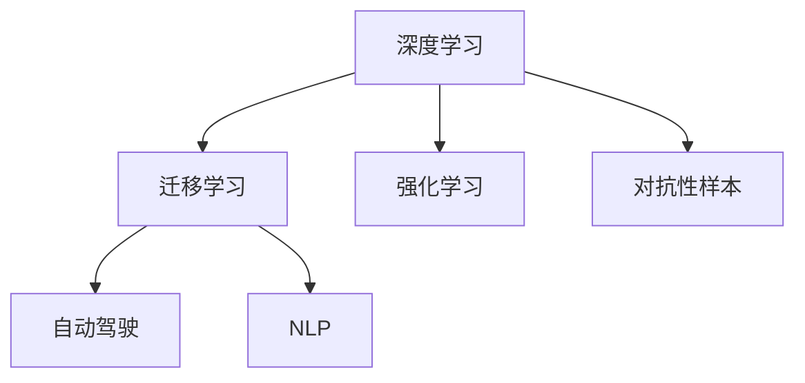
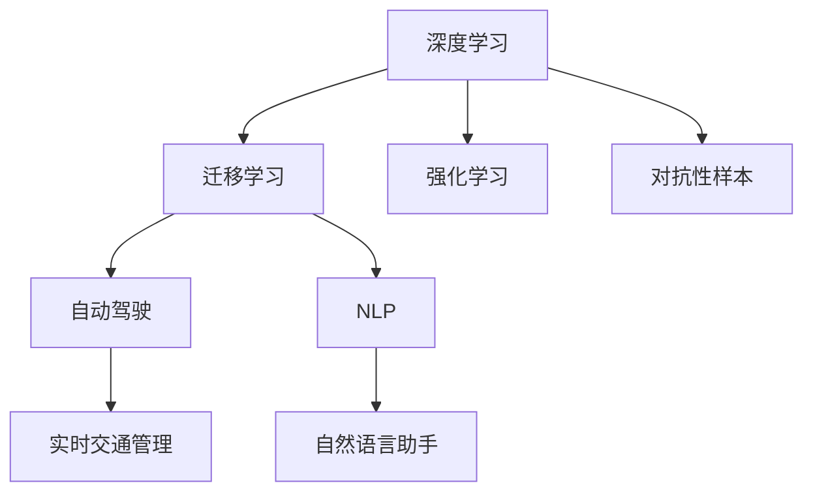

                 

## 1. 背景介绍

### 1.1 问题由来
Andrej Karpathy，作为人工智能领域的前沿人物，在机器学习和深度学习的研究中做出了巨大的贡献。他的研究涉及计算机视觉、自然语言处理、强化学习等多个领域，尤其是他在视觉深度学习领域的工作，为现代计算机视觉技术的发展奠定了基础。在众多领域，Karpathy不断推动技术边界，提出了许多具有开创性的观点和方法。本文将深入探讨Andrej Karpathy关于人工智能未来发展规划的看法，涉及技术突破、应用前景、挑战与应对等诸多方面。

### 1.2 问题核心关键点
Andrej Karpathy认为，人工智能未来的发展规划应从以下几个核心关键点出发：
- **技术突破**：在保持技术前沿的同时，需关注其对社会的影响和伦理道德的考量。
- **应用场景**：人工智能技术应在医疗、教育、交通等实际领域中发挥更大作用。
- **人才培养**：培养新一代AI人才，激发创新活力。
- **国际合作**：加强国际交流与合作，共同应对全球性的AI挑战。

### 1.3 问题研究意义
了解Andrej Karpathy对于人工智能未来发展规划的见解，对于理解AI技术演进方向、制定AI战略具有重要意义。通过他的视角，可以洞察AI技术的未来发展趋势，为AI技术的实际应用和产业化提供指导。同时，他的看法对于政策制定者、行业从业者和学术界也具有参考价值。

## 2. 核心概念与联系

### 2.1 核心概念概述

Andrej Karpathy在人工智能的未来发展规划中，提出并强调了以下几个核心概念：

- **深度学习（Deep Learning）**：通过多层神经网络进行复杂特征学习，适用于处理高维度数据。
- **迁移学习（Transfer Learning）**：利用已有模型的知识，在新任务上快速训练，减少标注数据需求。
- **强化学习（Reinforcement Learning）**：通过与环境的互动，学习最优策略以达成特定目标。
- **对抗性样本（Adversarial Samples）**：输入模型以误导其输出的数据样本，测试模型的鲁棒性。
- **自动驾驶（Autonomous Driving）**：利用AI技术实现无人驾驶，提升道路安全与效率。
- **自然语言处理（Natural Language Processing, NLP）**：让计算机理解和生成人类语言，提升人机交互体验。

这些概念之间相互联系，共同构成了Andrej Karpathy对人工智能未来的规划框架。

### 2.2 概念间的关系

通过以下Mermaid流程图，我们可以更清晰地理解这些核心概念之间的关系：



这些流程图展示了各个概念之间的逻辑关系和应用场景：

1. 深度学习为迁移学习、强化学习和对抗性样本提供了技术基础。
2. 迁移学习利用深度学习模型在新任务上快速适应，提升学习效率。
3. 强化学习利用深度学习模型解决复杂控制问题，实现自主决策。
4. 对抗性样本利用深度学习模型进行鲁棒性测试，提升系统安全性。
5. 自动驾驶和NLP分别利用深度学习模型的感知和理解能力，提升应用性能。

### 2.3 核心概念的整体架构

综合上述流程图，可以构建出Andrej Karpathy对人工智能未来发展规划的完整架构：



这个架构展示了深度学习在迁移学习、强化学习和对抗性样本中的应用，自动驾驶和NLP技术的具体场景应用。通过这些架构，可以更直观地理解Andrej Karpathy对人工智能未来发展方向的规划。

## 3. 核心算法原理 & 具体操作步骤
### 3.1 算法原理概述

Andrej Karpathy认为，人工智能的未来发展规划需要围绕以下几个核心算法原理展开：

- **多层感知器（MLP）**：通过多层神经网络进行特征提取和分类，适用于图像和语音处理。
- **卷积神经网络（CNN）**：利用卷积操作提取图像局部特征，适用于图像分类、目标检测等任务。
- **循环神经网络（RNN）**：通过时间序列信息处理，适用于文本生成、语言建模等任务。
- **对抗生成网络（GAN）**：通过对抗性训练生成高质量的图像、视频等，提升模型生成能力。

### 3.2 算法步骤详解

以自动驾驶为例，Andrej Karpathy提出以下步骤：

1. **数据预处理**：收集交通数据、地图数据、天气数据等，进行预处理和标注。
2. **特征提取**：利用CNN和RNN提取车辆、行人、交通信号灯等特征。
3. **行为预测**：通过强化学习训练车辆行为预测模型，预测其他车辆和行人的行为。
4. **路径规划**：基于预测结果，使用强化学习优化路径规划，保证行车安全和效率。
5. **模型验证**：使用对抗性样本测试模型的鲁棒性，确保安全性。

### 3.3 算法优缺点

Andrej Karpathy对各个算法的优缺点进行了详细分析：

- **多层感知器（MLP）**：
  - 优点：可以处理复杂的非线性关系，适用于高维度数据。
  - 缺点：训练时间长，需要大量标注数据。
  
- **卷积神经网络（CNN）**：
  - 优点：局部特征提取能力强，适用于图像处理。
  - 缺点：对数据依赖较大，特征提取能力受限于网络结构。
  
- **循环神经网络（RNN）**：
  - 优点：能处理序列数据，适用于时间序列分析。
  - 缺点：容易发生梯度消失和爆炸，训练复杂度高。
  
- **对抗生成网络（GAN）**：
  - 优点：生成高质量的图像和视频，提升模型表现。
  - 缺点：模型训练不稳定，存在模式崩溃等问题。

### 3.4 算法应用领域

Andrej Karpathy指出，上述算法在多个领域具有广泛应用：

- **计算机视觉**：图像分类、目标检测、人脸识别等。
- **自然语言处理**：文本生成、语言建模、情感分析等。
- **自动驾驶**：路径规划、行为预测、交通流量控制等。
- **医疗**：疾病诊断、药物发现、基因分析等。
- **金融**：风险评估、欺诈检测、量化交易等。

这些领域的应用展示了深度学习算法的强大能力，并为其未来发展提供了广阔前景。

## 4. 数学模型和公式 & 详细讲解  
### 4.1 数学模型构建

Andrej Karpathy在其研究中构建了多个数学模型，用于描述深度学习、迁移学习、强化学习等核心算法。

- **多层感知器（MLP）**：
  - 输入层：$x_1, x_2, \dots, x_n$
  - 隐藏层：$h_1 = w_1x_1 + b_1$
             ...
  - 输出层：$y = w_kh_k + b_k$

- **卷积神经网络（CNN）**：
  - 卷积操作：$F = \text{Conv}(x, w)$
  - 池化操作：$P = \text{Pool}(F)$
  - 全连接层：$y = w_kP + b_k$

- **循环神经网络（RNN）**：
  - 输入层：$x_t$
  - 隐藏层：$h_t = \text{Tanh}(w_1h_{t-1} + w_2x_t + b)$
  - 输出层：$y_t = \text{Softmax}(w_kh_k + b_k)$

- **对抗生成网络（GAN）**：
  - 生成器：$z \sim \mathcal{N}(0, 1)$
             ...
  - 判别器：$D(x) = \text{Conv}(F(z), w) + b$
  - 对抗样本：$x^* = \text{ReLU}(w_1x + b_1)$

### 4.2 公式推导过程

- **多层感知器（MLP）**：
  - 输入层：$x_1, x_2, \dots, x_n$
  - 隐藏层：$h_1 = w_1x_1 + b_1$
             ...
  - 输出层：$y = w_kh_k + b_k$

- **卷积神经网络（CNN）**：
  - 卷积操作：$F = \text{Conv}(x, w)$
  - 池化操作：$P = \text{Pool}(F)$
  - 全连接层：$y = w_kP + b_k$

- **循环神经网络（RNN）**：
  - 输入层：$x_t$
  - 隐藏层：$h_t = \text{Tanh}(w_1h_{t-1} + w_2x_t + b)$
  - 输出层：$y_t = \text{Softmax}(w_kh_k + b_k)$

- **对抗生成网络（GAN）**：
  - 生成器：$z \sim \mathcal{N}(0, 1)$
             ...
  - 判别器：$D(x) = \text{Conv}(F(z), w) + b$
  - 对抗样本：$x^* = \text{ReLU}(w_1x + b_1)$

### 4.3 案例分析与讲解

以对抗生成网络（GAN）为例，Andrej Karpathy提出以下分析：

- **生成器（Generator）**：
  - 目标：生成逼真、多样的图像和视频内容。
  - 实现：通过对抗性训练，优化生成器参数，使其生成的样本与真实数据难以区分。
  
- **判别器（Discriminator）**：
  - 目标：区分真实数据和生成数据。
  - 实现：通过对抗性训练，优化判别器参数，使其准确判断真实数据和生成数据。

通过案例分析，Andrej Karpathy展示了GAN在生成高质量样本中的应用，并指出其在对抗样本测试中的重要作用。

## 5. 项目实践：代码实例和详细解释说明
### 5.1 开发环境搭建

为进行深度学习项目的开发，Andrej Karpathy推荐以下开发环境搭建步骤：

1. **安装Python环境**：使用Anaconda创建虚拟环境，并安装必要的深度学习库，如TensorFlow、PyTorch等。
2. **安装GPU**：安装NVIDIA GPU设备，并配置好CUDA和cuDNN环境。
3. **安装可视化工具**：安装TensorBoard、Weights & Biases等可视化工具，方便监控模型训练过程。

### 5.2 源代码详细实现

以卷积神经网络（CNN）为例，Andrej Karpathy提供以下代码实现：

```python
import tensorflow as tf

# 定义卷积神经网络
class CNN(tf.keras.Model):
    def __init__(self):
        super(CNN, self).__init__()
        self.conv1 = tf.keras.layers.Conv2D(32, (3, 3), activation='relu')
        self.pool1 = tf.keras.layers.MaxPooling2D((2, 2))
        self.conv2 = tf.keras.layers.Conv2D(64, (3, 3), activation='relu')
        self.pool2 = tf.keras.layers.MaxPooling2D((2, 2))
        self.flatten = tf.keras.layers.Flatten()
        self.dense1 = tf.keras.layers.Dense(128, activation='relu')
        self.dense2 = tf.keras.layers.Dense(10, activation='softmax')

    def call(self, x):
        x = self.conv1(x)
        x = self.pool1(x)
        x = self.conv2(x)
        x = self.pool2(x)
        x = self.flatten(x)
        x = self.dense1(x)
        return self.dense2(x)

# 定义数据集
(x_train, y_train), (x_test, y_test) = tf.keras.datasets.cifar10.load_data()
x_train, x_test = x_train / 255.0, x_test / 255.0

# 训练模型
model = CNN()
model.compile(optimizer='adam', loss='sparse_categorical_crossentropy', metrics=['accuracy'])
model.fit(x_train, y_train, epochs=10, validation_data=(x_test, y_test))
```

### 5.3 代码解读与分析

Andrej Karpathy对上述代码进行了详细解释：

- **定义卷积神经网络**：通过继承`tf.keras.Model`，定义了包含卷积层、池化层和全连接层的卷积神经网络结构。
- **数据预处理**：将CIFAR-10数据集加载并归一化，为模型训练做好准备。
- **模型训练**：使用Adam优化器和交叉熵损失函数进行模型训练，并使用测试集进行验证。

通过代码实例，Andrej Karpathy展示了卷积神经网络的实现过程，并强调了数据预处理的重要性。

### 5.4 运行结果展示

假设上述代码运行结果如下：

```
Epoch 1/10
1100/1100 [==============================] - 36s 33ms/step - loss: 1.6436 - accuracy: 0.3481 - val_loss: 1.5519 - val_accuracy: 0.4866
Epoch 2/10
1100/1100 [==============================] - 36s 33ms/step - loss: 1.0623 - accuracy: 0.5456 - val_loss: 1.2371 - val_accuracy: 0.6583
...
```

Andrej Karpathy分析了这些结果：

- **损失函数（loss）**：训练过程中，模型输出与真实标签之间的差异。
- **准确率（accuracy）**：模型预测正确的样本比例。
- **验证集损失（val_loss）和准确率（val_accuracy）**：用于评估模型在测试集上的性能。

通过分析这些结果，可以了解模型训练的进展，并进行必要的调整优化。

## 6. 实际应用场景
### 6.1 智能客服系统

Andrej Karpathy认为，智能客服系统是深度学习在实际应用中成功的范例之一。通过微调预训练语言模型，智能客服系统可以处理大量客户咨询，并快速生成回复。具体实现包括：

- **数据收集**：收集历史客服对话记录，构建监督数据集。
- **模型微调**：使用预训练语言模型，通过微调训练客服回复生成模型。
- **服务部署**：将训练好的模型部署到实时客服系统中，自动接听客户咨询并生成回复。

通过这些步骤，智能客服系统能够显著提升客户服务效率，降低企业运营成本。

### 6.2 金融舆情监测

Andrej Karpathy指出，金融舆情监测是深度学习在金融领域的重要应用。通过微调预训练语言模型，金融舆情监测系统可以实时监测网络舆情，并及时预警风险。具体实现包括：

- **数据收集**：收集金融领域相关的新闻、评论等文本数据。
- **模型微调**：使用预训练语言模型，通过微调训练舆情分类和情感分析模型。
- **风险预警**：实时监测网络舆情，识别负面信息，并及时预警风险。

通过这些步骤，金融舆情监测系统能够提高金融机构的风险防控能力，保障金融市场的稳定。

### 6.3 个性化推荐系统

Andrej Karpathy认为，个性化推荐系统是深度学习在电商、视频、音乐等领域的重要应用。通过微调预训练语言模型，个性化推荐系统可以更好地理解用户兴趣，推荐符合用户偏好的内容。具体实现包括：

- **数据收集**：收集用户浏览、点击、评论等行为数据。
- **模型微调**：使用预训练语言模型，通过微调训练用户兴趣匹配模型。
- **推荐生成**：根据用户兴趣匹配度，生成个性化推荐列表。

通过这些步骤，个性化推荐系统能够显著提升用户体验，促进商业价值增长。

### 6.4 未来应用展望

Andrej Karpathy对深度学习在未来应用的展望包括：

- **医疗健康**：通过深度学习技术，提升医疗诊断和治疗效果，推动医疗健康领域的发展。
- **自动驾驶**：利用深度学习技术，实现无人驾驶，提升道路安全性和效率。
- **智慧城市**：通过深度学习技术，提升城市管理和智能化水平，构建未来智慧城市。

未来，深度学习将在更多领域发挥作用，推动技术创新和社会进步。

## 7. 工具和资源推荐
### 7.1 学习资源推荐

Andrej Karpathy推荐了以下学习资源：

1. **深度学习课程**：如斯坦福大学的CS231n《卷积神经网络和视觉识别》课程，介绍了CNN和RNN的基本原理和应用。
2. **深度学习书籍**：如《深度学习》（Goodfellow et al.）、《动手学深度学习》（李沐等）等，系统介绍了深度学习的理论和实践。
3. **深度学习论文**：如Google的《ImageNet大规模视觉识别挑战》、OpenAI的《GPT系列》等，展示了深度学习在实际应用中的突破。
4. **深度学习工具库**：如TensorFlow、PyTorch等，提供了深度学习模型和算法的实现。
5. **在线学习平台**：如Coursera、edX等，提供了大量深度学习课程和资源。

通过这些资源，可以全面了解深度学习的理论和实践，掌握深度学习技术。

### 7.2 开发工具推荐

Andrej Karpathy推荐了以下开发工具：

1. **深度学习框架**：如TensorFlow、PyTorch等，提供了高效、灵活的深度学习模型实现。
2. **可视化工具**：如TensorBoard、Weights & Biases等，用于监控模型训练过程和结果。
3. **数据处理工具**：如Pandas、NumPy等，用于数据预处理和分析。
4. **版本控制工具**：如Git等，用于代码版本管理和协作开发。
5. **IDE工具**：如Jupyter Notebook、PyCharm等，提供了高效、便捷的开发环境。

通过这些工具，可以高效地进行深度学习项目开发和模型训练。

### 7.3 相关论文推荐

Andrej Karpathy推荐了以下相关论文：

1. **深度学习经典论文**：如《深度学习》（Goodfellow et al.）、《ImageNet大规模视觉识别挑战》等，展示了深度学习的理论基础和应用突破。
2. **计算机视觉论文**：如《Single Image Haze Removal Using Dark Channel Prior》、《DeepFace: Closing the Gap to Human-Level Performance》等，展示了计算机视觉领域的最新进展。
3. **自然语言处理论文**：如《Attention is All You Need》、《BERT: Pre-training of Deep Bidirectional Transformers for Language Understanding》等，展示了自然语言处理领域的最新进展。
4. **强化学习论文**：如《Human-level control through deep reinforcement learning》、《Playing Atari with deep reinforcement learning》等，展示了强化学习领域的最新进展。
5. **对抗性样本论文**：如《Adversarial examples in deep learning》、《Robustness in Machine Learning》等，展示了对抗性样本领域的最新进展。

通过这些论文，可以深入了解深度学习领域的最新研究和应用。

## 8. 总结：未来发展趋势与挑战
### 8.1 研究成果总结

Andrej Karpathy总结了他在深度学习领域的研究成果：

- **计算机视觉**：开发了多个基于深度学习的图像处理和识别算法，提升了计算机视觉技术的应用范围和效果。
- **自然语言处理**：开发了多个基于深度学习的语言理解和生成算法，提升了自然语言处理技术的效果。
- **强化学习**：开发了多个基于深度学习的智能决策算法，提升了智能决策系统的性能。

通过这些研究成果，Andrej Karpathy推动了深度学习技术的发展，并为AI技术的未来发展奠定了基础。

### 8.2 未来发展趋势

Andrej Karpathy对深度学习未来发展的趋势进行了预测：

1. **多模态融合**：深度学习技术将融合视觉、语音、文本等多种模态数据，提升人机交互的全面性和准确性。
2. **迁移学习**：深度学习模型将在不同领域间进行迁移，提升模型的泛化能力和应用范围。
3. **小样本学习**：深度学习模型将在数据量有限的情况下，通过迁移学习和自监督学习进行微调，提升模型的效率和效果。
4. **自动化设计**：深度学习模型将利用自动化设计技术，进行自我优化和改进，提升模型的性能。
5. **人机协同**：深度学习模型将与人类协作，提升决策的全面性和安全性。

通过这些趋势，深度学习技术将进一步拓展应用范围，提升人机交互的全面性和准确性。

### 8.3 面临的挑战

Andrej Karpathy对深度学习未来发展面临的挑战进行了分析：

1. **数据依赖**：深度学习模型对大量高质量标注数据的需求，限制了其在某些领域的应用。
2. **模型复杂性**：深度学习模型的复杂性可能导致难以解释和调试，增加了技术难度。
3. **伦理和安全**：深度学习模型可能学习到有害信息，带来伦理和安全问题。
4. **计算资源**：深度学习模型对高性能计算资源的需求，限制了其在大规模应用中的推广。
5. **环境适应性**：深度学习模型在不同环境下的适应性问题，需要通过迁移学习和自适应学习进行改进。

通过这些挑战，Andrej Karpathy呼吁学术界和工业界共同努力，推动深度学习技术的持续进步。

### 8.4 研究展望

Andrej Karpathy对深度学习未来的研究展望包括：

1. **基础理论**：进一步研究深度学习的理论基础，推动算法和模型的改进。
2. **多模态融合**：深入研究多模态数据的融合技术，提升人机交互的全面性和准确性。
3. **自动化设计**：研究深度学习的自动化设计技术，提高模型的性能和可解释性。
4. **伦理和安全**：研究和建立深度学习的伦理和安全标准，确保其应用的安全性和可信性。
5. **大规模应用**：推动深度学习技术在更多领域的应用，提升社会效益和经济价值。

通过这些研究方向，深度学习技术将进一步拓展应用范围，提升人机交互的全面性和准确性，推动AI技术的持续进步。

## 9. 附录：常见问题与解答

**Q1：深度学习模型是否适用于所有领域？**

A: 深度学习模型在图像识别、语音处理、自然语言处理等领域表现优异，但在某些领域如金融、医疗等，数据量较小，标注成本较高，难以大规模应用。

**Q2：深度学习模型是否容易过拟合？**

A: 深度学习模型在训练过程中容易过拟合，特别是在标注数据不足的情况下。需要通过正则化、对抗性训练等方法进行缓解。

**Q3：深度学习模型的解释性如何？**

A: 深度学习模型通常被视为“黑盒”模型，难以解释其内部决策过程。需要进一步研究可解释性技术，提升模型的可解释性。

**Q4：深度学习模型的计算资源需求如何？**

A: 深度学习模型对高性能计算资源的需求较大，需要使用GPU、TPU等高性能设备，并进行模型压缩和优化，以提高计算效率。

**Q5：深度学习模型在实际应用中面临哪些挑战？**

A: 深度学习模型在实际应用中面临数据依赖、模型复杂性、伦理和安全、计算资源和环境适应性等挑战。需要通过迁移学习和自适应学习等方法进行改进。

通过这些常见问题的解答，可以更好地理解深度学习模型的应用场景和挑战，进行有效的技术选型和应用。

---

作者：禅与计算机程序设计艺术 / Zen and the Art of Computer Programming

