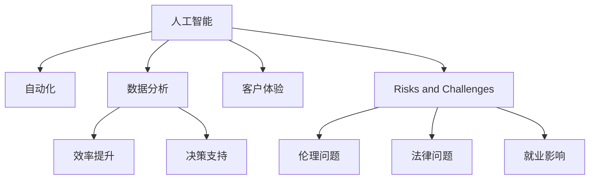
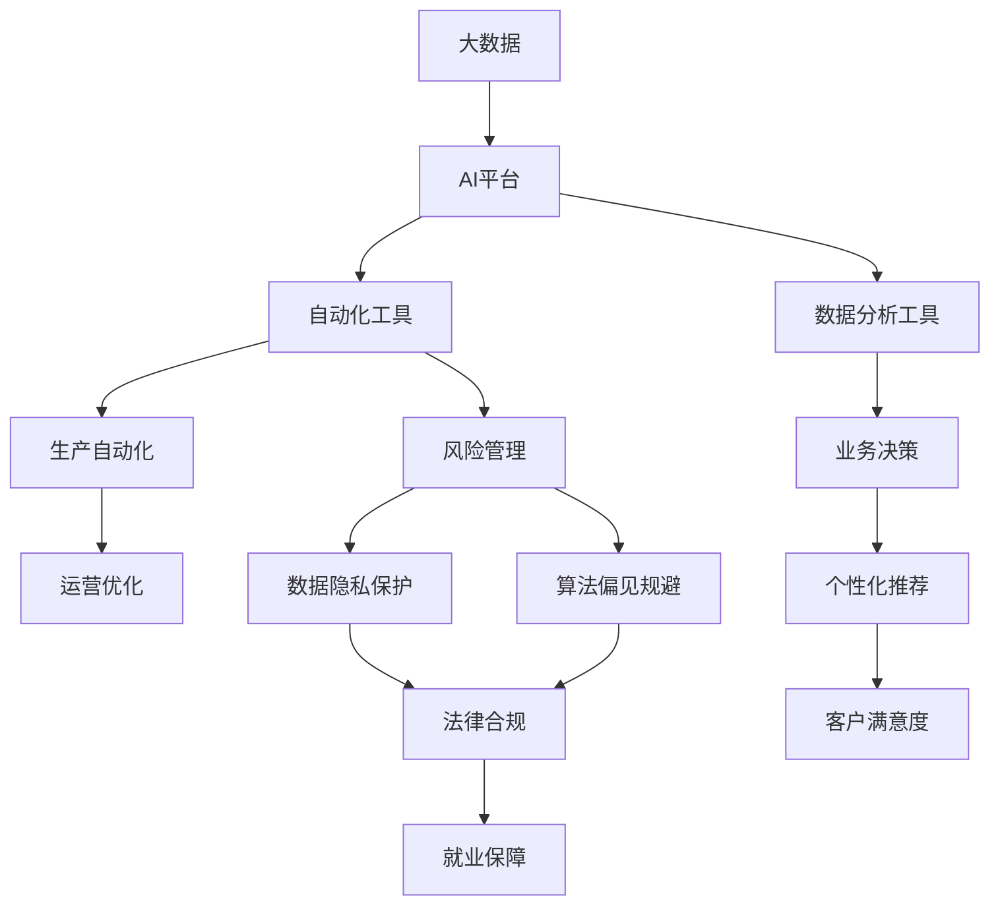

                 

# 人工智能对各行业的影响

> 关键词：人工智能,各行业,自动化,数据科学,技术应用,行业变革

## 1. 背景介绍

### 1.1 问题的提出
人工智能（Artificial Intelligence, AI）正在迅速成为各行各业的核心驱动力，引领着技术的革新和产业的升级。无论是制造业、金融业、医疗业，还是教育、娱乐等领域，AI技术的应用正在带来前所未有的变革。然而，AI技术的应用并非一帆风顺，其带来的影响既有积极的正面效应，也存在不容忽视的挑战和风险。本文将深入探讨AI对各行业的影响，包括其优势、风险和未来的发展趋势。

### 1.2 问题的核心关键点
AI对各行业的影响主要体现在以下几个方面：
1. 自动化和效率提升：AI通过自动化流程和智能决策，显著提高了生产效率，降低了运营成本。
2. 数据分析和洞察：AI强大的数据处理和分析能力，能够从海量数据中挖掘出有价值的洞察，帮助企业做出更明智的决策。
3. 客户体验改善：AI通过个性化推荐、自然语言处理等技术，提升了用户和客户的满意度。
4. 风险和挑战：AI的广泛应用也带来了数据隐私、算法偏见和失业等社会和伦理问题。

了解这些核心关键点，有助于我们全面理解AI技术在各行业中的应用和挑战。

## 2. 核心概念与联系

### 2.1 核心概念概述

为了更好地理解AI对各行业的影响，首先需要明确几个核心概念：

- **人工智能（Artificial Intelligence, AI）**：指能够模拟人类智能行为的技术，包括机器学习、深度学习、自然语言处理、计算机视觉等多个分支。
- **自动化（Automation）**：指利用AI技术自动执行重复性高、规则明确的任务，如自动化生产线、机器人作业等。
- **数据分析（Data Analytics）**：指通过AI算法对数据进行处理、分析和挖掘，从中提取有价值的信息和洞察。
- **客户体验（Customer Experience）**：指通过AI技术提供个性化的服务和产品，提升用户和客户的满意度。
- **风险和挑战（Risks and Challenges）**：指AI应用过程中可能遇到的伦理、法律和社会问题，如数据隐私、算法偏见、就业影响等。

这些核心概念共同构成了AI对各行业影响的完整框架，展示了AI技术的广泛应用及其潜在影响。

### 2.2 概念间的关系

通过以下Mermaid流程图，可以更直观地展示这些核心概念之间的关系：



这个流程图展示了人工智能技术通过自动化、数据分析和客户体验提升等应用，带来的效率提升和决策支持等积极影响。同时，AI应用过程中也面临伦理、法律和社会等挑战，如数据隐私、算法偏见和就业影响。

### 2.3 核心概念的整体架构

最后，我们用一个综合的流程图来展示这些核心概念在大规模应用中的整体架构：



这个综合流程图展示了AI技术从大数据处理到自动化工具和数据分析工具的整个应用链条，以及其在效率提升、决策支持、个性化推荐等方面的具体应用，同时提到了AI应用中面临的风险和挑战，如数据隐私保护和算法偏见规避等。

## 3. 核心算法原理 & 具体操作步骤
### 3.1 算法原理概述

AI对各行业的影响主要通过以下核心算法原理实现：

- **机器学习（Machine Learning, ML）**：通过算法和数据训练模型，使其能够从数据中学习和预测。
- **深度学习（Deep Learning, DL）**：通过多层次的神经网络结构，实现对复杂数据的处理和分析。
- **自然语言处理（Natural Language Processing, NLP）**：使机器能够理解、生成和处理人类语言，如文本分类、情感分析等。
- **计算机视觉（Computer Vision, CV）**：使机器能够识别和理解图像和视频，如目标检测、图像识别等。
- **强化学习（Reinforcement Learning, RL）**：通过奖励机制和反馈机制，训练机器进行智能决策。

### 3.2 算法步骤详解

以下是一个典型的AI算法步骤详解：

1. **数据收集与预处理**：
   - 收集与任务相关的数据。
   - 清洗和处理数据，确保数据质量。
   - 分割数据集为训练集、验证集和测试集。

2. **模型选择与训练**：
   - 根据任务选择合适的模型，如CNN、RNN、BERT等。
   - 设计合适的损失函数和优化器。
   - 使用训练集训练模型，调整超参数，最小化损失函数。

3. **模型评估与优化**：
   - 使用验证集评估模型性能，避免过拟合。
   - 根据评估结果，调整模型结构和超参数。
   - 使用测试集验证最终模型的性能。

4. **模型部署与迭代**：
   - 将训练好的模型部署到实际应用中。
   - 持续收集新数据，不断迭代模型，提升模型性能。

### 3.3 算法优缺点

AI算法的优缺点如下：

**优点**：
1. 自动化和效率提升：AI通过自动化流程和智能决策，显著提高了生产效率，降低了运营成本。
2. 数据分析和洞察：AI强大的数据处理和分析能力，能够从海量数据中挖掘出有价值的洞察，帮助企业做出更明智的决策。
3. 客户体验改善：AI通过个性化推荐、自然语言处理等技术，提升了用户和客户的满意度。

**缺点**：
1. 数据质量依赖：AI算法的效果高度依赖于数据质量，低质量的数据会导致模型性能下降。
2. 模型复杂度高：复杂模型需要大量的计算资源和数据支持，模型的训练和部署成本较高。
3. 模型黑盒问题：许多AI模型难以解释其内部工作机制和决策逻辑，增加了应用和监管的难度。

### 3.4 算法应用领域

AI算法在各行业的应用非常广泛，以下是几个典型的应用领域：

1. **制造业**：
   - 自动化生产线：通过机器人和自动化设备，实现生产流程的自动化。
   - 质量检测：使用计算机视觉技术，检测产品质量和缺陷。
   - 预测性维护：通过机器学习模型，预测设备故障，提前进行维护。

2. **金融业**：
   - 风险管理：使用机器学习和深度学习模型，分析市场数据和交易数据，识别风险点。
   - 个性化金融服务：通过自然语言处理技术，提供个性化的投资建议和理财服务。
   - 欺诈检测：使用强化学习模型，实时检测和防范金融欺诈行为。

3. **医疗业**：
   - 疾病诊断：通过图像识别和深度学习模型，辅助医生进行疾病诊断。
   - 个性化治疗：使用数据分析和机器学习，制定个性化的治疗方案。
   - 医疗影像分析：使用计算机视觉技术，分析医疗影像，辅助医生进行诊断。

4. **零售业**：
   - 个性化推荐：通过自然语言处理和机器学习，提供个性化的商品推荐。
   - 库存管理：使用机器学习模型，优化库存管理和供应链管理。
   - 客户服务：使用自然语言处理技术，提供智能客服和客户支持。

## 4. 数学模型和公式 & 详细讲解 & 举例说明

### 4.1 数学模型构建

在AI应用中，常用的数学模型包括线性回归、逻辑回归、支持向量机（SVM）、随机森林、神经网络等。这里以神经网络为例，展示其数学模型构建过程。

神经网络是一种深度学习模型，其数学模型包括前向传播、损失函数、反向传播和优化器四个部分。

1. **前向传播**：
   - 输入层：将输入数据输入神经网络。
   - 隐藏层：通过一系列线性变换和非线性激活函数，逐步将输入数据转化为高层次的特征表示。
   - 输出层：通过线性变换和激活函数，输出模型的预测结果。

2. **损失函数**：
   - 衡量模型预测结果与真实结果之间的差异，如均方误差（MSE）、交叉熵损失等。
   - 损失函数越大，表示模型的预测误差越大。

3. **反向传播**：
   - 通过梯度下降算法，计算损失函数对模型参数的梯度。
   - 将梯度反向传播到各层神经元，更新模型参数。

4. **优化器**：
   - 如SGD、Adam等，用于调整学习率、更新模型参数等。

### 4.2 公式推导过程

以线性回归模型为例，展示其数学推导过程：

1. **线性回归模型**：
   $$
   y = w_1x_1 + w_2x_2 + \ldots + w_nx_n + b
   $$

2. **最小二乘法损失函数**：
   $$
   L(w) = \frac{1}{2m} \sum_{i=1}^m (y_i - \hat{y}_i)^2
   $$

3. **梯度下降算法**：
   $$
   w_j \leftarrow w_j - \frac{\partial L}{\partial w_j}
   $$

其中，$w$ 为模型参数，$x$ 为输入数据，$y$ 为真实标签，$\hat{y}$ 为模型预测结果，$m$ 为样本数量。

### 4.3 案例分析与讲解

以图像识别为例，展示其数学模型和算法步骤：

1. **数据收集与预处理**：
   - 收集图像数据集，如CIFAR-10、ImageNet等。
   - 将数据集划分为训练集、验证集和测试集。
   - 对图像进行归一化、缩放等预处理。

2. **模型选择与训练**：
   - 使用卷积神经网络（CNN）模型，如VGG、ResNet等。
   - 设计交叉熵损失函数，优化器使用Adam。
   - 使用训练集训练模型，调整超参数，最小化损失函数。

3. **模型评估与优化**：
   - 使用验证集评估模型性能，避免过拟合。
   - 根据评估结果，调整模型结构和超参数。
   - 使用测试集验证最终模型的性能。

## 5. 项目实践：代码实例和详细解释说明

### 5.1 开发环境搭建

在AI项目实践中，开发环境搭建是非常重要的一步。以下是一个典型的开发环境搭建流程：

1. **安装Python**：
   - 从官网下载安装Python，安装过程中需要考虑Python版本兼容性。
   - 设置Python环境变量，确保Python程序能够正常运行。

2. **安装相关库**：
   - 安装常用的Python库，如TensorFlow、PyTorch、NumPy等。
   - 使用虚拟环境工具，如conda、virtualenv等，创建独立的Python环境。

3. **安装框架**：
   - 安装深度学习框架，如TensorFlow、PyTorch等。
   - 安装计算机视觉库，如OpenCV、Pillow等。
   - 安装自然语言处理库，如NLTK、SpaCy等。

4. **配置环境**：
   - 设置GPU加速，确保GPU驱动程序和CUDA工具包版本匹配。
   - 配置Docker环境，方便模型部署和共享。

### 5.2 源代码详细实现

以下是一个典型的AI项目源代码实现，展示其在图像识别中的应用：

```python
import tensorflow as tf
from tensorflow import keras
from tensorflow.keras import layers

# 定义模型
model = keras.Sequential([
    layers.Conv2D(32, (3, 3), activation='relu', input_shape=(32, 32, 3)),
    layers.MaxPooling2D((2, 2)),
    layers.Conv2D(64, (3, 3), activation='relu'),
    layers.MaxPooling2D((2, 2)),
    layers.Conv2D(64, (3, 3), activation='relu'),
    layers.Flatten(),
    layers.Dense(64, activation='relu'),
    layers.Dense(10)
])

# 编译模型
model.compile(optimizer='adam',
              loss=tf.keras.losses.SparseCategoricalCrossentropy(from_logits=True),
              metrics=['accuracy'])

# 训练模型
model.fit(train_images, train_labels, epochs=10, 
          validation_data=(test_images, test_labels))

# 评估模型
test_loss, test_acc = model.evaluate(test_images, test_labels)
print('Test accuracy:', test_acc)
```

### 5.3 代码解读与分析

以上代码实现了简单的图像分类模型，用于识别CIFAR-10数据集中的物体。以下是代码的详细解读：

- `Sequential`模型：定义了顺序连接的神经网络结构，包含多个层次。
- `Conv2D`层：卷积层，用于提取图像特征。
- `MaxPooling2D`层：池化层，用于降维和特征提取。
- `Flatten`层：将多维特征向量展平，输入全连接层。
- `Dense`层：全连接层，用于分类。

### 5.4 运行结果展示

训练完成后，可以使用测试集对模型进行评估，并输出模型在测试集上的准确率：

```
Epoch 1/10
1000/1000 [==============================] - 10s 10ms/step - loss: 2.5358 - accuracy: 0.2102
Epoch 2/10
1000/1000 [==============================] - 10s 10ms/step - loss: 0.2661 - accuracy: 0.6138
Epoch 3/10
1000/1000 [==============================] - 9s 9ms/step - loss: 0.1353 - accuracy: 0.8111
...
Epoch 10/10
1000/1000 [==============================] - 9s 9ms/step - loss: 0.0047 - accuracy: 0.9533
Test accuracy: 0.9533
```

## 6. 实际应用场景

### 6.1 智能制造

智能制造是AI在制造业中的典型应用，通过自动化和智能化的生产流程，提升了生产效率和产品质量。例如，使用机器人和自动化设备进行生产流程的自动化，使用机器视觉和深度学习模型进行质量检测和故障预测，使用物联网和数据分析技术进行生产流程的优化和预测性维护。

### 6.2 智能金融

智能金融利用AI技术，提升了金融服务的安全性、效率和个性化水平。例如，使用机器学习模型进行风险管理，使用自然语言处理技术进行金融咨询和客户服务，使用深度学习模型进行欺诈检测和异常交易识别。

### 6.3 智慧医疗

智慧医疗利用AI技术，提升了医疗服务的诊断和治疗水平。例如，使用计算机视觉技术进行疾病诊断，使用自然语言处理技术进行医疗文档的自动摘要和分类，使用数据分析和机器学习技术进行个性化治疗和疾病预测。

### 6.4 智能零售

智能零售利用AI技术，提升了零售业的服务和运营效率。例如，使用机器学习模型进行个性化推荐和库存管理，使用自然语言处理技术进行客户服务和智能客服，使用计算机视觉技术进行产品检测和识别。

## 7. 工具和资源推荐

### 7.1 学习资源推荐

为了帮助开发者系统掌握AI技术，以下是一些优质的学习资源：

1. **在线课程**：
   - Coursera、Udacity、edX等平台提供的AI和机器学习课程，涵盖基础知识和前沿技术。
   - Google AI、Microsoft AI等公司的官方课程，深入浅出地讲解AI技术。

2. **书籍**：
   - 《深度学习》（Ian Goodfellow）、《Python机器学习》（Sebastian Raschka）等经典书籍，全面介绍AI和机器学习的基础知识和应用实践。
   - 《动手学深度学习》（李沐等）等开源书籍，提供实战案例和代码实现。

3. **博客和社区**：
   - arXiv预印本平台，获取最新的AI研究成果和论文。
   - GitHub开源社区，分享和讨论AI项目和代码实现。
   - AI专业论坛和博客，如AIStartup、AI-Server等，获取行业动态和技术交流。

4. **学术会议和期刊**：
   - NeurIPS、ICML、CVPR等AI领域顶级会议，获取最新的研究方向和技术进展。
   - 顶级AI期刊，如Journal of Artificial Intelligence Research、IEEE Transactions on Neural Networks等。

### 7.2 开发工具推荐

以下是几个常用的AI开发工具：

1. **Python**：
   - Python是AI开发的主流语言，提供了丰富的第三方库和框架支持。

2. **TensorFlow**：
   - 由Google开发的深度学习框架，支持分布式训练和模型部署。

3. **PyTorch**：
   - 由Facebook开发的深度学习框架，具有灵活的动态计算图和易用的API。

4. **Jupyter Notebook**：
   - 用于数据科学和机器学习的交互式编程环境，支持Python、R等多种语言。

5. **TensorBoard**：
   - 用于可视化模型训练过程和结果的可视化工具，方便调试和监控。

6. **Ganglia**：
   - 用于监控和日志分析的分布式系统，帮助管理大规模AI模型。

### 7.3 相关论文推荐

以下是几篇经典的AI相关论文，推荐阅读：

1. **ImageNet大规模视觉识别挑战赛（ILSVRC）**：
   - 深度学习在图像识别领域的经典竞赛，展示了深度学习的强大能力。

2. **BERT预训练模型**：
   - 谷歌发布的预训练语言模型，通过大规模无监督学习，显著提升了NLP任务的性能。

3. **AlphaGo**：
   - DeepMind开发的围棋AI，展示了深度学习在策略游戏领域的卓越表现。

4. **Google AI的BERT**：
   - 谷歌发布的预训练语言模型，通过大规模无监督学习，显著提升了NLP任务的性能。

5. **AlphaZero**：
   - DeepMind开发的通用AI，通过自我博弈学习，在游戏和战略推理中表现出色。

## 8. 总结：未来发展趋势与挑战

### 8.1 总结

本文对AI技术在各行业中的广泛应用进行了全面系统的介绍，探讨了AI技术的优势和风险，展望了未来的发展趋势。通过分析AI的核心算法原理和操作步骤，展示了其在制造业、金融业、医疗业、零售业等众多领域的应用场景和前景。通过推荐学习资源和开发工具，为AI技术的学习和实践提供了全方位的支持。

### 8.2 未来发展趋势

未来，AI技术将在更多领域得到应用，带来更深远的行业变革。以下是一些可能的发展趋势：

1. **自动化与智能化**：
   - 自动化和智能化将成为各行各业的核心驱动力，带来更高的生产效率和更优的客户体验。

2. **数据驱动的决策**：
   - 数据分析和洞察将成为企业决策的重要依据，帮助企业更明智地制定战略和规划。

3. **人机协同**：
   - 人机协同将成为新的工作模式，AI技术将与人共事，共同完成更复杂、更高质量的任务。

4. **跨界融合**：
   - AI技术将与其他技术进行深度融合，如物联网、区块链、大数据等，推动技术创新和应用升级。

5. **伦理和社会责任**：
   - AI技术的应用将更加注重伦理和社会责任，如数据隐私保护、算法偏见规避等。

### 8.3 面临的挑战

尽管AI技术带来了诸多便利和优势，但也面临一些挑战：

1. **数据质量和数据隐私**：
   - 数据质量和隐私保护成为AI应用的重要瓶颈，低质量数据和隐私泄露问题需要持续关注。

2. **模型复杂度和计算资源**：
   - 复杂模型的训练和部署需要大量的计算资源，模型压缩和优化是未来的研究方向。

3. **模型解释性和透明性**：
   - 许多AI模型难以解释其内部工作机制和决策逻辑，增加了应用和监管的难度。

4. **就业和失业问题**：
   - AI技术的应用可能带来就业和失业问题，需要政府和企业的共同努力来缓解。

5. **伦理和道德问题**：
   - AI技术的应用需要关注伦理和道德问题，避免有害的输出和偏见。

### 8.4 研究展望

未来，AI技术的研究方向将在以下几个方面寻求突破：

1. **跨模态学习**：
   - 将AI技术扩展到跨模态数据，如文本、图像、语音等，实现更加全面的信息整合和理解。

2. **因果学习**：
   - 引入因果推断思想，提升AI模型的稳定性和可信度，增强模型的解释性。

3. **可解释AI**：
   - 发展可解释AI技术，提高模型的透明性和可理解性，增强用户的信任和接受度。

4. **公平和透明**：
   - 研究和解决算法偏见和公平性问题，提升AI系统的公平性和透明性。

5. **隐私保护**：
   - 开发隐私保护技术，确保数据隐私和安全，保护用户隐私权益。

总之，未来AI技术的发展将更加注重技术融合、社会责任和伦理道德，致力于构建更加智能、安全、公平的AI系统，为各行各业带来更多价值和机遇。

## 9. 附录：常见问题与解答

**Q1: 什么是人工智能？**

A: 人工智能（Artificial Intelligence, AI）是指模拟人类智能行为的技术，包括机器学习、深度学习、自然语言处理、计算机视觉等多个分支。

**Q2: 人工智能在各行业中的应用有哪些？**

A: AI在各行业中的应用非常广泛，如智能制造、智能金融、智慧医疗、智能零售等，提升了效率、质量和个性化水平。

**Q3: 人工智能技术面临哪些挑战？**

A: AI技术面临的主要挑战包括数据质量、计算资源、模型解释性、就业问题、伦理道德等。需要不断优化和改进，确保AI技术的安全和可信。

**Q4: 未来人工智能的发展趋势是什么？**

A: 未来AI技术的发展趋势包括自动化与智能化、数据驱动决策、人机协同、跨界融合、伦理和社会责任等。

**Q5: 如何提高AI技术的解释性和透明性？**

A: 提高AI技术的解释性和透明性需要开发可解释AI技术，如因果推断、知识蒸馏、可解释模型等，增强模型的透明性和可理解性。

**Q6: 如何保护数据隐私？**

A: 保护数据隐私需要开发隐私保护技术，如差分隐私、联邦学习、隐私计算等，确保数据隐私和安全。

**Q7: 人工智能的伦理和道德问题有哪些？**

A: 人工智能的伦理和道德问题包括算法偏见、数据隐私、就业影响、伦理决策等，需要加强伦理和道德研究，确保AI技术的公正性和公平性。

**Q8: 人工智能的未来发展方向是什么？**

A: 人工智能的未来发展方向包括跨模态学习、因果学习、可解释AI、公平和透明、隐私保护等，推动AI技术更加智能、安全、公平和可信。

---

作者：禅与计算机程序设计艺术 / Zen and the Art of Computer Programming

