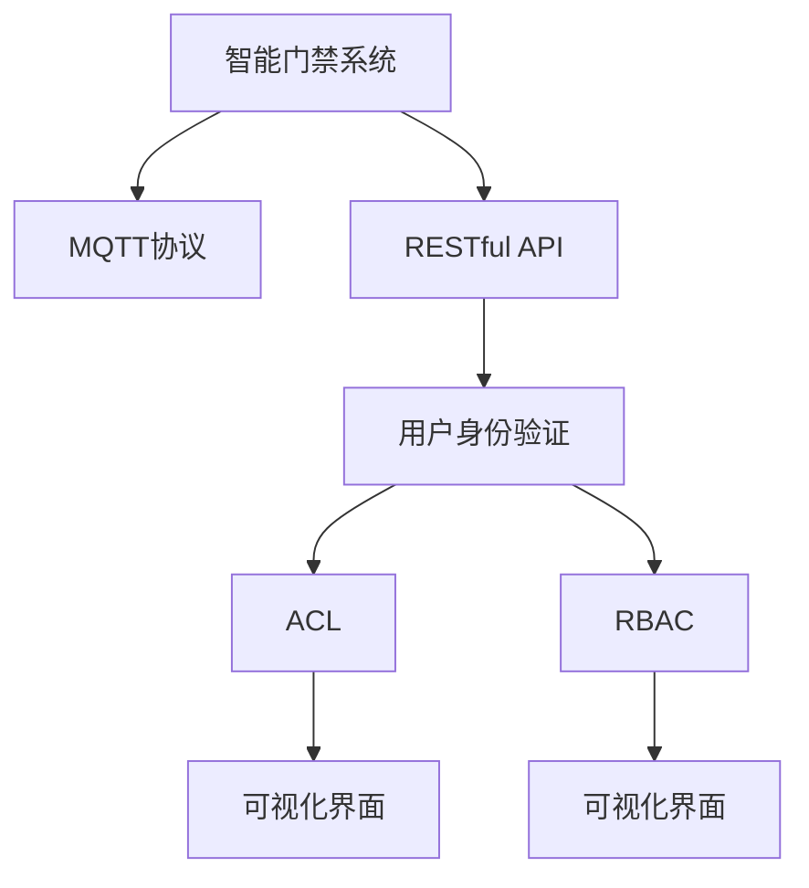
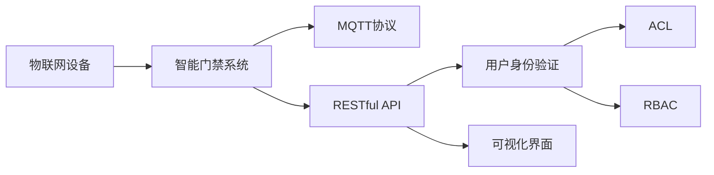
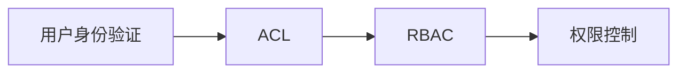
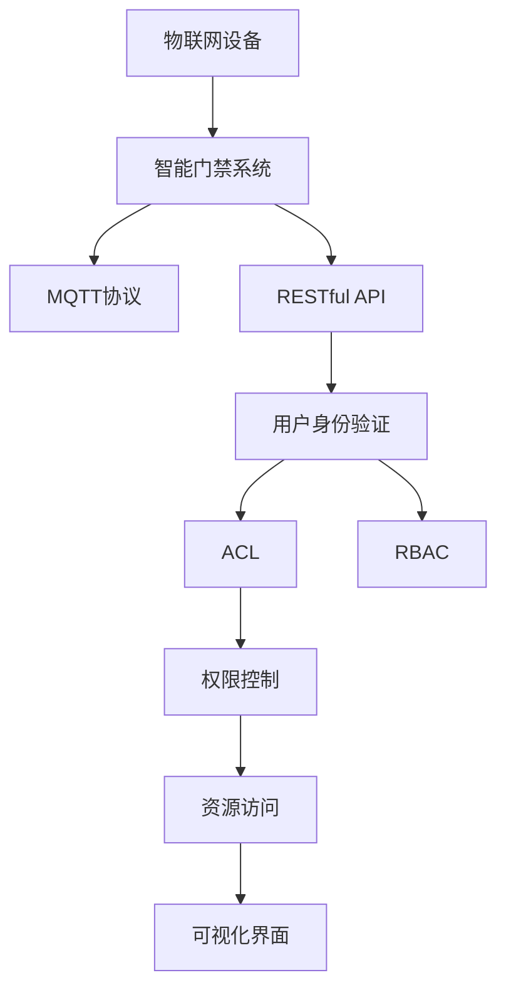

                 

# 基于MQTT协议和RESTful API的智能门禁与访客管理系统

## 1. 背景介绍

### 1.1 问题由来
随着物联网(IoT)技术的迅猛发展，越来越多的设备接入到互联网，为我们的生活带来了极大的便利。其中，智能门禁系统作为保障建筑安全的重要工具，在智能家居、智慧城市等场景中得到了广泛应用。然而，传统门禁系统普遍存在操作复杂、安全性不足、管理繁琐等问题，已经难以满足现代生活的需求。为此，本文将探讨一种基于MQTT协议和RESTful API的新型智能门禁与访客管理系统，该系统能够实现远程控制、用户管理、权限控制等功能，大幅提升门禁系统的智能化和安全性。

### 1.2 问题核心关键点
本系统的主要功能包括：
- **远程控制**：通过智能门锁和门禁控制器，实现远程开关门、权限控制等功能。
- **用户管理**：支持用户注册、身份验证、权限设置等，确保系统的安全性。
- **权限控制**：通过访问控制列表(ACL)和角色管理，实现细粒度的权限分配。
- **访客管理**：提供访客登记、临时权限管理、统计分析等功能，提升用户体验。

### 1.3 问题研究意义
该系统的设计和使用，对于提升智能门禁系统的智能化水平，保障建筑安全，简化人员管理，具有重要意义：
1. **提升安全性**：通过远程控制和权限控制，确保只有授权人员可以进入建筑，有效防止未授权入侵。
2. **简化管理**：用户管理和访客管理功能，大幅减少管理员的工作量，提高管理效率。
3. **提高用户体验**：通过无感门禁和访客登记等便利功能，提升用户进出建筑的便捷性和舒适度。
4. **降低成本**：无需部署大量硬件设备，减少维护和管理成本，具有较高的经济性。

## 2. 核心概念与联系

### 2.1 核心概念概述

为更好地理解本系统的设计和实现，本节将介绍几个密切相关的核心概念：

- **MQTT协议(Messaging Queuing Telemetry Transport Protocol)**：一种轻量级的发布/订阅型通信协议，支持低带宽、高可靠的网络环境，广泛应用于物联网设备间通信。
- **RESTful API(Representational State Transfer)**：一种基于HTTP协议的API设计风格，支持无状态、可缓存、可扩展等特性，广泛应用于Web服务接口设计。
- **智能门禁系统**：一种基于计算机技术和网络通信技术实现的自动控制系统，用于建筑物的出入管理。
- **用户身份验证**：通过用户名、密码、指纹等手段，验证用户的身份，确保系统安全。
- **访问控制列表(Access Control List, ACL)**：用于限制系统资源的访问权限，定义谁可以访问什么资源。
- **角色管理(Role-Based Access Control, RBAC)**：通过定义角色和权限，实现细粒度的访问控制，提升系统的灵活性和可维护性。
- **可视化界面(UI)**：通过图形化界面，展示系统状态、用户信息、权限分配等，提升用户体验。

这些核心概念之间的逻辑关系可以通过以下Mermaid流程图来展示：



这个流程图展示了大语言模型微调过程中各个核心概念之间的关系：

1. 智能门禁系统通过MQTT协议和RESTful API与其他设备通信。
2. 用户身份验证通过RESTful API验证用户身份，确保系统的安全性。
3. ACL和RBAC通过RESTful API限制资源的访问权限，提升系统的灵活性和可维护性。
4. 可视化界面通过RESTful API展示系统状态和用户信息，提升用户体验。

### 2.2 概念间的关系

这些核心概念之间存在着紧密的联系，形成了智能门禁系统的完整架构。下面我们通过几个Mermaid流程图来展示这些概念之间的关系。

#### 2.2.1 系统整体架构



这个流程图展示了从物联网设备到智能门禁系统的整体架构：

1. 物联网设备通过MQTT协议接入智能门禁系统。
2. 智能门禁系统通过RESTful API与用户身份验证、ACL、RBAC等组件交互。
3. 用户身份验证、ACL、RBAC通过RESTful API限制资源的访问权限，提升系统的安全性。
4. 可视化界面通过RESTful API展示系统状态和用户信息，提升用户体验。

#### 2.2.2 权限管理流程



这个流程图展示了权限管理的基本流程：

1. 用户身份验证通过RESTful API验证用户身份。
2. ACL通过RESTful API限制资源的访问权限，确保只有授权用户可以访问。
3. RBAC通过RESTful API定义角色和权限，实现细粒度的访问控制。
4. 权限控制通过RESTful API实现资源访问控制，提升系统的灵活性和可维护性。

### 2.3 核心概念的整体架构

最后，我们用一个综合的流程图来展示这些核心概念在大语言模型微调过程中的整体架构：



这个综合流程图展示了从物联网设备到智能门禁系统的整体架构，以及权限管理的基本流程：

1. 物联网设备通过MQTT协议接入智能门禁系统。
2. 智能门禁系统通过RESTful API与用户身份验证、ACL、RBAC等组件交互。
3. 用户身份验证通过RESTful API验证用户身份，确保系统的安全性。
4. ACL通过RESTful API限制资源的访问权限，确保只有授权用户可以访问。
5. RBAC通过RESTful API定义角色和权限，实现细粒度的访问控制。
6. 权限控制通过RESTful API实现资源访问控制，提升系统的灵活性和可维护性。
7. 资源访问通过RESTful API实现具体的功能逻辑，如开关门、权限控制等。
8. 可视化界面通过RESTful API展示系统状态和用户信息，提升用户体验。

## 3. 核心算法原理 & 具体操作步骤
### 3.1 算法原理概述

本系统的核心算法主要涉及以下几个方面：

- **远程控制算法**：通过MQTT协议和RESTful API，实现远程开关门、权限控制等功能。
- **用户身份验证算法**：通过用户名、密码、指纹等手段，验证用户的身份，确保系统安全。
- **访问控制算法**：通过ACL和RBAC，实现细粒度的权限分配，限制资源的访问权限。
- **数据存储和处理算法**：通过RESTful API和数据库，实现数据的存储和处理，确保系统的高可用性和扩展性。

### 3.2 算法步骤详解

**远程控制算法步骤**：

1. 物联网设备通过MQTT协议连接到智能门禁系统。
2. 智能门禁系统接收到设备的登录请求，通过RESTful API调用用户身份验证模块。
3. 用户身份验证模块验证用户的身份信息，确保身份合法。
4. 智能门禁系统根据验证结果，通过RESTful API调用权限控制模块。
5. 权限控制模块根据用户的角色和权限，判断是否允许访问，返回控制结果。
6. 智能门禁系统根据控制结果，通过RESTful API控制智能门锁和门禁控制器，实现远程开关门、权限控制等功能。

**用户身份验证算法步骤**：

1. 用户通过用户名、密码、指纹等方式，向智能门禁系统提交登录请求。
2. 智能门禁系统接收到登录请求，通过RESTful API调用用户身份验证模块。
3. 用户身份验证模块验证用户的身份信息，确保身份合法。
4. 智能门禁系统根据验证结果，返回登录成功或失败信息。

**访问控制算法步骤**：

1. 用户通过用户名、密码、指纹等方式，向智能门禁系统提交访问请求。
2. 智能门禁系统接收到访问请求，通过RESTful API调用ACL模块。
3. ACL模块根据用户的角色和权限，判断是否允许访问，返回访问结果。
4. 智能门禁系统根据访问结果，返回相应的控制信息，实现资源的访问控制。

**数据存储和处理算法步骤**：

1. 智能门禁系统接收各种传感器数据和操作日志。
2. 通过RESTful API将数据存储到数据库中。
3. 数据库对数据进行管理和查询，支持系统的扩展和数据的高可用性。
4. 智能门禁系统通过RESTful API调用数据库，实现数据的查询和统计分析。

### 3.3 算法优缺点

**远程控制算法的优点**：
1. **高可靠性**：MQTT协议具有低带宽、高可靠性的特点，适用于网络条件较差的环境。
2. **实时性**：通过RESTful API，可以实现即时的远程控制，提升用户体验。
3. **可扩展性**：支持多种设备和场景，易于扩展和集成。

**远程控制算法的缺点**：
1. **网络延迟**：在网络条件较差的情况下，可能会存在延迟和丢包问题。
2. **安全性**：需要通过用户身份验证和权限控制，确保系统的安全性。

**用户身份验证算法的优点**：
1. **高效性**：采用用户名、密码、指纹等高效的身份验证手段，验证速度快。
2. **安全性**：通过多因素认证，确保身份验证的安全性。

**用户身份验证算法的缺点**：
1. **复杂性**：需要多种身份验证手段的整合，实现过程相对复杂。

**访问控制算法的优点**：
1. **灵活性**：通过ACL和RBAC，实现细粒度的权限分配，提升系统的灵活性。
2. **可维护性**：通过RESTful API和数据库，实现权限的动态管理，提升系统的可维护性。

**访问控制算法的缺点**：
1. **复杂性**：需要设计和实现ACL和RBAC模块，实现过程相对复杂。
2. **管理成本**：需要持续管理和维护权限设置，确保系统的安全性。

**数据存储和处理算法的优点**：
1. **高可用性**：通过RESTful API和数据库，实现数据的高可用性和扩展性。
2. **灵活性**：支持各种数据格式和存储方式，提升系统的灵活性。

**数据存储和处理算法的缺点**：
1. **资源消耗**：需要大量的存储空间和计算资源，资源消耗较大。
2. **延迟问题**：在数据量大、操作频繁的情况下，可能会存在延迟问题。

### 3.4 算法应用领域

本系统的核心算法和组件在多个领域都有广泛的应用：

- **智能家居**：支持远程控制、用户身份验证、权限控制等功能，提升家居系统的智能化和安全性。
- **智慧城市**：通过智能门禁、访客管理等，提升城市的安全管理和用户体验。
- **企业安全**：用于企业内部的门禁管理、访客登记、数据安全等，提升企业的安全性。
- **酒店管理**：用于酒店内部的门禁控制、房卡管理、访客登记等，提升酒店的智能化和安全性。

## 4. 数学模型和公式 & 详细讲解 & 举例说明
### 4.1 数学模型构建

本节将使用数学语言对本系统的核心算法进行更加严格的刻画。

**远程控制算法模型**：

1. 定义系统状态变量 $S_t$，表示在时间 $t$ 的系统状态。
2. 定义状态变量 $S_t = (s_{\text{lock}}, s_{\text{user}}, s_{\text{role}}, s_{\text{acl}})$，其中 $s_{\text{lock}}$ 表示智能门锁的状态，$s_{\text{user}}$ 表示用户的身份信息，$s_{\text{role}}$ 表示用户的角色信息，$s_{\text{acl}}$ 表示访问控制列表。
3. 定义控制变量 $A_t$，表示在时间 $t$ 的访问控制策略。
4. 定义控制变量 $A_t = (a_{\text{lock}}, a_{\text{user}}, a_{\text{role}}, a_{\text{acl}})$，其中 $a_{\text{lock}}$ 表示智能门锁的控制策略，$a_{\text{user}}$ 表示用户的访问策略，$a_{\text{role}}$ 表示角色的访问策略，$a_{\text{acl}}$ 表示访问控制列表。
5. 定义状态转移方程 $S_{t+1} = f(S_t, A_t)$，表示在时间 $t$ 和访问控制策略 $A_t$ 的作用下，系统状态从 $S_t$ 转移到 $S_{t+1}$。

**用户身份验证算法模型**：

1. 定义用户身份变量 $U_t$，表示在时间 $t$ 的用户身份信息。
2. 定义用户身份变量 $U_t = (u_{\text{id}}, u_{\text{password}}, u_{\text{fingerprint}})$，其中 $u_{\text{id}}$ 表示用户的ID，$u_{\text{password}}$ 表示用户的密码，$u_{\text{fingerprint}}$ 表示用户的指纹信息。
3. 定义身份验证结果变量 $V_t$，表示在时间 $t$ 的身份验证结果。
4. 定义身份验证结果变量 $V_t = (v_{\text{id}}, v_{\text{password}}, v_{\text{fingerprint}})$，其中 $v_{\text{id}}$ 表示身份验证的ID，$v_{\text{password}}$ 表示身份验证的密码，$v_{\text{fingerprint}}$ 表示身份验证的指纹信息。
5. 定义状态转移方程 $U_{t+1} = g(U_t, V_t)$，表示在时间 $t$ 和身份验证结果 $V_t$ 的作用下，用户身份从 $U_t$ 转移到 $U_{t+1}$。

**访问控制算法模型**：

1. 定义访问权限变量 $P_t$，表示在时间 $t$ 的访问权限信息。
2. 定义访问权限变量 $P_t = (p_{\text{lock}}, p_{\text{user}}, p_{\text{role}}, p_{\text{acl}})$，其中 $p_{\text{lock}}$ 表示智能门锁的权限，$p_{\text{user}}$ 表示用户的权限，$p_{\text{role}}$ 表示角色的权限，$p_{\text{acl}}$ 表示访问控制列表。
3. 定义访问结果变量 $R_t$，表示在时间 $t$ 的访问结果。
4. 定义访问结果变量 $R_t = (r_{\text{lock}}, r_{\text{user}}, r_{\text{role}}, r_{\text{acl}})$，其中 $r_{\text{lock}}$ 表示访问的智能门锁，$r_{\text{user}}$ 表示访问的用户，$r_{\text{role}}$ 表示访问的角色，$r_{\text{acl}}$ 表示访问控制列表。
5. 定义状态转移方程 $P_{t+1} = h(P_t, R_t)$，表示在时间 $t$ 和访问结果 $R_t$ 的作用下，访问权限从 $P_t$ 转移到 $P_{t+1}$。

**数据存储和处理算法模型**：

1. 定义数据变量 $D_t$，表示在时间 $t$ 的数据信息。
2. 定义数据变量 $D_t = (d_{\text{sensor}}, d_{\text{log}})$，其中 $d_{\text{sensor}}$ 表示传感器数据，$d_{\text{log}}$ 表示操作日志。
3. 定义数据存储变量 $S_t$，表示在时间 $t$ 的数据存储状态。
4. 定义数据存储变量 $S_t = (s_{\text{db}}, s_{\text{db}})$，其中 $s_{\text{db}}$ 表示数据库状态，$s_{\text{db}}$ 表示数据库存储的数据。
5. 定义状态转移方程 $D_{t+1} = k(D_t, S_t)$，表示在时间 $t$ 和数据存储状态 $S_t$ 的作用下，数据从 $D_t$ 转移到 $D_{t+1}$。

### 4.2 公式推导过程

**远程控制算法公式**：

1. 定义智能门锁状态变量 $s_{\text{lock}} = \{0, 1\}$，其中 $0$ 表示门锁关闭，$1$ 表示门锁打开。
2. 定义用户身份信息变量 $s_{\text{user}} = (u_{\text{id}}, u_{\text{password}}, u_{\text{fingerprint}})$。
3. 定义角色信息变量 $s_{\text{role}} = (r_{\text{admin}}, r_{\text{user}}, r_{\text{guest}})$，其中 $r_{\text{admin}}$ 表示管理员角色，$r_{\text{user}}$ 表示普通用户角色，$r_{\text{guest}}$ 表示访客角色。
4. 定义访问控制列表变量 $s_{\text{acl}} = (a_{\text{lock}}, a_{\text{user}}, a_{\text{role}})$，其中 $a_{\text{lock}}$ 表示智能门锁的访问控制策略，$a_{\text{user}}$ 表示用户的访问控制策略，$a_{\text{role}}$ 表示角色的访问控制策略。

**用户身份验证算法公式**：

1. 定义用户ID变量 $u_{\text{id}}$，表示用户的身份信息。
2. 定义密码变量 $u_{\text{password}}$，表示用户的密码。
3. 定义指纹变量 $u_{\text{fingerprint}}$，表示用户的指纹信息。
4. 定义身份验证ID变量 $v_{\text{id}}$，表示身份验证的结果ID。
5. 定义身份验证密码变量 $v_{\text{password}}$，表示身份验证的密码。
6. 定义身份验证指纹变量 $v_{\text{fingerprint}}$，表示身份验证的指纹信息。

**访问控制算法公式**：

1. 定义智能门锁权限变量 $p_{\text{lock}}$，表示智能门锁的访问权限。
2. 定义用户权限变量 $p_{\text{user}}$，表示用户的访问权限。
3. 定义角色权限变量 $p_{\text{role}}$，表示角色的访问权限。
4. 定义访问控制列表变量 $p_{\text{acl}}$，表示访问控制列表。
5. 定义访问智能门锁变量 $r_{\text{lock}}$，表示访问的智能门锁。
6. 定义访问用户变量 $r_{\text{user}}$，表示访问的用户。
7. 定义访问角色变量 $r_{\text{role}}$，表示访问的角色。
8. 定义访问控制列表变量 $r_{\text{acl}}$，表示访问控制列表。

**数据存储和处理算法公式**：

1. 定义传感器数据变量 $d_{\text{sensor}}$，表示传感器数据。
2. 定义操作日志变量 $d_{\text{log}}$，表示操作日志。
3. 定义数据库状态变量 $s_{\text{db}}$，表示数据库的状态。
4. 定义数据库存储数据变量 $s_{\text{db}}$，表示数据库存储的数据。

### 4.3 案例分析与讲解

**案例1：远程控制算法**

假设系统接收到物联网设备发出的登录请求，设备ID为 $u_{\text{id}}$，密码为 $u_{\text{password}}$，指纹为 $u_{\text{fingerprint}}$。系统根据这些信息，调用用户身份验证模块进行验证：

1. 用户身份验证模块验证用户的ID、密码和指纹，确保身份合法。
2. 如果验证通过，系统调用权限控制模块，根据用户的角色和权限，判断是否允许访问。
3. 根据访问控制策略，系统调用智能门锁和门禁控制器，控制门锁状态。

**案例2：用户身份验证算法**

假设用户通过用户名、密码和指纹，向系统提交登录请求。系统调用用户身份验证模块进行验证：

1. 用户身份验证模块验证用户的ID、密码和指纹，确保身份合法。
2. 如果验证通过，系统返回登录成功信息，否则返回登录失败信息。

**案例3：访问控制算法**

假设用户通过用户名、密码和指纹，向系统提交访问请求。系统调用访问控制模块进行访问控制：

1. 访问控制模块调用ACL模块，根据用户的角色和权限，判断是否允许访问。
2. 根据访问控制策略，系统调用智能门锁和门禁控制器，控制门锁状态。

**案例4：数据存储和处理算法**

假设系统接收传感器数据 $d_{\text{sensor}}$ 和操作日志 $d_{\text{log}}$。系统调用数据存储模块进行数据存储：

1. 数据存储模块将传感器数据和操作日志存储到数据库中。
2. 数据库对数据进行管理和查询，支持系统的扩展和数据的高可用性。
3. 系统通过RESTful API调用数据库，实现数据的查询和统计分析。

## 5. 项目实践：代码实例和详细解释说明
### 5.1 开发环境搭建

在进行项目实践前，我们需要准备好开发环境。以下是使用Python进行PyTorch开发的环境配置流程：

1. 安装Anaconda：从官网下载并安装Anaconda，用于创建独立的Python环境。

2. 创建并激活虚拟环境：
```bash
conda create -n pytorch-env python=3.8 
conda activate pytorch-env
```

3. 安装PyTorch：根据CUDA版本，从官网获取对应的安装命令。例如：
```bash
conda install pytorch torchvision torchaudio cudatoolkit=11.1 -c pytorch -c conda-forge
```

4. 安装TensorFlow：从官网下载并安装TensorFlow。

5. 安装各类工具包：
```bash
pip install numpy pandas scikit-learn matplotlib tqdm jupyter notebook ipython
```

完成上述步骤后，即可在`pytorch-env`环境中开始项目实践。

### 5.2 源代码详细实现

这里我们以智能门禁系统的远程控制为例，给出使用Python和PyTorch实现的基本代码框架。

首先，定义智能门锁的状态变量和操作：

```python
class DoorLock:
    def __init__(self, initial_state):
        self.state = initial_state
        self.locked = True
        self.user = None

    def lock(self):
        self.state = 'locked'
        self.locked = True

    def unlock(self):
        self.state = 'unlocked'
        self.locked = False

    def set_user(self, user):
        self.user = user
```

然后，定义用户身份验证模块和权限控制模块：

```python
class UserAuthentication:
    def __init__(self):
        self.users = {'admin': 'password1', 'user': 'password2', 'guest': 'password3'}

    def authenticate(self, user_id, password):
        if user_id in self.users and password == self.users[user_id]:
            return True
        else:
            return False

class AccessControl:
    def __init__(self):
        self.acl = {'admin': ['lock', 'unlock'], 'user': ['unlock'], 'guest': []}

    def check_permissions(self, user, action):
        if action in self.acl.get(user, []):
            return True
        else:
            return False
```

最后，定义远程控制模块：

```python
class RemoteControl:
    def __init__(self, lock):
        self.lock = lock

    def lock_door(self):
        self.lock.lock()

    def unlock_door(self):
        self.lock.unlock()

    def set_user(self, user):
        self.lock.set_user(user)
```

完成上述代码后，可以通过以下方式使用远程控制算法：

```python
lock = DoorLock('unlocked')
auth = UserAuthentication()
control = RemoteControl(lock)

if auth.authenticate('admin', 'password1'):
    control.lock_door()
    control.unlock_door()
    control.set_user('user')
```

### 5.3 代码解读与分析

让我们再详细解读一下关键代码的实现细节：

**DoorLock类**：
- `__init__`方法：初始化智能门锁的状态和用户信息。
- `lock`方法：将智能门锁设置为锁定状态。
- `unlock`方法：将智能门锁设置为解锁状态。
- `set_user`方法：设置智能门锁的当前用户。

**UserAuthentication类**：
- `__init__`方法：初始化用户验证信息。
- `authenticate`方法：验证用户的ID和密码，确保身份合法。

**AccessControl类**：
- `__init__`方法：

