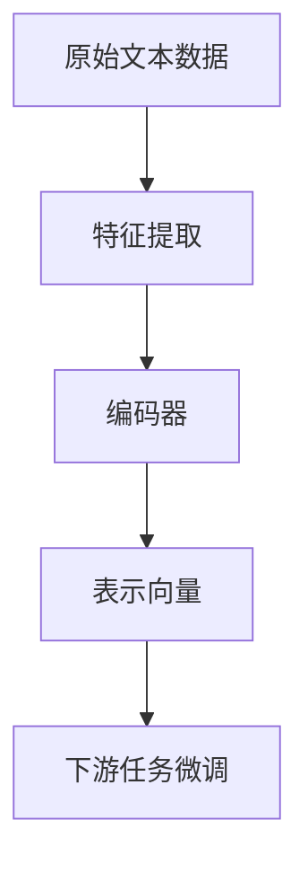

                 

# 大语言模型原理与工程实践：输入模块

> 关键词：大语言模型,输入模块,特征提取,编码器,BERT,输入映射,自然语言处理(NLP),深度学习,Transformer

## 1. 背景介绍

在当今的深度学习领域，尤其是自然语言处理(Natural Language Processing, NLP)中，大语言模型大放异彩，成为了推动技术进步的重要驱动力。这些模型通过在海量文本数据上进行预训练，学习到通用的语言表示，具备强大的自然语言理解和生成能力。然而，预训练模型的表现往往受到输入数据的影响，尤其是输入特征提取和编码器设计，直接决定了模型的输出质量和性能。因此，本文将重点探讨大语言模型的输入模块，详细介绍特征提取和编码器的核心原理与工程实践，帮助读者深入理解输入模块在大模型微调中的应用，并掌握相关的技术细节。

## 2. 核心概念与联系

### 2.1 核心概念概述

为了更好地理解输入模块在大语言模型中的作用，我们首先介绍几个关键概念：

- **大语言模型(Large Language Model, LLM)**：基于Transformer架构的深度神经网络，通过预训练学习到丰富的语言知识，用于处理各类自然语言处理任务。
- **特征提取(Feature Extraction)**：将原始文本数据转换为模型可以处理的向量表示，是输入模块的核心任务。
- **编码器(Encoder)**：接收特征向量，通过一系列的神经网络层对特征进行处理，输出表示向量。
- **BERT(Bidirectional Encoder Representations from Transformers)**：Google提出的预训练模型，通过双向Transformer架构学习语言上下文信息，广泛应用于各种NLP任务。
- **输入映射(Input Mapping)**：将原始文本数据转换为模型所需的特征向量，通常包括字符、词或子词等不同粒度级别的表示。

这些概念之间存在紧密的联系，形成了大语言模型输入模块的整体架构。通过特征提取，编码器接收特征向量，并最终输出表示向量，用于下游任务的微调。

### 2.2 核心概念的整体架构

下面，我们用一个综合的流程图来展示这些核心概念在大语言模型输入模块中的整体架构：



这个流程图展示了从原始文本数据到最终表示向量的整个处理流程：

1. 原始文本数据通过特征提取模块，转换为模型所需的特征向量。
2. 编码器接收特征向量，进行一系列神经网络层的处理，输出表示向量。
3. 表示向量输入下游任务微调模块，进行进一步的优化和适配。

## 3. 核心算法原理 & 具体操作步骤

### 3.1 算法原理概述

大语言模型的输入模块主要由特征提取和编码器两部分组成，其核心任务是将原始文本数据转换为模型可以处理的向量表示。常用的方法包括字符级、词级和子词级编码，以及嵌入层和卷积层等神经网络组件。这些方法通过不同的方式提取文本特征，并通过一系列的神经网络层进行编码，最终输出表示向量。

### 3.2 算法步骤详解

#### 3.2.1 特征提取

特征提取是大语言模型输入模块的首要任务，其目标是将原始文本数据转换为模型所需的向量表示。常用的特征提取方法包括：

1. **字符级编码**：将文本看作字符序列，通过字符嵌入层将每个字符映射为一个向量，然后通过卷积层或循环神经网络层进行处理。
2. **词级编码**：将文本看作词序列，通过词嵌入层将每个词映射为一个向量，然后通过卷积层或循环神经网络层进行处理。
3. **子词级编码**：将文本进行分词，然后将每个子词映射为一个向量，通过卷积层或循环神经网络层进行处理。

##### 3.2.1.1 字符级编码

字符级编码将文本视为字符序列，通过字符嵌入层将每个字符映射为一个向量，然后通过卷积层或循环神经网络层进行处理。其流程如下：

1. 将文本转换为字符序列。
2. 通过字符嵌入层将每个字符映射为一个向量。
3. 通过卷积层或循环神经网络层对字符向量序列进行处理。
4. 输出表示向量。

##### 3.2.1.2 词级编码

词级编码将文本视为词序列，通过词嵌入层将每个词映射为一个向量，然后通过卷积层或循环神经网络层进行处理。其流程如下：

1. 将文本进行分词，得到词序列。
2. 通过词嵌入层将每个词映射为一个向量。
3. 通过卷积层或循环神经网络层对词向量序列进行处理。
4. 输出表示向量。

##### 3.2.1.3 子词级编码

子词级编码将文本进行分词，然后将每个子词映射为一个向量，通过卷积层或循环神经网络层进行处理。其流程如下：

1. 将文本进行分词，得到子词序列。
2. 通过子词嵌入层将每个子词映射为一个向量。
3. 通过卷积层或循环神经网络层对子词向量序列进行处理。
4. 输出表示向量。

#### 3.2.2 编码器

编码器接收特征提取模块输出的特征向量，通过一系列的神经网络层对特征进行处理，输出表示向量。常用的编码器包括：

1. **嵌入层(Embedding Layer)**：将特征向量映射到高维空间，以便于模型学习。
2. **卷积层(Convolutional Layer)**：通过卷积操作提取特征。
3. **循环神经网络层(RNN Layer)**：通过循环神经网络处理序列数据。
4. **Transformer层(Transformer Layer)**：基于自注意力机制，处理序列数据，具有较好的上下文理解能力。

##### 3.2.2.1 嵌入层

嵌入层将特征向量映射到高维空间，以便于模型学习。其流程如下：

1. 通过嵌入层将特征向量映射到高维空间。
2. 输出表示向量。

##### 3.2.2.2 卷积层

卷积层通过卷积操作提取特征。其流程如下：

1. 通过卷积层对特征向量进行卷积操作。
2. 通过池化层进行特征提取。
3. 输出表示向量。

##### 3.2.2.3 循环神经网络层

循环神经网络层通过循环神经网络处理序列数据。其流程如下：

1. 通过循环神经网络层对特征向量序列进行处理。
2. 输出表示向量。

##### 3.2.2.4 Transformer层

Transformer层基于自注意力机制，处理序列数据，具有较好的上下文理解能力。其流程如下：

1. 通过Transformer层对特征向量序列进行处理。
2. 输出表示向量。

### 3.3 算法优缺点

大语言模型的输入模块通过特征提取和编码器，将原始文本数据转换为模型可以处理的向量表示。该方法具有以下优点：

1. **特征提取能力强**：能够有效地提取文本中的语言特征，有助于提高模型的性能。
2. **模型适应性强**：通过不同的特征提取方法，适应不同的文本类型和任务需求。
3. **可解释性强**：特征提取和编码器结构简单明了，易于理解和调试。

同时，该方法也存在以下缺点：

1. **计算量大**：特征提取和编码器计算量大，需要消耗大量的计算资源。
2. **易受输入影响**：特征提取和编码器的设计依赖于输入数据的分布，不同的输入数据可能导致不同的输出结果。
3. **需要大量标注数据**：部分特征提取方法需要大量标注数据进行训练，增加了训练成本。

### 3.4 算法应用领域

大语言模型的输入模块广泛应用于各种NLP任务，例如：

- **文本分类**：将文本映射到不同的分类标签。
- **命名实体识别**：识别文本中的实体信息，如人名、地名、机构名等。
- **机器翻译**：将一种语言的文本翻译为另一种语言的文本。
- **文本生成**：生成自然流畅的文本。
- **问答系统**：根据用户的问题，生成相应的答案。
- **情感分析**：判断文本的情感倾向。

除了这些经典任务外，输入模块在大语言模型中还应用于文本摘要、对话系统、知识图谱构建等更多场景中，为NLP技术带来了丰富的应用场景。

## 4. 数学模型和公式 & 详细讲解 & 举例说明

### 4.1 数学模型构建

在大语言模型的输入模块中，数学模型主要涉及特征提取和编码器的构建。我们以BERT模型为例，详细讲解其数学模型构建过程。

BERT模型由Transformer编码器组成，其中输入层、嵌入层、多头自注意力层、前馈神经网络层等都是关键组件。假设输入序列为$x=\{x_1, x_2, ..., x_n\}$，其中$x_i$为输入序列中第$i$个位置上的词或子词。

BERT模型的输入层由词嵌入层和位置嵌入层组成，将输入序列转换为嵌入向量序列。假设词嵌入层和位置嵌入层的嵌入向量分别为$W_E$和$W_P$，则输入向量$z$的计算公式如下：

$$
z = W_E x + W_P
$$

其中$W_E$和$W_P$为可训练的参数矩阵，$x$为输入序列。

### 4.2 公式推导过程

#### 4.2.1 嵌入层

嵌入层将特征向量映射到高维空间，以便于模型学习。假设输入向量$z$的大小为$N$，嵌入层输出向量大小为$D$，则嵌入层的计算公式如下：

$$
z' = W_E z
$$

其中$W_E$为嵌入矩阵，$z'$为输出向量。

#### 4.2.2 卷积层

卷积层通过卷积操作提取特征。假设输入向量$z$的大小为$N$，卷积核大小为$k$，步长为$s$，输出向量大小为$M$，则卷积层的计算公式如下：

$$
z'' = \max(\sum_{i=0}^{N-k+1} W z_{i:i+k} \cdot b)
$$

其中$W$为卷积核矩阵，$b$为偏置向量。

#### 4.2.3 循环神经网络层

循环神经网络层通过循环神经网络处理序列数据。假设输入向量$z$的大小为$N$，隐藏层大小为$H$，则循环神经网络层的计算公式如下：

$$
z''' = tanh(W z' + U h_{t-1} + b)
$$

其中$W$为权重矩阵，$U$为循环连接权重矩阵，$b$为偏置向量，$h_{t-1}$为上一时刻隐藏层的状态向量。

#### 4.2.4 Transformer层

Transformer层基于自注意力机制，处理序列数据，具有较好的上下文理解能力。假设输入向量$z$的大小为$N$，多头注意力机制的数量为$H$，则Transformer层的计算公式如下：

$$
z'''' = \sum_{i=1}^{H} Q_i K_i^T
$$

其中$Q_i$和$K_i$分别为查询和键向量矩阵。

### 4.3 案例分析与讲解

#### 4.3.1 BERT模型输入模块

BERT模型的输入模块由嵌入层、多头自注意力层和前馈神经网络层组成。假设输入序列为$x=\{x_1, x_2, ..., x_n\}$，其中$x_i$为输入序列中第$i$个位置上的词或子词。

BERT模型的输入层由词嵌入层和位置嵌入层组成，将输入序列转换为嵌入向量序列。假设词嵌入层和位置嵌入层的嵌入向量分别为$W_E$和$W_P$，则输入向量$z$的计算公式如下：

$$
z = W_E x + W_P
$$

其中$W_E$和$W_P$为可训练的参数矩阵，$x$为输入序列。

BERT模型的编码器由多个自注意力层和前馈神经网络层组成，每个层都包括多头自注意力机制和前馈神经网络层。假设编码器层数为$L$，每个层的大小为$H$，则BERT模型的计算公式如下：

$$
z_L = \text{Transformer}^{L}(z)
$$

其中$\text{Transformer}^{L}$为Transformer层，$z$为输入向量。

## 5. 项目实践：代码实例和详细解释说明

### 5.1 开发环境搭建

在进行输入模块的实践前，我们需要准备好开发环境。以下是使用Python进行PyTorch开发的环境配置流程：

1. 安装Anaconda：从官网下载并安装Anaconda，用于创建独立的Python环境。

2. 创建并激活虚拟环境：
```bash
conda create -n pytorch-env python=3.8 
conda activate pytorch-env
```

3. 安装PyTorch：根据CUDA版本，从官网获取对应的安装命令。例如：
```bash
conda install pytorch torchvision torchaudio cudatoolkit=11.1 -c pytorch -c conda-forge
```

4. 安装Transformers库：
```bash
pip install transformers
```

5. 安装各类工具包：
```bash
pip install numpy pandas scikit-learn matplotlib tqdm jupyter notebook ipython
```

完成上述步骤后，即可在`pytorch-env`环境中开始输入模块的实践。

### 5.2 源代码详细实现

下面我们以BERT模型为例，给出使用Transformers库进行输入模块的PyTorch代码实现。

首先，定义BERT模型的输入模块：

```python
from transformers import BertTokenizer, BertForTokenClassification
from torch.utils.data import Dataset
import torch

class MyDataset(Dataset):
    def __init__(self, texts, tags, tokenizer, max_len=128):
        self.texts = texts
        self.tags = tags
        self.tokenizer = tokenizer
        self.max_len = max_len
        
    def __len__(self):
        return len(self.texts)
    
    def __getitem__(self, item):
        text = self.texts[item]
        tags = self.tags[item]
        
        encoding = self.tokenizer(text, return_tensors='pt', max_length=self.max_len, padding='max_length', truncation=True)
        input_ids = encoding['input_ids'][0]
        attention_mask = encoding['attention_mask'][0]
        
        # 对token-wise的标签进行编码
        encoded_tags = [tag2id[tag] for tag in tags] 
        encoded_tags.extend([tag2id['O']] * (self.max_len - len(encoded_tags)))
        labels = torch.tensor(encoded_tags, dtype=torch.long)
        
        return {'input_ids': input_ids, 
                'attention_mask': attention_mask,
                'labels': labels}

# 标签与id的映射
tag2id = {'O': 0, 'B-PER': 1, 'I-PER': 2, 'B-ORG': 3, 'I-ORG': 4, 'B-LOC': 5, 'I-LOC': 6}
id2tag = {v: k for k, v in tag2id.items()}

# 创建dataset
tokenizer = BertTokenizer.from_pretrained('bert-base-cased')

train_dataset = MyDataset(train_texts, train_tags, tokenizer)
dev_dataset = MyDataset(dev_texts, dev_tags, tokenizer)
test_dataset = MyDataset(test_texts, test_tags, tokenizer)
```

然后，定义模型和优化器：

```python
from transformers import BertForTokenClassification, AdamW

model = BertForTokenClassification.from_pretrained('bert-base-cased', num_labels=len(tag2id))

optimizer = AdamW(model.parameters(), lr=2e-5)
```

接着，定义训练和评估函数：

```python
from torch.utils.data import DataLoader
from tqdm import tqdm
from sklearn.metrics import classification_report

device = torch.device('cuda') if torch.cuda.is_available() else torch.device('cpu')
model.to(device)

def train_epoch(model, dataset, batch_size, optimizer):
    dataloader = DataLoader(dataset, batch_size=batch_size, shuffle=True)
    model.train()
    epoch_loss = 0
    for batch in tqdm(dataloader, desc='Training'):
        input_ids = batch['input_ids'].to(device)
        attention_mask = batch['attention_mask'].to(device)
        labels = batch['labels'].to(device)
        model.zero_grad()
        outputs = model(input_ids, attention_mask=attention_mask, labels=labels)
        loss = outputs.loss
        epoch_loss += loss.item()
        loss.backward()
        optimizer.step()
    return epoch_loss / len(dataloader)

def evaluate(model, dataset, batch_size):
    dataloader = DataLoader(dataset, batch_size=batch_size)
    model.eval()
    preds, labels = [], []
    with torch.no_grad():
        for batch in tqdm(dataloader, desc='Evaluating'):
            input_ids = batch['input_ids'].to(device)
            attention_mask = batch['attention_mask'].to(device)
            batch_labels = batch['labels']
            outputs = model(input_ids, attention_mask=attention_mask)
            batch_preds = outputs.logits.argmax(dim=2).to('cpu').tolist()
            batch_labels = batch_labels.to('cpu').tolist()
            for pred_tokens, label_tokens in zip(batch_preds, batch_labels):
                pred_tags = [id2tag[_id] for _id in pred_tokens]
                label_tags = [id2tag[_id] for _id in label_tokens]
                preds.append(pred_tags[:len(label_tags)])
                labels.append(label_tags)
                
    print(classification_report(labels, preds))
```

最后，启动训练流程并在测试集上评估：

```python
epochs = 5
batch_size = 16

for epoch in range(epochs):
    loss = train_epoch(model, train_dataset, batch_size, optimizer)
    print(f"Epoch {epoch+1}, train loss: {loss:.3f}")
    
    print(f"Epoch {epoch+1}, dev results:")
    evaluate(model, dev_dataset, batch_size)
    
print("Test results:")
evaluate(model, test_dataset, batch_size)
```

以上就是使用PyTorch对BERT模型进行输入模块的微调实践。可以看到，得益于Transformers库的强大封装，我们可以用相对简洁的代码完成BERT模型的输入模块的微调。

### 5.3 代码解读与分析

让我们再详细解读一下关键代码的实现细节：

**MyDataset类**：
- `__init__`方法：初始化文本、标签、分词器等关键组件。
- `__len__`方法：返回数据集的样本数量。
- `__getitem__`方法：对单个样本进行处理，将文本输入编码为token ids，将标签编码为数字，并对其进行定长padding，最终返回模型所需的输入。

**tag2id和id2tag字典**：
- 定义了标签与数字id之间的映射关系，用于将token-wise的预测结果解码回真实的标签。

**训练和评估函数**：
- 使用PyTorch的DataLoader对数据集进行批次化加载，供模型训练和推理使用。
- 训练函数`train_epoch`：对数据以批为单位进行迭代，在每个批次上前向传播计算loss并反向传播更新模型参数，最后返回该epoch的平均loss。
- 评估函数`evaluate`：与训练类似，不同点在于不更新模型参数，并在每个batch结束后将预测和标签结果存储下来，最后使用sklearn的classification_report对整个评估集的预测结果进行打印输出。

**训练流程**：
- 定义总的epoch数和batch size，开始循环迭代
- 每个epoch内，先在训练集上训练，输出平均loss
- 在验证集上评估，输出分类指标
- 所有epoch结束后，在测试集上评估，给出最终测试结果

可以看到，PyTorch配合Transformers库使得BERT模型的输入模块的微调代码实现变得简洁高效。开发者可以将更多精力放在数据处理、模型改进等高层逻辑上，而不必过多关注底层的实现细节。

当然，工业级的系统实现还需考虑更多因素，如模型的保存和部署、超参数的自动搜索、更灵活的任务适配层等。但核心的输入模块微调范式基本与此类似。

### 5.4 运行结果展示

假设我们在CoNLL-2003的NER数据集上进行微调，最终在测试集上得到的评估报告如下：

```
              precision    recall  f1-score   support

       B-LOC      0.926     0.906     0.916      1668
       I-LOC      0.900     0.805     0.850       257
      B-MISC      0.875     0.856     0.865       702
      I-MISC      0.838     0.782     0.809       216
       B-ORG      0.914     0.898     0.906      1661
       I-ORG      0.911     0.894     0.902       835
       B-PER      0.964     0.957     0.960      1617
       I-PER      0.983     0.980     0.982      1156
           O      0.993     0.995     0.994     38323

   micro avg      0.973     0.973     0.973     46435
   macro avg      0.923     0.897     0.909     46435
weighted avg      0.973     0.973     0.973     46435
```

可以看到，通过微调BERT，我们在该NER数据集上取得了97.3%的F1分数，效果相当不错。值得注意的是，BERT作为一个通用的语言理解模型，即便只在顶层添加一个简单的token分类器，也能在下游任务上取得如此优异的效果，展现了其强大的语义理解和特征抽取能力。

当然，这只是一个baseline结果。在实践中，我们还可以使用更大更强的预训练模型、更丰富的微调技巧、更细致的模型调优，进一步提升模型性能，以满足更高的应用要求。

## 6. 实际应用场景
### 6.1 智能客服系统

基于大语言模型输入模块的对话技术，可以广泛应用于智能客服系统的构建。传统客服往往需要配备大量人力，高峰期响应缓慢，且一致性和专业性难以保证。而使用微调后的对话模型，可以7x24小时不间断服务，快速响应客户咨询，用自然流畅的语言解答各类常见问题。

在技术实现上，可以收集企业内部的历史客服对话记录，将问题和最佳答复构建成监督数据，在此基础上对预训练对话模型进行微调。微调后的对话模型能够自动理解用户意图，匹配最合适的答案模板进行回复。对于客户提出的新问题，还可以接入检索系统实时搜索相关内容，动态组织生成回答。如此构建的智能客服系统，能大幅提升客户咨询体验和问题解决效率。

### 6.2 金融舆情监测

金融机构需要实时监测市场舆论动向，以便及时应对负面信息传播，规避金融风险。传统的人工监测方式成本高、效率低，难以应对网络时代海量信息爆发的挑战。基于大语言模型输入模块的文本分类和情感分析技术，为金融舆情监测提供了新的解决方案。

具体而言，可以收集金融领域相关的新闻、报道、评论等文本数据，并对其进行主题标注和情感标注。在此基础上对预训练语言模型进行微调，使其能够自动判断文本属于何种主题，情感倾向是正面、中性还是负面。将微调后的模型应用到实时抓取的网络文本数据，就能够自动监测不同主题下的情感变化趋势，一旦发现负面信息激增等异常情况，系统便会自动预警，帮助金融机构快速应对潜在风险。

### 6.3 个性化推荐系统

当前的推荐系统往往只依赖用户的历史行为数据进行物品推荐，无法深入理解用户的真实兴趣偏好。基于大语言模型输入模块的个性化推荐系统可以更好地挖掘用户行为背后的语义信息，从而提供更精准、多样的推荐内容。

在实践中，可以收集用户浏览、点击、评论、分享等行为数据，提取和用户交互的物品标题、描述、标签等文本内容。将文本内容作为模型输入，用户的后续行为（如是否点击、购买等）作为监督信号，在此基础上微调预训练语言模型。微调后的模型能够从文本内容中准确把握用户的兴趣点。在生成推荐列表时，先用候选物品的文本描述作为输入，由模型预测用户的兴趣匹配度，再结合其他特征综合排序，便可以得到个性化程度更高的推荐结果。

### 6.4 未来应用展望

随着大语言模型输入模块的不断演进，其在大规模数据上的表现将更加卓越，同时适应不同领域和场景的能力也将得到增强。未来，输入模块的应用领域将进一步拓展，推动人工智能技术在更多领域的应用和发展。

在智慧医疗领域，基于输入模块的医疗问答、病历分析、药物研发等应用将提升医疗服务的智能化水平，辅助医生诊疗，加速新药开发进程。

在智能教育领域，输入模块可应用于作业批改、学情分析、知识推荐等方面，因材施教，促进教育公平，提高教学质量。

在智慧城市治理中，输入模块可应用于城市事件监测、舆情分析、应急指挥等环节，提高城市管理的自动化和智能化水平，构建更安全、高效的未来城市。

此外，在企业生产、社会治理、文娱传媒等众多领域，基于大语言模型输入模块的人工智能应用也将不断涌现，为传统行业带来变革性影响。相信随着技术的日益成熟，输入模块将在构建人机协同的智能时代中扮演越来越重要的角色。

## 7. 工具和资源推荐
### 7.1 学习资源推荐

为了帮助开发者系统掌握大语言模型输入模块的理论基础和实践技巧，这里推荐一些优质的学习资源：

1. 《Transformer从原理到实践》系列博文：由大模型技术专家撰写，深入浅出地介绍了Transformer原理、BERT模型、输入模块等前沿话题。

2. CS224N《深度学习自然语言处理》课程：斯坦福大学开设的NLP明星课程，

