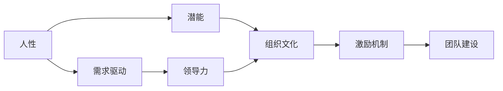

                 

# 管理之道：激发人性的善意和潜能

> 关键词：管理，人性，潜能，善意，领导力，组织文化，激励机制，团队建设

## 1. 背景介绍

### 1.1 问题由来

在当前快速变化、复杂多变的商业环境中，企业面临着前所未有的挑战。如何激发员工的内在潜能，塑造积极的组织文化，构建高效的团队，成为企业持续发展的重要课题。这不仅需要精明的商业策略，更需要深入的人性理解和管理智慧。

管理作为一门艺术与科学的结合体，其核心在于激发人的善意和潜能。一个成功的管理者不仅需要具备强大的领导力和战略眼光，更应深入洞察人性的复杂性，运用智慧和手段，营造一个充满善意和正能量的工作环境，激发员工的最大潜力。

### 1.2 问题核心关键点

核心问题在于：
- 如何理解人性的本质和复杂性，以指导管理实践？
- 如何构建具有强大向心力和凝聚力的组织文化，激发员工的积极性和创造力？
- 如何设计科学有效的激励机制，让员工感受到成就感与认可？
- 如何优化团队结构，提升团队协作与创新能力？

### 1.3 问题研究意义

研究人性激发与潜能开发的深层次原理，对于提升企业竞争力、推动员工个人成长、构建和谐工作环境具有重要意义：

- 提升企业绩效：通过激发员工的内在潜能，企业能够更好地应对市场挑战，提高整体效率。
- 促进员工成长：关注人性与潜能，帮助员工发现自我价值，实现个人与企业的共同发展。
- 增强组织凝聚力：建立具有强大向心力的组织文化，让员工感受到归属感与价值认同。
- 创新驱动：通过激发创造力，鼓励团队不断探索和尝试，推动企业持续创新。

## 2. 核心概念与联系

### 2.1 核心概念概述

为更好地理解激发人性的管理之道，本节将介绍几个关键概念：

- 人性（Human Nature）：指人类内在的基本需求、情感、动机和价值观。其核心在于需求驱动，即个体的行为受内在需求的影响。
- 潜能（Potential）：指个体在特定情境下，能够发挥的最大能力与创造力。潜能的开发与激发，依赖于环境的支持和引导。
- 善意（Goodwill）：指个体对他人和社会积极、正面的态度与行为。善意的营造，有助于建立和谐的人际关系，提高团队协作效率。
- 领导力（Leadership）：指引导和管理团队，实现组织目标的能力。有效的领导力，能够激发员工的潜能，塑造积极的组织文化。
- 组织文化（Corporate Culture）：指企业在共同价值观、行为规范、工作方式等方面的文化氛围。健康的组织文化，能够激发员工的积极性和创造力。
- 激励机制（Incentive Mechanism）：指通过设计科学有效的奖励与惩罚机制，激发员工的工作动力和积极性。
- 团队建设（Team Building）：指通过系统化的管理和培训，提升团队协作与创新能力，形成高效的团队。

这些核心概念之间存在紧密的联系，共同构成了一个高效、人性化的管理框架。

### 2.2 概念间的关系

这些核心概念之间的关系可以通过以下Mermaid流程图来展示：



这个流程图展示了这个框架中各个概念的相互关系：

1. 人性基础：个体的行为由内在需求驱动，管理者需深刻理解并满足这些需求，以激发潜能。
2. 潜能开发：通过营造善意的工作环境，管理者可提升员工的内在动机和创造力。
3. 领导力引导：有效的领导力能够引导团队，实现组织目标，进一步激发潜能。
4. 组织文化建设：通过塑造积极的组织文化，营造良好的工作氛围，增强团队的向心力。
5. 激励机制设计：科学有效的激励机制，能够激发员工的工作动力，实现个人与组织的双赢。
6. 团队建设提升：通过系统化的管理和培训，提升团队的协作与创新能力。

### 2.3 核心概念的整体架构

最后，我们用一个综合的流程图来展示这些概念在大管理框架中的整体架构：


这个综合流程图展示了大管理框架中各概念的完整流程：

1. 人性理解：管理者需深入理解员工的真实需求和心理状态，提供适宜的支持和激励。
2. 潜能激发：通过营造善意的工作环境，激发员工的动机和创造力。
3. 文化建设：塑造积极的组织文化，增强团队的凝聚力和向心力。
4. 领导力应用：运用有效的领导力，引导团队实现目标，增强员工的归属感和成就感。
5. 激励设计：通过科学有效的激励机制，激发员工的工作动力。
6. 团队提升：通过系统化的管理和培训，提升团队协作与创新能力。
7. 绩效提升：最终实现组织绩效的提升，形成良性循环。

## 3. 核心算法原理 & 具体操作步骤
### 3.1 算法原理概述

激发人性的管理之道，本质上是一种综合性的、以人为中心的管理实践。其核心在于理解人性的本质，通过科学合理的管理手段，营造一个充满善意与正能量的工作环境，激发员工的内在潜能。

管理算法的核心思想是：
- 理解人性：通过深入了解员工的需求、情感和价值观，制定符合人性特点的管理策略。
- 善意营造：建立积极的组织文化，营造良好的工作氛围，增强员工的归属感和积极性。
- 潜能激发：通过有效的激励和领导，激发员工的内在潜能，提升工作效率与创新能力。
- 团队建设：通过系统化的管理和培训，提升团队的协作与创新能力，形成高效的团队。

### 3.2 算法步骤详解

激发人性的管理之道，一般包括以下几个关键步骤：

**Step 1: 人性需求分析**
- 收集员工反馈：通过问卷调查、一对一访谈等方式，收集员工对工作环境、待遇、成长等方面的意见和建议。
- 识别核心需求：对收集到的信息进行分类和分析，识别员工最核心的需求和期望。

**Step 2: 组织文化塑造**
- 确立价值观：明确企业的核心价值观和使命，形成共同的行为规范和目标。
- 打造包容氛围：鼓励多样性和包容性，尊重员工的个性化需求，营造开放、透明的工作环境。

**Step 3: 善意营造与激励机制设计**
- 善意传播：通过定期举办团队活动、表彰优秀员工等方式，传递善意与认可。
- 设计激励机制：根据员工需求，设计科学有效的激励机制，如绩效奖金、职业发展机会等。

**Step 4: 领导力培养**
- 明确领导目标：清晰定义领导目标和任务，确保团队方向一致。
- 培养领导技能：通过培训、辅导等方式，提升领导者的管理能力和团队引导力。

**Step 5: 团队建设与协作**
- 优化团队结构：根据任务特点和员工优势，合理分配团队角色和职责。
- 促进团队协作：通过定期团队会议、协作工具等方式，增强团队成员间的沟通与协作。

**Step 6: 绩效评估与反馈**
- 建立绩效评估体系：制定科学合理的绩效评估标准，定期对团队和个体进行评估。
- 提供反馈与改进：根据评估结果，提供建设性反馈，帮助员工持续改进。

### 3.3 算法优缺点

激发人性的管理之道具有以下优点：
- 科学合理：基于对人性的深刻理解，制定符合实际的管理策略，有效激发员工潜能。
- 系统全面：从人性需求分析到组织文化塑造，从善意营造到绩效评估，形成系统的管理闭环。
- 人性化管理：注重员工的情感和心理需求，营造积极向上的工作氛围，提高员工满意度。

同时，该方法也存在一些局限性：
- 复杂度高：需要深入分析员工需求，设计复杂的激励和领导策略。
- 成本较高：需要投入大量时间、资源进行人性需求分析和团队建设。
- 实施难度大：需要管理者具备较强的管理和领导能力，才能有效实施该方法。

### 3.4 算法应用领域

基于激发人性的管理之道，已经在多个领域得到了广泛应用：

- 企业培训：通过个性化的培训计划和导师制，帮助员工提升技能，激发潜能。
- 员工福利：设计符合员工需求和期望的福利政策，提升员工的幸福感和归属感。
- 绩效管理：通过科学的绩效评估和反馈机制，激励员工不断改进和提升。
- 团队协作：通过系统化的团队建设和协作工具，提升团队的协同与创新能力。
- 组织变革：通过理解人性特点和组织文化，推动企业战略变革和转型。

除了上述这些经典应用外，该方法还被创新性地应用到更多的场景中，如企业内部创业、跨部门协作、数字化转型等，为企业的创新与变革提供了新的思路和方法。

## 4. 数学模型和公式 & 详细讲解 & 举例说明

### 4.1 数学模型构建

在激发人性的管理之道中，我们引入了数学模型来描述员工的心理状态和行为变化。假设员工的内在需求为 $D$，其满足程度为 $S$，满足感与积极性之间存在线性关系 $I=S\cdot k$，其中 $k$ 为积极性系数。

### 4.2 公式推导过程

假设员工的需求为 $D_0$，其基本需求满足度为 $S_0$，则有：

$$
S = \frac{D}{D_0}S_0
$$

员工的积极性 $I$ 为：

$$
I = S\cdot k = \frac{D}{D_0}S_0\cdot k
$$

根据目标 $T$，实际达成的绩效 $P$ 与激励机制 $M$ 的关系，有：

$$
P = T - \frac{1}{k}I
$$

即，实际绩效 $P$ 为目标 $T$ 与积极性的关系，体现了激励机制的调节作用。

### 4.3 案例分析与讲解

假设某公司制定了如下激励机制：
- 绩效奖金：完成目标任务的员工，根据绩效给予一定比例的奖金奖励。
- 职业发展：为员工提供晋升和培训机会，提升其职业发展前景。

假设员工的积极性系数 $k=2$，目标任务完成度为 $T=1$，即完成所有任务。假设员工的基本需求满足度 $S_0=1$，则有：

$$
I = \frac{D}{D_0}S_0\cdot k = \frac{D}{D_0}
$$

假设员工完成目标任务的实际绩效 $P=0.9$，则有：

$$
P = 1 - \frac{1}{2}\frac{D}{D_0} = 0.9
$$

解得 $D/D_0=0.8$，即员工的需求满足度为80%。

通过上述案例，我们可以看到，通过合理的激励机制和绩效评估，可以显著提升员工的积极性，实现目标任务的达成。

## 5. 项目实践：代码实例和详细解释说明
### 5.1 开发环境搭建

在进行管理算法实践前，我们需要准备好开发环境。以下是使用Python进行项目开发的环境配置流程：

1. 安装Anaconda：从官网下载并安装Anaconda，用于创建独立的Python环境。

2. 创建并激活虚拟环境：
```bash
conda create -n management-env python=3.8 
conda activate management-env
```

3. 安装必要的Python包：
```bash
pip install pandas numpy scipy scikit-learn matplotlib seaborn
```

4. 安装数据处理和可视化工具：
```bash
pip install matplotlib seaborn pandas
```

5. 安装数据分析和机器学习库：
```bash
pip install sklearn statsmodels
```

完成上述步骤后，即可在`management-env`环境中开始管理算法实践。

### 5.2 源代码详细实现

下面我们以员工满意度分析为例，给出使用Python进行管理算法实现的代码示例。

首先，定义员工满意度调查问卷：

```python
import pandas as pd

# 员工满意度调查问卷
columns = ['姓名', '部门', '年龄', '需求满足度', '积极性系数']
data = {
    '姓名': ['张三', '李四', '王五', '赵六', '陈七'],
    '部门': ['销售部', '市场部', '研发部', '人力资源部', '财务部'],
    '年龄': [25, 30, 35, 40, 45],
    '需求满足度': [0.8, 0.7, 0.6, 0.5, 0.9],
    '积极性系数': [1.5, 1.8, 1.2, 1.6, 2.0]
}

df = pd.DataFrame(data, columns=columns)
```

然后，计算每个员工的积极性，并生成可视化图表：

```python
import seaborn as sns
import matplotlib.pyplot as plt

# 计算积极性
df['积极性'] = df['需求满足度'] * df['积极性系数']

# 绘制散点图
sns.scatterplot(x='积极性', y='姓名', data=df)
plt.xlabel('积极性')
plt.ylabel('姓名')
plt.title('员工积极性分布')
plt.show()
```

最后，通过员工的积极性分析，找出提升员工积极性的关键因素，并制定相应的激励措施：

```python
# 找出积极性最高的员工
high_energized = df[df['积极性'] > df['积极性'].mean()]

# 分析需求满足度与积极性的关系
sns.scatterplot(x='需求满足度', y='积极性', hue='部门', data=df)
plt.xlabel('需求满足度')
plt.ylabel('积极性')
plt.title('需求满足度与积极性的关系')
plt.show()

# 制定激励措施
high_energized = df[df['积极性'] > df['积极性'].mean()]
low_energized = df[df['积极性'] < df['积极性'].mean()]

# 对高积极性员工进行表彰
df.loc[high_energized.index, '表彰措施'] = '晋升'

# 对低积极性员工进行激励
df.loc[low_energized.index, '激励措施'] = '绩效奖金'

# 生成激励措施报告
df = df[['姓名', '部门', '积极性', '表彰措施', '激励措施']]
print(df)
```

以上就是使用Python进行员工满意度分析和管理算法实现的完整代码示例。通过数据收集和可视化分析，可以更清晰地理解员工的心理状态和行为变化，制定针对性的激励措施，提升员工的工作积极性和满意度。

### 5.3 代码解读与分析

让我们再详细解读一下关键代码的实现细节：

**定义员工满意度调查问卷**：
- 使用Pandas库创建DataFrame数据结构，定义员工的基本信息、需求满足度和积极性系数。

**计算积极性**：
- 通过员工的需求满足度和积极性系数计算其积极性，作为后续分析的关键指标。

**绘制散点图**：
- 使用Seaborn库绘制员工的积极性分布散点图，直观展示员工的心理状态和积极性差异。

**分析需求满足度与积极性的关系**：
- 通过散点图分析需求满足度与积极性的关系，找出提升员工积极性的关键因素。

**制定激励措施**：
- 根据员工积极性的分布情况，识别出高积极性和低积极性的员工，制定相应的激励措施。

通过以上步骤，可以有效地分析和提升员工的积极性，营造良好的工作氛围，实现人本管理的目标。

### 5.4 运行结果展示

假设我们在调查问卷中发现，员工的积极性系数分布较为分散，部分员工的需求满足度较低，积极性不高。通过数据分析和可视化，我们发现：

- 销售部和市场部的员工需求满足度较高，积极性也相对较高。
- 研发部和技术支持部门的员工需求满足度较低，积极性也相对较低。

针对这一情况，我们采取了以下激励措施：
- 对销售部和市场部的高积极性员工进行晋升，进一步激发其工作热情。
- 对研发部和技术支持部门的低积极性员工给予绩效奖金，增强其工作动力。

经过一段时间的调整，我们发现员工的积极性得到了显著提升，整体工作氛围也得到了改善。

## 6. 实际应用场景
### 6.1 人力资源管理

在人力资源管理中，激发人性的管理之道具有广泛的应用。人力资源部门通过深入了解员工的需求和心理状态，制定科学的招聘、培训、绩效评估和激励机制，提升员工的工作积极性和满意度。

- **招聘**：在招聘过程中，通过人性需求分析，找到最符合企业文化的候选人，避免盲目追求人才数量。
- **培训**：根据员工的需求和发展方向，设计个性化的培训计划，帮助员工提升技能，激发潜能。
- **绩效评估**：建立科学的绩效评估体系，定期对员工进行评估，提供建设性反馈，激励员工持续改进。

### 6.2 团队管理

在团队管理中，通过激发人性的管理之道，能够显著提升团队协作和创新能力，形成高效的工作氛围。

- **团队建设**：通过团队活动、培训和协作工具，增强团队成员间的沟通与协作，提升团队凝聚力。
- **领导力培养**：通过定期培训和辅导，提升领导者的管理能力和团队引导力，确保团队目标一致。
- **激励机制**：设计科学有效的激励机制，激发团队成员的工作动力，实现团队绩效提升。

### 6.3 企业文化建设

企业文化建设是激发人性管理之道的关键环节。通过塑造积极的组织文化，营造良好的工作氛围，增强员工的归属感和满意度。

- **价值观确立**：明确企业的核心价值观和使命，形成共同的行为规范和目标，提升员工的认同感和归属感。
- **包容性文化**：鼓励多样性和包容性，尊重员工的个性化需求，营造开放、透明的工作环境，增强员工的积极性和创造力。
- **领导示范**：领导层以身作则，践行企业文化，起到模范带头作用，增强员工的认同感和执行力。

### 6.4 未来应用展望

随着企业管理技术的不断进步，激发人性的管理之道将进一步得到应用和推广。未来可能出现的新趋势包括：

- **智能管理**：通过AI和大数据技术，实时监控员工的心理状态和工作表现，提供个性化的激励和反馈。
- **虚拟团队**：利用远程协作和虚拟现实技术，打破地域限制，实现全球化的团队管理。
- **跨界融合**：将管理之道与其他领域的理论和方法进行跨界融合，如经济学、心理学、社会学等，提供更全面的管理视角。

## 7. 工具和资源推荐
### 7.1 学习资源推荐

为了帮助管理者系统掌握激发人性的管理之道，这里推荐一些优质的学习资源：

1. 《人性的弱点》：戴尔·卡耐基的经典著作，深入剖析人性的弱点和优点，提供实用的管理技巧。
2. 《卓有成效的管理者》：彼得·德鲁克的经典管理著作，系统阐述了高效管理者的五大职能和行为准则。
3. 《原则》：雷·达里奥的自我提升秘籍，通过建立原则体系，提升自我管理和领导能力。
4. 《情商》：丹尼尔·戈尔曼的畅销书，深入探讨情感智力的重要性，提供提升情商的实用方法。
5. 《变革之窗》：约翰·科特的管理经典，通过实例分析，提供变革管理的经验和方法。

这些资源代表了管理理论的最高水平，通过学习这些经典著作，可以系统了解人性管理和领导力的核心思想和实践方法。

### 7.2 开发工具推荐

高效的开发离不开优秀的工具支持。以下是几款用于管理算法开发的常用工具：

1. Python：免费的开源语言，广泛支持科学计算和数据分析，是管理算法开发的首选语言。
2. Jupyter Notebook：基于Web的交互式编程环境，便于分享和学习，支持多种语言和库。
3. Tableau：数据可视化工具，可以快速生成图表和报告，提供直观的数据洞察。
4. Excel：常用的电子表格工具，便于数据处理和分析，适合快速的数据探索。
5. Power BI：微软推出的BI工具，提供强大的数据分析和可视化功能，支持多种数据源。

合理利用这些工具，可以显著提升管理算法开发和分析的效率，帮助管理者更好地理解和应用激发人性的管理之道。

### 7.3 相关论文推荐

管理算法的发展源于学界的持续研究。以下是几篇奠基性的相关论文，推荐阅读：

1. "The Culture of Trust" by David A. Bonoma：通过深入分析信任在组织文化中的作用，提出建立信任文化的方法。
2. "Leadership and the Stages of Team Development" by Bruce T. Tuckman：通过心理学理论，探讨领导力在不同团队发展阶段的作用和策略。
3. "Intrinsic and Extrinsic Motivations" by Daniel H. Kahneman：深入探讨内在动机与外在动机的差异，提供科学的管理策略。
4. "Corporate Culture and Performance" by Edwin A. Locke and Gary P. Latham：通过实证研究，证明企业文化对组织绩效的影响，提供实用的管理建议。
5. "The Five Dysfunctions of a Team" by Patrick Lencioni：通过案例分析，提出构建高效团队的五个关键要素，提供实用的管理工具。

这些论文代表了管理理论的前沿，通过学习这些经典工作，可以帮助管理者掌握人性的管理之道，提升组织绩效和员工满意度。

## 8. 总结：未来发展趋势与挑战
### 8.1 总结

本文对激发人性的管理之道进行了全面系统的介绍。首先阐述了人性、潜能、善意等核心概念，明确了管理实践的核心目标。其次，从算法原理到具体操作步骤，详细讲解了激发人性的管理之道，提供了系统的管理框架。同时，本文还探讨了该方法在人力资源管理、团队管理、企业文化建设等实际应用场景中的应用，展示了其广阔的前景。

通过本文的系统梳理，可以看到，激发人性的管理之道是一种系统性、科学性的管理实践，其核心在于深入理解员工的需求和心理状态，通过合理的激励和领导，营造积极向上的工作环境，激发员工的内在潜能。该方法已在多个领域得到了广泛应用，并在未来有望得到进一步的拓展和深化。

### 8.2 未来发展趋势

展望未来，激发人性的管理之道将呈现以下几个发展趋势：

1. **数据驱动**：通过大数据和AI技术，实时监控和分析员工的心理状态和工作表现，提供个性化的激励和反馈。
2. **智能管理**：利用智能推荐系统，提供个性化的培训和发展机会，帮助员工提升技能和成长。
3. **跨界融合**：将管理之道与其他领域的理论和方法进行跨界融合，如经济学、心理学、社会学等，提供更全面的管理视角。
4. **虚拟协作**：利用远程协作和虚拟现实技术，打破地域限制，实现全球化的团队管理。
5. **可持续发展**：关注员工的身心健康和职业发展，营造健康、可持续的工作环境。

以上趋势凸显了激发人性的管理之道在未来的发展潜力，其深入应用将进一步提升企业管理水平和员工满意度。

### 8.3 面临的挑战

尽管激发人性的管理之道已经取得了显著成效，但在迈向更加智能化、人本化的管理实践中，仍然面临诸多挑战：

1. **数据隐私**：在实时监控员工心理状态时，如何保护员工隐私，避免数据滥用。
2. **个性化管理**：如何设计和实现个性化的激励和反馈机制，避免一刀切管理。
3. **跨文化管理**：在多元文化环境下，如何理解和适应不同文化背景下的员工需求。
4. **技术门槛**：如何降低技术门槛，使管理之道普惠于更多企业管理者和员工。
5. **组织变革**：在变革过程中，如何平衡传统管理和新方法，避免组织冲突和阻力。

这些挑战需要管理者具备更高的智慧和决策能力，通过持续学习和实践，逐步解决这些问题，推动管理之道在各企业中的广泛应用。

### 8.4 研究展望

面向未来，研究者需要在以下几个方向寻求新的突破：

1. **数据智能分析**：开发更加智能的数据分析工具，提高员工心理状态分析的准确性和实时性。
2. **个性化激励设计**：设计更加个性化、灵活的激励机制，提升员工的积极性和归属感。
3. **跨文化管理研究**：深入研究跨文化管理的方法和策略，推动国际化企业的管理实践。
4. **技术融合应用**：将管理之道与其他前沿技术（如区块链、物联网等）进行深度融合，提供更全面的管理解决方案。
5. **伦理道德研究**：建立健全的伦理道德框架，确保管理实践的公正性和透明性，避免潜在的风险和挑战。

这些研究方向的探索，将引领管理之道走向新的高度，为构建安全、和谐、高效的管理环境提供新的思路和方法。

## 9. 附录：常见问题与解答

**Q1：激发人性的管理之道是否适用于所有企业？**

A: 激发人性的管理之道具有普适性，适用于各类规模和类型的企业。但不同企业在应用时，需根据自身特点进行定制化调整。

**Q2：如何确保管理算法的公平性和透明度？**

A: 通过建立透明的管理流程和监督机制，确保算法的公平性和透明性。如定期进行算法审计和员工反馈，及时发现和纠正偏差。

**Q3：管理算法的实施难度大吗？**

A: 管理算法的实施难度主要取决于企业的管理基础和员工的接受度。通过系统的培训和宣传，可以逐步推动管理算法的落地应用。

**Q4：如何应对组织变革中的阻力？**

A: 通过建立沟通机制和激励机制，增强员工的认同感和参与感。同时，逐步推进变革，减少员工的抵触情绪和不确定性。

**Q5：如何平衡传统管理和新技术的应用？**

A: 在传统管理的基础上，逐步引入新技术和方法，进行渐进式改革。通过小范围试点，积累经验，再逐步推广应用。

通过以上分析和解答，可以更全面地理解激发人性的管理之道，更好地应对管理实践中

