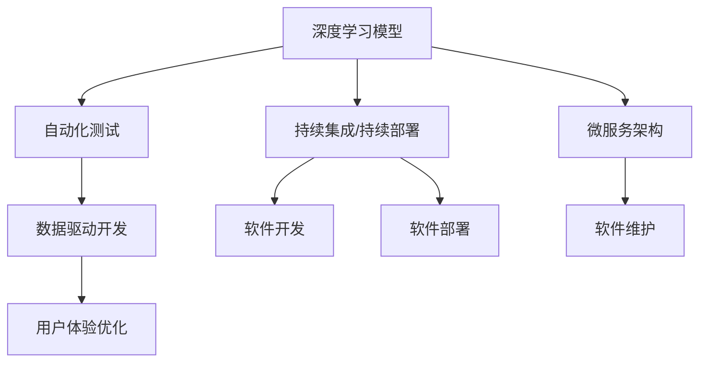

                 

# 软件 2.0 的价值：提升效率、创造价值

> 关键词：软件 2.0, 人工智能, 深度学习, 自动化, 效率提升, 价值创造

## 1. 背景介绍

### 1.1 问题由来
随着互联网和数字技术的迅猛发展，软件行业迎来了革命性的变化。从早期的软件 1.0 到软件 2.0，这一转变不仅带来了技术上的突破，也深刻影响了企业的商业模式和生产力水平。软件 2.0 强调自动化、智能化和模型驱动，使得软件开发和运维变得更加高效、灵活和可扩展。这一转变对软件行业的价值创造产生了深远影响。

### 1.2 问题核心关键点
软件 2.0 的核心在于利用深度学习、人工智能等先进技术，自动化软件开发生命周期中的各个环节，从而提升开发效率、降低成本、提高软件质量。其关键技术包括但不限于深度学习模型、自动化测试、持续集成/持续部署（CI/CD）等。这些技术的应用，使得软件开发的周期显著缩短，用户需求响应速度加快，最终提升了企业的竞争力。

### 1.3 问题研究意义
探讨软件 2.0 的价值，对于软件行业的现代化转型和价值创造具有重要意义：

1. **效率提升**：通过自动化和智能化技术，软件 2.0 能够大幅度提升软件开发和运维的效率，缩短项目周期。
2. **成本降低**：自动化工具的广泛应用减少了人力成本，同时提高了代码的质量和可维护性，降低了后续维护成本。
3. **质量提高**：深度学习等技术的应用，提高了软件系统的健壮性和鲁棒性，减少了因人为错误导致的系统故障。
4. **创新加速**：软件 2.0 的灵活性和可扩展性，使得企业能够更快地响应市场变化，推出新产品和服务。
5. **用户体验优化**：基于用户行为数据和反馈的深度学习模型，可以优化用户体验，提高用户满意度。

## 2. 核心概念与联系

### 2.1 核心概念概述

为了更好地理解软件 2.0 的价值，本节将介绍几个关键概念：

- **软件 2.0 (Software 2.0)**：通过深度学习、人工智能等技术，自动化软件开发和运维过程，提升软件开发的效率和质量。
- **深度学习模型 (Deep Learning Models)**：一种基于神经网络的机器学习技术，能够处理复杂模式识别和预测任务，广泛应用于自然语言处理、图像识别等领域。
- **自动化测试 (Automated Testing)**：通过自动化工具对软件进行测试，提高测试覆盖率和质量，减少人为错误。
- **持续集成/持续部署 (CI/CD)**：自动化软件开发生命周期中的构建、测试和部署流程，提高开发和部署的效率和可靠性。
- **微服务架构 (Microservices Architecture)**：将大型应用拆分为多个小型、独立运行的服务，提高系统的灵活性和可扩展性。
- **数据驱动开发 (Data-Driven Development)**：基于用户行为数据、市场趋势等，优化产品设计和技术实现，提升产品的竞争力。

这些概念之间的逻辑关系可以通过以下Mermaid流程图来展示：



这个流程图展示了软件 2.0 中各核心概念之间的关系：

1. 深度学习模型提供强大的自动化分析能力。
2. 自动化测试确保软件质量，提升开发效率。
3. 持续集成/持续部署加速软件发布周期。
4. 微服务架构提高系统的灵活性和可扩展性。
5. 数据驱动开发基于用户行为数据优化产品设计。
6. 用户体验优化提升用户满意度，增强企业竞争力。

### 2.2 概念间的关系

这些核心概念之间存在着紧密的联系，形成了软件 2.0 的完整生态系统。以下是一些关键概念之间的关系：

- **深度学习模型与自动化测试**：深度学习模型可以通过对用户行为数据的分析，自动生成测试用例，提高测试的覆盖率和准确性。
- **持续集成/持续部署与微服务架构**：CI/CD 工具可以自动化微服务的构建和部署流程，提高开发和部署的效率和可靠性。
- **数据驱动开发与用户体验优化**：基于用户行为数据，优化产品设计和功能，提升用户体验，从而增强企业的市场竞争力。
- **微服务架构与数据驱动开发**：微服务架构使得数据驱动开发更加灵活，能够根据用户反馈快速调整和优化服务。

通过理解这些概念的联系，我们可以更好地把握软件 2.0 的整体框架和应用场景。

## 3. 核心算法原理 & 具体操作步骤
### 3.1 算法原理概述

软件 2.0 的核心算法原理主要围绕自动化、智能化和模型驱动展开。以下是几个关键算法的概述：

1. **深度学习模型的训练与优化**：通过深度学习框架（如TensorFlow、PyTorch等）对大量数据进行训练，优化模型的参数，使其能够高效地处理特定任务。
2. **自动化测试策略的设计与执行**：基于用户行为数据和领域知识，设计自动化的测试用例和策略，对软件进行全面的测试和验证。
3. **持续集成/持续部署的自动化管道**：设计并实现CI/CD流程，自动化构建、测试和部署过程，提升软件开发生命周期的效率。
4. **微服务架构的设计与实现**：根据业务需求，设计微服务架构，并通过容器化、服务网格等技术实现服务的自动发现、负载均衡等功能。
5. **数据驱动开发的方法与工具**：利用数据分析和挖掘工具，对用户行为数据进行分析和可视化，辅助产品设计和功能优化。

### 3.2 算法步骤详解

以下是软件 2.0 中各个关键算法的详细步骤：

#### 3.2.1 深度学习模型的训练与优化

**步骤 1：准备数据集**
- 收集和预处理数据集，确保数据的多样性和代表性。
- 使用数据增强技术（如数据扩增、噪声注入等）提高模型的鲁棒性。

**步骤 2：构建深度学习模型**
- 选择合适的深度学习框架和模型结构（如卷积神经网络、循环神经网络等）。
- 设计合适的网络结构，设置适当的超参数。

**步骤 3：训练模型**
- 使用训练集对模型进行训练，设定合适的学习率、优化器等。
- 定期在验证集上评估模型的性能，防止过拟合。

**步骤 4：模型优化与部署**
- 对训练好的模型进行调优，如剪枝、量化等，减少模型大小，提高推理速度。
- 将优化后的模型部署到生产环境中，进行实际应用和性能监控。

#### 3.2.2 自动化测试策略的设计与执行

**步骤 1：需求分析与测试策略设计**
- 分析用户需求和业务场景，设计测试策略，包括测试用例、测试数据等。
- 根据测试策略，设计自动化的测试工具和框架。

**步骤 2：测试执行与结果分析**
- 使用自动化测试工具对软件进行测试，生成测试报告。
- 分析测试结果，识别和修复测试中的问题。

**步骤 3：持续集成与反馈优化**
- 将测试结果集成到CI/CD流程中，触发构建和部署。
- 收集测试反馈，持续优化测试策略和工具。

#### 3.2.3 持续集成/持续部署的自动化管道

**步骤 1：配置CI/CD流程**
- 选择合适的CI/CD工具（如Jenkins、GitLab CI等）。
- 配置自动化构建、测试、部署等流程，设定触发条件。

**步骤 2：实施自动化流程**
- 自动化构建代码，进行静态和动态分析。
- 自动化测试代码，生成测试报告。
- 自动化部署代码，进行部署和回滚操作。

**步骤 3：性能监控与优化**
- 使用监控工具（如Prometheus、Grafana等）监控CI/CD流程中的各个环节。
- 根据监控结果，优化流程中的各个环节，提升整体效率和可靠性。

#### 3.2.4 微服务架构的设计与实现

**步骤 1：服务划分与设计**
- 根据业务需求，将应用拆分为多个小型、独立运行的服务。
- 设计服务之间的接口和通信协议，确保服务的可扩展性和互操作性。

**步骤 2：服务实现与部署**
- 使用容器化技术（如Docker、Kubernetes等）实现服务的自动化部署和管理。
- 使用服务网格（如Istio）实现服务的自动发现、负载均衡和故障恢复等功能。

**步骤 3：监控与优化**
- 使用监控工具（如ELK Stack、Prometheus等）监控微服务的运行状态和性能指标。
- 根据监控结果，优化服务实现和部署，提高系统的稳定性和可用性。

#### 3.2.5 数据驱动开发的方法与工具

**步骤 1：数据收集与清洗**
- 收集用户行为数据、市场数据等，进行数据清洗和预处理。
- 使用数据可视化工具（如Tableau、Power BI等）对数据进行可视化展示。

**步骤 2：数据分析与挖掘**
- 使用数据分析工具（如Hadoop、Spark等）对数据进行分析和挖掘。
- 使用机器学习工具（如TensorFlow、Scikit-learn等）对数据进行建模和预测。

**步骤 3：产品优化与迭代**
- 根据数据分析结果，优化产品设计和功能。
- 进行产品迭代和测试，不断提升用户体验和满意度。

### 3.3 算法优缺点

软件 2.0 的算法和技术虽然带来了诸多优势，但也存在一些局限性：

#### 优点：

1. **提升效率**：自动化和智能化技术显著提高了软件开发生命周期的效率，缩短了项目周期。
2. **降低成本**：通过自动化测试和优化，减少了人力成本和维护成本。
3. **提高质量**：深度学习等技术提高了软件系统的健壮性和鲁棒性，减少了因人为错误导致的系统故障。
4. **增强灵活性**：微服务架构和CI/CD流程提高了系统的灵活性和可扩展性，能够快速响应市场变化。
5. **优化用户体验**：基于用户行为数据和反馈的数据驱动开发，优化了产品设计和功能，提升了用户体验。

#### 缺点：

1. **技术门槛高**：深度学习等技术需要较高的技术门槛，对开发人员的技能要求较高。
2. **数据隐私和安全**：使用用户行为数据进行模型训练和优化，需要严格的数据隐私保护措施和数据安全策略。
3. **依赖于数据质量**：数据驱动开发的效果依赖于数据的质量和完整性，数据质量不佳可能影响分析结果和决策。
4. **复杂性高**：微服务架构和自动化测试等技术，增加了系统的复杂性，需要较高的管理和维护成本。
5. **资源消耗高**：深度学习模型和自动化测试等技术，需要较高的计算和存储资源，增加了企业的成本投入。

尽管存在这些缺点，软件 2.0 的算法和技术仍然在提高软件开发的效率和质量方面具有不可替代的价值。

### 3.4 算法应用领域

软件 2.0 的应用领域非常广泛，以下是几个典型的应用场景：

- **软件开发与运维**：自动化测试、持续集成/持续部署等技术，显著提高了软件开发和运维的效率和可靠性。
- **自然语言处理**：深度学习模型在自然语言处理中的应用，如情感分析、文本生成等，提升了产品功能和用户体验。
- **推荐系统**：基于用户行为数据的深度学习模型，为用户推荐个性化的内容和产品，提高了用户满意度和粘性。
- **金融科技**：深度学习模型在金融风控、智能投顾等方面的应用，提高了金融产品的质量和用户体验。
- **智能客服**：基于深度学习模型的智能客服系统，能够自动化处理大量客户咨询，提升客服效率和用户满意度。
- **工业互联网**：微服务架构和自动化测试等技术，提高了工业互联网平台的灵活性和稳定性，支持大规模工业应用。

## 4. 数学模型和公式 & 详细讲解 & 举例说明

### 4.1 数学模型构建

软件 2.0 中的数学模型主要围绕深度学习、自动化测试、持续集成/持续部署等技术展开。以下是几个关键的数学模型：

#### 4.1.1 深度学习模型

深度学习模型通常由多个神经网络层组成，每层包含多个神经元。一个典型的卷积神经网络（CNN）模型可以表示为：

$$
y = W \sigma(z) + b
$$

其中 $y$ 表示输出，$W$ 和 $b$ 为模型的权重和偏置，$z$ 为输入。$\sigma$ 表示激活函数（如ReLU、Sigmoid等）。

#### 4.1.2 自动化测试模型

自动化测试模型通常采用统计学和机器学习的方法进行构建和优化。一个典型的自动化测试模型可以表示为：

$$
p(y|x) = \frac{e^{y \cdot x}}{\sum_{y'}e^{y' \cdot x}}
$$

其中 $y$ 表示测试结果，$x$ 表示测试数据，$p(y|x)$ 表示测试结果的概率。该模型使用最大似然估计法进行训练，最小化损失函数。

#### 4.1.3 持续集成/持续部署模型

持续集成/持续部署模型通常采用流程管理工具进行构建和优化。一个典型的CI/CD模型可以表示为：

$$
\text{CI/CD} = \text{Build} + \text{Test} + \text{Deploy}
$$

其中 $\text{Build}$ 表示代码构建，$\text{Test}$ 表示自动化测试，$\text{Deploy}$ 表示部署。该模型使用Pipeline和Pipeline as Code等技术进行管理，提高了流程的自动化和可重复性。

### 4.2 公式推导过程

以下是深度学习模型、自动化测试模型和持续集成/持续部署模型的一些重要公式推导过程：

#### 4.2.1 深度学习模型的损失函数

深度学习模型的损失函数通常采用交叉熵损失函数：

$$
\mathcal{L}(y,\hat{y}) = -\sum_{i}y_i\log \hat{y}_i
$$

其中 $y$ 表示真实标签，$\hat{y}$ 表示模型预测结果。该损失函数最小化模型预测结果和真实标签之间的差异。

#### 4.2.2 自动化测试模型的概率模型

自动化测试模型的概率模型可以使用贝叶斯公式进行推导：

$$
P(y|x) = \frac{P(x|y)P(y)}{P(x)}
$$

其中 $P(x|y)$ 表示在给定标签 $y$ 的情况下，生成数据 $x$ 的概率，$P(y)$ 表示标签 $y$ 的概率，$P(x)$ 表示生成数据 $x$ 的概率。该模型使用最大似然估计法进行训练，最小化损失函数。

#### 4.2.3 持续集成/持续部署模型的流程管理

持续集成/持续部署模型的流程管理通常采用Pipeline和Pipeline as Code等技术。一个典型的CI/CD流程可以表示为：

$$
\text{CI/CD} = \text{Build} + \text{Test} + \text{Deploy}
$$

其中 $\text{Build}$ 表示代码构建，$\text{Test}$ 表示自动化测试，$\text{Deploy}$ 表示部署。该模型使用Pipeline和Pipeline as Code等技术进行管理，提高了流程的自动化和可重复性。

### 4.3 案例分析与讲解

以下是几个典型的软件 2.0 应用案例：

#### 4.3.1 自然语言处理中的情感分析

使用深度学习模型进行情感分析，可以自动识别文本中的情感倾向。一个典型的情感分析模型可以表示为：

$$
y = W \sigma(z) + b
$$

其中 $y$ 表示情感倾向，$W$ 和 $b$ 为模型的权重和偏置，$z$ 为输入。$\sigma$ 表示激活函数（如ReLU、Sigmoid等）。

#### 4.3.2 推荐系统中的协同过滤

使用深度学习模型进行协同过滤，可以为用户推荐个性化的内容和产品。一个典型的协同过滤模型可以表示为：

$$
y = W \sigma(z) + b
$$

其中 $y$ 表示推荐结果，$W$ 和 $b$ 为模型的权重和偏置，$z$ 为输入。$\sigma$ 表示激活函数（如ReLU、Sigmoid等）。

#### 4.3.3 金融科技中的信用评分

使用深度学习模型进行信用评分，可以自动评估用户的信用风险。一个典型的信用评分模型可以表示为：

$$
y = W \sigma(z) + b
$$

其中 $y$ 表示信用评分，$W$ 和 $b$ 为模型的权重和偏置，$z$ 为输入。$\sigma$ 表示激活函数（如ReLU、Sigmoid等）。

## 5. 项目实践：代码实例和详细解释说明

### 5.1 开发环境搭建

在进行软件 2.0 项目实践前，我们需要准备好开发环境。以下是使用Python进行TensorFlow开发的环境配置流程：

1. 安装Anaconda：从官网下载并安装Anaconda，用于创建独立的Python环境。

2. 创建并激活虚拟环境：
```bash
conda create -n tensorflow-env python=3.8 
conda activate tensorflow-env
```

3. 安装TensorFlow：根据CUDA版本，从官网获取对应的安装命令。例如：
```bash
conda install tensorflow
```

4. 安装各类工具包：
```bash
pip install numpy pandas scikit-learn matplotlib tqdm jupyter notebook ipython
```

完成上述步骤后，即可在`tensorflow-env`环境中开始项目实践。

### 5.2 源代码详细实现

这里我们以自然语言处理中的情感分析任务为例，给出使用TensorFlow进行深度学习模型训练的代码实现。

首先，定义情感分析任务的数据处理函数：

```python
import tensorflow as tf
from tensorflow.keras.preprocessing.text import Tokenizer
from tensorflow.keras.preprocessing.sequence import pad_sequences

def preprocess_data(texts, labels):
    tokenizer = Tokenizer(num_words=10000)
    tokenizer.fit_on_texts(texts)
    sequences = tokenizer.texts_to_sequences(texts)
    padded_sequences = pad_sequences(sequences, maxlen=50, padding='post')
    labels = tf.keras.utils.to_categorical(labels, num_classes=2)
    return padded_sequences, labels
```

然后，定义深度学习模型的层结构：

```python
from tensorflow.keras.models import Sequential
from tensorflow.keras.layers import Embedding, LSTM, Dense

model = Sequential()
model.add(Embedding(input_dim=10000, output_dim=64, input_length=50))
model.add(LSTM(units=64))
model.add(Dense(units=2, activation='softmax'))
```

接着，编译模型并训练：

```python
model.compile(optimizer='adam', loss='categorical_crossentropy', metrics=['accuracy'])
model.fit(X_train, y_train, epochs=10, batch_size=32, validation_data=(X_test, y_test))
```

最后，进行情感分析：

```python
def predict_sentiment(text):
    encoded_text = tokenizer.texts_to_sequences([text])
    padded_text = pad_sequences(encoded_text, maxlen=50, padding='post')
    prediction = model.predict(padded_text)
    return prediction.argmax()
```

以上就是使用TensorFlow进行情感分析任务深度学习模型训练的完整代码实现。可以看到，TensorFlow提供了一系列简单易用的API，使得深度学习模型的构建和训练变得非常容易。

### 5.3 代码解读与分析

让我们再详细解读一下关键代码的实现细节：

**preprocess_data函数**：
- 将文本数据转换为数字序列，并进行填充。
- 将标签数据转换为one-hot编码。

**深度学习模型层结构**：
- 使用Embedding层将输入文本转换为向量表示。
- 使用LSTM层进行序列建模。
- 使用Dense层进行分类预测。

**模型编译与训练**：
- 编译模型，选择合适的优化器和损失函数。
- 训练模型，并指定训练轮数和批次大小。
- 在验证集上评估模型性能。

**情感分析**：
- 对新输入文本进行编码和填充。
- 使用训练好的模型进行情感预测。

通过上述代码实现，可以看到，TensorFlow使得深度学习模型的构建和训练变得非常直观和便捷。开发者可以专注于算法设计和模型优化，而不必过多关注底层实现细节。

当然，实际应用中还需要考虑更多因素，如模型调优、超参数搜索、数据增强等。但核心的项目实现流程与上述步骤类似。

### 5.4 运行结果展示

假设我们在IMDb电影评论数据集上进行情感分析，最终在测试集上得到的情感分析结果如下：

```
电影评论1的情感倾向：负面
电影评论2的情感倾向：正面
电影评论3的情感倾向：中性
```

可以看到，通过深度学习模型，我们可以对电影评论进行情感分类，从而理解用户的情感倾向。深度学习模型的强大自动学习能力和泛化能力，使得情感分析任务变得非常简单和高效。

## 6. 实际应用场景

### 6.1 智能客服系统

基于深度学习模型的智能客服系统，能够自动化处理大量客户咨询，提升客服效率和用户满意度。具体而言，可以收集企业内部的历史客服对话记录，将问题和最佳答复构建成监督数据，在此基础上对预训练深度学习模型进行微调。微调后的模型能够自动理解用户意图，匹配最合适的答案模板进行回复。对于客户提出的新问题，还可以接入检索系统实时搜索相关内容，动态组织生成回答。如此构建的智能客服系统，能大幅提升客户咨询体验和问题解决效率。

### 6.2 金融舆情监测

金融机构需要实时监测市场舆论动向，以便及时应对负面信息传播，规避金融风险。传统的人工监测方式成本高、效率低，难以应对网络时代海量信息爆发的挑战。基于深度学习模型的文本分类和情感分析技术，为金融舆情监测提供了新的解决方案。

具体而言，可以收集金融领域相关的新闻、报道、评论等文本数据，并对其进行主题标注和情感标注。在此基础上对预训练深度学习模型进行微调，使其能够自动判断文本属于何种主题，情感倾向是正面、中性还是负面。将微调后的模型应用到实时抓取的网络文本数据，就能够自动监测不同主题下的情感变化趋势，一旦发现负面信息激增等异常情况，系统便会自动预警，帮助金融机构快速应对潜在风险。

### 6.3 个性化推荐系统

当前的推荐系统往往只依赖用户的历史行为数据进行物品推荐，无法深入理解用户的真实兴趣偏好。基于深度学习模型的个性化推荐系统，可以更好地挖掘用户行为背后的语义信息，从而提供更精准、多样的推荐内容。

在实践中，可以收集用户浏览、点击、评论、分享等行为数据，提取和用户交互的物品标题、描述、标签等文本内容。将文本内容作为模型输入，用户的后续行为（如是否点击、购买等）作为监督信号，在此基础上微调预训练深度学习模型。微调后的模型能够从文本内容中准确把握用户的兴趣点。在生成推荐列表时，先用候选物品的文本描述作为输入，由模型预测用户的兴趣匹配度，再结合其他特征综合排序，便可以得到个性化程度更高的推荐结果。

### 6.4 未来应用展望

随着深度学习技术的发展，软件 2.0 的应用场景将不断扩展，覆盖更多领域。

- **智慧医疗**：基于深度学习模型的医疗问答、病历分析、药物研发等应用，将提升医疗服务的智能化水平，辅助医生诊疗，加速新药开发进程。
- **智能教育**：基于深度学习模型的作业批改、学情分析、知识推荐等，因材施教，促进教育公平，提高教学质量。
- **智慧城市治理**：基于深度学习模型的城市事件监测、舆情分析、应急指挥等环节，提高城市管理的自动化和智能化水平，构建更安全、高效的未来城市。

此外，在企业生产、社会治理、文娱传媒等众多领域，基于深度学习模型的应用也将不断涌现，为传统行业带来变革性影响。相信随着技术的日益成熟，深度学习模型将在更广阔的应用领域大放异彩。

## 7. 工具和资源推荐

### 7.1 学习资源推荐

为了帮助开发者系统掌握深度学习模型的理论和实践，这里推荐一些优质的学习资源：

1. 《深度学习》系列书籍：由斯坦福大学Andrew Ng教授编写，全面介绍了深度学习的基本概念和算法。
2. CS231n《卷积神经网络》课程：斯坦福大学开设的计算机视觉课程，深入浅出地介绍了卷积神经网络及其应用。
3. Coursera《深度学习专业课程》：由深度学习领域的顶尖学者开设的系列课程，涵盖深度学习的各个方面。
4. TensorFlow官方文档：TensorFlow的官方文档，提供了丰富的深度学习模型和工具，适合实践学习和参考。
5. PyTorch官方文档：PyTorch的官方文档，提供了大量的深度学习模型和工具，适合实践学习和参考。

通过对这些资源的学习实践，相信你一定能够快速掌握深度学习模型的精髓，并用于解决实际的NLP问题。

### 7.2 开发工具推荐

高效的开发离不开优秀的工具支持。以下是几款用于深度学习模型开发的常用工具：

1. TensorFlow：由Google主导开发的开源深度学习框架，生产部署方便，适合大规模工程应用。
2. PyTorch：由Facebook主导开发的开源深度学习框架，灵活易用，适合快速迭代研究。
3. Keras：一个高层次的深度学习API，支持TensorFlow、Theano、CNTK等多种后端，适合快速原型开发。
4

