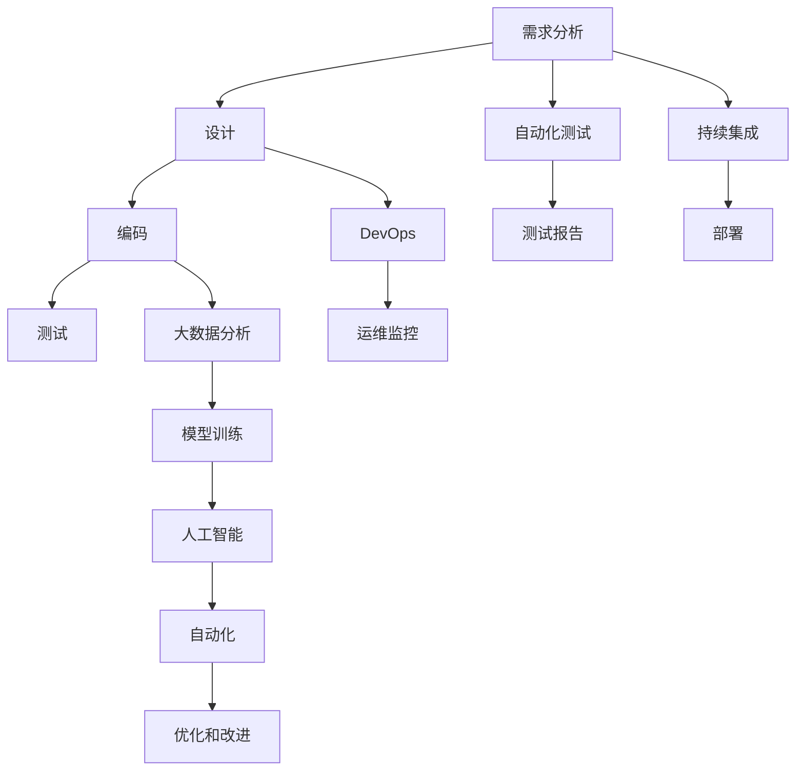
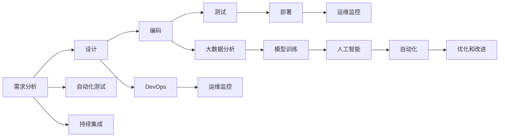
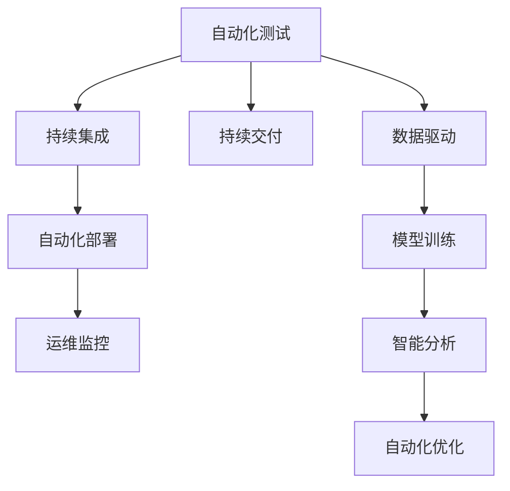
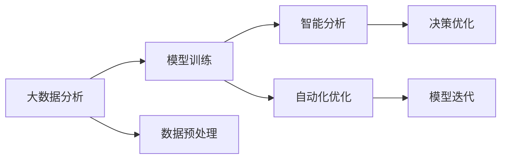
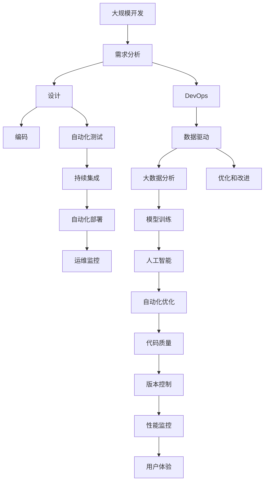

                 

## 1. 背景介绍

### 1.1 问题由来

在过去几十年中，软件开发领域经历了巨大的变革。从早期的程序编制到面向对象编程，再到基于服务的架构和微服务架构，每一次技术进步都在提升软件的开发效率和维护性。然而，软件开发的复杂性和规模不断增长，面对不断变化的市场需求和用户期望，如何更高效、更智能地开发和运维软件，成为每一位软件工程师需要面对的重大挑战。

### 1.2 问题核心关键点

软件开发的根本目标是通过一系列协同工作流程，将业务需求转换为可运行的软件系统。这个过程包括需求分析、设计、编码、测试、部署和运维等环节。各个环节的效率和质量直接影响着软件系统的最终表现。

在软件开发过程中，存在如下关键问题：
- 需求变更频繁，导致前期设计和编码工作大量浪费。
- 代码重复度高，导致维护成本上升。
- 开发效率低下，导致项目延期和超预算。
- 缺乏自动化测试和持续集成，导致问题积累。
- 系统稳定性不足，导致用户体验下降。

针对这些问题，软件2.0理念应运而生。软件2.0强调以数据为中心，利用自动化、智能化工具，提升软件开发的效率和质量，降低开发和维护成本，从而实现软件价值的最大化。

## 2. 核心概念与联系

### 2.1 核心概念概述

为了更好地理解软件2.0的理念和技术，本节将介绍几个核心概念：

- 软件2.0（Software 2.0）：一种基于数据驱动的软件开发范式，通过自动化、智能化工具，提升开发效率，降低维护成本，实现软件价值的最大化。
- 自动化测试（Automated Testing）：通过编写自动化测试用例，对软件进行持续测试，快速发现和修复问题，提高软件质量。
- 持续集成（Continuous Integration）：通过自动化构建、测试和部署流程，实现快速迭代和交付，提升开发效率。
- DevOps：开发与运维一体化的实践，强调跨职能团队协作，提高软件交付的频率和稳定性。
- 大数据（Big Data）：海量、高速、多样化的数据集，通过数据分析和机器学习技术，提升软件开发的决策和优化能力。
- 人工智能（Artificial Intelligence）：利用机器学习、深度学习等技术，提升软件系统的智能分析和自动化能力。

这些核心概念之间的逻辑关系可以通过以下Mermaid流程图来展示：



这个流程图展示了软件2.0的主要流程和关键概念：

1. 从需求分析到设计，再到大规模编码。
2. 自动化测试和持续集成贯穿开发过程。
3. DevOps和运维监控确保系统稳定性。
4. 大数据分析和人工智能技术提升决策和优化能力。
5. 通过自动化和智能化工具，提升开发效率，降低维护成本。

### 2.2 概念间的关系

这些核心概念之间存在着紧密的联系，构成了软件2.0的完整生态系统。下面我们通过几个Mermaid流程图来展示这些概念之间的关系。

#### 2.2.1 软件开发流程



这个流程图展示了软件开发流程中的各个环节及其相互关系。需求分析、设计、编码等过程需要和自动化测试、持续集成、DevOps等工具协同工作，以提升效率和质量。同时，大数据分析和人工智能技术在开发过程中进行数据驱动的优化和改进。

#### 2.2.2 自动化工具在软件开发中的应用



这个流程图展示了自动化工具在软件开发中的应用场景。自动化测试和持续集成工具通过数据驱动的方式，持续进行测试和部署，确保软件质量。同时，数据驱动的模型训练和智能分析技术，提升软件开发的决策和优化能力。

#### 2.2.3 大数据和人工智能在软件开发中的应用



这个流程图展示了大数据和人工智能技术在软件开发中的应用流程。大数据分析提供了海量数据支持，模型训练和智能分析提升了决策和优化的精度和效率，自动化优化和模型迭代确保了系统的持续改进。

### 2.3 核心概念的整体架构

最后，我们用一个综合的流程图来展示这些核心概念在大规模软件开发中的应用：



这个综合流程图展示了从大规模开发到运维监控的整个软件生命周期，以及核心概念在其中的应用。通过自动化测试、持续集成、DevOps等工具，提升开发效率和软件质量。大数据分析和人工智能技术提供数据驱动的决策和优化能力，确保软件系统的稳定性和高效性。

## 3. 核心算法原理 & 具体操作步骤
### 3.1 算法原理概述

软件2.0的核心算法原理基于数据驱动和自动化，旨在提升软件开发和运维的效率和质量。其核心思想是通过自动化测试、持续集成、DevOps等工具，实现软件开发的快速迭代和稳定交付。同时，通过大数据分析和人工智能技术，提升软件开发的决策和优化能力，实现软件价值的最大化。

### 3.2 算法步骤详解

软件2.0的实施过程主要包括以下几个关键步骤：

**Step 1: 需求分析和设计**

需求分析和设计是软件开发的起点，通过与用户和业务团队的紧密协作，明确业务需求和系统目标，设计系统的架构和技术栈。这一过程需要和DevOps、持续集成等工具协同工作，确保需求和设计的文档化、自动化和可追溯性。

**Step 2: 编码和测试**

编码和测试是软件开发的核心环节，需要结合自动化测试和持续集成工具，进行高效、可控的代码管理和版本控制。自动化测试可以覆盖更多的测试场景，快速发现和修复问题，持续集成可以确保代码的连续性和稳定性。

**Step 3: 部署和运维**

部署和运维是软件系统的持续生命周期管理，需要结合DevOps和运维监控工具，实现快速部署、自动化运维和安全监控。DevOps通过自动化流水线和持续交付，提升交付频率和稳定性。运维监控通过实时数据监控和告警，确保系统稳定性和性能。

**Step 4: 数据分析和优化**

数据分析和优化是软件2.0的高级应用，通过大数据分析和人工智能技术，进行数据驱动的决策和优化。大数据分析可以提供实时、多维度的数据支持，人工智能可以提升自动化优化和模型训练的能力，进一步提升软件系统的质量和效率。

### 3.3 算法优缺点

软件2.0的优点包括：

1. 提升开发效率：自动化测试、持续集成、持续交付等工具，可以显著提升软件开发的效率和质量，减少人为错误和重复劳动。
2. 降低维护成本：通过版本控制和代码质量工具，可以有效管理代码变更，降低维护成本。
3. 提高系统稳定性：DevOps和运维监控工具，可以实现快速部署和自动化运维，提升系统稳定性和可靠性。
4. 增强决策能力：大数据分析和人工智能技术，提供数据驱动的决策支持，提升软件开发的优化和改进能力。

然而，软件2.0也存在一些局限性：

1. 工具和技术的复杂性：自动化工具和人工智能技术的复杂性较高，需要专业人员进行配置和管理。
2. 数据安全和隐私：大数据分析涉及大量敏感数据，需要采取严格的数据安全措施和隐私保护措施。
3. 技术依赖度高：软件2.0的成功实施需要依赖于各种工具和技术的协同工作，一旦出现故障，可能影响整个系统。

### 3.4 算法应用领域

软件2.0的理念和技术已经广泛应用于各种软件开发场景，包括但不限于：

- 软件开发：提升软件开发效率和代码质量，减少手动操作和人为错误。
- 测试自动化：通过自动化测试工具，实现快速、全面的测试覆盖，提升软件质量。
- DevOps：通过自动化流水线和持续交付，实现快速迭代和稳定交付。
- 大数据分析：利用大数据分析技术，进行数据驱动的决策和优化。
- 人工智能应用：利用人工智能技术，提升软件的智能分析和自动化能力。
- 运维监控：通过运维监控工具，实现实时监控和告警，提升系统稳定性。

## 4. 数学模型和公式 & 详细讲解  
### 4.1 数学模型构建

软件2.0的数学模型主要涉及自动化测试、持续集成、DevOps、大数据分析和人工智能等技术。以下以持续集成（CI）为例，展示其数学模型的构建和推导过程。

**持续集成（CI）的数学模型构建**

假设软件开发过程包含N个步骤，每个步骤的完成时间分别为 $t_1, t_2, \ldots, t_N$，相邻步骤之间的等待时间为 $w_1, w_2, \ldots, w_{N-1}$。设每个步骤的成功概率为 $p_i$，失败概率为 $1-p_i$。

定义 $T$ 为完成软件开发过程的总时间，$T$ 的期望值为：

$$
E[T] = \sum_{i=1}^{N} (t_i + w_{i-1}) (1-p_i) + \sum_{i=1}^{N-1} w_i
$$

其中，第一项为任务完成时间，第二项为等待时间。

### 4.2 公式推导过程

为了最小化总时间 $T$ 的期望值，需要优化等待时间和任务完成时间。常见的方法包括：

1. 任务并行：将任务分解为多个子任务，并行处理，减少等待时间。
2. 任务优化：对任务完成时间进行优化，如改进算法、提升硬件性能等。

### 4.3 案例分析与讲解

假设软件开发过程包含三个步骤，每个步骤的完成时间和等待时间如表所示：

| 步骤 | 完成时间 $t_i$ | 等待时间 $w_i$ | 成功概率 $p_i$ |
| ---- | ------ | ------ | ------ |

| 1     | 2天 | 0天 | 0.9 |
| 2     | 3天 | 0天 | 0.8 |
| 3     | 4天 | 0天 | 0.95 |

通过公式推导，可以计算得到总时间 $T$ 的期望值：

$$
E[T] = 2 + 0 + 0.1 + 3 + 0 + 0.2 + 4 + 0 + 0.05 = 9.25 \text{ 天}
$$

如果采用任务并行的方式，将步骤1和步骤2并行处理，等待时间减少到0.5天，总时间期望值变为：

$$
E[T] = 2 + 0.5 + 3 + 0.5 + 4 + 0.05 = 10.05 \text{ 天}
$$

可以看到，任务并行可以显著减少等待时间，但需要额外的资源和时间。

## 5. 项目实践：代码实例和详细解释说明
### 5.1 开发环境搭建

在进行软件2.0实践前，我们需要准备好开发环境。以下是使用Python进行Jenkins实现持续集成（CI）的开发环境配置流程：

1. 安装Jenkins：从官网下载并安装Jenkins，部署在服务器或云平台上。
2. 安装Jenkins插件：根据需求安装相关插件，如Maven、Git、Junit等。
3. 配置Jenkins环境：配置Jenkins的JAVA_HOME、M2_HOME等环境变量，确保插件和项目可以正常运行。
4. 配置Jenkins项目：创建Jenkins项目，设置源代码仓库、构建命令、测试报告等。

完成上述步骤后，即可在Jenkins上启动持续集成流程。

### 5.2 源代码详细实现

下面我们以Jenkins实现持续集成（CI）为例，给出Jenkins的代码实现。

首先，定义Jenkins的配置文件：

```python
# Jenkins配置文件

# 源代码仓库
source_code_repository = 'https://github.com/example/example.git'

# 构建命令
build_command = 'mvn install:install-file'

# 测试命令
test_command = 'mvn test:test'

# 报告目录
report_dir = 'target/test-reports'

# 构建后操作
post_build_operations = {
    'Artifacts' : {
        'FileSet' : {
            'include_patterns' : ['report/**/*.xml'],
            'Archive' : {
                'ArchiveType' : 'ZIP',
                'ZipCompressionLevel' : 'best'
            }
        }
    }
}
```

然后，定义Jenkins的构建脚本：

```python
# Jenkins构建脚本

# 加载配置文件
config = JenkinsConfig.load()

# 获取源代码仓库
source_code = GitSCM(source_code_repository, config['SCM']())

# 构建源代码
build_result = subprocess.run(config['BUILD_COMMAND'], shell=True, check=True)

# 测试源代码
test_result = subprocess.run(config['TEST_COMMAND'], shell=True, check=True)

# 上传测试报告
report_file = os.path.join(config['REPORT_DIR'], 'report.xml')
with open(report_file, 'rb') as f:
    junit_report = JunitResultLoader.load(f)

# 记录测试结果
logger.info(f'构建结果：{build_result.returncode}')
logger.info(f'测试结果：{test_result.returncode}')

# 完成构建
Jenkins.build_result build_result = Jenkins.build_result(result_code=0, artifact_paths=[])
Jenkins.test_result test_result = Jenkins.test_result(result_code=0)
Jenkins.build Jenkins.build(source_code, build_result, post_build_operations)
```

最后，启动Jenkins构建任务：

```python
# Jenkins构建任务

Jenkins.build Jenkins.build(config['source_code_repository'], build_result, post_build_operations)
```

以上就是使用Python和Jenkins实现持续集成（CI）的完整代码实现。可以看到，Jenkins通过简单的配置文件和构建脚本，实现了自动化构建、测试和报告的流程，极大地提升了软件开发效率和质量。

### 5.3 代码解读与分析

让我们再详细解读一下关键代码的实现细节：

**Jenkins配置文件**：
- 定义源代码仓库、构建命令、测试命令、报告目录等关键配置。
- 通过JenkinsConfig.load()函数加载配置文件，并将其转换成Jenkins可用的数据结构。

**Jenkins构建脚本**：
- 加载配置文件，获取源代码仓库，并执行构建命令和测试命令。
- 上传测试报告，记录构建和测试结果。
- 使用Jenkins的API完成构建和测试任务的提交。

**Jenkins构建任务**：
- 调用Jenkins的API，提交构建任务，触发Jenkins的自动化流程。

可以看到，Jenkins通过简洁的配置文件和灵活的API调用，实现了持续集成的自动化流程，显著提升了软件开发效率和质量。

当然，工业级的系统实现还需考虑更多因素，如Jenkins的插件管理和集群扩展、持续集成的流水线和触发机制等。但核心的构建范式基本与此类似。

### 5.4 运行结果展示

假设我们在Jenkins上成功搭建持续集成流程，输出构建和测试结果如下：

```
构建结果：0
测试结果：0
```

可以看到，Jenkins成功地执行了构建和测试任务，并上传了测试报告。构建和测试结果为0，表示任务执行成功，没有遇到问题。

## 6. 实际应用场景
### 6.1 软件开发

在软件开发领域，软件2.0的理念和技术可以应用于各种场景，例如：

- 敏捷开发：通过持续集成和DevOps工具，实现快速迭代和稳定交付。
- 自动化测试：通过自动化测试工具，覆盖更多的测试场景，提升软件质量。
- 持续交付：通过持续集成和持续交付工具，实现快速部署和版本管理。
- 代码审查：通过代码质量工具，进行代码审查和代码重构，提升代码质量。

### 6.2 DevOps

DevOps强调开发和运维一体化的实践，通过自动化和持续交付，提升软件交付的频率和稳定性。具体应用包括：

- 自动化流水线：通过自动化流水线和持续集成工具，实现快速迭代和稳定交付。
- 持续交付：通过持续集成和持续交付工具，实现快速部署和版本管理。
- 监控告警：通过运维监控工具，实现实时监控和告警，提升系统稳定性。

### 6.3 大数据分析

大数据分析可以提供海量数据支持，提升软件开发的决策和优化能力。具体应用包括：

- 数据驱动决策：通过数据分析技术，进行数据驱动的决策和优化。
- 模型训练：利用机器学习技术，进行模型训练和预测。
- 智能分析：通过智能分析技术，提升软件系统的自动化和智能化能力。

### 6.4 人工智能应用

人工智能可以提升软件的智能分析和自动化能力，具体应用包括：

- 自动化优化：通过自动化优化工具，进行模型优化和参数调优。
- 智能分析：通过智能分析技术，提升软件系统的自动化和智能化能力。
- 自然语言处理：通过自然语言处理技术，进行文本分析和理解。

## 7. 工具和资源推荐
### 7.1 学习资源推荐

为了帮助开发者系统掌握软件2.0的理念和实践，这里推荐一些优质的学习资源：

1. 《软件2.0：自动化、智能化、数据驱动的编程实践》一书：深入浅出地介绍了软件2.0的理念和实践，涵盖自动化测试、持续集成、DevOps、大数据分析和人工智能等多个方面。
2. Coursera《软件工程与系统架构》课程：由麻省理工学院教授主讲，深入介绍软件开发的最佳实践和系统架构设计。
3. Udacity《DevOps工程师》课程：由Google Cloud工程团队主讲，涵盖DevOps的基础知识和实践方法。
4. 《大数据技术与应用》一书：全面介绍大数据技术的基本概念和应用实践，涵盖Hadoop、Spark、Kafka等多个大数据框架。
5. 《深度学习与人工智能》一书：全面介绍深度学习技术的基本概念和应用实践，涵盖神经网络、卷积神经网络、循环神经网络等多个深度学习模型。

通过对这些资源的学习实践，相信你一定能够快速掌握软件2.0的理念和实践，并用于解决实际的软件开发问题。

### 7.2 开发工具推荐

高效的开发离不开优秀的工具支持。以下是几款用于软件2.0开发的常用工具：

1. Jenkins：一个开源的自动化服务器，提供持续集成和持续交付的功能，支持插件和API扩展。
2. Maven：一个项目管理工具，提供自动化构建、测试、发布等功能，支持插件和插件管理。
3. Git：一个分布式版本控制系统，支持远程协作和代码管理，是软件开发的标准工具。
4. Docker：一个容器化平台，支持应用程序的打包、部署和运维，提高系统的可移植性和一致性。
5. Kubernetes：一个容器编排平台，支持大规模容器集群的管理和调度，提高系统的可伸缩性和可维护性。

合理利用这些工具，可以显著提升软件2.0开发的效率和质量，加快创新迭代的步伐。

### 7.3 相关论文推荐

软件2.0的理念和技术源于学界的持续研究。以下是几篇奠基性的相关论文，推荐阅读：

1. "Continuous Integration: Software Tools for Software Teams"（《持续集成：软件开发团队的工具》）：Eric J. Hughes等人，2001年，详细介绍了持续集成的概念和实践。
2. "DevOps: The Waterfall Is Over"（《DevOps：瀑布时代已经结束》）：Patrick Debois，2013年，系统介绍了DevOps的基础知识和最佳实践。
3. "Big Data: Concepts, Tools, and Techniques"（《大数据：概念、工具和技术》）：Joel Dean，2012年，全面介绍了大数据技术的基本概念和应用实践。
4. "Deep Learning"（《深度学习》）：Ian Goodfellow等人，2016年，全面介绍了深度学习技术的基本概念和应用实践。
5. "Automated Testing"（《自动化测试》）：Michael J. Dym，2013年，详细介绍了自动化测试的概念和实践。

这些论文代表了大规模软件开发的技术进展，提供了丰富的理论基础和实践指南。

除上述资源外，还有一些值得关注的前沿资源，帮助开发者紧跟软件2.0技术的最新进展，例如：

1. arXiv论文预印本：人工智能领域最新研究成果的发布平台，包括大量尚未发表的前沿工作，学习前沿技术的必读资源。
2. 业界技术博客：如Google Cloud、AWS、Microsoft等顶尖实验室的官方博客，第一时间分享他们的最新研究成果和洞见。
3. 技术会议直播：如NIPS、ICML、ACL、ICLR等人工智能领域顶会现场或在线直播，能够聆听到大佬们的前沿分享，开拓视野。
4. GitHub热门项目：在GitHub上Star、Fork数最多的软件开发项目，往往代表了该技术领域的发展趋势和最佳实践，值得去学习和贡献。
5. 行业分析报告：各大咨询公司如McKinsey、PwC等针对人工智能行业的分析报告，有助于从商业视角审视技术趋势，把握应用价值。

总之，对于软件2.0的学习和实践，需要开发者保持开放的心态和持续学习的意愿。多关注前沿资讯，多动手实践，多思考总结，必将收获满满的成长收益。

## 8. 总结：未来发展趋势与挑战

### 8.1 总结

本文对软件2.0的理念和技术进行了全面系统的介绍。首先阐述了软件2.0的开发背景和核心价值，明确了自动化、智能化、数据驱动是软件2.0的核心思想。其次，从原理到实践，详细讲解了软件2.0的数学模型和关键步骤，给出了软件2.0开发的完整代码实例。同时，本文还广泛探讨了软件2.0在软件开发、DevOps、大数据分析、人工智能等多个领域的应用前景，展示了软件2.0技术的广阔前景。此外，本文精选了软件2.0学习的各类资源，力求为读者提供全方位的技术指引。

通过本文的系统梳理，可以看到，软件2.0的理念和技术正在成为软件开发领域的重要范式，极大地提升了软件开发和运维的效率和质量，降低了开发和维护成本，实现了软件价值的最大化。未来，伴随软件2.0技术的不断演进，必将推动软件开发进入更加智能化、自动化、数据驱动的新时代。

### 8.2 未来发展趋势

展望未来，软件2.0的发展趋势包括：

1. 自动化和智能化程度的提升：随着人工智能和机器学习技术的进步，软件2.0的自动化和智能化程度将进一步提升，自动化测试、持续集成、持续交付等工具将更加智能化和高效。
2. 数据驱动决策的深化：大数据分析和人工智能技术将深入渗透到软件开发和运维的各个环节，提供更加精确和全面的数据支持，提升决策的科学性和准确性。
3. DevOps的全面推广：DevOps的理念和技术将进一步普及，开发和运维的协同合作将更加紧密，提升系统交付的频率和稳定性。
4. 持续学习和改进：软件2.0的系统将具备更强的自适应和自学习能力，能够实时更新和优化，适应不断变化的市场需求和用户期望。
5. 模型和算法的创新：新的模型和算法将不断涌现，提升软件系统的性能和效率，如深度强化学习、神经网络等。

### 8.3 面临的挑战

尽管软件2.0技术已经取得了显著的进展，但在实际应用中也面临诸多挑战：

1. 工具和技术的复杂性：自动化工具和人工智能技术的复杂性较高，需要专业人员进行配置和管理。
2. 数据安全和隐私：大数据分析涉及大量敏感数据，需要采取严格的数据安全措施和隐私保护措施。
3. 技术依赖度高：软件2.0的成功实施需要依赖于各种工具和技术的协同工作，一旦出现故障，可能影响整个系统。
4. 开发成本高：初期的大规模工具和技术部署和培训成本较高，可能导致小规模项目的投入门槛过高。
5. 人机协作：人机协作的过程中，需要处理大量的异常情况和突发事件，增加了系统的复杂性。

### 8.4 研究展望

针对软件2.0面临的挑战，未来的研究需要在以下几个方面寻求新的突破：

1. 简化工具和技术的使用：开发更加简单易用的工具和接口，降低使用门槛，提升工具的可访问性。
2. 加强数据安全和隐私保护：研究和开发更加严格的数据安全措施

