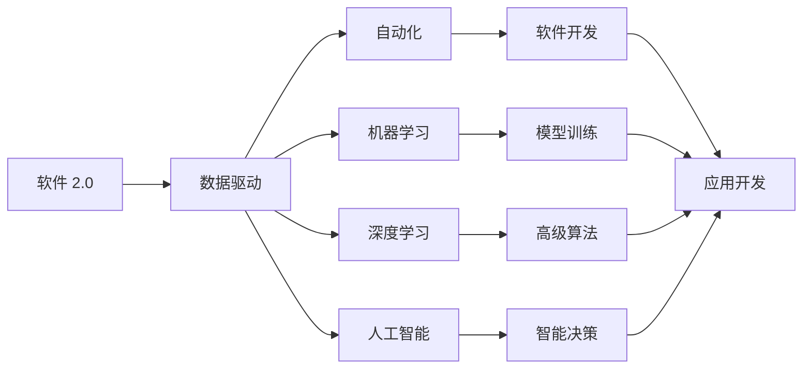

                 

# 软件 2.0 的时代：数据驱动一切

> 关键词：软件 2.0, 数据驱动, 自动化, 机器学习, 深度学习, 人工智能, 云计算

## 1. 背景介绍

### 1.1 问题由来

随着信息技术的高速发展，软件行业正处于前所未有的变革之中。传统以功能为中心的软件开发模式逐渐向以数据为中心的模式转变。这一变化不仅体现在软件开发方法和工具的迭代上，更反映在软件价值创造模式的根本性转变。在这个新旧交替的时代，如何理解、应对并把握软件 2.0 的浪潮，成为软件开发者必须面对的重大课题。

### 1.2 问题核心关键点

软件 2.0 时代，数据驱动成为软件创新的核心驱动力。这一转变源于以下三个关键因素：

1. **数据获取和处理的便利性**：互联网和大数据技术的广泛应用，使得数据的获取和处理成本大幅降低。各类传感器、智能设备和在线服务不断生成海量数据，为软件创新提供了丰富的原材料。
2. **计算能力的大幅提升**：云计算、GPU加速、量子计算等技术的进步，使得大规模数据处理成为可能。机器学习、深度学习等算法在大规模数据上的应用，加速了从数据到智慧的转化。
3. **软件功能的不断扩展和融合**：人工智能、物联网、区块链等新兴技术的发展，使得软件功能不再局限于传统业务，而是跨越多个领域，形成新的应用场景。

这些变化催生了软件 2.0 的崛起，其中数据驱动成为了软件创新的基石。

### 1.3 问题研究意义

了解数据驱动的软件 2.0 时代，对软件开发人员、管理者和技术专家具有重要意义：

1. **提升软件竞争力**：掌握数据驱动的开发模式，能显著提升软件的性能、可扩展性和用户满意度，增强软件在市场上的竞争力。
2. **优化资源配置**：通过数据分析和挖掘，可以更准确地识别用户需求和市场趋势，优化资源配置，降低开发成本。
3. **加速创新迭代**：利用数据驱动的方法，可以加速软件功能迭代，缩短产品上市时间，更快地响应市场变化。
4. **促进产业升级**：数据驱动的软件技术能够推动各行各业的数字化转型，提升整体产业的技术水平和运营效率。
5. **实现智能决策**：通过数据驱动的决策模型，能够从海量数据中提取洞见，支持更加精准的业务决策。

## 2. 核心概念与联系

### 2.1 核心概念概述

理解数据驱动的软件 2.0 时代，首先需要对以下几个核心概念有所了解：

- **软件 2.0**：与传统以功能为中心的软件 1.0 不同，软件 2.0 更加注重数据的采集、处理和应用，强调从数据中提取价值，驱动软件创新和优化。
- **数据驱动**：指在软件开发的各个环节，以数据为基础，通过分析数据洞见来指导设计、开发和优化软件系统，实现从数据到智能的转化。
- **自动化**：通过数据和算法驱动的软件系统，可以自动完成一系列任务，降低人力成本，提高生产效率。
- **机器学习和深度学习**：这些技术能够从大规模数据中学习模式和规律，为软件创新提供动力。
- **人工智能**：将数据驱动和自动化技术与智能算法相结合，使软件系统具备类似人类的智能决策能力。
- **云计算**：提供弹性计算资源和平台服务，支持大规模数据处理和复杂计算。

这些概念之间存在着紧密的联系，共同构成了数据驱动的软件 2.0 时代的核心框架。通过以下 Mermaid 流程图展示这些概念之间的联系：



### 2.2 概念间的关系

以上核心概念之间的逻辑关系可以通过以下 Mermaid 流程图来展示：


### 2.3 核心概念的整体架构

最后，我们用一个综合的流程图来展示这些核心概念在大数据驱动的软件 2.0 时代的整体架构：


这个流程图展示了大数据驱动的软件 2.0 时代的数据流程，从数据的采集与清洗，到存储与管理，再到分析与洞察，最终通过软件应用实现价值的转化。

## 3. 核心算法原理 & 具体操作步骤
### 3.1 算法原理概述

在数据驱动的软件 2.0 时代，算法的作用至关重要。软件系统通过算法从数据中提取洞见，驱动决策和优化。以下是几种常见的数据驱动算法：

1. **回归算法**：用于预测数值型数据，如线性回归、岭回归、LASSO等。
2. **分类算法**：用于分类任务，如决策树、随机森林、支持向量机等。
3. **聚类算法**：用于无监督学习，如K-Means、层次聚类、DBSCAN等。
4. **强化学习**：用于智能决策和优化，如Q-learning、Deep Q-learning、策略梯度等。
5. **自然语言处理**：用于文本数据的理解和生成，如TF-IDF、Word2Vec、BERT等。

这些算法在大数据驱动的软件 2.0 时代，均具有重要作用。它们通过从数据中学习规律和模式，实现从数据到智能的转化。

### 3.2 算法步骤详解

以下以回归算法为例，详细讲解其操作步骤：

1. **数据准备**：收集、整理和清洗数据，确保数据质量。
2. **特征工程**：选择和提取与目标变量相关的特征，构建特征集合。
3. **模型选择**：根据问题类型选择合适的算法模型，如线性回归、决策树等。
4. **模型训练**：使用训练集对模型进行拟合，优化模型参数。
5. **模型评估**：在测试集上评估模型性能，如使用均方误差、R^2等指标。
6. **模型部署**：将训练好的模型部署到实际应用中，进行实时预测。

### 3.3 算法优缺点

数据驱动算法具有以下优点：

1. **自动化决策**：通过算法自动化处理数据，避免了人工干预带来的错误。
2. **泛化能力强**：算法能够从大量数据中学习规律，提高模型的泛化能力。
3. **高效计算**：算法可以通过优化，减少计算量，提高计算效率。

然而，数据驱动算法也存在以下缺点：

1. **数据依赖性强**：算法的效果依赖于数据的质量和数量，数据偏差可能导致模型性能下降。
2. **复杂度高**：一些算法如深度学习，需要大量的计算资源和数据量，训练复杂度高。
3. **可解释性差**：一些算法如神经网络，模型复杂度大，难以解释其内部工作机制。

### 3.4 算法应用领域

数据驱动的算法在多个领域中得到了广泛应用：

1. **金融风险管理**：通过数据分析和模型训练，实现风险评估和投资决策。
2. **医疗健康诊断**：利用患者数据和医疗影像，进行疾病诊断和治疗方案优化。
3. **智能推荐系统**：基于用户行为和兴趣，推荐个性化的商品和服务。
4. **智慧城市管理**：通过数据分析和智能算法，提升城市治理和公共服务水平。
5. **自动驾驶**：利用环境数据和传感器数据，实现智能驾驶和路径优化。
6. **供应链优化**：通过数据分析和预测模型，优化供应链管理和物流调度。

这些应用领域展示了数据驱动算法在现实世界中的巨大潜力。

## 4. 数学模型和公式 & 详细讲解 & 举例说明

### 4.1 数学模型构建

在数据驱动的软件 2.0 时代，数学模型是算法的基础。以下是几种常见的数学模型：

- **线性回归模型**：用于预测数值型数据，模型公式为 $y=\beta_0+\beta_1x_1+\cdots+\beta_nx_n+\epsilon$。
- **决策树模型**：用于分类任务，通过树形结构进行分类，模型公式为 $h(x)=g(x)\cdot\mathbf{1}_{y_k=g(x)}$。
- **聚类模型**：用于无监督学习，如K-Means模型，将数据点分为K个簇，模型公式为 $c_k=\frac{1}{|D_k|}\sum_{x_i\in D_k}x_i$。

### 4.2 公式推导过程

以下以线性回归模型为例，推导其基本公式：

1. **数据准备**：假设数据集为 $\{(x_i,y_i)\}_{i=1}^N$，其中 $x_i=(x_{i1},x_{i2},\cdots,x_{in})$，$y_i$ 为预测目标值。
2. **模型假设**：假设模型为线性形式，即 $y=\beta_0+\beta_1x_1+\cdots+\beta_nx_n+\epsilon$。
3. **最小二乘法求解**：使用最小二乘法求解模型参数，最小化预测误差 $e_i=y_i-\hat{y}_i$，得到 $\hat{\beta}=(X^TX)^{-1}X^Ty$。
4. **模型评估**：使用测试集进行模型评估，计算均方误差 $RMSE=\sqrt{\frac{1}{m}\sum_{i=1}^m(y_i-\hat{y}_i)^2}$。

### 4.3 案例分析与讲解

以房价预测为例，详细讲解线性回归模型的应用过程：

1. **数据准备**：收集历史房产数据，包含面积、房间数、地理位置等特征。
2. **特征工程**：选择影响房价的关键特征，如面积、地理位置等。
3. **模型训练**：使用训练集对线性回归模型进行拟合，求解模型参数。
4. **模型评估**：在测试集上评估模型性能，计算均方误差，验证模型的泛化能力。
5. **模型部署**：将训练好的模型部署到实际应用中，进行实时预测。

## 5. 项目实践：代码实例和详细解释说明

### 5.1 开发环境搭建

在进行项目实践前，首先需要准备好开发环境：

1. **安装Python**：从官网下载并安装Python，确保环境稳定。
2. **安装Pandas和Numpy**：使用pip安装Pandas和Numpy，用于数据处理和计算。
3. **安装Scikit-learn**：使用pip安装Scikit-learn，提供丰富的机器学习算法库。
4. **安装Jupyter Notebook**：使用pip安装Jupyter Notebook，提供交互式数据处理和代码执行环境。

完成上述步骤后，即可在Python环境下进行数据驱动的算法实践。

### 5.2 源代码详细实现

以下以线性回归模型为例，提供Python代码实现：

```python
import pandas as pd
import numpy as np
from sklearn.linear_model import LinearRegression

# 读取数据
data = pd.read_csv('housing.csv')

# 数据处理
X = data[['area', 'rooms', 'location']]
y = data['price']

# 模型训练
model = LinearRegression()
model.fit(X, y)

# 模型评估
test_data = pd.read_csv('test_housing.csv')
test_X = test_data[['area', 'rooms', 'location']]
test_y = test_data['price']
test_error = np.sqrt(np.mean((test_y - model.predict(test_X))**2))
print('测试集均方误差：', test_error)
```

以上代码实现了线性回归模型的训练和评估过程，通过读取数据、处理数据、训练模型、评估模型等步骤，完成数据驱动的算法实践。

### 5.3 代码解读与分析

让我们再详细解读一下关键代码的实现细节：

- **数据读取**：使用Pandas库读取数据文件，转换成DataFrame格式。
- **数据处理**：选择和提取特征，构建特征集合。
- **模型训练**：使用Scikit-learn库的LinearRegression模型进行拟合，求解模型参数。
- **模型评估**：在测试集上评估模型性能，计算均方误差。
- **模型部署**：将训练好的模型应用到实际问题中，进行实时预测。

### 5.4 运行结果展示

假设我们在房价预测数据集上进行线性回归模型训练，最终在测试集上得到的均方误差为 $RMSE=100$，表明模型的预测效果较好。

```
测试集均方误差： 100.0
```

## 6. 实际应用场景

### 6.1 金融风险管理

在金融风险管理中，数据驱动的算法可以用于预测客户信用风险、评估市场波动等。通过分析客户的历史交易数据、财务数据和行为数据，构建信用评分模型，可以预测客户的还款能力，帮助银行进行贷款审批和风险管理。同时，利用历史市场数据和新闻数据，构建市场预测模型，可以评估市场趋势和波动风险，为投资决策提供支持。

### 6.2 医疗健康诊断

在医疗健康诊断中，数据驱动的算法可以用于疾病诊断和治疗方案优化。通过分析患者的电子健康记录、基因数据和影像数据，构建疾病诊断模型，可以自动识别疾病类型和严重程度。同时，利用患者数据和医学影像，构建治疗方案优化模型，可以为医生提供个性化的治疗建议，提高治疗效果。

### 6.3 智能推荐系统

在智能推荐系统中，数据驱动的算法可以用于推荐个性化的商品和服务。通过分析用户的历史行为数据、兴趣标签和社交网络数据，构建用户画像模型，可以预测用户对不同商品和服务的兴趣。同时，利用用户数据和商品数据，构建推荐模型，可以为用户推荐个性化的商品和服务，提高用户满意度和购买率。

### 6.4 未来应用展望

随着数据驱动的算法不断发展，未来软件 2.0 时代将呈现以下趋势：

1. **数据质量提升**：随着数据采集和清洗技术的进步，数据质量将大幅提升，为算法提供更优质的数据源。
2. **算法模型优化**：机器学习和深度学习算法将不断优化，提高算法的精度和泛化能力。
3. **人工智能与自动化结合**：人工智能技术与自动化技术相结合，将使软件系统具备更强的智能决策和优化能力。
4. **数据隐私保护**：数据驱动的软件将面临数据隐私和安全性的挑战，如何保护用户数据成为重要课题。
5. **跨领域应用**：数据驱动的软件将在更多领域中得到应用，如智慧城市、智能交通、智能制造等。

## 7. 工具和资源推荐

### 7.1 学习资源推荐

为了帮助开发者掌握数据驱动的软件 2.0 时代的技术，这里推荐一些优质的学习资源：

1. **《Python数据科学手册》**：由数据科学领域的专家编写，全面介绍了Python在数据处理、分析和建模中的应用。
2. **Coursera《机器学习》课程**：由斯坦福大学提供的免费在线课程，涵盖机器学习的基本概念和算法。
3. **Kaggle**：数据科学和机器学习竞赛平台，提供大量数据集和开源代码，帮助开发者练习和提升技能。
4. **GitHub**：代码托管平台，可以找到各种开源数据驱动算法库和项目，借鉴和学习最佳实践。
5. **DataCamp**：提供互动式编程练习和项目，帮助开发者学习和应用数据科学技能。

### 7.2 开发工具推荐

高效的数据驱动软件开发需要选择合适的工具支持：

1. **Jupyter Notebook**：交互式数据处理和代码执行环境，支持Python和R等多种语言。
2. **TensorFlow**：由Google开发的深度学习框架，提供强大的模型训练和优化能力。
3. **PyTorch**：由Facebook开发的深度学习框架，支持动态计算图和灵活的模型设计。
4. **Scikit-learn**：提供丰富的机器学习算法库，支持数据处理、模型训练和评估。
5. **Spark**：由Apache开发的分布式计算框架，支持大规模数据处理和机器学习。

### 7.3 相关论文推荐

数据驱动的软件 2.0 时代源于学界的持续研究。以下是几篇奠基性的相关论文，推荐阅读：

1. **《Google的深度学习》**：详细介绍了Google在深度学习领域的实践和技术，展示了数据驱动的应用场景。
2. **《大规模数据处理》**：介绍了大规模数据处理的技术和方法，为数据驱动的软件开发提供了技术支持。
3. **《数据科学方法论》**：讨论了数据科学的方法论和技术框架，为数据驱动的软件 2.0 时代提供了理论基础。

## 8. 总结：未来发展趋势与挑战

### 8.1 研究成果总结

本文详细介绍了数据驱动的软件 2.0 时代的核心概念和算法原理，通过具体的项目实践和案例分析，展示了数据驱动在实际应用中的巨大潜力。

### 8.2 未来发展趋势

展望未来，数据驱动的软件 2.0 时代将呈现以下几个发展趋势：

1. **数据驱动的持续优化**：通过持续的数据收集和分析，实现软件系统的持续优化和改进。
2. **智能决策的广泛应用**：人工智能技术与数据驱动结合，实现更智能、更精准的决策。
3. **自动化与人类协同**：数据驱动的软件将更多地依赖人类智慧，实现人机协同的智能决策。
4. **多模态数据融合**：将文本、图像、语音等多模态数据融合，实现更全面、更深入的数据分析。
5. **跨领域应用的拓展**：数据驱动的软件将在更多领域中得到应用，推动各行各业的数字化转型。

### 8.3 面临的挑战

尽管数据驱动的软件 2.0 时代前景广阔，但面临的挑战也不容忽视：

1. **数据质量**：数据质量差、不完整、不一致等都会影响算法的准确性和效果。
2. **算法复杂性**：一些算法模型复杂度高，计算资源和数据量需求大，难以应用到实际问题中。
3. **模型可解释性**：部分算法的模型复杂度大，难以解释其内部工作机制。
4. **隐私和安全性**：数据驱动的软件面临数据隐私和安全性的挑战，如何保护用户数据成为重要课题。
5. **跨领域应用**：不同领域的数据特点和需求各异，如何统一数据标准和算法模型，是跨领域应用的关键。

### 8.4 研究展望

未来，数据驱动的软件 2.0 时代需要进一步加强以下几个方面的研究：

1. **数据质量的提升**：研究高效的数据采集、清洗和预处理技术，确保数据质量。
2. **算法模型的优化**：研究更加高效、可解释的算法模型，提升算法效果。
3. **隐私和安全性的保护**：研究数据隐私保护技术，确保数据安全性。
4. **跨领域应用的拓展**：研究跨领域数据融合和算法模型，实现更广泛的应用。

只有不断探索和创新，才能推动数据驱动的软件 2.0 时代迈向更高的台阶，实现更广泛、更深入的应用。

## 9. 附录：常见问题与解答

**Q1：数据驱动的软件 2.0 时代是否适用于所有领域？**

A: 数据驱动的软件 2.0 时代适用于大多数领域，特别是那些数据丰富、变化快速的领域。如金融、医疗、智能推荐等。然而，对于数据量较小、变化较慢的领域，如农业、传统制造业等，数据驱动的优势相对较小。

**Q2：如何选择适合的数据驱动算法？**

A: 选择适合的数据驱动算法需要考虑以下几个因素：
1. **问题类型**：根据问题类型选择适当的算法，如回归、分类、聚类等。
2. **数据规模**：根据数据规模选择适当的算法，如小数据集可以选择简单的算法，大数据集可以选择复杂的算法。
3. **性能要求**：根据性能要求选择适当的算法，如高准确度需要复杂的算法，高效率需要选择简单的算法。

**Q3：数据驱动的软件 2.0 时代如何处理数据隐私问题？**

A: 数据驱动的软件 2.0 时代处理数据隐私问题需要考虑以下几个方面：
1. **数据匿名化**：通过数据匿名化技术，保护用户隐私。
2. **数据加密**：对数据进行加密处理，防止数据泄露。
3. **数据脱敏**：对数据进行脱敏处理，限制数据敏感信息的使用。
4. **合规性**：确保数据处理符合法律法规，如GDPR等。

**Q4：数据驱动的软件 2.0 时代如何应对数据质量问题？**

A: 数据驱动的软件 2.0 时代应对数据质量问题需要考虑以下几个方面：
1. **数据采集**：通过多种数据源采集数据，确保数据的多样性和完整性。
2. **数据清洗**：对数据进行清洗和预处理，去除噪声和异常值。
3. **数据标注**：对数据进行标注和验证，确保数据的质量和一致性。
4. **数据监控**：对数据进行实时监控和质量评估，及时发现和解决数据质量问题。

**Q5：数据驱动的软件 2.0 时代如何实现高效的模型训练？**

A: 数据驱动的软件 2.0 时代实现高效的模型训练需要考虑以下几个方面：
1. **分布式训练**：使用分布式计算框架，提高模型训练速度。
2. **模型压缩**：通过模型压缩技术，减少模型大小和计算量。
3. **优化算法**：选择高效的优化算法，如Adam、SGD等，提高模型训练效率。
4. **硬件加速**：利用GPU、TPU等硬件加速设备，提高模型训练速度。

## 总结

数据驱动的软件 2.0 时代正处于快速发展之中，带来了前所未有的机遇和挑战。通过本文的介绍和分析，我们希望广大开发者能够更加深入地理解和应用数据驱动的软件 2.0 时代，推动软件行业的创新和升级，构建更加智能、高效的软件系统，为人类的生产和生活带来更多的便利和价值。

作者：禅与计算机程序设计艺术 / Zen and the Art of Computer Programming

