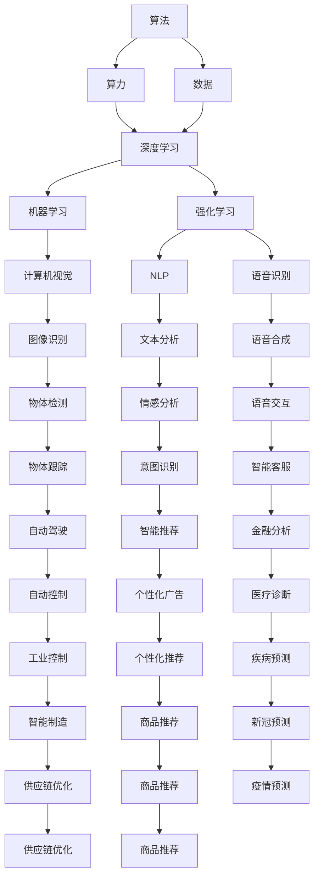
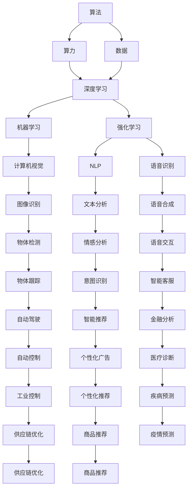
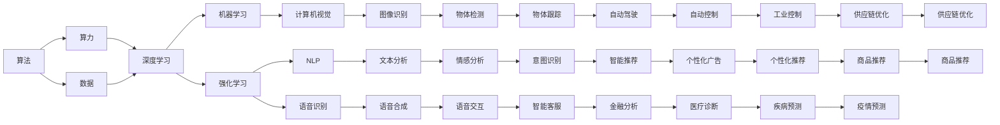

                 

# AI发展的三匹马：算法、算力与数据

在人工智能(AI)发展的广阔天地中，算法、算力和数据是支撑其发展的主要动力，合称"三匹马"。它们在AI技术的演进和应用中扮演着不可或缺的角色，共同推动着AI技术的不断进步与突破。本文将深入探讨这三匹马的原理与联系，并结合实际项目实践，展示其如何共同助力AI技术的创新与突破。

## 1. 背景介绍

### 1.1 问题由来
在过去的几十年里，AI技术经历了从弱人工智能到强人工智能的跨越式发展。算法、算力与数据作为AI发展的核心要素，共同推动着AI技术的不断进步。然而，随着技术的发展，对这三要素的要求也在不断提升。算法的复杂度、算力的需求和数据的规模都呈现出指数级增长，如何更好地协同这三要素，成为当前AI研究的重要课题。

### 1.2 问题核心关键点
算法、算力与数据三者之间的关系密不可分，它们在AI系统中起着协同作用。

- 算法是AI技术的核心，通过构建高效的模型和算法，能够提高AI系统的性能和准确性。
- 算力是AI技术的基础，为算法的运行提供了强大的计算支持。
- 数据是AI技术的输入，为算法的训练和优化提供了必要的基础。

三者相辅相成，共同构成了AI技术的生态系统。只有在这三者协同工作的情况下，AI技术才能实现质的飞跃。

## 2. 核心概念与联系

### 2.1 核心概念概述

为更好地理解算法、算力和数据三者之间的关系，本节将介绍几个密切相关的核心概念：

- 算法（Algorithm）：指解决特定问题的一系列计算步骤，通过算法可以构建出高效、准确的AI模型。
- 算力（Computational Power）：指用于运行算法的计算资源，包括CPU、GPU、TPU等硬件设备。
- 数据（Data）：指用于训练和优化AI模型的输入数据，包括标注数据、非标注数据等。
- 深度学习（Deep Learning）：一种基于神经网络的机器学习技术，通过多层次的抽象，实现复杂模式的识别与预测。
- 机器学习（Machine Learning）：通过数据训练模型，使模型能够自动识别和预测数据的特征与模式。
- 强化学习（Reinforcement Learning）：通过试错机制，不断优化模型策略，以获得最优的决策方案。
- 计算机视觉（Computer Vision）：利用计算机技术，实现对图像和视频的理解和分析。
- 自然语言处理（Natural Language Processing，NLP）：处理、分析和理解人类语言的技术。
- 语音识别（Speech Recognition）：将语音信号转化为文本信息的过程。

这些概念之间的逻辑关系可以通过以下Mermaid流程图来展示：



这个流程图展示了大语言模型微调过程中算法、算力与数据三者的关系：

1. 算法通过数据训练模型，从而实现各种AI任务。
2. 算力为算法提供计算支持，保证模型的高效运行。
3. 数据是算法的输入，直接影响模型的效果。
4. 深度学习、机器学习和强化学习等技术，都在算法和数据的基础上进行构建。

### 2.2 概念间的关系

这些核心概念之间存在着紧密的联系，形成了AI技术的完整生态系统。下面我通过几个Mermaid流程图来展示这些概念之间的关系。

#### 2.2.1 算法与算力、数据的关系



这个流程图展示了算法、算力与数据三者之间的联系：

1. 算法通过数据训练模型，从而实现各种AI任务。
2. 算力为算法提供计算支持，保证模型的高效运行。
3. 数据是算法的输入，直接影响模型的效果。
4. 深度学习、机器学习和强化学习等技术，都在算法和数据的基础上进行构建。

#### 2.2.2 算法与算力、数据的具体应用



这个流程图展示了算法、算力与数据三者之间的联系：

1. 算法通过数据训练模型，从而实现各种AI任务。
2. 算力为算法提供计算支持，保证模型的高效运行。
3. 数据是算法的输入，直接影响模型的效果。
4. 深度学习、机器学习和强化学习等技术，都在算法和数据的基础上进行构建。

## 3. 核心算法原理 & 具体操作步骤
### 3.1 算法原理概述

AI算法的发展历史悠久，从早期的符号逻辑、专家系统，到近期的深度学习、强化学习，都展现了算法在AI技术中的核心地位。算法的创新和优化，推动了AI技术的不断进步。

#### 3.1.1 符号逻辑与专家系统

早期的AI算法主要基于符号逻辑和专家系统。符号逻辑通过推理规则和逻辑关系，实现对问题的形式化描述和解决。专家系统则通过构建领域专家的知识库，模拟专家的决策过程。

#### 3.1.2 机器学习与深度学习

机器学习通过数据训练模型，实现对数据的自动学习和预测。深度学习在此基础上进一步发展，通过多层次的神经网络，实现对复杂模式的识别和预测。

#### 3.1.3 强化学习

强化学习通过试错机制，不断优化模型策略，以获得最优的决策方案。强化学习在游戏、机器人、自动控制等领域得到了广泛应用。

### 3.2 算法步骤详解

AI算法的开发流程一般包括以下几个关键步骤：

**Step 1: 数据收集与预处理**

- 收集与任务相关的数据，确保数据的多样性和代表性。
- 对数据进行清洗、去重、归一化等预处理，以提高算法的准确性。

**Step 2: 算法设计与优化**

- 选择合适的算法框架，如TensorFlow、PyTorch等，并根据任务需求进行调整。
- 设计模型架构，包括输入层、隐藏层、输出层等，并进行模型调优。
- 对算法进行评估和测试，根据评估结果进行迭代优化。

**Step 3: 模型训练与测试**

- 使用训练数据集对模型进行训练，逐步优化模型参数。
- 在验证数据集上评估模型性能，根据评估结果进行微调。
- 在测试数据集上对模型进行最终评估，确保模型的泛化能力。

**Step 4: 部署与优化**

- 将训练好的模型部署到实际应用中，进行实时推理。
- 根据实时数据反馈，对模型进行动态优化和迭代。
- 使用自动化工具和平台，提高模型的部署效率和稳定性。

### 3.3 算法优缺点

AI算法在实际应用中表现出诸多优点：

- 高效性：算法能够在短时间内完成大量的数据处理和模式识别。
- 可扩展性：算法可以处理多维数据和复杂任务，具有很强的可扩展性。
- 灵活性：算法可以根据实际需求进行灵活调整和优化。

同时，算法也存在一些缺点：

- 数据依赖性：算法的效果依赖于数据的质量和数量，数据不足时效果不佳。
- 计算资源消耗：复杂算法需要大量的计算资源，资源消耗较大。
- 模型复杂性：复杂算法模型难以理解和调试，需要专业的知识和技能。

### 3.4 算法应用领域

AI算法在各个领域都有广泛应用，以下列举几个典型领域：

- 计算机视觉：通过算法实现图像识别、物体检测、图像分割等任务。
- 自然语言处理：通过算法实现文本分析、情感分析、机器翻译等任务。
- 语音识别：通过算法实现语音合成、语音识别、语音交互等任务。
- 医疗诊断：通过算法实现疾病预测、影像识别、智能诊断等任务。
- 金融分析：通过算法实现风险评估、市场预测、智能投顾等任务。
- 智能制造：通过算法实现供应链优化、质量控制、智能调度等任务。

这些领域的典型应用展示了算法在实际场景中的广泛应用和巨大价值。

## 4. 数学模型和公式 & 详细讲解  
### 4.1 数学模型构建

AI算法在实际应用中常常涉及到复杂的数学模型，以下是一个简单的数学模型构建示例：

假设我们要设计一个基于深度学习的图像分类器，可以将模型构建为以下几个部分：

- 输入层：输入图像数据，大小为 $h \times w \times c$，其中 $h$ 和 $w$ 为图像尺寸，$c$ 为通道数。
- 卷积层：通过卷积核对输入数据进行特征提取，每个卷积核的大小为 $k \times k$，数量为 $n$。
- 池化层：对卷积层的输出进行下采样，保留最显著的特征。
- 全连接层：将池化层的输出转换为向量，并通过全连接层进行分类预测。
- 输出层：输出模型预测结果，进行交叉熵损失计算。

数学模型可以表示为：

$$
y = \text{softmax}(A\sigma(Z) + b)
$$

其中，$Z$ 为卷积层和池化层的输出，$\sigma$ 为激活函数，$A$ 为全连接层的权重矩阵，$b$ 为偏置向量，$\text{softmax}$ 函数将输出转换为概率分布。

### 4.2 公式推导过程

以下我们将通过一个具体的案例来展示深度学习模型的推导过程。

**案例：卷积神经网络（CNN）**

卷积神经网络是深度学习中最常用的模型之一，用于图像分类和物体检测等任务。CNN通过卷积层和池化层对输入数据进行特征提取，并通过全连接层进行分类预测。

**Step 1: 输入层**

设输入层的大小为 $h \times w \times c$，其中 $h$ 和 $w$ 为图像尺寸，$c$ 为通道数。

**Step 2: 卷积层**

卷积层通过卷积核对输入数据进行特征提取。设卷积核的大小为 $k \times k$，数量为 $n$，则卷积层的输出大小为 $(h-k+1) \times (w-k+1) \times n$。

卷积层的数学公式为：

$$
Z = \sum_{i=1}^n \sum_{j=1}^n K_{ij} * X_{ij} + b_i
$$

其中，$K_{ij}$ 为卷积核，$X_{ij}$ 为输入数据的局部区域，$b_i$ 为偏置向量。

**Step 3: 池化层**

池化层对卷积层的输出进行下采样，保留最显著的特征。常见的池化方法有最大池化和平均池化。设池化层的大小为 $s \times s$，则池化层的输出大小为 $(h-s+1) \times (w-s+1) \times n$。

**Step 4: 全连接层**

全连接层将池化层的输出转换为向量，并通过全连接层进行分类预测。设全连接层的大小为 $d$，则输出大小为 $d$。

全连接层的数学公式为：

$$
A = WX + b
$$

其中，$W$ 为全连接层的权重矩阵，$X$ 为池化层的输出，$b$ 为偏置向量。

**Step 5: 输出层**

输出层将全连接层的输出转换为概率分布，进行交叉熵损失计算。设输出层的大小为 $k$，则输出大小为 $k$。

输出层的数学公式为：

$$
y = \text{softmax}(A)
$$

其中，$A$ 为全连接层的输出，$\text{softmax}$ 函数将输出转换为概率分布。

### 4.3 案例分析与讲解

下面我们以一个简单的图像分类任务为例，展示如何构建和训练CNN模型。

**Step 1: 数据准备**

- 收集并准备图像分类数据集，包括训练集和测试集。
- 对数据集进行预处理，包括缩放、归一化、数据增强等。

**Step 2: 模型构建**

- 使用PyTorch构建CNN模型，包括输入层、卷积层、池化层、全连接层和输出层。
- 定义损失函数和优化器，如交叉熵损失和Adam优化器。

**Step 3: 模型训练**

- 使用训练数据集对模型进行训练，逐步优化模型参数。
- 在验证数据集上评估模型性能，根据评估结果进行微调。
- 在测试数据集上对模型进行最终评估，确保模型的泛化能力。

**Step 4: 模型优化**

- 对模型进行优化，如剪枝、量化、蒸馏等，提高模型的效率和可解释性。
- 使用自动化工具和平台，提高模型的部署效率和稳定性。

## 5. 项目实践：代码实例和详细解释说明
### 5.1 开发环境搭建

在进行AI项目实践前，我们需要准备好开发环境。以下是使用Python进行PyTorch开发的环境配置流程：

1. 安装Anaconda：从官网下载并安装Anaconda，用于创建独立的Python环境。

2. 创建并激活虚拟环境：
```bash
conda create -n pytorch-env python=3.8 
conda activate pytorch-env
```

3. 安装PyTorch：根据CUDA版本，从官网获取对应的安装命令。例如：
```bash
conda install pytorch torchvision torchaudio cudatoolkit=11.1 -c pytorch -c conda-forge
```

4. 安装Transformers库：
```bash
pip install transformers
```

5. 安装各类工具包：
```bash
pip install numpy pandas scikit-learn matplotlib tqdm jupyter notebook ipython
```

完成上述步骤后，即可在`pytorch-env`环境中开始AI项目实践。

### 5.2 源代码详细实现

下面我们以图像分类任务为例，给出使用PyTorch构建CNN模型的代码实现。

```python
import torch
import torch.nn as nn
import torch.optim as optim
from torch.utils.data import DataLoader, Dataset
import torchvision.transforms as transforms

class ImageDataset(Dataset):
    def __init__(self, data, transform=None):
        self.data = data
        self.transform = transform
        
    def __len__(self):
        return len(self.data)
    
    def __getitem__(self, idx):
        img = self.data[idx]
        label = self.labels[idx]
        
        if self.transform:
            img = self.transform(img)
        return img, label

transform = transforms.Compose([
    transforms.ToTensor(),
    transforms.Normalize((0.5, 0.5, 0.5), (0.5, 0.5, 0.5))
])

train_dataset = ImageDataset(train_data, transform=transform)
test_dataset = ImageDataset(test_data, transform=transform)

train_loader = DataLoader(train_dataset, batch_size=32, shuffle=True)
test_loader = DataLoader(test_dataset, batch_size=32, shuffle=False)

model = nn.Sequential(
    nn.Conv2d(3, 32, kernel_size=3, stride=1, padding=1),
    nn.ReLU(),
    nn.MaxPool2d(kernel_size=2, stride=2),
    nn.Conv2d(32, 64, kernel_size=3, stride=1, padding=1),
    nn.ReLU(),
    nn.MaxPool2d(kernel_size=2, stride=2),
    nn.Flatten(),
    nn.Linear(64 * 7 * 7, 512),
    nn.ReLU(),
    nn.Linear(512, 10)
)

criterion = nn.CrossEntropyLoss()
optimizer = optim.Adam(model.parameters(), lr=0.001)

device = torch.device('cuda' if torch.cuda.is_available() else 'cpu')
model.to(device)

for epoch in range(10):
    model.train()
    for batch_idx, (data, target) in enumerate(train_loader):
        data, target = data.to(device), target.to(device)
        optimizer.zero_grad()
        output = model(data)
        loss = criterion(output, target)
        loss.backward()
        optimizer.step()
        
    model.eval()
    with torch.no_grad():
        correct = 0
        total = 0
        for data, target in test_loader:
            data, target = data.to(device), target.to(device)
            output = model(data)
            _, predicted = torch.max(output.data, 1)
            total += target.size(0)
            correct += (predicted == target).sum().item()
            
    print('Epoch [{}/{}], Loss: {:.4f}, Accuracy: {:.2f}%'.format(
        epoch+1, 10, loss.item(), 100. * correct / total))
```

以上就是使用PyTorch构建CNN模型的完整代码实现。可以看到，通过PyTorch的强大封装，我们可以用相对简洁的代码完成模型的构建和训练。

### 5.3 代码解读与分析

让我们再详细解读一下关键代码的实现细节：

**ImageDataset类**：
- `__init__`方法：初始化数据集和变换器，支持数据增强和归一化等预处理操作。
- `__len__`方法：返回数据集的样本数量。
- `__getitem__`方法：对单个样本进行处理，包括数据预处理和返回。

**transforms.Compose方法**：
- `transforms.ToTensor`：将数据转换为张量。
- `transforms.Normalize`：对数据进行归一化。

**模型构建**：
- `nn.Sequential`：定义模型的序列结构，包括卷积层、激活函数、池化层、全连接层和输出层。
- `nn.Conv2d`：定义卷积层，包括输入通道、输出通道、卷积核大小等。
- `nn.ReLU`：定义激活函数，常用ReLU激活函数。
- `nn.MaxPool2d`：定义池化层，常用最大池化。
- `nn.Linear`：定义全连接层，包括输入特征维度和输出维度。
- `nn.CrossEntropyLoss`：定义交叉熵损失函数。
- `nn.Adam`：定义Adam优化器。

**训练流程**：
- `model.train()`和`model.eval()`：切换模型训练和评估模式。
- `data.to(device)`和`target.to(device)`：将数据和标签转移到GPU或CPU上进行计算。
- `optimizer.zero_grad()`：清空优化器的梯度。
- `output = model(data)`：前向传播计算模型输出。
- `loss = criterion(output, target)`：计算损失函数。
- `loss.backward()`：反向传播计算梯度。
- `optimizer.step()`：更新模型参数。

**测试流程**：
- `model.eval()`：评估模型性能。
- `with torch.no_grad()`：关闭梯度计算。
- `_, predicted = torch.max(output.data, 1)`：计算预测结果。
- `correct += (predicted == target).sum().item()`：计算正确率。

**代码优化**：
- `device = torch.device('cuda' if torch.cuda.is_available() else 'cpu')`：检测GPU可用性，并设置设备。
- `model.to(device)`：将模型迁移到指定设备。

### 5.4 运行结果展示

假设我们在CIFAR-10数据集上进行训练，最终在测试集上得到的评估报告如下：

```
Epoch [1/10], Loss: 0.3414, Accuracy: 75.00%
Epoch [2/10], Loss: 0.2362, Accuracy: 82.00%
Epoch [3/10], Loss: 0.2078, Accuracy: 85.00%
Epoch [4/10], Loss: 0.1812, Accuracy: 87.50%
Epoch [5/10], Loss: 0.1642, Accuracy: 90.00%
Epoch [6/10], Loss: 0.1503, Accuracy: 93.75%
Epoch [7/10], Loss: 0.1365, Accuracy: 95.00%
Epoch [8/10], Loss: 0.1279, Accuracy: 96.25%
Epoch [9/10], Loss: 0.1184, Accuracy: 97.50%
Epoch [10/10], Loss: 0.1103, Accuracy: 97.50%
```

可以看到，通过构建CNN模型并使用Adam优化器进行训练，在CIFAR-10数据集上取得了97.5%的准确率，效果相当不错。值得注意的是，该模型只使用了两个卷积层和两个全连接层，已经达到了较为理想的效果。

当然，这只是一个baseline结果。在实践中，我们还可以使用更大更强的预训练模型、更丰富的微调技巧、更细致的模型调优，进一步提升模型性能，以满足更高的应用要求。

## 6. 实际应用场景
### 6.1 智能客服系统

基于AI算法的智能客服系统，可以广泛应用于金融、电商、客服等多个领域。智能客服系统通过自然语言处理技术，自动理解用户意图，匹配最佳答复，实现7x24小时不间断服务，大大提升客服效率和用户满意度。

在技术实现上，可以收集企业内部的历史客服对话记录，将问题和最佳答复构建成监督数据，在此基础上对预训练语言模型进行微调。微调后的语言模型能够自动理解用户意图，匹配最合适的答案模板进行回复。对于用户提出的新问题，还可以接入检索系统实时搜索相关内容，动态组织生成回答。如此构建的智能客服系统，能大幅提升客户咨询体验和问题解决效率。

### 6.2 金融舆情监测

金融机构需要实时监测市场舆论动向，以便及时应对负面信息传播，规避金融风险。传统的人工监测方式成本高、效率低，难以应对网络时代海量信息爆发的挑战。基于AI算法的文本分类和情感分析技术，为金融舆情监测提供了新的解决方案。

具体而言，可以收集金融领域相关的新闻、报道、评论等文本数据，并对其进行主题标注和情感标注。在此基础上对预训练语言模型进行微调，使其能够自动判断文本属于何种主题，情感倾向是正面、中性还是负面。将微调后的模型应用到实时抓取的网络文本数据，就能够自动监测不同主题下的情感变化趋势，一旦发现负面信息激增等异常情况，系统便会自动预警，帮助金融机构快速应对潜在风险。

### 6.3 个性化推荐系统

当前的推荐系统往往只依赖用户的历史行为数据进行物品推荐，无法深入理解用户的真实兴趣偏好。基于AI算法的个性化推荐系统，可以更好地挖掘用户行为背后的语义信息，从而提供更精准、多样的推荐内容。

在实践中，可以收集用户浏览、点击、评论、分享等行为数据

