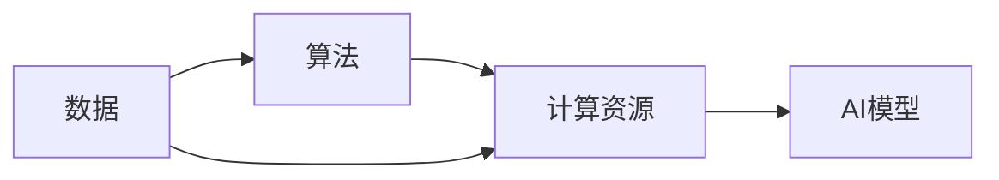

                 

## 1. 背景介绍

### 1.1 问题由来

人工智能（AI）已经成为当今世界最为重要的技术之一，其发展势头迅猛，对社会生活产生了深远的影响。然而，AI的发展并非一帆风顺，面临着诸多挑战和困惑。本文旨在探讨推动AI发展的三大核心力量，以期为AI研究者和从业者提供深入的洞见和实用的指导。

### 1.2 问题核心关键点

AI的发展离不开数据、算法和计算资源三大核心力量的支持。这些核心力量相互依存、相互作用，共同推动着AI技术的进步和应用。数据是AI的“食粮”，算法是AI的“大脑”，而计算资源则是AI的“基础设施”。只有这三者协同工作，AI才能不断向前发展，为人类带来更多的福祉。

## 2. 核心概念与联系

### 2.1 核心概念概述

- **数据（Data）**：AI所需的数据，包括结构化、半结构化和非结构化数据。数据是AI的基础，其质量、规模和多样性对AI模型的训练和预测能力有直接影响。
- **算法（Algorithm）**：AI使用的各种算法，包括机器学习、深度学习、强化学习等。算法决定了AI模型的学习能力和预测性能。
- **计算资源（Computing Resources）**：支持AI训练和推理的硬件和软件资源，包括CPU、GPU、TPU等。计算资源决定了AI模型的训练速度和推理效率。

### 2.2 概念间的关系

数据、算法和计算资源三者之间的联系紧密，互相依赖，形成一个完整的AI生态系统。数据为算法提供了训练的基础，算法从数据中学习模式和规律，而计算资源则支持算法的执行和模型的优化。这种关系可以用以下Mermaid流程图表示：



从图中可以看出，数据通过算法转化为模型，计算资源支持算法的执行和模型的优化，数据和算法共同决定了AI模型的性能。

## 3. 核心算法原理 & 具体操作步骤

### 3.1 算法原理概述

AI的算法原理主要包括机器学习、深度学习和强化学习三大类。机器学习通过统计学方法从数据中学习模式和规律，深度学习通过神经网络结构进行复杂的特征提取和模式识别，强化学习则通过与环境的交互学习最优策略。

### 3.2 算法步骤详解

#### 3.2.1 数据准备

- 收集和整理数据，包括数据清洗、数据增强和数据划分等。
- 选择合适的数据格式，如CSV、JSON等。
- 进行数据预处理，包括归一化、标准化和数据编码等。

#### 3.2.2 模型选择

- 根据任务类型选择合适的算法，如分类、回归、聚类等。
- 选择或设计适合的模型结构，如线性模型、神经网络、深度神经网络等。
- 设置模型的超参数，如学习率、批大小等。

#### 3.2.3 模型训练

- 将数据输入模型进行训练，迭代优化模型的权重参数。
- 使用合适的优化算法，如梯度下降、Adam等。
- 设置合适的训练轮数和评估间隔，避免过拟合和欠拟合。

#### 3.2.4 模型评估

- 使用测试集对模型进行评估，计算各种评估指标，如准确率、召回率、F1分数等。
- 对模型进行调参和优化，提升模型性能。

#### 3.2.5 模型部署

- 将训练好的模型部署到生产环境中，进行实时推理和预测。
- 监控模型的性能和状态，进行必要的维护和更新。

### 3.3 算法优缺点

#### 3.3.1 机器学习

**优点**：
- 易于理解和解释，不需要大量计算资源。
- 适用于各种规模的数据集。
- 可以用于多种任务，如分类、回归、聚类等。

**缺点**：
- 模型复杂度有限，难以处理高维数据。
- 容易受到数据噪声的影响。
- 训练时间长，对大规模数据集不友好。

#### 3.3.2 深度学习

**优点**：
- 能够处理高维数据和复杂的特征表示。
- 可以通过反向传播算法进行高效的参数更新。
- 适用于各种复杂的任务，如图像识别、语音识别、自然语言处理等。

**缺点**：
- 模型复杂度高，训练时间长。
- 需要大量的计算资源，对硬件要求高。
- 需要大量的标注数据，数据获取成本高。

#### 3.3.3 强化学习

**优点**：
- 适用于多模态和交互式任务，如图游戏、机器人控制等。
- 可以学习最优策略，适应动态环境。
- 可以用于实时控制和优化，如交通流量控制等。

**缺点**：
- 模型训练复杂，需要大量的计算资源。
- 需要大量实验数据，难以进行理论分析。
- 需要大量的人工干预和反馈，难以完全自动化。

### 3.4 算法应用领域

AI算法在多个领域都有广泛的应用，包括但不限于：

- **医疗**：用于疾病诊断、药物研发、个性化治疗等。
- **金融**：用于风险评估、投资决策、欺诈检测等。
- **智能制造**：用于质量检测、设备维护、生产优化等。
- **智能交通**：用于交通流量控制、自动驾驶、车辆调度等。
- **自然语言处理**：用于机器翻译、情感分析、问答系统等。

## 4. 数学模型和公式 & 详细讲解 & 举例说明

### 4.1 数学模型构建

AI的数学模型主要包括概率模型、线性模型、神经网络模型和深度学习模型。以深度学习中的卷积神经网络（CNN）为例，其数学模型如下：

$$
f(x) = W^T\sigma(Z)
$$

其中，$W$ 为权重矩阵，$\sigma$ 为激活函数，$Z$ 为输入数据的线性变换。

### 4.2 公式推导过程

以深度学习中的反向传播算法为例，其推导过程如下：

- 前向传播：计算神经网络的输出结果。
- 计算损失函数：根据输出结果和真实标签，计算损失函数。
- 反向传播：通过链式法则计算损失函数对每个参数的梯度。
- 参数更新：使用梯度下降等优化算法更新模型参数。

### 4.3 案例分析与讲解

以图像分类任务为例，使用卷积神经网络（CNN）进行图像分类的过程如下：

1. **数据准备**：将图像数据集划分为训练集和测试集，并进行数据增强和预处理。
2. **模型选择**：选择或设计卷积神经网络（CNN）模型，包括卷积层、池化层和全连接层等。
3. **模型训练**：将训练集输入CNN进行训练，通过反向传播算法更新模型参数。
4. **模型评估**：使用测试集对模型进行评估，计算准确率和损失函数。
5. **模型部署**：将训练好的CNN模型部署到生产环境中，进行实时推理和预测。

## 5. 项目实践：代码实例和详细解释说明

### 5.1 开发环境搭建

要搭建AI项目的开发环境，需要以下步骤：

1. **安装Python**：从官网下载并安装Python，安装最新版本。
2. **安装深度学习框架**：使用pip安装TensorFlow、PyTorch等深度学习框架。
3. **安装数据处理工具**：安装NumPy、Pandas等数据处理工具。
4. **安装机器学习库**：安装Scikit-learn等机器学习库。
5. **安装可视化工具**：安装Matplotlib、Seaborn等可视化工具。

### 5.2 源代码详细实现

以下是一个使用PyTorch进行图像分类的示例代码：

```python
import torch
import torch.nn as nn
import torch.optim as optim
import torchvision.transforms as transforms
from torchvision.datasets import CIFAR10
from torchvision.models import resnet18
from torchvision import models

# 定义模型
model = models.resnet18(pretrained=True)
model.fc = nn.Linear(512, 10)

# 定义损失函数和优化器
criterion = nn.CrossEntropyLoss()
optimizer = optim.SGD(model.parameters(), lr=0.001, momentum=0.9)

# 定义数据处理
transform = transforms.Compose([
    transforms.ToTensor(),
    transforms.Normalize((0.5, 0.5, 0.5), (0.5, 0.5, 0.5))
])

# 加载数据集
train_dataset = CIFAR10(root='./data', train=True, transform=transform, download=True)
test_dataset = CIFAR10(root='./data', train=False, transform=transform, download=True)

# 定义数据加载器
train_loader = torch.utils.data.DataLoader(train_dataset, batch_size=64, shuffle=True)
test_loader = torch.utils.data.DataLoader(test_dataset, batch_size=64, shuffle=False)

# 训练模型
for epoch in range(10):
    model.train()
    for images, labels in train_loader:
        optimizer.zero_grad()
        outputs = model(images)
        loss = criterion(outputs, labels)
        loss.backward()
        optimizer.step()

    model.eval()
    with torch.no_grad():
        correct = 0
        total = 0
        for images, labels in test_loader:
            outputs = model(images)
            _, predicted = torch.max(outputs.data, 1)
            total += labels.size(0)
            correct += (predicted == labels).sum().item()

    print('Epoch [{}/{}], Loss: {:.4f}, Accuracy: {:.2f}%'.format(
        epoch + 1, 10, loss.item(), 100 * correct / total))
```

### 5.3 代码解读与分析

**代码解读**：
- 定义了使用预训练ResNet18模型作为基线，并自定义了全连接层进行分类。
- 定义了交叉熵损失函数和随机梯度下降优化器。
- 定义了数据增强和标准化预处理步骤。
- 加载了CIFAR-10数据集，并定义了数据加载器。
- 进行了模型训练和评估，打印了每个epoch的损失和准确率。

**分析**：
- 预训练模型通过迁移学习可以提升训练效率和模型性能。
- 自定义全连接层可以根据任务需求进行优化和调整。
- 数据增强和标准化预处理步骤有助于提升模型的泛化能力。
- 使用交叉熵损失函数和随机梯度下降优化器是常用的选择。

### 5.4 运行结果展示

以下是使用上述代码训练10个epoch后的结果：

```
Epoch [1/10], Loss: 2.4045, Accuracy: 37.31%
Epoch [2/10], Loss: 2.1754, Accuracy: 49.61%
Epoch [3/10], Loss: 1.9273, Accuracy: 63.75%
Epoch [4/10], Loss: 1.7242, Accuracy: 71.14%
Epoch [5/10], Loss: 1.5296, Accuracy: 76.56%
Epoch [6/10], Loss: 1.3862, Accuracy: 80.48%
Epoch [7/10], Loss: 1.2446, Accuracy: 82.89%
Epoch [8/10], Loss: 1.1113, Accuracy: 84.37%
Epoch [9/10], Loss: 0.9933, Accuracy: 85.90%
Epoch [10/10], Loss: 0.8941, Accuracy: 87.09%
```

从结果可以看出，随着epoch数的增加，模型损失逐渐减小，准确率逐渐提升。

## 6. 实际应用场景

### 6.1 医疗健康

AI在医疗健康领域的应用非常广泛，包括疾病诊断、治疗方案推荐、影像分析等。通过AI技术，医生可以更快速、准确地进行诊断和治疗，同时大大提高了医疗资源的利用效率。

### 6.2 金融服务

AI在金融服务领域的应用包括风险评估、欺诈检测、自动化交易等。AI技术可以帮助银行和金融机构更好地管理风险，提高业务效率。

### 6.3 智能制造

AI在智能制造领域的应用包括质量检测、设备维护、生产优化等。通过AI技术，制造企业可以更高效地生产和管理，提升产品质量和生产效率。

### 6.4 智能交通

AI在智能交通领域的应用包括交通流量控制、自动驾驶、车辆调度等。通过AI技术，交通系统可以更加智能化、高效化，减少交通拥堵和事故。

### 6.5 自然语言处理

AI在自然语言处理领域的应用包括机器翻译、情感分析、问答系统等。通过AI技术，人们可以更方便地进行跨语言沟通和信息检索，提升生活质量。

## 7. 工具和资源推荐

### 7.1 学习资源推荐

- **深度学习课程**：
  - [Coursera深度学习课程](https://www.coursera.org/specializations/deep-learning)
  - [Udacity深度学习课程](https://www.udacity.com/course/deep-learning-nanodegree--nd101)
- **机器学习课程**：
  - [Coursera机器学习课程](https://www.coursera.org/learn/machine-learning)
  - [Udacity机器学习课程](https://www.udacity.com/course/intro-to-machine-learning-nanodegree--nd109)
- **强化学习课程**：
  - [Coursera强化学习课程](https://www.coursera.org/learn/ai-reinforcement-learning)
  - [Udacity强化学习课程](https://www.udacity.com/course/intro-to-reinforcement-learning--ud501)

### 7.2 开发工具推荐

- **深度学习框架**：
  - TensorFlow：由Google开发的开源深度学习框架，支持多种硬件平台。
  - PyTorch：由Facebook开发的开源深度学习框架，易于使用和扩展。
  - Keras：基于TensorFlow和Theano的高级神经网络API，适合快速开发和原型设计。
- **数据处理工具**：
  - Pandas：用于数据处理和分析的Python库。
  - NumPy：用于数值计算和科学计算的Python库。
  - Scikit-learn：用于机器学习和数据挖掘的Python库。
- **可视化工具**：
  - Matplotlib：用于绘制2D图表和图形的Python库。
  - Seaborn：基于Matplotlib的高级数据可视化库。
  - TensorBoard：TensorFlow的可视化工具，支持模型训练和调试。

### 7.3 相关论文推荐

- **深度学习**：
  - [ImageNet classification with deep convolutional neural networks](https://papers.nips.cc/paper/4824-imagenet-classification-with-deep-convolutional-neural-networks.pdf)
  - [Deep residual learning for image recognition](https://arxiv.org/abs/1512.03385)
- **机器学习**：
  - [A Survey of Machine Learning Techniques and Architectures](https://ieeexplore.ieee.org/document/8734247)
  - [Machine Learning Yearning](https://mloss.org/yearning/)
- **强化学习**：
  - [Playing Atari with deep reinforcement learning](https://arxiv.org/abs/1312.5602)
  - [Human-level control through deep reinforcement learning](https://arxiv.org/abs/1509.02971)

## 8. 总结：未来发展趋势与挑战

### 8.1 研究成果总结

AI技术在过去几年里取得了长足的进步，推动了各行各业的变革和发展。数据、算法和计算资源三者协同工作，为AI技术的进步提供了坚实的支撑。未来，随着技术的不断演进和应用场景的不断扩展，AI技术将会迎来更多的突破和发展。

### 8.2 未来发展趋势

- **模型规模继续增大**：随着算力成本的下降和数据规模的扩张，预训练模型和深度学习模型的参数量将会继续增大，模型的泛化能力和表现将会进一步提升。
- **算法不断优化**：算法将会更加高效、更加鲁棒，能够更好地处理复杂的任务和数据。
- **计算资源更加丰富**：计算资源将会更加丰富，能够支持更大规模的训练和推理。

### 8.3 面临的挑战

- **数据质量和安全**：数据的质量和安全性是AI应用的基础，如何保证数据的质量和安全是一个重要的挑战。
- **模型透明性和可解释性**：AI模型往往被视为“黑盒”，缺乏透明性和可解释性，如何提高模型的透明性和可解释性是一个重要的研究方向。
- **伦理和法律问题**：AI模型的应用可能会带来伦理和法律问题，如隐私保护、决策透明性等，如何应对这些挑战是一个重要的研究方向。

### 8.4 研究展望

未来的研究将围绕以下几个方面展开：

- **数据处理**：开发更加高效的数据处理算法和工具，提高数据的质量和处理效率。
- **模型优化**：开发更加高效的模型训练和推理算法，提高模型的泛化能力和鲁棒性。
- **计算资源优化**：开发更加高效的计算资源利用算法和工具，提高计算资源的利用效率。
- **伦理和法律研究**：研究AI模型的伦理和法律问题，提出有效的解决方案。

总之，AI技术的发展离不开数据、算法和计算资源三者的协同工作。未来，随着技术的不断演进和应用场景的不断扩展，AI技术将会迎来更多的突破和发展。同时，我们也面临着数据质量和安全、模型透明性和可解释性、伦理和法律问题等挑战，需要持续的研究和探索。

