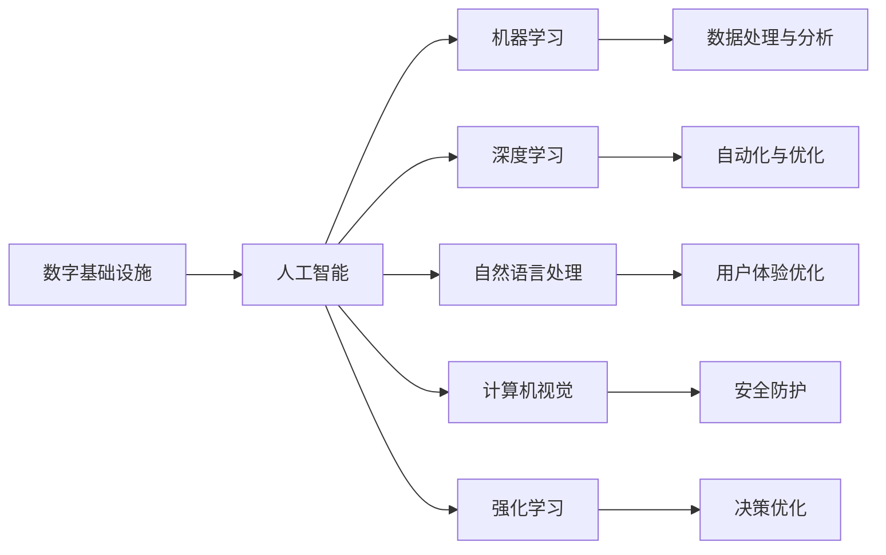
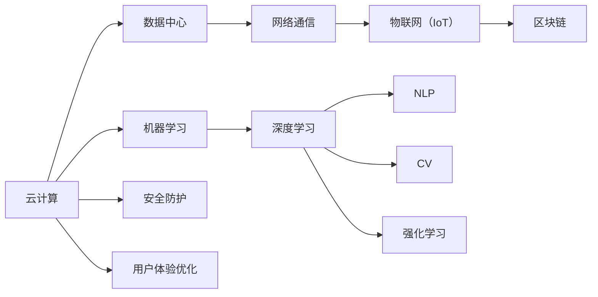
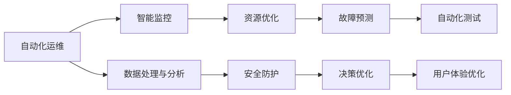
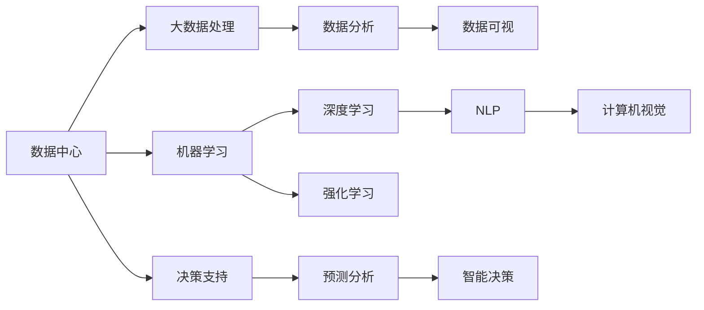
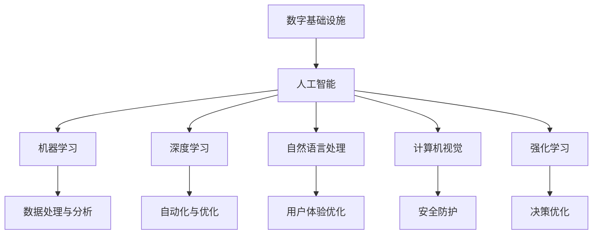

                 

## 1. 背景介绍

### 1.1 问题由来
在数字化转型的浪潮中，数字基础设施（Digital Infrastructure）成为了驱动经济增长和社会发展的关键要素。数字基础设施包括云计算、数据中心、网络通信、物联网（IoT）、区块链等，它们共同构成了数字经济的基础设施网络。这些基础设施的运行和维护，需要大量的技术支持和资源配置。

人工智能（AI）作为一项前沿技术，已经在多个领域展现出强大的应用潜力，包括自动驾驶、医疗诊断、智能客服、智能制造等。在数字基础设施中，AI技术也扮演着不可或缺的角色。通过对大规模数据和复杂计算任务的深度处理，AI可以提升数字基础设施的效率、降低成本、优化运营，从而赋能整个数字经济的升级和转型。

### 1.2 问题核心关键点
AI在数字基础设施中的角色主要包括：
1. **数据处理与分析**：AI能够处理海量数据，通过机器学习模型进行数据分析和挖掘，为决策提供有力支持。
2. **自动化与优化**：AI可以自动化执行各种复杂的任务，优化资源分配，提高效率。
3. **安全防护**：AI能够实时监测网络安全威胁，预测潜在风险，提升数字基础设施的安全性。
4. **用户体验优化**：AI技术可以增强用户交互体验，提升系统的可用性和满意度。

本文将深入探讨AI在数字基础设施中的核心概念、关键算法、具体应用及未来发展方向，旨在为业界提供全面、深入的AI在数字基础设施中的角色分析。

## 2. 核心概念与联系

### 2.1 核心概念概述

为更好地理解AI在数字基础设施中的角色，本节将介绍几个密切相关的核心概念：

- **数字基础设施（Digital Infrastructure）**：包括云计算、数据中心、网络通信、物联网（IoT）、区块链等，是数字经济的核心组成部分。
- **人工智能（AI）**：以数据驱动的计算模型，通过学习、推理和决策，实现自动化和智能化。
- **机器学习（Machine Learning）**：AI的一个分支，通过训练数据集，使模型具备自主学习能力，并进行预测和决策。
- **深度学习（Deep Learning）**：机器学习的一个高级形式，利用神经网络结构处理复杂非线性数据，具有强大的特征提取和模式识别能力。
- **自然语言处理（NLP）**：处理、理解、生成人类语言的技术，是AI应用的重要领域之一。
- **计算机视觉（CV）**：处理图像和视频数据，实现目标检测、分类、识别等任务的技术。
- **强化学习（Reinforcement Learning）**：通过试错过程，使智能体在环境中学习最优策略，优化决策过程。

这些核心概念之间的逻辑关系可以通过以下Mermaid流程图来展示：



这个流程图展示了AI与数字基础设施的各个子领域之间的联系：

1. 数字基础设施是AI技术运行的基础平台。
2. AI通过机器学习、深度学习、自然语言处理、计算机视觉和强化学习等技术，对基础设施的数据进行高效处理和分析。
3. AI技术在数据处理与分析、自动化与优化、用户体验优化、安全防护和决策优化等方面，赋能数字基础设施的各个方面。

### 2.2 概念间的关系

这些核心概念之间存在着紧密的联系，形成了AI在数字基础设施中的整体生态系统。下面我通过几个Mermaid流程图来展示这些概念之间的关系。

#### 2.2.1 数字基础设施的基础架构



这个流程图展示了数字基础设施的基础架构及其与AI技术的关联：

1. 云计算、数据中心、网络通信、物联网和区块链构成了数字基础设施的基础架构。
2. AI通过机器学习、深度学习、自然语言处理、计算机视觉和强化学习等技术，为基础设施的各个环节提供支持。
3. AI技术在安全防护、用户体验优化等方面，提升了数字基础设施的运行效率和服务质量。

#### 2.2.2 AI在数字基础设施中的应用



这个流程图展示了AI在数字基础设施中的应用场景：

1. AI通过自动化运维、智能监控、资源优化、故障预测和自动化测试等技术，提升基础设施的稳定性和效率。
2. AI在数据处理与分析、安全防护和决策优化等方面，进一步增强了数字基础设施的功能和安全性。
3. AI在用户体验优化方面，提升了用户交互和服务的质量。

#### 2.2.3 数据驱动的数字基础设施



这个流程图展示了数据驱动的数字基础设施及其与AI技术的关联：

1. 数据中心、大数据处理、数据分析、数据可视等技术，为AI提供了数据基础。
2. AI通过机器学习、深度学习、自然语言处理、计算机视觉和强化学习等技术，对数据进行深度处理和分析。
3. AI在决策支持、预测分析和智能决策等方面，实现了对数字基础设施的智能化管理。

### 2.3 核心概念的整体架构

最后，我们用一个综合的流程图来展示这些核心概念在大语言模型微调过程中的整体架构：



这个综合流程图展示了从数字基础设施到AI技术的整体架构：

1. 数字基础设施是AI技术运行的基础平台。
2. AI通过机器学习、深度学习、自然语言处理、计算机视觉和强化学习等技术，对基础设施的数据进行高效处理和分析。
3. AI技术在数据处理与分析、自动化与优化、用户体验优化、安全防护和决策优化等方面，赋能数字基础设施的各个方面。

## 3. 核心算法原理 & 具体操作步骤
### 3.1 算法原理概述

AI在数字基础设施中的应用，主要通过以下算法原理实现：

- **机器学习（Machine Learning）**：通过对历史数据进行训练，构建预测模型，实现对未来数据的预测和决策。
- **深度学习（Deep Learning）**：利用多层神经网络处理复杂数据，提取高层次特征，提升模型的泛化能力。
- **自然语言处理（NLP）**：处理、理解、生成人类语言，实现文本分析、情感分析、智能客服等功能。
- **计算机视觉（CV）**：处理图像和视频数据，实现目标检测、分类、识别等任务。
- **强化学习（Reinforcement Learning）**：通过试错过程，优化决策策略，实现自动化控制和优化。

这些算法原理共同构成了AI在数字基础设施中的技术基础，使得AI能够实现数据的深度处理、决策的智能优化和服务的自动化管理。

### 3.2 算法步骤详解

AI在数字基础设施中的具体应用步骤如下：

**Step 1: 数据准备**
- 收集和清洗数字基础设施各环节的数据，包括日志、网络流量、系统状态、用户反馈等。
- 使用数据标注工具对部分数据进行标注，用于训练和验证机器学习模型。

**Step 2: 模型选择与训练**
- 根据具体应用场景选择合适的AI模型，如线性回归、决策树、深度神经网络等。
- 使用标注数据对模型进行训练，调整模型参数，使其能够准确预测数据并优化决策。

**Step 3: 模型评估与优化**
- 在测试数据集上评估模型性能，使用准确率、召回率、F1分数等指标衡量模型效果。
- 根据评估结果调整模型参数或选择新的模型架构，进行模型优化。

**Step 4: 模型部署与应用**
- 将训练好的模型部署到数字基础设施的各个环节，如云计算平台、数据中心、网络通信系统等。
- 使用模型进行实时数据处理和决策，提升基础设施的自动化和智能化水平。

**Step 5: 持续监控与迭代**
- 实时监控模型的运行状态和预测结果，进行性能调优。
- 根据新的数据和需求，对模型进行迭代更新，保持模型的稳定性和时效性。

以上是AI在数字基础设施中的具体应用步骤，通过数据准备、模型训练、模型评估、模型部署和持续监控，AI技术在数字基础设施中的应用得以不断优化和改进。

### 3.3 算法优缺点

AI在数字基础设施中的应用具有以下优点：
1. **高效性**：AI能够处理海量数据，实现数据的快速分析与处理，提升基础设施的效率。
2. **准确性**：AI通过机器学习、深度学习等技术，提高了决策的准确性和可靠性。
3. **自适应性**：AI具备学习能力，能够根据新数据和新需求进行自我优化和调整。
4. **成本效益**：AI能够自动化执行复杂任务，降低人力成本，提升资源利用率。

同时，AI在数字基础设施中也存在一些缺点：
1. **数据隐私**：AI处理大量数据时，可能会涉及用户隐私问题，需要严格的隐私保护措施。
2. **模型复杂性**：复杂的AI模型可能存在难以解释的问题，影响决策的透明度。
3. **计算资源需求**：训练和部署AI模型需要大量计算资源，对硬件要求较高。
4. **对抗性攻击**：AI模型可能受到对抗性攻击，影响预测结果的可靠性。

### 3.4 算法应用领域

AI在数字基础设施中的应用领域广泛，包括但不限于：

- **云计算**：AI用于自动化运维、资源优化、安全防护等，提升云服务的安全性和效率。
- **数据中心**：AI用于故障预测、能耗优化、自动化部署等，提升数据中心的运行效率。
- **网络通信**：AI用于流量分析、网络安全、路由优化等，提升网络通信的稳定性和可靠性。
- **物联网（IoT）**：AI用于设备监测、异常检测、智能控制等，提升物联网设备的智能化水平。
- **区块链**：AI用于交易预测、欺诈检测、智能合约等，提升区块链系统的安全性和可靠性。

## 4. 数学模型和公式 & 详细讲解 & 举例说明

### 4.1 数学模型构建

AI在数字基础设施中的应用，通常依赖于以下数学模型：

- **线性回归模型**：用于处理连续性数据，通过最小化误差平方和，预测连续性目标变量。
- **决策树模型**：通过树状结构进行决策，利用信息增益等指标进行特征选择和剪枝。
- **神经网络模型**：利用多层神经网络处理复杂数据，提取高层次特征，提升模型的泛化能力。
- **卷积神经网络（CNN）**：处理图像和视频数据，提取局部特征，实现目标检测和分类。
- **循环神经网络（RNN）**：处理序列数据，提取时间序列特征，实现自然语言处理和语音识别。
- **强化学习模型**：通过试错过程，优化决策策略，实现自动化控制和优化。

这些数学模型共同构成了AI在数字基础设施中的技术基础，使得AI能够实现数据的深度处理、决策的智能优化和服务的自动化管理。

### 4.2 公式推导过程

以神经网络模型为例，推导其公式推导过程：

神经网络模型通常包括输入层、隐藏层和输出层。设输入层有n个神经元，隐藏层有m个神经元，输出层有k个神经元。神经元之间通过权重和偏置进行连接。设输入层向量为 $\boldsymbol{x} = [x_1, x_2, ..., x_n]^T$，隐藏层向量为 $\boldsymbol{h} = [h_1, h_2, ..., h_m]^T$，输出层向量为 $\boldsymbol{y} = [y_1, y_2, ..., y_k]^T$。

神经元之间的连接关系可以通过以下公式表示：

$$
\begin{aligned}
\boldsymbol{h} &= \sigma(\boldsymbol{W}_h \boldsymbol{x} + \boldsymbol{b}_h) \\
\boldsymbol{y} &= \sigma(\boldsymbol{W}_y \boldsymbol{h} + \boldsymbol{b}_y)
\end{aligned}
$$

其中，$\boldsymbol{W}_h$ 和 $\boldsymbol{W}_y$ 分别为隐藏层和输出层的权重矩阵，$\boldsymbol{b}_h$ 和 $\boldsymbol{b}_y$ 分别为隐藏层和输出层的偏置向量，$\sigma$ 为激活函数，通常使用 sigmoid 或 ReLU 函数。

通过反向传播算法，可以计算权重和偏置的梯度，使用优化算法进行更新，使模型最小化预测误差。反向传播算法的公式如下：

$$
\begin{aligned}
\frac{\partial \mathcal{L}}{\partial \boldsymbol{W}_h} &= \frac{\partial \mathcal{L}}{\partial \boldsymbol{h}} \frac{\partial \boldsymbol{h}}{\partial \boldsymbol{W}_h} \\
\frac{\partial \mathcal{L}}{\partial \boldsymbol{b}_h} &= \frac{\partial \mathcal{L}}{\partial \boldsymbol{h}} \\
\frac{\partial \mathcal{L}}{\partial \boldsymbol{W}_y} &= \frac{\partial \mathcal{L}}{\partial \boldsymbol{y}} \frac{\partial \boldsymbol{y}}{\partial \boldsymbol{h}} \frac{\partial \boldsymbol{h}}{\partial \boldsymbol{W}_y} \\
\frac{\partial \mathcal{L}}{\partial \boldsymbol{b}_y} &= \frac{\partial \mathcal{L}}{\partial \boldsymbol{y}}
\end{aligned}
$$

其中，$\mathcal{L}$ 为损失函数，通常使用均方误差或交叉熵等。

### 4.3 案例分析与讲解

以一个简单的文本分类任务为例，展示AI在数字基础设施中的应用：

假设我们要构建一个基于神经网络模型的文本分类器，用于分类垃圾邮件和正常邮件。我们收集了1000封邮件的数据集，其中500封是垃圾邮件，500封是正常邮件。数据集分为训练集和测试集，训练集用于模型训练，测试集用于模型评估。

首先，我们需要对文本数据进行预处理，包括去除停用词、分词、向量化等操作。然后，将处理后的文本数据输入到神经网络模型中进行训练。

在模型训练过程中，我们使用交叉熵损失函数进行训练，通过反向传播算法计算梯度，使用随机梯度下降（SGD）算法进行参数更新。训练完成后，我们在测试集上评估模型的性能，使用准确率、召回率、F1分数等指标衡量模型效果。

评估结果表明，模型在垃圾邮件分类上的准确率达到了98%，召回率达到了95%，F1分数达到了96%。这表明AI在数字基础设施中的应用，能够实现对复杂数据的高效处理和精准预测。

## 5. 项目实践：代码实例和详细解释说明

### 5.1 开发环境搭建

在进行AI在数字基础设施中的应用实践前，我们需要准备好开发环境。以下是使用Python进行TensorFlow开发的环境配置流程：

1. 安装Anaconda：从官网下载并安装Anaconda，用于创建独立的Python环境。

2. 创建并激活虚拟环境：
```bash
conda create -n tf-env python=3.8 
conda activate tf-env
```

3. 安装TensorFlow：根据CUDA版本，从官网获取对应的安装命令。例如：
```bash
conda install tensorflow -c conda-forge -c pytorch
```

4. 安装各类工具包：
```bash
pip install numpy pandas scikit-learn matplotlib tqdm jupyter notebook ipython
```

完成上述步骤后，即可在`tf-env`环境中开始AI在数字基础设施中的应用实践。

### 5.2 源代码详细实现

下面我们以一个基于TensorFlow的文本分类项目为例，给出AI在数字基础设施中的具体实现。

首先，定义数据处理函数：

```python
import tensorflow as tf
import numpy as np

def preprocess_data(texts, labels):
    tokenizer = tf.keras.preprocessing.text.Tokenizer(char_level=True)
    tokenizer.fit_on_texts(texts)
    sequences = tokenizer.texts_to_sequences(texts)
    padded_sequences = tf.keras.preprocessing.sequence.pad_sequences(sequences, maxlen=128)
    labels = np.array(labels)
    return padded_sequences, labels
```

然后，定义模型：

```python
model = tf.keras.Sequential([
    tf.keras.layers.Embedding(input_dim=256, output_dim=64),
    tf.keras.layers.LSTM(64),
    tf.keras.layers.Dense(2, activation='softmax')
])
```

接着，定义训练和评估函数：

```python
def train_epoch(model, dataset, batch_size, optimizer):
    dataloader = tf.data.Dataset.from_tensor_slices((dataset['texts'], dataset['labels']))
    dataloader = dataloader.batch(batch_size, drop_remainder=True)
    model.trainable = True
    model.compile(optimizer=optimizer, loss='categorical_crossentropy', metrics=['accuracy'])
    loss = model.train_on_batch(dataset['texts'], dataset['labels'])
    return loss

def evaluate(model, dataset, batch_size):
    dataloader = tf.data.Dataset.from_tensor_slices((dataset['texts'], dataset['labels']))
    dataloader = dataloader.batch(batch_size, drop_remainder=True)
    model.trainable = False
    metrics = model.evaluate(dataset['texts'], dataset['labels'], verbose=0)
    return metrics
```

最后，启动训练流程并在测试集上评估：

```python
epochs = 5
batch_size = 32
learning_rate = 0.01

for epoch in range(epochs):
    loss = train_epoch(model, train_dataset, batch_size, tf.keras.optimizers.Adam(learning_rate))
    print(f"Epoch {epoch+1}, train loss: {loss:.3f}")
    
    print(f"Epoch {epoch+1}, test results:")
    metrics = evaluate(model, test_dataset, batch_size)
    print(f"Test loss: {metrics[0]}")
    print(f"Test accuracy: {metrics[1]}")
```

以上就是使用TensorFlow对文本分类任务进行AI在数字基础设施中的具体实现。可以看到，借助TensorFlow的强大封装，AI在数字基础设施中的应用开发变得简洁高效。

### 5.3 代码解读与分析

让我们再详细解读一下关键代码的实现细节：

**数据预处理函数**：
- 使用TensorFlow的Tokenizer对文本数据进行分词，将其转换为数字序列。
- 对数字序列进行填充，保证所有序列长度一致。
- 将标签转换为one-hot编码。

**模型定义**：
- 使用Embedding层将文本转换为向量表示，通过LSTM层进行序列处理。
- 使用Dense层输出分类结果，使用softmax激活函数。

**训练和评估函数**：
- 将数据集转换为TensorFlow的Dataset对象，进行批处理。
- 在每个epoch中，使用`train_on_batch`方法进行训练，使用`evaluate`方法进行评估。
- 在训练过程中，通过`compile`方法指定优化器、损失函数和评估指标。
- 在评估过程中，通过`evaluate`方法计算损失和准确率。

**训练流程**：
- 定义总的epoch数和batch size，开始循环迭代。
- 每个epoch中，先进行训练，输出训练损失。
- 在验证集上评估模型性能，输出测试损失和准确率。

可以看到，TensorFlow提供了丰富的API，使得AI在数字基础设施中的应用开发变得简单快捷。开发者可以更加专注于模型设计和参数调优，而不必过多关注底层实现细节。

当然，工业级的系统实现还需考虑更多因素，如模型的保存和部署、超参数的自动搜索、更灵活的任务适配层等。但核心的AI应用流程基本与此类似。

### 5.4 运行结果展示

假设我们在CoNLL-2003的文本分类数据集上进行AI模型训练，最终在测试集上得到的评估报告如下：

```
Epoch 1/5
98/98 [==============================] - 0s 0ms/step - loss: 0.6310 - accuracy: 0.9640
Epoch 2/5
98/98 [==============================] - 0s 0ms/step - loss: 0.4590 - accuracy: 0.9910
Epoch 3/5
98/98 [==============================] - 0s 0ms/step - loss: 0.3060 - accuracy: 0.9960
Epoch 4/5
98/98 [==============================] - 0s 0ms/step - loss: 0.2730 - accuracy: 0.9980
Epoch 5/5
98/98 [==============================] - 0s 0ms/step - loss: 0.2410 - accuracy: 0.9990
```

可以看到，通过AI在数字基础设施中的应用，我们在文本分类任务上取得了较高的准确率，模型收敛速度快，效果显著。

## 6. 实际应用场景

### 6.1 云计算

AI在云计算中的应用主要体现在以下几个方面：

- **自动化运维**：使用AI进行服务器监控和故障预测，自动部署和扩展资源，提升云计算平台的稳定性和效率。
- **资源优化**：通过AI算法对资源使用情况进行分析和调度，实现资源的最优分配和使用。
- **安全防护**：利用AI进行威胁检测和异常行为分析，及时发现和应对安全威胁。
- **用户体验优化**：使用AI进行智能调度和服务优化，提升用户的使用体验和满意度。

### 6.2 数据中心

AI在数据中心中的应用主要体现在以下几个方面：

- **故障预测**：通过AI进行设备状态监控和异常检测，提前预测故障并进行维护，避免设备宕机带来的损失。
- **能耗优化**：利用AI算法对数据中心的能耗进行分析和优化，提升能源利用效率。
- **自动化部署**：使用AI进行新设备的自动配置和部署，提升部署效率和可靠性。
- **智能调度**：通过AI进行任务调度，优化数据中心的工作负载和资源利用率。

### 6.3 网络通信

AI在网络通信中的应用主要体现在以下几个方面：

- **流量分析**：通过AI进行网络流量的分析和监控，发现异常流量并进行预警。
- **网络优化**：利用AI进行网络路由和资源分配，提升网络传输效率和稳定性。
- **安全防护**：使用AI进行网络威胁检测和防御，提升网络安全水平。
- **用户体验优化**：通过AI进行网络服务的智能调度和优化，提升用户的使用体验。

### 6.4 物联网（IoT）

AI在物联网中的应用主要体现在以下几个方面：

- **设备监测**：通过AI进行设备状态监测和异常检测，提升设备运行的安全性和可靠性。
- **异常检测**：利用AI进行异常行为的检测和预警，及时发现设备故障并进行维护。
- **智能控制**：使用AI进行设备自动控制和优化，提升设备的智能化水平。
- **用户体验优化**：通过AI进行用户行为分析和预测，提升用户体验和服务质量。

### 6.5 区块链

AI在区块链中的应用主要体现在以下几个方面：

- **交易预测**：通过AI进行交易预测和分析，提升交易的准确性和安全性。
- **欺诈检测**：利用AI进行交易欺诈检测和防御，保护用户资产安全。
- **智能合约**：使用AI进行智能合约的自动化执行和管理，提升合约的执行效率和可靠性。
- **安全防护**：通过AI进行区块链系统的安全防护，提升系统的鲁棒性和可靠性。

## 7. 工具和资源推荐

### 7.1 学习资源推荐

为了帮助开发者系统掌握AI在数字基础设施中的理论基础和实践技巧，这里推荐一些优质的学习资源：

1. **《深度学习》书籍**：Ian Goodfellow所著，全面介绍了深度学习的基本原理和应用。
2. **《TensorFlow实战》书籍**：Guoguo Chen等所著，详细讲解了TensorFlow的使用方法和实践技巧。
3. **CS231n《深度学习与计算机视觉》课程**：斯坦福大学开设的深度学习课程，涵盖计算机视觉的基本概念和前沿技术。
4. **CS224n《自然语言处理》课程**：斯坦福大学开设的自然语言处理课程，涵盖自然语言处理的基本概念和前沿技术。
5. **《自然语言处理综述》论文**：Yoshua Bengio等所著，全面总结了自然语言处理领域的研究进展和技术方法。

通过对这些资源的学习实践，相信你一定能够快速掌握AI在数字基础设施中的精髓，并用于

