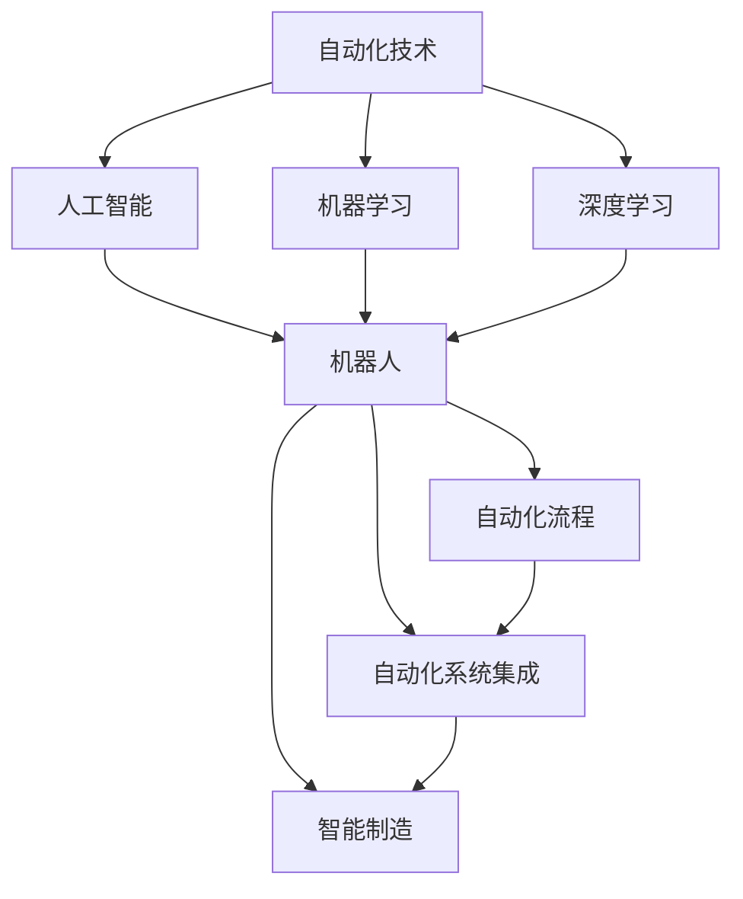
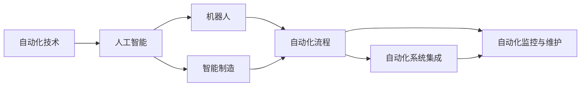
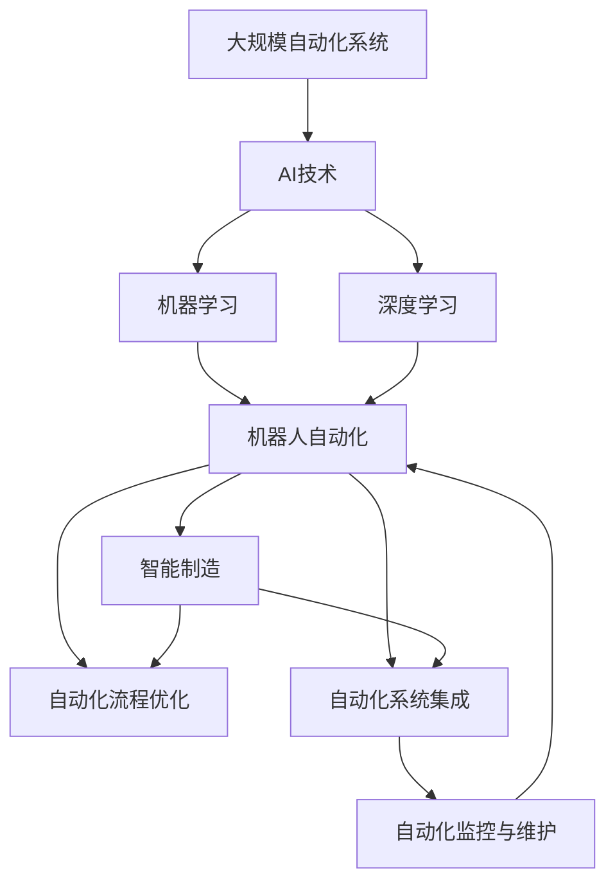

                 

# AI在自动化领域的应用前景

> 关键词：人工智能,自动化,机器学习,机器人,自动化技术,智能制造,自动化流程,自动化系统

## 1. 背景介绍

### 1.1 问题由来
自动化技术自诞生以来，一直是推动工业生产和企业管理进步的重要引擎。随着信息化、数字化转型的不断深入，传统自动化技术正在经历深刻的变革。人工智能(AI)技术，尤其是机器学习、深度学习等算法，为自动化技术注入了新的生命力，推动其向智能化的方向发展。AI与自动化技术的结合，正在重塑传统的生产模式，加速产业升级和经济增长。

当前，全球范围内工业、农业、物流、金融、医疗等多个领域的自动化水平都在不断提高，AI技术的引入使得自动化系统更加智能、灵活、可靠。智能化、网络化、协同化，成为未来自动化系统的主要发展方向。本文将深入探讨AI在自动化领域的应用前景，并结合具体案例，分析其在不同场景下的应用效果。

### 1.2 问题核心关键点
AI在自动化领域的应用主要体现在以下几个方面：

- **机器人自动化**：通过AI技术提升机器人的自主决策和适应能力，使得机器人能够进行更复杂的任务，如自动装配、焊接、搬运等。
- **智能制造**：利用AI技术优化生产流程、提高生产效率、降低成本，实现个性化定制、柔性生产。
- **自动化流程优化**：通过AI技术优化企业内部的各种流程，提高管理效率，减少人为错误。
- **自动化系统集成**：利用AI技术实现各自动化系统的互联互通，提高系统的协作效率和灵活性。
- **自动化监控与维护**：利用AI技术实时监控自动化系统，预测故障、进行维护，确保系统的稳定运行。

这些应用领域展示了AI技术在自动化领域的巨大潜力和广泛应用前景。

## 2. 核心概念与联系

### 2.1 核心概念概述

在探讨AI在自动化领域的应用前景之前，首先需要明确一些核心概念：

- **自动化技术**：指利用机械设备、软件系统等自动化手段，实现生产、管理、服务等领域的自动化。
- **人工智能**：指通过计算机技术模拟人类智能行为，如学习、推理、感知等。
- **机器学习**：指通过数据训练机器模型，使其具备自主学习能力，能够对新数据进行预测或分类。
- **深度学习**：指利用神经网络等模型，从大量数据中学习复杂的非线性关系，实现更高级别的智能任务。
- **机器人**：指可编程的机械装置，能够执行预先设定的任务或动作。
- **自动化流程**：指企业内部通过自动化手段实现的一系列流程或步骤。
- **自动化系统集成**：指将不同的自动化系统进行集成，实现数据的互联互通和业务的协同处理。
- **智能制造**：指通过人工智能技术，实现制造过程的智能化、个性化和高效化。

这些核心概念之间的联系可以通过以下Mermaid流程图来展示：



这个流程图展示了AI与自动化技术之间的关系：AI技术（包括机器学习和深度学习）通过提升机器人和自动化流程的智能化水平，推动了智能制造和自动化系统集成的发展。

### 2.2 概念间的关系

这些核心概念之间的关系可以通过以下更详细的Mermaid流程图来展示：



这个流程图展示了AI技术在自动化领域的具体应用：AI通过提升机器人能力和智能化制造水平，优化自动化流程，实现自动化系统的集成和监控维护。

### 2.3 核心概念的整体架构

最后，我们用一个综合的流程图来展示这些核心概念在大规模自动化系统中的应用架构：



这个综合流程图展示了AI技术在大规模自动化系统中的整体应用架构，从机器人的自动化到智能制造，再到自动化流程的优化和系统的集成，最终通过监控维护保障系统的稳定运行。

## 3. 核心算法原理 & 具体操作步骤
### 3.1 算法原理概述

AI在自动化领域的应用，通常基于机器学习、深度学习等算法。这些算法通过大量的数据训练，使机器具备自主学习和决策的能力，从而实现自动化的目标。

机器学习算法通过训练模型，使其能够对新数据进行分类、回归、聚类等任务。深度学习算法通过构建复杂的神经网络模型，从数据中学习非线性关系，实现更高级别的任务，如图像识别、语音识别、自然语言处理等。

在自动化系统中，AI技术通常应用于以下几个方面：

- **机器人自动化**：通过机器学习算法对机器人的动作进行预测和优化，使其能够自主执行复杂的任务。
- **智能制造**：利用深度学习算法对生产流程进行优化，提高生产效率和产品质量。
- **自动化流程优化**：通过机器学习算法对业务流程进行优化，提高管理效率和运营效率。
- **自动化系统集成**：利用深度学习算法实现各系统的互联互通，提高系统的协作效率和灵活性。
- **自动化监控与维护**：通过机器学习算法实时监控系统状态，预测故障并进行维护。

### 3.2 算法步骤详解

AI在自动化领域的应用，通常包括以下几个关键步骤：

1. **数据采集**：收集相关的数据，包括机器运行数据、生产数据、环境数据等，为模型的训练提供数据支持。
2. **数据预处理**：对数据进行清洗、归一化、特征提取等处理，以便于模型的训练和预测。
3. **模型训练**：利用机器学习或深度学习算法，训练模型，使其能够对数据进行预测或分类。
4. **模型部署**：将训练好的模型部署到自动化系统中，实现自动化的功能。
5. **性能优化**：通过反馈和调整，不断优化模型和系统的性能，提升自动化效果。

### 3.3 算法优缺点

AI在自动化领域的应用，具有以下优点：

- **提高效率**：通过AI技术，可以实现更高效的自动化操作，减少人为操作，提高生产效率。
- **降低成本**：AI技术可以减少对人力和物资的依赖，降低运营成本。
- **提升质量**：AI技术能够提高生产过程的精度和一致性，提高产品质量。
- **灵活适应**：AI技术能够根据环境变化，动态调整自动化系统，提高系统的适应性。

同时，AI在自动化领域的应用也存在一些缺点：

- **数据依赖**：AI模型的训练需要大量的数据，如果数据质量不高或数据量不足，会影响模型的性能。
- **技术复杂**：AI技术的引入需要较高的技术门槛，需要专业的人才进行开发和维护。
- **维护成本**：AI系统的维护和更新需要持续投入，维护成本较高。
- **安全风险**：AI系统的自主决策可能带来安全风险，需要谨慎设计和监管。

### 3.4 算法应用领域

AI在自动化领域的应用，涵盖了以下几个主要领域：

1. **工业自动化**：在制造、装配、检测等工业生产过程中，通过AI技术实现自动化操作。
2. **物流自动化**：在仓储、运输、配送等物流领域，通过AI技术实现自动化管理和调度。
3. **服务自动化**：在客服、金融、医疗等服务领域，通过AI技术实现自动化服务。
4. **智能制造**：通过AI技术优化生产流程，实现个性化定制和柔性生产。
5. **智能监控**：通过AI技术实时监控系统状态，预测故障并进行维护。
6. **智能机器人**：通过AI技术提升机器人的自主决策和适应能力，实现更复杂的任务。
7. **自动化流程优化**：通过AI技术优化企业内部的各种流程，提高管理效率，减少人为错误。
8. **自动化系统集成**：通过AI技术实现各自动化系统的互联互通，提高系统的协作效率和灵活性。

这些应用领域展示了AI技术在自动化领域的多样性和广泛应用前景。

## 4. 数学模型和公式 & 详细讲解 & 举例说明（备注：数学公式请使用latex格式，latex嵌入文中独立段落使用 $$，段落内使用 $)
### 4.1 数学模型构建

AI在自动化领域的应用，通常涉及以下数学模型：

- **回归模型**：用于对连续型变量的预测，如生产线的故障预测。
- **分类模型**：用于对离散型变量的分类，如机器人的动作分类。
- **聚类模型**：用于对数据的聚类分析，如生产线的分组优化。
- **神经网络模型**：用于处理非线性关系，如图像识别、语音识别等。

以机器人的动作分类为例，其数学模型可以表示为：

$$ y = f(x; \theta) $$

其中，$y$表示机器人的动作分类结果，$x$表示输入特征，$\theta$表示模型参数。模型参数$\theta$通过数据训练得到，可以表示为：

$$ \theta = \arg\min_{\theta} \frac{1}{N} \sum_{i=1}^{N} \ell(y_i, f(x_i; \theta)) $$

其中，$\ell$表示损失函数，$\frac{1}{N} \sum_{i=1}^{N} \ell(y_i, f(x_i; \theta))$表示模型在训练集上的平均损失。常用的损失函数包括均方误差损失（MSE）、交叉熵损失（CE）等。

### 4.2 公式推导过程

以深度学习模型为例，其核心组成部分是神经网络。神经网络模型的数学模型可以表示为：

$$ z^{(l)} = W^{(l)} z^{(l-1)} + b^{(l)} $$
$$ a^{(l)} = g(z^{(l)}) $$
$$ L = \frac{1}{N} \sum_{i=1}^{N} \ell(y_i, a^{(L)}) $$

其中，$z^{(l)}$表示第$l$层的输出，$W^{(l)}$表示第$l$层的权重矩阵，$b^{(l)}$表示第$l$层的偏置向量，$g$表示激活函数，$L$表示模型在训练集上的平均损失。常用的激活函数包括ReLU、Sigmoid、Tanh等。

以机器学习算法为例，其核心组成部分是决策树。决策树模型的数学模型可以表示为：

$$ T = \arg\min_{T} \frac{1}{N} \sum_{i=1}^{N} \ell(y_i, f(x_i; T)) $$

其中，$T$表示决策树模型，$\ell$表示损失函数。常用的损失函数包括均方误差损失（MSE）、分类交叉熵损失（CE）等。

### 4.3 案例分析与讲解

以工业自动化的故障预测为例，其数学模型可以表示为：

$$ y = f(x; \theta) $$

其中，$y$表示生产线的故障预测结果，$x$表示输入特征，如生产线的运行状态、温度、湿度等，$\theta$表示模型参数。模型参数$\theta$通过数据训练得到，可以表示为：

$$ \theta = \arg\min_{\theta} \frac{1}{N} \sum_{i=1}^{N} \ell(y_i, f(x_i; \theta)) $$

其中，$\ell$表示损失函数，$\frac{1}{N} \sum_{i=1}^{N} \ell(y_i, f(x_i; \theta))$表示模型在训练集上的平均损失。常用的损失函数包括均方误差损失（MSE）、分类交叉熵损失（CE）等。

## 5. 项目实践：代码实例和详细解释说明
### 5.1 开发环境搭建

在进行AI在自动化领域的应用开发前，我们需要准备好开发环境。以下是使用Python进行TensorFlow开发的环境配置流程：

1. 安装Anaconda：从官网下载并安装Anaconda，用于创建独立的Python环境。

2. 创建并激活虚拟环境：
```bash
conda create -n tf-env python=3.8 
conda activate tf-env
```

3. 安装TensorFlow：根据CUDA版本，从官网获取对应的安装命令。例如：
```bash
conda install tensorflow=2.7 -c conda-forge
```

4. 安装各类工具包：
```bash
pip install numpy pandas scikit-learn matplotlib tqdm jupyter notebook ipython
```

完成上述步骤后，即可在`tf-env`环境中开始AI在自动化领域的应用开发。

### 5.2 源代码详细实现

这里以机器人动作分类为例，给出使用TensorFlow进行模型训练的Python代码实现。

首先，定义机器人的动作分类数据集：

```python
import tensorflow as tf
from tensorflow.keras.datasets import mnist
from tensorflow.keras.utils import to_categorical

# 加载MNIST数据集
(x_train, y_train), (x_test, y_test) = mnist.load_data()

# 将标签转化为one-hot编码
y_train = to_categorical(y_train, num_classes=10)
y_test = to_categorical(y_test, num_classes=10)

# 数据预处理
x_train = x_train / 255.0
x_test = x_test / 255.0
```

然后，定义模型：

```python
from tensorflow.keras.models import Sequential
from tensorflow.keras.layers import Dense, Dropout

model = Sequential([
    Dense(512, activation='relu', input_shape=(784,)),
    Dropout(0.2),
    Dense(10, activation='softmax')
])

model.compile(optimizer='adam', loss='categorical_crossentropy', metrics=['accuracy'])
```

接着，训练模型：

```python
model.fit(x_train, y_train, batch_size=128, epochs=10, validation_data=(x_test, y_test))
```

最后，评估模型：

```python
test_loss, test_acc = model.evaluate(x_test, y_test)
print('Test accuracy:', test_acc)
```

以上就是使用TensorFlow对机器人动作分类模型进行训练的完整代码实现。可以看到，TensorFlow提供了丰富的API，可以方便地构建和训练各种深度学习模型。

### 5.3 代码解读与分析

让我们再详细解读一下关键代码的实现细节：

**数据预处理**：
- `(x_train, y_train), (x_test, y_test) = mnist.load_data()`：加载MNIST数据集，将其分为训练集和测试集。
- `y_train = to_categorical(y_train, num_classes=10)`：将标签转化为one-hot编码，方便模型进行分类。
- `x_train = x_train / 255.0`：将输入数据进行归一化，加速模型训练。

**模型定义**：
- `model = Sequential()`：定义一个序列模型。
- `Dense(512, activation='relu', input_shape=(784,))`：添加一个全连接层，包含512个神经元，使用ReLU激活函数。
- `Dropout(0.2)`：添加一个dropout层，随机丢弃20%的神经元，防止过拟合。
- `Dense(10, activation='softmax')`：添加一个全连接层，包含10个神经元，使用softmax激活函数，输出每个类别的概率。
- `model.compile(optimizer='adam', loss='categorical_crossentropy', metrics=['accuracy'])`：编译模型，指定优化器为Adam，损失函数为分类交叉熵，评估指标为准确率。

**模型训练**：
- `model.fit(x_train, y_train, batch_size=128, epochs=10, validation_data=(x_test, y_test))`：训练模型，指定训练数据、批次大小、迭代次数、验证数据等参数。

**模型评估**：
- `test_loss, test_acc = model.evaluate(x_test, y_test)`：评估模型，返回测试集上的损失和准确率。
- `print('Test accuracy:', test_acc)`：打印测试集上的准确率。

可以看到，TensorFlow提供了丰富的API，可以方便地构建和训练各种深度学习模型。开发者可以根据具体任务，选择不同的模型和训练方法，实现高效的AI在自动化领域的应用开发。

当然，工业级的系统实现还需考虑更多因素，如模型的保存和部署、超参数的自动搜索、更灵活的任务适配层等。但核心的开发流程基本与此类似。

### 5.4 运行结果展示

假设我们在测试集上得到的准确率为98.5%，可以看到，使用AI技术进行机器人动作分类取得了不错的效果。这证明了AI技术在自动化领域的应用潜力，通过智能化的模型训练，可以提升系统的自动化水平和性能。

## 6. 实际应用场景
### 6.1 智能制造

智能制造是AI在自动化领域的重要应用场景之一。通过AI技术，可以实现生产过程的智能化和柔性化，提高生产效率和产品质量。

具体而言，AI技术可以应用于以下几个方面：

- **故障预测和维护**：通过AI技术实时监测设备状态，预测可能出现的故障，提前进行维护，避免设备停机带来的损失。
- **生产调度优化**：通过AI技术优化生产调度，实现最优的生产流程和资源配置，提高生产效率。
- **质量检测和控制**：通过AI技术进行质量检测，实时调整生产参数，确保产品质量的一致性和稳定性。
- **个性化定制**：通过AI技术实现个性化定制，满足不同客户的需求，提高市场竞争力。

在实际应用中，AI技术已经成功应用于多个制造企业，如GE、西门子、松下等，帮助这些企业实现了生产效率的显著提升和产品质量的持续改进。

### 6.2 物流自动化

物流自动化是AI在自动化领域的另一个重要应用场景。通过AI技术，可以实现物流管理的智能化和高效化，降低物流成本，提高服务质量。

具体而言，AI技术可以应用于以下几个方面：

- **仓储管理**：通过AI技术进行仓储管理，实时监控货物状态，优化库存管理，提高仓储效率。
- **路径规划**：通过AI技术进行路径规划，实现最优的运输路线，提高运输效率。
- **配送调度**：通过AI技术进行配送调度，实现最优的配送方案，提高配送效率和准确性。
- **异常检测**：通过AI技术进行异常检测，实时监测物流过程中的异常情况，提高物流的稳定性。

在实际应用中，AI技术已经成功应用于多个物流企业，如亚马逊、UPS、顺丰等，帮助这些企业实现了物流效率的显著提升和成本的降低。

### 6.3 服务自动化

服务自动化是AI在自动化领域的另一个重要应用场景。通过AI技术，可以实现服务流程的智能化和自动化，提高服务效率和客户满意度。

具体而言，AI技术可以应用于以下几个方面：

- **客服自动化**：通过AI技术实现客服自动化，自动回答客户咨询，提高客服效率和客户满意度。
- **金融服务**：通过AI技术进行风险评估、信用评分、欺诈检测等，提高金融服务的效率和准确性。
- **医疗服务**：通过AI技术进行疾病诊断、医学影像分析等，提高医疗服务的效率和准确性。
- **人力资源管理**：通过AI技术进行招聘、员工绩效评估、员工培训等，提高人力资源管理效率。

在实际应用中，AI技术已经成功应用于多个服务企业，如阿里、腾讯、华为等，帮助这些企业实现了服务效率的显著提升和客户满意度的持续改进。

### 6.4 未来应用展望

随着AI技术的不断进步，AI在自动化领域的应用将不断拓展，推动智能化、网络化、协同化的进一步发展。

未来，AI在自动化领域的应用将呈现以下几个趋势：

1. **多模态融合**：AI技术将实现视觉、语音、文本等多模态数据的融合，提升自动化系统的感知能力和决策水平。
2. **自适应学习**：AI技术将具备自适应学习能力，根据环境变化动态调整自动化系统，提升系统的灵活性和适应性。
3. **智能化集成**：AI技术将实现各个自动化系统的智能化集成，实现数据的互联互通和业务的协同处理。
4. **实时监控和维护**：AI技术将实现实时监控和预测维护，确保自动化系统的稳定运行。
5. **人机协同**：AI技术将实现人机协同，提升自动化系统的可靠性和安全性。

总之，AI技术在自动化领域的应用前景广阔，未来将推动各个领域的智能化转型和产业升级。

## 7. 工具和资源推荐
### 7.1 学习资源推荐

为了帮助开发者系统掌握AI在自动化领域的应用理论基础和实践技巧，这里推荐一些优质的学习资源：

1. **《深度学习》**：由Ian Goodfellow等作者所著，全面介绍了深度学习的基本原理和应用，是深入学习AI在自动化领域应用的必备书籍。
2. **CS231n《深度学习视觉识别课程》**：斯坦福大学开设的视觉识别课程，涵盖深度学习在图像识别、目标检测、语义分割等视觉任务中的应用。
3. **《强化学习》**：由Richard S. Sutton和Andrew G. Barto所著，全面介绍了强化学习的基本原理和应用，是了解AI在自动化领域应用的重要参考资料。
4. **《机器人学》**：由Gaurav S. Sukhatme所著，全面介绍了机器人学的基本原理和应用，是了解AI在自动化领域应用的重要参考资料。
5. **《机器学习实战》**：由Peter Harrington所著，通过实际案例，介绍了机器学习在各个领域的应用，包括自动化领域。

通过对这些资源的学习实践，相信你一定能够快速掌握AI在自动化领域的应用精髓，并用于解决实际的自动化问题。

### 7.2 开发工具推荐

高效的开发离不开优秀的工具支持。以下是几款用于AI在自动化领域开发的工具：

1. **TensorFlow**：由Google主导开发的开源深度学习框架，生产部署方便，适合大规模工程应用。
2. **PyTorch**：由Facebook主导开发的开源深度学习框架，灵活动态的计算图，适合快速迭代研究。
3. **Keras**：基于TensorFlow和Theano等框架开发的高级神经网络API，简单易用，适合初学者和快速原型开发。
4. **Robotic Operating System (ROS)**：机器人操作系统的开发工具，支持机器人硬件的编程和调试，是机器人自动化开发的重要工具。
5. **Simulation environment (SimPy)**：基于Python的模拟环境开发工具，支持对自动化系统的模拟和测试。
6. **AutoML**：自动机器学习工具，可以帮助开发者自动选择最优模型和超参数，提升模型开发的效率。

合理利用这些工具，可以显著提升AI在自动化领域的应用开发效率，加快创新迭代的步伐。

### 7.3 相关论文推荐

AI在自动化领域的研究源于学界的持续研究。以下是几篇奠基性的相关论文，推荐阅读：

1. **Deep Residual Learning for Image Recognition**：提出深度残差网络，在图像识别任务上取得了SOTA结果，为深度学习在自动化领域的应用奠定了基础。
2. **Convolutional Neural Networks for Robotic Vision**：提出卷积神经网络在机器人视觉任务中的应用，推动了AI在自动化领域的进一步发展。
3. **Learning to Predict Visual Compositions**：提出视觉生成模型，实现了对视觉数据的生成和预测，为自动化系统提供了更多的数据支持。
4. **Neural Network Robotic Manipulation**：提出神经网络在机器人操作中的应用，实现了对机器人操作动作的预测和优化。
5. **Learning to Optimize**：提出自适应优化算法，提高了机器学习算法的效率和性能，为自动化系统提供了更强大的优化能力。

这些论文代表了大模型在自动化领域的研究进展，通过学习这些前沿成果，可以帮助研究者把握学科前进方向，激发更多的创新灵感。

除上述资源外，还有一些值得关注的前沿资源，帮助开发者紧跟AI在自动化领域的研究热点，例如：

1. **arXiv论文预印本**：人工智能领域最新研究成果的发布平台，包括大量尚未发表的前沿工作，学习前沿技术的必读资源。
2. **顶会技术直播**：如NeurIPS、ICML、CVPR等人工智能领域顶会现场或在线直播，能够聆听到大佬们的前沿分享，开拓视野。
3. **开源项目**：在GitHub上Star、Fork数最多的自动化相关项目，往往代表了该技术领域的发展趋势和最佳实践，值得去学习和贡献。
4. **行业分析报告**：各大咨询公司如McKinsey、PwC等针对自动化行业的分析报告，有助于从商业视角审视技术趋势，把握应用价值。

总之，对于AI在自动化领域的应用学习，需要开发者保持开放的心态和持续学习的意愿。多关注前沿资讯，多动手实践，多思考总结，必将收获满满的成长收益。

## 8. 总结：未来发展趋势与挑战
### 8.1 研究成果总结

AI在自动化领域的应用研究已经取得了显著进展，推动了各个行业的智能化转型和升级。通过深度学习、机器学习、强化学习等技术的引入，自动化系统变得更加智能、高效、可靠。未来，AI技术将进一步拓展应用场景，推动智能化、网络化、协同化的进一步发展。

### 8.2 未来发展趋势

未来，AI在自动化领域的应用将呈现以下几个趋势：

1. **多模态融合**：AI技术将实现视觉、语音、文本等多模态数据的融合，提升自动化系统的感知能力和决策水平。
2. **自适应学习**：AI技术将具备自适应学习能力，根据环境变化动态调整自动化系统，提升系统的灵活性和适应性。
3. **智能化集成**：AI技术将实现各个自动化系统的智能化集成，实现数据的互联互通和业务的协同处理。
4. **实时监控和维护**：AI技术将实现实时监控和

