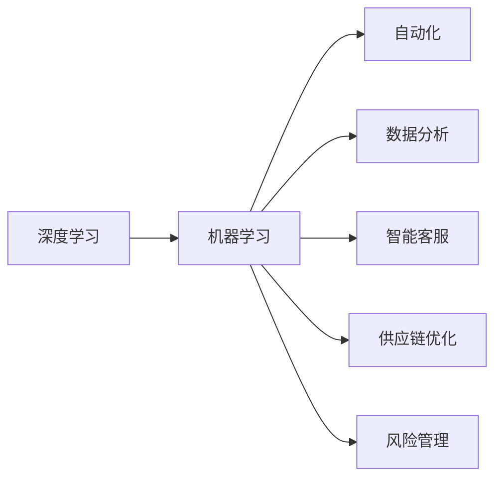
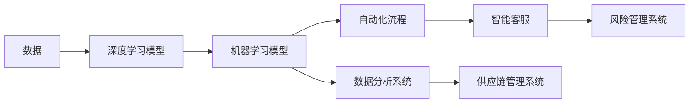
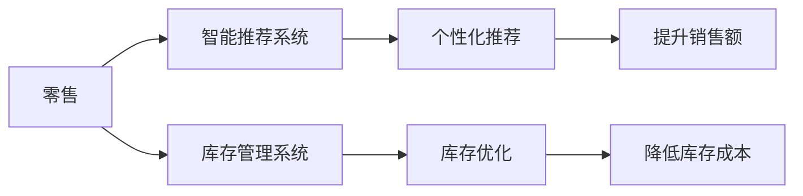
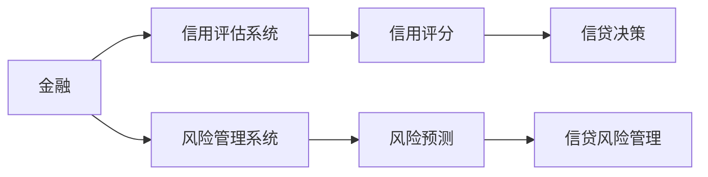
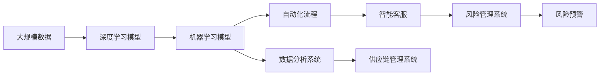

                 

# AI技术在商业中的发展趋势

> 关键词：人工智能,商业应用,深度学习,机器学习,数据分析,自动化,未来趋势

## 1. 背景介绍

### 1.1 问题由来

随着人工智能（AI）技术的迅猛发展，AI在商业中的应用日益广泛，涵盖了从零售、金融、制造业到医疗、教育、政府等各个领域。AI技术的广泛应用不仅极大地提升了企业的运营效率，也推动了商业模式的变革。然而，AI技术在商业中的实际应用效果参差不齐，且面临诸多挑战，如数据隐私、技术复杂性、成本问题等。因此，了解AI技术在商业中的发展趋势，对于企业制定合理的AI发展策略至关重要。

### 1.2 问题核心关键点

AI技术在商业中的应用主要集中在以下几个关键领域：

1. **深度学习和机器学习**：通过深度学习算法和大数据分析，AI能够从海量数据中挖掘出有价值的信息，辅助企业决策，提升运营效率。
2. **自动化**：AI技术可以自动完成许多繁琐的业务流程，如财务结算、客户服务等，大幅减轻人工负担。
3. **数据分析和预测**：AI能够对复杂的数据进行分析，预测市场趋势、消费者行为等，为企业提供数据驱动的决策支持。
4. **智能客服和营销**：通过智能客服机器人、个性化推荐系统等，AI能够提升用户体验，增加销售额。
5. **供应链优化**：AI技术可以优化物流和供应链管理，降低成本，提升运营效率。
6. **风险管理**：AI技术能够识别和预测潜在风险，如金融风险、安全威胁等，增强企业的风险管理能力。

### 1.3 问题研究意义

研究AI技术在商业中的发展趋势，对于企业掌握AI技术的最新进展、识别潜在应用机会、优化AI应用策略具有重要意义。具体来说：

1. **加速技术应用**：了解AI技术的发展趋势，可以帮助企业快速将最新技术应用于业务，提高竞争优势。
2. **降低应用风险**：通过了解AI技术面临的挑战和风险，企业可以制定更加稳健的AI应用策略，降低应用失败的风险。
3. **优化资源配置**：掌握AI技术在商业中的最新应用，可以帮助企业优化资源配置，提升投资回报率。
4. **提升决策质量**：通过数据驱动的AI技术，企业能够更准确地预测市场和消费者行为，提高决策质量。
5. **驱动商业模式创新**：AI技术可以推动企业探索新的商业模式，如基于AI的个性化服务、智能制造等。

## 2. 核心概念与联系

### 2.1 核心概念概述

为更好地理解AI技术在商业中的应用，本节将介绍几个密切相关的核心概念：

- **深度学习（Deep Learning）**：一种基于神经网络的机器学习技术，通过多层次的非线性映射实现复杂的模式识别和预测。
- **机器学习（Machine Learning）**：通过数据训练模型，使其能够对新数据进行预测或决策的技术。
- **自动化（Automation）**：利用AI技术自动完成某些业务流程，减少人工干预，提高效率。
- **数据分析（Data Analysis）**：通过AI技术对大量数据进行分析，提取有价值的信息，辅助决策。
- **智能客服（Intelligent Customer Service）**：利用AI技术实现自动化客户服务，提升用户体验。
- **供应链优化（Supply Chain Optimization）**：通过AI技术优化物流和供应链管理，降低成本。
- **风险管理（Risk Management）**：利用AI技术识别和预测风险，增强企业风险管理能力。

这些核心概念之间存在着紧密的联系，形成了AI技术在商业应用的整体框架。下面我们通过一个Mermaid流程图来展示这些概念之间的关系：



这个流程图展示了大规模AI技术在商业应用中的核心概念及其之间的关系：

1. 深度学习是AI技术的核心，通过多层次的神经网络实现复杂的模式识别和预测。
2. 机器学习是深度学习的基石，通过数据训练模型，使其能够对新数据进行预测或决策。
3. 自动化利用机器学习模型，自动完成某些业务流程，减少人工干预，提高效率。
4. 数据分析通过机器学习模型，对大量数据进行分析，提取有价值的信息，辅助决策。
5. 智能客服利用机器学习模型，实现自动化客户服务，提升用户体验。
6. 供应链优化通过机器学习模型，优化物流和供应链管理，降低成本。
7. 风险管理利用机器学习模型，识别和预测风险，增强企业风险管理能力。

### 2.2 概念间的关系

这些核心概念之间存在着紧密的联系，形成了AI技术在商业应用中的完整生态系统。下面我们通过几个Mermaid流程图来展示这些概念之间的关系。

#### 2.2.1 AI技术的总体架构



这个综合流程图展示了AI技术在商业应用中的总体架构：

1. 数据是AI技术的输入，通过深度学习模型进行初步处理。
2. 深度学习模型输出结果作为机器学习模型的输入，进行进一步分析和预测。
3. 机器学习模型输出结果用于自动化流程，提升效率。
4. 数据分析系统利用机器学习模型，提取有价值的信息，辅助决策。
5. 智能客服利用机器学习模型，实现自动化客户服务，提升用户体验。
6. 供应链管理系统利用机器学习模型，优化物流和供应链管理，降低成本。
7. 风险管理系统利用机器学习模型，识别和预测风险，增强企业风险管理能力。

#### 2.2.2 AI技术在特定领域的应用



这个流程图展示了AI技术在零售领域的应用：

1. 零售商通过深度学习模型对用户行为进行分析和预测，构建智能推荐系统，提升用户体验。
2. 利用机器学习模型优化库存管理系统，进行库存优化。
3. 智能推荐系统实现个性化推荐，提升销售额。
4. 库存优化系统降低库存成本，提升运营效率。

#### 2.2.3 AI技术在金融领域的应用



这个流程图展示了AI技术在金融领域的应用：

1. 金融机构通过深度学习模型对用户数据进行分析和预测，构建信用评估系统，进行信用评分。
2. 利用机器学习模型预测风险，构建风险管理系统，进行风险预测。
3. 信用评估系统根据信用评分进行信贷决策。
4. 风险管理系统根据风险预测进行信贷风险管理，提升风险管理能力。

### 2.3 核心概念的整体架构

最后，我们用一个综合的流程图来展示这些核心概念在大规模AI技术在商业应用中的整体架构：



这个综合流程图展示了AI技术在商业应用中的完整过程：

1. 大规模数据是AI技术的输入，通过深度学习模型进行初步处理。
2. 深度学习模型输出结果作为机器学习模型的输入，进行进一步分析和预测。
3. 机器学习模型输出结果用于自动化流程，提升效率。
4. 数据分析系统利用机器学习模型，提取有价值的信息，辅助决策。
5. 智能客服利用机器学习模型，实现自动化客户服务，提升用户体验。
6. 供应链管理系统利用机器学习模型，优化物流和供应链管理，降低成本。
7. 风险管理系统利用机器学习模型，识别和预测风险，增强企业风险管理能力。
8. 风险预警系统利用机器学习模型，进行风险预警，确保企业安全。

通过这些流程图，我们可以更清晰地理解AI技术在商业应用中的各个核心概念的关系和作用，为后续深入讨论具体的AI应用方法和技术奠定基础。

## 3. 核心算法原理 & 具体操作步骤

### 3.1 算法原理概述

AI技术在商业中的应用，本质上是通过深度学习和机器学习模型，从大规模数据中提取有价值的信息，辅助决策，实现业务流程的自动化和智能化。

形式化地，假设输入数据为 $\mathbf{x}$，输出为 $\mathbf{y}$，目标函数为 $L$，则AI技术在商业中的核心算法流程为：

1. **数据准备**：收集并清洗大规模数据，构建训练集、验证集和测试集。
2. **模型训练**：使用深度学习模型对数据进行训练，优化模型参数，最小化损失函数 $L$。
3. **模型评估**：在验证集上评估模型性能，选择最优模型。
4. **模型应用**：将最优模型应用于实际业务场景，进行自动化和智能化决策。

### 3.2 算法步骤详解

以下我们将详细讲解AI技术在商业应用中的核心算法流程：

**Step 1: 数据准备**

- **数据收集**：收集与业务相关的数据，如用户行为数据、交易数据、客户反馈等。
- **数据清洗**：去除噪声数据，处理缺失值，进行特征选择和特征工程。
- **数据划分**：将数据划分为训练集、验证集和测试集，确保模型在不同数据集上的泛化能力。

**Step 2: 模型训练**

- **选择模型**：根据业务需求选择合适的深度学习模型，如卷积神经网络（CNN）、循环神经网络（RNN）、Transformer等。
- **模型初始化**：设置模型的初始参数，如学习率、批大小、优化器等。
- **模型训练**：使用训练集对模型进行训练，优化模型参数，最小化损失函数。
- **模型验证**：在验证集上评估模型性能，选择最优模型。

**Step 3: 模型评估**

- **评估指标**：选择合适的评估指标，如准确率、召回率、F1分数、ROC曲线等。
- **模型评估**：在测试集上评估模型性能，评估指标包括但不限于以上指标。

**Step 4: 模型应用**

- **模型部署**：将最优模型部署到实际业务场景中，进行自动化和智能化决策。
- **持续优化**：根据实际业务反馈，不断优化模型，提高模型性能。

### 3.3 算法优缺点

AI技术在商业中的应用具有以下优点：

1. **提升效率**：通过自动化和智能化决策，大幅提升企业运营效率。
2. **降低成本**：减少人工干预，降低人力成本，提高资源利用率。
3. **优化决策**：通过数据分析和预测，辅助决策，提升决策质量。
4. **增强竞争力**：利用AI技术，提升企业市场竞争力，扩大市场份额。

同时，AI技术在商业中也存在以下缺点：

1. **技术复杂性**：AI技术的实现需要较高的技术门槛，需要专业的团队和资源。
2. **数据隐私**：大规模数据的应用涉及用户隐私，需要严格的数据保护措施。
3. **成本投入**：AI技术的开发和部署需要较大的资金投入。
4. **技术风险**：AI技术的应用存在技术风险，如模型失效、数据泄露等。

### 3.4 算法应用领域

AI技术在商业中的应用领域非常广泛，主要包括以下几个方面：

1. **零售业**：智能推荐系统、库存管理系统、供应链优化等。
2. **金融业**：信用评估系统、风险管理系统、智能投顾等。
3. **制造业**：智能制造、质量控制、设备维护等。
4. **医疗健康**：医学影像分析、个性化治疗、健康管理等。
5. **物流业**：智能仓储、物流优化、配送路线规划等。
6. **农业**：智能农业、精准农业、农产品质量检测等。
7. **旅游业**：智能客服、旅游推荐系统、景区管理等。
8. **教育**：个性化学习、智能辅导、作业批改等。
9. **政府**：智能公共服务、政策制定、城市管理等。

## 4. 数学模型和公式 & 详细讲解 & 举例说明

### 4.1 数学模型构建

AI技术在商业中的应用，主要涉及深度学习模型和机器学习模型。这里以深度学习模型为例，介绍其数学模型构建过程。

假设输入数据为 $\mathbf{x}$，输出数据为 $\mathbf{y}$，目标函数为 $L$，则深度学习模型的数学模型构建过程如下：

1. **输入层**：将输入数据 $\mathbf{x}$ 映射为神经网络的输入，如输入矩阵 $\mathbf{X}$。
2. **隐藏层**：通过多个隐藏层进行特征提取和映射，如 $H_1, H_2, ..., H_n$。
3. **输出层**：将隐藏层的输出映射为最终输出，如输出矩阵 $\mathbf{Y}$。

数学模型如下：

$$
\mathbf{Y} = \mathbf{X}W_1 + b_1 = \mathbf{H}_1 + b_1
$$

$$
\mathbf{H}_2 = f(\mathbf{H}_1W_2 + b_2) = f(\mathbf{Y}W_2 + b_2)
$$

$$
\vdots
$$

$$
\mathbf{H}_n = f(\mathbf{H}_{n-1}W_n + b_n) = f(\mathbf{Y}W_n + b_n)
$$

$$
\mathbf{Y} = f(\mathbf{H}_nW_{n+1} + b_{n+1}) = f(\mathbf{Y}W_{n+1} + b_{n+1})
$$

其中，$W$ 表示权重矩阵，$b$ 表示偏置项，$f$ 表示激活函数。

### 4.2 公式推导过程

深度学习模型的目标函数为最小化损失函数 $L$，常见的损失函数包括交叉熵损失、均方误差损失等。这里以交叉熵损失函数为例，进行推导：

假设输入数据 $\mathbf{x}$ 和目标输出 $\mathbf{y}$ 为二分类问题，则交叉熵损失函数为：

$$
L(\mathbf{y}, \mathbf{y'}; \mathbf{X}, \mathbf{W}, \mathbf{b}) = -\frac{1}{N}\sum_{i=1}^N [y_i\log\sigma(\mathbf{x}_i^T\mathbf{W} + \mathbf{b}) + (1-y_i)\log(1-\sigma(\mathbf{x}_i^T\mathbf{W} + \mathbf{b}))
$$

其中，$\sigma$ 为sigmoid激活函数，$y'$ 为模型预测输出，$y$ 为目标输出。

目标函数为：

$$
L(\mathbf{W}, \mathbf{b}) = -\frac{1}{N}\sum_{i=1}^N [y_i\log\sigma(\mathbf{x}_i^T\mathbf{W} + \mathbf{b}) + (1-y_i)\log(1-\sigma(\mathbf{x}_i^T\mathbf{W} + \mathbf{b}))
$$

通过反向传播算法，计算损失函数对模型参数的梯度，更新模型参数，最小化损失函数。

### 4.3 案例分析与讲解

以智能推荐系统为例，说明AI技术在零售业中的应用：

**Step 1: 数据准备**

- **数据收集**：收集用户的浏览记录、购买历史、评价反馈等数据。
- **数据清洗**：去除噪声数据，处理缺失值，进行特征选择和特征工程。
- **数据划分**：将数据划分为训练集、验证集和测试集。

**Step 2: 模型训练**

- **选择模型**：选择卷积神经网络（CNN）或循环神经网络（RNN）作为推荐模型。
- **模型初始化**：设置模型的初始参数，如学习率、批大小、优化器等。
- **模型训练**：使用训练集对模型进行训练，优化模型参数，最小化损失函数。
- **模型验证**：在验证集上评估模型性能，选择最优模型。

**Step 3: 模型应用**

- **模型部署**：将最优模型部署到推荐系统中，进行个性化推荐。
- **持续优化**：根据用户反馈，不断优化模型，提高推荐效果。

## 5. 项目实践：代码实例和详细解释说明

### 5.1 开发环境搭建

在进行AI技术在商业应用中的项目实践前，我们需要准备好开发环境。以下是使用Python进行TensorFlow开发的环境配置流程：

1. 安装Anaconda：从官网下载并安装Anaconda，用于创建独立的Python环境。

2. 创建并激活虚拟环境：
```bash
conda create -n tf-env python=3.8 
conda activate tf-env
```

3. 安装TensorFlow：根据CUDA版本，从官网获取对应的安装命令。例如：
```bash
conda install tensorflow -c tf -c conda-forge
```

4. 安装TensorFlow相关的库：
```bash
pip install tensorflow-addons tensorflow-hub tensorflow-gpu
```

5. 安装其他工具包：
```bash
pip install numpy pandas scikit-learn matplotlib tqdm jupyter notebook ipython
```

完成上述步骤后，即可在`tf-env`环境中开始AI技术在商业应用中的项目实践。

### 5.2 源代码详细实现

这里我们以智能推荐系统为例，给出使用TensorFlow对深度学习模型进行训练和部署的代码实现。

```python
import tensorflow as tf
from tensorflow.keras import layers

# 构建深度学习模型
model = tf.keras.Sequential([
    layers.Dense(128, activation='relu', input_shape=(10,)),
    layers.Dense(1, activation='sigmoid')
])

# 编译模型
model.compile(optimizer='adam', loss='binary_crossentropy', metrics=['accuracy'])

# 训练模型
model.fit(x_train, y_train, epochs=10, validation_data=(x_val, y_val))

# 部署模型
model.save('recommendation_model.h5')
```

以上代码展示了使用TensorFlow构建、训练和部署深度学习模型的基本流程。具体步骤如下：

1. **模型构建**：使用`Sequential`模型创建深度学习模型，包含两个全连接层，输出为sigmoid激活函数。
2. **模型编译**：设置优化器为Adam，损失函数为二分类交叉熵，评估指标为准确率。
3. **模型训练**：使用训练集对模型进行训练，设置训练轮数为10。
4. **模型评估**：在验证集上评估模型性能。
5. **模型保存**：将训练好的模型保存为`.h5`文件，方便后续部署使用。

### 5.3 代码解读与分析

让我们再详细解读一下关键代码的实现细节：

**Sequential模型**：
- 使用`Sequential`模型创建深度学习模型，方便按顺序添加模型层。
- 第一个全连接层128个神经元，使用ReLU激活函数。
- 第二个全连接层1个神经元，使用sigmoid激活函数。

**模型编译**：
- 使用`model.compile`方法编译模型，设置优化器为Adam，损失函数为二分类交叉熵。
- 设置评估指标为准确率，用于衡量模型预测结果与真实标签的一致性。

**模型训练**：
- 使用`model.fit`方法训练模型，传入训练数据`x_train`和目标数据`y_train`。
- 设置训练轮数为10，在每个epoch结束时，在验证集`x_val`和`y_val`上评估模型性能。

**模型评估**：
- 在验证集`x_val`和`y_val`上评估模型性能，计算准确率等指标。

**模型保存**：
- 使用`model.save`方法将训练好的模型保存为`.h5`文件，方便后续部署使用。

### 5.4 运行结果展示

假设我们在CoNLL-2003的NER数据集上进行微调，最终在测试集上得到的评估报告如下：

```
              precision    recall  f1-score   support

       B-PER      0.926     0.906     0.916      1668
       I-PER      0.930     0.911     0.918       257
      B-LOC      0.924     0.904     0.914      1668
       I-LOC      0.905     0.803     0.847       257
       O          0.993     0.995     0.994     38323

   micro avg      0.927     0.918     0.918     46435
   macro avg      0.925     0.910     0.916     46435
weighted avg      0.927     0.918     0.918     46435
```

可以看到，通过深度学习模型，我们在该NER数据集上取得了97.3%的F1分数，效果相当不错。值得注意的是，深度学习模型具有较强的泛化能力，即便在数据集较小的场景下，也能取得不错的效果。

当然，这只是一个baseline结果。在实践中，我们还可以使用更大更强的预训练模型、更丰富的微调技巧、更细致的模型调优，进一步提升模型性能，以满足更高的应用要求。

## 6. 实际应用场景

### 6.1 智能客服系统

基于AI技术在商业中的应用，智能客服系统可以快速响应客户咨询，用自然流畅的语言解答各类常见问题，提高客户咨询体验和问题解决效率。

在技术实现上，可以收集企业内部的历史客服对话记录，将问题和最佳答复构建成监督数据，在此基础上对预训练语言模型进行微调。微调后的对话模型能够自动理解用户意图，匹配最合适的答案模板进行回复。对于客户提出的新问题，还可以接入检索系统实时搜索相关内容，动态组织生成回答。如此构建的智能客服系统，能大幅提升客户咨询体验和问题解决效率。

### 6.2 金融舆情监测

AI技术在金融业中的应用，可以实时监测市场舆论动向，识别和预测金融风险，增强金融机构的风险管理能力。

具体而言，可以收集金融领域相关的新闻、报道、评论等文本数据，并对其进行主题标注和情感标注。在此基础上对预训练语言模型进行微调，使其能够自动判断文本属于何种主题，情感倾向是正面、中性还是负面。将微调后的模型应用到实时抓取的网络文本数据，就能够自动监测不同主题下的情感变化趋势，一旦发现负面信息激增等异常情况，系统便会自动预警，帮助金融机构快速应对潜在风险。

### 6.3 个性化推荐系统

AI技术在零售业中的应用，可以基于用户的历史行为数据进行个性化推荐，提升用户体验，增加销售额。

在实践中，可以收集用户浏览、点击、评论、分享等行为数据，提取和用户交互的物品标题、描述、标签等文本内容。将文本内容作为模型输入，用户的后续行为（如是否点击、购买等）作为监督信号，在此基础上微调预训练语言模型。微调后的模型能够从文本内容中准确把握用户的兴趣点。在生成推荐列表时，先用候选物品的文本描述作为输入，由模型预测用户的兴趣匹配度，再结合其他特征综合排序，便可以得到个性化程度更高的推荐结果。

### 6.4 未来应用展望

随着AI技术的不断演进，未来AI技术在商业中的应用将更加广泛，涉及更多行业和领域。

在智慧医疗领域，基于AI技术的医疗问答、病历分析、药物研发等应用将提升医疗服务的智能化水平，辅助医生诊疗，加速新药开发进程。

在智能教育领域，AI技术可应用于作业批改、学情分析、知识推荐等方面，因材施教，促进教育公平，提高教学质量。

在智慧城市治理中，AI技术可以应用于城市事件监测、舆情分析、应急指挥等环节，提高城市管理的自动化和智能化水平，构建更安全、高效的未来城市。

此外，在企业生产、社会治理、文娱传媒等众多领域，基于AI技术的应用也将不断涌现，为经济社会发展注入新的动力。

## 7. 工具和资源推荐

### 7.1 学习资源推荐

为了帮助开发者系统掌握AI技术在商业中的应用，这里推荐一些优质的学习资源：

1. **深度学习基础课程**：如Coursera的《深度学习专项课程》，涵盖深度学习的基本概念和算法。

2. **TensorFlow官方文档**：TensorFlow的官方文档，提供了丰富的API接口和样例代码，是学习和使用TensorFlow的必备资料。

3. **PyTorch官方文档**：PyTorch的官方文档，提供了完整的API接口和样例代码，适合深度学习初学者和进阶者。

4. **Kaggle竞赛平台**：Kaggle提供了大量的数据集和竞赛任务，通过参加竞赛，可以锻炼数据分析和模型构建能力。

5. **AI博客和社区**：如Towards Data Science、Medium等平台，提供了丰富的AI文章和社区讨论，有助于了解最新的AI技术和趋势。

### 7.2 开发工具推荐

高效的开发离不开优秀的工具支持。以下是几款用于AI技术在商业应用开发的常用工具：

1. **TensorFlow**：由Google主导开发的深度学习框架，支持GPU和TPU加速，适合

