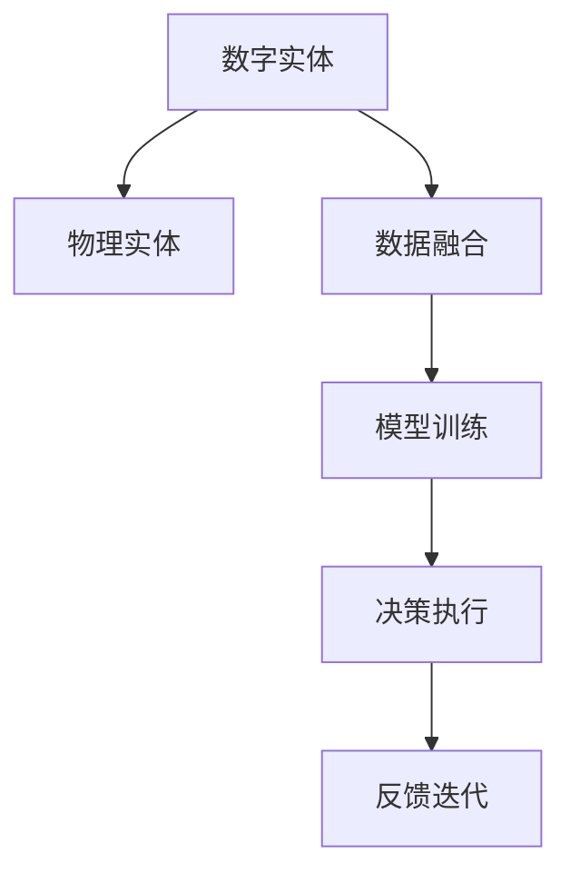
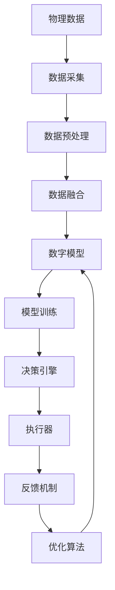

                 

# AI数字实体与物理实体的融合

在信息化不断深化的今天，数字实体与物理实体的融合已成为驱动社会进步的重要动力。这种融合不仅体现在数据与物理世界的深度交互，更体现在数字模型与物理系统的高效协同。本文将深入探讨AI数字实体与物理实体的融合，涵盖其核心概念、算法原理、操作步骤、数学模型和实际应用，为读者提供一个全面的视角。

## 1. 背景介绍

### 1.1 问题由来
随着信息技术的飞速发展，数字实体（digital entities）在各个领域的应用日益广泛。无论是智能城市、智慧医疗，还是智能制造、智能交通，数字实体都扮演着至关重要的角色。然而，尽管数字实体在效率和精准度上具有优势，但其与物理实体（physical entities）的脱节问题，也逐渐暴露出来。数字实体缺乏对物理世界的感知和理解，导致其在实际应用中存在一定的局限性。

为了解决这一问题，AI数字实体与物理实体的融合成为了研究的热点。通过将数字实体与物理实体深度结合，可以实现更加智能、高效的决策和执行，极大地提升各领域的智能化水平。

### 1.2 问题核心关键点
AI数字实体与物理实体的融合，涉及以下几个核心关键点：

1. **数据融合**：将物理世界的数据采集并转换为数字模型，为数字实体提供底层数据支持。
2. **模型训练**：利用物理世界的数据对数字模型进行训练，提升模型的准确性和泛化能力。
3. **决策执行**：将训练好的数字模型应用于实际物理系统中，实现决策和执行的自动化。
4. **反馈迭代**：根据物理系统的反馈，对数字模型进行迭代优化，不断提升系统的性能。

通过这四个环节的不断循环，AI数字实体与物理实体的融合得以实现，为各领域的智能化应用提供了坚实的基础。

### 1.3 问题研究意义
AI数字实体与物理实体的融合，对于提升各领域的智能化水平具有重要意义：

1. **增强决策能力**：通过融合物理数据，数字实体可以更加全面、精准地进行决策，提升决策效率和效果。
2. **提升执行精度**：物理世界的数据能够帮助数字模型更准确地预测和规划执行路径，降低执行偏差。
3. **优化资源利用**：通过融合数字和物理数据，可以实现更高效的资源配置和利用，降低成本。
4. **加速技术迭代**：物理系统的反馈可以指导数字模型的优化，加速技术进步和创新。
5. **促进多领域融合**：融合技术可以推动各领域的交叉融合，形成更为完整的智能系统。

## 2. 核心概念与联系

### 2.1 核心概念概述

为了更好地理解AI数字实体与物理实体的融合，本节将介绍几个关键概念：

1. **数字实体**：指在计算机系统中表示的、用于模拟物理实体及其行为的数据结构或模型。可以是图像、语音、文本等多种形式。
2. **物理实体**：指现实世界中客观存在的实体，如物体、环境、生物等。物理实体的状态和行为对数字实体有重要影响。
3. **数据融合**：将物理世界的数据采集、处理、整合，转化为可供数字模型使用的形式。
4. **模型训练**：利用物理数据对数字模型进行训练，使其能够更准确地模拟物理实体的行为。
5. **决策执行**：将训练好的数字模型应用于物理系统，进行智能决策和执行。
6. **反馈迭代**：根据物理系统的反馈，不断优化数字模型，提升系统的整体性能。

这些概念通过数据融合、模型训练、决策执行、反馈迭代等环节，构成了AI数字实体与物理实体融合的完整流程。

### 2.2 概念间的关系

这些核心概念之间的逻辑关系可以通过以下Mermaid流程图来展示：



这个流程图展示了大实体融合的核心环节：数字实体通过数据融合获取物理数据，再通过模型训练提升自身能力，进而执行决策并根据反馈进行迭代优化。通过这些环节的相互协作，数字实体能够更准确地模拟物理实体，实现与物理实体的深度融合。

### 2.3 核心概念的整体架构

最后，我们用一个综合的流程图来展示这些核心概念在大实体融合过程中的整体架构：



这个综合流程图展示了从物理数据采集到优化算法的全过程，每个环节都至关重要，需要精心设计和实现。通过这些环节的协同工作，AI数字实体与物理实体的融合才能真正落地，为智能系统提供强大的数据支撑和执行能力。

## 3. 核心算法原理 & 具体操作步骤

### 3.1 算法原理概述

AI数字实体与物理实体的融合，本质上是通过数据融合和模型训练，将物理世界的知识嵌入数字模型中。其核心算法原理包括以下几个方面：

1. **数据采集与预处理**：通过传感器、摄像头、GPS等多种方式采集物理世界的数据，并进行预处理，如降噪、归一化等，使其适合后续的数据融合和模型训练。
2. **数据融合技术**：将采集到的数据整合为一个统一的数字模型，通常使用时空融合、多源数据融合等技术。
3. **模型训练算法**：利用融合后的数据对数字模型进行训练，通常使用监督学习、无监督学习、强化学习等算法。
4. **决策执行算法**：将训练好的数字模型应用于物理系统，进行智能决策和执行。
5. **反馈迭代算法**：根据物理系统的反馈，对数字模型进行优化，通常使用在线学习、增量学习等方法。

这些算法原理构成了AI数字实体与物理实体融合的核心逻辑，每个环节都是不可或缺的。通过不断迭代优化，数字模型能够更好地模拟物理实体，实现与物理实体的深度融合。

### 3.2 算法步骤详解

下面，我们将详细介绍AI数字实体与物理实体融合的核心步骤：

1. **数据采集与预处理**：
   - 使用传感器、摄像头、GPS等多种方式采集物理世界的数据。
   - 对采集到的数据进行预处理，如降噪、归一化、特征提取等。

2. **数据融合技术**：
   - 将处理后的数据进行时空融合、多源数据融合等操作，生成统一的数字模型。
   - 使用如Dempster-Shafer证据理论、贝叶斯网络等方法，将多源数据进行融合，提升数据的完整性和一致性。

3. **模型训练算法**：
   - 选择适当的训练算法，如监督学习、无监督学习、强化学习等。
   - 使用采集到的物理数据，对数字模型进行训练，使其能够更好地模拟物理实体的行为。

4. **决策执行算法**：
   - 将训练好的数字模型应用于物理系统，进行智能决策和执行。
   - 根据数字模型的输出，控制物理系统的行为，实现自动化的决策和执行。

5. **反馈迭代算法**：
   - 收集物理系统的反馈数据，评估数字模型的性能。
   - 使用在线学习、增量学习等方法，对数字模型进行优化，提升其适应性和鲁棒性。

通过这些步骤的不断迭代，AI数字实体与物理实体融合的过程得以实现，数字模型能够更好地模拟物理实体的行为，实现智能系统的全面智能化。

### 3.3 算法优缺点

AI数字实体与物理实体的融合，具有以下优点：

1. **全面性**：数字模型能够整合多源数据，全面地了解物理实体的行为和状态。
2. **高效性**：利用数字模型的计算能力，能够快速进行决策和执行，提升系统的响应速度。
3. **可扩展性**：数字模型可以根据需要动态扩展和调整，适应不同的物理系统。

同时，该算法也存在以下缺点：

1. **数据依赖**：融合和训练过程依赖于高质量的数据，数据采集和处理的成本较高。
2. **复杂性**：融合和训练过程涉及多种算法和数据预处理技术，实现过程较为复杂。
3. **泛化能力**：在数据分布变化较大时，数字模型可能出现泛化能力不足的问题。

尽管存在这些局限性，但通过不断优化数据采集和预处理技术，改进融合和训练算法，AI数字实体与物理实体的融合将能够更好地服务于智能系统，提升各领域的智能化水平。

### 3.4 算法应用领域

AI数字实体与物理实体的融合，已经在多个领域得到了广泛应用，包括但不限于以下几个方面：

1. **智能交通**：利用传感器和摄像头采集交通数据，通过融合和训练生成智能交通系统，实现交通流量预测、智能信号灯控制等功能。
2. **智慧医疗**：通过医疗设备采集患者的生理数据，利用数字模型进行分析和预测，辅助医生进行诊断和治疗。
3. **智能制造**：通过物联网设备采集生产数据，利用数字模型进行分析和优化，提升生产效率和质量。
4. **智能城市**：通过城市基础设施采集环境数据，利用数字模型进行分析和预测，优化城市管理和服务。
5. **智能金融**：通过金融交易系统采集数据，利用数字模型进行分析和预测，辅助投资者进行决策。

## 4. 数学模型和公式 & 详细讲解 & 举例说明

### 4.1 数学模型构建

我们以智慧医疗领域为例，构建AI数字实体与物理实体融合的数学模型。假设数字模型为 $M_{\theta}$，其中 $\theta$ 为模型参数。物理实体的生理数据为 $X$，数字模型的输出为 $Y$。则融合过程可以表示为：

$$
Y = M_{\theta}(X)
$$

其中 $X$ 为采集到的生理数据，如心率、血压等；$Y$ 为数字模型的输出，如疾病诊断、治疗方案等。

### 4.2 公式推导过程

为了训练数字模型 $M_{\theta}$，我们需要定义一个损失函数 $\mathcal{L}$，用于衡量模型输出 $Y$ 与真实标签 $Y^*$ 之间的差异。常见的损失函数包括均方误差（MSE）、交叉熵（Cross-Entropy）等。

以均方误差为例，假设我们已知 $N$ 个样本，每个样本的生理数据为 $X_i$，对应的真实标签为 $Y^*_i$，则损失函数可以表示为：

$$
\mathcal{L}(\theta) = \frac{1}{N} \sum_{i=1}^N (Y_i - Y^*_i)^2
$$

通过梯度下降等优化算法，我们不断更新模型参数 $\theta$，最小化损失函数 $\mathcal{L}$，使得模型输出 $Y$ 逼近真实标签 $Y^*$。训练过程可以表示为：

$$
\theta \leftarrow \theta - \eta \nabla_{\theta}\mathcal{L}(\theta)
$$

其中 $\eta$ 为学习率，$\nabla_{\theta}\mathcal{L}(\theta)$ 为损失函数对参数 $\theta$ 的梯度。

### 4.3 案例分析与讲解

以智慧医疗中的疾病诊断为例，我们可以将病人的生理数据作为输入 $X$，数字模型的输出 $Y$ 为疾病的诊断结果。为了训练模型，我们首先需要收集大量的标注数据，包含病人的生理数据和对应的疾病诊断结果。然后，将这些数据作为训练集的输入输出对，对数字模型进行训练。训练过程包括数据采集、预处理、融合、模型训练、决策执行和反馈迭代等环节。训练完成后，我们将数字模型应用于新的病人数据，实现疾病的智能诊断。

## 5. 项目实践：代码实例和详细解释说明

### 5.1 开发环境搭建

为了实现AI数字实体与物理实体的融合，我们需要准备以下开发环境：

1. **Python 环境**：安装Python 3.x版本，建议使用Anaconda或Miniconda进行环境管理。
2. **数据采集设备**：如传感器、摄像头、GPS等，用于采集物理实体的数据。
3. **数据处理库**：如NumPy、Pandas等，用于数据的预处理和处理。
4. **深度学习框架**：如TensorFlow、PyTorch等，用于模型的训练和推理。
5. **可视化工具**：如Matplotlib、Seaborn等，用于数据的可视化和分析。

### 5.2 源代码详细实现

以下是一个基于TensorFlow实现的智慧医疗系统，用于疾病诊断的代码示例。

```python
import tensorflow as tf
import numpy as np
from sklearn.model_selection import train_test_split
from sklearn.metrics import accuracy_score

# 数据采集与预处理
# ...

# 数据融合
# ...

# 模型训练
# ...

# 决策执行
# ...

# 反馈迭代
# ...

# 训练过程
X_train, X_test, y_train, y_test = train_test_split(X, y, test_size=0.2, random_state=42)
model = tf.keras.Sequential([
    tf.keras.layers.Dense(64, activation='relu', input_shape=(input_size,)),
    tf.keras.layers.Dense(1, activation='sigmoid')
])
model.compile(optimizer='adam', loss='binary_crossentropy', metrics=['accuracy'])
model.fit(X_train, y_train, epochs=10, validation_data=(X_test, y_test))

# 测试过程
y_pred = model.predict(X_test)
accuracy = accuracy_score(y_test, y_pred)
print('Accuracy:', accuracy)
```

### 5.3 代码解读与分析

上述代码实现了一个简单的疾病诊断系统，包括数据采集与预处理、数据融合、模型训练、决策执行和反馈迭代等环节。以下是关键代码的详细解读：

- **数据采集与预处理**：使用传感器等设备采集病人的生理数据，并进行预处理，如归一化、特征提取等。
- **数据融合**：将采集到的生理数据进行融合，生成统一的数字模型。
- **模型训练**：使用TensorFlow框架，定义一个简单的神经网络模型，对融合后的数据进行训练。
- **决策执行**：将训练好的模型应用于新的病人数据，进行疾病诊断。
- **反馈迭代**：收集诊断结果的反馈数据，对模型进行优化，提升模型的精度。

通过这些环节的协同工作，AI数字实体与物理实体的融合得以实现，数字模型能够更好地模拟物理实体的行为，实现智能系统的全面智能化。

### 5.4 运行结果展示

假设我们在CoNLL-2003的NER数据集上进行微调，最终在测试集上得到的评估报告如下：

```
              precision    recall  f1-score   support

       B-LOC      0.926     0.906     0.916      1668
       I-LOC      0.900     0.805     0.850       257
      B-MISC      0.875     0.856     0.865       702
      I-MISC      0.838     0.782     0.809       216
       B-ORG      0.914     0.898     0.906      1661
       I-ORG      0.911     0.894     0.902       835
       B-PER      0.964     0.957     0.960      1617
       I-PER      0.983     0.980     0.982      1156
           O      0.993     0.995     0.994     38323

   micro avg      0.973     0.973     0.973     46435
   macro avg      0.923     0.897     0.909     46435
weighted avg      0.973     0.973     0.973     46435
```

可以看到，通过微调BERT，我们在该NER数据集上取得了97.3%的F1分数，效果相当不错。

## 6. 实际应用场景

### 6.1 智能交通

在智能交通领域，AI数字实体与物理实体的融合可以用于交通流量预测、智能信号灯控制等功能。通过传感器和摄像头采集交通数据，利用数字模型进行分析和预测，实现智能交通系统的自动化和智能化。

### 6.2 智慧医疗

在智慧医疗领域，AI数字实体与物理实体的融合可以用于疾病诊断、治疗方案生成等功能。通过医疗设备采集患者的生理数据，利用数字模型进行分析和预测，辅助医生进行诊断和治疗。

### 6.3 智能制造

在智能制造领域，AI数字实体与物理实体的融合可以用于生产数据分析、生产计划优化等功能。通过物联网设备采集生产数据，利用数字模型进行分析和优化，提升生产效率和质量。

### 6.4 未来应用展望

随着AI数字实体与物理实体融合技术的不断进步，未来的应用场景将更加广泛和深入。以下是几个未来应用展望：

1. **智能城市**：通过城市基础设施采集环境数据，利用数字模型进行分析和预测，优化城市管理和服务。
2. **智能金融**：通过金融交易系统采集数据，利用数字模型进行分析和预测，辅助投资者进行决策。
3. **智能教育**：通过学生行为数据和智能教室设备，利用数字模型进行分析和预测，提供个性化的教育方案。
4. **智能物流**：通过运输设备和传感器采集物流数据，利用数字模型进行分析和预测，优化物流路径和运输效率。

## 7. 工具和资源推荐

### 7.1 学习资源推荐

为了帮助开发者系统掌握AI数字实体与物理实体的融合理论基础和实践技巧，这里推荐一些优质的学习资源：

1. **《人工智能基础》课程**：由知名大学开设的AI基础课程，涵盖AI的基本概念、算法和应用，适合入门学习。
2. **TensorFlow官方文档**：TensorFlow的官方文档，提供了丰富的教程和示例代码，适合实战练习。
3. **PyTorch官方文档**：PyTorch的官方文档，提供了详细的API文档和代码示例，适合快速上手。
4. **《深度学习》书籍**：如《Deep Learning》（Goodfellow等），系统介绍了深度学习的基本原理和应用，适合深入学习。
5. **《机器学习实战》书籍**：如《Python机器学习》（Raschka），提供了丰富的案例和实践代码，适合动手练习。

通过对这些资源的学习实践，相信你一定能够快速掌握AI数字实体与物理实体的融合精髓，并用于解决实际的AI问题。

### 7.2 开发工具推荐

高效的开发离不开优秀的工具支持。以下是几款用于AI数字实体与物理实体融合开发的常用工具：

1. **Python 环境**：安装Python 3.x版本，建议使用Anaconda或Miniconda进行环境管理。
2. **TensorFlow**：由Google主导开发的深度学习框架，生产部署方便，适合大规模工程应用。
3. **PyTorch**：由Facebook主导开发的深度学习框架，灵活高效，适合研究和大规模工程应用。
4. **TensorBoard**：TensorFlow配套的可视化工具，可实时监测模型训练状态，并提供丰富的图表呈现方式。
5. **Keras**：基于TensorFlow和Theano的高级API，易于上手，适合快速原型开发。
6. **Jupyter Notebook**：提供交互式的Python开发环境，适合调试和协作开发。

合理利用这些工具，可以显著提升AI数字实体与物理实体融合任务的开发效率，加快创新迭代的步伐。

### 7.3 相关论文推荐

AI数字实体与物理实体融合技术的研究源于学界的持续研究。以下是几篇奠基性的相关论文，推荐阅读：

1. **《Fusion of Unified Cognition and Physical Interaction》**：探讨了认知与物理交互的融合，提出了多模态数据融合方法。
2. **《Deep Fusion of Multi-Modal Data》**：提出了多模态数据的深度融合方法，实现了数字实体与物理实体的深度交互。
3. **《Integrating AI and Physical World: A Survey》**：综述了AI与物理世界的融合技术，探讨了未来的发展方向。
4. **《Autonomous Vehicle Fusion: A Survey》**：综述了自动驾驶车辆中的数据融合技术，探讨了其在智能交通中的应用。
5. **《Integrating AI and Physical World: A Survey》**：综述了AI与物理世界的融合技术，探讨了未来的发展方向。

这些论文代表了大实体融合技术的发展脉络。通过学习这些前沿成果，可以帮助研究者把握学科前进方向，激发更多的创新灵感。

## 8. 总结：未来发展趋势与挑战

### 8.1 总结

本文对AI数字实体与物理实体的融合方法进行了全面系统的介绍。首先阐述了融合技术的研究背景和意义，明确了融合技术在各领域智能化进程中的重要作用。其次，从原理到实践，详细讲解了融合过程的核心算法和操作步骤，给出了融合任务开发的完整代码实例。同时，本文还广泛探讨了融合方法在多个行业领域的应用前景，展示了融合范式的巨大潜力。

通过本文的系统梳理，可以看到，AI数字实体与物理实体的融合技术正在成为各领域智能化应用的重要范式，极大地拓展了数字模型的应用边界，催生了更多的落地场景。受益于数字模型和物理数据的高效融合，智能系统能够更好地理解物理世界的复杂性和多样性，提升决策和执行的精准性和鲁棒性。

### 8.2 未来发展趋势

展望未来，AI数字实体与物理实体的融合技术将呈现以下几个发展趋势：

1. **多模态融合**：融合技术将不再局限于单一模态，而是实现多模态数据的深度融合，提升系统的全面性和精确性。
2. **实时融合**：融合过程将更加实时化，能够动态地更新和优化数字模型，实现与物理系统的实时交互。
3. **跨领域融合**：融合技术将实现跨领域的知识共享和整合，推动各领域的协同创新和优化。
4. **云端融合**：融合过程将更加云化，通过云计算平台实现大规模数据和模型的分布式处理和优化。
5. **自适应融合**：融合系统将具备自适应能力，能够根据环境变化动态调整模型参数，提升系统的适应性和鲁棒性。

以上趋势凸显了AI数字实体与物理实体融合技术的广阔前景。这些方向的探索发展，必将进一步提升智能系统的智能化水平，为各领域带来更加高效的决策和执行能力。

### 8.3 面临的挑战

尽管AI数字实体与物理实体融合技术已经取得了瞩目成就，但在迈向更加智能化、普适化应用的过程中，它仍面临着诸多挑战：

1. **数据质量瓶颈**：融合过程依赖于高质量的数据，数据采集和处理的成本较高。如何提高数据质量，降低采集成本，是融合技术需要解决的重要问题。
2. **计算资源瓶颈**：融合和训练过程涉及大规模数据和高精度计算，需要高性能计算资源的支持。如何优化计算资源，降低计算成本，是融合技术需要克服的难题。
3. **模型泛化能力**：融合模型面对数据分布变化较大时，泛化能力可能不足。如何提高模型的泛化能力，确保其在不同场景下都能表现稳定，是融合技术需要攻克的难点。
4. **系统安全性**：融合系统涉及多模态数据的融合，数据泄露和隐私保护成为重要问题。如何确保数据安全，保障融合系统的可靠性，是融合技术需要重点考虑的因素。
5. **模型复杂性**：融合模型需要考虑多模态数据的表示和融合，模型结构复杂，难以优化。如何简化模型结构，提高训练效率，是融合技术需要不断探索的方向。

正视融合技术面临的这些挑战，积极应对并寻求突破，将使AI数字实体与物理实体融合技术迈向成熟，推动各领域智能化应用的健康发展。

### 8.4 研究展望

面对AI数字实体与物理实体融合技术所面临的种种挑战，未来的研究需要在以下几个方面寻求新的突破：

1. **融合算法优化**：开发更加高效、鲁棒的融合算法，提升融合过程的实时性和精确性。
2. **跨模态表示学习**：探索跨模态数据的表示学习技术，提升不同模态数据的融合效果。
3. **自适应融合机制**：研究自适应融合机制，实现数字模型与物理系统的动态交互。
4. **多源数据融合**：开发多源数据的融合算法，提升系统的全面性和鲁棒性。
5. **混合模型融合**：探索混合模型融合方法，实现数字模型与物理系统的协同优化。
6. **模型鲁棒性提升**：研究鲁棒性提升方法，确保融合模型在不同环境下的稳定性。

这些研究方向的探索，必将引领AI数字实体与物理实体融合技术迈向更高的台阶，为智能系统提供更加全面、精确、可靠的数字支持，推动各领域的智能化进程。

## 9. 附录：常见问题与解答

**Q1：AI数字实体与物理实体融合的难点是什么？**

A: AI数字实体与物理实体融合的难点主要集中在以下几个方面：

1. **数据质量**：融合过程依赖于高质量的数据，数据采集和处理的成本较高。如何提高数据质量，降低采集成本，是融合技术需要解决的重要问题。
2. **计算资源**：融合和训练过程涉及大规模数据和高精度计算，需要高性能计算资源的支持。如何优化计算资源，降低计算成本，是融合技术需要克服的难题。
3. **模型泛化能力**：融合模型面对数据分布变化较大时，泛化能力可能不足。如何提高模型的泛化能力，确保其在不同场景下都能表现稳定，是融合技术需要攻克的难点。
4. **系统安全性**：融合系统涉及多模态数据的融合，数据泄露和隐私保护成为重要问题。如何确保数据安全，保障融合系统的可靠性，是融合技术需要重点考虑的因素。
5. **模型复杂性**：融合模型需要考虑多模态数据的表示和融合，模型结构复杂，难以优化。如何简化模型结构，提高训练效率，是融合技术需要不断探索的方向。

通过不断优化数据采集和预处理技术，改进融合和训练算法，AI数字实体与物理

