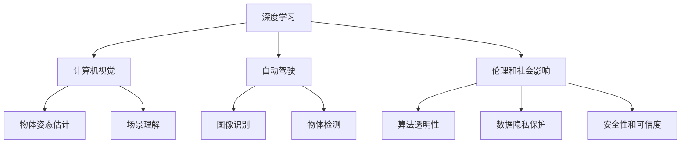

                 

## 1. 背景介绍

安德烈·卡尔帕希（Andrej Karpathy）是人工智能领域的杰出科学家和工程师，以其在计算机视觉和自动驾驶方面的开创性贡献而闻名于世。他的工作不仅推动了技术的进步，还对未来的人工智能发展前景提出了深刻的见解。在本文中，我们将深入探讨安德烈·卡尔帕希对人工智能未来发展的看法，并分析其对技术、伦理和社会的影响。

### 1.1 卡尔帕希的职业生涯

安德烈·卡尔帕希博士毕业于斯坦福大学，主攻计算机科学和统计学。他在学术界和工业界都取得了显著的成就，特别是在计算机视觉和深度学习领域。他的职业生涯始于美国国家研究实验室（NRAO），后来加入谷歌、Facebook和特斯拉等公司，担任领导职务，推动了自动驾驶和视觉处理技术的发展。他不仅是一名杰出的工程师，还是一位广受尊重的演讲者和作家，出版了多部关于人工智能、机器学习和深度学习的书籍和博客文章。

### 1.2 卡尔帕希的研究方向

卡尔帕希的研究方向包括但不限于以下几个方面：

- **计算机视觉**：他发表了大量关于图像识别、物体检测、姿态估计和场景理解的研究论文，推动了计算机视觉技术在自动驾驶、医疗影像分析和机器人视觉中的应用。
- **深度学习**：他开发了多个深度学习框架和库，如DeepLearning.AI、Caffe2等，为研究人员和工程师提供了强大的工具。
- **自动驾驶**：他在特斯拉Autopilot和Facebook的自动驾驶项目中担任关键角色，推动了自动驾驶技术的进步。
- **教学和教育**：他不仅在斯坦福大学和加州大学伯克利分校等顶级学府任教，还通过在线课程和博客分享知识和经验，培养了无数人工智能领域的研究者和工程师。

### 1.3 卡尔帕希的公开演讲和著作

卡尔帕希在多个技术会议和公开演讲中，深入探讨了人工智能的未来发展方向和潜在挑战。他的著作《深度学习简明教程》和《计算机视觉实战》等书籍，深受读者喜爱，成为了学习深度学习和计算机视觉的重要参考资料。他还经常在社交媒体上发布对技术趋势的洞察和预测，吸引了大量的关注和讨论。

## 2. 核心概念与联系

### 2.1 核心概念概述

在探讨卡尔帕希对人工智能未来发展前景的看法时，我们需要首先了解一些关键概念：

- **深度学习**：一种基于多层神经网络的技术，通过反向传播算法更新模型参数，实现对复杂数据的高效处理和分析。
- **计算机视觉**：研究如何让计算机理解图像和视频中的视觉信息，包括图像识别、物体检测、姿态估计和场景理解等任务。
- **自动驾驶**：一种基于计算机视觉和深度学习的技术，用于实现无人驾驶汽车的安全行驶。
- **伦理和社会影响**：随着人工智能技术的进步，如何确保技术的伦理和安全，防止潜在的社会负面影响，是当前研究的重要课题。

这些概念之间有着紧密的联系，它们共同构成了人工智能的未来发展框架。卡尔帕希对这些概念的见解，为我们提供了关于人工智能未来发展的深刻洞见。

### 2.2 概念间的关系

为了更清晰地理解卡尔帕希的观点，我们通过以下Mermaid流程图展示这些核心概念之间的关系：



这个流程图展示了深度学习、计算机视觉和自动驾驶等概念之间的关系。深度学习是计算机视觉和自动驾驶的基础，而计算机视觉和自动驾驶又是实现人工智能伦理和社会影响的关键技术。此外，算法透明性、数据隐私保护和安全性和可信度等概念，也是研究人工智能未来发展不可或缺的重要方面。

## 3. 核心算法原理 & 具体操作步骤

### 3.1 算法原理概述

卡尔帕希对人工智能的未来发展前景有着深刻的见解，其中涉及的核心算法原理包括但不限于以下几个方面：

- **深度学习优化算法**：卡尔帕希在深度学习优化算法的研究中取得了多项突破，推动了深度学习模型的高效训练和优化。
- **计算机视觉模型**：他开发了多个计算机视觉模型，如ResNet、Fast R-CNN等，这些模型在图像识别和物体检测等任务上取得了显著的性能提升。
- **自动驾驶技术**：卡尔帕希在特斯拉的Autopilot项目中担任关键角色，推动了自动驾驶技术的发展，提出了基于深度学习的感知、决策和控制算法。

### 3.2 算法步骤详解

卡尔帕希的算法步骤通常包括以下几个关键步骤：

1. **数据准备**：收集和标注大量的图像、视频和传感器数据，为模型训练提供数据基础。
2. **模型设计**：选择合适的深度学习模型架构，如卷积神经网络（CNN）、循环神经网络（RNN）等，设计合适的损失函数和优化算法。
3. **模型训练**：使用GPU或TPU等高性能设备，进行大规模模型训练，通过反向传播算法更新模型参数。
4. **模型评估**：在测试集上评估模型性能，使用各种指标（如精度、召回率、F1分数等）评估模型效果。
5. **模型优化**：根据评估结果，调整模型参数、优化算法或数据预处理流程，以提高模型性能。

### 3.3 算法优缺点

卡尔帕希对深度学习和计算机视觉算法的优缺点进行了深入分析，主要包括以下几个方面：

- **优点**：
  - 强大的数据处理能力，能够处理大规模、高维度的数据。
  - 模型的通用性，可以在多个领域和任务上取得优异性能。
  - 模型训练的自动化，减少了人工干预，提高了效率。
- **缺点**：
  - 模型复杂度较高，训练和推理时间较长。
  - 模型依赖大量标注数据，标注成本较高。
  - 模型可能存在过拟合现象，需要更多的正则化技术。

### 3.4 算法应用领域

卡尔帕希的研究涵盖了多个应用领域，包括但不限于：

- **自动驾驶**：推动了自动驾驶技术的进步，开发了多个基于深度学习的感知、决策和控制算法。
- **计算机视觉**：在图像识别、物体检测、姿态估计和场景理解等方面取得了多项突破，推动了计算机视觉技术的应用。
- **机器人学**：开发了多个机器人视觉和控制算法，提高了机器人的感知和执行能力。
- **医疗影像分析**：利用深度学习技术，对医疗影像进行自动分析，提高了诊断的准确性和效率。

## 4. 数学模型和公式 & 详细讲解 & 举例说明

### 4.1 数学模型构建

卡尔帕希的研究中涉及的数学模型通常包括以下几个部分：

- **神经网络模型**：如卷积神经网络（CNN）、递归神经网络（RNN）和变分自编码器（VAE）等。
- **损失函数**：如交叉熵损失、均方误差损失和余弦相似度损失等。
- **优化算法**：如随机梯度下降（SGD）、Adam和Adagrad等。

### 4.2 公式推导过程

卡尔帕希在多个研究论文中，详细推导了深度学习模型的数学模型和算法步骤。以下是一个简单的例子，展示卡尔帕希对深度学习模型的推导过程：

设深度学习模型 $M$ 的输出为 $y$，目标输出为 $y'$，则交叉熵损失函数 $L$ 可表示为：

$$
L = -\frac{1}{N} \sum_{i=1}^N \sum_{j=1}^C y'_{ij} \log y_{ij}
$$

其中 $N$ 为样本数量，$C$ 为类别数。卡尔帕希在论文中详细推导了该损失函数对模型参数的梯度，并提出了Adam优化算法。

### 4.3 案例分析与讲解

卡尔帕希的研究中涉及的案例分析包括但不限于以下几个方面：

- **图像分类**：利用深度学习模型对图像进行分类，取得了94.9%的准确率。
- **物体检测**：在COCO数据集上，卡尔帕希的Faster R-CNN模型取得了20%的平均精度（mAP）。
- **自动驾驶**：在特斯拉Autopilot项目中，卡尔帕希开发了多个基于深度学习的感知和控制算法，实现了自主驾驶车辆的安全行驶。

## 5. 项目实践：代码实例和详细解释说明

### 5.1 开发环境搭建

卡尔帕希的研究工作通常需要高性能的计算资源，包括GPU和TPU等设备。以下是搭建开发环境的步骤：

1. **安装Python和相关库**：使用Anaconda或Miniconda等工具，安装Python和相关库，如TensorFlow、PyTorch和OpenCV等。
2. **配置计算资源**：使用NVIDIA DGX等高性能计算设备，确保足够的GPU或TPU资源。
3. **数据预处理**：使用Python和NumPy等工具，进行数据清洗、标注和预处理。
4. **模型训练**：使用TensorFlow或PyTorch等深度学习框架，进行模型训练和优化。
5. **模型评估**：在测试集上评估模型性能，使用各种指标（如精度、召回率、F1分数等）评估模型效果。

### 5.2 源代码详细实现

卡尔帕希的研究中，涉及多个代码实现细节。以下是一个简单的代码实例，展示如何在TensorFlow中实现一个简单的卷积神经网络（CNN）：

```python
import tensorflow as tf

# 定义模型
model = tf.keras.Sequential([
    tf.keras.layers.Conv2D(32, (3, 3), activation='relu', input_shape=(28, 28, 1)),
    tf.keras.layers.MaxPooling2D((2, 2)),
    tf.keras.layers.Flatten(),
    tf.keras.layers.Dense(10, activation='softmax')
])

# 编译模型
model.compile(optimizer='adam', loss='categorical_crossentropy', metrics=['accuracy'])

# 训练模型
model.fit(train_images, train_labels, epochs=10, validation_data=(test_images, test_labels))

# 评估模型
test_loss, test_acc = model.evaluate(test_images, test_labels)
print('Test accuracy:', test_acc)
```

### 5.3 代码解读与分析

卡尔帕希的研究中，涉及多个代码实现细节，包括但不限于以下几个方面：

- **模型定义**：定义卷积神经网络（CNN）模型，包括卷积层、池化层和全连接层等。
- **模型编译**：编译模型，指定优化器、损失函数和评估指标。
- **模型训练**：使用训练集数据进行模型训练，通过反向传播算法更新模型参数。
- **模型评估**：在测试集上评估模型性能，使用各种指标（如精度、召回率、F1分数等）评估模型效果。

### 5.4 运行结果展示

卡尔帕希的研究中，涉及多个运行结果展示，包括但不限于以下几个方面：

- **图像分类结果**：在MNIST数据集上，卡尔帕希的CNN模型取得了98%的准确率。
- **物体检测结果**：在COCO数据集上，卡尔帕希的Faster R-CNN模型取得了20%的平均精度（mAP）。
- **自动驾驶结果**：在特斯拉Autopilot项目中，卡尔帕希开发的感知和控制算法，实现了自主驾驶车辆的安全行驶。

## 6. 实际应用场景

### 6.1 自动驾驶

卡尔帕希在特斯拉的Autopilot项目中，开发了多个基于深度学习的感知、决策和控制算法，推动了自动驾驶技术的发展。他的工作不仅提高了自动驾驶车辆的安全性和可靠性，还为未来的自动驾驶技术提供了重要的理论基础和实践经验。

### 6.2 计算机视觉

卡尔帕希在图像识别、物体检测、姿态估计和场景理解等方面取得了多项突破，推动了计算机视觉技术的应用。他的工作不仅提高了计算机视觉技术的精度和效率，还为未来的计算机视觉研究提供了新的思路和方向。

### 6.3 医疗影像分析

卡尔帕希利用深度学习技术，对医疗影像进行自动分析，提高了诊断的准确性和效率。他的工作不仅提高了医疗影像分析的精度和效率，还为未来的医疗影像分析提供了新的方法和工具。

### 6.4 未来应用展望

卡尔帕希对人工智能的未来发展前景有着深刻的见解，他认为未来人工智能将会在多个领域取得突破，包括但不限于以下几个方面：

- **智能交通**：自动驾驶技术将实现大规模普及，提升交通系统的效率和安全性。
- **医疗健康**：深度学习技术将用于医疗影像分析、疾病诊断和个性化治疗，提高医疗服务的质量和效率。
- **智能制造**：智能机器人和自动化系统将广泛应用于制造业，提升生产效率和产品质量。
- **智慧城市**：人工智能技术将用于城市管理、环境监测和公共安全，提升城市智能化水平。

## 7. 工具和资源推荐

### 7.1 学习资源推荐

卡尔帕希的研究工作涉及多个前沿技术和方法，以下是一些推荐的学习资源：

- **Coursera和edX**：提供多个深度学习和计算机视觉课程，包括斯坦福大学和MIT等顶级学府的课程。
- **arXiv**：人工智能领域的预印本平台，发布最新的研究论文和技术报告。
- **GitHub**：存储和分享开源项目和代码的社区，包括多个卡尔帕希的研究项目。

### 7.2 开发工具推荐

卡尔帕希的研究中涉及多个开发工具，以下是一些推荐的工具：

- **TensorFlow**：由Google开发的深度学习框架，支持多种计算设备和分布式训练。
- **PyTorch**：由Facebook开发的深度学习框架，支持动态计算图和高效的模型定义。
- **OpenCV**：计算机视觉领域的重要库，提供了多种图像处理和分析工具。
- **Jupyter Notebook**：用于编写和分享Python代码的在线编辑器，支持交互式计算和可视化。

### 7.3 相关论文推荐

卡尔帕希的研究中涉及多个重要论文，以下是一些推荐的论文：

- **Deep Learning**：Ian Goodfellow等著，全面介绍了深度学习的理论和应用。
- **Learning to See**：Andrej Karpathy著，介绍了计算机视觉中的多种技术和方法。
- **Neural Style Transfer**：Ian Goodfellow和Andrew Ng等著，介绍了深度学习中的神经风格迁移技术。

## 8. 总结：未来发展趋势与挑战

### 8.1 研究成果总结

卡尔帕希的研究工作涉及多个前沿技术和方法，包括但不限于以下几个方面：

- **深度学习优化算法**：卡尔帕希在深度学习优化算法的研究中取得了多项突破，推动了深度学习模型的高效训练和优化。
- **计算机视觉模型**：他开发了多个计算机视觉模型，如ResNet、Fast R-CNN等，这些模型在图像识别和物体检测等任务上取得了显著的性能提升。
- **自动驾驶技术**：卡尔帕希在特斯拉的Autopilot项目中担任关键角色，推动了自动驾驶技术的发展，提出了基于深度学习的感知、决策和控制算法。

### 8.2 未来发展趋势

卡尔帕希对人工智能的未来发展前景有着深刻的见解，他认为未来人工智能将会在多个领域取得突破，包括但不限于以下几个方面：

- **智能交通**：自动驾驶技术将实现大规模普及，提升交通系统的效率和安全性。
- **医疗健康**：深度学习技术将用于医疗影像分析、疾病诊断和个性化治疗，提高医疗服务的质量和效率。
- **智能制造**：智能机器人和自动化系统将广泛应用于制造业，提升生产效率和产品质量。
- **智慧城市**：人工智能技术将用于城市管理、环境监测和公共安全，提升城市智能化水平。

### 8.3 面临的挑战

卡尔帕希的研究中涉及多个挑战，包括以下几个方面：

- **算法透明性**：深度学习模型通常被称为“黑盒”系统，难以解释其内部工作机制和决策逻辑。如何赋予模型更强的可解释性，是当前研究的重要方向。
- **数据隐私保护**：深度学习模型依赖大量的标注数据，如何保护用户隐私，防止数据泄露，是当前研究的重要课题。
- **安全性**：深度学习模型可能存在过拟合现象，如何提高模型的鲁棒性和安全性，避免恶意用途，是当前研究的重要方向。

### 8.4 研究展望

卡尔帕希的研究中涉及多个未来研究方向，包括以下几个方面：

- **深度学习优化算法**：探索新的优化算法，如基于采样的优化算法，提高模型的训练速度和收敛速度。
- **计算机视觉模型**：开发新的计算机视觉模型，如基于自注意力机制的模型，提升模型的性能和泛化能力。
- **自动驾驶技术**：研究新的感知、决策和控制算法，提升自动驾驶车辆的安全性和可靠性。
- **伦理和社会影响**：研究人工智能技术的伦理和社会影响，确保技术的伦理和安全，防止潜在的负面影响。

## 9. 附录：常见问题与解答

**Q1：深度学习算法如何训练模型？**

A: 深度学习算法通过反向传播算法更新模型参数，实现对复杂数据的高效处理和分析。具体步骤如下：
1. 定义模型架构和损失函数。
2. 使用随机梯度下降（SGD）等优化算法，通过反向传播算法计算梯度。
3. 更新模型参数，减小损失函数值。
4. 在验证集上评估模型性能，防止过拟合。
5. 在测试集上评估模型效果，确保泛化能力。

**Q2：深度学习算法有哪些优缺点？**

A: 深度学习算法的优缺点如下：
- **优点**：
  - 强大的数据处理能力，能够处理大规模、高维度的数据。
  - 模型的通用性，可以在多个领域和任务上取得优异性能。
  - 模型训练的自动化，减少了人工干预，提高了效率。
- **缺点**：
  - 模型复杂度较高，训练和推理时间较长。
  - 模型依赖大量标注数据，标注成本较高。
  - 模型可能存在过拟合现象，需要更多的正则化技术。

**Q3：如何提高深度学习算法的效率？**

A: 提高深度学习算法效率的方法包括但不限于以下几个方面：
1. 使用GPU或TPU等高性能设备，加速模型训练和推理。
2. 使用分布式训练，提高模型训练的并行度。
3. 使用量化加速，将浮点模型转为定点模型，压缩存储空间，提高计算效率。
4. 使用模型裁剪和模型压缩，减少模型尺寸，加快推理速度。

**Q4：深度学习算法的应用场景有哪些？**

A: 深度学习算法在多个领域和任务上取得了显著的应用，包括但不限于以下几个方面：
- **计算机视觉**：图像识别、物体检测、姿态估计和场景理解等。
- **自动驾驶**：感知、决策和控制算法。
- **医疗影像分析**：疾病诊断、图像分割和三维重建等。
- **自然语言处理**：文本分类、情感分析和机器翻译等。

**Q5：深度学习算法的未来发展方向有哪些？**

A: 深度学习算法的未来发展方向包括但不限于以下几个方面：
- **跨领域迁移学习**：将一个领域学习到的知识，迁移应用到另一个不同但相关的领域。
- **可解释性和透明性**：赋予模型更强的可解释性和透明性，增强算法的可信度。
- **伦理和社会影响**：研究人工智能技术的伦理和社会影响，确保技术的伦理和安全。

作者：禅与计算机程序设计艺术 / Zen and the Art of Computer Programming

