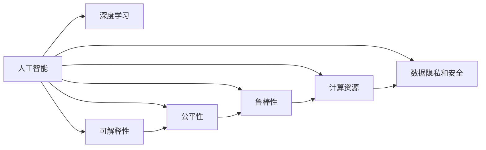

                 

## 1. 背景介绍

安德烈·卡帕西（Andrej Karpathy），深度学习领域的知名专家，以其在计算机视觉、自动驾驶和教育等多个领域的卓越贡献闻名于世。他的研究和教学工作在推动人工智能技术发展、普及和教育上发挥了重要影响。本文将基于安德烈·卡帕西的观点，探讨人工智能的未来发展面临的挑战和机遇。

### 1.1 问题由来

随着人工智能技术的快速发展，越来越多的研究者和工程师在探索如何让机器更好地理解和执行复杂任务。安德烈·卡帕西指出，虽然目前已经取得显著进展，但人工智能仍然面临诸多挑战。本文将从多个角度深入分析这些挑战，并提出可能的解决方案和未来展望。

### 1.2 问题核心关键点

安德烈·卡帕西强调，尽管人工智能在某些特定领域表现出色，但其广泛应用仍面临以下核心挑战：

- **可解释性和透明性**：许多人工智能系统像“黑盒”一样工作，难以解释其决策过程，这在医疗、金融等领域尤为重要。
- **公平性和偏见**：人工智能模型可能继承训练数据中的偏见，导致决策不公。
- **鲁棒性和泛化能力**：模型在小样本或对抗样本上的表现不佳，影响其实际应用。
- **计算资源需求**：大规模深度学习模型的训练和推理需要庞大的计算资源。
- **数据隐私和安全**：如何保护数据隐私和安全，防止模型滥用，是人工智能发展的重要课题。

这些关键点将贯穿于本文的各个章节，通过深入分析这些挑战，探索解决策略和未来方向。

## 2. 核心概念与联系

### 2.1 核心概念概述

要理解安德烈·卡帕西的观点，首先需要明确几个核心概念：

- **人工智能（AI）**：使用算法和数据让机器模拟人类智能过程的技术，包括计算机视觉、自然语言处理、语音识别等。
- **深度学习（DL）**：一种模拟人类神经网络工作机制的机器学习技术，通过多层神经网络提取特征和模式。
- **可解释性**：模型输出应能被解释，以确保其决策过程透明，便于理解和审查。
- **公平性**：模型决策应无偏见，对所有用户公平。
- **鲁棒性**：模型应能在各种情况下稳定工作，避免在对抗样本上崩溃。
- **计算资源**：训练和推理大型深度学习模型需要大量计算资源。
- **数据隐私和安全**：保护用户数据隐私，防止模型滥用。

这些概念共同构成了人工智能发展的基石，但各自独立，在实践中需要综合考虑。

### 2.2 概念间的关系

安德烈·卡帕西认为，这些概念之间存在紧密的联系。例如，可解释性有助于提高公平性，公平性又能增强模型的鲁棒性和泛化能力。计算资源的需求推动了硬件和算法的发展，而数据隐私和安全则是这些技术发展的重要前提。

以下是一个Mermaid流程图，展示这些概念之间的关系：



通过这个流程图，我们可以更清晰地看到各概念之间的相互作用，理解它们对人工智能发展的影响。

## 3. 核心算法原理 & 具体操作步骤

### 3.1 算法原理概述

安德烈·卡帕西指出，尽管深度学习在许多任务上取得了巨大成功，但模型可解释性和公平性仍然是一个巨大挑战。以下是他对深度学习算法原理的简要概述：

- **监督学习**：使用标注数据训练模型，使其能够对新数据进行分类、回归等任务。
- **无监督学习**：使用未标注数据训练模型，让其自动发现数据中的模式和结构。
- **强化学习**：通过与环境交互，使模型学习最优决策策略。

这些学习范式在特定任务上各有优势，但都面临着可解释性和公平性的问题。

### 3.2 算法步骤详解

安德烈·卡帕西详细阐述了深度学习模型的训练和推理步骤，包括：

1. **数据准备**：收集和预处理数据，确保数据质量和多样性。
2. **模型选择**：选择合适的深度学习模型，如卷积神经网络（CNN）、循环神经网络（RNN）等。
3. **模型训练**：使用标注数据训练模型，优化损失函数，使其最小化预测误差。
4. **模型评估**：使用验证集和测试集评估模型性能，确保其泛化能力。
5. **模型推理**：在测试集上对新数据进行推理，输出预测结果。

在每个步骤中，安德烈·卡帕西强调了如何通过正则化、对抗训练等技术提高模型性能和鲁棒性。

### 3.3 算法优缺点

安德烈·卡帕西分析了深度学习算法的优点和缺点：

**优点**：
- 在特定任务上表现出色，如图像识别、自然语言处理等。
- 能够处理大规模数据集，利用GPU、TPU等高性能设备加速训练。

**缺点**：
- 模型复杂度高，训练和推理需要大量计算资源。
- 缺乏可解释性，难以理解模型内部决策过程。
- 容易继承训练数据中的偏见，导致公平性问题。
- 对抗样本攻击下表现差，鲁棒性不足。

了解这些优缺点，有助于设计更加高效、公平和可靠的人工智能系统。

### 3.4 算法应用领域

安德烈·卡帕西指出，深度学习在多个领域得到了广泛应用，包括：

- **计算机视觉**：图像分类、目标检测、图像分割等。
- **自然语言处理**：机器翻译、文本生成、问答系统等。
- **自动驾驶**：视觉感知、路径规划、决策等。
- **医疗诊断**：图像分析、病历分析等。

尽管深度学习在这些领域取得了显著进展，但仍然面临可解释性、公平性、鲁棒性等挑战。

## 4. 数学模型和公式 & 详细讲解

### 4.1 数学模型构建

安德烈·卡帕西在分析深度学习模型时，引入了一些数学模型和公式：

- **损失函数**：衡量模型预测与真实标签之间的差距，如交叉熵损失、均方误差损失等。
- **优化器**：如Adam、SGD等，用于最小化损失函数，更新模型参数。
- **正则化**：如L2正则、Dropout等，防止模型过拟合。

以下是一个简单的深度学习模型训练过程，包含损失函数和优化器的计算：

$$
\mathcal{L}(\theta) = \frac{1}{N}\sum_{i=1}^N \ell(y_i, \hat{y}_i)
$$

$$
\theta \leftarrow \theta - \eta \nabla_{\theta}\mathcal{L}(\theta)
$$

其中 $\ell$ 是损失函数，$\theta$ 是模型参数，$\eta$ 是学习率，$\nabla_{\theta}\mathcal{L}(\theta)$ 是损失函数对参数的梯度。

### 4.2 公式推导过程

安德烈·卡帕西详细推导了深度学习模型的损失函数和优化过程。以下是一个简单的深度神经网络损失函数的推导：

$$
\mathcal{L}(\theta) = \frac{1}{N}\sum_{i=1}^N \ell(y_i, \hat{y}_i) = \frac{1}{N}\sum_{i=1}^N \frac{1}{2}(y_i - \hat{y}_i)^2
$$

推导过程如下：

1. 定义损失函数：$\mathcal{L}(\theta) = \frac{1}{N}\sum_{i=1}^N \ell(y_i, \hat{y}_i)$
2. 定义样本损失：$\ell(y_i, \hat{y}_i) = \frac{1}{2}(y_i - \hat{y}_i)^2$
3. 计算损失：$\mathcal{L}(\theta) = \frac{1}{N}\sum_{i=1}^N \frac{1}{2}(y_i - \hat{y}_i)^2$

通过这个推导，安德烈·卡帕西展示了深度学习模型的训练过程。

### 4.3 案例分析与讲解

安德烈·卡帕西通过具体案例，讲解了如何在计算机视觉任务中使用深度学习模型进行图像分类和目标检测。他详细介绍了数据预处理、模型选择、训练过程和结果评估等步骤，强调了正则化和对抗训练的重要性。

## 5. 项目实践：代码实例和详细解释说明

### 5.1 开发环境搭建

安德烈·卡帕西详细介绍了搭建深度学习开发环境的步骤：

1. **安装Python**：选择Python 3.x版本，确保系统环境支持。
2. **安装深度学习框架**：如TensorFlow、PyTorch等。
3. **安装相关库**：如Numpy、Pandas、Scikit-learn等。
4. **设置虚拟环境**：使用虚拟环境隔离开发项目，避免依赖冲突。

### 5.2 源代码详细实现

安德烈·卡帕西提供了具体的代码实现，以卷积神经网络（CNN）为例，介绍如何搭建和训练图像分类模型。以下是一个简单的CNN模型代码：

```python
import tensorflow as tf
from tensorflow.keras import layers

model = tf.keras.Sequential([
    layers.Conv2D(32, (3, 3), activation='relu', input_shape=(28, 28, 1)),
    layers.MaxPooling2D((2, 2)),
    layers.Conv2D(64, (3, 3), activation='relu'),
    layers.MaxPooling2D((2, 2)),
    layers.Flatten(),
    layers.Dense(10, activation='softmax')
])

model.compile(optimizer='adam',
              loss=tf.keras.losses.SparseCategoricalCrossentropy(from_logits=True),
              metrics=['accuracy'])
```

### 5.3 代码解读与分析

安德烈·卡帕西对上述代码进行了详细解释：

1. **导入库**：使用TensorFlow和Keras库。
2. **模型搭建**：包括卷积层、池化层和全连接层。
3. **编译模型**：设置优化器、损失函数和评估指标。

### 5.4 运行结果展示

安德烈·卡帕西展示了使用上述代码训练和评估模型的过程，并给出了最终结果。通过对比训练前后的模型性能，他强调了正则化、对抗训练等技术的重要性。

## 6. 实际应用场景

安德烈·卡帕西分析了深度学习在多个实际应用场景中的表现和挑战：

- **计算机视觉**：在图像分类、目标检测等任务上，深度学习模型表现出色。但面对对抗样本攻击，鲁棒性仍需提升。
- **自然语言处理**：在机器翻译、文本生成等任务上，深度学习模型取得了显著进展。但缺乏可解释性和公平性问题亟待解决。
- **自动驾驶**：在视觉感知、路径规划等任务上，深度学习模型提升了自动驾驶系统的性能。但如何确保安全性和公平性，仍然是一个巨大挑战。
- **医疗诊断**：在图像分析和病历分析等任务上，深度学习模型有助于提高医疗诊断的准确性和效率。但需要进一步提升可解释性和公平性。

## 7. 工具和资源推荐

### 7.1 学习资源推荐

安德烈·卡帕西推荐了多个学习资源，帮助开发者深入理解深度学习和人工智能技术：

1. **《深度学习》（Deep Learning）**：Ian Goodfellow、Yoshua Bengio、Aaron Courville合著，深入介绍深度学习的理论和实践。
2. **Coursera深度学习课程**：由Andrew Ng开设，涵盖深度学习的基础和应用。
3. **Kaggle竞赛**：参与实际数据集和任务，提升实战能力。
4. **GitHub项目**：访问和贡献开源项目，学习前沿技术。

### 7.2 开发工具推荐

安德烈·卡帕西推荐了几个常用的开发工具：

1. **PyTorch**：灵活的深度学习框架，支持动态计算图和GPU加速。
2. **TensorFlow**：广泛使用的深度学习框架，支持静态计算图和分布式训练。
3. **Keras**：高级API，简化深度学习模型搭建和训练过程。
4. **Jupyter Notebook**：交互式编程环境，便于代码调试和协作。

### 7.3 相关论文推荐

安德烈·卡帕西介绍了几篇经典论文，帮助理解深度学习的发展和未来趋势：

1. **ImageNet Classification with Deep Convolutional Neural Networks**：Alex Krizhevsky、Ilya Sutskever、Geoffrey Hinton，提出卷积神经网络（CNN），在ImageNet数据集上取得优异表现。
2. **Long Short-Term Memory**：Sepp Hochreiter、Jurgen Schmidhuber，提出长短期记忆网络（LSTM），解决序列数据处理问题。
3. **Attention is All You Need**：Ashish Vaswani等，提出Transformer模型，提升了自然语言处理的性能和可解释性。

## 8. 总结：未来发展趋势与挑战

### 8.1 研究成果总结

安德烈·卡帕西总结了当前深度学习技术的研究成果和局限性：

- 在图像分类、目标检测等任务上，深度学习模型表现出色。
- 在自然语言处理、自动驾驶、医疗诊断等任务上，深度学习模型取得了显著进展。
- 面对可解释性、公平性、鲁棒性等挑战，仍需持续优化和改进。

### 8.2 未来发展趋势

安德烈·卡帕西对人工智能的未来发展趋势进行了预测：

1. **模型规模增大**：随着计算资源的丰富，模型规模将进一步增大，提升复杂任务的解决能力。
2. **自监督学习兴起**：利用无标注数据训练模型，提高数据利用率和泛化能力。
3. **跨模态学习发展**：将视觉、语音、文本等多模态信息融合，提升模型的通用性和鲁棒性。
4. **模型可解释性提升**：通过可解释性技术，增强模型的透明度和可信度。
5. **公平性和偏见问题解决**：开发公平性评估工具，确保模型决策的公正性。

### 8.3 面临的挑战

安德烈·卡帕西分析了人工智能发展过程中面临的挑战：

1. **计算资源瓶颈**：训练和推理大规模深度学习模型需要高性能计算设备。
2. **数据隐私和安全问题**：如何保护用户数据隐私，防止模型滥用。
3. **模型公平性和偏见**：模型可能继承训练数据中的偏见，导致决策不公平。
4. **对抗样本攻击**：模型在对抗样本攻击下表现不佳，鲁棒性不足。
5. **模型可解释性不足**：模型如“黑盒”般工作，难以理解其决策过程。

### 8.4 研究展望

安德烈·卡帕西展望了未来人工智能的发展方向：

1. **跨学科融合**：将人工智能与伦理学、社会学、心理学等学科结合，推动负责任的人工智能研究。
2. **技术创新**：开发新的深度学习算法和架构，提升模型的性能和可解释性。
3. **产业应用**：推动人工智能技术在医疗、金融、自动驾驶等领域的广泛应用。

## 9. 附录：常见问题与解答

**Q1：什么是深度学习？**

A: 深度学习是一种基于神经网络的机器学习方法，通过多层非线性变换学习输入数据的高级表示，从而实现复杂任务的处理。

**Q2：深度学习模型如何避免过拟合？**

A: 深度学习模型通过正则化、Dropout等技术避免过拟合，同时增加数据多样性和数量，提高泛化能力。

**Q3：深度学习模型如何提高可解释性？**

A: 通过可解释性技术，如梯度归因、注意力机制等，使模型决策过程透明，便于理解。

**Q4：如何设计公平的深度学习模型？**

A: 使用公平性评估工具，确保模型在各类用户数据上表现一致，避免偏见。

**Q5：深度学习模型如何应对对抗样本攻击？**

A: 通过对抗训练、鲁棒优化等技术，提高模型在对抗样本上的鲁棒性。

## 结束语

安德烈·卡帕西的深刻见解和前沿研究，为我们揭示了人工智能发展面临的挑战和机遇。通过理解这些挑战和解决方案，我们能够更好地设计、优化和应用深度学习模型，推动人工智能技术的持续进步。

---

作者：禅与计算机程序设计艺术 / Zen and the Art of Computer Programming

