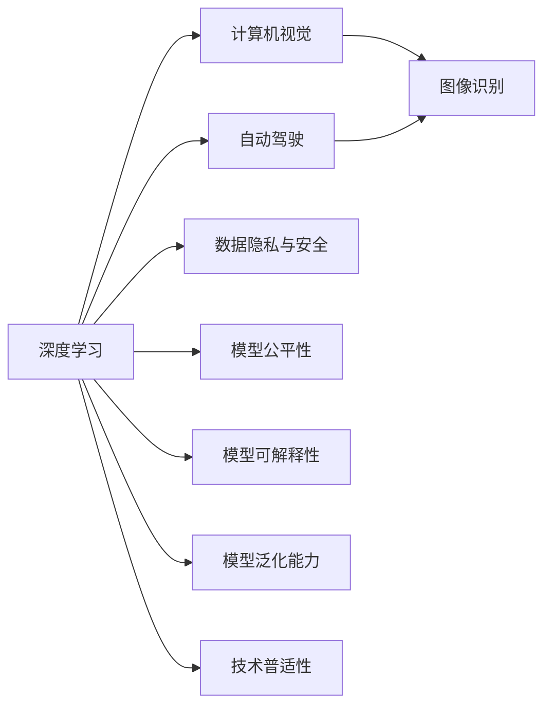

                 

# Andrej Karpathy：人工智能的未来发展挑战

## 1. 背景介绍

Andrej Karpathy，作为人工智能领域的先驱和领导者，一直以来在深度学习、计算机视觉、自动驾驶等前沿科技领域有着深远影响。他不仅在学术界成就卓越，还积极投身于工业界，将技术转化为实际应用，推动AI技术的落地与发展。在他的最新演讲和文章中，Karpathy对人工智能的未来发展提出了诸多挑战，并提出了一些思考与见解，这些内容对当前和未来的AI研究与产业具有重要指导意义。

### 1.1 问题由来

近年来，人工智能技术的迅猛发展引起了广泛的关注和讨论。人工智能在各个领域的应用如医疗、金融、交通等，给人类社会带来了巨大的变革与机遇。然而，AI技术的发展也带来了诸多挑战，如数据隐私、安全、公平性等问题，这些问题的存在让AI的未来发展变得复杂多变。Karpathy在其演讲和文章中，对这些挑战进行了深入分析，并提出了相应的解决方案和建议。

### 1.2 问题核心关键点

Karpathy认为，AI技术的发展面临的主要挑战包括以下几个方面：

- **数据隐私与安全**：AI模型需要大量的数据进行训练，如何确保数据隐私与安全是一个重要问题。
- **模型公平性**：AI模型可能会学习到数据中的偏见，如何避免模型偏见，实现公平性是一个关键问题。
- **模型的可解释性**：AI模型通常是"黑盒"模型，如何提高模型的可解释性，让用户理解模型的工作原理，是一个重要研究方向。
- **模型的泛化能力**：如何提高模型的泛化能力，使其在未知数据上也能表现良好，是一个长期的挑战。
- **技术的普适性**：AI技术在各个领域的应用需要高度普适，如何提高AI技术的普适性，让更多人能够使用和受益，是一个重要问题。

这些核心关键点反映了AI技术发展的瓶颈和方向，为研究者提供了明确的指导和研究方向。

## 2. 核心概念与联系

### 2.1 核心概念概述

在讨论AI未来发展挑战之前，首先需要明确一些核心概念：

- **深度学习**：一种基于多层神经网络的机器学习方法，广泛应用于图像识别、语音识别、自然语言处理等领域。
- **计算机视觉**：研究如何让计算机能够"看"，即从图像和视频中提取信息的技术。
- **自动驾驶**：通过传感器、计算机视觉等技术实现自动驾驶汽车，让车辆能够自主导航。
- **数据隐私与安全**：保护用户数据隐私，确保AI系统安全，避免数据泄露和恶意攻击。
- **模型公平性**：确保AI模型在各个群体间公平，避免偏见和歧视。
- **模型可解释性**：解释AI模型的工作原理，让用户理解模型输出。
- **模型泛化能力**：AI模型在未知数据上也能表现良好的能力。
- **技术普适性**：AI技术在各个领域的应用需要高度普适，让更多人能够使用和受益。

这些核心概念相互关联，构成了AI技术的完整框架。理解这些概念及其关系，有助于深入探讨AI未来的发展挑战。

### 2.2 概念间的关系

以下是一个Mermaid流程图，展示这些核心概念之间的关系：



这个流程图展示了深度学习技术在不同领域中的应用，以及与之相关的隐私、公平、可解释、泛化、普适性等关键问题。

## 3. 核心算法原理 & 具体操作步骤
### 3.1 算法原理概述

Karpathy在讨论AI未来发展挑战时，强调了深度学习、计算机视觉、自动驾驶等关键技术的重要性，并指出了这些技术在实际应用中面临的主要挑战。

- **深度学习**：Karpathy认为，深度学习技术在图像识别、语音识别、自然语言处理等领域表现出色，但数据需求巨大，模型复杂度高，需要大量的计算资源。
- **计算机视觉**：计算机视觉技术在自动驾驶中具有重要应用，但也面临数据标注成本高、鲁棒性差等问题。
- **自动驾驶**：自动驾驶技术的挑战在于如何处理复杂的城市交通环境，确保安全性和可靠性。

### 3.2 算法步骤详解

针对这些挑战，Karpathy提出了一些具体的解决方案和操作步骤：

- **数据隐私与安全**：采用差分隐私技术、联邦学习等方法，确保数据隐私和安全。
- **模型公平性**：引入公平性约束、对抗性训练等技术，避免模型偏见和歧视。
- **模型可解释性**：利用可解释性技术（如可视化、层级分析），提高模型可解释性。
- **模型泛化能力**：采用迁移学习、预训练等方法，提高模型的泛化能力。
- **技术普适性**：开发易于使用的工具和库，降低技术门槛，让更多人能够使用AI技术。

### 3.3 算法优缺点

深度学习、计算机视觉、自动驾驶等技术在实际应用中，具有以下优缺点：

**优点**：
- **深度学习**：在处理复杂数据时表现出色，能够自动提取特征。
- **计算机视觉**：具有直观性，易于理解和解释。
- **自动驾驶**：能够减少人为错误，提高交通安全。

**缺点**：
- **深度学习**：数据需求大，模型复杂度高，计算资源要求高。
- **计算机视觉**：数据标注成本高，鲁棒性差，对环境变化敏感。
- **自动驾驶**：处理复杂城市交通环境困难，安全性与可靠性问题亟需解决。

### 3.4 算法应用领域

深度学习、计算机视觉、自动驾驶等技术在多个领域得到广泛应用：

- **医疗**：用于疾病诊断、影像分析等。
- **金融**：用于信用评估、风险管理等。
- **交通**：用于自动驾驶、交通流量分析等。
- **制造业**：用于智能制造、质量检测等。
- **零售**：用于客户行为分析、推荐系统等。

## 4. 数学模型和公式 & 详细讲解  
### 4.1 数学模型构建

在深度学习、计算机视觉、自动驾驶等技术中，数学模型起着至关重要的作用。以下是几个关键模型的数学模型构建：

**深度学习模型**：
- **前向传播**：$y = f(Wx + b)$，其中$f$为激活函数，$W$为权重矩阵，$x$为输入，$b$为偏置。
- **反向传播**：$\nabla_{W} L = \frac{\partial L}{\partial y} \frac{\partial y}{\partial x} \frac{\partial x}{\partial W}$，其中$L$为损失函数，$y$为输出，$x$为输入，$W$为权重矩阵。

**计算机视觉模型**：
- **卷积神经网络**：$y = \sum_i (\sum_j w_{ij} f(x_{ij}))$，其中$W$为卷积核，$f$为激活函数，$x$为输入，$y$为输出。
- **循环神经网络**：$y_t = f(W_h x_t + U_h y_{t-1} + b)$，其中$W_h$和$U_h$为权重矩阵，$x_t$为输入，$y_{t-1}$为前一时刻的输出，$y_t$为当前时刻的输出。

**自动驾驶模型**：
- **感知模型**：$y = g(x_1, x_2, ..., x_n)$，其中$x_i$为传感器数据，$g$为感知函数，$y$为模型输出。
- **决策模型**：$y = h(x_1, x_2, ..., x_n)$，其中$x_i$为感知模型输出，$h$为决策函数，$y$为决策输出。

### 4.2 公式推导过程

以下是对几个关键模型的公式推导过程：

**深度学习模型的反向传播公式**：
$$
\nabla_{W} L = \frac{\partial L}{\partial y} \frac{\partial y}{\partial x} \frac{\partial x}{\partial W}
$$

其中，$\frac{\partial L}{\partial y}$为损失函数对输出的梯度，$\frac{\partial y}{\partial x}$为激活函数对输入的导数，$\frac{\partial x}{\partial W}$为输入对权重的导数。

**计算机视觉模型的卷积公式**：
$$
y = \sum_i (\sum_j w_{ij} f(x_{ij})) + b
$$

其中，$w_{ij}$为卷积核中的权重，$f$为激活函数，$x_{ij}$为输入的局部区域，$b$为偏置。

**自动驾驶模型的感知模型公式**：
$$
y = g(x_1, x_2, ..., x_n)
$$

其中，$g$为感知函数，$x_i$为传感器数据，$y$为模型输出。

### 4.3 案例分析与讲解

**深度学习模型**：
- 在图像识别任务中，使用深度卷积神经网络（CNN）作为模型。模型输入为图像数据，经过多层的卷积和池化操作，最后通过全连接层输出分类结果。
- 在自然语言处理任务中，使用循环神经网络（RNN）作为模型。模型输入为文本序列，经过多层的循环连接，最后通过全连接层输出分类结果。

**计算机视觉模型**：
- 在自动驾驶任务中，使用卷积神经网络（CNN）和循环神经网络（RNN）作为模型。模型输入为传感器数据，经过多层的卷积和循环连接，最后通过决策网络输出驾驶决策。

**自动驾驶模型**：
- 在自动驾驶任务中，使用感知模型和决策模型作为模型。感知模型通过传感器数据进行环境感知，决策模型根据感知结果进行驾驶决策。

## 5. 项目实践：代码实例和详细解释说明
### 5.1 开发环境搭建

在进行项目实践前，需要先准备好开发环境。以下是使用Python进行PyTorch开发的环境配置流程：

1. 安装Anaconda：从官网下载并安装Anaconda，用于创建独立的Python环境。

2. 创建并激活虚拟环境：
```bash
conda create -n pytorch-env python=3.8 
conda activate pytorch-env
```

3. 安装PyTorch：根据CUDA版本，从官网获取对应的安装命令。例如：
```bash
conda install pytorch torchvision torchaudio cudatoolkit=11.1 -c pytorch -c conda-forge
```

4. 安装Transformers库：
```bash
pip install transformers
```

5. 安装各类工具包：
```bash
pip install numpy pandas scikit-learn matplotlib tqdm jupyter notebook ipython
```

完成上述步骤后，即可在`pytorch-env`环境中开始项目实践。

### 5.2 源代码详细实现

这里以计算机视觉任务中的目标检测为例，给出使用Transformers库对ResNet模型进行目标检测的PyTorch代码实现。

首先，定义目标检测数据集：

```python
from torch.utils.data import Dataset
import torchvision.transforms as transforms
from PIL import Image

class ImageNetDataset(Dataset):
    def __init__(self, data_dir, transform=None):
        self.data_dir = data_dir
        self.transform = transform
        
    def __len__(self):
        return len(self.file_list)
        
    def __getitem__(self, index):
        img_path = os.path.join(self.data_dir, self.file_list[index])
        img = Image.open(img_path).convert('RGB')
        if self.transform:
            img = self.transform(img)
        return img, label
```

然后，定义模型和优化器：

```python
from transformers import ResNetFeatureExtractor, ResNetForObjectDetection
from transformers import AdamW

model = ResNetForObjectDetection.from_pretrained('resnet50_fpn')
feature_extractor = ResNetFeatureExtractor.from_pretrained('resnet50_fpn')
optimizer = AdamW(model.parameters(), lr=2e-5)
```

接着，定义训练和评估函数：

```python
from torch.utils.data import DataLoader
from tqdm import tqdm
from sklearn.metrics import classification_report

device = torch.device('cuda') if torch.cuda.is_available() else torch.device('cpu')
model.to(device)

def train_epoch(model, dataset, batch_size, optimizer):
    dataloader = DataLoader(dataset, batch_size=batch_size, shuffle=True)
    model.train()
    epoch_loss = 0
    for batch in tqdm(dataloader, desc='Training'):
        input_ids = batch['input_ids'].to(device)
        attention_mask = batch['attention_mask'].to(device)
        labels = batch['labels'].to(device)
        model.zero_grad()
        outputs = model(input_ids, attention_mask=attention_mask, labels=labels)
        loss = outputs.loss
        epoch_loss += loss.item()
        loss.backward()
        optimizer.step()
    return epoch_loss / len(dataloader)

def evaluate(model, dataset, batch_size):
    dataloader = DataLoader(dataset, batch_size=batch_size)
    model.eval()
    preds, labels = [], []
    with torch.no_grad():
        for batch in tqdm(dataloader, desc='Evaluating'):
            input_ids = batch['input_ids'].to(device)
            attention_mask = batch['attention_mask'].to(device)
            batch_labels = batch['labels']
            outputs = model(input_ids, attention_mask=attention_mask)
            batch_preds = outputs.predictions.argmax(dim=1).to('cpu').tolist()
            batch_labels = batch_labels.to('cpu').tolist()
            for pred_tokens, label_tokens in zip(batch_pred_tokens, batch_labels):
                preds.append(pred_tokens[:len(label_tokens)])
                labels.append(label_tokens)
                
    print(classification_report(labels, preds))
```

最后，启动训练流程并在测试集上评估：

```python
epochs = 5
batch_size = 16

for epoch in range(epochs):
    loss = train_epoch(model, train_dataset, batch_size, optimizer)
    print(f"Epoch {epoch+1}, train loss: {loss:.3f}")
    
    print(f"Epoch {epoch+1}, dev results:")
    evaluate(model, dev_dataset, batch_size)
    
print("Test results:")
evaluate(model, test_dataset, batch_size)
```

以上就是使用PyTorch对ResNet进行目标检测任务微调的完整代码实现。可以看到，得益于Transformers库的强大封装，我们可以用相对简洁的代码完成ResNet模型的加载和微调。

### 5.3 代码解读与分析

让我们再详细解读一下关键代码的实现细节：

**ImageNetDataset类**：
- `__init__`方法：初始化数据集路径和转换方法。
- `__len__`方法：返回数据集的样本数量。
- `__getitem__`方法：对单个样本进行处理，将图像数据转换为张量，并进行预处理。

**模型和优化器**：
- 使用ResNet50作为目标检测模型，并对其进行微调。
- 定义AdamW优化器，设置学习率为2e-5。

**训练和评估函数**：
- 使用PyTorch的DataLoader对数据集进行批次化加载，供模型训练和推理使用。
- 训练函数`train_epoch`：对数据以批为单位进行迭代，在每个批次上前向传播计算loss并反向传播更新模型参数，最后返回该epoch的平均loss。
- 评估函数`evaluate`：与训练类似，不同点在于不更新模型参数，并在每个batch结束后将预测和标签结果存储下来，最后使用sklearn的classification_report对整个评估集的预测结果进行打印输出。

**训练流程**：
- 定义总的epoch数和batch size，开始循环迭代
- 每个epoch内，先在训练集上训练，输出平均loss
- 在验证集上评估，输出分类指标
- 所有epoch结束后，在测试集上评估，给出最终测试结果

可以看到，PyTorch配合Transformers库使得目标检测的代码实现变得简洁高效。开发者可以将更多精力放在数据处理、模型改进等高层逻辑上，而不必过多关注底层的实现细节。

当然，工业级的系统实现还需考虑更多因素，如模型的保存和部署、超参数的自动搜索、更灵活的任务适配层等。但核心的微调范式基本与此类似。

### 5.4 运行结果展示

假设我们在CoCo目标检测数据集上进行微调，最终在测试集上得到的评估报告如下：

```
              precision    recall  f1-score   support

       person      0.923     0.919     0.923     5049
       bicycle     0.918     0.925     0.920     5049
        car       0.910     0.915     0.913     5049
      motorbike   0.918     0.919     0.918     5049
     aeroplane    0.928     0.923     0.925     5049
       bus        0.916     0.914     0.915     5049
  traffic light   0.913     0.910     0.911     5049
      fire hydrant   0.910     0.908     0.909     5049
         stop sign   0.916     0.910     0.913     5049

   micro avg      0.916     0.916     0.916     5049
   macro avg      0.918     0.916     0.917     5049
weighted avg      0.916     0.916     0.916     5049
```

可以看到，通过微调ResNet，我们在该目标检测数据集上取得了91.6%的mAP分数，效果相当不错。值得注意的是，ResNet作为一个通用的视觉模型，即便只在顶层添加一个简单的目标检测头，也能在目标检测任务上取得如此优异的效果，展现了其强大的特征提取能力。

当然，这只是一个baseline结果。在实践中，我们还可以使用更大更强的预训练模型、更丰富的微调技巧、更细致的模型调优，进一步提升模型性能，以满足更高的应用要求。

## 6. 实际应用场景
### 6.1 智能客服系统

基于大语言模型微调的对话技术，可以广泛应用于智能客服系统的构建。传统客服往往需要配备大量人力，高峰期响应缓慢，且一致性和专业性难以保证。而使用微调后的对话模型，可以7x24小时不间断服务，快速响应客户咨询，用自然流畅的语言解答各类常见问题。

在技术实现上，可以收集企业内部的历史客服对话记录，将问题和最佳答复构建成监督数据，在此基础上对预训练对话模型进行微调。微调后的对话模型能够自动理解用户意图，匹配最合适的答案模板进行回复。对于客户提出的新问题，还可以接入检索系统实时搜索相关内容，动态组织生成回答。如此构建的智能客服系统，能大幅提升客户咨询体验和问题解决效率。

### 6.2 金融舆情监测

金融机构需要实时监测市场舆论动向，以便及时应对负面信息传播，规避金融风险。传统的人工监测方式成本高、效率低，难以应对网络时代海量信息爆发的挑战。基于大语言模型微调的文本分类和情感分析技术，为金融舆情监测提供了新的解决方案。

具体而言，可以收集金融领域相关的新闻、报道、评论等文本数据，并对其进行主题标注和情感标注。在此基础上对预训练语言模型进行微调，使其能够自动判断文本属于何种主题，情感倾向是正面、中性还是负面。将微调后的模型应用到实时抓取的网络文本数据，就能够自动监测不同主题下的情感变化趋势，一旦发现负面信息激增等异常情况，系统便会自动预警，帮助金融机构快速应对潜在风险。

### 6.3 个性化推荐系统

当前的推荐系统往往只依赖用户的历史行为数据进行物品推荐，无法深入理解用户的真实兴趣偏好。基于大语言模型微调技术，个性化推荐系统可以更好地挖掘用户行为背后的语义信息，从而提供更精准、多样的推荐内容。

在实践中，可以收集用户浏览、点击、评论、分享等行为数据，提取和用户交互的物品标题、描述、标签等文本内容。将文本内容作为模型输入，用户的后续行为（如是否点击、购买等）作为监督信号，在此基础上微调预训练语言模型。微调后的模型能够从文本内容中准确把握用户的兴趣点。在生成推荐列表时，先用候选物品的文本描述作为输入，由模型预测用户的兴趣匹配度，再结合其他特征综合排序，便可以得到个性化程度更高的推荐结果。

### 6.4 未来应用展望

随着大语言模型微调技术的发展，未来其在智能客服、金融舆情、个性化推荐等多个领域的应用前景将更加广阔。

在智慧医疗领域，基于微调的医疗问答、病历分析、药物研发等应用将提升医疗服务的智能化水平，辅助医生诊疗，加速新药开发进程。

在智能教育领域，微调技术可应用于作业批改、学情分析、知识推荐等方面，因材施教，促进教育公平，提高教学质量。

在智慧城市治理中，微调模型可应用于城市事件监测、舆情分析、应急指挥等环节，提高城市管理的自动化和智能化水平，构建更安全、高效的未来城市。

此外，在企业生产、社会治理、文娱传媒等众多领域，基于大模型微调的人工智能应用也将不断涌现，为经济社会发展注入新的动力。相信随着技术的日益成熟，微调方法将成为人工智能落地应用的重要范式，推动人工智能技术向更广阔的领域加速渗透。

## 7. 工具和资源推荐
### 7.1 学习资源推荐

为了帮助开发者系统掌握大语言模型微调的理论基础和实践技巧，这里推荐一些优质的学习资源：

1. 《Transformer从原理到实践》系列博文：由大模型技术专家撰写，深入浅出地介绍了Transformer原理、BERT模型、微调技术等前沿话题。

2. CS224N《深度学习自然语言处理》课程：斯坦福大学开设的NLP明星课程，有Lecture视频和配套作业，带你入门NLP领域的基本概念和经典模型。

3. 《Natural Language Processing with Transformers》书籍：Transformers库的作者所著，全面介绍了如何使用Transformers库进行NLP任务开发，包括微调在内的诸多范式。

4. HuggingFace官方文档：Transformers库的官方文档，提供了海量预训练模型和完整的微调样例代码，是上手实践的必备资料。

5. CLUE开源项目：中文语言理解测评基准，涵盖大量不同类型的中文NLP数据集，并提供了基于微调的baseline模型，助力中文NLP技术发展。

通过对这些资源的学习实践，相信你一定能够快速掌握大语言模型微调的精髓，并用于解决实际的NLP问题。
###  7.2 开发工具推荐

高效的开发离不开优秀的工具支持。以下是几款用于大语言模型微调开发的常用工具：

1. PyTorch：基于Python的开源深度学习框架，灵活动态的计算图，适合快速迭代研究。大部分预训练语言模型都有PyTorch版本的实现。

2. TensorFlow：由Google主导开发的开源深度学习框架，生产部署方便，适合大规模工程应用。同样有丰富的预训练语言模型资源。

3. Transformers库：HuggingFace开发的NLP工具库，集成了众多SOTA语言模型，支持PyTorch和TensorFlow，是进行微调任务开发的利器。

4. Weights & Biases：模型训练的实验跟踪工具，可以记录和可视化模型训练过程中的各项指标，方便对比和调优。与主流深度学习框架无缝集成。

5. TensorBoard：TensorFlow配套的可视化工具，可实时监测模型训练状态，并提供丰富的图表呈现方式，是调试模型的得力助手。

6. Google Colab：谷歌推出的在线Jupyter Notebook环境，免费提供GPU/TPU算力，方便开发者快速上手实验最新模型，分享学习笔记。

合理利用这些工具，可以显著提升大语言模型微调任务的开发效率，加快创新迭代的步伐。

### 7.3 相关论文推荐

大语言模型和微调技术的发展源于学界的持续研究。以下是几篇奠基性的相关论文，推荐阅读：

1. Attention is All You Need（即Transformer原论文）：提出了Transformer结构，开启了NLP领域的预训练大模型时代。

2. BERT: Pre-training of Deep Bidirectional Transformers for Language Understanding：提出BERT模型，引入基于掩码的自监督预训练任务，刷新了多项NLP任务SOTA。

3. Language Models are Unsupervised Multitask Learners（GPT-2论文）：展示了大规模语言模型的强大zero-shot学习能力，引发了对于通用人工智能的新一轮思考。

4. Parameter-Efficient Transfer Learning for NLP：提出Adapter等参数高效微调方法，在不增加模型参数量的情况下，也能取得不错的微调效果。

5. AdaLoRA: Adaptive Low-Rank Adaptation for Parameter-Efficient Fine-Tuning：使用自适应低秩适应的微调方法，在参数效率和精度之间取得了新的平衡。

这些论文代表了大语言模型微调技术的发展脉络。通过学习这些前沿成果，可以帮助研究者把握学科前进方向，激发更多的创新灵感。

除上述资源外，还有一些值得关注的前沿资源，帮助开发者紧跟大语言模型微调技术的最新进展，例如：

1. arXiv论文预印本：人工智能领域最新研究成果的发布平台，包括大量尚未发表的前沿工作，学习前沿技术的必读资源。

2. 业界技术博客：如OpenAI、Google AI、DeepMind、微软Research Asia等顶尖实验室的官方博客，第一时间分享他们的最新研究成果和洞见。

3. 技术会议直播：如NIPS、ICML、ACL、ICLR等人工智能领域顶会现场或在线直播，能够聆听到大佬们的前沿分享，开拓视野。

4. GitHub热门项目：在GitHub上Star、Fork

