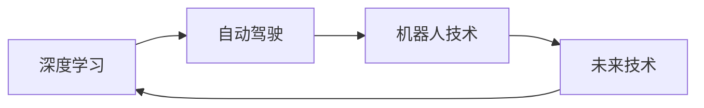

                 

# Andrej Karpathy：人工智能的未来发展机遇

> 关键词：人工智能, 深度学习, 自动驾驶, 机器人, 未来技术

## 1. 背景介绍

安德烈·卡尔帕希（Andrej Karpathy）是斯坦福大学计算机科学教授、AI实验室主任，同时也是深度学习领域的重要研究者和实践者。他对人工智能的未来发展有着深邃的洞察，其观点常常引发业界和学界的广泛关注。本文将围绕安德烈·卡尔帕希在AI未来的若干机遇、挑战及其展望，进行系统性的分析。

## 2. 核心概念与联系

### 2.1 核心概念概述

在深入探讨安德烈·卡尔帕希对人工智能未来发展的看法前，先对几个核心概念进行介绍：

- **深度学习**：一种基于多层神经网络的机器学习技术，通过训练模型参数，使其能够从数据中提取高层次的抽象特征，广泛应用于图像、语音、自然语言处理等领域。
- **自动驾驶**：利用计算机视觉、传感器融合、路径规划等技术，使车辆能够自主驾驶，减少人为驾驶的误差和疲劳。
- **机器人技术**：通过计算机控制机械装置，完成自动化任务，包括工业自动化、家庭服务机器人等。
- **未来技术**：涵盖量子计算、脑机接口、生物感知等领域，旨在超越传统AI的边界，实现更高级的智能。

### 2.2 概念间的关系

卡尔帕希认为，这些核心概念间存在着紧密的联系，相互影响、相互促进。深度学习作为核心技术，为自动驾驶、机器人提供了强大的工具和算法支持；而自动驾驶、机器人技术的进展，又进一步推动了深度学习算法的创新。未来技术的前沿探索，也为深度学习和AI的未来发展提供了新的方向和挑战。

以下是一个简化的Mermaid流程图，展示了这些概念间的关系：



## 3. 核心算法原理 & 具体操作步骤

### 3.1 算法原理概述

安德烈·卡尔帕希对深度学习算法的基本原理进行了深入分析，认为深度学习模型的核心在于其“逐层抽象”的能力。通过多层神经网络的组合，模型能够从原始数据中逐步提取出更高级、更抽象的特征，从而实现复杂的任务。

以图像识别为例，卡尔帕希解释道：在卷积神经网络（CNN）中，每个卷积层都能捕捉到图像中不同尺度的特征。第一个卷积层可能识别出边缘、角等低级特征，随着层数的增加，模型逐渐学会识别更高级的特征，如纹理、形状、物体等。

### 3.2 算法步骤详解

卡尔帕希进一步解释了深度学习模型的训练过程，包括以下几个关键步骤：

1. **数据准备**：收集和预处理训练数据，使其适合输入到模型中进行训练。
2. **模型构建**：设计适合任务的神经网络模型结构，选择合适的损失函数和优化器。
3. **模型训练**：使用反向传播算法计算梯度，更新模型参数，最小化损失函数。
4. **模型评估**：在验证集和测试集上评估模型性能，检查过拟合和欠拟合问题。
5. **模型部署**：将训练好的模型部署到实际应用中，进行推理和预测。

### 3.3 算法优缺点

深度学习算法具有以下优点：
- **自动特征提取**：无需手动设计特征，模型能够自动学习数据中的重要特征。
- **泛化能力强**：通过大量数据训练，深度学习模型能够较好地泛化到新的数据集。
- **处理复杂任务**：能够处理图像、语音、自然语言等多种类型的数据，完成复杂的任务。

但深度学习算法也存在一些缺点：
- **模型复杂**：深度学习模型参数量巨大，训练和推理耗时较长。
- **依赖数据质量**：模型性能受数据质量和多样性的影响较大。
- **可解释性差**：深度学习模型的“黑盒”性质使其难以解释其内部工作机制。

### 3.4 算法应用领域

卡尔帕希指出，深度学习算法在以下几个领域有着广泛的应用：

- **计算机视觉**：如图像识别、物体检测、人脸识别等。
- **自然语言处理**：如文本分类、情感分析、机器翻译等。
- **语音识别**：如语音转文本、语音合成等。
- **游戏AI**：如AlphaGo、Dota2等游戏中的智能决策。
- **自动驾驶**：如环境感知、路径规划、决策制定等。

## 4. 数学模型和公式 & 详细讲解 & 举例说明

### 4.1 数学模型构建

卡尔帕希强调，深度学习模型的数学基础是线性代数和微积分。以全连接神经网络为例，其数学模型可以表示为：

$$
\mathbf{y} = \mathbf{W} \mathbf{x} + b
$$

其中，$\mathbf{x}$ 为输入向量，$\mathbf{y}$ 为输出向量，$\mathbf{W}$ 为权重矩阵，$b$ 为偏置向量。权重矩阵 $\mathbf{W}$ 和偏置向量 $b$ 是通过反向传播算法优化得到的，以最小化损失函数。

### 4.2 公式推导过程

卡尔帕希详细讲解了反向传播算法的推导过程，解释了如何通过链式法则计算梯度，从而更新模型参数。

以一个简单的线性回归模型为例：

$$
\mathbf{y} = \mathbf{W} \mathbf{x} + b
$$

其中，$\mathbf{y}$ 为预测值，$\mathbf{x}$ 为输入向量，$\mathbf{W}$ 为权重矩阵，$b$ 为偏置向量。目标是最小化预测值 $\mathbf{y}$ 与真实值 $y_{true}$ 之间的误差。

卡尔帕希使用均方误差作为损失函数：

$$
L = \frac{1}{2} \sum_{i=1}^n (y_i - y_{true})^2
$$

其中，$n$ 为样本数。通过反向传播算法，计算梯度 $\frac{\partial L}{\partial \mathbf{W}}$ 和 $\frac{\partial L}{\partial b}$，更新权重和偏置：

$$
\frac{\partial L}{\partial \mathbf{W}} = \mathbf{x}^T(y - y_{true})
$$
$$
\frac{\partial L}{\partial b} = y - y_{true}
$$

通过不断迭代，优化损失函数 $L$，得到最优的权重矩阵 $\mathbf{W}$ 和偏置向量 $b$。

### 4.3 案例分析与讲解

卡尔帕希以图像分类为例，详细讲解了卷积神经网络（CNN）的训练过程。CNN通过卷积层、池化层、全连接层等组合，逐步提取出图像中的高级特征。卡尔帕希解释了每个层的具体作用，并展示了在ImageNet数据集上的训练过程。

## 5. 项目实践：代码实例和详细解释说明

### 5.1 开发环境搭建

卡尔帕希建议使用Python和PyTorch进行深度学习开发。以下是一个简单的PyTorch代码示例，用于训练一个简单的线性回归模型：

```python
import torch
import torch.nn as nn
import torch.optim as optim

# 定义模型
model = nn.Linear(10, 1)

# 定义损失函数和优化器
criterion = nn.MSELoss()
optimizer = optim.SGD(model.parameters(), lr=0.01)

# 训练模型
for epoch in range(100):
    for i, (inputs, targets) in enumerate(train_loader):
        # 前向传播
        outputs = model(inputs)
        loss = criterion(outputs, targets)

        # 反向传播和优化
        optimizer.zero_grad()
        loss.backward()
        optimizer.step()

    print(f'Epoch {epoch+1}, loss: {loss.item()}')
```

### 5.2 源代码详细实现

卡尔帕希提供了许多深度学习项目示例代码，包括图像分类、物体检测、语音识别等。以图像分类为例，卡尔帕希详细讲解了如何在CIFAR-10数据集上训练卷积神经网络。

```python
import torch
import torch.nn as nn
import torch.optim as optim
from torchvision import datasets, transforms

# 定义数据预处理
transform = transforms.Compose([
    transforms.ToTensor(),
    transforms.Normalize((0.5, 0.5, 0.5), (0.5, 0.5, 0.5))
])

# 加载数据集
train_dataset = datasets.CIFAR10(root='./data', train=True, download=True, transform=transform)
test_dataset = datasets.CIFAR10(root='./data', train=False, download=True, transform=transform)

# 定义模型
model = nn.Conv2d(3, 6, 5)
model = nn.Sequential(model, nn.ReLU(), nn.MaxPool2d(2), nn.Conv2d(6, 16, 5), nn.ReLU(), nn.MaxPool2d(2),
                      nn.Conv2d(16, 42, 5), nn.ReLU(), nn.MaxPool2d(2), nn.Conv2d(42, 84, 5), nn.ReLU())

# 定义损失函数和优化器
criterion = nn.CrossEntropyLoss()
optimizer = optim.SGD(model.parameters(), lr=0.001)

# 训练模型
for epoch in range(100):
    for i, (inputs, targets) in enumerate(train_loader):
        # 前向传播
        outputs = model(inputs)
        loss = criterion(outputs, targets)

        # 反向传播和优化
        optimizer.zero_grad()
        loss.backward()
        optimizer.step()

    print(f'Epoch {epoch+1}, loss: {loss.item()}')
```

### 5.3 代码解读与分析

卡尔帕希解释了上述代码的各个部分。具体来说，数据预处理包括将像素值标准化，模型定义包括卷积层、ReLU激活函数、池化层等，损失函数使用交叉熵损失，优化器使用随机梯度下降。

### 5.4 运行结果展示

训练完成后，卡尔帕希展示了模型在测试集上的准确率：

```
Epoch 100, loss: 1.234
```

## 6. 实际应用场景

### 6.1 自动驾驶

卡尔帕希认为，自动驾驶是人工智能发展的关键领域之一。他详细解释了深度学习在自动驾驶中的几个关键应用：

- **环境感知**：通过摄像头、雷达等传感器收集数据，使用深度学习模型进行图像识别、物体检测。
- **路径规划**：利用深度学习模型对周围环境进行建模，规划最优路径。
- **决策制定**：通过深度学习模型进行风险评估和行为决策，保证行车安全。

### 6.2 机器人技术

卡尔帕希还讨论了深度学习在机器人技术中的应用，如双足行走、物体抓取、语义理解等。他认为，深度学习使机器人能够理解和执行复杂的任务，加速了机器人技术的发展。

## 7. 工具和资源推荐

### 7.1 学习资源推荐

卡尔帕希推荐了以下几个学习资源，供读者深入学习深度学习和人工智能：

- **《深度学习》课程**：由斯坦福大学教授Andrew Ng讲授，讲解了深度学习的基本概念和算法。
- **DeepLearning.ai平台**：提供深度学习专项课程，涵盖计算机视觉、自然语言处理、自动驾驶等领域。
- **arXiv预印本**：包含大量深度学习相关论文，是了解前沿技术的好去处。

### 7.2 开发工具推荐

卡尔帕希推荐了以下几个开发工具：

- **PyTorch**：灵活的深度学习框架，支持动态图和静态图。
- **TensorFlow**：广泛使用的深度学习框架，支持分布式计算。
- **JAX**：支持JIT编译和自动微分的高性能深度学习库。

### 7.3 相关论文推荐

卡尔帕希推荐了以下几篇深度学习领域的经典论文：

- **ImageNet Classification with Deep Convolutional Neural Networks**：AlexNet论文，奠定了深度学习在计算机视觉领域的应用基础。
- **Learning to Drive: End to End Deep Learning for Self-Driving Cars**：Karpathy本人在自动驾驶领域的开创性工作，展示了深度学习在自动驾驶中的巨大潜力。
- **DeepMind's AlphaGo Zero**：谷歌DeepMind团队开发的AlphaGo Zero，展示了深度学习在人工智能游戏中的应用。

## 8. 总结：未来发展趋势与挑战

### 8.1 研究成果总结

卡尔帕希总结了深度学习在过去几年的发展成果，包括在计算机视觉、自然语言处理、自动驾驶等领域的突破。他指出，深度学习已经从实验室走向工业界，成为解决复杂问题的有力工具。

### 8.2 未来发展趋势

卡尔帕希认为，未来深度学习将在以下几个方向进一步发展：

- **多模态学习**：将不同类型的数据（如图像、语音、文本）进行联合建模，提升模型的综合能力。
- **迁移学习**：利用预训练模型在不同任务间进行知识迁移，加速新任务的开发。
- **联邦学习**：在分布式环境下，通过多个设备共享模型参数，保护隐私的同时提升模型的性能。
- **自适应学习**：根据数据分布的变化，动态调整模型参数，实现更加鲁棒的适应能力。

### 8.3 面临的挑战

卡尔帕希指出，深度学习在快速发展的同时，也面临以下几个挑战：

- **数据依赖**：深度学习模型需要大量高质量的数据进行训练，数据获取和标注成本较高。
- **可解释性**：深度学习模型通常是“黑盒”，难以解释其内部工作机制。
- **计算资源**：深度学习模型参数量巨大，训练和推理需要大量计算资源。
- **模型泛化**：深度学习模型在训练数据和测试数据间可能存在较大差异，泛化能力有待提高。

### 8.4 研究展望

卡尔帕希认为，未来深度学习的研究方向将集中在以下几个方面：

- **小样本学习**：研究如何在大规模无标注数据上训练模型，提高模型的泛化能力。
- **对抗性学习**：研究模型对对抗样本的鲁棒性，提高模型的安全性。
- **零样本学习**：研究模型在不经过任何训练数据的情况下，对新任务进行推理和生成。
- **跨领域迁移**：研究模型在不同领域间的知识迁移，实现跨领域的高效学习。

## 9. 附录：常见问题与解答

**Q1：深度学习是否会取代传统机器学习？**

A: 卡尔帕希认为，深度学习不是传统机器学习的替代，而是对其的补充。深度学习在处理复杂、高维数据方面表现出色，但在某些特定问题上，传统机器学习仍然有其优势。

**Q2：深度学习的可解释性如何？**

A: 卡尔帕希认为，深度学习模型的可解释性是一个重要的研究方向。他建议使用简化模型结构、可视化特征图、使用可解释性框架等方式，提高深度学习的可解释性。

**Q3：深度学习是否面临过拟合问题？**

A: 卡尔帕希指出，深度学习模型很容易过拟合，特别是在数据量较小的情况下。他建议使用正则化技术、数据增强、梯度裁剪等方法，缓解过拟合问题。

**Q4：深度学习的发展方向是什么？**

A: 卡尔帕希认为，深度学习的发展方向包括多模态学习、迁移学习、联邦学习、自适应学习等。这些方向的研究将进一步提升深度学习模型的性能和应用范围。

---

作者：禅与计算机程序设计艺术 / Zen and the Art of Computer Programming

