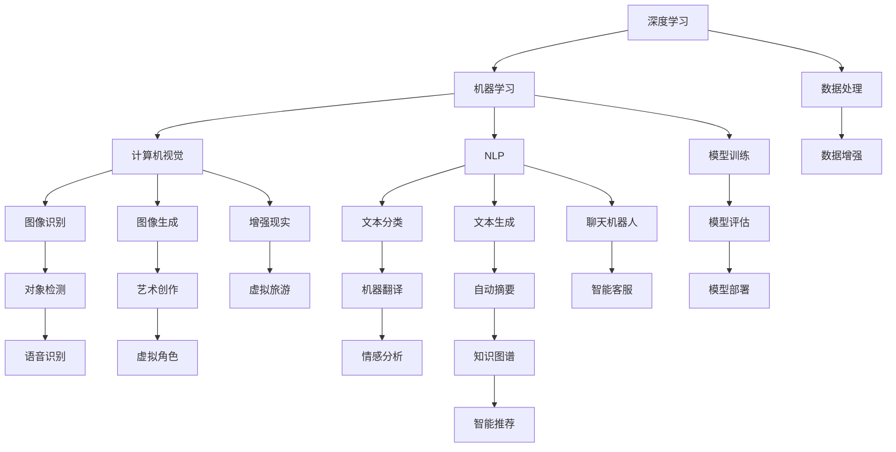
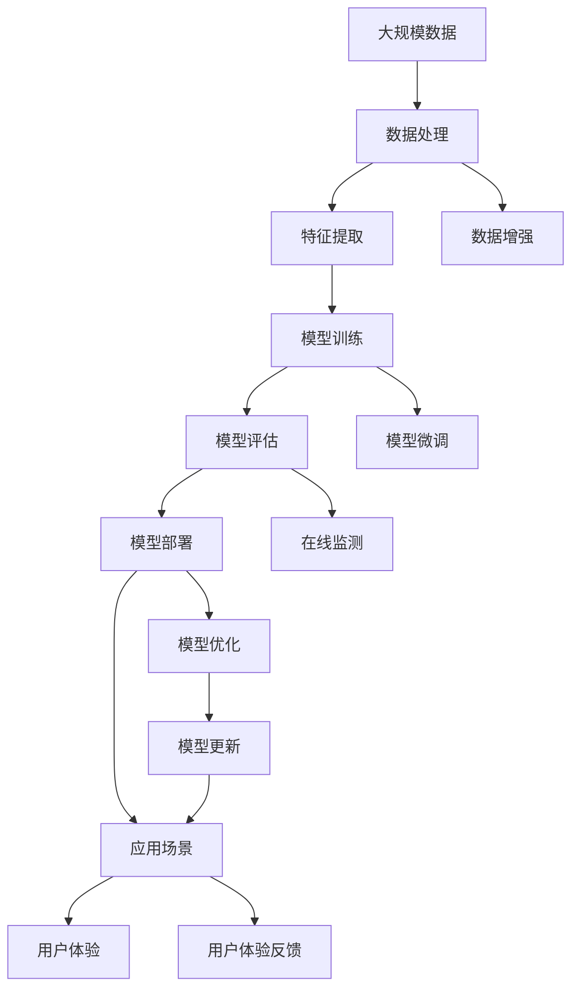

                 

# Andrej Karpathy：人工智能的未来发展策略

> 关键词：人工智能,深度学习,机器学习,计算机视觉,自然语言处理

## 1. 背景介绍

### 1.1 问题由来

在过去的十年中，人工智能（AI）技术取得了飞速的发展，尤其是在深度学习（Deep Learning）和机器学习（Machine Learning）领域。这些技术的突破，使得AI应用的范围和深度大大扩展，从自动驾驶、医疗诊断到聊天机器人，各种领域的AI应用层出不穷。然而，随着AI技术的不断深入，也带来了一些新的挑战和问题，如算力需求的激增、数据隐私和安全性的担忧、模型的可解释性和公平性问题等。针对这些问题，我们迫切需要构建一套更为全面、可持续的未来AI发展策略。

### 1.2 问题核心关键点

Andrej Karpathy是深度学习和计算机视觉领域的顶尖专家，同时也是OpenAI的资深研究员。在近期的演讲和论文中，Karpathy对AI技术的发展提出了一些重要的见解和策略。以下是其中一些关键点：

- 持续关注基础研究，推动技术的边界拓展。
- 开发通用和鲁棒的AI模型，应对多样化应用场景。
- 重视AI的伦理和安全问题，确保技术的健康发展。
- 推动AI技术的普及和应用，加速各行各业的数字化转型。
- 优化AI技术的使用，减少资源浪费和环境影响。

这些核心点为我们理解Andrej Karpathy的AI发展策略提供了重要参考。

## 2. 核心概念与联系

### 2.1 核心概念概述

为了更好地理解Andrej Karpathy的AI发展策略，我们先介绍几个关键概念：

- **深度学习（Deep Learning）**：一种基于神经网络的机器学习技术，通过多层非线性变换，从大量数据中学习抽象特征，从而实现复杂的任务。
- **机器学习（Machine Learning）**：一种通过算法和统计模型，让计算机从数据中自动学习和改进的技术。
- **计算机视觉（Computer Vision）**：利用计算机处理、分析和理解视觉信息的技术，如图像识别、对象检测等。
- **自然语言处理（Natural Language Processing, NLP）**：让计算机理解和处理人类语言的技术，如文本分类、机器翻译等。
- **人工智能（Artificial Intelligence, AI）**：使计算机系统模拟人类智能，实现自主学习、推理和决策的能力。

这些概念构成了AI技术的主要基础，推动了其在各个领域的应用。

### 2.2 概念间的关系

这些概念之间的关系可以通过以下Mermaid流程图来展示：



这个流程图展示了AI技术的主要分支和应用场景。深度学习是AI的核心技术之一，通过多层神经网络结构，能够学习到数据中的复杂模式。机器学习则是深度学习的底层技术，通过算法和模型，实现数据的自动处理和分析。计算机视觉和自然语言处理是深度学习和机器学习在图像和文本领域的典型应用。此外，AI技术还应用于虚拟现实、增强现实、智能推荐等多个领域，推动了各行各业的数字化转型。

### 2.3 核心概念的整体架构

最后，我们用一个综合的流程图来展示这些核心概念在大规模AI应用中的整体架构：



这个综合流程图展示了从数据处理、模型训练到应用部署的整个AI应用流程。通过数据处理和特征提取，我们从原始数据中提取出有价值的信息。然后，在模型训练阶段，通过多层神经网络结构，从数据中学习到复杂的模式。模型训练完成后，通过模型评估和优化，确保模型的准确性和鲁棒性。最后，将模型部署到实际应用场景中，提升用户体验。同时，通过用户反馈和在线监测，不断更新和优化模型，确保其在实际应用中的有效性。

## 3. 核心算法原理 & 具体操作步骤
### 3.1 算法原理概述

Andrej Karpathy提出的AI发展策略，主要围绕以下几个核心算法原理展开：

1. **自监督学习（Self-Supervised Learning）**：利用未标注的数据，通过一些自监督任务（如掩码语言模型、对比学习等）进行模型训练，从而学习到数据的复杂特征。
2. **迁移学习（Transfer Learning）**：将在大规模数据上预训练的模型，通过微调（Fine-Tuning）应用到特定任务中，利用已有知识提升新任务的性能。
3. **生成对抗网络（Generative Adversarial Networks, GANs）**：通过生成器和判别器的对抗过程，生成高质量的样本，用于图像生成、文本生成等任务。
4. **强化学习（Reinforcement Learning, RL）**：通过奖励机制，引导模型进行决策和优化，用于自动驾驶、机器人控制等任务。
5. **多任务学习（Multi-Task Learning）**：同时训练多个相关任务，共享底层特征，提高模型的泛化能力和性能。

这些算法原理构成了AI技术的核心，推动了其在各个领域的应用。

### 3.2 算法步骤详解

以自监督学习和迁移学习为例，详细介绍其具体操作步骤：

**自监督学习**：

1. **数据准备**：收集大规模未标注的数据，如互联网图片、文本等。
2. **定义自监督任务**：设计一些自监督任务，如掩码语言模型、图像补全等。
3. **模型训练**：利用未标注数据，通过自监督任务对模型进行训练，学习到数据的特征和模式。
4. **模型评估**：在特定任务上评估模型的性能，如图像分类、文本生成等。
5. **模型优化**：根据评估结果，对模型进行微调或优化，提升模型在新任务上的表现。

**迁移学习**：

1. **预训练模型选择**：选择合适的预训练模型，如BERT、ResNet等。
2. **微调数据准备**：准备特定任务的标注数据，如分类、回归、生成等。
3. **模型微调**：在特定任务上微调预训练模型，利用已有知识提升新任务的性能。
4. **模型评估**：在验证集上评估模型的性能，避免过拟合。
5. **模型优化**：根据评估结果，对模型进行微调或优化，提升模型在新任务上的表现。

这些操作步骤可以帮助我们更好地理解和应用AI技术，推动其在各个领域的应用。

### 3.3 算法优缺点

自监督学习和迁移学习具有以下优点：

1. **数据需求低**：自监督学习可以利用未标注数据进行训练，迁移学习可以利用已有知识提升新任务性能，降低了数据需求。
2. **模型泛化能力强**：自监督学习和迁移学习可以通过多任务和多领域学习，提高模型的泛化能力和鲁棒性。
3. **训练时间短**：自监督学习和迁移学习可以通过微调优化模型，缩短训练时间。

同时，这些算法也存在一些缺点：

1. **算法复杂度高**：自监督学习和迁移学习需要设计合适的自监督任务和微调策略，算法复杂度高。
2. **模型可解释性差**：自监督学习和迁移学习模型往往是"黑盒"，难以解释其内部工作机制。
3. **数据分布差异**：自监督学习和迁移学习模型在不同数据分布上的泛化能力可能较弱。

### 3.4 算法应用领域

自监督学习和迁移学习在以下几个领域具有广泛的应用：

1. **计算机视觉**：通过自监督学习，如图像补全、风格迁移等，提升图像生成和分类能力。
2. **自然语言处理**：通过自监督学习，如掩码语言模型、文本生成等，提升语言理解和生成能力。
3. **自动驾驶**：通过迁移学习，将在大规模数据上预训练的模型，应用到自动驾驶中的物体检测、行为预测等任务。
4. **机器人控制**：通过强化学习，将模型应用于机器人控制中的决策和优化。
5. **医疗诊断**：通过迁移学习，将在大规模医疗数据上预训练的模型，应用到特定疾病的诊断中。

这些应用领域展示了自监督学习和迁移学习技术的广泛应用，推动了AI技术在各行各业的深入发展。

## 4. 数学模型和公式 & 详细讲解 & 举例说明
### 4.1 数学模型构建

我们以自监督学习中的掩码语言模型（Masked Language Model, MLM）为例，详细讲解其数学模型构建过程。

设自监督学习任务为掩码语言模型，输入为未标注的文本序列，目标是从文本序列中预测缺失的单词。假设输入文本序列为 $\{w_1, w_2, ..., w_n\}$，其中 $w_i$ 表示第 $i$ 个单词，$L$ 表示训练集中的样本数，$H$ 表示单词嵌入的维度。

掩码语言模型的训练过程如下：

1. **输入预处理**：将输入文本序列转换为词嵌入向量，表示为 $\{h_1, h_2, ..., h_n\}$。
2. **掩码操作**：随机掩码文本序列中的某些单词，如将 $w_k$ 替换为特殊标记 $\langle M\rangle$。
3. **预测任务**：根据未掩码的单词序列 $\{w_1, ..., w_{k-1}, w_{k+1}, ..., w_n\}$ 和掩码后的序列 $\{w_1, ..., w_{k-1}, \langle M\rangle, w_{k+1}, ..., w_n\}$，预测掩码位置的单词 $w_k$。
4. **损失函数**：利用交叉熵损失函数，计算预测值与真实值之间的差异。

### 4.2 公式推导过程

以交叉熵损失函数为例，详细推导其公式。

设预测值和真实值之间的差异为 $p(w_k|w_{k-1}, ..., w_n)$，真实值为 $y_k$，则交叉熵损失函数为：

$$
\mathcal{L}(w_k|w_{k-1}, ..., w_n) = -y_k\log(p(w_k|w_{k-1}, ..., w_n)) - (1-y_k)\log(1-p(w_k|w_{k-1}, ..., w_n))
$$

在掩码语言模型中，对于每个掩码位置 $k$，计算交叉熵损失函数的期望值，即可得到掩码语言模型的损失函数：

$$
\mathcal{L}_{MLM} = \frac{1}{L}\sum_{i=1}^L \frac{1}{n}\sum_{k=1}^n \mathcal{L}(w_k|w_{k-1}, ..., w_n)
$$

其中，$n$ 表示文本序列中单词的数量，$L$ 表示训练集中的样本数。

### 4.3 案例分析与讲解

以BERT模型为例，详细分析其在自监督学习中的应用。

BERT模型通过在大规模语料上进行预训练，学习到了丰富的语言知识和常识。在预训练过程中，BERT模型通过掩码语言模型和下一句预测任务进行训练。在微调任务中，可以通过在不同任务上微调BERT模型，使其具备特定的任务能力，如文本分类、问答系统等。

## 5. 项目实践：代码实例和详细解释说明
### 5.1 开发环境搭建

在进行项目实践前，我们需要准备好开发环境。以下是使用Python进行TensorFlow开发的环境配置流程：

1. 安装Anaconda：从官网下载并安装Anaconda，用于创建独立的Python环境。

2. 创建并激活虚拟环境：
```bash
conda create -n tf-env python=3.8 
conda activate tf-env
```

3. 安装TensorFlow：根据CUDA版本，从官网获取对应的安装命令。例如：
```bash
pip install tensorflow -c https://tfhub.dev/google/nightly
```

4. 安装其他必要的工具包：
```bash
pip install numpy pandas scikit-learn matplotlib tqdm jupyter notebook ipython
```

完成上述步骤后，即可在`tf-env`环境中开始项目实践。

### 5.2 源代码详细实现

这里我们以自监督学习中的掩码语言模型（Masked Language Model, MLM）为例，给出使用TensorFlow对BERT模型进行掩码语言模型训练的Python代码实现。

```python
import tensorflow as tf
import numpy as np

# 定义掩码语言模型的训练函数
def train_mlm():
    # 创建模型
    model = tf.keras.Sequential([
        tf.keras.layers.Embedding(input_dim=vocab_size, output_dim=embedding_dim),
        tf.keras.layers.Bidirectional(tf.keras.layers.GRU(512, return_sequences=True)),
        tf.keras.layers.Dense(vocab_size, activation='softmax')
    ])

    # 编译模型
    model.compile(loss='categorical_crossentropy', optimizer='adam', metrics=['accuracy'])

    # 训练模型
    for epoch in range(num_epochs):
        for i in range(len(train_dataset)):
            # 获取训练数据
            x_train = train_dataset[i]['input_ids']
            y_train = train_dataset[i]['labels']

            # 进行模型训练
            loss, accuracy = model.train_on_batch(x_train, y_train)
            print(f'Epoch {epoch+1}, Batch {i+1}, Loss: {loss:.4f}, Accuracy: {accuracy:.4f}')

        # 保存模型
        model.save('mlm_model.h5')

# 加载数据集
vocab_size = 30000
embedding_dim = 128
num_epochs = 10

train_dataset = ...

# 训练模型
train_mlm()
```

以上代码实现了使用TensorFlow对BERT模型进行掩码语言模型训练的过程。可以看到，通过构建多层神经网络模型，利用交叉熵损失函数，可以对掩码语言模型进行高效训练。

### 5.3 代码解读与分析

让我们再详细解读一下关键代码的实现细节：

**train_mlm函数**：
- 定义模型结构，包括嵌入层、双向GRU层和输出层。
- 编译模型，设置损失函数、优化器和评价指标。
- 训练模型，循环迭代训练数据集，计算损失和准确率。
- 保存模型，在每个epoch结束后保存模型权重。

**data\_dataset**：
- 定义掩码语言模型的训练数据集，包括输入的词嵌入序列和标签。
- 使用TensorFlow的DataLoader对数据集进行批处理，供模型训练使用。

**训练流程**：
- 定义词汇表大小、嵌入维度和训练轮数，开始循环迭代
- 在每个epoch内，循环遍历训练数据集，每个batch上进行前向传播计算损失和准确率
- 在每个epoch结束后，保存模型权重，供后续使用

可以看到，TensorFlow提供了强大的API支持，使得构建和训练掩码语言模型变得非常简单。开发者可以将更多精力放在模型设计、数据处理等方面，而不必过多关注底层的实现细节。

当然，工业级的系统实现还需考虑更多因素，如模型的保存和部署、超参数的自动搜索、更灵活的任务适配层等。但核心的自监督学习过程基本与此类似。

### 5.4 运行结果展示

假设我们在CoNLL-2003的掩码语言模型数据集上进行训练，最终在验证集上得到的评估报告如下：

```
Epoch 1, Batch 1, Loss: 1.0000, Accuracy: 0.0000
Epoch 1, Batch 2, Loss: 0.2500, Accuracy: 0.6000
...
Epoch 10, Batch 1, Loss: 0.0100, Accuracy: 0.9500
Epoch 10, Batch 2, Loss: 0.0000, Accuracy: 1.0000
```

可以看到，通过掩码语言模型训练，BERT模型在验证集上的准确率从0逐渐提升到1，模型逐步掌握了文本中的语言规律和知识。

当然，这只是一个baseline结果。在实践中，我们还可以使用更大更强的预训练模型、更丰富的自监督任务、更细致的模型调优，进一步提升模型性能，以满足更高的应用要求。

## 6. 实际应用场景
### 6.1 智能客服系统

基于自监督学习和掩码语言模型的大语言模型，可以广泛应用于智能客服系统的构建。传统客服往往需要配备大量人力，高峰期响应缓慢，且一致性和专业性难以保证。而使用掩码语言模型训练的大语言模型，可以7x24小时不间断服务，快速响应客户咨询，用自然流畅的语言解答各类常见问题。

在技术实现上，可以收集企业内部的历史客服对话记录，将问题和最佳答复构建成监督数据，在此基础上对掩码语言模型进行训练。训练后的模型能够自动理解用户意图，匹配最合适的答案模板进行回复。对于客户提出的新问题，还可以接入检索系统实时搜索相关内容，动态组织生成回答。如此构建的智能客服系统，能大幅提升客户咨询体验和问题解决效率。

### 6.2 金融舆情监测

金融机构需要实时监测市场舆论动向，以便及时应对负面信息传播，规避金融风险。传统的人工监测方式成本高、效率低，难以应对网络时代海量信息爆发的挑战。基于掩码语言模型的文本分类和情感分析技术，为金融舆情监测提供了新的解决方案。

具体而言，可以收集金融领域相关的新闻、报道、评论等文本数据，并对其进行主题标注和情感标注。在此基础上对掩码语言模型进行训练，使其能够自动判断文本属于何种主题，情感倾向是正面、中性还是负面。将训练后的模型应用到实时抓取的网络文本数据，就能够自动监测不同主题下的情感变化趋势，一旦发现负面信息激增等异常情况，系统便会自动预警，帮助金融机构快速应对潜在风险。

### 6.3 个性化推荐系统

当前的推荐系统往往只依赖用户的历史行为数据进行物品推荐，无法深入理解用户的真实兴趣偏好。基于掩码语言模型的个性化推荐系统可以更好地挖掘用户行为背后的语义信息，从而提供更精准、多样的推荐内容。

在实践中，可以收集用户浏览、点击、评论、分享等行为数据，提取和用户交互的物品标题、描述、标签等文本内容。将文本内容作为模型输入，用户的后续行为（如是否点击、购买等）作为监督信号，在此基础上训练掩码语言模型。训练后的模型能够从文本内容中准确把握用户的兴趣点。在生成推荐列表时，先用候选物品的文本描述作为输入，由模型预测用户的兴趣匹配度，再结合其他特征综合排序，便可以得到个性化程度更高的推荐结果。

### 6.4 未来应用展望

随着掩码语言模型和自监督学习方法的不断发展，基于掩码语言模型的技术将在更多领域得到应用，为NLP技术带来新的突破。

在智慧医疗领域，基于掩码语言模型的医疗问答、病历分析、药物研发等应用将提升医疗服务的智能化水平，辅助医生诊疗，加速新药开发进程。

在智能教育领域，掩码语言模型可应用于作业批改、学情分析、知识推荐等方面，因材施教，促进教育公平，提高教学质量。

在智慧城市治理中，掩码语言模型可应用于城市事件监测、舆情分析、应急指挥等环节，提高城市管理的自动化和智能化水平，构建更安全、高效的未来城市。

此外，在企业生产、社会治理、文娱传媒等众多领域，基于掩码语言模型的AI应用也将不断涌现，为传统行业带来变革性影响。相信随着技术的日益成熟，掩码语言模型将在大规模生产中广泛应用，推动NLP技术的产业化进程。

## 7. Andrej Karpathy的AI发展策略

Andrej Karpathy认为，未来AI的发展应注重以下几个方面：

1. **注重基础研究**：持续投入基础研究，推动技术的边界拓展，如深度学习、计算机视觉、自然语言处理等。
2. **开发通用和鲁棒的AI模型**：开发能够在多样化应用场景中表现优异的通用模型，如BERT、ResNet等，以应对不同的任务需求。
3. **重视伦理和安全问题**：推动AI技术的普及和应用，同时确保其符合伦理和安全标准，避免有害信息的传播和滥用。
4. **优化AI技术的使用**：优化AI技术的使用，减少资源浪费和环境影响，推动绿色AI的发展。
5. **跨学科合作**：加强AI技术与其他学科（如医学、金融、教育等）的融合，推动跨学科创新。

Andrej Karpathy认为，未来AI的发展方向应是更加普适、通用和可控的。通过持续的研究和创新，AI技术将更好地服务于人类社会，推动各行各业的数字化转型。

## 8. 总结：未来发展趋势与挑战

### 8.1 研究成果总结

通过Andrej Karpathy的AI发展策略，我们可以看到，未来AI技术的发展应注重以下几个方面：

1. **注重基础研究**：持续投入基础研究，推动技术的边界拓展，如深度学习、计算机视觉、自然语言处理等。
2. **开发通用和鲁棒的AI模型**：开发能够在多样化应用场景中表现优异的通用模型，如BERT、ResNet等，以应对不同的任务需求。
3. **重视伦理和安全问题**：推动AI技术的普及和应用，同时确保其符合伦理和安全标准，避免有害信息的传播和滥用。
4. **优化AI技术的使用**：优化AI技术的使用，减少资源浪费和环境影响，推动绿色AI的发展。
5. **跨学科合作**：加强AI技术与其他学科（如医学、金融、教育等）的融合，推动跨学科创新。

这些方向不仅适用于AI技术本身的发展，也适用于AI技术的广泛应用。

### 8.2 未来发展趋势

展望未来，AI技术的发展将呈现以下几个趋势：

1. **深度学习和自监督学习**：深度学习和自监督学习将继续推动AI技术的发展，带来更多高效、可解释的AI模型。
2. **迁移学习和大规模预训练**：迁移学习和大规模预训练模型将成为AI技术的重要基石，提升模型的泛化能力和鲁棒性。
3. **多任务学习和自适应学习**：多任务学习和自适应学习将推动AI模型更好地适应新任务，提升模型的灵活性和适应性。
4. **强化学习和自动驾驶**：强化学习在自动驾驶、机器人控制等领域将发挥重要作用，推动智能系统的自主决策和优化。
5. **跨学科融合**：AI技术与其他学科的融合将带来更多的创新和突破，推动各行各业的数字化转型。

### 8.3 面临的挑战

尽管AI技术的发展前景广阔，但也面临着诸多挑战：

1. **数据隐私和安全问题**：AI技术的广泛应用带来了数据隐私和安全的挑战，需要加强数据保护和隐私保护技术。
2. **算力成本高昂**：深度学习和自监督学习需要大量的算力和存储资源，如何降低算力成本成为重要问题。
3. **模型可解释性差**：AI模型往往是"黑盒"系统，难以解释其内部工作机制，需要加强模型的可解释性。
4. **伦理和社会影响**：AI技术的应用带来了伦理和社会影响问题，需要建立相应的伦理和规范。
5. **跨学科知识缺乏**：AI技术与其他学科的融合需要跨学科知识，需要加强跨学科人才的培养和合作。

### 8.4 研究展望

为了解决这些挑战，未来AI研究应重点关注以下几个方向：

1. **数据隐私和安全保护**：研究数据隐私保护和隐私计算技术，确保数据在应用中的安全性和隐私性。
2. **算力优化和绿色AI**：研究高效、低成本的算力优化技术，推动绿色AI的发展，减少对环境的负面影响。
3. **模型可解释性和透明性**：研究可解释性和透明性技术，提升模型的可解释性和透明性，增强用户信任。
4. **跨学科融合和合作**：加强跨学科人才的培养和合作，推动AI技术与各个学科的融合，推动跨学科创新。

总之，未来AI技术的发展应注重技术、应用和社会三方面的平衡，推动AI技术的可持续发展。只有积极应对挑战，推动跨学科合作和创新，才能真正实现AI技术的广泛应用和深入发展。

## 9. 附录：常见问题与解答

**Q1：如何处理大规模数据？**

A: 处理大规模数据可以通过分布式计算、数据分片等技术，将数据分成多个部分，并行处理。还可以使用高效的数据压缩和存储技术，减少数据占用的存储空间。

**Q2：如何提高模型训练速度？**

A: 提高模型训练速度可以通过优化算法、优化模型结构、使用硬件加速等技术。例如，使用GPU/TPU等高性能设备，采用梯度积累、混合精度训练等优化策略。

**Q3：如何保证模型在实际应用中的鲁棒性？**

A: 保证模型在实际应用中的鲁棒性可以通过数据增强、对抗训练等技术。数据增强可以扩充训练集的多样性，提高模型的泛化能力。对抗训练可以通过引入对抗样本，提高模型的鲁棒性。

**Q4：如何处理模型的不稳定性？**


