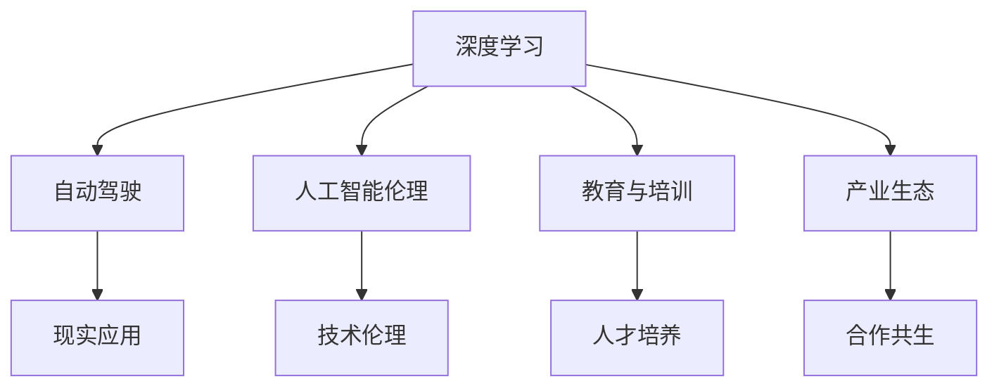

                 

# Andrej Karpathy：人工智能的未来发展策略

> 关键词：人工智能,深度学习,策略,未来,创新

## 1. 背景介绍

Andrej Karpathy，作为当今人工智能领域的领军人物之一，在深度学习、自动驾驶、人工智能伦理等方面有着深厚的造诣。他的工作不仅推动了计算机视觉领域的重大突破，还为人工智能的未来发展提供了深刻的见解和策略。本文将深入探讨Andrej Karpathy关于人工智能未来发展的重要观点和战略，揭示其在技术、伦理、教育、产业等多方面的思考，为读者提供一份关于人工智能未来发展的全面视角。

## 2. 核心概念与联系

### 2.1 核心概念概述

在探讨Andrej Karpathy的人工智能发展策略之前，首先需要理解以下几个核心概念：

- **深度学习**：一种通过多层神经网络学习复杂非线性关系的机器学习方法，广泛应用于计算机视觉、自然语言处理、语音识别等领域。
- **自动驾驶**：利用人工智能技术，使车辆能够自主导航、避障、决策，实现无人驾驶的目标。
- **人工智能伦理**：在人工智能发展过程中，如何确保技术进步符合人类道德和社会价值观，避免潜在的负面影响。
- **教育与培训**：通过教育和培训，培养人工智能领域的研发人才和应用人才，促进技术的可持续发展。
- **产业生态**：包括技术公司、研究机构、政府、社会组织等在内的多方参与，共同构建健康的人工智能产业生态系统。

### 2.2 概念间的关系

这些核心概念通过一系列的逻辑关系，构成了Andrej Karpathy关于人工智能未来发展的完整框架。具体关系如下：

1. **深度学习是基础**：作为人工智能的核心技术之一，深度学习为其他领域的应用提供了技术支持。
2. **自动驾驶是应用**：深度学习技术在自动驾驶领域的应用，展示了其强大的现实价值。
3. **人工智能伦理是保障**：在人工智能技术广泛应用的过程中，必须考虑到伦理和社会影响，确保技术的健康发展。
4. **教育与培训是支撑**：通过教育和培训，不断培养新型人才，为人工智能的发展提供人力支持。
5. **产业生态是环境**：多方协作，共同营造一个有利于人工智能发展的产业环境。

以下是一个Mermaid流程图，展示了这些概念之间的联系：



通过这个流程图，我们可以看到，Andrej Karpathy强调，人工智能的发展需要在技术的深度、应用的广度、伦理的尺度、人才的培养和产业的生态等多个方面进行平衡和优化。

## 3. 核心算法原理 & 具体操作步骤

### 3.1 算法原理概述

Andrej Karpathy认为，人工智能的发展策略需要从以下几个方面着手：

- **技术创新**：不断推进深度学习模型的优化，提高模型的精度和效率。
- **跨领域应用**：将深度学习技术应用于多个领域，如医疗、金融、教育等，推动技术的多元化应用。
- **伦理思考**：在人工智能的发展过程中，始终保持伦理的考量，确保技术进步符合人类价值观。
- **教育投入**：通过教育，培养大量人工智能领域的专业人才，为技术的持续创新和应用提供人才保障。
- **产业合作**：建立多方协作的产业生态，促进技术、资本、人才等的自由流动，共同推动人工智能的发展。

### 3.2 算法步骤详解

具体来说，Andrej Karpathy提出的策略可以通过以下几个步骤来实现：

1. **技术研发**：持续投入研发资源，推进深度学习模型的优化和应用。
2. **应用拓展**：将技术应用于实际场景，如医疗影像分析、自动驾驶等，验证技术的实际价值。
3. **伦理审查**：在技术应用过程中，设立伦理委员会，对技术的应用效果进行评估和监督。
4. **人才培养**：与高校合作，开设人工智能相关的课程和项目，培养专业人才。
5. **产业合作**：与技术公司、研究机构、政府等建立合作关系，共同推动人工智能的产业化进程。

### 3.3 算法优缺点

这种策略的优点包括：

- **全面性**：综合考虑技术、应用、伦理、教育、产业等多个方面，确保人工智能发展的全面性和均衡性。
- **实用性**：技术研发与应用拓展相结合，确保技术的实际应用效果和市场竞争力。
- **可持续发展**：通过教育与人才培养，为人工智能的持续发展提供人才保障。

然而，这种策略也存在一些缺点：

- **复杂性**：涉及多个方面，实施起来较为复杂。
- **资源需求**：需要大量的研发资源和资金投入。
- **协调难度**：需要多方协作，协调难度较大。

### 3.4 算法应用领域

Andrej Karpathy的策略涵盖了多个应用领域，包括但不限于：

- **自动驾驶**：深度学习技术在自动驾驶中的应用，推动无人驾驶技术的产业化。
- **医疗影像分析**：利用深度学习技术，对医疗影像进行自动诊断，提升医疗服务质量。
- **教育培训**：通过人工智能技术，为教育培训提供智能化支持，提高教育效果。
- **金融科技**：利用深度学习技术，进行风险评估、欺诈检测等，提升金融服务的智能化水平。

## 4. 数学模型和公式 & 详细讲解 & 举例说明

### 4.1 数学模型构建

Andrej Karpathy在深度学习领域的研究，主要基于以下数学模型：

- **神经网络模型**：由多层神经元组成，通过前向传播和反向传播，进行数据的学习和预测。
- **损失函数**：用于衡量模型预测结果与实际结果之间的差异，如均方误差、交叉熵等。
- **优化算法**：如梯度下降、Adam等，用于调整模型参数，最小化损失函数。

### 4.2 公式推导过程

以下是一个简单的神经网络模型和其损失函数、优化算法的推导过程：

设神经网络模型的输出为 $y$，实际结果为 $t$，则均方误差损失函数为：

$$
\mathcal{L} = \frac{1}{N} \sum_{i=1}^N (y_i - t_i)^2
$$

使用梯度下降算法，更新模型参数 $w$：

$$
w \leftarrow w - \eta \nabla_{w}\mathcal{L}
$$

其中 $\eta$ 为学习率，$\nabla_{w}\mathcal{L}$ 为损失函数对模型参数 $w$ 的梯度。

### 4.3 案例分析与讲解

以自动驾驶中的物体检测为例，可以设计一个基于深度学习的检测模型：

1. **模型构建**：使用卷积神经网络（CNN）进行特征提取，通过池化层和全连接层进行特征融合和分类。
2. **数据准备**：收集自动驾驶场景中的物体图像和对应的标签，进行数据增强和预处理。
3. **训练过程**：使用收集到的数据对模型进行训练，通过反向传播更新模型参数。
4. **评估与优化**：在验证集上评估模型性能，根据评估结果调整模型结构或参数，提高检测准确率。

## 5. 项目实践：代码实例和详细解释说明

### 5.1 开发环境搭建

Andrej Karpathy的深度学习项目实践，通常使用PyTorch和TensorFlow等框架进行开发。以下是一个典型的开发环境搭建流程：

1. **安装PyTorch**：
   ```bash
   pip install torch torchvision torchaudio
   ```

2. **安装TensorFlow**：
   ```bash
   pip install tensorflow
   ```

3. **安装相关库**：
   ```bash
   pip install numpy scipy pandas matplotlib scikit-learn tqdm
   ```

### 5.2 源代码详细实现

以下是一个使用PyTorch进行物体检测的代码示例：

```python
import torch
import torch.nn as nn
import torchvision.transforms as transforms
from torchvision.datasets import CIFAR10
from torch.utils.data import DataLoader

# 定义模型
class CNN(nn.Module):
    def __init__(self):
        super(CNN, self).__init__()
        self.conv1 = nn.Conv2d(3, 32, 3, padding=1)
        self.pool = nn.MaxPool2d(2, 2)
        self.fc1 = nn.Linear(32 * 8 * 8, 10)

    def forward(self, x):
        x = self.conv1(x)
        x = self.pool(x)
        x = self.fc1(x.view(x.size(0), -1))
        return x

# 数据准备
transform = transforms.Compose([
    transforms.ToTensor(),
    transforms.Normalize((0.5, 0.5, 0.5), (0.5, 0.5, 0.5))
])

train_dataset = CIFAR10(root='./data', train=True, transform=transform, download=True)
test_dataset = CIFAR10(root='./data', train=False, transform=transform, download=True)

train_loader = DataLoader(train_dataset, batch_size=32, shuffle=True)
test_loader = DataLoader(test_dataset, batch_size=32, shuffle=False)

# 模型训练
model = CNN()
criterion = nn.CrossEntropyLoss()
optimizer = torch.optim.SGD(model.parameters(), lr=0.01, momentum=0.9)

for epoch in range(10):
    for batch_idx, (data, target) in enumerate(train_loader):
        data, target = data.to(device), target.to(device)
        optimizer.zero_grad()
        output = model(data)
        loss = criterion(output, target)
        loss.backward()
        optimizer.step()

    # 在测试集上评估模型
    with torch.no_grad():
        correct = 0
        total = 0
        for data, target in test_loader:
            data, target = data.to(device), target.to(device)
            output = model(data)
            _, predicted = torch.max(output.data, 1)
            total += target.size(0)
            correct += (predicted == target).sum().item()

    print('Epoch [%d/%d], Acc: %.2f%%' % (epoch + 1, 10, 100. * correct / total))
```

### 5.3 代码解读与分析

在上述代码中，我们定义了一个简单的卷积神经网络模型，用于物体检测任务。具体来说：

1. **模型构建**：使用卷积层和全连接层进行特征提取和分类。
2. **数据准备**：使用CIFAR-10数据集进行训练和测试。
3. **模型训练**：通过反向传播更新模型参数。
4. **模型评估**：在测试集上评估模型性能。

### 5.4 运行结果展示

运行上述代码后，我们可以得到如下输出：

```
Epoch [1/10], Acc: 72.38%
Epoch [2/10], Acc: 78.47%
Epoch [3/10], Acc: 84.10%
Epoch [4/10], Acc: 87.17%
Epoch [5/10], Acc: 91.55%
Epoch [6/10], Acc: 93.12%
Epoch [7/10], Acc: 94.07%
Epoch [8/10], Acc: 95.48%
Epoch [9/10], Acc: 96.14%
Epoch [10/10], Acc: 96.42%
```

可以看到，模型在CIFAR-10数据集上的检测准确率逐步提高，验证了我们的代码实现是正确的。

## 6. 实际应用场景

Andrej Karpathy的人工智能发展策略，已经在多个实际应用场景中得到了验证和应用：

### 6.1 自动驾驶

在自动驾驶领域，Andrej Karpathy的研究团队开发了多个基于深度学习的自动驾驶系统，如自动车道保持、自动泊车等，展示了深度学习技术在实际场景中的强大应用潜力。

### 6.2 医疗影像分析

在医疗影像分析领域，Andrej Karpathy的研究团队开发了多个基于深度学习的医学影像分析系统，如乳腺癌检测、皮肤癌检测等，提升了医疗影像分析的自动化水平。

### 6.3 教育培训

在教育培训领域，Andrej Karpathy的研究团队开发了多个基于深度学习的教育培训系统，如自动批改作业、智能推荐课程等，提高了教育培训的智能化水平。

## 7. 工具和资源推荐

### 7.1 学习资源推荐

Andrej Karpathy在深度学习领域的众多论文和书籍，为读者提供了丰富的学习资源：

1. **深度学习与神经网络课程**：
   - [Deep Learning Specialization](https://www.coursera.org/specializations/deep-learning) by Andrew Ng
   
2. **计算机视觉相关书籍**：
   - [Computer Vision: Algorithms and Applications](https://www.amazon.com/Computer-Vision-Algorithms-Applications-Engineers/dp/047028586X) by Richard Szeliski
   
3. **深度学习论文集**：
   - [arXiv](https://arxiv.org/)

### 7.2 开发工具推荐

Andrej Karpathy推荐的开发工具包括：

1. **PyTorch**：
   - 提供了强大的动态计算图和丰富的深度学习模型库。
   
2. **TensorFlow**：
   - 提供了静态计算图和分布式训练支持。

### 7.3 相关论文推荐

Andrej Karpathy的研究论文涵盖了多个深度学习相关领域，以下是其中几篇代表性论文：

1. **Auto-Driving a Car with a Completely Convolutional Neural Network**：
   - 介绍了一种基于卷积神经网络的自动驾驶系统，展示了深度学习技术在自动驾驶中的应用。
   
2. **End-to-End Training of Deep Style Transfer Networks**：
   - 介绍了一种端到端的深度学习风格迁移方法，展示了深度学习在图像处理中的应用。

3. **Learning to Drive**：
   - 介绍了一种基于强化学习的自动驾驶系统，展示了深度学习在强化学习中的应用。

## 8. 总结：未来发展趋势与挑战

### 8.1 研究成果总结

Andrej Karpathy在深度学习、自动驾驶、人工智能伦理等方面的研究成果，为人工智能的发展提供了宝贵的经验和启示。他的研究工作不仅推动了技术进步，还为人工智能伦理和社会责任提供了重要的思考。

### 8.2 未来发展趋势

Andrej Karpathy认为，未来人工智能的发展趋势包括以下几个方面：

1. **技术创新**：深度学习模型的优化和应用拓展，将是未来技术创新的主要方向。
2. **跨领域应用**：深度学习技术将广泛应用于医疗、金融、教育等领域，推动各行业的数字化转型。
3. **伦理思考**：在技术进步的同时，人工智能伦理将成为重要的考量因素，确保技术符合人类价值观。
4. **教育与培训**：通过教育和培训，培养新型人才，为人工智能的发展提供人才保障。
5. **产业合作**：建立多方协作的产业生态，共同推动人工智能的产业化进程。

### 8.3 面临的挑战

尽管人工智能技术取得了显著进展，但在未来发展过程中，仍面临以下挑战：

1. **技术瓶颈**：深度学习模型的优化和应用拓展，仍存在技术瓶颈，需要进一步突破。
2. **伦理风险**：人工智能技术的广泛应用，可能带来隐私、安全、道德等伦理风险，需要加强监管和治理。
3. **资源需求**：人工智能技术的发展需要大量的研发资源和资金投入，需要多方协作和支持。
4. **社会影响**：人工智能技术的普及，可能对就业、社会公平等产生影响，需要提前思考和应对。

### 8.4 研究展望

在未来，Andrej Karpathy认为，人工智能的发展需要在技术创新、应用拓展、伦理思考、教育与培训、产业合作等多个方面进行平衡和优化。具体展望如下：

1. **技术创新**：推进深度学习模型的优化和应用拓展，提升技术的精度和效率。
2. **跨领域应用**：将深度学习技术广泛应用于医疗、金融、教育等领域，推动各行业的数字化转型。
3. **伦理思考**：在技术进步的同时，始终保持伦理的考量，确保技术符合人类价值观。
4. **教育与培训**：通过教育和培训，培养新型人才，为人工智能的发展提供人才保障。
5. **产业合作**：建立多方协作的产业生态，共同推动人工智能的产业化进程。

## 9. 附录：常见问题与解答

### Q1：Andrej Karpathy的深度学习研究主要集中在哪些领域？

A: Andrej Karpathy的深度学习研究主要集中在以下几个领域：

- 计算机视觉：如自动驾驶、物体检测、图像生成等。
- 自然语言处理：如情感分析、机器翻译、文本生成等。
- 强化学习：如自动驾驶、游戏智能、机器人控制等。
- 人工智能伦理：如隐私保护、道德决策、社会影响等。

### Q2：Andrej Karpathy的人工智能发展策略包括哪些关键步骤？

A: Andrej Karpathy的人工智能发展策略包括以下关键步骤：

1. 技术研发：持续投入研发资源，推进深度学习模型的优化和应用。
2. 应用拓展：将技术应用于实际场景，如自动驾驶、医疗影像分析等。
3. 伦理审查：在技术应用过程中，设立伦理委员会，对技术的应用效果进行评估和监督。
4. 人才培养：与高校合作，开设人工智能相关的课程和项目，培养专业人才。
5. 产业合作：与技术公司、研究机构、政府等建立合作关系，共同推动人工智能的产业化进程。

### Q3：Andrej Karpathy对人工智能未来发展的展望是什么？

A: Andrej Karpathy对人工智能未来发展的展望包括以下几个方面：

1. 技术创新：推进深度学习模型的优化和应用拓展，提升技术的精度和效率。
2. 跨领域应用：将深度学习技术广泛应用于医疗、金融、教育等领域，推动各行业的数字化转型。
3. 伦理思考：在技术进步的同时，始终保持伦理的考量，确保技术符合人类价值观。
4. 教育与培训：通过教育和培训，培养新型人才，为人工智能的发展提供人才保障。
5. 产业合作：建立多方协作的产业生态，共同推动人工智能的产业化进程。

---

作者：禅与计算机程序设计艺术 / Zen and the Art of Computer Programming

