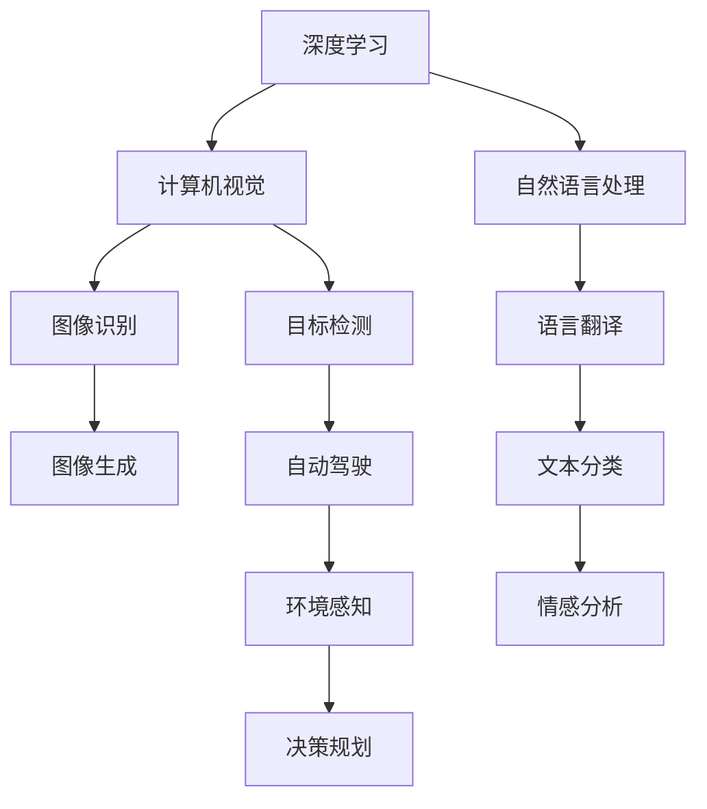

                 

# Andrej Karpathy：人工智能的未来发展规划

> 关键词：
- 人工智能
- 深度学习
- 自动驾驶
- 计算机视觉
- 自然语言处理
- 神经网络
- 强化学习

## 1. 背景介绍

Andrej Karpathy，斯坦福大学计算机视觉研究中心主任，世界顶级人工智能专家之一。他长期关注深度学习、计算机视觉与自动驾驶等前沿领域，并致力于推动人工智能技术的可持续发展。本文将从Andrej Karpathy的视角，展望未来人工智能的发展趋势，揭示技术创新背后的机遇与挑战。

### 1.1 问题由来

人工智能技术经过数十年的发展，正迎来新的变革。深度学习、计算机视觉、自然语言处理等领域取得了突破性进展，但面临的伦理、安全、可解释性等问题也愈发严峻。未来人工智能的发展道路充满未知，如何在技术和社会价值之间找到平衡点，是亟需解决的重大挑战。Andrej Karpathy通过在学术与工业界的多样化经验，为我们提供了深刻的洞见和前瞻性的观点。

## 2. 核心概念与联系

### 2.1 核心概念概述

本节将介绍一些关键的人工智能概念，并分析它们之间的联系：

- **深度学习**：通过神经网络结构，模拟人脑的信号处理过程，实现复杂数据的高效表示与学习。
- **计算机视觉**：使计算机能够理解和分析图像和视频数据，实现图像识别、目标检测、图像生成等任务。
- **自然语言处理**：使计算机能够理解和生成自然语言，实现语言翻译、文本分类、情感分析等任务。
- **自动驾驶**：通过环境感知、决策规划等技术，实现无人驾驶汽车的安全、高效运行。
- **强化学习**：通过智能体与环境交互，学习最优决策策略，实现自动控制、游戏AI等任务。

这些概念相互关联，共同推动了人工智能技术的进步。理解它们之间的联系，有助于把握未来发展的方向。

### 2.2 概念间的关系

以下Mermaid流程图展示了这些核心概念之间的联系：



通过这个流程图，我们可以看到深度学习是人工智能技术的基础，广泛应用于计算机视觉和自然语言处理，两者结合可以解决图像识别、目标检测、语言翻译等任务。此外，自然语言处理还应用于情感分析等任务，增强了计算机的语义理解能力。计算机视觉和自然语言处理是自动驾驶的核心技术，通过环境感知和决策规划，实现了无人驾驶汽车的安全行驶。强化学习则通过智能体与环境交互，实现自动控制和游戏AI等任务。

## 3. 核心算法原理 & 具体操作步骤

### 3.1 算法原理概述

人工智能技术的核心在于算法，深度学习、计算机视觉、自然语言处理等领域的算法原理各不相同，但共同的目标是提高模型的泛化能力和推理能力。

- **深度学习**：通过多层次的非线性变换，学习数据的复杂表示。典型算法包括卷积神经网络(CNN)、循环神经网络(RNN)、变分自编码器(VAE)等。
- **计算机视觉**：通过卷积神经网络、卷积自动编码器等，学习图像的特征表示。
- **自然语言处理**：通过循环神经网络、Transformer等，学习文本的语义表示。

### 3.2 算法步骤详解

这里以自然语言处理的Transformer为例，展示深度学习算法的基本步骤：

1. **模型构建**：定义神经网络的结构，如卷积层、循环层、全连接层等。
2. **参数初始化**：随机初始化模型的权重和偏置。
3. **数据预处理**：将输入数据转换为模型可接受的格式，如分词、向量化等。
4. **前向传播**：将输入数据输入模型，计算模型的输出。
5. **损失计算**：计算模型输出与真实标签之间的差异，定义损失函数。
6. **反向传播**：通过梯度下降等优化算法，更新模型的权重和偏置，最小化损失函数。
7. **模型评估**：使用验证集或测试集，评估模型的性能。

### 3.3 算法优缺点

- **优点**：深度学习算法具有强大的特征表示能力，能够处理复杂数据。算法框架灵活多样，适用于多种应用场景。
- **缺点**：模型复杂度较高，训练和推理速度较慢。需要大量标注数据，模型泛化能力存在不确定性。

### 3.4 算法应用领域

深度学习算法广泛应用于计算机视觉、自然语言处理、自动驾驶、语音识别等领域，取得了显著的成果。

- **计算机视觉**：用于图像识别、目标检测、图像生成等任务。
- **自然语言处理**：用于语言翻译、文本分类、情感分析等任务。
- **自动驾驶**：用于环境感知、决策规划等任务。
- **语音识别**：用于语音转文本、语音合成等任务。

## 4. 数学模型和公式 & 详细讲解

### 4.1 数学模型构建

以下以Transformer模型为例，展示深度学习模型的基本数学模型：

- **输入数据**：$x_1, x_2, ..., x_n$
- **模型参数**：$W^{l_x}, W^{l_h}, b^{l_x}, b^{l_h}$
- **模型结构**：$x \to \text{FFN} \to x$

其中，FFN表示全连接层。模型的目标是最大化输出与真实标签之间的似然概率。

### 4.2 公式推导过程

以下推导Transformer模型的基本公式：

1. **输入表示**：将输入数据表示为向量形式，即$x = [x_1, x_2, ..., x_n] \in \mathbb{R}^{n \times d_x}$
2. **编码器输出**：通过多个编码器层，将输入数据表示为$h = [h_1, h_2, ..., h_n] \in \mathbb{R}^{n \times d_h}$
3. **解码器输出**：通过多个解码器层，将编码器输出表示为$y = [y_1, y_2, ..., y_n] \in \mathbb{R}^{n \times d_y}$
4. **损失函数**：定义交叉熵损失函数，即$L = -\sum_{i=1}^{n} \log p(y_i|x_i)$

其中，$p$表示模型的预测概率。通过最小化损失函数，优化模型参数，使得模型的输出与真实标签更接近。

### 4.3 案例分析与讲解

以图像识别任务为例，展示深度学习模型的应用：

1. **数据准备**：收集并标注大量图像数据，将图像转换为向量形式。
2. **模型训练**：使用卷积神经网络进行模型训练，优化模型参数。
3. **模型评估**：在测试集上评估模型的性能，计算准确率、召回率等指标。
4. **模型部署**：将模型部署到实际应用中，实现图像识别功能。

## 5. 项目实践：代码实例和详细解释说明

### 5.1 开发环境搭建

搭建深度学习开发环境，包括安装Python、PyTorch、TensorFlow等工具包，以及配置开发工具如Jupyter Notebook等。

### 5.2 源代码详细实现

以下展示使用TensorFlow实现卷积神经网络的代码：

```python
import tensorflow as tf
from tensorflow.keras.layers import Conv2D, MaxPooling2D, Flatten, Dense

# 定义卷积神经网络模型
model = tf.keras.Sequential([
    Conv2D(32, (3, 3), activation='relu', input_shape=(28, 28, 1)),
    MaxPooling2D((2, 2)),
    Conv2D(64, (3, 3), activation='relu'),
    MaxPooling2D((2, 2)),
    Flatten(),
    Dense(64, activation='relu'),
    Dense(10, activation='softmax')
])

# 编译模型
model.compile(optimizer='adam', loss='sparse_categorical_crossentropy', metrics=['accuracy'])

# 训练模型
model.fit(train_images, train_labels, epochs=10, validation_data=(val_images, val_labels))
```

### 5.3 代码解读与分析

- **模型定义**：使用Sequential模型定义卷积神经网络的结构，包括卷积层、池化层、全连接层等。
- **模型编译**：指定优化器、损失函数、评估指标，编译模型。
- **模型训练**：使用fit方法训练模型，指定训练集、验证集、训练轮数等参数。
- **模型评估**：在测试集上评估模型性能，输出准确率、损失等指标。

### 5.4 运行结果展示

训练完成后，使用测试集评估模型性能，输出准确率、损失等指标：

```python
test_loss, test_acc = model.evaluate(test_images, test_labels)
print('Test accuracy:', test_acc)
```

## 6. 实际应用场景

### 6.1 自动驾驶

自动驾驶是人工智能的重要应用领域之一，涉及计算机视觉、深度学习、强化学习等技术。通过环境感知、决策规划等技术，实现无人驾驶汽车的安全、高效运行。

- **环境感知**：通过摄像头、雷达等设备，收集车辆周围环境信息，构建高精度的环境地图。
- **决策规划**：通过深度学习算法，优化驾驶策略，实现路径规划、交通流预测等任务。
- **行为控制**：通过强化学习算法，训练智能体，实现车辆的自主控制。

### 6.2 计算机视觉

计算机视觉是人工智能的重要分支，涉及图像识别、目标检测、图像生成等任务。

- **图像识别**：通过卷积神经网络，实现图像分类、物体检测等任务。
- **图像生成**：通过生成对抗网络(GAN)等，生成逼真的图像，用于图像修复、虚拟现实等任务。
- **视觉问答**：通过视觉语义理解技术，实现对图像内容的理解和生成，用于智能问答、图像标注等任务。

### 6.3 自然语言处理

自然语言处理是人工智能的重要分支，涉及语言翻译、文本分类、情感分析等任务。

- **语言翻译**：通过神经机器翻译模型，实现不同语言之间的翻译。
- **文本分类**：通过循环神经网络、Transformer等，实现文本分类任务。
- **情感分析**：通过文本分类模型，分析文本情感倾向，用于舆情监测、用户反馈分析等任务。

## 7. 工具和资源推荐

### 7.1 学习资源推荐

以下是一些推荐的学习资源：

- **深度学习课程**：斯坦福大学CS231n《卷积神经网络》课程，系统讲解深度学习算法。
- **计算机视觉课程**：麻省理工学院6.S191《计算机视觉基础》课程，深入介绍计算机视觉技术。
- **自然语言处理课程**：斯坦福大学CS224N《深度学习自然语言处理》课程，详细讲解自然语言处理技术。
- **自动驾驶课程**：伯克利大学《Autonomous Vehicles》课程，系统介绍自动驾驶技术。

### 7.2 开发工具推荐

以下是一些推荐的开发工具：

- **Python**：深度学习开发的首选语言。
- **PyTorch**：深度学习框架，支持动态计算图，易于调试和优化。
- **TensorFlow**：深度学习框架，支持分布式计算，适用于大规模训练。
- **Jupyter Notebook**：交互式开发环境，方便编写和调试代码。

### 7.3 相关论文推荐

以下是一些推荐的论文：

- **卷积神经网络**：AlexNet论文，介绍卷积神经网络的基本结构和训练方法。
- **循环神经网络**：LSTM论文，介绍长短期记忆网络的基本结构和训练方法。
- **Transformer**：Transformer论文，介绍Transformer网络的结构和训练方法。
- **强化学习**：AlphaGo论文，介绍强化学习在围棋游戏中的应用。

## 8. 总结：未来发展趋势与挑战

### 8.1 研究成果总结

深度学习、计算机视觉、自然语言处理等技术在过去几年取得了显著进展，推动了人工智能技术的发展。然而，这些技术也面临着伦理、安全、可解释性等问题，需要进一步研究和探索。

### 8.2 未来发展趋势

未来人工智能技术的发展趋势包括以下几个方面：

1. **深度学习与多模态融合**：将深度学习与计算机视觉、自然语言处理等技术结合，实现多模态数据的融合和协同学习。
2. **自动驾驶与智能交通**：通过计算机视觉和深度学习技术，实现无人驾驶汽车的安全、高效运行，推动智能交通的发展。
3. **自然语言处理与人工智能交互**：通过自然语言处理技术，实现人机交互的智能化和自然化，推动人工智能技术的普及和应用。
4. **强化学习与游戏AI**：通过强化学习技术，实现游戏AI的智能化和复杂化，推动游戏产业的发展。

### 8.3 面临的挑战

人工智能技术的发展也面临诸多挑战，包括以下几个方面：

1. **伦理与安全**：人工智能技术可能带来伦理和安全问题，如隐私泄露、自动化失业等，需要加强监管和规范。
2. **可解释性**：深度学习模型的决策过程缺乏可解释性，难以进行解释和调试，需要发展可解释性技术和方法。
3. **计算资源**：深度学习模型的训练和推理需要大量的计算资源，需要提高计算效率和资源利用率。
4. **数据隐私**：人工智能技术需要大量数据进行训练，数据隐私和安全问题需要得到充分保障。

### 8.4 研究展望

未来人工智能技术的研究展望包括以下几个方面：

1. **深度学习与多模态融合**：研究多模态数据融合技术，提高模型的泛化能力和鲁棒性。
2. **自动驾驶与智能交通**：研究智能驾驶算法和系统，推动自动驾驶技术的普及和应用。
3. **自然语言处理与人工智能交互**：研究人机交互技术，推动自然语言处理技术的普及和应用。
4. **强化学习与游戏AI**：研究强化学习算法和系统，推动游戏AI的智能化和复杂化。

## 9. 附录：常见问题与解答

### Q1：深度学习与多模态融合的挑战是什么？

A：深度学习与多模态融合的挑战包括：
1. **数据对齐**：不同模态的数据具有不同的特征，难以进行统一对齐和融合。
2. **模型复杂性**：多模态数据融合的模型较为复杂，需要更多的计算资源和时间。
3. **融合效果**：多模态数据融合的效果存在不确定性，需要进一步优化和改进。

### Q2：自动驾驶技术的主要难点是什么？

A：自动驾驶技术的主要难点包括：
1. **环境感知**：实现高精度的环境感知和地图构建，需要处理复杂的感知数据和算法。
2. **决策规划**：优化驾驶策略，实现路径规划和交通流预测，需要复杂的决策算法和模型。
3. **行为控制**：实现车辆的自主控制，需要强大的实时计算能力和控制算法。

### Q3：自然语言处理技术的未来方向是什么？

A：自然语言处理技术的未来方向包括：
1. **语义理解**：提升对自然语言的语义理解能力，实现更准确的文本分类和情感分析。
2. **对话系统**：实现更加智能和自然的对话系统，推动人机交互的发展。
3. **跨语言处理**：实现多语言的自然语言处理，推动语言之间的理解和沟通。

### Q4：如何提高深度学习模型的可解释性？

A：提高深度学习模型的可解释性需要以下方法：
1. **可视化技术**：使用可视化技术，展示模型的决策过程和特征表示。
2. **层级解释**：将模型分层解释，帮助理解每个层次的特征和决策。
3. **数据扰动**：使用数据扰动技术，分析模型的鲁棒性和泛化能力。

### Q5：如何保障数据隐私和安全？

A：保障数据隐私和安全需要以下方法：
1. **数据加密**：对数据进行加密处理，保护数据的隐私和安全。
2. **访问控制**：设置访问控制机制，限制数据的访问和使用。
3. **数据匿名化**：对数据进行匿名化处理，保护用户隐私。

---

作者：禅与计算机程序设计艺术 / Zen and the Art of Computer Programming

