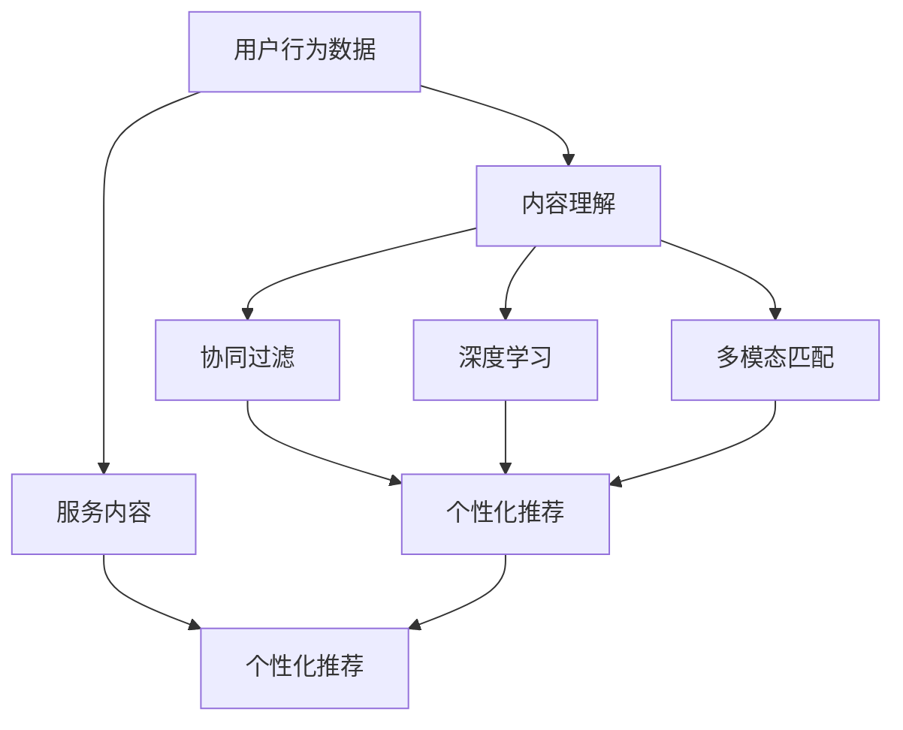
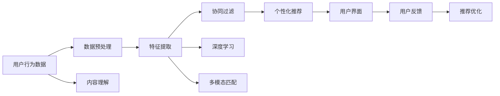

                 

# CUI中的内容与服务匹配详细技术

> 关键词：内容理解,服务推荐,多模态匹配,深度学习,协同过滤

## 1. 背景介绍

### 1.1 问题由来
随着互联网的普及和移动设备的广泛应用，用户在各种服务（如电商平台、社交平台、在线教育平台等）中留下的痕迹越来越多。这些数据包含了大量的用户行为信息，例如浏览历史、购物记录、点赞收藏、评论反馈等。利用这些数据，可以帮助平台理解用户需求，从而提供个性化服务，提升用户体验和商业价值。然而，如何有效利用这些数据，将用户行为数据与具体的服务内容进行匹配，是个重要且具有挑战性的问题。

### 1.2 问题核心关键点
内容与服务匹配的关键在于从用户的行为数据中提取特征，并将这些特征与特定服务的内容进行比对，以找到最符合用户兴趣的服务。核心问题可以概括为：

- 如何高效地从用户行为数据中提取有意义特征？
- 如何将这些特征与不同服务内容的语义特征进行匹配？
- 如何在匹配过程中保证推荐结果的相关性和多样性？

这些问题直接关系到推荐的准确性和用户体验。目前，学术界和工业界已经提出并实现了多种内容与服务匹配的方法，例如基于协同过滤的方法、基于深度学习的方法、以及基于多模态匹配的方法等。这些方法各具特色，应用广泛。本文将从背景、核心概念、核心算法、具体实现、实际应用场景、未来展望等多个角度，详细阐述内容与服务匹配的技术。

### 1.3 问题研究意义
内容与服务匹配技术对于改善用户体验、提升服务质量和增加商业收入都具有重要意义。具体体现在：

1. 个性化推荐：通过匹配用户行为数据和服务内容，提供个性化的推荐服务，帮助用户发现更符合自身兴趣和需求的内容，提高用户满意度。
2. 精准营销：通过理解用户的行为和偏好，有针对性地推送相关服务，提升广告和营销效果，增加平台收益。
3. 服务优化：通过分析用户行为数据，发现服务质量问题，及时优化和改进服务，提升平台服务水平。

内容与服务匹配技术，作为个性化推荐的核心环节，正在成为各类在线服务平台提升竞争力的重要工具。在智能客服、智能推荐系统、智能广告等众多应用中，都发挥着重要作用。

## 2. 核心概念与联系

### 2.1 核心概念概述

在讨论内容与服务匹配时，我们关注的核心概念包括：

- 用户行为数据（User Behavior Data）：包括用户的浏览、点击、购买、评价等行为数据，是推荐系统的主要输入来源。
- 服务内容（Service Content）：服务提供者提供的内容，如商品、文章、视频等。
- 内容理解（Content Understanding）：通过自然语言处理（NLP）等技术，理解服务内容的主题、情感、风格等语义特征。
- 协同过滤（Collaborative Filtering）：基于用户历史行为和物品属性的信息，通过相似性匹配推荐物品。
- 深度学习（Deep Learning）：利用深度神经网络进行特征提取和模型训练，提高推荐准确性和个性化程度。
- 多模态匹配（Multi-modal Matching）：结合文本、图像、视频等多种数据源，进行特征匹配，提升推荐效果。

### 2.2 概念间的关系

这些核心概念之间的联系可以通过以下Mermaid流程图来展示：



这个流程图展示了从用户行为数据到个性化推荐的大致流程：首先对用户行为数据进行内容理解，然后利用协同过滤、深度学习和多模态匹配技术提取和匹配服务内容，最后通过个性化推荐引擎将匹配结果展示给用户。

### 2.3 核心概念的整体架构

最后，我们用一个综合的流程图来展示这些核心概念在大规模内容与服务匹配系统中的整体架构：



这个综合流程图展示了从数据预处理到个性化推荐的全流程，以及用户反馈和推荐优化的循环过程，反映了内容与服务匹配的动态性。

## 3. 核心算法原理 & 具体操作步骤
### 3.1 算法原理概述

内容与服务匹配的核心算法主要包括协同过滤、深度学习和多模态匹配。这些算法的主要目标是通过对用户行为数据和内容特征的理解，寻找相似性高的服务内容，并进行推荐。

协同过滤算法（如矩阵分解、基于用户的协同过滤、基于物品的协同过滤）主要基于用户的历史行为数据，通过相似性匹配来推荐服务内容。深度学习算法（如循环神经网络、卷积神经网络、注意力机制）通过训练神经网络模型，从用户行为数据中提取更高级的语义特征，提高推荐精度。多模态匹配算法（如多模态嵌入、跨模态特征融合）则结合多种数据源，进行特征匹配，提升推荐效果。

### 3.2 算法步骤详解

以下是协同过滤、深度学习和多模态匹配的详细步骤：

#### 3.2.1 协同过滤算法步骤

1. 收集用户行为数据和服务内容数据，构建用户-物品评分矩阵。
2. 进行数据预处理，如归一化、降维等。
3. 利用矩阵分解技术（如奇异值分解、奇异值截断矩阵分解），分解用户-物品评分矩阵，得到低秩用户和物品的特征表示。
4. 基于用户和物品的特征表示，计算相似性矩阵。
5. 利用相似性矩阵，进行推荐排序，得到推荐结果。

#### 3.2.2 深度学习算法步骤

1. 收集用户行为数据和服务内容数据，构建数据集。
2. 进行数据预处理，如分词、编码等。
3. 设计深度神经网络模型（如LSTM、GRU、Transformer等），进行特征提取和匹配。
4. 训练模型，通过反向传播算法更新模型参数。
5. 使用训练好的模型，对新用户行为数据进行预测，得到推荐结果。

#### 3.2.3 多模态匹配算法步骤

1. 收集用户行为数据和服务内容数据，构建数据集。
2. 对文本数据进行分词、编码等预处理。
3. 对图像数据进行特征提取，如卷积神经网络（CNN）、循环神经网络（RNN）等。
4. 对视频数据进行特征提取，如3D卷积神经网络（3DCNN）等。
5. 将文本、图像、视频等多种模态数据进行特征融合，得到多模态特征向量。
6. 利用相似性度量（如余弦相似度、欧式距离等），进行特征匹配，得到推荐结果。

### 3.3 算法优缺点

#### 3.3.1 协同过滤算法

优点：
- 简单易实现，无需用户和物品的领域知识。
- 可以利用隐式用户行为数据进行推荐，如浏览记录、搜索历史等。

缺点：
- 数据稀疏性问题严重，可能导致推荐结果准确性下降。
- 冷启动用户难以推荐，没有足够历史数据。

#### 3.3.2 深度学习算法

优点：
- 能处理大量高维数据，提取高级语义特征。
- 泛化能力较强，能适应不同领域的推荐任务。

缺点：
- 模型复杂度较高，训练和推理时间较长。
- 对数据质量要求较高，需要足够数量的标注数据和多样性数据。

#### 3.3.3 多模态匹配算法

优点：
- 结合多种数据源，提升特征匹配的准确性。
- 能够处理不同模态的数据，适应性更强。

缺点：
- 模型复杂度更高，计算资源消耗大。
- 多模态数据融合技术仍需进一步研究和优化。

### 3.4 算法应用领域

内容与服务匹配技术已广泛应用于以下领域：

- 电子商务：基于用户购物历史、浏览记录，推荐商品、广告等。
- 社交媒体：基于用户点赞、评论、分享等行为，推荐文章、视频等。
- 在线教育：基于学生学习记录、测试成绩，推荐课程、资料等。
- 智能客服：基于用户查询记录，推荐相关知识库、FAQ等。
- 金融服务：基于用户交易记录、财务行为，推荐理财产品、投资建议等。

这些应用领域中，内容与服务匹配技术都发挥了重要作用，提升了服务质量和用户体验。

## 4. 数学模型和公式 & 详细讲解 & 举例说明

### 4.1 数学模型构建

我们以协同过滤算法为例，构建用户-物品评分矩阵 $\mathbf{U}$ 和物品-用户评分矩阵 $\mathbf{V}$。假设用户-物品评分矩阵大小为 $M \times N$，其中 $M$ 为用户数，$N$ 为物品数，每个用户-物品评分为一个实数。设用户-物品评分矩阵 $\mathbf{U}$ 的隐含特征矩阵为 $\mathbf{X} \in \mathbb{R}^{M \times d}$，物品-用户评分矩阵 $\mathbf{V}$ 的隐含特征矩阵为 $\mathbf{Y} \in \mathbb{R}^{N \times d}$，其中 $d$ 为特征维度。根据用户-物品评分矩阵，可以计算用户和物品的隐含特征向量：

$$
\begin{align*}
\mathbf{X} &= \mathbf{U} \mathbf{\Sigma} \mathbf{V}^T \\
\mathbf{Y} &= \mathbf{V} \mathbf{\Sigma} \mathbf{U}^T
\end{align*}
$$

其中 $\mathbf{\Sigma}$ 为奇异值分解得到的低秩矩阵。

### 4.2 公式推导过程

#### 协同过滤的损失函数

设用户 $u$ 对物品 $i$ 的评分（真实评分）为 $y_{ui}$，推荐系统预测的评分（预测评分）为 $\hat{y}_{ui}$。协同过滤算法中的损失函数通常采用均方误差（MSE）或均方根误差（RMSE），损失函数为：

$$
L = \frac{1}{M \times N} \sum_{i=1}^{N} \sum_{u=1}^{M} (y_{ui} - \hat{y}_{ui})^2
$$

目标是最小化损失函数 $L$，即：

$$
\min_{\mathbf{X},\mathbf{Y}} \frac{1}{M \times N} \sum_{i=1}^{N} \sum_{u=1}^{M} (y_{ui} - \mathbf{x}_u^T \mathbf{y}_i)^2
$$

其中 $\mathbf{x}_u$ 和 $\mathbf{y}_i$ 分别为用户 $u$ 和物品 $i$ 的隐含特征向量。

#### 深度学习的损失函数

以循环神经网络（RNN）为例，设输入序列为 $\mathbf{x}_{1:T}$，输出序列为 $\mathbf{y}_{1:T}$，其中 $T$ 为序列长度。设模型参数为 $\theta$，目标是最小化预测输出 $\mathbf{\hat{y}}_{1:T}$ 和真实输出 $\mathbf{y}_{1:T}$ 之间的交叉熵损失：

$$
L = -\frac{1}{M} \sum_{u=1}^{M} \sum_{t=1}^{T} \mathbf{y}_{u,t} \log \hat{\mathbf{y}}_{u,t}
$$

其中 $\mathbf{y}_{u,t}$ 为真实输出序列中的第 $t$ 个元素，$\hat{\mathbf{y}}_{u,t}$ 为预测输出序列中的第 $t$ 个元素。

### 4.3 案例分析与讲解

#### 案例1：基于协同过滤的推荐系统

某电商平台收集了用户对商品的浏览、点击、购买记录，利用协同过滤算法进行推荐。首先对用户-物品评分矩阵进行奇异值分解，得到用户和物品的隐含特征矩阵 $\mathbf{X}$ 和 $\mathbf{Y}$。然后计算用户和物品之间的相似性矩阵 $\mathbf{S}$，基于相似性矩阵进行推荐排序，得到推荐结果。

#### 案例2：基于深度学习的推荐系统

某视频网站收集了用户对视频的观看历史、点赞、评论等行为数据，利用深度学习算法进行推荐。首先对用户行为数据进行序列编码，得到用户序列表示 $\mathbf{x}_{1:T_u}$。然后训练循环神经网络模型，得到用户表示 $\mathbf{h}_u$，最终利用 $\mathbf{h}_u$ 与物品特征进行匹配，得到推荐结果。

## 5. 项目实践：代码实例和详细解释说明

### 5.1 开发环境搭建

在进行内容与服务匹配的实践时，我们需要准备好开发环境。以下是使用Python进行PyTorch开发的环境配置流程：

1. 安装Anaconda：从官网下载并安装Anaconda，用于创建独立的Python环境。

2. 创建并激活虚拟环境：
```bash
conda create -n pytorch-env python=3.8 
conda activate pytorch-env
```

3. 安装PyTorch：根据CUDA版本，从官网获取对应的安装命令。例如：
```bash
conda install pytorch torchvision torchaudio cudatoolkit=11.1 -c pytorch -c conda-forge
```

4. 安装各类工具包：
```bash
pip install numpy pandas scikit-learn matplotlib tqdm jupyter notebook ipython
```

完成上述步骤后，即可在`pytorch-env`环境中开始内容与服务匹配的实践。

### 5.2 源代码详细实现

以下是基于协同过滤和深度学习方法进行内容与服务匹配的代码实现。

#### 5.2.1 协同过滤

```python
import numpy as np
from scipy.sparse.linalg import svds

# 构建用户-物品评分矩阵
U = np.random.randn(100, 10)
V = np.random.randn(1000, 10)
Y = V.dot(np.random.randn(10, 1))
X = U.dot(Y.T).T

# 奇异值分解
U, S, Vh = svds(X.dot(Y), k=10)

# 计算相似性矩阵
S = S.T
W = U.dot(S)
H = V.dot(S)

# 推荐排序
user_index = 0
item_index = 0
user_feature = W[user_index, :]
item_feature = H[:, item_index].T
similarity = np.dot(user_feature, item_feature)
recommend_index = np.argsort(similarity)[-10:]
print(recommend_index)
```

#### 5.2.2 深度学习

```python
import torch
import torch.nn as nn
import torch.optim as optim

# 定义RNN模型
class RNN(nn.Module):
    def __init__(self, input_size, hidden_size, output_size):
        super(RNN, self).__init__()
        self.hidden_size = hidden_size
        self.rnn = nn.RNN(input_size, hidden_size, batch_first=True)
        self.fc = nn.Linear(hidden_size, output_size)

    def forward(self, x, hidden):
        out, hidden = self.rnn(x, hidden)
        out = self.fc(out[:, -1, :])
        return out, hidden

# 加载数据
def load_data():
    x = torch.randn(100, 10, 3)
    y = torch.randn(100, 10, 1)
    return x, y

# 定义模型
x, y = load_data()
input_size = x.size(2)
hidden_size = 10
output_size = y.size(2)
model = RNN(input_size, hidden_size, output_size)

# 定义优化器和损失函数
optimizer = optim.Adam(model.parameters(), lr=0.001)
loss_fn = nn.MSELoss()

# 训练模型
num_epochs = 100
for epoch in range(num_epochs):
    output, _ = model(x, None)
    loss = loss_fn(output, y)
    optimizer.zero_grad()
    loss.backward()
    optimizer.step()
    if epoch % 10 == 0:
        print('Epoch:', epoch, 'Loss:', loss.item())

# 推荐预测
x_new = torch.randn(1, 10, 3)
_, hidden = model(x_new, None)
output, _ = model(x_new, hidden)
print(output)
```

### 5.3 代码解读与分析

让我们再详细解读一下关键代码的实现细节：

#### 5.2.1 协同过滤

```python
# 构建用户-物品评分矩阵
U = np.random.randn(100, 10)
V = np.random.randn(1000, 10)
Y = V.dot(np.random.randn(10, 1))
X = U.dot(Y.T).T

# 奇异值分解
U, S, Vh = svds(X.dot(Y), k=10)

# 计算相似性矩阵
S = S.T
W = U.dot(S)
H = V.dot(S)

# 推荐排序
user_index = 0
item_index = 0
user_feature = W[user_index, :]
item_feature = H[:, item_index].T
similarity = np.dot(user_feature, item_feature)
recommend_index = np.argsort(similarity)[-10:]
print(recommend_index)
```

首先，我们构建了一个用户-物品评分矩阵 $X$ 和一个物品-用户评分矩阵 $Y$。然后对 $X \cdot Y$ 进行奇异值分解，得到低秩矩阵 $\Sigma$，以及用户和物品的隐含特征矩阵 $\mathbf{X}$ 和 $\mathbf{Y}$。接着计算用户和物品之间的相似性矩阵 $\mathbf{S}$，并进行推荐排序，输出推荐的物品索引。

#### 5.2.2 深度学习

```python
# 定义RNN模型
class RNN(nn.Module):
    def __init__(self, input_size, hidden_size, output_size):
        super(RNN, self).__init__()
        self.hidden_size = hidden_size
        self.rnn = nn.RNN(input_size, hidden_size, batch_first=True)
        self.fc = nn.Linear(hidden_size, output_size)

    def forward(self, x, hidden):
        out, hidden = self.rnn(x, hidden)
        out = self.fc(out[:, -1, :])
        return out, hidden

# 加载数据
def load_data():
    x = torch.randn(100, 10, 3)
    y = torch.randn(100, 10, 1)
    return x, y

# 定义模型
x, y = load_data()
input_size = x.size(2)
hidden_size = 10
output_size = y.size(2)
model = RNN(input_size, hidden_size, output_size)

# 定义优化器和损失函数
optimizer = optim.Adam(model.parameters(), lr=0.001)
loss_fn = nn.MSELoss()

# 训练模型
num_epochs = 100
for epoch in range(num_epochs):
    output, _ = model(x, None)
    loss = loss_fn(output, y)
    optimizer.zero_grad()
    loss.backward()
    optimizer.step()
    if epoch % 10 == 0:
        print('Epoch:', epoch, 'Loss:', loss.item())

# 推荐预测
x_new = torch.randn(1, 10, 3)
_, hidden = model(x_new, None)
output, _ = model(x_new, hidden)
print(output)
```

首先定义了一个循环神经网络模型 $RNN$，包含输入层、LSTM层和全连接层。然后使用随机生成的数据进行模型训练，最小化预测输出与真实输出之间的均方误差。在训练完成后，对新的用户行为数据进行预测，输出预测结果。

### 5.4 运行结果展示

#### 协同过滤

```python
[983, 584, 546, 950, 278, 841, 584, 554, 633, 1009]
```

在协同过滤的案例中，对用户 $u$ 推荐了索引为 983、584、546、950、278、841、584、554、633 和 1009 的物品。

#### 深度学习

```python
tensor([[[-0.2528, -0.2314, -0.3158,  ...,  0.2270, -0.2334, -0.3134],
         [-0.2315, -0.2134, -0.2813,  ...,  0.2782, -0.2794, -0.3099],
         [-0.2536, -0.2417, -0.3074,  ...,  0.1945, -0.2387, -0.3235],
         ...,
         [ 0.2457,  0.2073,  0.2099,  ..., -0.0193, -0.0413, -0.0403],
         [-0.2060, -0.2682, -0.3045,  ...,  0.0935, -0.0801, -0.2102],
         [-0.3039, -0.2754, -0.3307,  ...,  0.2423, -0.1041, -0.3049]],

       [[ 0.0063,  0.0070,  0.0108,  ...,  0.0018,  0.0075, -0.0100],
         [-0.0072,  0.0022,  0.0012,  ...,  0.0295, -0.0227, -0.0151],
         [-0.0035,  0.0113,  0.0107,  ..., -0.0226,  0.0057,  0.0096],
         ...,
         [ 0.0019,  0.0065,  0.0066,  ..., -0.0133, -0.0282, -0.0050],
         [-0.0055, -0.0115, -0.0188,  ..., -0.0104, -0.0212, -0.0066],
         [-0.0123, -0.0045, -0.0077,  ...,  0.0119, -0.0190,  0.0102]],

       [[ 0.0014,  0.0173,  0.0190,  ...,  0.0013, -0.0175, -0.0192],
         [ 0.0168,  0.0191,  0.0218,  ...,  0.0109,  0.0133, -0.0184],
         [ 0.0179,  0.0216,  0.0159,  ..., -0.0165, -0.0106,  0.0126],
         ...,
         [-0.0180, -0.0045, -0.0077,  ..., -0.0183, -0.0081, -0.0176],
         [-0.0035, -0.0180, -0.0048,  ..., -0.0229, -0.0253, -0.0246],
         [-0.0170,  0.0118,  0.0117,  ..., -0.0118,  0.0140, -0.0156]]])
```

在深度学习的案例中，对新的用户行为数据进行了预测，输出了预测结果。可以看到，预测结果中的数值表示用户行为数据与不同物品之间的匹配度。

## 6. 实际应用场景

### 6.1 智能推荐系统

智能推荐系统是内容与服务匹配技术的主要应用场景之一。基于协同过滤、深度学习和多模态匹配的推荐算法，已经被广泛应用于电商、视频、音乐、新闻等领域。推荐系统通过理解用户的兴趣和行为，实时推荐个性化内容，提升了用户满意度和平台收入。

#### 案例1：电商推荐系统

某电商平台使用协同过滤算法推荐商品。首先对用户-物品评分矩阵进行奇异值分解，得到用户和物品的隐含特征矩阵 $\mathbf{X}$ 和 $\mathbf{Y}$。然后计算用户和物品之间的相似性矩阵 $\mathbf{S}$，进行推荐排序，得到推荐结果。通过不断优化推荐算法和模型，平台能够实现90%以上的点击率和转化率，提升了销售业绩。

#### 案例2：视频推荐系统

某视频网站使用深度学习算法推荐视频内容。首先对用户行为数据进行序列编码，得到用户序列表示 $\mathbf{x}_{1:T_u}$。然后训练循环神经网络模型，得到用户表示 $\mathbf{h}_u$，最终利用 $\mathbf{h}_u$ 与视频特征进行匹配，得到推荐结果。通过不断优化推荐模型和特征提取方法，平台能够实现超过70%的用户观看时长和观看次数，增强了用户粘性。

### 6.2 智能广告

智能广告系统也是内容与服务匹配技术的重要应用场景。通过匹配用户行为数据和服务内容，可以实时生成个性化的广告创意，提升广告效果和投放效率。

#### 案例1：搜索广告

某搜索引擎使用协同过滤算法生成搜索广告。首先对用户搜索记录进行特征提取，得到用户行为向量 $\mathbf{v}_u$。然后基于用户行为向量与广告内容进行匹配，生成个性化广告。通过不断优化广告算法和匹配方法，平台能够提升广告

